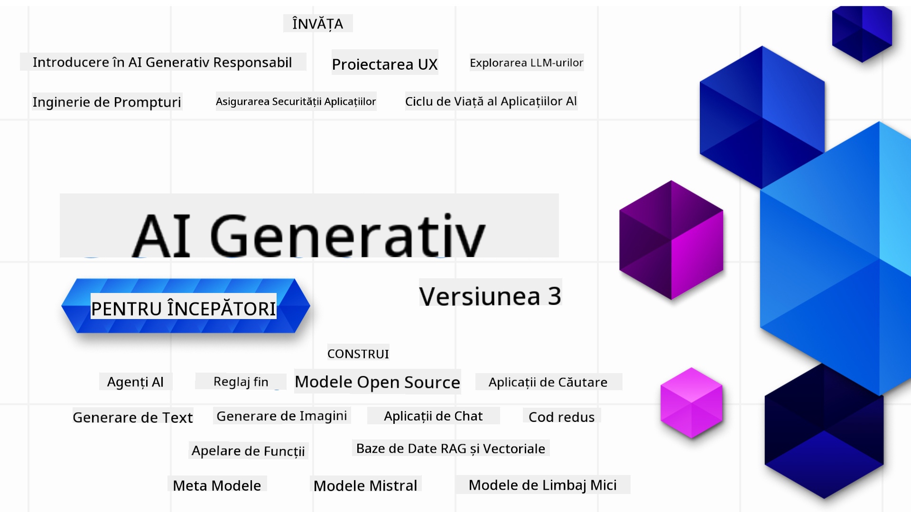

<!--
CO_OP_TRANSLATOR_METADATA:
{
  "original_hash": "6e3f4c8a4f323b8eab1cf11ded304b0f",
  "translation_date": "2025-06-25T08:15:17+00:00",
  "source_file": "README.md",
  "language_code": "ro"
}
-->

### 21 Lecții care te învață tot ce trebuie să știi pentru a începe să construiești aplicații de AI Generativ

### 🌐 Suport Multilingv

#### Suportat prin GitHub Action (Automatizat și Mereu Actualizat)

# Generative AI pentru Începători (Versiunea 3) - Un Curs

Învață elementele fundamentale ale construirii aplicațiilor de Generative AI cu cursul nostru cuprinzător de 21 de lecții oferit de Microsoft Cloud Advocates.

## 🌱 Începe

Acest curs are 21 de lecții. Fiecare lecție acoperă un subiect propriu, așa că poți începe de unde dorești!

Lecțiile sunt etichetate fie ca lecții "Learn" care explică un concept de Generative AI, fie ca lecții "Build" care explică un concept și oferă exemple de cod atât în **Python**, cât și în **TypeScript** atunci când este posibil.

Pentru dezvoltatorii .NET, verifică [Generative AI pentru Începători (Ediția .NET)](https://github.com/microsoft/Generative-AI-for-beginners-dotnet?WT.mc_id=academic-105485-koreyst)!

Fiecare lecție include, de asemenea, o secțiune "Keep Learning" cu instrumente suplimentare de învățare.

## De ce ai nevoie
### Pentru a rula codul acestui curs, poți folosi fie:
 - [Azure OpenAI Service](https://aka.ms/genai-beginners/azure-open-ai?WT.mc_id=academic-105485-koreyst) - **Lecții:** "aoai-assignment"
 - [GitHub Marketplace Model Catalog](https://aka.ms/genai-beginners/gh-models?WT.mc_id=academic-105485-koreyst) - **Lecții:** "githubmodels"
 - [OpenAI API](https://aka.ms/genai-beginners/open-ai?WT.mc_id=academic-105485-koreyst) - **Lecții:** "oai-assignment" 

- Cunoștințe de bază de Python sau TypeScript sunt utile - \*Pentru începătorii absoluți, verifică aceste cursuri de [Python](https://aka.ms/genai-beginners/python?WT.mc_id=academic-105485-koreyst) și [TypeScript](https://aka.ms/genai-beginners/typescript?WT.mc_id=academic-105485-koreyst)
- Un cont GitHub pentru a [fork-ui acest întreg repo](https://aka.ms/genai-beginners/github?WT.mc_id=academic-105485-koreyst) în propriul tău cont GitHub

Am creat o lecție de **[Course Setup](./00-course-setup/README.md?WT.mc_id=academic-105485-koreyst)** pentru a te ajuta să îți configurezi mediul de dezvoltare.

Nu uita să [acordezi o stea (🌟) acestui repo](https://docs.github.com/en/get-started/exploring-projects-on-github/saving-repositories-with-stars?WT.mc_id=academic-105485-koreyst) pentru a-l găsi mai ușor mai târziu.

## 🧠 Gata de implementare?

Dacă cauți exemple de cod mai avansate, verifică [colecția noastră de Exemple de Cod Generative AI](https://aka.ms/genai-beg-code?WT.mc_id=academic-105485-koreyst) atât în **Python**, cât și în **TypeScript**.

## 🗣️ Întâlnește alți cursanți, primește suport

Alătură-te [serverului nostru oficial Azure AI Foundry pe Discord](https://aka.ms/genai-discord?WT.mc_id=academic-105485-koreyst) pentru a întâlni și a face rețea cu alți cursanți care urmează acest curs și pentru a primi suport.

Pune întrebări sau împărtășește feedback-ul despre produs în [Forum-ul Dezvoltatorilor Azure AI Foundry](https://aka.ms/azureaifoundry/forum) pe Github.

## 🚀 Construiești un startup?

Înscrie-te pentru [Microsoft for Startups Founders Hub](https://aka.ms/genai-foundershub?WT.mc_id=academic-105485-koreyst) pentru a primi **credite OpenAI gratuite** și până la **150.000 USD în credite Azure pentru a accesa modelele OpenAI prin Azure OpenAI Services**.

## 🙏 Vrei să ajuți?

Ai sugestii sau ai găsit greșeli de ortografie sau de cod? [Deschide un issue](https://github.com/microsoft/generative-ai-for-beginners/issues?WT.mc_id=academic-105485-koreyst) sau [Creează un pull request](https://github.com/microsoft/generative-ai-for-beginners/pulls?WT.mc_id=academic-105485-koreyst)

## 📂 Fiecare lecție include:

- O scurtă introducere video la subiect
- O lecție scrisă localizată în README
- Exemple de cod în Python și TypeScript care suportă Azure OpenAI și OpenAI API
- Linkuri către resurse suplimentare pentru a continua învățarea

## 🗃️ Lecții

| #   | **Link Lecție**                                                                                                                             | **Descriere**                                                                                   | **Video**                                                                   | **Învățare suplimentară**                                                      |
| --- | -------------------------------------------------------------------------------------------------------------------------------------------- | ------------------------------------------------------------------------------------------------| --------------------------------------------------------------------------- | ------------------------------------------------------------------------------ |
| 00  | [Course Setup](./00-course-setup/README.md?WT.mc_id=academic-105485-koreyst)                                                                 | **Learn:** Cum să îți configurezi mediul de dezvoltare                                           | Video în curând                                                             | [Learn More](https://aka.ms/genai-collection?WT.mc_id=academic-105485-koreyst) |
| 01  | [Introducere în Generative AI și LLM-uri](./01-introduction-to-genai/README.md?WT.mc_id=academic-105485-koreyst)                             | **Learn:** Înțelegerea a ceea ce este Generative AI și cum funcționează Modelele de Limbaj Mare (LLMs). | [Video](https://aka.ms/gen-ai-lesson-1-gh?WT.mc_id=academic-105485-koreyst) | [Learn More](https://aka.ms/genai-collection?WT.mc_id=academic-105485-koreyst) |
| 02  | [Explorarea și compararea diferitelor LLM-uri](./02-exploring-and-comparing-different-llms/README.md?WT.mc_id=academic-105485-koreyst)      | **Learn:** Cum să alegi modelul potrivit pentru cazul tău de utilizare                           | [Video](https://aka.ms/gen-ai-lesson2-gh?WT.mc_id=academic-105485-koreyst)  | [Learn More](https://aka.ms/genai-collection?WT.mc_id=academic-105485-koreyst) |
| 03  | [Folosirea responsabilă a Generative AI](./03-using-generative-ai-responsibly/README.md?WT.mc_id=academic-105485-koreyst)                   | **Learn:** Cum să construiești aplicații Generative AI în mod responsabil                        | [Video](https://aka.ms/gen-ai-lesson3-gh?WT.mc_id=academic-105485-koreyst)  | [Learn More](https://aka.ms/genai-collection?WT.mc_id=academic-105485-koreyst) |
| 04  | [Înțelegerea fundamentelor ingineriei de prompt](./04-prompt-engineering-fundamentals/README.md?WT.mc_id=academic-105485-koreyst)           | **Learn:** Practici de bază în ingineria de prompt                                               | [Video](https://aka.ms/gen-ai-lesson4-gh?WT.mc_id=academic-105485-koreyst)  | [Learn More](https://aka.ms/genai-collection?WT.mc_id=academic-105485-koreyst) |
| 05  | [Crearea de Prompts Avansate](./05-advanced-prompts/README.md?WT.mc_id=academic-105485-koreyst)                                                | **Învață:** Cum să aplici tehnici de inginerie a prompturilor care îmbunătățesc rezultatul acestora. | [Video](https://aka.ms/gen-ai-lesson5-gh?WT.mc_id=academic-105485-koreyst)  | [Află mai multe](https://aka.ms/genai-collection?WT.mc_id=academic-105485-koreyst) |
| 06  | [Construirea Aplicațiilor de Generare Text](./06-text-generation-apps/README.md?WT.mc_id=academic-105485-koreyst)                                | **Construiește:** O aplicație de generare text folosind Azure OpenAI / OpenAI API                                | [Video](https://aka.ms/gen-ai-lesson6-gh?WT.mc_id=academic-105485-koreyst)  | [Află mai multe](https://aka.ms/genai-collection?WT.mc_id=academic-105485-koreyst) |
| 07  | [Construirea Aplicațiilor de Chat](./07-building-chat-applications/README.md?WT.mc_id=academic-105485-koreyst)                                     | **Construiește:** Tehnici pentru a construi și integra eficient aplicații de chat.               | [Video](https://aka.ms/gen-ai-lessons7-gh?WT.mc_id=academic-105485-koreyst) | [Află mai multe](https://aka.ms/genai-collection?WT.mc_id=academic-105485-koreyst) |
| 08  | [Construirea Aplicațiilor de Căutare cu Baze de Date Vectoriale](./08-building-search-applications/README.md?WT.mc_id=academic-105485-koreyst)                        | **Construiește:** O aplicație de căutare care folosește Embeddings pentru a căuta date.                        | [Video](https://aka.ms/gen-ai-lesson8-gh?WT.mc_id=academic-105485-koreyst)  | [Află mai multe](https://aka.ms/genai-collection?WT.mc_id=academic-105485-koreyst) |
| 09  | [Construirea Aplicațiilor de Generare Imagini](./09-building-image-applications/README.md?WT.mc_id=academic-105485-koreyst)                        | **Construiește:** O aplicație de generare imagini                                                       | [Video](https://aka.ms/gen-ai-lesson9-gh?WT.mc_id=academic-105485-koreyst)  | [Află mai multe](https://aka.ms/genai-collection?WT.mc_id=academic-105485-koreyst) |
| 10  | [Construirea Aplicațiilor AI Low Code](./10-building-low-code-ai-applications/README.md?WT.mc_id=academic-105485-koreyst)                       | **Construiește:** O aplicație AI Generativă folosind unelte Low Code                                     | [Video](https://aka.ms/gen-ai-lesson10-gh?WT.mc_id=academic-105485-koreyst) | [Află mai multe](https://aka.ms/genai-collection?WT.mc_id=academic-105485-koreyst) |
| 11  | [Integrarea Aplicațiilor Externe cu Apelarea Funcțiilor](./11-integrating-with-function-calling/README.md?WT.mc_id=academic-105485-koreyst) | **Construiește:** Ce este apelarea funcțiilor și cazurile sale de utilizare pentru aplicații                          | [Video](https://aka.ms/gen-ai-lesson11-gh?WT.mc_id=academic-105485-koreyst) | [Află mai multe](https://aka.ms/genai-collection?WT.mc_id=academic-105485-koreyst) |
| 12  | [Proiectarea UX pentru Aplicații AI](./12-designing-ux-for-ai-applications/README.md?WT.mc_id=academic-105485-koreyst)                         | **Învață:** Cum să aplici principii de design UX când dezvolți Aplicații AI Generative         | [Video](https://aka.ms/gen-ai-lesson12-gh?WT.mc_id=academic-105485-koreyst) | [Află mai multe](https://aka.ms/genai-collection?WT.mc_id=academic-105485-koreyst) |
| 13  | [Securizarea Aplicațiilor AI Generative](./13-securing-ai-applications/README.md?WT.mc_id=academic-105485-koreyst)                         | **Învață:** Amenințările și riscurile pentru sistemele AI și metodele de a securiza aceste sisteme.             | [Video](https://aka.ms/gen-ai-lesson13-gh?WT.mc_id=academic-105485-koreyst) | [Află mai multe](https://aka.ms/genai-collection?WT.mc_id=academic-105485-koreyst) |
| 14  | [Ciclul de Viață al Aplicațiilor AI Generative](./14-the-generative-ai-application-lifecycle/README.md?WT.mc_id=academic-105485-koreyst)           | **Învață:** Uneltele și metricile pentru a gestiona Ciclul de Viață al LLM și LLMOps                         | [Video](https://aka.ms/gen-ai-lesson14-gh?WT.mc_id=academic-105485-koreyst) | [Află mai multe](https://aka.ms/genai-collection?WT.mc_id=academic-105485-koreyst) |
| 15  | [Recuperare Generată Augmentată (RAG) și Baze de Date Vectoriale](./15-rag-and-vector-databases/README.md?WT.mc_id=academic-105485-koreyst)        | **Construiește:** O aplicație folosind un cadru RAG pentru a recupera încorporări dintr-o Bază de Date Vectorială  | [Video](https://aka.ms/gen-ai-lesson15-gh?WT.mc_id=academic-105485-koreyst) | [Află Mai Multe](https://aka.ms/genai-collection?WT.mc_id=academic-105485-koreyst) |
| 16  | [Modele Open Source și Hugging Face](./16-open-source-models/README.md?WT.mc_id=academic-105485-koreyst)                                    | **Construiește:** O aplicație folosind modele open source disponibile pe Hugging Face                    | [Video](https://aka.ms/gen-ai-lesson16-gh?WT.mc_id=academic-105485-koreyst) | [Află Mai Multe](https://aka.ms/genai-collection?WT.mc_id=academic-105485-koreyst) |
| 17  | [Agenți AI](./17-ai-agents/README.md?WT.mc_id=academic-105485-koreyst)                                                                       | **Construiește:** O aplicație folosind un cadru de Agenți AI                                           | [Video](https://aka.ms/gen-ai-lesson17-gh?WT.mc_id=academic-105485-koreyst) | [Află Mai Multe](https://aka.ms/genai-collection?WT.mc_id=academic-105485-koreyst) |
| 18  | [Ajustarea Fină a LLM-urilor](./18-fine-tuning/README.md?WT.mc_id=academic-105485-koreyst)                                                              | **Învață:** Ce, de ce și cum să ajustezi fin LLM-urile                                            | [Video](https://aka.ms/gen-ai-lesson18-gh?WT.mc_id=academic-105485-koreyst) | [Află Mai Multe](https://aka.ms/genai-collection?WT.mc_id=academic-105485-koreyst) |
| 19  | [Construirea cu SLM-uri](./19-slm/README.md?WT.mc_id=academic-105485-koreyst)                                                              | **Învață:** Beneficiile construirii cu Modele de Limbaj Mici                                            | Video În Curând | [Află Mai Multe](https://aka.ms/genai-collection?WT.mc_id=academic-105485-koreyst) |
| 20  | [Construirea cu Modele Mistral](./20-mistral/README.md?WT.mc_id=academic-105485-koreyst)                                                              | **Învață:** Caracteristicile și diferențele modelelor Familiei Mistral                                           | Video În Curând | [Află Mai Multe](https://aka.ms/genai-collection?WT.mc_id=academic-105485-koreyst) |
| 21  | [Construirea cu Modele Meta](./21-meta/README.md?WT.mc_id=academic-105485-koreyst)                                                              | **Învață:** Caracteristicile și diferențele modelelor Familiei Meta                                           | Video În Curând | [Află Mai Multe](https://aka.ms/genai-collection?WT.mc_id=academic-105485-koreyst) |

### 🌟 Mulțumiri speciale

Mulțumiri speciale lui [**John Aziz**](https://www.linkedin.com/in/john0isaac/) pentru crearea tuturor acțiunilor și fluxurilor de lucru GitHub

[**Bernhard Merkle**](https://www.linkedin.com/in/bernhard-merkle-738b73/) pentru contribuțiile esențiale la fiecare lecție pentru a îmbunătăți experiența de învățare și codare.

## 🎒 Alte Cursuri

Echipa noastră produce și alte cursuri! Verifică:

- [**NOU** Protocol de Context al Modelului pentru Începători](https://github.com/microsoft/mcp-for-beginners?WT.mc_id=academic-105485-koreyst)
- [Agenți AI pentru Începători](https://github.com/microsoft/ai-agents-for-beginners?WT.mc_id=academic-105485-koreyst)
- [AI Generativ pentru Începători folosind .NET](https://github.com/microsoft/Generative-AI-for-beginners-dotnet?WT.mc_id=academic-105485-koreyst)
- [AI Generativ pentru Începători folosind JavaScript](https://aka.ms/genai-js-course?WT.mc_id=academic-105485-koreyst)
- [ML pentru Începători](https://aka.ms/ml-beginners?WT.mc_id=academic-105485-koreyst)
- [Știința Datelor pentru Începători](https://aka.ms/datascience-beginners?WT.mc_id=academic-105485-koreyst)
- [AI pentru Începători](https://aka.ms/ai-beginners?WT.mc_id=academic-105485-koreyst)
- [Securitate Cibernetică pentru Începători](https://github.com/microsoft/Security-101??WT.mc_id=academic-96948-sayoung)
- [Dezvoltare Web pentru Începători](https://aka.ms/webdev-beginners?WT.mc_id=academic-105485-koreyst)
- [IoT pentru Începători](https://aka.ms/iot-beginners?WT.mc_id=academic-105485-koreyst)
- [Dezvoltare XR pentru Începători](https://github.com/microsoft/xr-development-for-beginners?WT.mc_id=academic-105485-koreyst)
- [Stăpânirea GitHub Copilot pentru Programare în Pereche AI](https://aka.ms/GitHubCopilotAI?WT.mc_id=academic-105485-koreyst)
- [Stăpânirea GitHub Copilot pentru Dezvoltatori C#/.NET](https://github.com/microsoft/mastering-github-copilot-for-dotnet-csharp-developers?WT.mc_id=academic-105485-koreyst)
- [Alege-ți propria aventură cu Copilot](https://github.com/microsoft/CopilotAdventures?WT.mc_id=academic-105485-koreyst)

**Declinare de responsabilitate**:  
Acest document a fost tradus folosind serviciul de traducere AI [Co-op Translator](https://github.com/Azure/co-op-translator). Deși ne străduim să obținem acuratețe, vă rugăm să fiți conștienți că traducerile automate pot conține erori sau inexactități. Documentul original în limba sa natală ar trebui considerat sursa autoritară. Pentru informații critice, se recomandă traducerea umană profesională. Nu suntem responsabili pentru niciun fel de neînțelegeri sau interpretări greșite care pot apărea din utilizarea acestei traduceri.