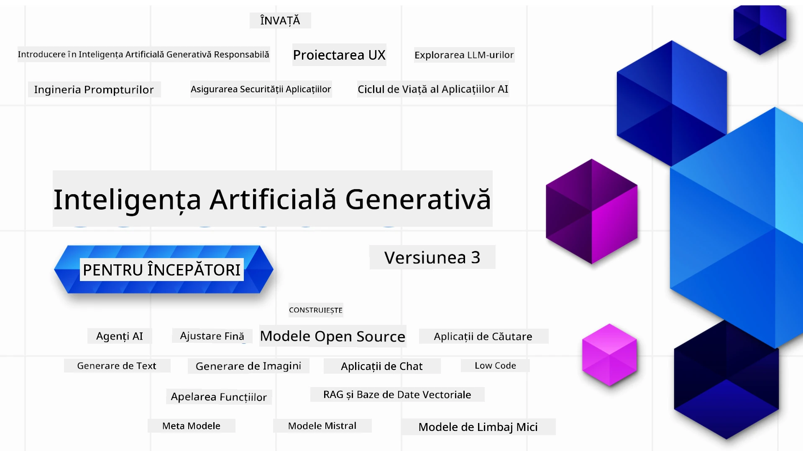

### 21 Lecții care vă învață tot ce trebuie să știți pentru a începe să construiți aplicații de Inteligență Artificială Generativă

[](https://github.com/microsoft/Generative-AI-For-Beginners/blob/master/LICENSE?WT.mc_id=academic-105485-koreyst)
[](https://GitHub.com/microsoft/Generative-AI-For-Beginners/graphs/contributors/?WT.mc_id=academic-105485-koreyst)
[](https://GitHub.com/microsoft/Generative-AI-For-Beginners/issues/?WT.mc_id=academic-105485-koreyst)
[](https://GitHub.com/microsoft/Generative-AI-For-Beginners/pulls/?WT.mc_id=academic-105485-koreyst)
[](http://makeapullrequest.com?WT.mc_id=academic-105485-koreyst)

[](https://GitHub.com/microsoft/Generative-AI-For-Beginners/watchers/?WT.mc_id=academic-105485-koreyst)
[](https://GitHub.com/microsoft/Generative-AI-For-Beginners/network/?WT.mc_id=academic-105485-koreyst)
[](https://GitHub.com/microsoft/Generative-AI-For-Beginners/stargazers/?WT.mc_id=academic-105485-koreyst)

[](https://discord.gg/nTYy5BXMWG)

### 🌐 Suport Multi-Limbaj

#### Suportat prin GitHub Action (Automatizat și Întotdeauna Actualizat)

<!-- CO-OP TRANSLATOR LANGUAGES TABLE START -->
[Arabic](../ar/README.md) | [Bengali](../bn/README.md) | [Bulgarian](../bg/README.md) | [Burmese (Myanmar)](../my/README.md) | [Chinese (Simplified)](../zh-CN/README.md) | [Chinese (Traditional, Hong Kong)](../zh-HK/README.md) | [Chinese (Traditional, Macau)](../zh-MO/README.md) | [Chinese (Traditional, Taiwan)](../zh-TW/README.md) | [Croatian](../hr/README.md) | [Czech](../cs/README.md) | [Danish](../da/README.md) | [Dutch](../nl/README.md) | [Estonian](../et/README.md) | [Finnish](../fi/README.md) | [French](../fr/README.md) | [German](../de/README.md) | [Greek](../el/README.md) | [Hebrew](../he/README.md) | [Hindi](../hi/README.md) | [Hungarian](../hu/README.md) | [Indonesian](../id/README.md) | [Italian](../it/README.md) | [Japanese](../ja/README.md) | [Kannada](../kn/README.md) | [Khmer](../km/README.md) | [Korean](../ko/README.md) | [Lithuanian](../lt/README.md) | [Malay](../ms/README.md) | [Malayalam](../ml/README.md) | [Marathi](../mr/README.md) | [Nepali](../ne/README.md) | [Nigerian Pidgin](../pcm/README.md) | [Norwegian](../no/README.md) | [Persian (Farsi)](../fa/README.md) | [Polish](../pl/README.md) | [Portuguese (Brazil)](../pt-BR/README.md) | [Portuguese (Portugal)](../pt-PT/README.md) | [Punjabi (Gurmukhi)](../pa/README.md) | [Romanian](./README.md) | [Russian](../ru/README.md) | [Serbian (Cyrillic)](../sr/README.md) | [Slovak](../sk/README.md) | [Slovenian](../sl/README.md) | [Spanish](../es/README.md) | [Swahili](../sw/README.md) | [Swedish](../sv/README.md) | [Tagalog (Filipino)](../tl/README.md) | [Tamil](../ta/README.md) | [Telugu](../te/README.md) | [Thai](../th/README.md) | [Turkish](../tr/README.md) | [Ukrainian](../uk/README.md) | [Urdu](../ur/README.md) | [Vietnamese](../vi/README.md)

> **Preferi să clonezi local?**
>
> Acest depozit include peste 50 de traduceri în limbi diferite, ceea ce mărește semnificativ dimensiunea descărcării. Pentru a clona fără traduceri, folosește sparse checkout:
>
> **Bash / macOS / Linux:**
> ```bash
> git clone --filter=blob:none --sparse https://github.com/microsoft/generative-ai-for-beginners.git
> cd generative-ai-for-beginners
> git sparse-checkout set --no-cone '/*' '!translations' '!translated_images'
> ```
>
> **CMD (Windows):**
> ```cmd
> git clone --filter=blob:none --sparse https://github.com/microsoft/generative-ai-for-beginners.git
> cd generative-ai-for-beginners
> git sparse-checkout set --no-cone "/*" "!translations" "!translated_images"
> ```
>
> Aceasta îți oferă tot ce ai nevoie pentru a finaliza cursul cu o descărcare mult mai rapidă.
<!-- CO-OP TRANSLATOR LANGUAGES TABLE END -->

# Inteligență Artificială Generativă pentru Începători (Versiunea 3) - Un Curs

Învață elementele fundamentale pentru construirea aplicațiilor de Inteligență Artificială Generativă cu ajutorul cursului nostru cuprinzător de 21 de lecții oferit de Microsoft Cloud Advocates.

## 🌱 Începeți

Acest curs are 21 de lecții. Fiecare lecție acoperă un subiect propriu, așa că începe de unde dorești!

Lecțiile sunt etichetate fie ca lecții „Learn” care explică un concept de Inteligență Artificială Generativă, fie ca lecții „Build” care explică un concept și oferă exemple de cod în **Python** și **TypeScript** atunci când este posibil.

Pentru dezvoltatori .NET verificați [Inteligență Artificială Generativă pentru Începători (Ediția .NET)](https://github.com/microsoft/Generative-AI-for-beginners-dotnet?WT.mc_id=academic-105485-koreyst)!

Fiecare lecție include, de asemenea, o secțiune „Keep Learning” cu instrumente suplimentare de învățare.

## Ce ai nevoie
### Pentru a rula codul acestui curs, poți folosi oricare dintre:
 - [Azure OpenAI Service](https://aka.ms/genai-beginners/azure-open-ai?WT.mc_id=academic-105485-koreyst) - **Lecții:** "aoai-assignment"
 - [GitHub Marketplace Model Catalog](https://aka.ms/genai-beginners/gh-models?WT.mc_id=academic-105485-koreyst) - **Lecții:** "githubmodels"
 - [OpenAI API](https://aka.ms/genai-beginners/open-ai?WT.mc_id=academic-105485-koreyst) - **Lecții:** "oai-assignment" 
   
- Cunoștințe de bază de Python sau TypeScript sunt utile - \*Pentru începători absoluți verificați aceste cursuri [Python](https://aka.ms/genai-beginners/python?WT.mc_id=academic-105485-koreyst) și [TypeScript](https://aka.ms/genai-beginners/typescript?WT.mc_id=academic-105485-koreyst)
- Un cont GitHub pentru a [bifurca acest depozit integral](https://aka.ms/genai-beginners/github?WT.mc_id=academic-105485-koreyst) în propriul cont GitHub

Am creat o lecție **[Course Setup](./00-course-setup/README.md?WT.mc_id=academic-105485-koreyst)** pentru a te ajuta să-ți configurezi mediul de dezvoltare.

Nu uita să [dai stea (🌟) acestui depozit](https://docs.github.com/en/get-started/exploring-projects-on-github/saving-repositories-with-stars?WT.mc_id=academic-105485-koreyst) pentru a-l găsi mai ușor mai târziu.

## 🧠 Pregătit pentru a implementa?

Dacă cauți exemple de cod mai avansate, verifică colecția noastră de [Exemple de Cod pentru Inteligență Artificială Generativă](https://aka.ms/genai-beg-code?WT.mc_id=academic-105485-koreyst) în **Python** și **TypeScript**.

## 🗣️ Întâlnește alți cursanți, primește suport

Alătură-te [serverului oficial Discord Azure AI Foundry](https://aka.ms/genai-discord?WT.mc_id=academic-105485-koreyst) pentru a întâlni și face networking cu alți cursanți care urmează acest curs și pentru a primi suport.

Pune întrebări sau oferă feedback despre produs în [Forumul Dezvoltatorilor Azure AI Foundry](https://aka.ms/azureaifoundry/forum) pe Github.

## 🚀 Construiești un startup?

Vizitează [Microsoft for Startups](https://www.microsoft.com/startups) pentru a afla cum să începi să construiești cu credite Azure astăzi.

## 🙏 Vrei să ajuți?

Ai sugestii sau ai găsit greșeli de ortografie sau cod? [Deschide o problemă](https://github.com/microsoft/generative-ai-for-beginners/issues?WT.mc_id=academic-105485-koreyst) sau [Creează o cerere de tragere](https://github.com/microsoft/generative-ai-for-beginners/pulls?WT.mc_id=academic-105485-koreyst)

## 📂 Fiecare lecție include:

- O scurtă introducere video la subiect
- O lecție scrisă disponibilă în README
- Exemple de cod Python și TypeScript care susțin Azure OpenAI și OpenAI API
- Legături către resurse suplimentare pentru a-ți continua învățarea

## 🗃️ Lecții

| #   | **Link Lecție**                                                                                                                              | **Descriere**                                                                                   | **Video**                                                                   | **Învățare Suplimentară**                                                       |
| --- | -------------------------------------------------------------------------------------------------------------------------------------------- | ----------------------------------------------------------------------------------------------- | --------------------------------------------------------------------------- | ------------------------------------------------------------------------------ |
| 00  | [Configurarea Cursului](./00-course-setup/README.md?WT.mc_id=academic-105485-koreyst)                                                        | **Învață:** Cum să-ți configurezi mediul de dezvoltare                                          | Video în curând                                                           | [Află mai multe](https://aka.ms/genai-collection?WT.mc_id=academic-105485-koreyst) |
| 01  | [Introducere în Inteligența Artificială Generativă și LLM-uri](./01-introduction-to-genai/README.md?WT.mc_id=academic-105485-koreyst)          | **Învață:** Înțelegerea a ceea ce este Inteligența Artificială Generativă și cum funcționează Modelele Mari de Limbaj (LLM) | [Video](https://aka.ms/gen-ai-lesson-1-gh?WT.mc_id=academic-105485-koreyst) | [Află mai multe](https://aka.ms/genai-collection?WT.mc_id=academic-105485-koreyst) |
| 02  | [Explorarea și compararea diferitelor LLM-uri](./02-exploring-and-comparing-different-llms/README.md?WT.mc_id=academic-105485-koreyst)          | **Învață:** Cum să selectezi modelul potrivit pentru cazul tău de utilizare                      | [Video](https://aka.ms/gen-ai-lesson2-gh?WT.mc_id=academic-105485-koreyst)  | [Află mai multe](https://aka.ms/genai-collection?WT.mc_id=academic-105485-koreyst) |
| 03  | [Utilizarea responsabilă a Inteligenței Artificiale Generative](./03-using-generative-ai-responsibly/README.md?WT.mc_id=academic-105485-koreyst) | **Învață:** Cum să construiești aplicații de Inteligență Artificială Generativă responsabil      | [Video](https://aka.ms/gen-ai-lesson3-gh?WT.mc_id=academic-105485-koreyst)  | [Află mai multe](https://aka.ms/genai-collection?WT.mc_id=academic-105485-koreyst) |
| 04  | [Înțelegerea fundamentelor ingineriei promptului](./04-prompt-engineering-fundamentals/README.md?WT.mc_id=academic-105485-koreyst)             | **Învață:** Cele mai bune practici practice în Ingineria Promptului                                           | [Video](https://aka.ms/gen-ai-lesson4-gh?WT.mc_id=academic-105485-koreyst)  | [Află mai multe](https://aka.ms/genai-collection?WT.mc_id=academic-105485-koreyst) |
| 05  | [Crearea prompturilor avansate](./05-advanced-prompts/README.md?WT.mc_id=academic-105485-koreyst)                                                | **Învață:** Cum să aplici tehnici de inginerie a prompturilor care îmbunătățesc rezultatul prompturilor tale. | [Video](https://aka.ms/gen-ai-lesson5-gh?WT.mc_id=academic-105485-koreyst)  | [Află mai multe](https://aka.ms/genai-collection?WT.mc_id=academic-105485-koreyst) |
| 06  | [Construirea aplicațiilor de generare a textului](./06-text-generation-apps/README.md?WT.mc_id=academic-105485-koreyst)                                | **Construiește:** O aplicație de generare a textului folosind Azure OpenAI / OpenAI API                                | [Video](https://aka.ms/gen-ai-lesson6-gh?WT.mc_id=academic-105485-koreyst)  | [Află mai multe](https://aka.ms/genai-collection?WT.mc_id=academic-105485-koreyst) |
| 07  | [Construirea aplicațiilor de chat](./07-building-chat-applications/README.md?WT.mc_id=academic-105485-koreyst)                                     | **Construiește:** Tehnici pentru construirea și integrarea eficientă a aplicațiilor de chat.               | [Video](https://aka.ms/gen-ai-lessons7-gh?WT.mc_id=academic-105485-koreyst) | [Află mai multe](https://aka.ms/genai-collection?WT.mc_id=academic-105485-koreyst) |
| 08  | [Construirea aplicațiilor de căutare și baze de date vectoriale](./08-building-search-applications/README.md?WT.mc_id=academic-105485-koreyst)                        | **Construiește:** O aplicație de căutare care folosește Embeddings pentru a căuta date.                        | [Video](https://aka.ms/gen-ai-lesson8-gh?WT.mc_id=academic-105485-koreyst)  | [Află mai multe](https://aka.ms/genai-collection?WT.mc_id=academic-105485-koreyst) |
| 09  | [Construirea aplicațiilor de generare a imaginilor](./09-building-image-applications/README.md?WT.mc_id=academic-105485-koreyst)                        | **Construiește:** O aplicație de generare a imaginilor                                                       | [Video](https://aka.ms/gen-ai-lesson9-gh?WT.mc_id=academic-105485-koreyst)  | [Află mai multe](https://aka.ms/genai-collection?WT.mc_id=academic-105485-koreyst) |
| 10  | [Construirea aplicațiilor AI cu cod redus](./10-building-low-code-ai-applications/README.md?WT.mc_id=academic-105485-koreyst)                       | **Construiește:** O aplicație de AI generativ folosind unelte Low Code                                     | [Video](https://aka.ms/gen-ai-lesson10-gh?WT.mc_id=academic-105485-koreyst) | [Află mai multe](https://aka.ms/genai-collection?WT.mc_id=academic-105485-koreyst) |
| 11  | [Integrarea aplicațiilor externe cu apelul funcțiilor](./11-integrating-with-function-calling/README.md?WT.mc_id=academic-105485-koreyst) | **Construiește:** Ce este apelul funcțiilor și cazurile sale de utilizare pentru aplicații                          | [Video](https://aka.ms/gen-ai-lesson11-gh?WT.mc_id=academic-105485-koreyst) | [Află mai multe](https://aka.ms/genai-collection?WT.mc_id=academic-105485-koreyst) |
| 12  | [Proiectarea UX pentru aplicații AI](./12-designing-ux-for-ai-applications/README.md?WT.mc_id=academic-105485-koreyst)                         | **Învață:** Cum să aplici principiile de design UX la dezvoltarea aplicațiilor AI generative         | [Video](https://aka.ms/gen-ai-lesson12-gh?WT.mc_id=academic-105485-koreyst) | [Află mai multe](https://aka.ms/genai-collection?WT.mc_id=academic-105485-koreyst) |
| 13  | [Asigurarea aplicațiilor tale AI generative](./13-securing-ai-applications/README.md?WT.mc_id=academic-105485-koreyst)                         | **Învață:** Amenințările și riscurile sistemelor AI și metodele de securizare a acestora.             | [Video](https://aka.ms/gen-ai-lesson13-gh?WT.mc_id=academic-105485-koreyst) | [Află mai multe](https://aka.ms/genai-collection?WT.mc_id=academic-105485-koreyst) |
| 14  | [Ciclul de viață al aplicațiilor AI generative](./14-the-generative-ai-application-lifecycle/README.md?WT.mc_id=academic-105485-koreyst)           | **Învață:** Uneltele și metricile pentru gestionarea ciclului de viață LLM și LLMOps                         | [Video](https://aka.ms/gen-ai-lesson14-gh?WT.mc_id=academic-105485-koreyst) | [Află mai multe](https://aka.ms/genai-collection?WT.mc_id=academic-105485-koreyst) |
| 15  | [Generarea augmentată prin recuperare (RAG) și baze de date vectoriale](./15-rag-and-vector-databases/README.md?WT.mc_id=academic-105485-koreyst)        | **Construiește:** O aplicație folosind un cadru RAG pentru a recupera embeddings din baze de date vectoriale  | [Video](https://aka.ms/gen-ai-lesson15-gh?WT.mc_id=academic-105485-koreyst) | [Află mai multe](https://aka.ms/genai-collection?WT.mc_id=academic-105485-koreyst) |
| 16  | [Modele open source și Hugging Face](./16-open-source-models/README.md?WT.mc_id=academic-105485-koreyst)                                    | **Construiește:** O aplicație folosind modele open source disponibile pe Hugging Face                    | [Video](https://aka.ms/gen-ai-lesson16-gh?WT.mc_id=academic-105485-koreyst) | [Află mai multe](https://aka.ms/genai-collection?WT.mc_id=academic-105485-koreyst) |
| 17  | [Agenți AI](./17-ai-agents/README.md?WT.mc_id=academic-105485-koreyst)                                                                       | **Construiește:** O aplicație folosind un cadru pentru Agenți AI                                           | [Video](https://aka.ms/gen-ai-lesson17-gh?WT.mc_id=academic-105485-koreyst) | [Află mai multe](https://aka.ms/genai-collection?WT.mc_id=academic-105485-koreyst) |
| 18  | [Fine-Tuning LLMs](./18-fine-tuning/README.md?WT.mc_id=academic-105485-koreyst)                                                              | **Învață:** Ce, de ce și cum se face fine-tuning la LLM-uri                                            | [Video](https://aka.ms/gen-ai-lesson18-gh?WT.mc_id=academic-105485-koreyst) | [Află mai multe](https://aka.ms/genai-collection?WT.mc_id=academic-105485-koreyst) |
| 19  | [Construirea cu SLM-uri](./19-slm/README.md?WT.mc_id=academic-105485-koreyst)                                                              | **Învață:** Beneficiile construirii cu modele lingvistice mici                                            | Video Coming Soon | [Află mai multe](https://aka.ms/genai-collection?WT.mc_id=academic-105485-koreyst) |
| 20  | [Construirea cu modele Mistral](./20-mistral/README.md?WT.mc_id=academic-105485-koreyst)                                                              | **Învață:** Caracteristicile și diferențele modelelor din familia Mistral                                           | Video Coming Soon | [Află mai multe](https://aka.ms/genai-collection?WT.mc_id=academic-105485-koreyst) |
| 21  | [Construirea cu modele Meta](./21-meta/README.md?WT.mc_id=academic-105485-koreyst)                                                              | **Învață:** Caracteristicile și diferențele modelelor din familia Meta                                           | Video Coming Soon | [Află mai multe](https://aka.ms/genai-collection?WT.mc_id=academic-105485-koreyst) |

### 🌟 Mulțumiri speciale

Mulțumiri speciale lui [**John Aziz**](https://www.linkedin.com/in/john0isaac/) pentru crearea tuturor acțiunilor și fluxurilor de lucru GitHub

[**Bernhard Merkle**](https://www.linkedin.com/in/bernhard-merkle-738b73/) pentru contribuțiile cheie aduse fiecărei lecții pentru a îmbunătăți experiența cursantului și a codului.

## 🎒 Alte cursuri

Echipa noastră produce și alte cursuri! Vezi:

<!-- CO-OP TRANSLATOR OTHER COURSES START -->
### LangChain
[](https://aka.ms/langchain4j-for-beginners)
[](https://aka.ms/langchainjs-for-beginners?WT.mc_id=m365-94501-dwahlin)
[](https://github.com/microsoft/langchain-for-beginners?WT.mc_id=m365-94501-dwahlin)
---

### Azure / Edge / MCP / Agenți
[](https://github.com/microsoft/AZD-for-beginners?WT.mc_id=academic-105485-koreyst)
[](https://github.com/microsoft/edgeai-for-beginners?WT.mc_id=academic-105485-koreyst)
[](https://github.com/microsoft/mcp-for-beginners?WT.mc_id=academic-105485-koreyst)
[](https://github.com/microsoft/ai-agents-for-beginners?WT.mc_id=academic-105485-koreyst)

---
 
### Seria AI Generativ
[](https://github.com/microsoft/generative-ai-for-beginners?WT.mc_id=academic-105485-koreyst)
[-9333EA?style=for-the-badge&labelColor=E5E7EB&color=9333EA)](https://github.com/microsoft/Generative-AI-for-beginners-dotnet?WT.mc_id=academic-105485-koreyst)
[-C084FC?style=for-the-badge&labelColor=E5E7EB&color=C084FC)](https://github.com/microsoft/generative-ai-for-beginners-java?WT.mc_id=academic-105485-koreyst)
[-E879F9?style=for-the-badge&labelColor=E5E7EB&color=E879F9)](https://github.com/microsoft/generative-ai-with-javascript?WT.mc_id=academic-105485-koreyst)

---
 
### Învățare de bază
[](https://aka.ms/ml-beginners?WT.mc_id=academic-105485-koreyst)
[](https://aka.ms/datascience-beginners?WT.mc_id=academic-105485-koreyst)
[](https://aka.ms/ai-beginners?WT.mc_id=academic-105485-koreyst)
[](https://github.com/microsoft/Security-101?WT.mc_id=academic-96948-sayoung)
[](https://aka.ms/webdev-beginners?WT.mc_id=academic-105485-koreyst)
[](https://aka.ms/iot-beginners?WT.mc_id=academic-105485-koreyst)
[](https://github.com/microsoft/xr-development-for-beginners?WT.mc_id=academic-105485-koreyst)

---
 
### Seria Copilot
[](https://aka.ms/GitHubCopilotAI?WT.mc_id=academic-105485-koreyst)
[](https://github.com/microsoft/mastering-github-copilot-for-dotnet-csharp-developers?WT.mc_id=academic-105485-koreyst)
[](https://github.com/microsoft/CopilotAdventures?WT.mc_id=academic-105485-koreyst)
<!-- CO-OP TRANSLATOR OTHER COURSES END -->

## Obținerea de ajutor

Dacă întâmpini dificultăți sau ai întrebări despre construirea aplicațiilor AI. Alătură-te altor cursanți și dezvoltatori experimentați în discuții despre MCP. Este o comunitate de susținere în care întrebările sunt binevenite și cunoștințele sunt împărtășite liber.

[](https://discord.gg/nTYy5BXMWG)

Dacă ai feedback despre produs sau erori în timpul dezvoltării, vizitează:

[](https://aka.ms/foundry/forum)

---

<!-- CO-OP TRANSLATOR DISCLAIMER START -->
**Declinarea răspunderii**:
Acest document a fost tradus folosind serviciul de traducere AI [Co-op Translator](https://github.com/Azure/co-op-translator). Deși ne străduim pentru acuratețe, vă rugăm să rețineți că traducerile automate pot conține erori sau inexactități. Documentul original în limba sa nativă trebuie considerat sursa autoritară. Pentru informații critice, se recomandă traducerea profesională umană. Nu ne asumăm răspunderea pentru eventualele neînțelegeri sau interpretări greșite ce pot rezulta din utilizarea acestei traduceri.
<!-- CO-OP TRANSLATOR DISCLAIMER END -->