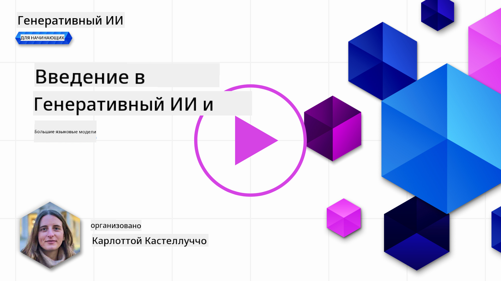
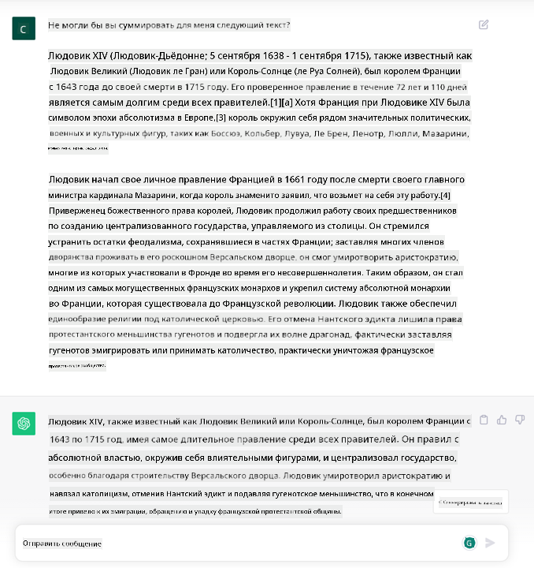
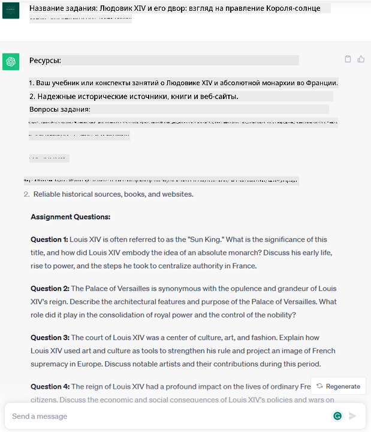
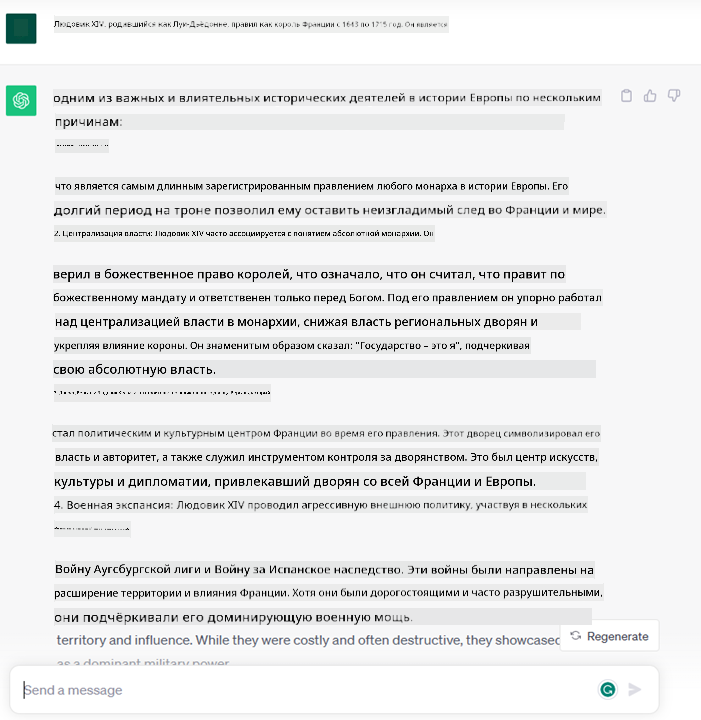
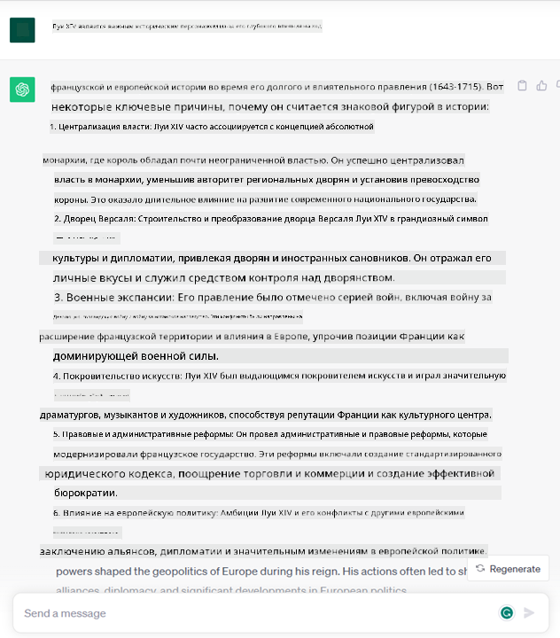
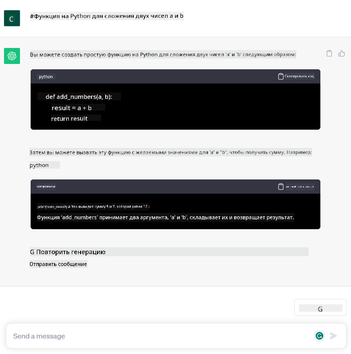

<!--
CO_OP_TRANSLATOR_METADATA:
{
  "original_hash": "f53ba0fa49164f9323043f1c6b11f2b1",
  "translation_date": "2025-05-19T13:03:27+00:00",
  "source_file": "01-introduction-to-genai/README.md",
  "language_code": "ru"
}
-->
# Введение в генеративный ИИ и большие языковые модели

_(Нажмите на изображение выше, чтобы посмотреть видео урока)_

Генеративный ИИ — это искусственный интеллект, способный генерировать текст, изображения и другие виды контента. Что делает его удивительной технологией, так это то, что он демократизирует ИИ, любой человек может использовать его, просто написав текстовый запрос, предложение на естественном языке. Вам не нужно изучать язык, такой как Java или SQL, чтобы добиться чего-то значимого, все, что вам нужно, это использовать свой язык, выразить свои желания, и ИИ предложит вам решение. Приложения и влияние этого огромны: вы можете писать или понимать отчеты, создавать приложения и многое другое за считанные секунды.

В этом курсе мы изучим, как наш стартап использует генеративный ИИ для открытия новых сценариев в мире образования и как мы решаем неизбежные проблемы, связанные с социальными последствиями его применения и ограничениями технологий.

## Введение

Этот урок охватывает:

- Введение в бизнес-сценарий: идея и миссия нашего стартапа.
- Генеративный ИИ и как мы пришли к текущему технологическому ландшафту.
- Внутренние механизмы работы большой языковой модели.
- Основные возможности и практическое применение больших языковых моделей.

## Цели обучения

После завершения этого урока вы поймете:

- Что такое генеративный ИИ и как работают большие языковые модели.
- Как вы можете использовать большие языковые модели для различных случаев, с акцентом на образовательные сценарии.

## Сценарий: наш образовательный стартап

Генеративный искусственный интеллект (ИИ) представляет собой вершину технологий ИИ, расширяя границы того, что когда-то считалось невозможным. Генеративные модели ИИ имеют множество возможностей и применений, но в рамках этого курса мы исследуем, как он революционизирует образование через вымышленный стартап. Мы будем называть этот стартап _нашим стартапом_. Наш стартап работает в области образования с амбициозной миссией

> _улучшение доступности обучения в глобальном масштабе, обеспечение равного доступа к образованию и предоставление персонализированных учебных опытов каждому учащемуся в соответствии с его потребностями_.

Команда нашего стартапа осознает, что мы не сможем достичь этой цели без использования одного из самых мощных инструментов современности – больших языковых моделей (LLM).

Ожидается, что генеративный ИИ революционизирует способ обучения и преподавания сегодня, предоставляя студентам виртуальных учителей 24 часа в сутки, которые предоставляют огромное количество информации и примеров, а учителям возможность использовать инновационные инструменты для оценки студентов и предоставления обратной связи.

Для начала давайте определим некоторые основные понятия и терминологию, которые мы будем использовать на протяжении всего курса.

## Как мы получили генеративный ИИ?

Несмотря на невероятный _ажиотаж_, созданный недавно благодаря объявлению генеративных моделей ИИ, эта технология создавалась десятилетиями, с первыми исследованиями, начинающимися еще в 60-х годах. Сейчас мы находимся в точке, когда ИИ обладает человеческими когнитивными способностями, такими как разговор, что демонстрируется, например, [OpenAI ChatGPT](https://openai.com/chatgpt) или [Bing Chat](https://www.microsoft.com/edge/features/bing-chat?WT.mc_id=academic-105485-koreyst), который также использует модель GPT для веб-поиска Bing.

Возвращаясь немного назад, самые первые прототипы ИИ состояли из чатботов, печатающих текст, опирающихся на базу знаний, извлеченную из группы экспертов и представленную в компьютере. Ответы в базе знаний активировались ключевыми словами, появляющимися в вводимом тексте. Однако вскоре стало ясно, что такой подход, использующий чатботов, печатающих текст, не масштабируется.

### Статистический подход к ИИ: Машинное обучение

Переломный момент наступил в 90-х годах с применением статистического подхода к анализу текста. Это привело к разработке новых алгоритмов – известных как машинное обучение – способных изучать шаблоны из данных без явного программирования. Этот подход позволяет машинам имитировать понимание человеческого языка: статистическая модель обучается на парах текст-ярлык, что позволяет модели классифицировать неизвестный входной текст с предопределенным ярлыком, представляющим намерение сообщения.

### Нейронные сети и современные виртуальные помощники

В последние годы технологическая эволюция аппаратного обеспечения, способного обрабатывать большие объемы данных и более сложные вычисления, стимулировала исследования в области ИИ, что привело к разработке передовых алгоритмов машинного обучения, известных как нейронные сети или алгоритмы глубокого обучения.

Нейронные сети (и в частности рекуррентные нейронные сети – RNN) значительно улучшили обработку естественного языка, позволяя более значимо представлять значение текста, учитывая контекст слова в предложении.

Это технология, которая поддерживала виртуальных помощников, появившихся в первом десятилетии нового века, очень умелых в интерпретации человеческого языка, идентификации потребности и выполнении действия для ее удовлетворения – например, ответ с предопределенным скриптом или использование стороннего сервиса.

### Сегодняшний день, генеративный ИИ

Итак, вот как мы пришли к генеративному ИИ сегодня, который можно рассматривать как подмножество глубокого обучения.

После десятилетий исследований в области ИИ новая архитектура моделей – называемая _Transformer_ – преодолела ограничения RNN, способная принимать гораздо более длинные последовательности текста в качестве входных данных. Трансформеры основаны на механизме внимания, позволяющем модели придавать различный вес входным данным, «уделяя больше внимания» там, где сконцентрирована наиболее релевантная информация, независимо от их порядка в текстовой последовательности.

Большинство недавних генеративных моделей ИИ – также известных как большие языковые модели (LLM), поскольку они работают с текстовыми входными и выходными данными – действительно основаны на этой архитектуре. Интересно, что эти модели – обученные на огромном количестве неразмеченных данных из различных источников, таких как книги, статьи и веб-сайты – могут быть адаптированы к широкому спектру задач и генерировать грамматически правильный текст с элементами креативности. Таким образом, они не только невероятно улучшили способность машины «понимать» входной текст, но и позволили ей генерировать оригинальный ответ на человеческом языке.

## Как работают большие языковые модели?

В следующей главе мы будем изучать различные типы генеративных моделей ИИ, но сейчас давайте посмотрим, как работают большие языковые модели, с акцентом на модели OpenAI GPT (Generative Pre-trained Transformer).

- **Токенизация, текст в числа**: Большие языковые модели получают текст в качестве входных данных и генерируют текст в качестве выходных. Однако, будучи статистическими моделями, они работают гораздо лучше с числами, чем с текстовыми последовательностями. Поэтому каждый ввод в модель обрабатывается токенизатором, прежде чем использоваться основной моделью. Токен – это часть текста, состоящая из переменного количества символов, поэтому основная задача токенизатора – разделение входных данных на массив токенов. Затем каждый токен сопоставляется с индексом токена, который является целочисленным кодированием исходного текстового фрагмента.

- **Предсказание выходных токенов**: Получив n токенов в качестве входных данных (с максимальным n, варьирующимся от модели к модели), модель способна предсказать один токен в качестве выходного. Этот токен затем включается в ввод следующей итерации, в расширяющемся оконном паттерне, позволяющем лучшее взаимодействие с пользователем, получая одно (или несколько) предложений в качестве ответа. Это объясняет, почему, если вы когда-либо играли с ChatGPT, вы могли заметить, что иногда он останавливается на середине предложения.

- **Процесс выбора, распределение вероятностей**: Выходной токен выбирается моделью в соответствии с его вероятностью появления после текущей текстовой последовательности. Это потому, что модель предсказывает распределение вероятностей по всем возможным «следующим токенам», рассчитываемое на основе ее обучения. Однако не всегда выбирается токен с наивысшей вероятностью из полученного распределения. В этот выбор добавляется степень случайности, так что модель действует в недетерминированной манере - мы не получаем точно такой же вывод для одного и того же ввода. Эта степень случайности добавляется для имитации процесса креативного мышления и может быть настроена с помощью параметра модели, называемого температурой.

## Как наш стартап может использовать большие языковые модели?

Теперь, когда мы лучше понимаем внутренние механизмы работы большой языковой модели, давайте рассмотрим некоторые практические примеры наиболее распространенных задач, которые они могут выполнять довольно хорошо, с учетом нашего бизнес-сценария. Мы сказали, что основная способность большой языковой модели – _генерация текста с нуля, начиная с текстового ввода, написанного на естественном языке_.

Но какой текстовый ввод и вывод?
Ввод большой языковой модели известен как запрос, а вывод известен как завершение, термин, который относится к механизму модели генерации следующего токена для завершения текущего ввода. Мы будем подробно изучать, что такое запрос и как его разработать таким образом, чтобы получить максимум от нашей модели. Но сейчас скажем, что запрос может включать:

- **Инструкция**, уточняющая тип вывода, который мы ожидаем от модели. Эта инструкция иногда может включать примеры или дополнительные данные.

  1. Суммирование статьи, книги, отзывов о продукте и многое другое, вместе с извлечением инсайтов из неструктурированных данных.
    
    
  
  2. Креативная идея и дизайн статьи, эссе, задания и многое другое.
      
     

- **Вопрос**, заданный в форме разговора с агентом.
  
  

- Фрагмент **текста для завершения**, который неявно является просьбой о помощи в написании.
  
  

- Фрагмент **кода** вместе с просьбой объяснить и задокументировать его или комментарий с просьбой сгенерировать код, выполняющий определенную задачу.
  
  

Примеры выше довольно просты и не предназначены для исчерпывающей демонстрации возможностей больших языковых моделей. Они предназначены для демонстрации потенциала использования генеративного ИИ, в частности, но не ограничиваясь образовательными контекстами.

Также вывод генеративной модели ИИ не идеален и иногда креативность модели может работать против нее, приводя к выводу, который является комбинацией слов, которые человеческий пользователь может интерпретировать как искажение реальности, или может быть оскорбительным. Генеративный ИИ не является интеллектуальным – по крайней мере, в более всеобъемлющем определении интеллекта, включая критическое и креативное мышление или эмоциональный интеллект; он не является детерминированным и не является надежным, поскольку вымыслы, такие как ошибочные ссылки, контент и утверждения, могут быть объединены с правильной информацией и представлены убедительным и уверенным образом. В следующих уроках мы будем рассматривать все эти ограничения и увидим, что мы можем сделать, чтобы их смягчить.

## Задание

Ваше задание – прочитать больше о [генеративном ИИ](https://en.wikipedia.org/wiki/Generative_artificial_intelligence?WT.mc_id=academic-105485-koreyst) и попытаться определить область, где вы добавили бы генеративный ИИ сегодня, где его еще нет. Какой будет разница в воздействии по сравнению с выполнением задачи «старым способом», можете ли вы сделать что-то, чего не могли раньше, или вы стали быстрее? Напишите 300-словное резюме о том, как выглядел бы ваш мечтательный стартап ИИ, и включите заголовки, такие как "Проблема", "Как я использовал бы ИИ", "Воздействие" и, при желании, бизнес-план.

Если вы выполнили это задание, вы даже можете быть готовы подать заявку на участие в инкубаторе Microsoft, [Microsoft for Startups Founders Hub](https://www.microsoft.com/startups?WT.mc_id=academic-105485-koreyst), мы предлагаем кредиты для Azure, OpenAI, наставничество и многое другое, ознакомьтесь!

## Проверка знаний

Что правда о больших языковых моделях?

1. Вы получаете точно такой же ответ каждый раз.
1. Он делает все идеально, отлично справляется с сложением чисел, создает рабочий код и т.д.
1. Ответ может варьироваться, несмотря на использование одного и того же запроса. Он также отлично подходит для предоставления вам первого наброска чего-либо, будь то текст или код. Но вам нужно улучшить результаты.

A: 3, LLM является недетерминированным, ответ варьируется, однако, вы можете контролировать его вариативность с помощью настройки температуры. Вы также не должны ожидать, что он будет делать все идеально, он здесь для того, чтобы выполнять тяжелую работу за вас, что часто означает, что вы получаете хороший первый попытку чего-то, что вам нужно постепенно улучшать.

## Отличная работа! Продолжайте путешествие

После завершения этого урока ознакомьтесь с нашей [коллекцией обучения генеративному ИИ](https://aka.ms/genai-collection?WT.mc_id=academic-105485-koreyst), чтобы продолжить углубление ваших знаний о генеративном ИИ!

Перейдите к уроку 2, где мы будем изучать, как [исследовать и сравнивать различные типы LLM](../02-exploring-and-comparing-different-llms/README.md?WT.mc_id=academic-105485-koreyst)!

**Отказ от ответственности**:  
Этот документ был переведен с помощью службы автоматического перевода [Co-op Translator](https://github.com/Azure/co-op-translator). Хотя мы стремимся к точности, пожалуйста, имейте в виду, что автоматические переводы могут содержать ошибки или неточности. Оригинальный документ на его родном языке следует считать авторитетным источником. Для получения критической информации рекомендуется профессиональный перевод человеком. Мы не несем ответственности за любые недоразумения или неправильные интерпретации, возникающие в результате использования этого перевода.