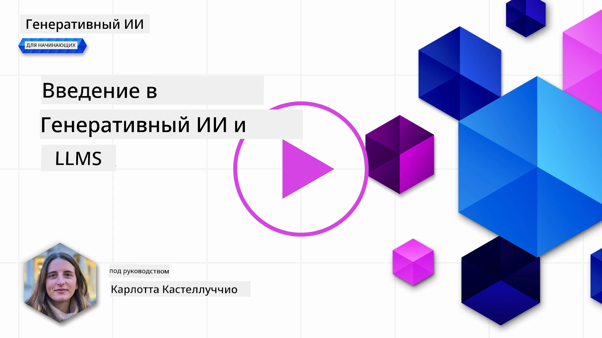
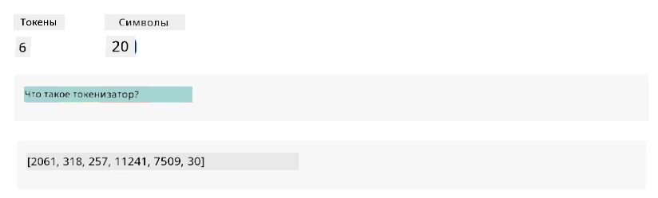
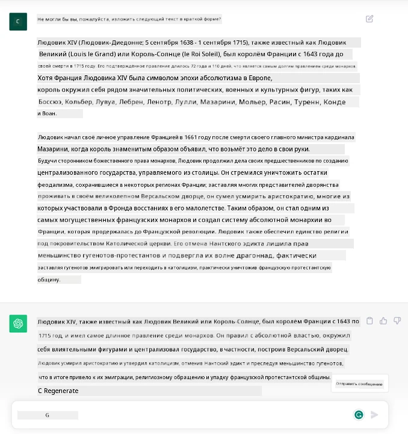
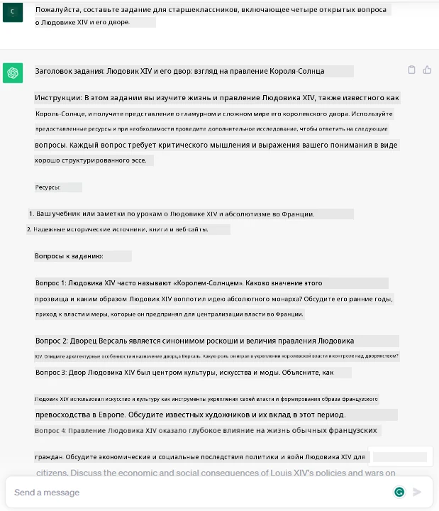
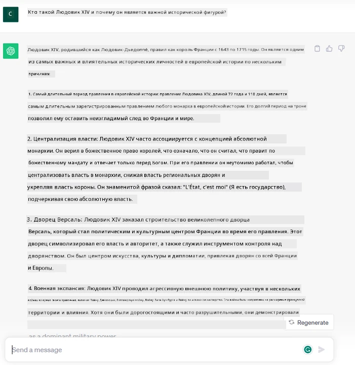
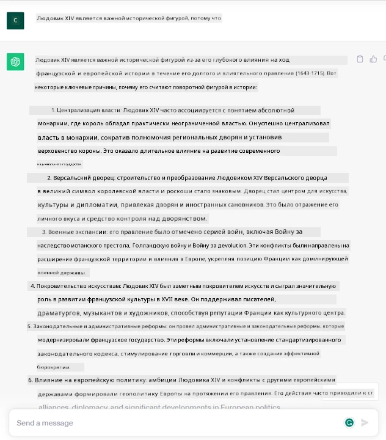
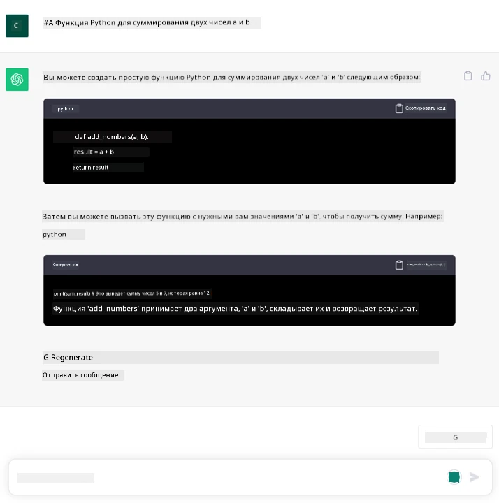

# Введение в генеративный ИИ и крупные языковые модели

_(Нажмите на изображение выше, чтобы посмотреть видео этого урока)_

Генеративный ИИ — это искусственный интеллект, способный создавать текст, изображения и другие типы контента. Что делает его фантастической технологией — это демократизация ИИ, каждый может использовать его, имея лишь текстовый запрос, предложение, написанное на естественном языке. Вам не нужно изучать такие языки, как Java или SQL, чтобы добиться чего-то значимого, всё, что нужно — это использовать свой язык, сформулировать запрос, и модель ИИ предложит результат. Применения и влияние этого огромны: вы можете писать или анализировать отчёты, писать приложения и многое другое — всё это за считанные секунды.

В этой учебной программе мы рассмотрим, как наш стартап использует генеративный ИИ для открытия новых сценариев в мире образования и как мы решаем неизбежные вызовы, связанные с социальными последствиями его применения и технологическими ограничениями.

## Введение

В этом уроке мы рассмотрим:

- Введение в бизнес-сценарий: идея и миссия нашего стартапа.
- Генеративный ИИ и как мы пришли к текущему технологическому ландшафту.
- Внутренний механизм крупной языковой модели.
- Основные возможности и практические примеры использования крупномасштабных языковых моделей.

## Цели обучения

После прохождения этого урока вы будете понимать:

- Что такое генеративный ИИ и как работают крупные языковые модели.
- Как можно использовать крупные языковые модели для разных задач с акцентом на образовательные сценарии.

## Сценарий: наш образовательный стартап

Генеративный искусственный интеллект (ИИ) представляет вершину технологий ИИ, расширяя границы того, что раньше считалось невозможным. Генеративные модели ИИ обладают несколькими возможностями и применениями, но в этой программе мы рассмотрим, как он революционизирует образование через вымышленный стартап. Мы будем называть его _наш стартап_. Наш стартап работает в образовательной сфере с амбициозной миссией

> _улучшение доступности обучения в глобальном масштабе, обеспечивая равные возможности получения образования и предоставляя персонализированные учебные программы каждому учащемуся в соответствии с его потребностями_.

Команда нашего стартапа понимает, что мы не сможем достичь этой цели без использования одного из самых мощных инструментов современности — крупномасштабных языковых моделей (LLM).

Ожидается, что генеративный ИИ революционизирует текущие методы обучения и преподавания, предоставляя студентам виртуальных преподавателей, доступных 24 часа в сутки, которые обеспечивают обширные знания и примеры, а преподавателям — инновационные инструменты для оценки учеников и обратной связи.

Давайте для начала определим базовые понятия и терминологию, которую мы будем использовать на протяжении всей программы.

## Как появился генеративный ИИ?

Несмотря на огромный _шумиху_, возникшую после недавних анонсов генеративных моделей ИИ, это технология создавалась десятилетиями, с первыми исследованиями, начавшимися еще в 60-х годах. Сейчас мы достигли этапа, когда ИИ обладает когнитивными возможностями, схожими с человеческими, например, умением вести разговоры, что демонстрируют такие системы, как [OpenAI ChatGPT](https://openai.com/chatgpt) или [Microsoft Copilot](https://copilot.microsoft.com/?WT.mc_id=academic-105485-koreyst), который также использует GPT-модель для интерактивного веб-поиска.

Вернемся немного назад: первые прототипы ИИ представляли собой чатботов с типографским вводом, основывашихся на базе знаний, составленной группой экспертов и представленной в компьютере. Ответы в базе данных триггерились ключевыми словами, появлявшимися во входном тексте.
Однако вскоре стало очевидно, что такой подход, основанный на чатботах с типографским вводом, плохо масштабируется.

### Статистический подход к ИИ: машинное обучение

Переломным моментом стали 90-е годы, когда для анализа текста начали применять статистический подход. Это привело к разработке новых алгоритмов — известных как машинное обучение — способных выявлять закономерности в данных без явного программирования. Такой подход позволяет машинам симулировать понимание человеческого языка: статистическая модель обучается на парах «текст-метка», что позволяет классифицировать неузнанные входы с заранее определенной меткой, отражающей намерение сообщения.

### Нейронные сети и современные виртуальные ассистенты

В последние годы технологическое развитие аппаратного обеспечения, способного обрабатывать большие объемы данных и сложные вычисления, стимулировало исследования ИИ и привело к разработке продвинутых алгоритмов машинного обучения, известных как нейронные сети или глубокое обучение.

Нейронные сети (в особенности рекуррентные нейронные сети — RNN) значительно улучшили обработку естественного языка, позволяя более осмысленно представлять значение текста с учетом контекста слова в предложении.

Эта технология лежит в основе виртуальных ассистентов, появившихся в первом десятилетии нового века, которые отлично интерпретируют человеческий язык, выявляют потребность и выполняют действие для её удовлетворения — например, отвечают по заранее написанному сценарию или используют сторонний сервис.

### Современность, генеративный ИИ

Вот так мы и пришли к генеративному ИИ сегодня, который можно рассматривать как подмножество глубокого обучения.

После десятилетий исследований в области ИИ появилась новая архитектура модели — называемая _Transformer_ — которая преодолела ограничения RNN, позволив обрабатывать значительно более длинные текстовые последовательности на входе. Трансформеры основаны на механизме внимания, который позволяет модели придавать разный вес входным данным, «обращая больше внимания» туда, где сосредоточена наиболее релевантная информация, независимо от их порядка в последовательности.

Большинство современных генеративных моделей ИИ, также известных как крупные языковые модели (LLM), работают именно на этой архитектуре. Интересно, что эти модели — обученные на огромном количестве неразмеченных данных из разнообразных источников, таких как книги, статьи и веб-сайты — способны адаптироваться к широкому кругу задач и генерировать грамматически правильный текст с проявлениями творчества. Таким образом, они не только значительно улучшили способность машины «понимать» входной текст, но и дали возможность создавать оригинальные ответы на естественном языке.

## Как работают крупные языковые модели?

В следующей главе мы рассмотрим разные типы генеративных моделей ИИ, а пока давайте изучим, как работают крупные языковые модели, с акцентом на модели OpenAI GPT (Generative Pre-trained Transformer).

- **Токенизатор, текст в числа**: Крупные языковые модели получают текст на вход и создают текст на выход. Однако будучи статистическими моделями, они значительно лучше работают с числами, чем с текстовыми последовательностями. Поэтому каждый вход обрабатывается токенизатором перед подачей в ядро модели. Токен — это кусок текста, состоящий из переменного количества символов, поэтому основная задача токенизатора — разбить входной текст на массив токенов. Затем каждый токен отображается в индекс токена — целочисленное представление исходного текстового куска.

- **Предсказание выходных токенов**: Получив n токенов на входе (максимальное значение n зависит от модели), модель способна предсказать один токен на выходе. Этот токен затем включается во вход следующей итерации, по принципу расширяющегося окна, обеспечивая лучший пользовательский опыт, когда вы получаете одно или несколько предложений в ответ. Это объясняет, почему, если вы когда-либо пользовались ChatGPT, вы могли заметить, что он иногда останавливается посреди предложения.

- **Процесс выбора, распределение вероятностей**: Выходной токен выбирается моделью в зависимости от вероятности его появления после текущей текстовой последовательности. Модель предсказывает распределение вероятностей для всех возможных «следующих токенов», рассчитанное на основе её обучения. Однако токен с наивысшей вероятностью не всегда выбирается. В этот выбор добавляется элемент случайности, благодаря чему модель ведёт себя недетерминированно — мы не получаем тот же самый ответ для одного и того же входа каждый раз. Этот уровень случайности вводится для имитации процесса творческого мышления и регулируется параметром модели, называемым температурой.

## Как наш стартап может использовать крупные языковые модели?

Теперь, когда мы лучше понимаем внутренний механизм крупной языковой модели, давайте рассмотрим несколько практических примеров наиболее распространённых задач, с которыми они хорошо справляются, ориентируясь на наш бизнес-сценарий.
Мы говорили, что основная способность крупной языковой модели — _генерировать текст с нуля, начиная с текстового ввода на естественном языке_.

Но какой именно текстовый вход и выход?
Вход крупной языковой модели называется запросом (prompt), а выход — завершением (completion), термином, относящимся к механизму модели генерации следующего токена для дополнения текущего входа. Мы подробно изучим, что такое запрос и как его формулировать, чтобы максимально эффективно использовать модель. Пока можно сказать, что запрос может включать:

- **Инструкция**, указывающая тип ожидаемого от модели результата. Такая инструкция иногда может содержать примеры или дополнительные данные.

  1. Резюмирование статьи, книги, обзоров продуктов и др., а также извлечение инсайтов из неструктурированных данных.
    
    
  
  2. Креативное придумывание и создание статьи, эссе, задания и т.д.
      
     

- **Вопрос**, заданный в форме диалога с агентом.
  
  

- Фрагмент **текста для дополнения**, что является косвенным запросом о помощи в написании.
  
  

- Фрагмент **кода** с просьбой объяснить и задокументировать его, или комментарий с просьбой сгенерировать кусок кода для конкретной задачи.
  
  

Приведённые выше примеры достаточно просты и не претендуют на исчерпывающее демонстрирование возможностей крупных языковых моделей. Они служат для демонстрации потенциала генеративного ИИ, в частности, но не только в образовательных контекстах.

Также результат, получаемый от генеративной модели ИИ, не всегда совершенен, и порой творческий подход модели может сыграть с ней злую шутку, приводя к выходу, который человек может воспринять как мистификацию реальности или даже как оскорбительный. Генеративный ИИ не является интеллигентным — по крайней мере, в более широком понимании интеллекта, включающего критическое и творческое мышление, эмоциональный интеллект; он не детерминирован и не всегда надёжен, потому что выдумки, такие как ошибочные ссылки, содержимое и утверждения, могут смешиваться с корректной информацией и подаваться убедительно и уверенно. В последующих уроках мы будем рассматривать все эти ограничения и способы их смягчения.

## Задание

В вашем задании — изучить больше о [генеративном ИИ](https://en.wikipedia.org/wiki/Generative_artificial_intelligence?WT.mc_id=academic-105485-koreyst) и попытаться определить область, где сегодня можно добавить генеративный ИИ, но он там еще не используется. Какими бы были отличия от работы «по-старому»? Смогли бы вы сделать то, что раньше было невозможно, или процесс стал бы быстрее? Напишите 300-словное резюме того, каким бы был ваш идеальный AI-стартап, включив заголовки «Проблема», «Как я использую ИИ», «Влияние» и, опционально, бизнес-план.

Если вы справились с этим заданием, возможно, вы готовы подать заявку в инкубатор Microsoft, [Microsoft for Startups Founders Hub](https://www.microsoft.com/startups?WT.mc_id=academic-105485-koreyst). Мы предлагаем кредиты для Azure, OpenAI, менторство и многое другое — загляните!

## Проверка знаний

Что верно про крупные языковые модели?

1. Вы получаете одинаковый ответ каждый раз.
1. Они делают всё идеально, отлично считают, генерируют работающий код и т.д.
1. Ответ может меняться, даже при одном и том же запросе. Они также хорошо подходят для создания первого варианта текста или кода, но результаты нужно дорабатывать.

А: 3, крупная языковая модель работает недетерминированно, ответ варьируется, при этом вы можете контролировать этот разброс через настройку температуры. Также не стоит ожидать идеальных результатов — она создана для выполнения тяжёлой работы за вас, что часто означает получение хорошего первого наброска, который требуется постепенно улучшать.

## Отличная работа! Продолжайте обучение

После прохождения этого урока ознакомьтесь с нашей [коллекцией по генеративному ИИ](https://aka.ms/genai-collection?WT.mc_id=academic-105485-koreyst), чтобы продолжать углублять знания в области генеративного ИИ!

Перейдите к Уроку 2, где мы рассмотрим, как [исследовать и сравнивать различные типы LLM](../02-exploring-and-comparing-different-llms/README.md?WT.mc_id=academic-105485-koreyst)!

---

<!-- CO-OP TRANSLATOR DISCLAIMER START -->
**Отказ от ответственности**:
Этот документ был переведен с использованием сервиса машинного перевода [Co-op Translator](https://github.com/Azure/co-op-translator). Несмотря на наши усилия по обеспечению точности, имейте в виду, что автоматический перевод может содержать ошибки или неточности. Оригинальный документ на его исходном языке следует считать авторитетным источником. Для получения критически важной информации рекомендуется обратиться к профессиональному человеческому переводу. Мы не несем ответственности за любые недоразумения или неправильные толкования, возникшие в результате использования этого перевода.
<!-- CO-OP TRANSLATOR DISCLAIMER END -->