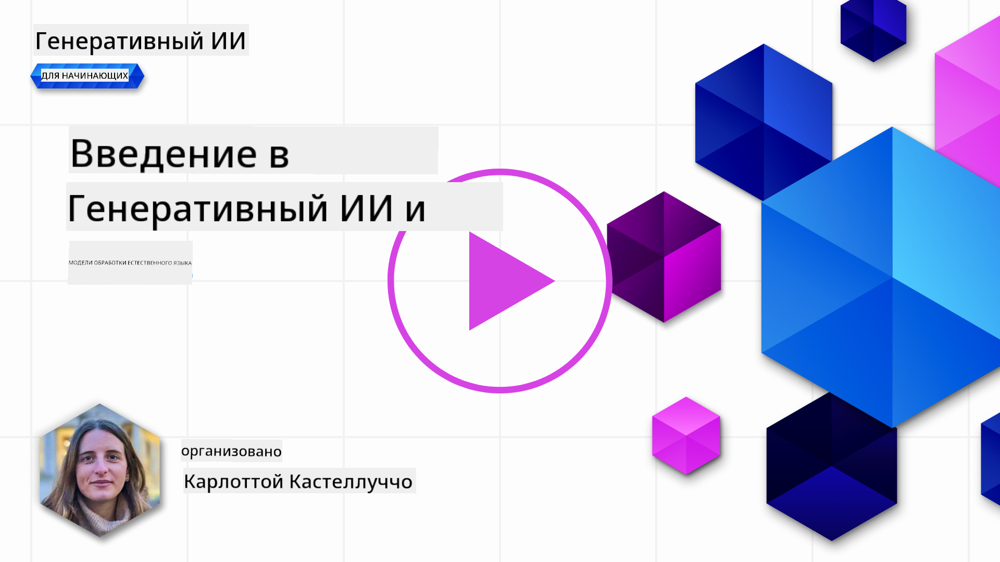
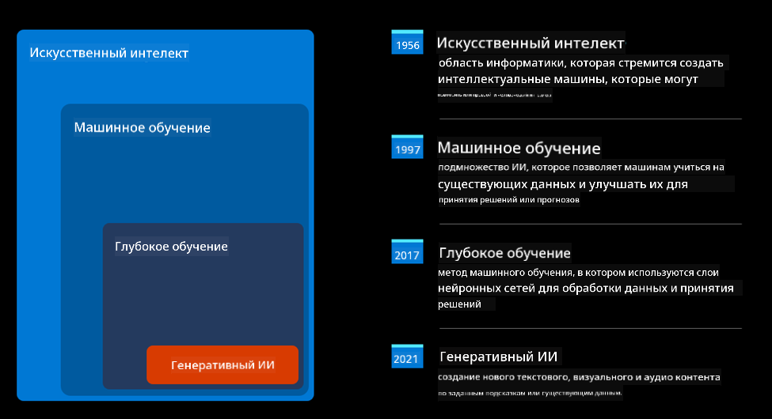
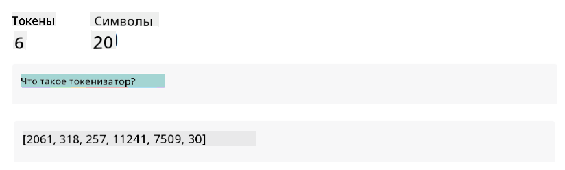
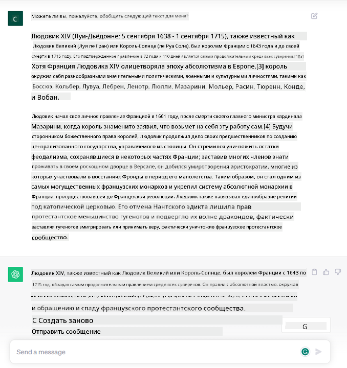
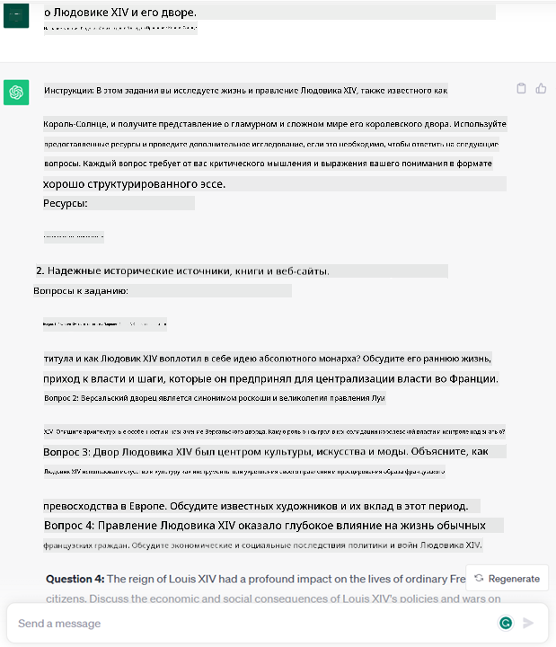
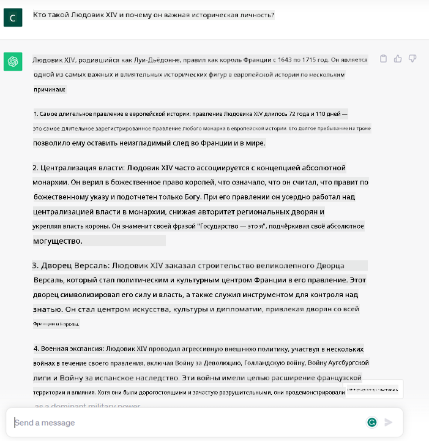
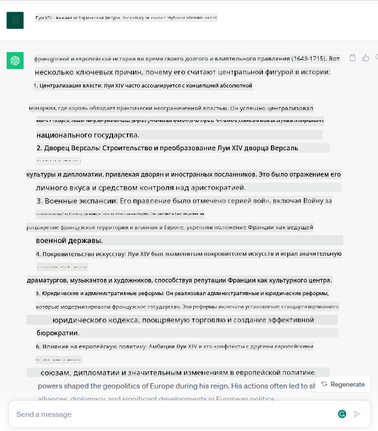
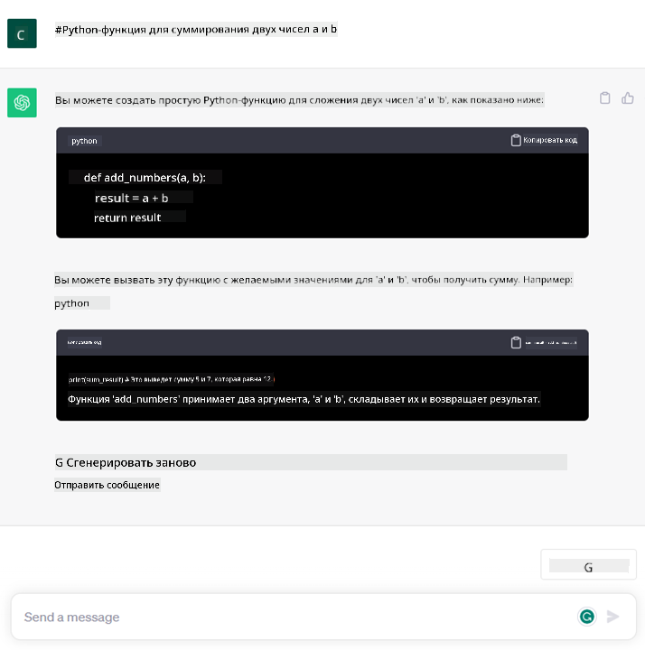

<!--
CO_OP_TRANSLATOR_METADATA:
{
  "original_hash": "f53ba0fa49164f9323043f1c6b11f2b1",
  "translation_date": "2025-06-25T09:36:33+00:00",
  "source_file": "01-introduction-to-genai/README.md",
  "language_code": "ru"
}
-->
# Введение в генеративный ИИ и большие языковые модели

_(Нажмите на изображение выше, чтобы посмотреть видео этого урока)_

Генеративный ИИ — это искусственный интеллект, способный генерировать текст, изображения и другие виды контента. Это замечательная технология, потому что она демократизирует ИИ: любой может использовать ее, просто задав текстовый запрос, предложение на естественном языке. Нет необходимости изучать языки программирования, такие как Java или SQL, чтобы добиться чего-то значимого; все, что нужно, — это использовать свой язык, сформулировать запрос, и модель ИИ предложит решение. Приложения и влияние этого огромны: вы можете писать или понимать отчеты, создавать приложения и многое другое за считанные секунды.

В этой учебной программе мы изучим, как наш стартап использует генеративный ИИ для открытия новых сценариев в мире образования и как мы решаем неизбежные проблемы, связанные с социальными последствиями его применения и ограничениями технологий.

## Введение

В этом уроке будет рассмотрено:

- Введение в бизнес-сценарий: идея и миссия нашего стартапа.
- Генеративный ИИ и как мы пришли к текущему технологическому ландшафту.
- Внутреннее устройство большой языковой модели.
- Основные возможности и практические случаи использования больших языковых моделей.

## Цели обучения

После завершения этого урока вы поймете:

- Что такое генеративный ИИ и как работают большие языковые модели.
- Как можно использовать большие языковые модели для различных случаев, с акцентом на образовательные сценарии.

## Сценарий: наш образовательный стартап

Генеративный искусственный интеллект (ИИ) представляет собой вершину технологий ИИ, расширяющую границы того, что ранее казалось невозможным. Генеративные ИИ модели имеют множество возможностей и приложений, но в рамках этой учебной программы мы исследуем, как он революционизирует образование через вымышленный стартап. Мы будем называть этот стартап _нашим стартапом_. Наш стартап работает в образовательной сфере с амбициозной миссией

> _улучшение доступности обучения в глобальном масштабе, обеспечение равного доступа к образованию и предоставление персонализированного опыта обучения каждому учащемуся в соответствии с его потребностями_.

Команда нашего стартапа понимает, что мы не сможем достичь этой цели без использования одного из самых мощных инструментов современности – больших языковых моделей (LLM).

Ожидается, что генеративный ИИ революционизирует способ, которым мы учимся и преподаем сегодня: студенты получат в свое распоряжение виртуальных учителей, доступных 24 часа в сутки, которые предоставляют огромное количество информации и примеров, а учителя смогут использовать инновационные инструменты для оценки своих учеников и предоставления обратной связи.

Для начала давайте определим некоторые базовые концепции и термины, которые мы будем использовать в течение всей учебной программы.

## Как мы получили генеративный ИИ?

Несмотря на невероятный _ажиотаж_, вызванный недавними анонсами генеративных ИИ моделей, эта технология разрабатывалась десятилетиями, и первые исследовательские усилия датируются 60-ми годами. Сейчас мы находимся на этапе, когда ИИ обладает когнитивными способностями человека, такими как ведение беседы, что демонстрируется, например, [OpenAI ChatGPT](https://openai.com/chatgpt) или [Bing Chat](https://www.microsoft.com/edge/features/bing-chat?WT.mc_id=academic-105485-koreyst), который также использует модель GPT для поиска в вебе в разговорах Bing.

Вернемся немного назад: первые прототипы ИИ состояли из печатных чат-ботов, полагающихся на базу знаний, извлеченную из группы экспертов и представленную в компьютере. Ответы в базе знаний вызывались ключевыми словами, появляющимися в вводимом тексте. Однако вскоре стало ясно, что такой подход, использующий печатные чат-боты, плохо масштабируется.

### Статистический подход к ИИ: Машинное обучение

Поворотный момент наступил в 90-х годах с применением статистического подхода к анализу текста. Это привело к разработке новых алгоритмов – известных как машинное обучение – способных изучать закономерности из данных без явного программирования. Этот подход позволяет машинам имитировать понимание человеческого языка: статистическая модель обучается на текстовых парах, что позволяет модели классифицировать неизвестный входной текст с предопределенной меткой, представляющей намерение сообщения.

### Нейронные сети и современные виртуальные помощники

В последние годы технологическая эволюция аппаратного обеспечения, способного обрабатывать большие объемы данных и более сложные вычисления, стимулировала исследования в области ИИ, что привело к разработке продвинутых алгоритмов машинного обучения, известных как нейронные сети или алгоритмы глубокого обучения.

Нейронные сети (и в частности рекуррентные нейронные сети – RNN) значительно улучшили обработку естественного языка, позволив представлять значение текста более значимым образом, учитывая контекст слова в предложении.

Эта технология легла в основу виртуальных помощников, появившихся в первом десятилетии нового века, которые очень эффективно интерпретируют человеческий язык, идентифицируют потребность и выполняют действие для ее удовлетворения – например, отвечают с помощью заранее определенного сценария или используют сторонний сервис.

### Настоящее время, генеративный ИИ

Итак, вот как мы пришли к генеративному ИИ сегодня, который можно рассматривать как подмножество глубокого обучения.

После десятилетий исследований в области ИИ новая архитектура моделей – называемая _Transformer_ – преодолела ограничения RNN, будучи способной принимать гораздо более длинные последовательности текста на вход. Трансформеры основаны на механизме внимания, позволяющем модели придавать разный вес входным данным, которые она получает, «уделяя больше внимания» там, где сосредоточена наиболее релевантная информация, независимо от их порядка в текстовой последовательности.

Большинство последних генеративных ИИ моделей – также известных как большие языковые модели (LLM), поскольку они работают с текстовыми входными и выходными данными – действительно основаны на этой архитектуре. Интересно, что эти модели – обученные на огромном количестве неразмеченных данных из различных источников, таких как книги, статьи и веб-сайты – могут адаптироваться к широкому кругу задач и генерировать грамматически правильный текст с элементами креативности. Таким образом, они не только невероятно улучшили способность машины «понимать» входной текст, но и позволили ей генерировать оригинальный ответ на человеческом языке.

## Как работают большие языковые модели?

В следующей главе мы рассмотрим различные типы генеративных ИИ моделей, но пока давайте взглянем на то, как работают большие языковые модели, сосредоточив внимание на моделях OpenAI GPT (Generative Pre-trained Transformer).

- **Токенизация, текст в числа**: Большие языковые модели принимают текст на вход и генерируют текст на выходе. Однако, будучи статистическими моделями, они гораздо лучше работают с числами, чем с текстовыми последовательностями. Поэтому каждый ввод в модель обрабатывается токенизатором перед использованием основной моделью. Токен – это фрагмент текста, состоящий из переменного количества символов, поэтому основная задача токенизатора – разбить ввод на массив токенов. Затем каждый токен сопоставляется с индексом токена, который является целочисленным кодированием исходного текстового фрагмента.

- **Предсказание выходных токенов**: Принимая n токенов на вход (с максимальным n, варьирующимся от одной модели к другой), модель может предсказать один токен на выходе. Этот токен затем включается во вход следующей итерации, в расширяющемся оконном шаблоне, обеспечивая лучший пользовательский опыт получения одного (или нескольких) предложений в качестве ответа. Это объясняет, почему, если вы когда-либо играли с ChatGPT, вы могли заметить, что иногда он останавливается на середине предложения.

- **Процесс выбора, распределение вероятностей**: Выходной токен выбирается моделью в соответствии с его вероятностью появления после текущей текстовой последовательности. Это потому, что модель предсказывает распределение вероятностей для всех возможных «следующих токенов», рассчитываемое на основе ее обучения. Однако не всегда выбирается токен с наивысшей вероятностью из полученного распределения. В этот выбор добавляется степень случайности, так что модель действует недетерминированным образом - мы не получаем точно такой же вывод для одного и того же ввода. Эта степень случайности добавляется для моделирования процесса креативного мышления и может быть настроена с помощью параметра модели, называемого температурой.

## Как наш стартап может использовать большие языковые модели?

Теперь, когда мы лучше понимаем внутреннее устройство большой языковой модели, давайте рассмотрим некоторые практические примеры наиболее распространенных задач, которые они могут выполнять довольно хорошо, с акцентом на наш бизнес-сценарий. Мы говорили, что основная способность большой языковой модели – _генерация текста с нуля, начиная с текстового ввода, написанного на естественном языке_.

Но какой вид текстового ввода и вывода?
Ввод большой языковой модели известен как подсказка, а вывод – как завершение, термин, который относится к механизму модели генерации следующего токена для завершения текущего ввода. Мы углубимся в то, что такое подсказка и как ее спроектировать, чтобы получить максимум от нашей модели. Но пока скажем, что подсказка может включать:

- **Инструкцию**, уточняющую тип вывода, который мы ожидаем от модели. Эта инструкция иногда может включать некоторые примеры или дополнительные данные.

  1. Суммирование статьи, книги, отзывов о продукте и других материалов, а также извлечение информации из неструктурированных данных.
    
    
  
  2. Креативное создание и дизайн статьи, эссе, задания и других материалов.
      
     

- **Вопрос**, заданный в форме беседы с агентом.
  
  

- Фрагмент **текста для завершения**, который подразумевает просьбу о помощи в написании.
  
  

- Фрагмент **кода** вместе с просьбой объяснить и задокументировать его или комментарий с просьбой сгенерировать фрагмент кода для выполнения конкретной задачи.
  
  

Приведенные выше примеры довольно просты и не предназначены для исчерпывающей демонстрации возможностей больших языковых моделей. Они предназначены для демонстрации потенциала использования генеративного ИИ, в частности, но не только в образовательных контекстах.

Кроме того, вывод генеративной ИИ модели не является идеальным, и иногда креативность модели может сработать против нее, приводя к выводу, который представляет собой комбинацию слов, которые пользователь может интерпретировать как искажение реальности, или может быть оскорбительным. Генеративный ИИ не является интеллектуальным - по крайней мере, в более всеобъемлющем определении интеллекта, включающем критическое и креативное мышление или эмоциональный интеллект; он не является детерминированным и не является надежным, поскольку выдумки, такие как ошибочные ссылки, контент и утверждения, могут быть скомбинированы с правильной информацией и представлены убедительным и уверенным образом. В следующих уроках мы будем разбираться со всеми этими ограничениями и посмотрим, что мы можем сделать, чтобы их смягчить.

## Задание

Ваше задание - прочитать больше о [генеративном ИИ](https://en.wikipedia.org/wiki/Generative_artificial_intelligence?WT.mc_id=academic-105485-koreyst) и попытаться определить область, в которой вы добавили бы генеративный ИИ сегодня, где его нет. Чем бы это отличалось от "старого способа", можете ли вы сделать что-то, чего не могли раньше, или вы быстрее? Напишите резюме на 300 слов о том, как бы выглядел ваш стартап мечты в области ИИ и включите заголовки, такие как "Проблема", "Как я бы использовал ИИ", "Влияние" и, возможно, бизнес-план.

Если вы выполнили это задание, вы даже можете быть готовы подать заявку в инкубатор Microsoft, [Microsoft for Startups Founders Hub](https://www.microsoft.com/startups?WT.mc_id=academic-105485-koreyst), мы предлагаем кредиты для Azure, OpenAI, наставничество и многое другое, ознакомьтесь!

## Проверка знаний

Что верно относительно больших языковых моделей?

1. Вы получаете точно такой же ответ каждый раз.
1. Они делают все идеально, отлично складывают числа, создают работающий код и т.д.
1. Ответ может варьироваться, несмотря на использование одной и той же подсказки. Они также отлично подходят для создания первого черновика чего-либо, будь то текст или код. Но вам нужно улучшить результаты.

A: 3, LLM недетерминирован, ответ варьируется, однако, вы можете контролировать его вариативность с помощью настройки температуры. Вы также не должны ожидать, что он будет делать все идеально, он здесь, чтобы выполнять тяжелую работу за вас, что часто означает, что вы получаете хорошую первую попытку чего-то, что вам нужно постепенно улучшать.

## Отличная работа! Продолжайте обучение

После завершения этого урока ознакомьтесь с нашей [коллекцией обучения генеративному ИИ](https://aka.ms/genai-collection?WT.mc_id=academic-105485-koreyst), чтобы продолжить повышение уровня ваших знаний о генеративном ИИ!

Переходите к уроку 2, где мы рассмотрим, как [исследовать и сравнивать различные типы LLM](../02-exploring-and-comparing-different-llms/README.md?WT.mc_id=academic-105485-koreyst)!

**Отказ от ответственности**:  
Этот документ был переведен с помощью сервиса автоматического перевода [Co-op Translator](https://github.com/Azure/co-op-translator). Несмотря на наши усилия обеспечить точность, имейте в виду, что автоматические переводы могут содержать ошибки или неточности. Оригинальный документ на его родном языке следует считать авторитетным источником. Для получения критически важной информации рекомендуется профессиональный перевод человеком. Мы не несем ответственности за любые недопонимания или неправильные толкования, возникшие в результате использования этого перевода.