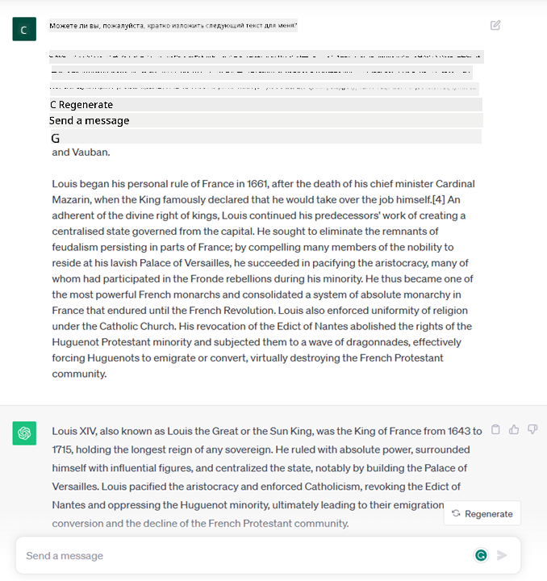
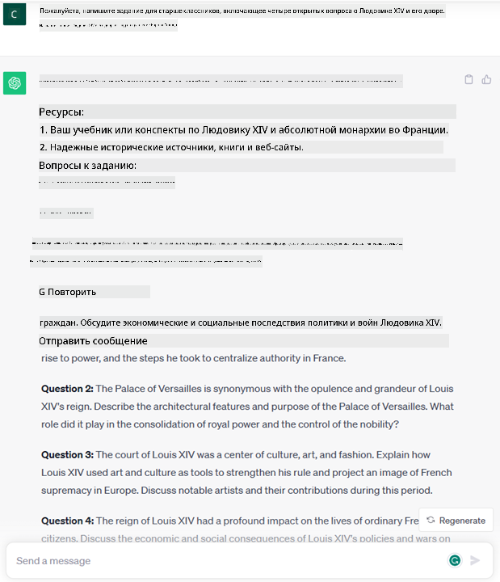
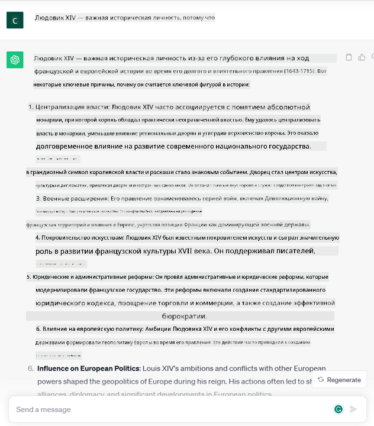

<!--
CO_OP_TRANSLATOR_METADATA:
{
  "original_hash": "bfb7901bdbece1ba3e9f35c400ca33e8",
  "translation_date": "2025-10-17T15:07:58+00:00",
  "source_file": "01-introduction-to-genai/README.md",
  "language_code": "ru"
}
-->
# Введение в генеративный ИИ и большие языковые модели

_(Нажмите на изображение выше, чтобы посмотреть видео урока)_

Генеративный ИИ — это искусственный интеллект, способный создавать текст, изображения и другие виды контента. Что делает его удивительной технологией, так это то, что он демократизирует ИИ: любой человек может использовать его, просто написав текстовый запрос, предложение на естественном языке. Вам не нужно изучать языки программирования, такие как Java или SQL, чтобы добиться чего-то значимого — достаточно использовать свой язык, выразить, что вы хотите, и модель ИИ предложит вам решение. Применение и влияние этой технологии огромны: вы можете писать или анализировать отчеты, создавать приложения и многое другое всего за несколько секунд.

В рамках этой программы мы изучим, как наш стартап использует генеративный ИИ для открытия новых возможностей в образовательной сфере, а также как мы справляемся с неизбежными вызовами, связанными с социальными последствиями его применения и ограничениями технологии.

## Введение

В этом уроке мы рассмотрим:

- Введение в бизнес-сценарий: идея и миссия нашего стартапа.
- Генеративный ИИ и как мы пришли к текущему технологическому ландшафту.
- Принципы работы больших языковых моделей.
- Основные возможности и практические примеры использования больших языковых моделей.

## Цели обучения

После завершения этого урока вы будете понимать:

- Что такое генеративный ИИ и как работают большие языковые модели.
- Как можно использовать большие языковые модели для различных задач, с акцентом на образовательные сценарии.

## Сценарий: наш образовательный стартап

Генеративный искусственный интеллект (ИИ) представляет собой вершину технологий ИИ, расширяя границы того, что ранее казалось невозможным. Генеративные модели ИИ обладают множеством возможностей и применений, но в рамках этой программы мы изучим, как они революционизируют образование через вымышленный стартап. Мы будем называть этот стартап _нашим стартапом_. Наш стартап работает в образовательной сфере с амбициозной миссией:

> _улучшение доступности обучения в глобальном масштабе, обеспечение равного доступа к образованию и предоставление персонализированных образовательных опытов каждому учащемуся в соответствии с его потребностями_.

Команда нашего стартапа понимает, что мы не сможем достичь этой цели без использования одного из самых мощных инструментов современности — больших языковых моделей (LLMs).

Ожидается, что генеративный ИИ революционизирует способы обучения и преподавания, предоставляя студентам виртуальных учителей, доступных 24 часа в сутки, которые предоставляют огромные объемы информации и примеров, а преподавателям — инновационные инструменты для оценки своих учеников и предоставления обратной связи.

Для начала давайте определим некоторые основные понятия и термины, которые мы будем использовать в рамках программы.

## Как появился генеративный ИИ?

Несмотря на невероятный _ажиотаж_, вызванный недавними анонсами моделей генеративного ИИ, эта технология разрабатывалась десятилетиями, начиная с первых исследований в 60-х годах. Сегодня мы достигли уровня, когда ИИ обладает когнитивными способностями человека, такими как ведение беседы, что демонстрируют, например, [OpenAI ChatGPT](https://openai.com/chatgpt) или [Bing Chat](https://www.microsoft.com/edge/features/bing-chat?WT.mc_id=academic-105485-koreyst), который также использует модель GPT для веб-поиска и общения.

Если немного вернуться назад, первые прототипы ИИ представляли собой печатные чат-боты, которые опирались на базу знаний, извлеченную из группы экспертов и представленную в компьютере. Ответы из базы знаний активировались ключевыми словами, появляющимися во входном тексте. Однако вскоре стало ясно, что такой подход с использованием печатных чат-ботов плохо масштабируется.

### Статистический подход к ИИ: машинное обучение

Переломный момент наступил в 90-х годах с применением статистического подхода к анализу текста. Это привело к разработке новых алгоритмов — известных как машинное обучение — способных изучать закономерности из данных без явного программирования. Этот подход позволил машинам имитировать понимание человеческого языка: статистическая модель обучалась на парах текст-метка, что позволяло модели классифицировать неизвестный входной текст с предопределенной меткой, представляющей намерение сообщения.

### Нейронные сети и современные виртуальные ассистенты

В последние годы технологическая эволюция аппаратного обеспечения, способного обрабатывать большие объемы данных и более сложные вычисления, стимулировала исследования в области ИИ, что привело к разработке продвинутых алгоритмов машинного обучения, известных как нейронные сети или алгоритмы глубокого обучения.

Нейронные сети (и в частности рекуррентные нейронные сети — RNNs) значительно улучшили обработку естественного языка, позволяя более осмысленно представлять значение текста, учитывая контекст слова в предложении.

Эта технология стала основой виртуальных ассистентов, появившихся в первом десятилетии нового века, которые были очень эффективны в интерпретации человеческого языка, идентификации потребности и выполнении действия для ее удовлетворения — например, ответ с заранее заданным скриптом или использование стороннего сервиса.

### Сегодняшний день: генеративный ИИ

Так мы пришли к сегодняшнему генеративному ИИ, который можно рассматривать как подмножество глубокого обучения.

После десятилетий исследований в области ИИ новая архитектура моделей — называемая _Transformer_ — преодолела ограничения RNNs, позволяя обрабатывать гораздо более длинные последовательности текста на входе. Трансформеры основаны на механизме внимания, который позволяет модели придавать разный вес входным данным, «уделяя больше внимания» наиболее важной информации, независимо от ее порядка в текстовой последовательности.

Большинство современных моделей генеративного ИИ — также известных как большие языковые модели (LLMs), поскольку они работают с текстовыми входами и выходами — действительно основаны на этой архитектуре. Интересно, что эти модели, обученные на огромном количестве неразмеченных данных из различных источников, таких как книги, статьи и веб-сайты, могут адаптироваться к широкому спектру задач и генерировать грамматически правильный текст с элементами креативности. Таким образом, они не только невероятно улучшили способность машины «понимать» входной текст, но и позволили ей генерировать оригинальный ответ на человеческом языке.

## Как работают большие языковые модели?

В следующей главе мы рассмотрим различные типы моделей генеративного ИИ, но пока давайте разберемся, как работают большие языковые модели, сосредоточив внимание на моделях OpenAI GPT (Generative Pre-trained Transformer).

- **Токенизация, преобразование текста в числа**: Большие языковые модели принимают текст на вход и генерируют текст на выходе. Однако, будучи статистическими моделями, они лучше работают с числами, чем с текстовыми последовательностями. Поэтому каждый входной текст сначала обрабатывается токенизатором, прежде чем попасть в основную модель. Токен — это фрагмент текста, состоящий из переменного количества символов, поэтому основная задача токенизатора — разделить входной текст на массив токенов. Затем каждому токену присваивается индекс токена, который является целочисленным кодированием исходного текстового фрагмента.

- **Предсказание выходных токенов**: Получив n токенов на входе (максимальное значение n варьируется от модели к модели), модель способна предсказать один токен на выходе. Этот токен затем добавляется к входным данным следующей итерации, создавая расширяющееся окно, что улучшает пользовательский опыт, позволяя получать одно (или несколько) предложений в качестве ответа. Это объясняет, почему, если вы когда-либо использовали ChatGPT, вы могли заметить, что иногда он как будто останавливается на середине предложения.

- **Процесс выбора, распределение вероятностей**: Выходной токен выбирается моделью в соответствии с его вероятностью появления после текущей текстовой последовательности. Это связано с тем, что модель предсказывает распределение вероятностей для всех возможных «следующих токенов», рассчитанное на основе ее обучения. Однако не всегда выбирается токен с наивысшей вероятностью из полученного распределения. В этот выбор добавляется степень случайности, чтобы модель действовала недетерминированно — мы не получаем точно такой же ответ на один и тот же запрос. Эта степень случайности добавляется для имитации процесса творческого мышления и может быть настроена с помощью параметра модели, называемого температурой.

## Как наш стартап может использовать большие языковые модели?

Теперь, когда мы лучше понимаем принципы работы больших языковых моделей, давайте рассмотрим несколько практических примеров наиболее распространенных задач, которые они могут выполнять довольно хорошо, с учетом нашего бизнес-сценария. Мы уже упоминали, что основная способность больших языковых моделей — это _генерация текста с нуля, начиная с текстового ввода, написанного на естественном языке_.

Но какой может быть текстовый ввод и вывод?
Входные данные для большой языковой модели называются запросом (prompt), а выходные — завершением (completion), что относится к механизму модели, генерирующему следующий токен для завершения текущего ввода. Мы подробно разберем, что такое запрос и как его составить, чтобы получить максимум от нашей модели. Но пока скажем, что запрос может включать:

- **Инструкцию**, уточняющую тип ожидаемого от модели вывода. Эта инструкция иногда может содержать примеры или дополнительные данные.

  1. Резюмирование статьи, книги, отзывов о продукте и т.д., а также извлечение инсайтов из неструктурированных данных.
    
    
  
  2. Креативное создание и дизайн статьи, эссе, задания и т.д.
      
     

- **Вопрос**, заданный в форме беседы с агентом.
  
  

- Фрагмент **текста для завершения**, который подразумевает запрос на помощь в написании.
  
  

- Фрагмент **кода** вместе с запросом на его объяснение и документирование или комментарий с просьбой сгенерировать код для выполнения конкретной задачи.
  
  

Приведенные выше примеры довольно просты и не предназначены для исчерпывающей демонстрации возможностей больших языковых моделей. Они призваны показать потенциал использования генеративного ИИ, особенно, но не исключительно, в образовательных контекстах.

Кроме того, вывод генеративной модели ИИ не всегда идеален, и иногда креативность модели может сыграть против нее, приводя к результату, который человек может интерпретировать как искажение реальности или даже оскорбление. Генеративный ИИ не является интеллектуальным — по крайней мере, в более широком смысле интеллекта, включающем критическое и творческое мышление или эмоциональный интеллект; он не является детерминированным и не является надежным, так как ошибки, такие как неверные ссылки, содержание и утверждения, могут быть смешаны с правильной информацией и представлены убедительно и уверенно. В следующих уроках мы будем разбираться со всеми этими ограничениями и изучать, что можно сделать для их минимизации.

## Задание

Ваше задание — изучить больше информации о [генеративном ИИ](https://en.wikipedia.org/wiki/Generative_artificial_intelligence?WT.mc_id=academic-105485-koreyst) и попытаться определить область, где вы могли бы применить генеративный ИИ уже сегодня, но где он пока не используется. Чем бы это отличалось от традиционного подхода, смогли бы вы сделать то, что раньше было невозможно, или стали бы быстрее? Напишите краткое изложение на 300 слов о том, как выглядел бы ваш идеальный стартап в области ИИ, и включите заголовки, такие как "Проблема", "Как я бы использовал ИИ", "Влияние" и, по желанию, бизнес-план.

Если вы выполните это задание, возможно, вы даже будете готовы подать заявку в инкубатор Microsoft, [Microsoft for Startups Founders Hub](https://www.microsoft.com/startups?WT.mc_id=academic-105485-koreyst), где мы предлагаем кредиты для Azure, OpenAI, наставничество и многое другое. Ознакомьтесь с подробностями!

## Проверка знаний

Что верно о больших языковых моделях?

1. Вы получаете один и тот же ответ каждый раз.
1. Они делают все идеально, отлично складывают числа, создают рабочий код и т.д.
1. Ответ может варьироваться, несмотря на использование одного и того же запроса. Они также отлично подходят для создания первого черновика текста или кода, но результаты нужно улучшать.

A: 3, LLM недетерминированны, ответ может варьироваться, однако вы можете контролировать его вариативность с помощью настройки температуры. Также не стоит ожидать, что они будут делать все идеально — их задача заключается в том, чтобы выполнять тяжелую работу за вас, часто предоставляя хороший первый вариант, который нужно постепенно улучшать.

## Отличная работа! Продолжайте обучение

После завершения этого урока ознакомьтесь с нашей [коллекцией обучения генеративному ИИ](https://aka.ms/genai-collection?WT.mc_id=academic-105485-koreyst), чтобы продолжить углублять свои знания о генеративном ИИ!
Перейдите к Уроку 2, где мы рассмотрим, как [исследовать и сравнивать различные типы LLM](../02-exploring-and-comparing-different-llms/README.md?WT.mc_id=academic-105485-koreyst)!

---

**Отказ от ответственности**:  
Этот документ был переведен с использованием сервиса автоматического перевода [Co-op Translator](https://github.com/Azure/co-op-translator). Несмотря на наши усилия обеспечить точность, автоматические переводы могут содержать ошибки или неточности. Оригинальный документ на его родном языке следует считать авторитетным источником. Для получения критически важной информации рекомендуется профессиональный перевод человеком. Мы не несем ответственности за любые недоразумения или неправильные интерпретации, возникающие в результате использования данного перевода.