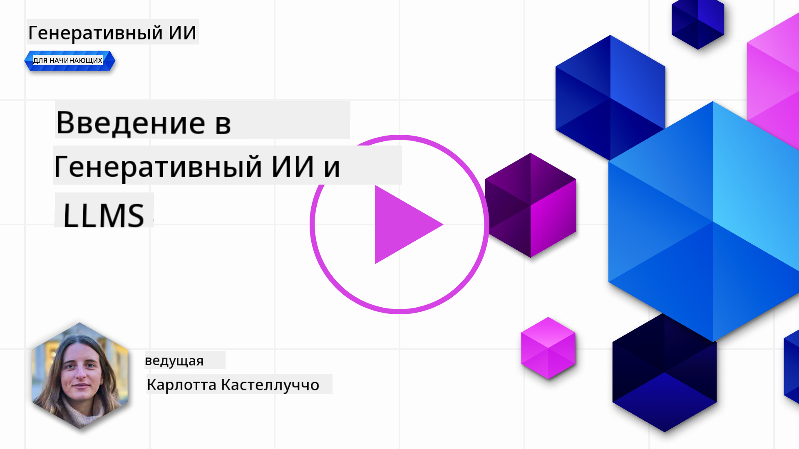
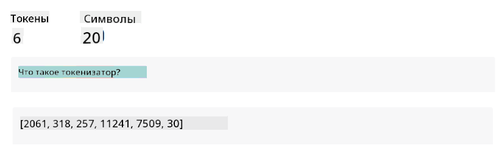
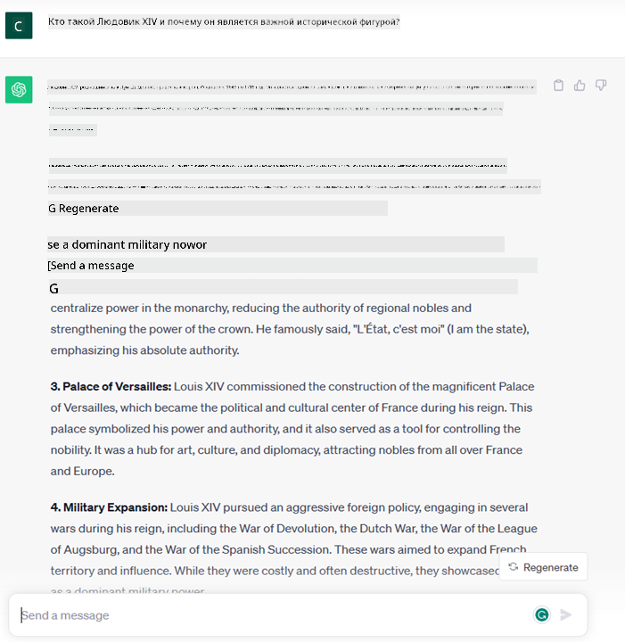

<!--
CO_OP_TRANSLATOR_METADATA:
{
  "original_hash": "f53ba0fa49164f9323043f1c6b11f2b1",
  "translation_date": "2025-07-09T07:41:46+00:00",
  "source_file": "01-introduction-to-genai/README.md",
  "language_code": "ru"
}
-->
# Введение в генеративный ИИ и большие языковые модели

_(Нажмите на изображение выше, чтобы посмотреть видео этого урока)_

Генеративный ИИ — это искусственный интеллект, способный создавать текст, изображения и другие виды контента. Его уникальность в том, что он делает ИИ доступным для всех: достаточно всего лишь текстового запроса — предложения, написанного на естественном языке. Вам не нужно изучать языки программирования вроде Java или SQL, чтобы добиться результата, достаточно просто сформулировать свою задачу, и модель ИИ предложит решение. Возможности и влияние этой технологии огромны: вы можете быстро писать и анализировать отчёты, создавать приложения и многое другое — всё это за считанные секунды.

В этом курсе мы рассмотрим, как наш стартап использует генеративный ИИ для создания новых возможностей в сфере образования, а также как мы решаем неизбежные проблемы, связанные с социальными последствиями применения технологии и её ограничениями.

## Введение

В этом уроке мы рассмотрим:

- Введение в бизнес-сценарий: идея и миссия нашего стартапа.
- Генеративный ИИ и современный технологический ландшафт.
- Внутреннее устройство большой языковой модели.
- Основные возможности и практические примеры использования больших языковых моделей.

## Цели обучения

После прохождения урока вы будете понимать:

- Что такое генеративный ИИ и как работают большие языковые модели.
- Как можно использовать большие языковые модели для различных задач, с акцентом на образовательные сценарии.

## Сценарий: наш образовательный стартап

Генеративный искусственный интеллект (ИИ) — это вершина развития технологий ИИ, расширяющая границы возможного. Генеративные модели ИИ обладают множеством возможностей и применений, но в этом курсе мы сосредоточимся на том, как они меняют образование через призму вымышленного стартапа, который мы будем называть _наш стартап_. Наш стартап работает в сфере образования с амбициозной миссией:

> _улучшить доступность обучения в глобальном масштабе, обеспечивая равные возможности для образования и предоставляя персонализированный опыт обучения каждому учащемуся в соответствии с его потребностями_.

Команда нашего стартапа понимает, что достичь этой цели без использования одного из самых мощных инструментов современности — больших языковых моделей (LLM) — невозможно.

Ожидается, что генеративный ИИ революционизирует способы обучения и преподавания, предоставляя студентам виртуальных преподавателей, доступных 24 часа в сутки, которые могут предоставить огромное количество информации и примеров, а преподавателям — инновационные инструменты для оценки и обратной связи.

Для начала определим основные понятия и термины, которые мы будем использовать в курсе.

## Как появился генеративный ИИ?

Несмотря на огромный _хайп_, вызванный недавними анонсами генеративных моделей ИИ, эта технология создавалась десятилетиями, первые исследования относятся к 60-м годам прошлого века. Сегодня ИИ обладает когнитивными способностями, близкими к человеческим, например, ведёт диалог, как это делают [OpenAI ChatGPT](https://openai.com/chatgpt) или [Bing Chat](https://www.microsoft.com/edge/features/bing-chat?WT.mc_id=academic-105485-koreyst), который также использует модель GPT для общения в поисковой системе Bing.

Если отступить немного назад, первые прототипы ИИ представляли собой чат-ботов с заранее прописанными ответами, основанными на базе знаний, собранной у группы экспертов. Ответы выбирались по ключевым словам из входного текста. Однако вскоре стало понятно, что такой подход плохо масштабируется.

### Статистический подход к ИИ: машинное обучение

Поворотным моментом в 90-х годах стало применение статистических методов к анализу текста. Это привело к появлению новых алгоритмов — машинного обучения, которые способны выявлять закономерности в данных без явного программирования. Такой подход позволяет машинам имитировать понимание человеческого языка: статистическая модель обучается на парах «текст — метка», что позволяет классифицировать новые тексты по заранее определённым категориям, отражающим намерение сообщения.

### Нейронные сети и современные виртуальные ассистенты

В последние годы развитие аппаратного обеспечения, способного обрабатывать большие объёмы данных и сложные вычисления, стимулировало исследования в области ИИ, что привело к созданию продвинутых алгоритмов машинного обучения — нейронных сетей или глубокого обучения.

Нейронные сети (особенно рекуррентные нейронные сети — RNN) значительно улучшили обработку естественного языка, позволяя лучше учитывать контекст слов в предложении и передавать смысл текста.

Именно эта технология лежит в основе виртуальных ассистентов, появившихся в первом десятилетии XXI века, которые умеют понимать человеческую речь, выявлять потребности и выполнять действия для их удовлетворения — например, отвечать по заранее заданному сценарию или использовать сторонние сервисы.

### Современность, генеративный ИИ

Так мы и пришли к генеративному ИИ, который можно рассматривать как подмножество глубокого обучения.

После десятилетий исследований в области ИИ появилась новая архитектура моделей — _Transformer_, которая преодолела ограничения RNN, позволяя обрабатывать гораздо более длинные последовательности текста. Трансформеры основаны на механизме внимания, который позволяет модели уделять разный вес входным данным, «обращая больше внимания» на наиболее важную информацию, независимо от её положения в тексте.

Большинство современных генеративных моделей ИИ — также известных как большие языковые модели (LLM), так как они работают с текстом на входе и выходе — построены именно на этой архитектуре. Интересно, что эти модели, обученные на огромном количестве неразмеченных данных из разных источников — книг, статей, сайтов — могут адаптироваться к самым разным задачам и генерировать грамматически правильный текст с элементами творчества. Таким образом, они не только значительно улучшили способность машины «понимать» текст, но и научились создавать оригинальные ответы на человеческом языке.

## Как работают большие языковые модели?

В следующей главе мы рассмотрим разные типы генеративных моделей ИИ, а пока давайте посмотрим, как работают большие языковые модели, с акцентом на модели OpenAI GPT (Generative Pre-trained Transformer).

- **Токенизация, преобразование текста в числа**: Большие языковые модели принимают на вход текст и генерируют текст на выходе. Однако, будучи статистическими моделями, они лучше работают с числами, чем с последовательностями символов. Поэтому каждый входной текст сначала обрабатывается токенизатором. Токен — это фрагмент текста, состоящий из переменного количества символов, задача токенизатора — разбить вход на массив токенов. Затем каждому токену сопоставляется индекс — целочисленное представление исходного фрагмента.

- **Предсказание выходных токенов**: Имея на входе n токенов (максимальное значение n зависит от модели), модель предсказывает следующий токен. Этот токен добавляется к входу для следующей итерации, расширяя окно обработки, что позволяет получать ответ в виде одного или нескольких предложений. Именно поэтому, если вы когда-либо пользовались ChatGPT, могли заметить, что иногда он останавливается посреди предложения.

- **Процесс выбора, распределение вероятностей**: Модель выбирает выходной токен на основе вероятности его появления после текущей последовательности текста. Она предсказывает распределение вероятностей для всех возможных «следующих токенов» на основе обучения. Однако не всегда выбирается токен с наивысшей вероятностью — в выбор добавляется элемент случайности, чтобы модель работала недетерминированно — при одинаковом входе можно получить разные ответы. Этот уровень случайности регулируется параметром модели, называемым temperature.

## Как наш стартап может использовать большие языковые модели?

Теперь, когда мы лучше понимаем внутреннее устройство большой языковой модели, рассмотрим практические примеры задач, которые они могут выполнять, с учётом нашего бизнес-сценария. Главная способность большой языковой модели — _генерировать текст с нуля, начиная с текстового запроса на естественном языке_.

Но какой именно текст на входе и выходе? Вход называется prompt (запрос), а выход — completion (завершение), что отражает механизм модели по генерации следующего токена для дополнения текущего ввода. Мы подробно разберём, что такое prompt и как его правильно составлять, чтобы получить максимальную отдачу от модели. Пока же скажем, что prompt может включать:

- **Инструкцию**, указывающую, какой результат мы ожидаем от модели. Иногда инструкция содержит примеры или дополнительные данные.

  1. Суммирование статьи, книги, отзывов о продукте и многое другое, а также извлечение инсайтов из неструктурированных данных.
    
    
  
  2. Креативное создание и разработка статьи, эссе, задания и прочего.
      
     

- **Вопрос**, заданный в форме диалога с агентом.
  
  

- Фрагмент **текста для дополнения**, что подразумевает запрос помощи в написании.
  
  

- Фрагмент **кода** с просьбой объяснить и задокументировать его, или комментарий с запросом сгенерировать код для конкретной задачи.
  
  

Приведённые примеры достаточно просты и не претендуют на исчерпывающее демонстрирование возможностей больших языковых моделей. Они призваны показать потенциал генеративного ИИ, особенно в образовательных, но не только, контекстах.

Также стоит помнить, что результат генеративной модели не всегда идеален, и иногда её «творчество» может привести к выводу, который человек воспримет как искажение реальности или даже оскорбительный. Генеративный ИИ не является интеллектуальным в полном смысле этого слова — включая критическое и творческое мышление или эмоциональный интеллект; он недетерминирован и ненадёжен, поскольку может смешивать ошибки, неверные ссылки и утверждения с правильной информацией, подавая это убедительно и уверенно. В следующих уроках мы рассмотрим эти ограничения и способы их смягчения.

## Задание

Ваша задача — изучить больше о [генеративном ИИ](https://en.wikipedia.org/wiki/Generative_artificial_intelligence?WT.mc_id=academic-105485-koreyst) и попытаться определить область, где вы бы сегодня внедрили генеративный ИИ, если его там ещё нет. Чем будет отличаться эффект от «старого» способа? Смогли бы вы сделать что-то, что раньше было невозможно, или стали бы работать быстрее? Напишите краткое эссе на 300 слов о том, каким вы видите свой идеальный AI-стартап, включая заголовки «Проблема», «Как я бы использовал ИИ», «Влияние» и, по желанию, бизнес-план.

Если вы выполните это задание, возможно, вы будете готовы подать заявку в инкубатор Microsoft — [Microsoft for Startups Founders Hub](https://www.microsoft.com/startups?WT.mc_id=academic-105485-koreyst). Мы предлагаем кредиты для Azure, OpenAI, менторство и многое другое — обязательно ознакомьтесь!

## Проверка знаний

Что верно о больших языковых моделях?

1. Вы получаете одинаковый ответ каждый раз.
2. Они делают всё идеально, отлично считают, пишут работающий код и т.д.
3. Ответ может меняться, даже если использовать один и тот же запрос. Они хорошо подходят для создания первого черновика текста или кода, но результат нужно дорабатывать.

Ответ: 3. Большая языковая модель недетерминирована, ответ варьируется, но вы можете контролировать степень вариативности с помощью параметра temperature. Не стоит ожидать идеальной работы — модель помогает выполнить основную работу, давая хороший первый вариант, который нужно улучшать.

## Отличная работа! Продолжайте обучение

После прохождения этого урока ознакомьтесь с нашей [коллекцией по генеративному ИИ](https://aka.ms/genai-collection?WT.mc_id=academic-105485-koreyst), чтобы продолжить развивать свои знания в области генеративного ИИ!
Перейдите к Уроку 2, где мы рассмотрим, как [исследовать и сравнивать разные типы LLM](../02-exploring-and-comparing-different-llms/README.md?WT.mc_id=academic-105485-koreyst)!

**Отказ от ответственности**:  
Этот документ был переведен с помощью сервиса автоматического перевода [Co-op Translator](https://github.com/Azure/co-op-translator). Несмотря на наши усилия по обеспечению точности, просим учитывать, что автоматический перевод может содержать ошибки или неточности. Оригинальный документ на его исходном языке следует считать авторитетным источником. Для получения критически важной информации рекомендуется обращаться к профессиональному человеческому переводу. Мы не несем ответственности за любые недоразумения или неправильные толкования, возникшие в результате использования данного перевода.