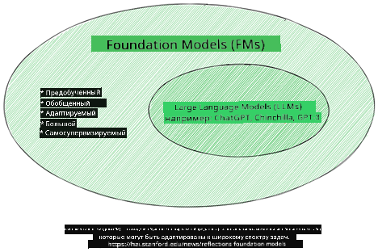
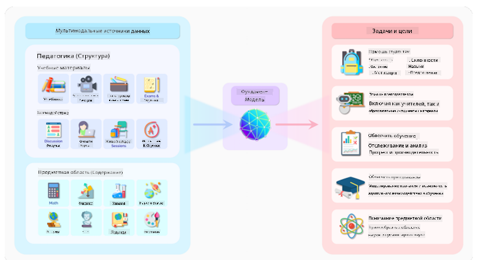
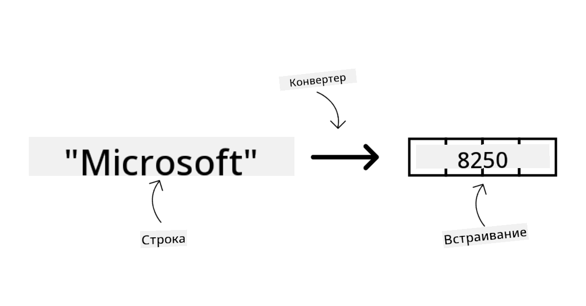
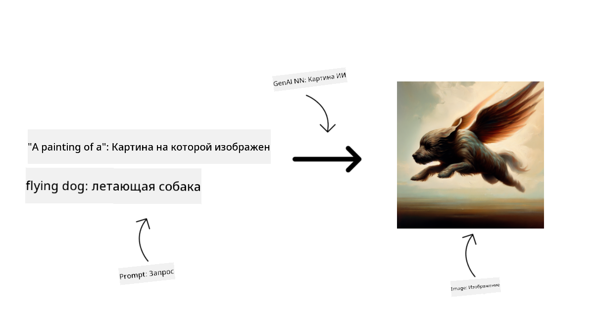
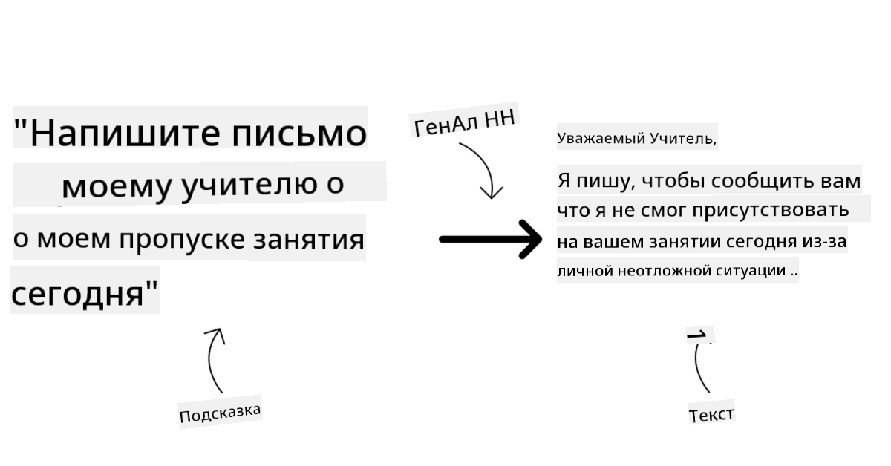
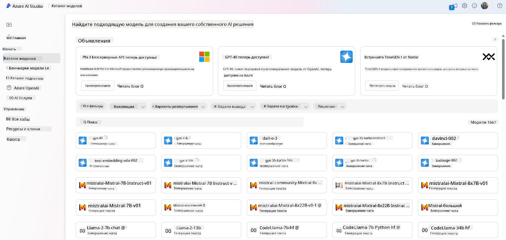
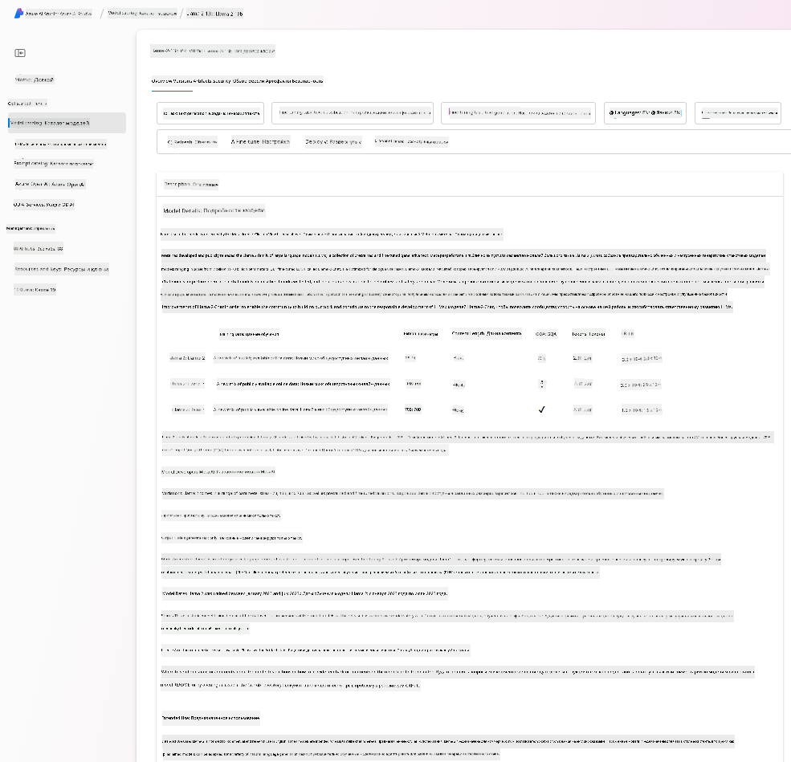
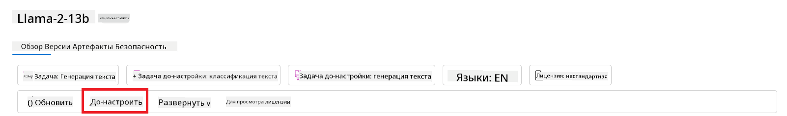
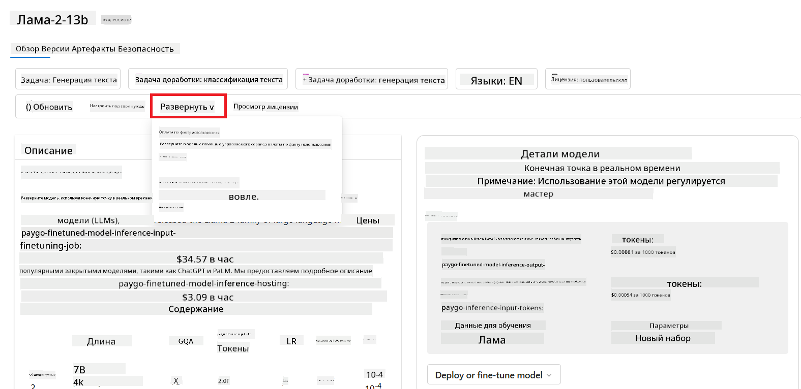
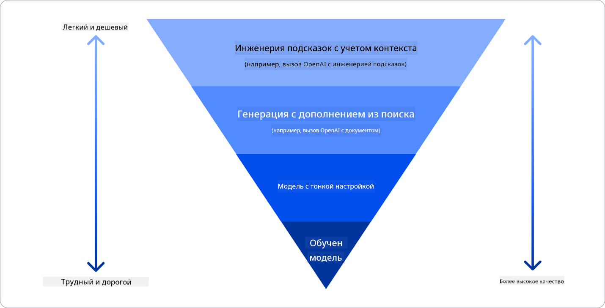

<!--
CO_OP_TRANSLATOR_METADATA:
{
  "original_hash": "6b7629b8ee4d7d874a27213e903d86a7",
  "translation_date": "2025-10-17T15:04:58+00:00",
  "source_file": "02-exploring-and-comparing-different-llms/README.md",
  "language_code": "ru"
}
-->
# Исследование и сравнение различных LLM

> _Нажмите на изображение выше, чтобы посмотреть видео этого урока_

В предыдущем уроке мы увидели, как генеративный ИИ меняет технологический ландшафт, как работают большие языковые модели (LLM) и как бизнес, например наш стартап, может применять их к своим задачам и развиваться! В этой главе мы сравним и противопоставим различные типы больших языковых моделей (LLM), чтобы понять их плюсы и минусы.

Следующий шаг в развитии нашего стартапа — изучение текущего ландшафта LLM и понимание, какие из них подходят для наших задач.

## Введение

Этот урок охватывает:

- Различные типы LLM в текущем ландшафте.
- Тестирование, итерацию и сравнение различных моделей для ваших задач в Azure.
- Как развернуть LLM.

## Цели обучения

После завершения этого урока вы сможете:

- Выбрать подходящую модель для вашей задачи.
- Понять, как тестировать, итеративно улучшать и повышать производительность модели.
- Узнать, как компании развертывают модели.

## Понимание различных типов LLM

LLM можно классифицировать по их архитектуре, обучающим данным и области применения. Понимание этих различий поможет нашему стартапу выбрать подходящую модель для конкретного сценария, а также понять, как тестировать, итеративно улучшать и повышать производительность.

Существует множество различных типов моделей LLM, выбор модели зависит от того, для чего вы планируете их использовать, ваших данных, бюджета и других факторов.

В зависимости от того, хотите ли вы использовать модели для генерации текста, аудио, видео, изображений и так далее, вы можете выбрать разные типы моделей.

- **Распознавание аудио и речи**. Для этой цели модели типа Whisper — отличный выбор, так как они универсальны и предназначены для распознавания речи. Они обучены на разнообразных аудиоданных и могут выполнять многоязычное распознавание речи. Узнайте больше о [моделях типа Whisper здесь](https://platform.openai.com/docs/models/whisper?WT.mc_id=academic-105485-koreyst).

- **Генерация изображений**. Для генерации изображений DALL-E и Midjourney — два очень известных варианта. DALL-E предоставляется Azure OpenAI. [Прочитайте больше о DALL-E здесь](https://platform.openai.com/docs/models/dall-e?WT.mc_id=academic-105485-koreyst) и также в главе 9 этой программы.

- **Генерация текста**. Большинство моделей обучены на генерации текста, и у вас есть широкий выбор от GPT-3.5 до GPT-4. Они имеют разные стоимости, причем GPT-4 является самым дорогим. Стоит изучить [площадку Azure OpenAI](https://oai.azure.com/portal/playground?WT.mc_id=academic-105485-koreyst), чтобы оценить, какие модели лучше всего подходят для ваших нужд с точки зрения возможностей и стоимости.

- **Мультимодальность**. Если вы хотите работать с несколькими типами данных на входе и выходе, вам могут подойти модели, такие как [gpt-4 turbo с визуализацией или gpt-4o](https://learn.microsoft.com/azure/ai-services/openai/concepts/models#gpt-4-and-gpt-4-turbo-models?WT.mc_id=academic-105485-koreyst) — последние версии моделей OpenAI, которые способны сочетать обработку естественного языка с визуальным пониманием, обеспечивая взаимодействие через мультимодальные интерфейсы.

Выбор модели предоставляет базовые возможности, которые, однако, могут быть недостаточными. Часто у компании есть специфические данные, которые необходимо каким-то образом передать LLM. Существует несколько подходов к решению этой задачи, о которых мы поговорим в следующих разделах.

### Основные модели против LLM

Термин "Основная модель" был [введен исследователями из Стэнфорда](https://arxiv.org/abs/2108.07258?WT.mc_id=academic-105485-koreyst) и определен как модель ИИ, которая соответствует некоторым критериям, таким как:

- **Они обучаются с использованием обучения без учителя или самоконтролируемого обучения**, то есть они обучаются на немаркированных мультимодальных данных и не требуют аннотации или маркировки данных человеком для процесса обучения.
- **Они очень крупные модели**, основанные на очень глубоких нейронных сетях, обученных на миллиардах параметров.
- **Они обычно предназначены для служения в качестве "основы" для других моделей**, то есть их можно использовать как отправную точку для создания других моделей, что может быть достигнуто путем тонкой настройки.

Источник изображения: [Essential Guide to Foundation Models and Large Language Models | by Babar M Bhatti | Medium
](https://thebabar.medium.com/essential-guide-to-foundation-models-and-large-language-models-27dab58f7404)

Чтобы еще больше прояснить это различие, возьмем ChatGPT в качестве примера. Для создания первой версии ChatGPT модель под названием GPT-3.5 служила основной моделью. Это означает, что OpenAI использовала некоторые данные, специфичные для чатов, чтобы создать настроенную версию GPT-3.5, которая была специализирована для хорошей работы в сценариях общения, таких как чат-боты.

Источник изображения: [2108.07258.pdf (arxiv.org)](https://arxiv.org/pdf/2108.07258.pdf?WT.mc_id=academic-105485-koreyst)

### Открытые модели против проприетарных моделей

Еще один способ классификации LLM — это открытые или проприетарные модели.

Открытые модели — это модели, которые доступны общественности и могут быть использованы кем угодно. Они часто предоставляются компанией, которая их создала, или исследовательским сообществом. Эти модели можно изучать, модифицировать и адаптировать для различных задач в LLM. Однако они не всегда оптимизированы для использования в производстве и могут быть менее производительными, чем проприетарные модели. Кроме того, финансирование открытых моделей может быть ограниченным, они могут не поддерживаться в долгосрочной перспективе или не обновляться с учетом последних исследований. Примеры популярных открытых моделей включают [Alpaca](https://crfm.stanford.edu/2023/03/13/alpaca.html?WT.mc_id=academic-105485-koreyst), [Bloom](https://huggingface.co/bigscience/bloom) и [LLaMA](https://llama.meta.com).

Проприетарные модели — это модели, которые принадлежат компании и не предоставляются общественности. Эти модели часто оптимизированы для использования в производстве. Однако их нельзя изучать, модифицировать или адаптировать для различных задач. Кроме того, они не всегда доступны бесплатно и могут требовать подписки или оплаты за использование. Также пользователи не имеют контроля над данными, которые используются для обучения модели, что означает, что они должны доверять владельцу модели в обеспечении конфиденциальности данных и ответственного использования ИИ. Примеры популярных проприетарных моделей включают [модели OpenAI](https://platform.openai.com/docs/models/overview?WT.mc_id=academic-105485-koreyst), [Google Bard](https://sapling.ai/llm/bard?WT.mc_id=academic-105485-koreyst) или [Claude 2](https://www.anthropic.com/index/claude-2?WT.mc_id=academic-105485-koreyst).

### Встраивание, генерация изображений, генерация текста и кода

LLM также можно классифицировать по типу выходных данных, которые они генерируют.

Встраивания — это набор моделей, которые могут преобразовывать текст в числовую форму, называемую встраиванием, что представляет собой числовое представление входного текста. Встраивания упрощают понимание машиной отношений между словами или предложениями и могут использоваться в качестве входных данных для других моделей, таких как модели классификации или кластеризации, которые лучше работают с числовыми данными. Модели встраивания часто используются для обучения переносу, когда модель создается для вспомогательной задачи, для которой имеется большое количество данных, а затем веса модели (встраивания) используются для других задач. Примером этой категории является [OpenAI embeddings](https://platform.openai.com/docs/models/embeddings?WT.mc_id=academic-105485-koreyst).

Модели генерации изображений — это модели, которые создают изображения. Эти модели часто используются для редактирования изображений, синтеза изображений и перевода изображений. Модели генерации изображений часто обучаются на больших наборах данных изображений, таких как [LAION-5B](https://laion.ai/blog/laion-5b/?WT.mc_id=academic-105485-koreyst), и могут использоваться для создания новых изображений или редактирования существующих изображений с использованием техник восстановления, повышения разрешения и окрашивания. Примеры включают [DALL-E-3](https://openai.com/dall-e-3?WT.mc_id=academic-105485-koreyst) и [Stable Diffusion models](https://github.com/Stability-AI/StableDiffusion?WT.mc_id=academic-105485-koreyst).

Модели генерации текста и кода — это модели, которые создают текст или код. Эти модели часто используются для суммирования текста, перевода и ответа на вопросы. Модели генерации текста часто обучаются на больших наборах данных текста, таких как [BookCorpus](https://www.cv-foundation.org/openaccess/content_iccv_2015/html/Zhu_Aligning_Books_and_ICCV_2015_paper.html?WT.mc_id=academic-105485-koreyst), и могут использоваться для создания нового текста или ответа на вопросы. Модели генерации кода, такие как [CodeParrot](https://huggingface.co/codeparrot?WT.mc_id=academic-105485-koreyst), часто обучаются на больших наборах данных кода, таких как GitHub, и могут использоваться для создания нового кода или исправления ошибок в существующем коде.

### Encoder-Decoder против только Decoder

Чтобы поговорить о различных типах архитектур LLM, давайте используем аналогию.

Представьте, что ваш менеджер дал вам задание написать викторину для студентов. У вас есть два коллеги: один отвечает за создание контента, а другой — за его проверку.

Создатель контента похож на модель только Decoder, он может посмотреть на тему и то, что вы уже написали, а затем написать курс на основе этого. Он очень хорошо пишет увлекательный и информативный контент, но не очень хорошо понимает тему и учебные цели. Примеры моделей только Decoder — это модели семейства GPT, такие как GPT-3.

Рецензент похож на модель только Encoder, он смотрит на написанный курс и ответы, замечая отношения между ними и понимая контекст, но он не умеет генерировать контент. Примером модели только Encoder является BERT.

Представьте, что у нас также может быть кто-то, кто мог бы создавать и проверять викторину, это модель Encoder-Decoder. Примеры включают BART и T5.

### Сервис против модели

Теперь поговорим о разнице между сервисом и моделью. Сервис — это продукт, предлагаемый облачным провайдером, который часто представляет собой комбинацию моделей, данных и других компонентов. Модель — это основной компонент сервиса, часто являющийся основной моделью, такой как LLM.

Сервисы часто оптимизированы для использования в производстве и обычно проще в использовании, благодаря графическому интерфейсу. Однако сервисы не всегда доступны бесплатно и могут требовать подписки или оплаты за использование, предоставляя возможность использовать оборудование и ресурсы владельца сервиса, оптимизировать расходы и легко масштабироваться. Примером сервиса является [Azure OpenAI Service](https://learn.microsoft.com/azure/ai-services/openai/overview?WT.mc_id=academic-105485-koreyst), который предлагает тарифный план "оплата по мере использования", то есть пользователи оплачивают пропорционально тому, сколько они используют сервис. Также Azure OpenAI Service предлагает корпоративную безопасность и рамки ответственного использования ИИ поверх возможностей моделей.

Модели — это просто нейронная сеть с параметрами, весами и другими компонентами. Они позволяют компаниям запускать их локально, однако для этого потребуется приобрести оборудование, создать инфраструктуру для масштабирования и купить лицензию или использовать открытую модель. Модель, такая как LLaMA, доступна для использования, но требует вычислительных ресурсов для запуска.

## Как тестировать и итеративно улучшать производительность различных моделей в Azure

После того как наша команда изучила текущий ландшафт LLM и определила несколько хороших кандидатов для своих сценариев, следующий шаг — тестирование их на своих данных и рабочих нагрузках. Это итеративный процесс, выполняемый через эксперименты и измерения.
Большинство моделей, упомянутых в предыдущих абзацах (модели OpenAI, модели с открытым исходным кодом, такие как Llama2, и трансформеры Hugging Face), доступны в [Каталоге моделей](https://learn.microsoft.com/azure/ai-studio/how-to/model-catalog-overview?WT.mc_id=academic-105485-koreyst) в [Azure AI Studio](https://ai.azure.com/?WT.mc_id=academic-105485-koreyst).

[Azure AI Studio](https://learn.microsoft.com/azure/ai-studio/what-is-ai-studio?WT.mc_id=academic-105485-koreyst) — это облачная платформа, предназначенная для разработчиков, чтобы создавать приложения на основе генеративного ИИ и управлять всем жизненным циклом разработки — от экспериментов до оценки — объединяя все сервисы Azure AI в одном центре с удобным графическим интерфейсом. Каталог моделей в Azure AI Studio позволяет пользователю:

- Найти интересующую базовую модель в каталоге — будь то собственная или с открытым исходным кодом, фильтруя по задаче, лицензии или названию. Для улучшения поиска модели организованы в коллекции, такие как коллекция Azure OpenAI, коллекция Hugging Face и другие.

- Ознакомиться с карточкой модели, включая подробное описание предполагаемого использования и данных обучения, примеры кода и результаты оценки из внутренней библиотеки оценок.

- Сравнить показатели моделей и наборов данных, доступных в отрасли, чтобы определить, какая из них лучше подходит для бизнес-сценария, через панель [Сравнения моделей](https://learn.microsoft.com/azure/ai-studio/how-to/model-benchmarks?WT.mc_id=academic-105485-koreyst).

- Провести дообучение модели на пользовательских данных, чтобы улучшить производительность модели для конкретной задачи, используя возможности экспериментов и отслеживания в Azure AI Studio.

- Развернуть оригинальную предварительно обученную модель или дообученную версию для удаленного реального времени — управляемого вычисления — или серверless API-эндпоинта — [оплата по мере использования](https://learn.microsoft.com/azure/ai-studio/how-to/model-catalog-overview#model-deployment-managed-compute-and-serverless-api-pay-as-you-go?WT.mc_id=academic-105485-koreyst) — чтобы приложения могли использовать её.

> [!NOTE]
> Не все модели в каталоге в настоящее время доступны для дообучения и/или развертывания с оплатой по мере использования. Проверьте карточку модели для получения информации о её возможностях и ограничениях.

## Улучшение результатов LLM

Мы исследовали с нашей стартап-командой различные типы LLM и облачную платформу (Azure Machine Learning), которая позволяет сравнивать разные модели, оценивать их на тестовых данных, улучшать производительность и развертывать их на эндпоинтах для вывода.

Но когда стоит рассмотреть дообучение модели вместо использования предварительно обученной? Есть ли другие подходы для улучшения производительности модели на конкретных задачах?

Существует несколько подходов, которые бизнес может использовать, чтобы получить нужные результаты от LLM. Вы можете выбрать разные типы моделей с различной степенью обучения при развертывании LLM в производстве, с разным уровнем сложности, стоимости и качества. Вот несколько подходов:

- **Инженерия подсказок с контекстом**. Идея заключается в предоставлении достаточного контекста при запросе, чтобы получить нужные ответы.

- **Генерация с дополнением извлечения (RAG)**. Ваши данные могут находиться в базе данных или веб-эндпоинте, например, чтобы гарантировать, что эти данные или их часть включены в момент запроса, вы можете извлечь соответствующие данные и сделать их частью запроса пользователя.

- **Дообученная модель**. Здесь модель дополнительно обучается на ваших данных, что делает её более точной и адаптированной к вашим потребностям, но это может быть дорого.

Источник изображения: [Четыре способа развертывания LLM в предприятиях | Fiddler AI Blog](https://www.fiddler.ai/blog/four-ways-that-enterprises-deploy-llms?WT.mc_id=academic-105485-koreyst)

### Инженерия подсказок с контекстом

Предварительно обученные LLM отлично справляются с задачами обработки естественного языка, даже при использовании коротких запросов, таких как предложение для завершения или вопрос — так называемое обучение "с нуля" (zero-shot).

Однако чем больше пользователь может сформулировать свой запрос, предоставив детальный запрос и примеры — контекст — тем точнее и ближе к ожиданиям пользователя будет ответ. В этом случае мы говорим об обучении "с одного примера" (one-shot), если запрос включает только один пример, и "с нескольких примеров" (few-shot), если включает несколько примеров. Инженерия подсказок с контекстом — это наиболее экономичный подход для начала работы.

### Генерация с дополнением извлечения (RAG)

LLM имеют ограничение: они могут использовать только данные, которые были использованы во время их обучения, чтобы сгенерировать ответ. Это означает, что они ничего не знают о событиях, произошедших после их обучения, и не могут получить доступ к непубличной информации (например, данным компании). 

Эту проблему можно решить с помощью RAG — техники, которая дополняет запрос внешними данными в виде фрагментов документов, учитывая ограничения длины запроса. Это поддерживается инструментами векторных баз данных (например, [Azure Vector Search](https://learn.microsoft.com/azure/search/vector-search-overview?WT.mc_id=academic-105485-koreyst)), которые извлекают полезные фрагменты из различных заранее определенных источников данных и добавляют их в контекст запроса.

Эта техника очень полезна, когда у бизнеса недостаточно данных, времени или ресурсов для дообучения LLM, но при этом он хочет улучшить производительность на конкретной задаче и снизить риски ошибок, таких как искажение реальности или вредоносный контент.

### Дообученная модель

Дообучение — это процесс, который использует перенос обучения для "адаптации" модели к задаче или для решения конкретной проблемы. В отличие от обучения с несколькими примерами и RAG, оно приводит к созданию новой модели с обновленными весами и смещениями. Для этого требуется набор обучающих примеров, состоящих из одного входного запроса (prompt) и связанного с ним результата (completion). 

Этот подход предпочтителен, если:

- **Использование дообученных моделей**. Бизнес хочет использовать менее мощные дообученные модели (например, модели для создания эмбеддингов) вместо высокопроизводительных моделей, что приводит к более экономичному и быстрому решению.

- **Учет задержки**. Задержка важна для конкретного сценария, поэтому невозможно использовать очень длинные запросы или количество примеров, которые должны быть изучены моделью, не укладывается в ограничение длины запроса.

- **Актуальность данных**. У бизнеса есть много качественных данных и меток истинных значений, а также ресурсы, необходимые для поддержания этих данных в актуальном состоянии.

### Обученная модель

Обучение LLM с нуля, без сомнения, является самым сложным и трудоемким подходом, требующим огромного объема данных, квалифицированных ресурсов и соответствующей вычислительной мощности. Этот вариант следует рассматривать только в случае, если у бизнеса есть специфический для домена сценарий использования и большой объем данных, ориентированных на домен.

## Проверка знаний

Какой подход может быть хорошим для улучшения результатов завершения LLM?

1. Инженерия подсказок с контекстом  
1. RAG  
1. Дообученная модель  

A:3, если у вас есть время, ресурсы и качественные данные, дообучение — лучший вариант для поддержания актуальности. Однако, если вы хотите улучшить результаты, но у вас мало времени, стоит сначала рассмотреть RAG.

## 🚀 Задание

Узнайте больше о том, как вы можете [использовать RAG](https://learn.microsoft.com/azure/search/retrieval-augmented-generation-overview?WT.mc_id=academic-105485-koreyst) для вашего бизнеса.

## Отличная работа, продолжайте обучение

После завершения этого урока ознакомьтесь с нашей [коллекцией обучения генеративному ИИ](https://aka.ms/genai-collection?WT.mc_id=academic-105485-koreyst), чтобы продолжить углублять свои знания о генеративном ИИ!

Перейдите к уроку 3, где мы рассмотрим, как [создавать приложения на основе генеративного ИИ ответственно](../03-using-generative-ai-responsibly/README.md?WT.mc_id=academic-105485-koreyst)!

---

**Отказ от ответственности**:  
Этот документ был переведен с использованием сервиса автоматического перевода [Co-op Translator](https://github.com/Azure/co-op-translator). Хотя мы стремимся к точности, пожалуйста, учитывайте, что автоматические переводы могут содержать ошибки или неточности. Оригинальный документ на его родном языке следует считать авторитетным источником. Для получения критически важной информации рекомендуется профессиональный перевод человеком. Мы не несем ответственности за любые недоразумения или неправильные интерпретации, возникающие в результате использования данного перевода.