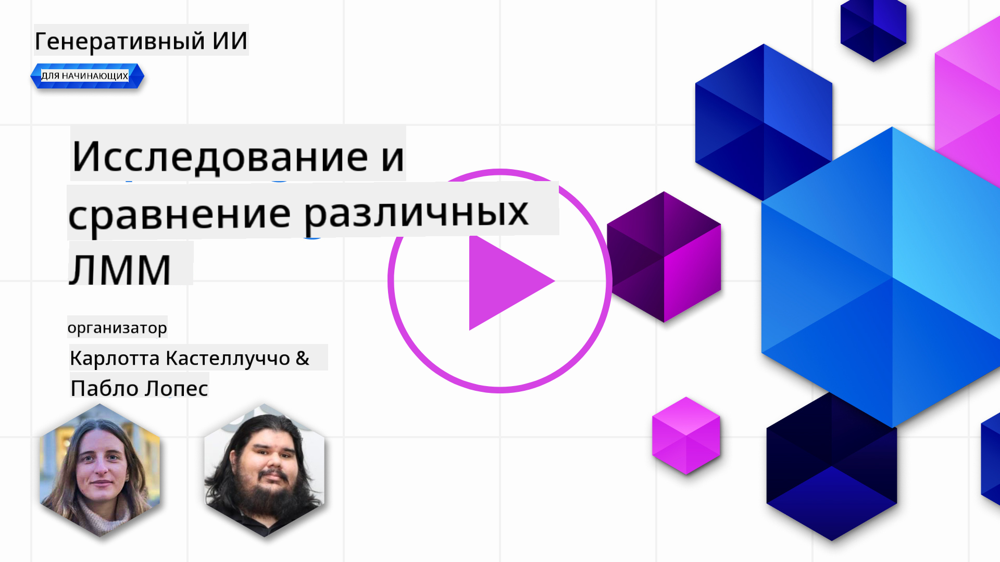
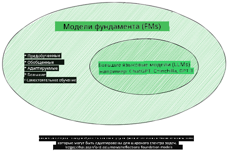
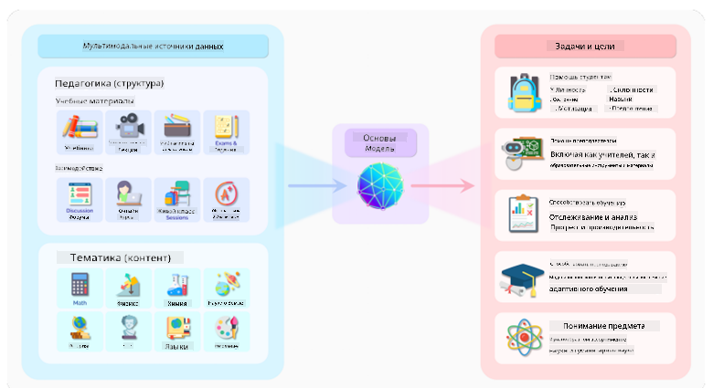
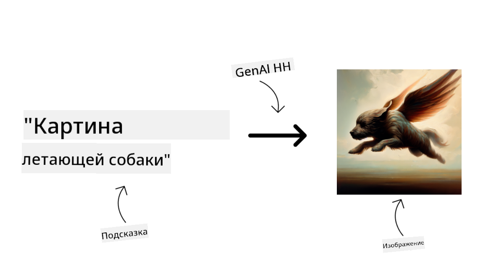
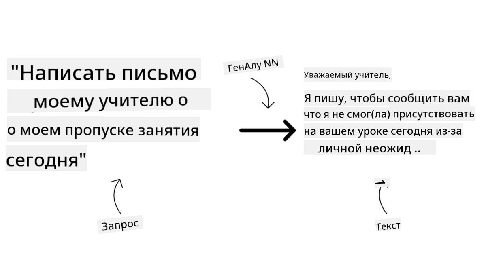
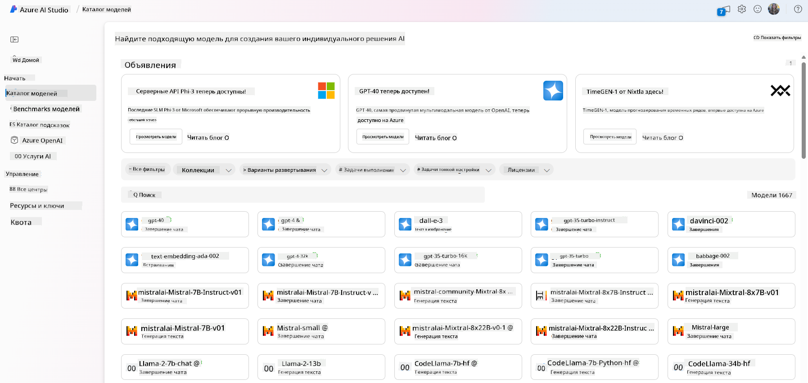
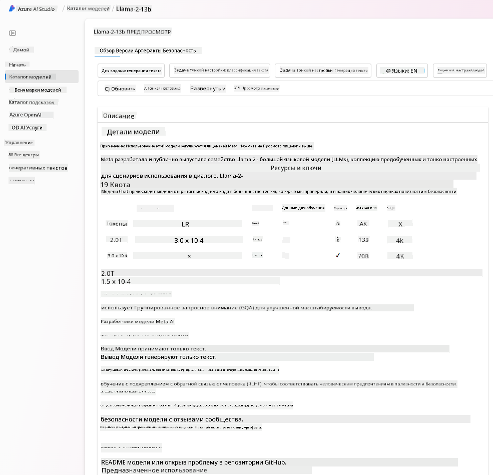
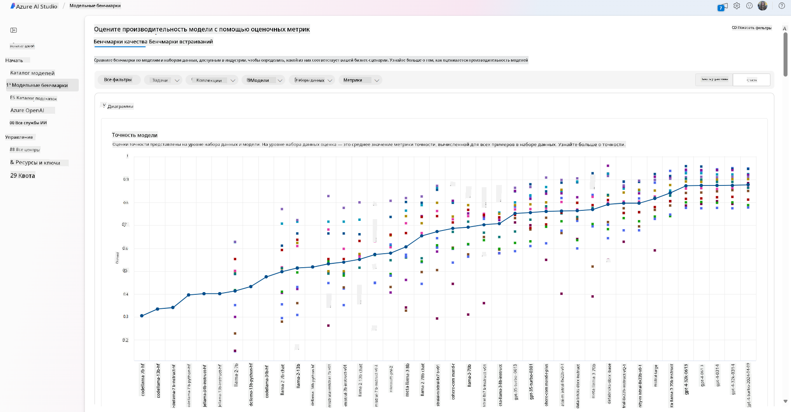
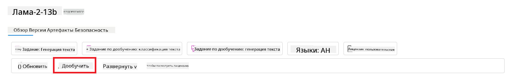
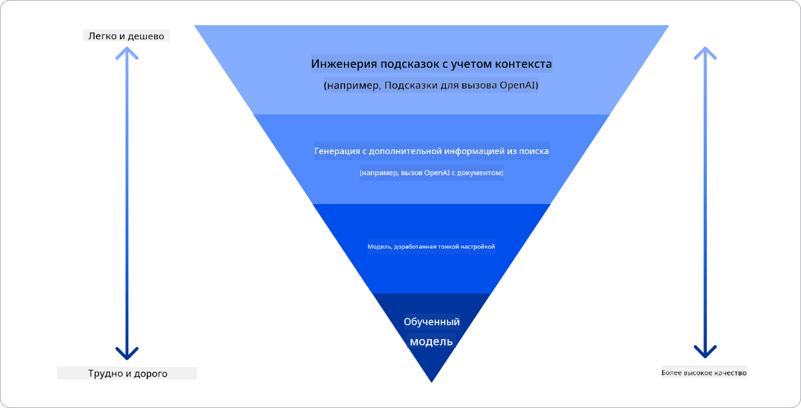

<!--
CO_OP_TRANSLATOR_METADATA:
{
  "original_hash": "e2f686f2eb794941761252ac5e8e090b",
  "translation_date": "2025-05-19T13:42:55+00:00",
  "source_file": "02-exploring-and-comparing-different-llms/README.md",
  "language_code": "ru"
}
-->
# Исследование и сравнение различных LLM

> _Нажмите на изображение выше, чтобы посмотреть видео этого урока_

В предыдущем уроке мы увидели, как генеративный ИИ меняет технологический ландшафт, как работают большие языковые модели (LLM) и как бизнес, например наш стартап, может применять их для своих нужд и расти! В этой главе мы стремимся сравнить и сопоставить различные типы больших языковых моделей (LLM), чтобы понять их преимущества и недостатки.

Следующий шаг в пути нашего стартапа — исследование текущего ландшафта LLM и понимание, какие из них подходят для нашего использования.

## Введение

Этот урок охватывает:

- Различные типы LLM в текущем ландшафте.
- Тестирование, итерация и сравнение различных моделей для вашего использования в Azure.
- Как развернуть LLM.

## Цели обучения

После завершения этого урока вы сможете:

- Выбрать правильную модель для вашего использования.
- Понять, как тестировать, итератировать и улучшать производительность вашей модели.
- Знать, как компании разворачивают модели.

## Понимание различных типов LLM

LLM могут иметь множество классификаций в зависимости от их архитектуры, данных для обучения и использования. Понимание этих различий поможет нашему стартапу выбрать правильную модель для сценария и понять, как тестировать, итератировать и улучшать производительность.

Существует много различных типов моделей LLM, ваш выбор модели зависит от того, для чего вы планируете их использовать, от ваших данных, от того, сколько вы готовы заплатить и многое другое.

В зависимости от того, планируете ли вы использовать модели для текста, аудио, видео, генерации изображений и так далее, вы можете выбрать другой тип модели.

- **Распознавание аудио и речи**. Для этой цели модели типа Whisper — отличный выбор, так как они универсальны и предназначены для распознавания речи. Они обучены на разнообразных аудио и могут выполнять многоязычное распознавание речи. Узнайте больше о [моделях типа Whisper здесь](https://platform.openai.com/docs/models/whisper?WT.mc_id=academic-105485-koreyst).

- **Генерация изображений**. Для генерации изображений DALL-E и Midjourney — два очень известных выбора. DALL-E предлагается Azure OpenAI. [Читать больше о DALL-E здесь](https://platform.openai.com/docs/models/dall-e?WT.mc_id=academic-105485-koreyst) и также в Главе 9 этой программы.

- **Генерация текста**. Большинство моделей обучены на генерации текста, и у вас есть большой выбор от GPT-3.5 до GPT-4. Они имеют разные стоимости, причем GPT-4 является самым дорогим. Стоит рассмотреть [площадку Azure OpenAI](https://oai.azure.com/portal/playground?WT.mc_id=academic-105485-koreyst), чтобы оценить, какие модели лучше всего соответствуют вашим потребностям в плане возможностей и стоимости.

- **Мультимодальность**. Если вы хотите обрабатывать несколько типов данных на входе и выходе, вы можете рассмотреть модели, такие как [gpt-4 turbo с видением или gpt-4o](https://learn.microsoft.com/azure/ai-services/openai/concepts/models#gpt-4-and-gpt-4-turbo-models?WT.mc_id=academic-105485-koreyst) — последние выпуски моделей OpenAI, которые способны сочетать обработку естественного языка с визуальным пониманием, позволяя взаимодействовать через мультимодальные интерфейсы.

Выбор модели означает, что вы получаете некоторые базовые возможности, которые, однако, могут быть недостаточными. Часто у вас есть специфические для компании данные, о которых вам нужно каким-то образом сообщить LLM. Существует несколько различных вариантов подхода к этому, о чем мы расскажем в следующих разделах.

### Основные модели против LLM

Термин Основная модель был [введен исследователями из Стэнфорда](https://arxiv.org/abs/2108.07258?WT.mc_id=academic-105485-koreyst) и определен как модель ИИ, которая соответствует некоторым критериям, таким как:

- **Они обучаются с использованием неконтролируемого обучения или самоконтролируемого обучения**, что означает, что они обучаются на немаркированных мультимодальных данных и не требуют аннотации или маркировки данных человеком для своего процесса обучения.
- **Они очень большие модели**, основанные на очень глубоких нейронных сетях, обученных на миллиардах параметров.
- **Они обычно предназначены служить в качестве ‘основы’ для других моделей**, что означает, что они могут использоваться в качестве отправной точки для создания других моделей, что может быть достигнуто путем дообучения.

Источник изображения: [Essential Guide to Foundation Models and Large Language Models | by Babar M Bhatti | Medium](https://thebabar.medium.com/essential-guide-to-foundation-models-and-large-language-models-27dab58f7404)

Чтобы еще больше прояснить это различие, давайте возьмем ChatGPT в качестве примера. Чтобы создать первую версию ChatGPT, модель под названием GPT-3.5 служила основной моделью. Это означает, что OpenAI использовала некоторые специфические для чата данные, чтобы создать настроенную версию GPT-3.5, которая была специализирована на хорошей работе в сценариях общения, таких как чат-боты.

Источник изображения: [2108.07258.pdf (arxiv.org)](https://arxiv.org/pdf/2108.07258.pdf?WT.mc_id=academic-105485-koreyst)

### Открытые модели против собственных моделей

Еще один способ классификации LLM — это являются ли они открытыми или собственными.

Открытые модели — это модели, которые доступны для широкой публики и могут использоваться кем угодно. Они часто предоставляются компанией, которая их создала, или исследовательским сообществом. Эти модели можно инспектировать, модифицировать и настраивать для различных случаев использования в LLM. Однако они не всегда оптимизированы для использования в производстве и могут быть менее производительными, чем собственные модели. Кроме того, финансирование для открытых моделей может быть ограничено, и они могут не поддерживаться в долгосрочной перспективе или не обновляться с учетом последних исследований. Примеры популярных открытых моделей включают [Alpaca](https://crfm.stanford.edu/2023/03/13/alpaca.html?WT.mc_id=academic-105485-koreyst), [Bloom](https://huggingface.co/bigscience/bloom) и [LLaMA](https://llama.meta.com).

Собственные модели — это модели, которые принадлежат компании и не доступны для широкой публики. Эти модели часто оптимизированы для использования в производстве. Однако их нельзя инспектировать, модифицировать или настраивать для различных случаев использования. Кроме того, они не всегда доступны бесплатно и могут требовать подписки или оплаты для использования. Также пользователи не имеют контроля над данными, которые используются для обучения модели, что означает, что они должны доверять владельцу модели в обеспечении соблюдения конфиденциальности данных и ответственного использования ИИ. Примеры популярных собственных моделей включают [модели OpenAI](https://platform.openai.com/docs/models/overview?WT.mc_id=academic-105485-koreyst), [Google Bard](https://sapling.ai/llm/bard?WT.mc_id=academic-105485-koreyst) или [Claude 2](https://www.anthropic.com/index/claude-2?WT.mc_id=academic-105485-koreyst).

### Встраивание против генерации изображений против генерации текста и кода

LLM также можно классифицировать по выходным данным, которые они генерируют.

Встраивания — это набор моделей, которые могут преобразовывать текст в числовую форму, называемую встраиванием, которая является числовым представлением входного текста. Встраивания упрощают машинам понимание отношений между словами или предложениями и могут использоваться в качестве входных данных для других моделей, таких как модели классификации или модели кластеризации, которые имеют лучшую производительность на числовых данных. Модели встраивания часто используются для обучения переносу, когда модель создается для суррогатной задачи, для которой имеется большое количество данных, а затем веса модели (встраивания) повторно используются для других задач. Примером этой категории является [встраивания OpenAI](https://platform.openai.com/docs/models/embeddings?WT.mc_id=academic-105485-koreyst).

Модели генерации изображений — это модели, которые генерируют изображения. Эти модели часто используются для редактирования изображений, синтеза изображений и перевода изображений. Модели генерации изображений часто обучаются на больших наборах данных изображений, таких как [LAION-5B](https://laion.ai/blog/laion-5b/?WT.mc_id=academic-105485-koreyst), и могут использоваться для генерации новых изображений или редактирования существующих изображений с помощью техник заплатки, суперразрешения и колоризации. Примеры включают [DALL-E-3](https://openai.com/dall-e-3?WT.mc_id=academic-105485-koreyst) и [Stable Diffusion models](https://github.com/Stability-AI/StableDiffusion?WT.mc_id=academic-105485-koreyst).

Модели генерации текста и кода — это модели, которые генерируют текст или код. Эти модели часто используются для суммирования текста, перевода и ответа на вопросы. Модели генерации текста часто обучаются на больших наборах данных текста, таких как [BookCorpus](https://www.cv-foundation.org/openaccess/content_iccv_2015/html/Zhu_Aligning_Books_and_ICCV_2015_paper.html?WT.mc_id=academic-105485-koreyst), и могут использоваться для генерации нового текста или для ответа на вопросы. Модели генерации кода, такие как [CodeParrot](https://huggingface.co/codeparrot?WT.mc_id=academic-105485-koreyst), часто обучаются на больших наборах данных кода, таких как GitHub, и могут использоваться для генерации нового кода или исправления ошибок в существующем коде.

### Энкодер-декодер против только декодер

Чтобы поговорить о различных типах архитектур LLM, давайте используем аналогию.

Представьте, что ваш менеджер дал вам задание написать викторину для студентов. У вас есть два коллеги; один отвечает за создание контента, а другой — за их проверку.

Создатель контента похож на модель только декодера, он может посмотреть на тему и увидеть, что вы уже написали, а затем он может написать курс на основе этого. Он очень хорош в написании увлекательного и информативного контента, но не очень хорош в понимании темы и целей обучения. Некоторые примеры моделей декодера — это модели семейства GPT, такие как GPT-3.

Проверяющий похож на модель только энкодера, он смотрит на написанный курс и ответы, замечает взаимосвязь между ними и понимает контекст, но не хорош в создании контента. Примером модели только энкодера может быть BERT.

Представьте, что у нас также может быть кто-то, кто мог бы создавать и проверять викторину, это модель энкодер-декодер. Примеры таких моделей — BART и T5.

### Сервис против модели

Теперь давайте поговорим о разнице между сервисом и моделью. Сервис — это продукт, предлагаемый поставщиком облачных услуг, и часто это комбинация моделей, данных и других компонентов. Модель — это основной компонент сервиса и часто является основной моделью, такой как LLM.

Сервисы часто оптимизированы для использования в производстве и часто проще в использовании, чем модели, через графический интерфейс пользователя. Однако услуги не всегда доступны бесплатно и могут требовать подписки или оплаты за использование, в обмен на использование оборудования и ресурсов владельца сервиса, оптимизацию расходов и легкое масштабирование. Примером сервиса является [Azure OpenAI Service](https://learn.microsoft.com/azure/ai-services/openai/overview?WT.mc_id=academic-105485-koreyst), который предлагает план оплаты по мере использования, что означает, что пользователи платят пропорционально тому, сколько они используют услугу. Также Azure OpenAI Service предлагает корпоративную безопасность и рамки ответственного использования ИИ поверх возможностей моделей.

Модели — это просто нейронная сеть, с параметрами, весами и другими элементами. Позволяя компаниям работать локально, однако, необходимо купить оборудование, построить структуру для масштабирования и купить лицензию или использовать открытую модель. Модель, такая как LLaMA, доступна для использования, требуя вычислительной мощности для запуска модели.

## Как тестировать и итератировать с различными моделями, чтобы понять производительность в Azure

После того как наша команда изучила текущий ландшафт LLM и определила несколько хороших кандидатов для своих сценариев, следующий шаг — тестирование их на своих данных и на своей нагрузке. Это итеративный процесс, выполняемый с помощью экспериментов и измерений. Большинство моделей, которые мы упомянули в предыдущих абзацах (модели OpenAI, открытые модели, такие как Llama2, и трансформеры Hugging Face), доступны в [каталоге моделей](https://learn.microsoft.com/azure/ai-studio/how-to/model-catalog-overview?WT.mc_id=academic-105485-koreyst) в [Azure AI Studio](https://ai.azure.com/?WT.mc_id=academic-105485-koreyst).

[Azure AI Studio](https://learn.microsoft.com/azure/ai-studio/what-is-ai-studio?WT.mc_id=academic-105485-koreyst) — это облачная платформа, предназначенная для разработчиков, чтобы создавать приложения генеративного ИИ и управлять всем циклом разработки — от экспериментов до оценки — объединяя все услуги Azure AI в единый центр с удобным графическим интерфейсом. Каталог моделей в Azure AI Studio позволяет пользователю:

- Найти основную модель, представляющую интерес в каталоге — либо собственную, либо открытую, фильтруя по задаче, лицензии или имени. Для улучшения поиска модели организованы в коллекции, такие как коллекция Azure OpenAI, коллекция Hugging Face и другие.

- Ознакомиться с карточкой модели, включая подробное описание предполагаемого использования и данных для обучения, примеры кода и результаты оценки на внутренней библиотеке оценок.

- Сравните эталонные показатели моделей и наборов данных, доступных в отрасли, чтобы оценить, какая из них соответствует бизнес-сценарию, через панель [Model Benchmarks](https://learn.microsoft.com/azure/ai-studio/how-to/model-benchmarks?WT.mc_id=academic-105485-koreyst).

- Настройте модель на основе пользовательских данных для улучшения производительности модели в конкретной задаче, используя возможности экспериментов и отслеживания Azure AI Studio.

- Разверните оригинальную предварительно обученную модель или ее настроенную версию для удаленного реального времени инференса - управляемые вычисления - или серверless API endpoint - [pay-as-you-go](https://learn.microsoft.com/azure/ai-studio/how-to/model-catalog-overview#model-deployment-managed-compute-and-serverless-api-pay-as-you-go?WT.mc_id=academic-105485-koreyst) - чтобы приложения могли использовать ее.

> [!NOTE]
> Не все модели в каталоге в настоящее время доступны для настройки и/или развертывания pay-as-you-go. Проверьте карточку модели для получения подробной информации о возможностях и ограничениях модели.

## Улучшение результатов LLM

Мы исследовали с нашей стартап-командой различные типы LLM и облачную платформу (Azure Machine Learning), которая позволяет нам сравнивать разные модели, оценивать их на тестовых данных, улучшать производительность и развертывать их на точках инференса.

Но когда им стоит рассматривать настройку модели вместо использования предварительно обученной? Есть ли другие подходы для улучшения производительности модели в конкретных задачах?

Существует несколько подходов, которые бизнес может использовать для получения нужных результатов от LLM. Вы можете выбрать разные типы моделей с различной степенью обучения при развертывании LLM в производстве, с различным уровнем сложности, стоимости и качества. Вот некоторые из подходов:

- **Инженерия запросов с контекстом**. Идея заключается в предоставлении достаточного контекста при запросе, чтобы гарантировать получение нужных ответов.

- **Расширенная генерация извлечения, RAG**. Ваши данные могут существовать в базе данных или веб-эндпоинте, например, чтобы гарантировать включение этих данных или их подмножества в момент запроса, вы можете извлечь релевантные данные и сделать их частью запроса пользователя.

- **Настроенная модель**. Здесь вы дополнительно обучили модель на своих данных, что привело к более точному и отзывчивому поведению модели, но это может быть дорого.

Источник изображения: [Четыре способа развертывания LLM предприятиями | Fiddler AI Blog](https://www.fiddler.ai/blog/four-ways-that-enterprises-deploy-llms?WT.mc_id=academic-105485-koreyst)

### Инженерия запросов с контекстом

Предварительно обученные LLM очень хорошо работают на обобщенных задачах естественного языка, даже при вызове их с коротким запросом, например, с предложением для завершения или вопросом – так называемое обучение «с нуля».

Однако, чем больше пользователь может сформулировать свой запрос, с детальным запросом и примерами – Контекстом – тем более точным и соответствующим ожиданиям пользователя будет ответ. В этом случае мы говорим о обучении «с одного примера», если запрос включает только один пример, и «обучении с несколькими примерами», если он включает несколько примеров.
Инженерия запросов с контекстом является наиболее экономически эффективным подходом для начала работы.

### Расширенная генерация извлечения (RAG)

LLM имеют ограничение, что они могут использовать только те данные, которые были использованы во время их обучения для генерации ответа. Это означает, что они не знают ничего о фактах, произошедших после их обучения, и не могут получить доступ к непубличной информации (например, к данным компании).
Это можно преодолеть с помощью RAG, техники, которая увеличивает запрос внешними данными в виде фрагментов документов, учитывая ограничения длины запроса. Это поддерживается инструментами векторной базы данных (например, [Azure Vector Search](https://learn.microsoft.com/azure/search/vector-search-overview?WT.mc_id=academic-105485-koreyst)), которые извлекают полезные фрагменты из различных заранее определенных источников данных и добавляют их в контекст запроса.

Эта техника очень полезна, когда у бизнеса недостаточно данных, времени или ресурсов для настройки LLM, но все же хочется улучшить производительность в конкретной задаче и снизить риски фабрикации, то есть мистификации реальности или вредоносного контента.

### Настроенная модель

Тонкая настройка — это процесс, который использует перенос обучения для «адаптации» модели к последующей задаче или для решения конкретной проблемы. В отличие от обучения с несколькими примерами и RAG, это приводит к созданию новой модели с обновленными весами и смещениями. Это требует набора обучающих примеров, состоящих из одного входа (запроса) и связанного с ним выхода (завершения).
Этот подход будет предпочтительным, если:

- **Использование настроенных моделей**. Бизнес хочет использовать настроенные менее мощные модели (например, модели встраивания) вместо высокопроизводительных моделей, что приводит к более экономически эффективному и быстрому решению.

- **Учет задержки**. Задержка важна для конкретного использования, поэтому невозможно использовать очень длинные запросы или количество примеров, которые должны быть изучены моделью, не соответствует ограничению длины запроса.

- **Оставаться в курсе**. У бизнеса много качественных данных и истинных меток, а также ресурсы, необходимые для поддержания этих данных в актуальном состоянии с течением времени.

### Обученная модель

Обучение LLM с нуля, без сомнения, является самым сложным и самым комплексным подходом, требующим огромного количества данных, квалифицированных ресурсов и соответствующей вычислительной мощности. Этот вариант следует рассматривать только в сценарии, когда у бизнеса есть специфический для области случай использования и большое количество данных, ориентированных на область.

## Проверка знаний

Какой подход может быть хорошим для улучшения результатов завершения LLM?

1. Инженерия запросов с контекстом
2. RAG
3. Настроенная модель

A:3, если у вас есть время, ресурсы и качественные данные, настройка будет лучшим вариантом, чтобы оставаться в курсе. Однако, если вы хотите улучшить результаты и у вас недостаточно времени, стоит сначала рассмотреть RAG.

## 🚀 Вызов

Узнайте больше о том, как вы можете [использовать RAG](https://learn.microsoft.com/azure/search/retrieval-augmented-generation-overview?WT.mc_id=academic-105485-koreyst) для вашего бизнеса.

## Отличная работа, продолжайте обучение

После завершения этого урока ознакомьтесь с нашей [коллекцией обучения генеративному ИИ](https://aka.ms/genai-collection?WT.mc_id=academic-105485-koreyst), чтобы продолжить повышать уровень ваших знаний о генеративном ИИ!

Перейдите к уроку 3, где мы рассмотрим, как [строить с генеративным ИИ ответственно](../03-using-generative-ai-responsibly/README.md?WT.mc_id=academic-105485-koreyst)!

**Отказ от ответственности**:  
Этот документ был переведен с помощью сервиса автоматического перевода [Co-op Translator](https://github.com/Azure/co-op-translator). Хотя мы стремимся к точности, пожалуйста, имейте в виду, что автоматизированные переводы могут содержать ошибки или неточности. Оригинальный документ на родном языке следует считать авторитетным источником. Для получения важной информации рекомендуется профессиональный перевод человеком. Мы не несем ответственности за любые недопонимания или неправильные интерпретации, возникающие в результате использования этого перевода.