# Изучение и сравнение различных LLM

> _Нажмите на изображение выше, чтобы посмотреть видео этого урока_

В предыдущем уроке мы увидели, как генеративный ИИ меняет технологический ландшафт, как работают большие языковые модели (LLM) и как бизнес — например, наш стартап — может применять их для своих задач и расти! В этой главе мы рассмотрим сравнение различных типов больших языковых моделей (LLM), чтобы понять их сильные и слабые стороны.

Следующий шаг в путешествии нашего стартапа — изучить текущий ландшафт LLM и понять, какие из них подходят для нашего сценария.

## Введение

В этом уроке вы узнаете:

- Различные типы LLM в текущем ландшафте.
- Как тестировать, итеративно улучшать и сравнивать различные модели для вашего сценария в Azure.
- Как развернуть LLM.

## Цели обучения

После завершения этого урока вы сможете:

- Выбрать подходящую модель для вашего сценария.
- Понять, как тестировать, улучшать и повышать производительность вашей модели.
- Знать, как компании развертывают модели.

## Понимание различных типов LLM

LLM могут иметь разные классификации в зависимости от их архитектуры, данных обучения и области применения. Понимание этих различий поможет нашему стартапу выбрать подходящую модель для конкретного случая, а также понять, как тестировать, итеративно улучшать и повышать производительность.

Существует множество типов LLM, выбор модели зависит от того, для каких целей вы планируете её использовать, каких данных у вас есть, сколько вы готовы платить и других факторов.

В зависимости от того, предполагается ли использовать модели для текста, аудио, видео, генерации изображений и так далее, можно выбрать разные типы моделей.

- **Распознавание аудио и речи.** Модели типа Whisper по-прежнему полезны как универсальные модели распознавания речи, но для промышленного использования теперь доступны и более новые модели преобразования речи в текст, такие как `gpt-4o-transcribe`, `gpt-4o-mini-transcribe` и варианты с диаризацией. Оцените языковое покрытие, диаризацию, поддержку в реальном времени, задержку и стоимость для вашего сценария. Подробнее читайте в [документации OpenAI о преобразовании речи в текст](https://platform.openai.com/docs/guides/speech-to-text?WT.mc_id=academic-105485-koreyst).

- **Генерация изображений.** DALL-E и Midjourney — известные опции для генерации изображений, но текущие API OpenAI сосредоточены на моделях GPT Image, таких как `gpt-image-2`, а также распространены семейства моделей Stable Diffusion, Imagen, Flux и другие. Сравните соответствие промптам, поддержку редактирования, контроль стиля, требования безопасности и лицензирование. Подробнее в [гайде по генерации изображений OpenAI](https://platform.openai.com/docs/guides/images?WT.mc_id=academic-105485-koreyst) и в главе 9 этого курса.

- **Генерация текста.** Текстовые модели теперь включают передовые модели, модели рассуждений, меньшие задержанные модели и модели с открытыми весами. Текущие примеры включают OpenAI GPT-5.x, Anthropic Claude 4.x, Google Gemini 3.x, Meta Llama 4 и модели Mistral. Не выбирайте только по дате выпуска или цене; сравните качество задач, задержку, окно контекста, использование инструментов, поведение с точки зрения безопасности, региональную доступность и общую стоимость. [Каталог моделей Microsoft Foundry](https://ai.azure.com/catalog?WT.mc_id=academic-105485-koreyst) — хорошее место для сравнения моделей, доступных в Azure.

- **Мультимодальность.** Многие современные модели способны обрабатывать не только текст. Некоторые принимают изображения, аудио или видео на вход; некоторые могут вызывать инструменты; специализированные модели могут генерировать изображения, аудио или видео. Например, современные модели OpenAI поддерживают текст и изображения, Gemini — текст, код, изображения, аудио и видео в зависимости от варианта, а Llama 4 Scout и Maverick — модели с открытыми весами и нативной мультимодальностью. Перед построением рабочего процесса всегда проверяйте карточку модели на поддерживаемые типы входных и выходных данных.

Выбор модели означает получение базовых возможностей, но этого может быть недостаточно. Часто есть фирменные данные компании, которые нужно как-то передать LLM. Существуют несколько вариантов решения этой задачи, о которых расскажем в следующих разделах.

### Фундаментальные модели против LLM

Термин «Foundation Model» был [введён исследователями Стэнфорда](https://arxiv.org/abs/2108.07258?WT.mc_id=academic-105485-koreyst) и определяется как модель ИИ, которая соответствует следующим критериям:

- **Обучаются с использованием не контролируемого или самоконтролируемого обучения**, то есть обучаются на немаркированных мульти-модальных данных и не требуют аннотаций или разметки людьми для процесса обучения.
- **Очень большие модели**, основанные на очень глубоких нейросетях с миллиардами параметров.
- **Обычно предназначены служить «фундаментом» для других моделей**, что означает, что их можно использовать в качестве отправной точки для создания других моделей путём дообучения.

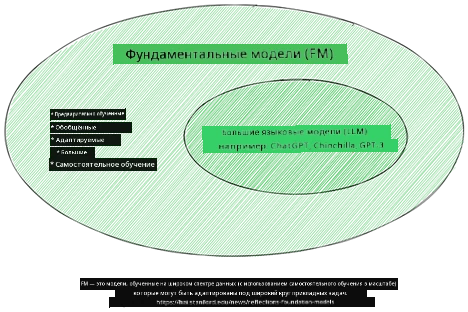

Источник изображения: [Essential Guide to Foundation Models and Large Language Models | by Babar M Bhatti | Medium
](https://thebabar.medium.com/essential-guide-to-foundation-models-and-large-language-models-27dab58f7404)

Чтобы яснее понять это различие, возьмём в качестве примера ChatGPT. Ранние версии ChatGPT использовали GPT-3.5 как фундаментальную модель. Затем OpenAI применяла данные, специфичные для чатов, и техники выравнивания для создания настроенной версии, которая лучше работает в диалоговых сценариях, таких как чат-боты. Современные AI-сервисы часто переключаются между несколькими вариантами моделей, поэтому название сервиса и базовой модели не всегда совпадают.

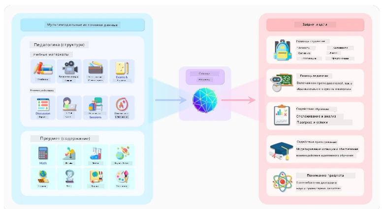

Источник изображения: [2108.07258.pdf (arxiv.org)](https://arxiv.org/pdf/2108.07258.pdf?WT.mc_id=academic-105485-koreyst)

### Модели с открытыми весами/открытым исходным кодом против проприетарных моделей

Другой способ классификации LLM — являются ли они моделями с открытыми весами, открытым исходным кодом или собственническими.

Модели с открытым исходным кодом и открытыми весами делают артефакты модели доступными для просмотра, скачивания или настройки, но лицензии у них разные. Некоторые полностью открыты, другие — это модели с открытыми весами с ограничениями по использованию. Они полезны, когда бизнесу нужен больший контроль над развертыванием, локализацией данных, стоимостью или кастомизацией. Однако командам всё равно нужно изучить условия лицензии, стоимость обслуживания, поддержку безопасности, и качество оценки перед использованием в производстве. Примеры включают [Meta Llama 4](https://ai.meta.com/blog/llama-4-multimodal-intelligence/?WT.mc_id=academic-105485-koreyst), некоторые [модели Mistral](https://docs.mistral.ai/models/overview?WT.mc_id=academic-105485-koreyst) и многие модели, размещённые на [Hugging Face](https://huggingface.co/models?WT.mc_id=academic-105485-koreyst).

Проприетарные модели принадлежат провайдеру и размещаются им. Эти модели обычно оптимизированы для управляемого производительного использования и могут предлагать сильную поддержку, системы безопасности, интеграцию инструментов и масштабирование. Однако клиентам обычно не разрешается просматривать или изменять веса модели, а также им необходимо изучить условия провайдера по конфиденциальности, хранению данных, соответствию и допустимому использованию. Примеры: [модели OpenAI](https://platform.openai.com/docs/models?WT.mc_id=academic-105485-koreyst), [Google Gemini](https://deepmind.google/models/gemini/pro/?WT.mc_id=academic-105485-koreyst) и [Anthropic Claude](https://platform.claude.com/docs/en/about-claude/models/overview?WT.mc_id=academic-105485-koreyst).

### Встраивание, генерация изображений и генерация текста и кода

LLM также классифицируют по типу генерируемого вывода.

Встраивания — это набор моделей, которые могут преобразовывать текст в числовую форму, называемую встраиванием. Встраивание — это числовое представление входного текста. Они упрощают понимание машинам отношений между словами или предложениями и могут использоваться как входные данные для других моделей, например, моделей классификации или кластеризации, которые лучше работают с числовыми данными. Модели встраивания часто применяются для трансферного обучения, когда модель тренируют для вспомогательной задачи с большим объёмом данных, а затем повторно используют веса (встраивания) для других задач. Пример — [встраивания OpenAI](https://platform.openai.com/docs/models/embeddings?WT.mc_id=academic-105485-koreyst).

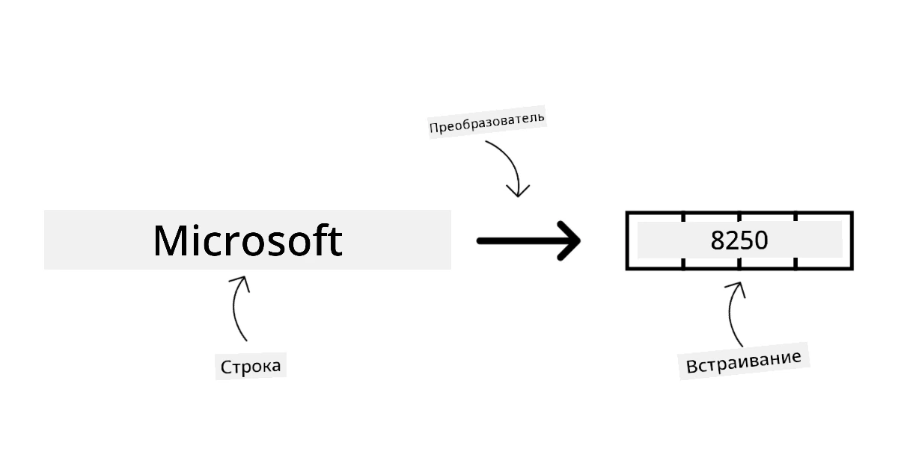

Модели генерации изображений создают изображения. Такие модели часто применяются для редактирования, синтеза и преобразования изображений. Они обучаются на больших наборах изображений, например, [LAION-5B](https://laion.ai/blog/laion-5b/?WT.mc_id=academic-105485-koreyst), и могут создавать новые изображения или редактировать существующие с помощью методов инпейнтинга, сверхразрешения и колоризации. Примеры: [GPT Image models](https://platform.openai.com/docs/guides/images?WT.mc_id=academic-105485-koreyst), [Stable Diffusion models](https://github.com/Stability-AI/StableDiffusion?WT.mc_id=academic-105485-koreyst) и модели Imagen.

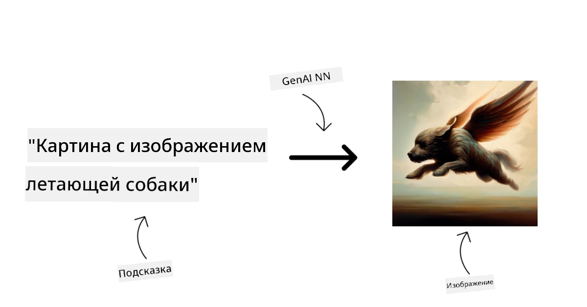

Модели генерации текста и кода создают текст или код. Такие модели применяются для суммирования текста, перевода и ответов на вопросы. Модели генерации текста обычно обучаются на больших наборах текстов, например, [BookCorpus](https://www.cv-foundation.org/openaccess/content_iccv_2015/html/Zhu_Aligning_Books_and_ICCV_2015_paper.html?WT.mc_id=academic-105485-koreyst), и могут создавать новый текст или отвечать на вопросы. Модели генерации кода, например, [CodeParrot](https://huggingface.co/codeparrot?WT.mc_id=academic-105485-koreyst), обучаются на больших наборов кода, например, с GitHub, и могут создавать новый код или исправлять ошибки в существующем коде.

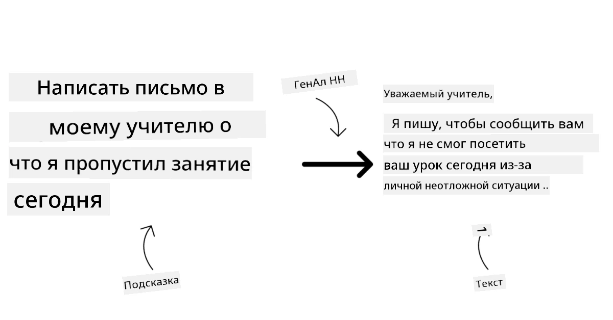

### Encoder-Decoder против Decoder-only

Чтобы объяснить разные архитектуры LLM, воспользуемся аналогией.

Представьте, что ваш менеджер дал вам задание написать викторину для студентов. У вас есть два коллеги: один отвечает за создание контента, другой — за его проверку.

Создатель контента похож на модель только с декодером: он смотрит на тему, видит, что вы уже написали, и продолжает генерировать контент, основываясь на этом контексте. Такие модели очень хороши в написании увлекательного и информативного контента, но не всегда подходят, если задача состоит только в классификации, извлечении или кодировании информации. Примеры моделей только с декодером: GPT и Llama.

Проверяющий похож на модель только с энкодером: он смотрит на написанный курс и ответы, замечает их взаимосвязь и понимает контекст, но плохо генерирует контент. Пример модели только с энкодером — BERT.

Представьте, что есть кто-то, кто может одновременно создавать и проверять викторину — это модель Encoder-Decoder. Примеры: BART и T5.

### Сервис против модели

Теперь поговорим о разнице между сервисом и моделью. Сервис — это продукт, предлагаемый облачным провайдером, и часто состоит из комбинации моделей, данных и других компонентов. Модель — это основная часть сервиса, часто фундаментальная модель, такая как LLM.

Сервисы обычно оптимизированы для производственного использования и часто проще в применении, например, через графический интерфейс. Однако сервисы не всегда бесплатны и могут требовать подписки или оплаты, что оправдано использованием оборудования и ресурсов владельца сервиса, оптимизацией расходов и масштабируемостью. Пример сервиса — [Azure OpenAI Service](https://learn.microsoft.com/azure/ai-services/openai/overview?WT.mc_id=academic-105485-koreyst), который предлагает оплату по мере использования. Azure OpenAI Service также обеспечивает корпоративную безопасность и ответственный ИИ поверх возможностей моделей.

Модели — это артефакты нейронной сети: параметры, веса, архитектура, токенизатор и конфигурация. Запуск модели локально или в приватной среде требует подходящего оборудования, инфраструктуры обслуживания, мониторинга, а также подходящей лицензии: открытой или коммерческой. Модели с открытыми весами, такие как Llama 4 или Mistral, можно развертывать самостоятельно, но для этого всё равно нужны вычислительные ресурсы и операционная экспертиза.

## Как тестировать и итеративно улучшать разные модели для понимания производительности в Azure

Как только наша команда изучила текущий ландшафт LLM и определила несколько подходящих кандидатов для своих сценариев, следующим шагом становится тестирование их на своих данных и в своей нагрузке. Это итеративный процесс, который проводится посредством экспериментов и измерений.
Большинство моделей, упомянутых в предыдущих параграфах (модели OpenAI, модели с открытыми весами, такие как Llama 4 и Mistral, и модели Hugging Face), доступны в [Microsoft Foundry Models](https://learn.microsoft.com/azure/foundry/concepts/foundry-models-overview?WT.mc_id=academic-105485-koreyst).

[Microsoft Foundry](https://learn.microsoft.com/azure/foundry/what-is-foundry?WT.mc_id=academic-105485-koreyst), ранее известная как Azure AI Studio / Azure AI Foundry, — это унифицированная платформа Azure для создания AI-приложений и агентов. Она помогает разработчикам управлять жизненным циклом от экспериментов и оценки до развертывания, мониторинга и управления. Каталог моделей в Microsoft Foundry позволяет пользователю:

- Найти интересующую основную модель в каталоге, включая модели, продаваемые Azure, а также модели от партнеров и общественных поставщиков. Пользователи могут фильтровать по задаче, провайдеру, лицензии, варианту развертывания или имени.

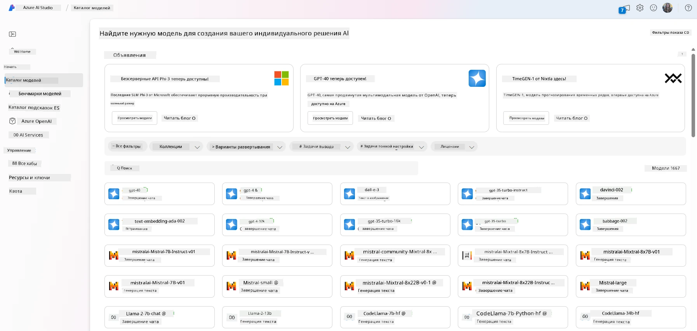

- Ознакомиться с карточкой модели, включая подробное описание предназначения и обучающих данных, примеры кода и результаты оценивания в библиотеке внутренних оценок.

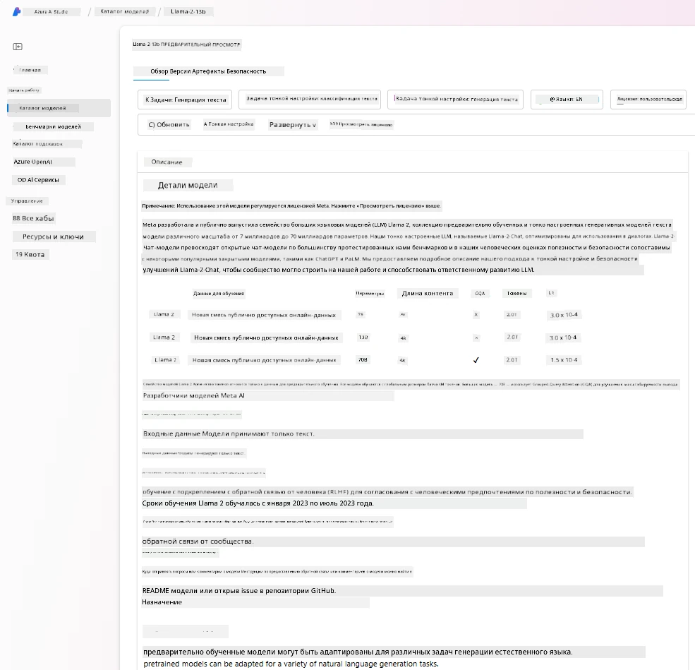

- Сравнивать показатели производительности разных моделей и наборов данных из индустрии для оценки того, какая из них лучше подходит для бизнес-сценария, через панель [Model Benchmarks](https://learn.microsoft.com/azure/ai-studio/how-to/model-benchmarks?WT.mc_id=academic-105485-koreyst).

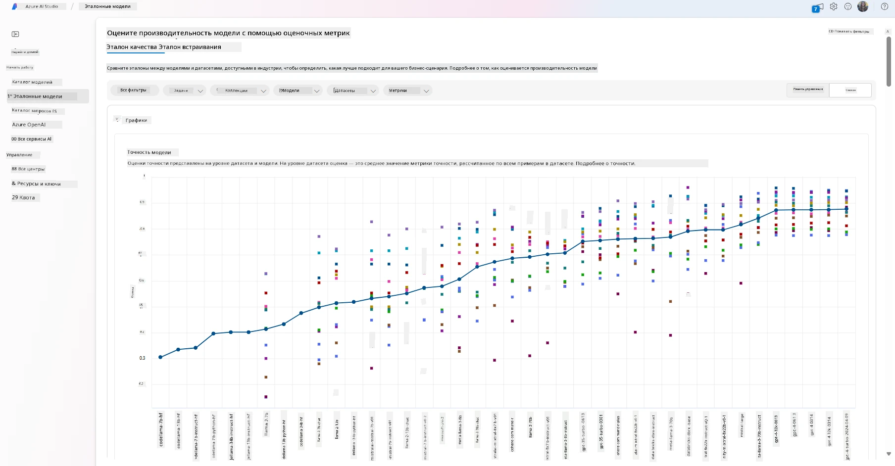

- Тонко настраивать поддерживаемые модели на пользовательских обучающих данных для улучшения производительности модели в конкретной нагрузке, используя возможности экспериментов и отслеживания в Microsoft Foundry.

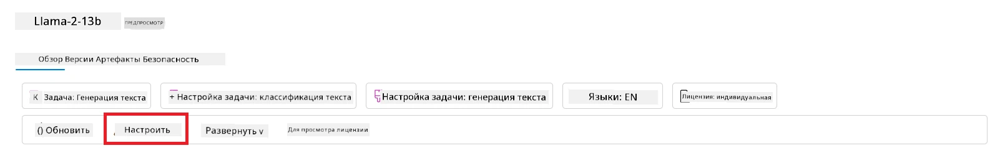

- Развертывать оригинальную предварительно обученную модель или тонко настроенную версию на удалённой точке для анализа в реальном времени, используя управляемые вычислительные мощности или серверные варианты развертывания, чтобы приложения могли её использовать.

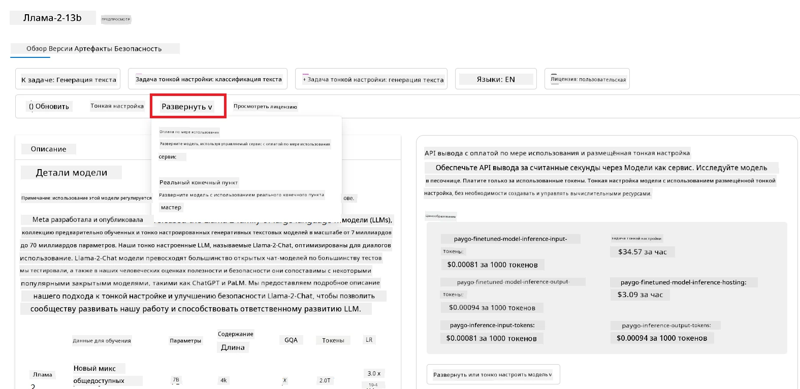

> [!NOTE]
> Не все модели в каталоге в настоящее время доступны для тонкой настройки и/или развертывания по модели оплаты за использование. Проверьте карточку модели для получения информации о возможностях и ограничениях модели.

## Улучшение результатов LLM

Наша стартап-команда исследовала разные типы LLM и облачную платформу (Microsoft Foundry), которая позволяет сравнивать разные модели, оценивать их на тестовых данных, улучшать производительность и развертывать их на инференс-точках.

Но когда стоит рассматривать тонкую настройку модели, а не использование предварительно обученной? Есть ли другие подходы для улучшения производительности модели на конкретных нагрузках?

Существует несколько подходов, которые бизнес может использовать, чтобы получить необходимые результаты от LLM. При развертывании LLM в продакшн можно выбирать различные типы моделей с разной степенью обучения, различной сложностью, стоимостью и качеством. Вот несколько разных подходов:

- **Промпт-инжиниринг с контекстом**. Идея — предоставить достаточно контекста в промпте, чтобы получить нужные ответы.

- **Retrieval Augmented Generation, RAG**. Ваши данные могут находиться в базе данных или на веб-эндпоинте, например; чтобы гарантировать включение этих данных или их части в момент подсказки, вы можете извлечь релевантные данные и включить их в промпт пользователя.

- **Тонко настроенная модель**. В этом случае вы дополнительно обучили модель на своих данных, что привело к тому, что модель стала более точной и отзывчивой к вашим потребностям, но это может быть дорогостоящим.

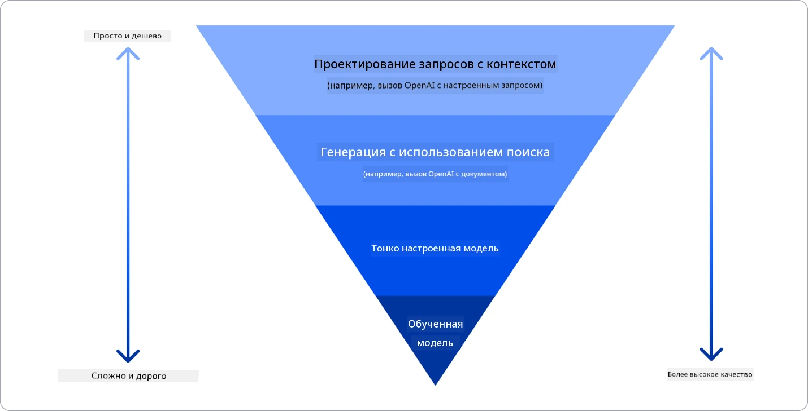

Источник изображения: [Four Ways that Enterprises Deploy LLMs | Fiddler AI Blog](https://www.fiddler.ai/blog/four-ways-that-enterprises-deploy-llms?WT.mc_id=academic-105485-koreyst)

### Промпт-инжиниринг с контекстом

Предобученные LLM отлично справляются с обобщёнными задачами обработки естественного языка, даже если вызвать их коротким промптом, например, предложением для завершения или вопросом — так называемое «zero-shot» обучение.

Однако чем лучше пользователь формулирует свой запрос, используя подробный запрос и примеры — Контекст — тем точнее и ближе к ожиданиям пользователя будет ответ. В этом случае говорят о «one-shot» обучении, если в промпте только один пример, и о «few-shot» обучении, если примеров несколько.
Промпт-инжиниринг с контекстом — самый экономичный подход для начала.

### Retrieval Augmented Generation (RAG)

У LLM есть ограничение: они могут использовать только данные, на которых обучались, чтобы сгенерировать ответ. Это значит, что они ничего не знают о событиях, произошедших после их обучения, и не имеют доступа к непубличной информации (например, данным компании).
Это можно преодолеть с помощью RAG — техники, которая дополняет промпт внешними данными в виде фрагментов документов, учитывая ограничения длины промпта. Это поддерживается инструментами векторных баз данных (например, [Azure Vector Search](https://learn.microsoft.com/azure/search/vector-search-overview?WT.mc_id=academic-105485-koreyst)), которые извлекают полезные фрагменты из различных заранее определённых источников данных и добавляют их в контекст промпта.

Эта техника очень полезна, когда у бизнеса недостаточно данных, времени или ресурсов для тонкой настройки LLM, но он всё же хочет улучшить производительность на конкретной нагрузке и снизить риски появления галлюцинаций, устаревших или неподдерживаемых ответов.

### Тонко настроенная модель

Тонкая настройка — это процесс, который использует переносное обучение для «адаптации» модели к конкретной задаче или решению специфической проблемы. В отличие от few-shot обучения и RAG, он приводит к созданию новой модели с обновлёнными весами и смещениями. Для этого требуется набор обучающих примеров, состоящих из одного входа (промпта) и соответствующего ему вывода (завершения).
Этот подход предпочтителен, если:

- **Используется меньшая специализированная модель для узкой задачи**. Бизнес предпочитает тонко настроить меньшую модель для узкой задачи, а не многократно обращаться к более крупной модели, получая более экономичное и быстрое решение.

- **Важно учитывать задержку отклика (латентность)**. Латентность критична для конкретного кейса, поэтому нельзя использовать очень длинные промпты или количество примеров, выходящее за пределы длины промпта.

- **Адаптация стабильного поведения**. У бизнеса есть много высококачественных примеров, и он хочет, чтобы модель последовательно следовала заданному шаблону задачи, формату вывода, тону или стилю, специфичному для домена. Если основная проблема — свежие факты или изменяющиеся приватные знания, стоит использовать RAG вместо того, чтобы полагаться только на тонкую настройку.

### Обученная модель

Обучение LLM с нуля — безусловно самый сложный и комплексный подход, требующий огромных объёмов данных, квалифицированных ресурсов и соответствующих вычислительных мощностей. Этот вариант следует рассматривать только в сценарии, когда у бизнеса есть доменно-специфический кейс и большой объём доменно-центрированных данных.

## Проверка знаний

Какой подход может быть хорош для улучшения результатов генерации LLM?

1. Промпт-инжиниринг с контекстом
1. RAG
1. Тонко настроенная модель

Ответ: Все три могут помочь. Начинайте с промпт-инжиниринга и контекста для быстрого улучшения, используйте RAG, когда модели нужны актуальные факты или приватные бизнес-данные. Выбирайте тонкую настройку, если у вас есть достаточно высококачественных примеров и необходимо, чтобы модель последовательно следовала шаблону задачи, формату, тону или доменному стилю.

## 🚀 Вызов

Узнайте больше о том, как вы можете [использовать RAG](https://learn.microsoft.com/azure/search/retrieval-augmented-generation-overview?WT.mc_id=academic-105485-koreyst) для своего бизнеса.

## Отличная работа, продолжайте обучение

После завершения этого урока ознакомьтесь с нашей коллекцией [Generative AI Learning collection](https://aka.ms/genai-collection?WT.mc_id=academic-105485-koreyst), чтобы продолжить углублять свои знания в области генеративного ИИ!

Перейдите к Уроку 3, где мы рассмотрим, как [строить ответственно с Генеративным ИИ](../03-using-generative-ai-responsibly/README.md?WT.mc_id=academic-105485-koreyst)!

---

<!-- CO-OP TRANSLATOR DISCLAIMER START -->
**Отказ от ответственности**:
Этот документ был переведен с использованием сервиса машинного перевода [Co-op Translator](https://github.com/Azure/co-op-translator). Несмотря на наши усилия по обеспечению точности, имейте в виду, что автоматический перевод может содержать ошибки или неточности. Оригинальный документ на его исходном языке следует считать авторитетным источником. Для получения критически важной информации рекомендуется обратиться к профессиональному человеческому переводу. Мы не несем ответственности за любые недоразумения или неправильные толкования, возникшие в результате использования этого перевода.
<!-- CO-OP TRANSLATOR DISCLAIMER END -->