<!--
CO_OP_TRANSLATOR_METADATA:
{
  "original_hash": "e2f686f2eb794941761252ac5e8e090b",
  "translation_date": "2025-06-25T10:15:44+00:00",
  "source_file": "02-exploring-and-comparing-different-llms/README.md",
  "language_code": "ru"
}
-->
# Исследование и сравнение различных LLM

[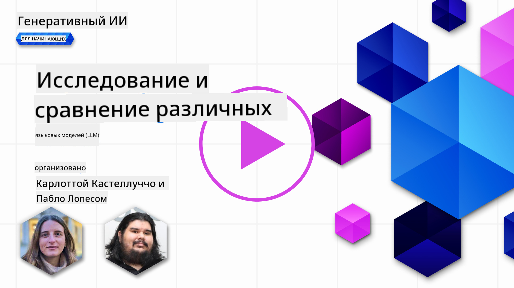](https://aka.ms/gen-ai-lesson2-gh?WT.mc_id=academic-105485-koreyst)

> _Нажмите на изображение выше, чтобы посмотреть видео этого урока_

В предыдущем уроке мы увидели, как генеративный ИИ меняет технологический ландшафт, как работают крупные языковые модели (LLM) и как бизнес - например, наш стартап - может применять их в своих случаях использования и расти! В этой главе мы собираемся сравнить и противопоставить различные типы крупных языковых моделей (LLM), чтобы понять их плюсы и минусы.

Следующий шаг на пути нашего стартапа - изучение текущего ландшафта LLM и понимание, какие из них подходят для нашего случая использования.

## Введение

Этот урок охватывает:

- Различные типы LLM в текущем ландшафте.
- Тестирование, итерация и сравнение различных моделей для вашего случая использования в Azure.
- Как развернуть LLM.

## Цели обучения

После завершения этого урока вы сможете:

- Выбрать правильную модель для вашего случая использования.
- Понять, как тестировать, итерационно улучшать и повышать производительность вашей модели.
- Знать, как бизнесы развертывают модели.

## Понимание различных типов LLM

LLM могут иметь несколько категорий в зависимости от их архитектуры, обучающих данных и случая использования. Понимание этих различий поможет нашему стартапу выбрать правильную модель для сценария и понять, как тестировать, итерационно улучшать и повышать производительность.

Существует множество различных типов моделей LLM, ваш выбор модели зависит от того, для чего вы планируете их использовать, ваших данных, сколько вы готовы платить и других факторов.

В зависимости от того, собираетесь ли вы использовать модели для генерации текста, аудио, видео, изображений и так далее, вы можете выбрать другой тип модели.

- **Распознавание аудио и речи**. Для этой цели модели типа Whisper являются отличным выбором, так как они универсальны и предназначены для распознавания речи. Они обучены на разнообразных аудиоданных и могут выполнять многоязычное распознавание речи. Узнайте больше о [моделях типа Whisper здесь](https://platform.openai.com/docs/models/whisper?WT.mc_id=academic-105485-koreyst).

- **Генерация изображений**. Для генерации изображений DALL-E и Midjourney - два очень известных выбора. DALL-E предлагается Azure OpenAI. [Читайте больше о DALL-E здесь](https://platform.openai.com/docs/models/dall-e?WT.mc_id=academic-105485-koreyst) и также в главе 9 этой программы.

- **Генерация текста**. Большинство моделей обучены на генерации текста, и у вас есть большой выбор от GPT-3.5 до GPT-4. Они имеют разные затраты, при этом GPT-4 является самым дорогим. Стоит взглянуть на [площадку Azure OpenAI](https://oai.azure.com/portal/playground?WT.mc_id=academic-105485-koreyst), чтобы оценить, какие модели лучше всего соответствуют вашим потребностям с точки зрения возможностей и стоимости.

- **Мультимодальность**. Если вы хотите обрабатывать несколько типов данных на входе и выходе, вам может понадобиться изучить такие модели, как [gpt-4 turbo с видением или gpt-4o](https://learn.microsoft.com/azure/ai-services/openai/concepts/models#gpt-4-and-gpt-4-turbo-models?WT.mc_id=academic-105485-koreyst) - последние релизы моделей OpenAI - которые способны сочетать обработку естественного языка с визуальным пониманием, обеспечивая взаимодействие через мультимодальные интерфейсы.

Выбор модели означает, что вы получаете некоторые базовые возможности, которых, однако, может быть недостаточно. Часто у вас есть данные, специфичные для компании, о которых вам каким-то образом нужно сообщить LLM. Существует несколько различных вариантов подхода к этому, о чем подробнее будет рассказано в следующих разделах.

### Модели-основы против LLM

Термин "Модель-основа" был [введен исследователями Стэнфорда](https://arxiv.org/abs/2108.07258?WT.mc_id=academic-105485-koreyst) и определен как модель ИИ, которая следует некоторым критериям, таким как:

- **Они обучаются с использованием неконтролируемого обучения или самоконтролируемого обучения**, что означает, что они обучаются на неразмеченных мультимодальных данных и не требуют аннотации или разметки данных человеком для своего процесса обучения.
- **Они очень большие модели**, основанные на очень глубоких нейронных сетях, обученных на миллиардах параметров.
- **Они обычно предназначены для служения в качестве "основы" для других моделей**, что означает, что они могут быть использованы в качестве отправной точки для создания других моделей, что может быть сделано путем дообучения.

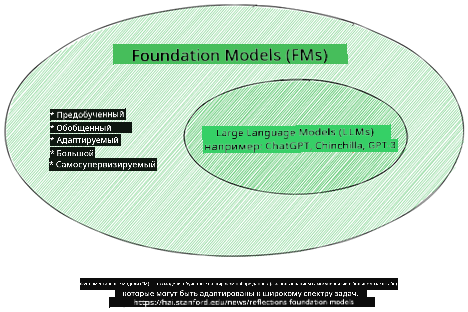

Источник изображения: [Essential Guide to Foundation Models and Large Language Models | by Babar M Bhatti | Medium
](https://thebabar.medium.com/essential-guide-to-foundation-models-and-large-language-models-27dab58f7404)

Чтобы еще больше прояснить это различие, давайте возьмем ChatGPT в качестве примера. Для создания первой версии ChatGPT модель, называемая GPT-3.5, служила моделью-основой. Это означает, что OpenAI использовала некоторые данные, специфичные для чатов, чтобы создать настроенную версию GPT-3.5, которая была специализирована для хорошей работы в разговорных сценариях, таких как чат-боты.

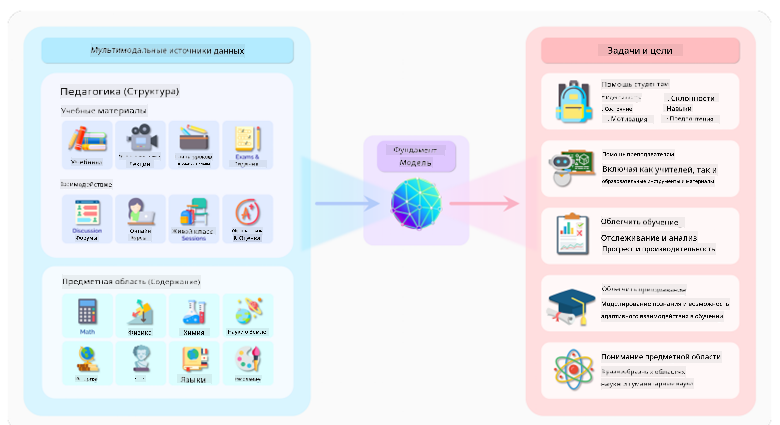

Источник изображения: [2108.07258.pdf (arxiv.org)](https://arxiv.org/pdf/2108.07258.pdf?WT.mc_id=academic-105485-koreyst)

### Открытые модели против проприетарных моделей

Еще один способ классификации LLM - это их открытость или проприетарность.

Открытые модели - это модели, которые доступны для широкой публики и могут быть использованы кем угодно. Они часто предоставляются компанией, которая их создала, или исследовательским сообществом. Эти модели можно инспектировать, изменять и настраивать для различных случаев использования в LLM. Однако они не всегда оптимизированы для использования в производстве и могут быть не такими производительными, как проприетарные модели. Кроме того, финансирование открытых моделей может быть ограничено, и они могут не поддерживаться в долгосрочной перспективе или не обновляться с учетом последних исследований. Примеры популярных открытых моделей включают [Alpaca](https://crfm.stanford.edu/2023/03/13/alpaca.html?WT.mc_id=academic-105485-koreyst), [Bloom](https://huggingface.co/bigscience/bloom) и [LLaMA](https://llama.meta.com).

Проприетарные модели - это модели, которые принадлежат компании и не доступны для широкой публики. Эти модели часто оптимизированы для использования в производстве. Однако их нельзя инспектировать, изменять или настраивать для различных случаев использования. Кроме того, они не всегда доступны бесплатно и могут требовать подписки или оплаты за использование. Также пользователи не имеют контроля над данными, которые используются для обучения модели, что означает, что они должны доверять владельцу модели в обеспечении соблюдения конфиденциальности данных и ответственного использования ИИ. Примеры популярных проприетарных моделей включают [модели OpenAI](https://platform.openai.com/docs/models/overview?WT.mc_id=academic-105485-koreyst), [Google Bard](https://sapling.ai/llm/bard?WT.mc_id=academic-105485-koreyst) или [Claude 2](https://www.anthropic.com/index/claude-2?WT.mc_id=academic-105485-koreyst).

### Встраивание против генерации изображений против генерации текста и кода

LLM также могут быть классифицированы по генерируемому ими выходу.

Встраивания - это набор моделей, которые могут преобразовывать текст в числовую форму, называемую встраиванием, которая представляет собой числовое представление входного текста. Встраивания упрощают машинам понимание отношений между словами или предложениями и могут использоваться в качестве входных данных для других моделей, таких как модели классификации или кластеризации, которые имеют лучшую производительность на числовых данных. Модели встраивания часто используются для обучения переносу, когда модель создается для суррогатной задачи, для которой есть обилие данных, и затем веса модели (встраивания) повторно используются для других последующих задач. Примером этой категории является [встраивания OpenAI](https://platform.openai.com/docs/models/embeddings?WT.mc_id=academic-105485-koreyst).

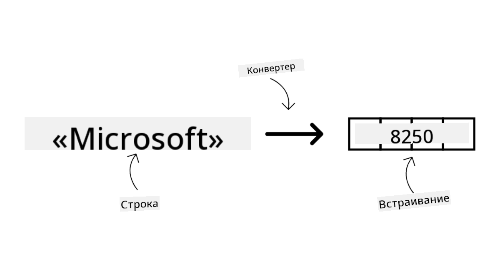

Модели генерации изображений - это модели, которые генерируют изображения. Эти модели часто используются для редактирования изображений, синтеза изображений и перевода изображений. Модели генерации изображений часто обучаются на больших наборах данных изображений, таких как [LAION-5B](https://laion.ai/blog/laion-5b/?WT.mc_id=academic-105485-koreyst), и могут использоваться для генерации новых изображений или редактирования существующих изображений с использованием техник инпейнтинга, суперразрешения и колоризации. Примеры включают [DALL-E-3](https://openai.com/dall-e-3?WT.mc_id=academic-105485-koreyst) и [Stable Diffusion models](https://github.com/Stability-AI/StableDiffusion?WT.mc_id=academic-105485-koreyst).

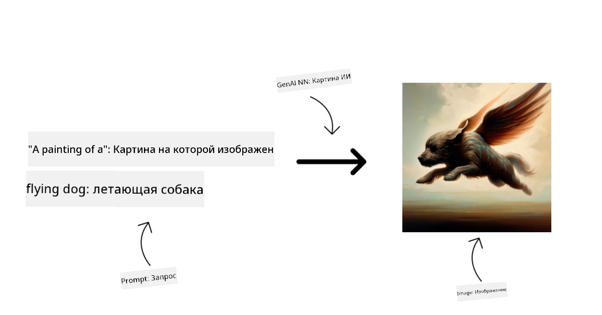

Модели генерации текста и кода - это модели, которые генерируют текст или код. Эти модели часто используются для суммирования текста, перевода и ответа на вопросы. Модели генерации текста часто обучаются на больших наборах данных текста, таких как [BookCorpus](https://www.cv-foundation.org/openaccess/content_iccv_2015/html/Zhu_Aligning_Books_and_ICCV_2015_paper.html?WT.mc_id=academic-105485-koreyst), и могут использоваться для генерации нового текста или ответа на вопросы. Модели генерации кода, такие как [CodeParrot](https://huggingface.co/codeparrot?WT.mc_id=academic-105485-koreyst), часто обучаются на больших наборах данных кода, таких как GitHub, и могут использоваться для генерации нового кода или исправления ошибок в существующем коде.

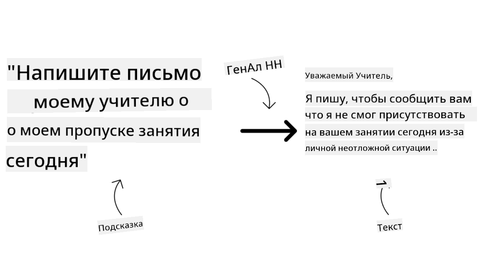

### Кодировщик-декодировщик против только декодировщика

Чтобы поговорить о различных типах архитектур LLM, давайте используем аналогию.

Представьте, что ваш менеджер дал вам задание написать викторину для студентов. У вас есть два коллеги; один отвечает за создание контента, а другой - за его проверку.

Создатель контента похож на модель только декодировщика, он может взглянуть на тему и увидеть, что вы уже написали, а затем он может написать курс на основе этого. Они очень хороши в написании увлекательного и информативного контента, но не очень хороши в понимании темы и учебных целей. Некоторые примеры моделей декодировщика - это модели семейства GPT, такие как GPT-3.

Рецензент похож на модель только кодировщика, они смотрят на написанный курс и ответы, замечая взаимосвязь между ними и понимая контекст, но они не хороши в создании контента. Примером модели только кодировщика является BERT.

Представьте, что у нас также может быть кто-то, кто мог бы создавать и проверять викторину, это модель кодировщик-декодировщик. Некоторые примеры включают BART и T5.

### Сервис против модели

Теперь давайте поговорим о разнице между сервисом и моделью. Сервис - это продукт, предлагаемый облачным провайдером услуг, и часто представляет собой комбинацию моделей, данных и других компонентов. Модель - это основная составляющая сервиса и часто является моделью-основой, такой как LLM.

Сервисы часто оптимизированы для использования в производстве и часто проще в использовании, чем модели, через графический интерфейс пользователя. Однако сервисы не всегда доступны бесплатно и могут требовать подписки или оплаты за использование, в обмен на использование оборудования и ресурсов владельца сервиса, оптимизацию расходов и легкое масштабирование. Примером сервиса является [Azure OpenAI Service](https://learn.microsoft.com/azure/ai-services/openai/overview?WT.mc_id=academic-105485-koreyst), который предлагает тарифный план pay-as-you-go, то есть пользователи оплачивают пропорционально тому, сколько они используют сервис. Также Azure OpenAI Service предлагает безопасность корпоративного уровня и ответственный ИИ-фреймворк поверх возможностей моделей.

Модели - это просто нейронная сеть с параметрами, весами и другими характеристиками. Позволяя компаниям запускать локально, однако, потребуется купить оборудование, построить структуру для масштабирования и купить лицензию или использовать открытую модель. Модель, такая как LLaMA, доступна для использования, требуя вычислительной мощности для запуска модели.

## Как тестировать и итерационно улучшать с различными моделями для понимания производительности в Azure

После того как наша команда изучила текущий ландшафт LLM и определила некоторых хороших кандидатов для своих сценариев, следующий шаг - тестирование их на своих данных и на своей рабочей нагрузке. Это итерационный процесс, проводимый с помощью экспериментов и измерений. Большинство моделей, которые мы упомянули в предыдущих параграфах (модели OpenAI, открытые модели, такие как Llama2, и трансформеры Hugging Face), доступны в [Каталоге моделей](https://learn.microsoft.com/azure/ai-studio/how-to/model-catalog-overview?WT.mc_id=academic-105485-koreyst) в [Azure AI Studio](https://ai.azure.com/?WT.mc_id=academic-105485-koreyst).

[Azure AI Studio](https://learn.microsoft.com/azure/ai-studio/what-is-ai-studio?WT.mc_id=academic-105485-koreyst) - это облачная платформа, предназначенная для разработчиков, чтобы строить приложения генеративного ИИ и управлять всем жизненным циклом разработки - от экспериментов до оценки - объединяя все сервисы Azure AI в единый центр с удобным графическим интерфейсом. Каталог моделей в Azure AI Studio позволяет пользователю:

- Найти модель-основу, представляющую интерес в каталоге - будь то проприетарная или открытая, фильтруя по задаче, лицензии или имени. Для улучшения поиска модели организованы в коллекции, такие как коллекция Azure OpenAI, коллекция Hugging Face и другие.

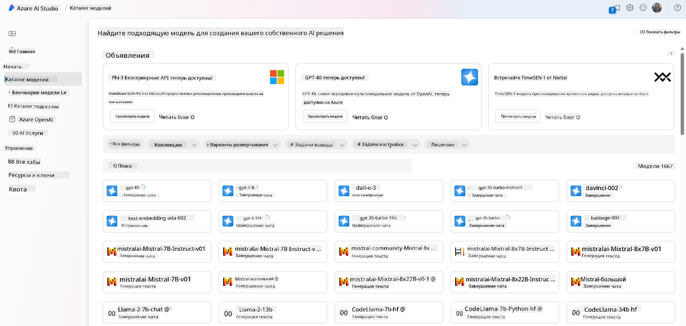

- Ознакомиться с карточкой модели, включая подробное описание предполагаемого использования и обучающих данных, примеры кода и результаты оценки в библиотеке внутренних оценок.

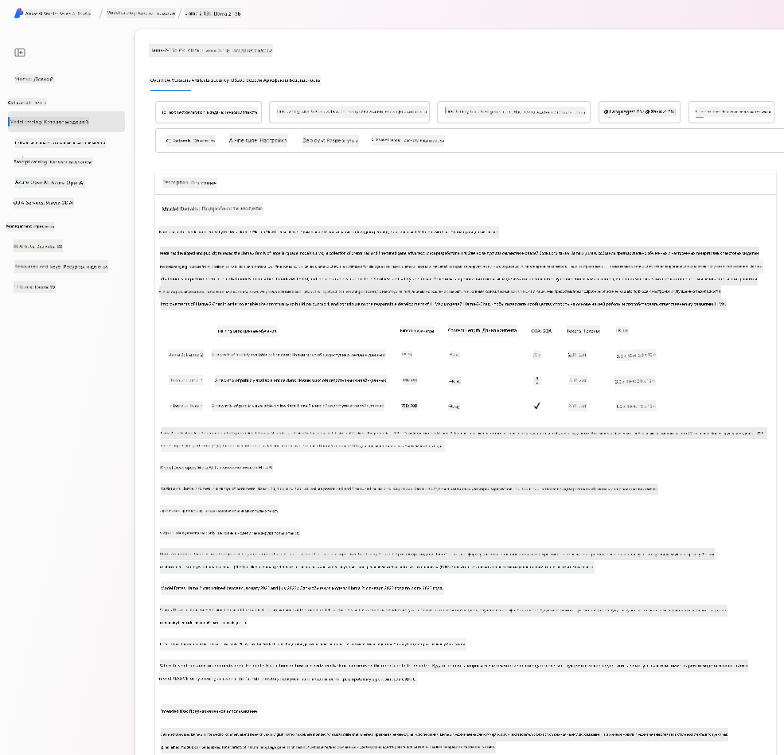
- Сравните результаты тестирования моделей и наборов данных, доступных в индустрии, чтобы оценить, какая из них соответствует бизнес-сценарию, используя панель [Model Benchmarks](https://learn.microsoft.com/azure/ai-studio/how-to/model-benchmarks?WT.mc_id=academic-105485-koreyst).

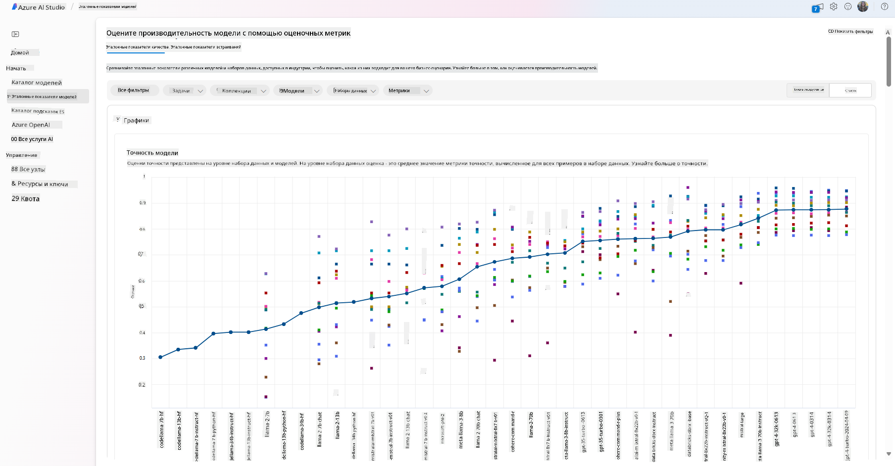

- Подгоните модель на пользовательских тренировочных данных, чтобы улучшить производительность модели в конкретной рабочей нагрузке, используя возможности экспериментов и отслеживания в Azure AI Studio.

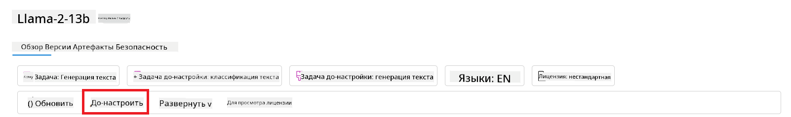

- Разверните оригинальную предобученную модель или ее настроенную версию для удаленного реального времени - управляемого вычисления - или безсерверной конечной точки API - [оплата по мере использования](https://learn.microsoft.com/azure/ai-studio/how-to/model-catalog-overview#model-deployment-managed-compute-and-serverless-api-pay-as-you-go?WT.mc_id=academic-105485-koreyst) - чтобы приложения могли ее использовать.

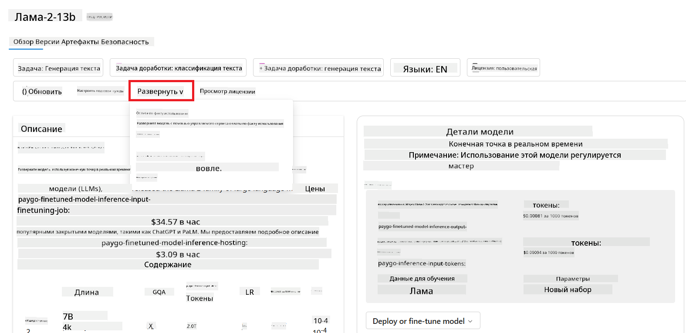

> [!NOTE]
> Не все модели в каталоге доступны для тонкой настройки и/или развертывания по мере использования. Проверьте карточку модели для получения информации о возможностях и ограничениях модели.

## Улучшение результатов LLM

Мы исследовали с нашей стартап-командой различные виды LLM и облачную платформу (Azure Machine Learning), которая позволяет нам сравнивать различные модели, оценивать их на тестовых данных, улучшать производительность и развертывать их на конечных точках вывода.

Но когда следует рассматривать тонкую настройку модели, а не использование предобученной? Существуют ли другие подходы для улучшения производительности модели в конкретных рабочих нагрузках?

Существует несколько подходов, которые бизнес может использовать, чтобы получить нужные результаты от LLM. Вы можете выбрать разные типы моделей с различной степенью обучения при развертывании LLM в производстве, с разным уровнем сложности, стоимости и качества. Вот некоторые подходы:

- **Инженерия подсказок с контекстом**. Идея заключается в предоставлении достаточного контекста при подаче запроса, чтобы гарантировать получение нужных ответов.

- **Генерация с дополнением извлечением, RAG**. Ваши данные могут находиться в базе данных или веб-эндоинте, например, чтобы гарантировать включение этих данных или их подмножества во время запроса, вы можете извлечь соответствующие данные и сделать их частью запроса пользователя.

- **Тонко настроенная модель**. Здесь вы дополнительно обучили модель на своих данных, что привело к тому, что модель стала более точной и отзывчивой к вашим потребностям, но это может быть дорого.

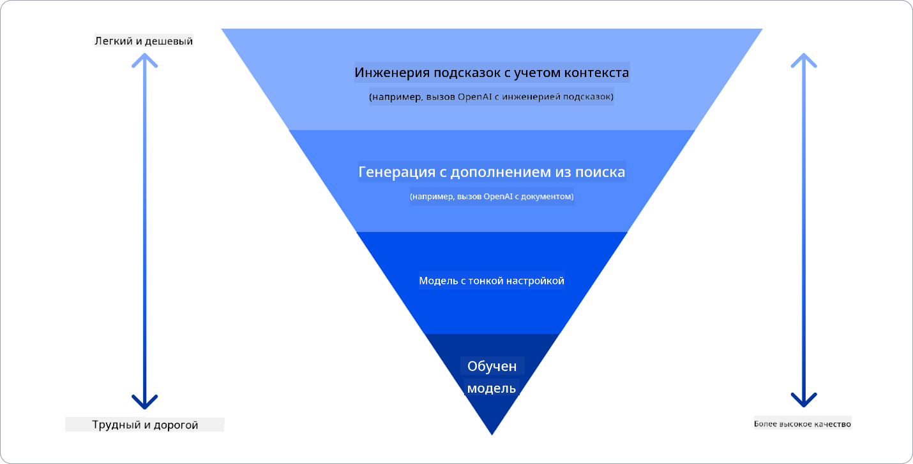

Источник изображения: [Четыре способа развертывания LLM предприятиями | Блог Fiddler AI](https://www.fiddler.ai/blog/four-ways-that-enterprises-deploy-llms?WT.mc_id=academic-105485-koreyst)

### Инженерия подсказок с контекстом

Предобученные LLM отлично работают на обобщенных задачах обработки естественного языка, даже при вызове их с короткой подсказкой, такой как предложение для завершения или вопрос – так называемое обучение "с нуля".

Однако чем больше пользователь может сформулировать свой запрос, с подробным запросом и примерами – Контекст – тем точнее и ближе к ожиданиям пользователя будет ответ. В этом случае мы говорим о "обучении с одного примера", если подсказка включает только один пример, и "обучении с несколькими примерами", если она включает несколько примеров. Инженерия подсказок с контекстом является наиболее экономически эффективным подходом для начала.

### Генерация с дополнением извлечением (RAG)

LLM имеют ограничение, что они могут использовать только данные, которые были использованы во время их обучения для генерации ответа. Это означает, что они ничего не знают о фактах, которые произошли после их обучения, и они не могут получить доступ к непубличной информации (например, данным компании).
Это можно преодолеть с помощью RAG, техники, которая дополняет подсказку внешними данными в виде фрагментов документов, учитывая ограничения длины подсказки. Это поддерживается инструментами базы данных векторов (например, [Azure Vector Search](https://learn.microsoft.com/azure/search/vector-search-overview?WT.mc_id=academic-105485-koreyst)), которые извлекают полезные фрагменты из различных предопределенных источников данных и добавляют их в Контекст подсказки.

Эта техника очень полезна, когда у бизнеса недостаточно данных, времени или ресурсов для тонкой настройки LLM, но все же хочется улучшить производительность в конкретной рабочей нагрузке и снизить риски фабрикации, т.е. искажения реальности или вредоносного контента.

### Тонко настроенная модель

Тонкая настройка - это процесс, который использует переносное обучение для "адаптации" модели к задаче нижнего уровня или для решения конкретной проблемы. В отличие от обучения с несколькими примерами и RAG, это приводит к созданию новой модели с обновленными весами и смещениями. Это требует набора тренировочных примеров, состоящих из одного входа (подсказки) и его связанного вывода (завершения).
Этот подход будет предпочтительным, если:

- **Использование тонко настроенных моделей**. Бизнес хотел бы использовать менее способные тонко настроенные модели (например, модели встраивания), а не высокопроизводительные модели, что приводит к более экономически эффективному и быстрому решению.

- **Учет задержки**. Задержка важна для конкретного использования, поэтому невозможно использовать очень длинные подсказки или количество примеров, которые должны быть изучены моделью, не соответствует ограничению длины подсказки.

- **Оставаться в курсе**. У бизнеса есть много качественных данных и истинных меток, а также ресурсы, необходимые для поддержания этих данных в актуальном состоянии со временем.

### Обученная модель

Обучение LLM с нуля, без сомнения, является самым сложным и самым комплексным подходом, требующим огромного количества данных, квалифицированных ресурсов и соответствующей вычислительной мощности. Этот вариант следует рассматривать только в случае, если у бизнеса есть специфический для области сценарий использования и большое количество данных, ориентированных на область.

## Проверка знаний

Какой может быть хороший подход для улучшения результатов завершения LLM?

1. Инженерия подсказок с контекстом
1. RAG
1. Тонко настроенная модель

A:3, если у вас есть время и ресурсы, а также качественные данные, тонкая настройка - лучший вариант для поддержания актуальности. Однако, если вы хотите улучшить ситуацию и у вас не хватает времени, стоит сначала рассмотреть RAG.

## 🚀 Вызов

Узнайте больше о том, как вы можете [использовать RAG](https://learn.microsoft.com/azure/search/retrieval-augmented-generation-overview?WT.mc_id=academic-105485-koreyst) для вашего бизнеса.

## Отличная работа, продолжайте обучение

После завершения этого урока ознакомьтесь с нашей [коллекцией обучения генеративному ИИ](https://aka.ms/genai-collection?WT.mc_id=academic-105485-koreyst), чтобы продолжить повышать свои знания в области генеративного ИИ!

Перейдите к уроку 3, где мы рассмотрим, как [строить с использованием генеративного ИИ ответственно](../03-using-generative-ai-responsibly/README.md?WT.mc_id=academic-105485-koreyst)!

**Отказ от ответственности**:  
Этот документ был переведен с помощью службы автоматического перевода [Co-op Translator](https://github.com/Azure/co-op-translator). Хотя мы стремимся к точности, пожалуйста, имейте в виду, что автоматические переводы могут содержать ошибки или неточности. Оригинальный документ на его родном языке следует считать авторитетным источником. Для получения критически важной информации рекомендуется профессиональный перевод человеком. Мы не несем ответственности за любые недоразумения или неверные толкования, возникающие в результате использования этого перевода.