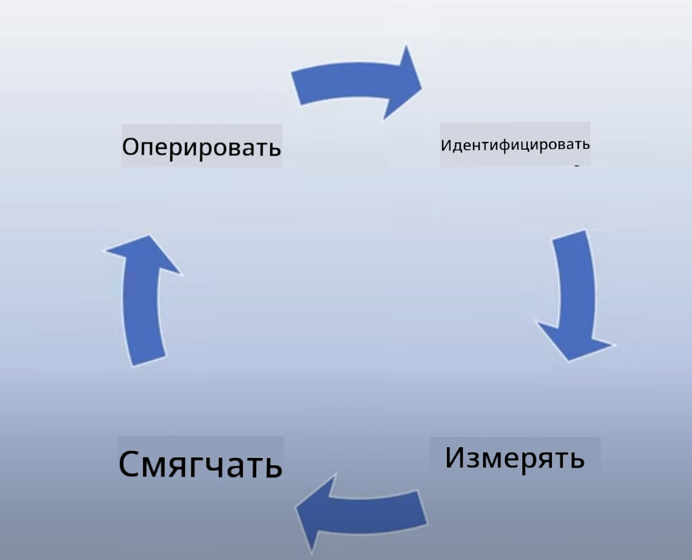

<!--
CO_OP_TRANSLATOR_METADATA:
{
  "original_hash": "4d57fad773cbeb69c5dd62e65c34200d",
  "translation_date": "2025-10-17T15:04:07+00:00",
  "source_file": "03-using-generative-ai-responsibly/README.md",
  "language_code": "ru"
}
-->
# Ответственное использование генеративного ИИ

> _Нажмите на изображение выше, чтобы посмотреть видео этого урока_

Легко увлечься ИИ, особенно генеративным ИИ, но важно задуматься о том, как использовать его ответственно. Нужно учитывать такие аспекты, как обеспечение справедливости, отсутствие вреда и многое другое. Эта глава призвана дать вам необходимый контекст, на что обратить внимание и как предпринять активные шаги для улучшения использования ИИ.

## Введение

В этом уроке мы рассмотрим:

- Почему важно уделять внимание ответственному ИИ при создании приложений с генеративным ИИ.
- Основные принципы ответственного ИИ и их связь с генеративным ИИ.
- Как применять эти принципы на практике с помощью стратегий и инструментов.

## Цели обучения

После завершения урока вы узнаете:

- Почему важно учитывать ответственный ИИ при создании приложений с генеративным ИИ.
- Когда следует задумываться и применять основные принципы ответственного ИИ при разработке приложений с генеративным ИИ.
- Какие инструменты и стратегии доступны для внедрения концепции ответственного ИИ.

## Принципы ответственного ИИ

Интерес к генеративному ИИ достиг небывалых высот. Этот интерес привлек множество новых разработчиков, внимание и финансирование в эту область. Хотя это положительно для тех, кто хочет создавать продукты и компании с использованием генеративного ИИ, важно подходить к этому ответственно.

На протяжении всего курса мы сосредоточимся на создании нашего стартапа и образовательного продукта на основе ИИ. Мы будем использовать принципы ответственного ИИ: справедливость, инклюзивность, надежность/безопасность, защита и конфиденциальность, прозрачность и ответственность. С помощью этих принципов мы исследуем, как они связаны с использованием генеративного ИИ в наших продуктах.

## Почему важно уделять внимание ответственному ИИ

При создании продукта подход, ориентированный на человека, с учетом интересов пользователя, приводит к наилучшим результатам.

Уникальность генеративного ИИ заключается в его способности создавать полезные ответы, информацию, рекомендации и контент для пользователей. Это можно сделать без множества ручных шагов, что может привести к впечатляющим результатам. Однако без должного планирования и стратегий это также может привести к вредным последствиям для ваших пользователей, продукта и общества в целом.

Давайте рассмотрим некоторые (но не все) из этих потенциально вредных последствий:

### Галлюцинации

Галлюцинации — это термин, используемый для описания случаев, когда LLM создает контент, который либо полностью бессмыслен, либо явно неверен с точки зрения других источников информации.

Например, мы создаем функцию для нашего стартапа, которая позволяет студентам задавать исторические вопросы модели. Студент задает вопрос: `Кто был единственным выжившим на Титанике?`

Модель выдает ответ, подобный приведенному ниже:

> _(Источник: [Flying bisons](https://flyingbisons.com?WT.mc_id=academic-105485-koreyst))_

Это очень уверенный и подробный ответ. К сожалению, он неверен. Даже при минимальном исследовании можно обнаружить, что на Титанике было больше одного выжившего. Для студента, который только начинает изучать эту тему, этот ответ может быть достаточно убедительным, чтобы не подвергаться сомнению и восприниматься как факт. Последствия этого могут привести к ненадежности системы ИИ и негативно повлиять на репутацию нашего стартапа.

С каждым обновлением любой LLM мы наблюдаем улучшения в минимизации галлюцинаций. Однако, даже с этими улучшениями, мы как разработчики приложений и пользователи должны оставаться осведомленными о таких ограничениях.

### Вредный контент

Мы уже рассмотрели случаи, когда LLM создает неверные или бессмысленные ответы. Еще один риск, который необходимо учитывать, — это когда модель отвечает вредным контентом.

Вредный контент может включать:

- Инструкции или поощрение к самоповреждению или нанесению вреда определенным группам.
- Оскорбительный или уничижительный контент.
- Руководство по планированию атак или насильственных действий.
- Инструкции о том, как найти незаконный контент или совершить незаконные действия.
- Демонстрация сексуально откровенного контента.

Для нашего стартапа важно убедиться, что у нас есть подходящие инструменты и стратегии, чтобы предотвратить появление такого контента для студентов.

### Отсутствие справедливости

Справедливость определяется как «обеспечение того, чтобы система ИИ была свободна от предвзятости и дискриминации и относилась ко всем справедливо и равноправно». В мире генеративного ИИ важно убедиться, что исключительные мировоззрения маргинализированных групп не усиливаются в результате работы модели.

Такие выходы не только разрушают положительный опыт использования продукта для наших пользователей, но и причиняют дальнейший вред обществу. Как разработчики приложений, мы всегда должны учитывать широкий и разнообразный круг пользователей при создании решений с генеративным ИИ.

## Как использовать генеративный ИИ ответственно

Теперь, когда мы определили важность ответственного генеративного ИИ, давайте рассмотрим 4 шага, которые мы можем предпринять для создания наших решений на основе ИИ ответственно:

### Оценка потенциального вреда

В тестировании программного обеспечения мы проверяем ожидаемые действия пользователя в приложении. Аналогично, тестирование разнообразного набора запросов, которые пользователи, скорее всего, будут использовать, — хороший способ оценить потенциальный вред.

Поскольку наш стартап создает образовательный продукт, было бы полезно подготовить список запросов, связанных с образованием. Это может быть охват определенного предмета, исторических фактов и запросов о студенческой жизни.

### Смягчение потенциального вреда

Теперь пришло время найти способы, как мы можем предотвратить или ограничить потенциальный вред, вызванный моделью и ее ответами. Мы можем рассмотреть это на 4 различных уровнях:

- **Модель**. Выбор подходящей модели для конкретного случая использования. Более крупные и сложные модели, такие как GPT-4, могут представлять больший риск вредного контента при применении к меньшим и более специфическим случаям использования. Использование ваших данных для дообучения также снижает риск вредного контента.

- **Система безопасности**. Система безопасности — это набор инструментов и конфигураций на платформе, обслуживающей модель, которые помогают смягчить вред. Примером этого является система фильтрации контента в Azure OpenAI. Системы также должны обнаруживать атаки на уязвимости и нежелательную активность, такую как запросы от ботов.

- **Метапромпт**. Метапромпты и привязка — это способы, которыми мы можем направлять или ограничивать модель на основе определенных поведений и информации. Это может быть использование системных входных данных для определения определенных ограничений модели. Кроме того, предоставление выходных данных, которые более релевантны для области или домена системы.

Также можно использовать такие техники, как Retrieval Augmented Generation (RAG), чтобы модель извлекала информацию только из выбранных надежных источников. В этом курсе есть урок о [создании поисковых приложений](../08-building-search-applications/README.md?WT.mc_id=academic-105485-koreyst).

- **Пользовательский интерфейс**. Последний уровень — это взаимодействие пользователя с моделью через интерфейс нашего приложения. Таким образом, мы можем разработать UI/UX, чтобы ограничить пользователя в типах запросов, которые он может отправлять модели, а также в тексте или изображениях, отображаемых пользователю. При развертывании приложения на основе ИИ мы также должны быть прозрачными в отношении того, что наше приложение с генеративным ИИ может и не может делать.

У нас есть целый урок, посвященный [Проектированию UX для приложений на основе ИИ](../12-designing-ux-for-ai-applications/README.md?WT.mc_id=academic-105485-koreyst).

- **Оценка модели**. Работа с LLM может быть сложной, потому что мы не всегда контролируем данные, на которых обучалась модель. Тем не менее, мы всегда должны оценивать производительность и выходные данные модели. Важно измерять точность модели, сходство, привязку и релевантность выходных данных. Это помогает обеспечить прозрачность и доверие со стороны заинтересованных сторон и пользователей.

### Эксплуатация ответственного решения на основе генеративного ИИ

Создание операционной практики вокруг ваших приложений на основе ИИ — это финальный этап. Это включает сотрудничество с другими частями нашего стартапа, такими как юридический и отдел безопасности, чтобы убедиться, что мы соблюдаем все нормативные требования. Перед запуском мы также хотим разработать планы по доставке, обработке инцидентов и откату, чтобы предотвратить любой вред для наших пользователей.

## Инструменты

Хотя работа по разработке решений с ответственным ИИ может показаться сложной, она стоит затраченных усилий. По мере роста области генеративного ИИ будут развиваться инструменты, которые помогут разработчикам эффективно интегрировать ответственность в их рабочие процессы. Например, [Azure AI Content Safety](https://learn.microsoft.com/azure/ai-services/content-safety/overview?WT.mc_id=academic-105485-koreyst) может помочь обнаруживать вредный контент и изображения через API-запрос.

## Проверка знаний

На что нужно обратить внимание, чтобы обеспечить ответственное использование ИИ?

1. Чтобы ответ был правильным.
1. Чтобы ИИ не использовался в преступных целях.
1. Чтобы ИИ был свободен от предвзятости и дискриминации.

A: Верны пункты 2 и 3. Ответственный ИИ помогает учитывать, как смягчить вредные последствия, предвзятость и многое другое.

## 🚀 Задание

Изучите [Azure AI Content Safety](https://learn.microsoft.com/azure/ai-services/content-safety/overview?WT.mc_id=academic-105485-koreyst) и подумайте, что вы можете использовать для своих нужд.

## Отличная работа, продолжайте обучение

После завершения этого урока ознакомьтесь с нашей [коллекцией обучения генеративному ИИ](https://aka.ms/genai-collection?WT.mc_id=academic-105485-koreyst), чтобы продолжить углублять свои знания о генеративном ИИ!

Перейдите к уроку 4, где мы рассмотрим [Основы инженерии запросов](../04-prompt-engineering-fundamentals/README.md?WT.mc_id=academic-105485-koreyst)!

---

**Отказ от ответственности**:  
Этот документ был переведен с использованием сервиса автоматического перевода [Co-op Translator](https://github.com/Azure/co-op-translator). Хотя мы стремимся к точности, пожалуйста, учитывайте, что автоматические переводы могут содержать ошибки или неточности. Оригинальный документ на его родном языке следует считать авторитетным источником. Для получения критически важной информации рекомендуется профессиональный перевод человеком. Мы не несем ответственности за любые недоразумения или неправильные интерпретации, возникающие в результате использования данного перевода.