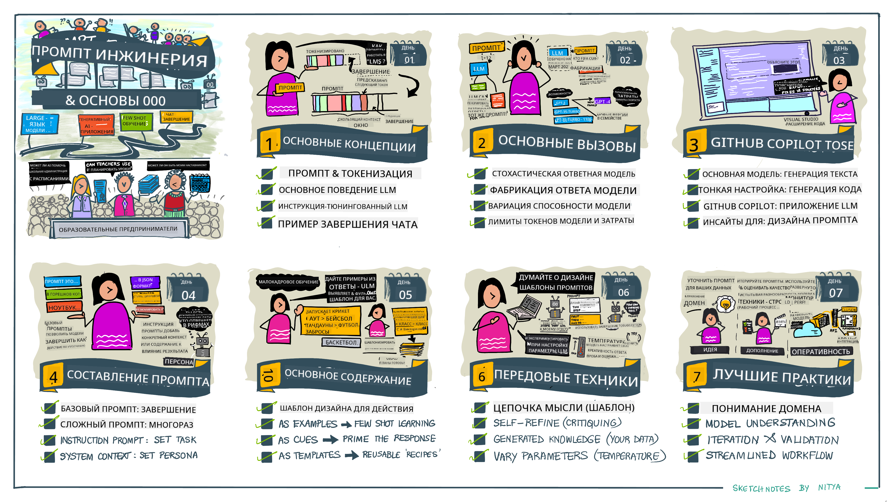
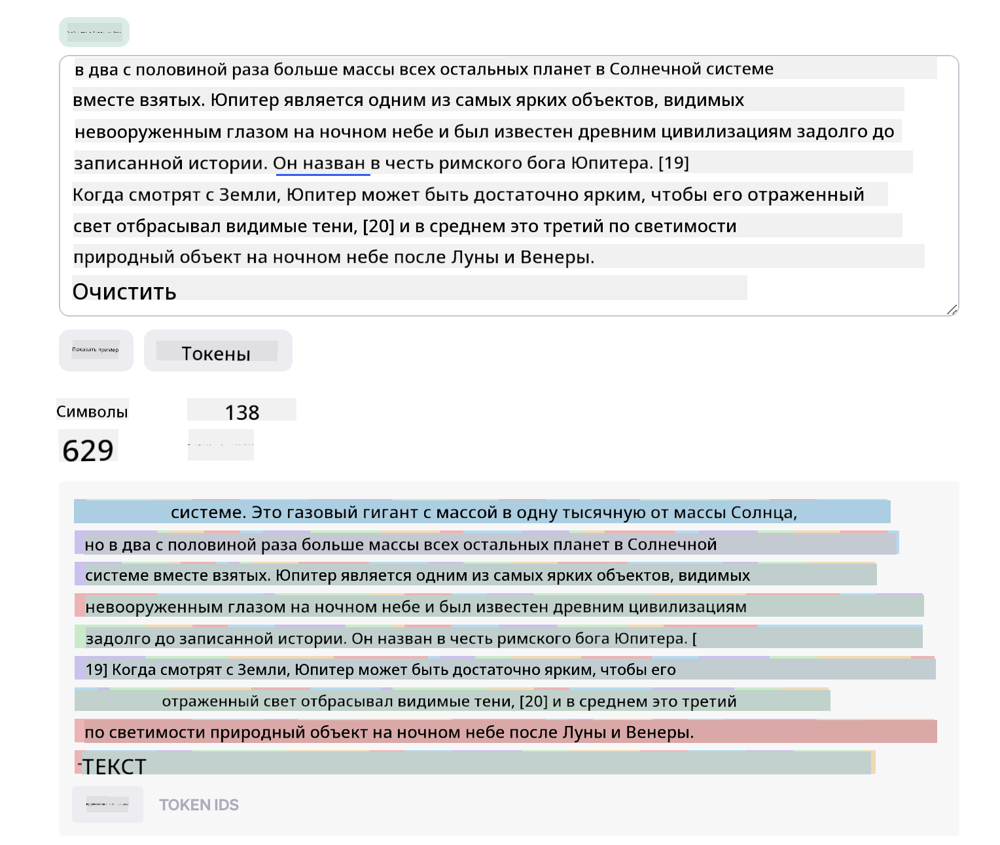
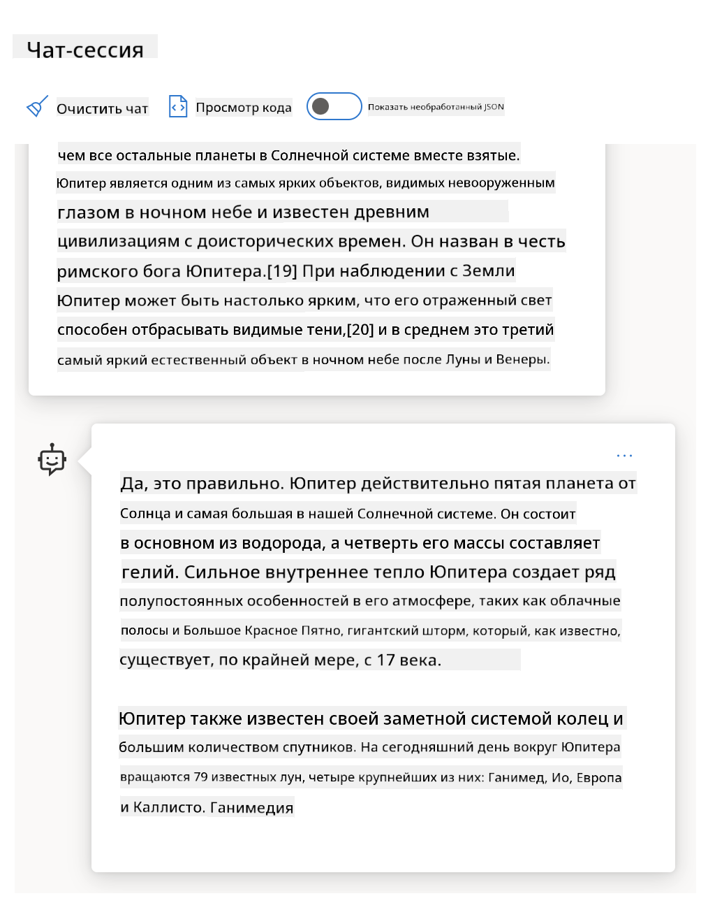
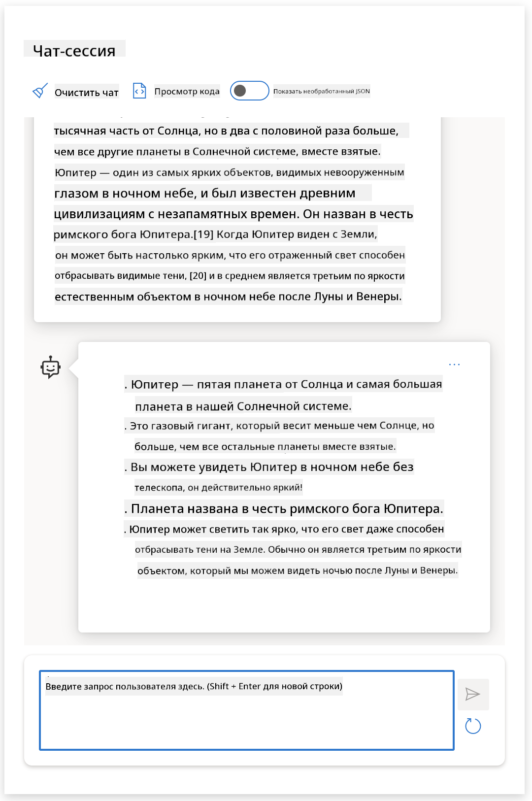
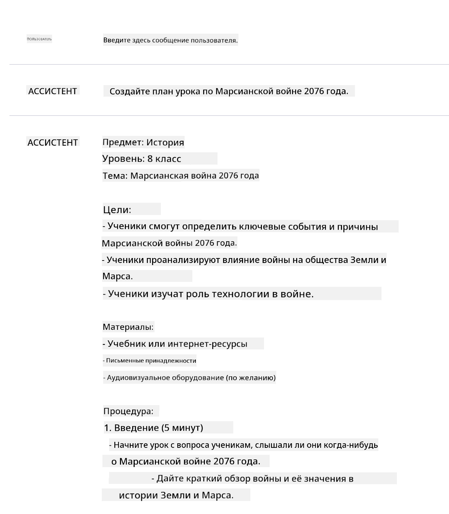
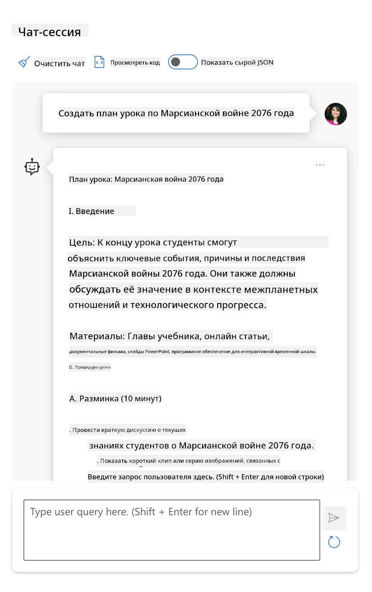
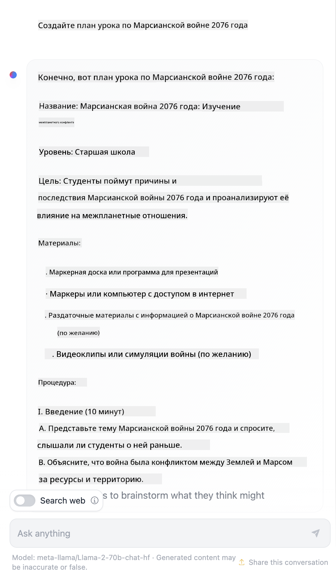

<!--
CO_OP_TRANSLATOR_METADATA:
{
  "original_hash": "0135e6c271f3ece8699050d4debbce88",
  "translation_date": "2025-10-17T15:08:26+00:00",
  "source_file": "04-prompt-engineering-fundamentals/README.md",
  "language_code": "ru"
}
-->
# Основы проектирования запросов

[](https://youtu.be/GElCu2kUlRs?si=qrXsBvXnCW12epb8)

## Введение
Этот модуль охватывает ключевые концепции и техники создания эффективных запросов для генеративных моделей ИИ. То, как вы формулируете запрос к LLM, имеет значение. Тщательно составленный запрос может привести к более качественному ответу. Но что именно означают такие термины, как _запрос_ и _проектирование запросов_? И как улучшить _входные данные_ запроса, которые вы отправляете в LLM? На эти вопросы мы постараемся ответить в этой главе и следующей.

_Генеративный ИИ_ способен создавать новый контент (например, текст, изображения, аудио, код и т.д.) в ответ на запросы пользователей. Это достигается с помощью _Больших языковых моделей_ (LLM), таких как серия GPT ("Generative Pre-trained Transformer") от OpenAI, которые обучены работать с естественным языком и кодом.

Теперь пользователи могут взаимодействовать с этими моделями через привычные интерфейсы, такие как чат, без необходимости технической подготовки или обучения. Модели основаны на _запросах_ - пользователи отправляют текстовый ввод (запрос) и получают ответ от ИИ (завершение). Они могут "общаться с ИИ" итеративно, в многократных диалогах, уточняя запрос, пока ответ не будет соответствовать их ожиданиям.

"Запросы" становятся основным _программным интерфейсом_ для приложений генеративного ИИ, определяя, что модели должны делать и влияя на качество возвращаемых ответов. "Проектирование запросов" - это быстро развивающаяся область, которая сосредоточена на _разработке и оптимизации_ запросов для обеспечения стабильных и качественных ответов в масштабах.

## Цели обучения

В этом уроке мы узнаем, что такое проектирование запросов, почему оно важно и как создавать более эффективные запросы для конкретной модели и цели приложения. Мы разберем основные концепции и лучшие практики проектирования запросов - и узнаем об интерактивной среде "песочницы" Jupyter Notebooks, где можно увидеть применение этих концепций на реальных примерах.

К концу урока мы сможем:

1. Объяснить, что такое проектирование запросов и почему оно важно.
2. Описать компоненты запроса и их использование.
3. Изучить лучшие практики и техники проектирования запросов.
4. Применить изученные техники на реальных примерах, используя конечную точку OpenAI.

## Основные термины

Проектирование запросов: Практика разработки и уточнения входных данных для направления моделей ИИ к созданию желаемых результатов.
Токенизация: Процесс преобразования текста в меньшие единицы, называемые токенами, которые модель может понять и обработать.
LLM, настроенные на инструкции: Большие языковые модели (LLM), которые были доработаны с использованием конкретных инструкций для повышения точности и релевантности ответов.

## Песочница для обучения

Проектирование запросов в настоящее время больше искусство, чем наука. Лучший способ улучшить интуицию в этой области - это _практиковаться больше_ и использовать подход проб и ошибок, который сочетает экспертные знания в области применения с рекомендованными техниками и оптимизациями, специфичными для модели.

Jupyter Notebook, сопровождающий этот урок, предоставляет _песочницу_, где вы можете пробовать изученное - по ходу урока или в рамках задания в конце. Для выполнения упражнений вам потребуется:

1. **Ключ API Azure OpenAI** - конечная точка сервиса для развернутой LLM.
2. **Среда выполнения Python** - для выполнения Notebook.
3. **Локальные переменные окружения** - _выполните шаги [SETUP](./../00-course-setup/02-setup-local.md?WT.mc_id=academic-105485-koreyst), чтобы подготовиться_.

Notebook содержит _начальные_ упражнения - но вам рекомендуется добавлять свои собственные разделы _Markdown_ (описание) и _Code_ (запросы), чтобы попробовать больше примеров или идей - и развить интуицию для проектирования запросов.

## Иллюстрированное руководство

Хотите получить общее представление о том, что охватывает этот урок, прежде чем углубляться? Ознакомьтесь с этим иллюстрированным руководством, которое дает представление о основных темах урока и ключевых выводах, о которых стоит задуматься. План урока проведет вас от понимания основных концепций и вызовов к их решению с помощью соответствующих техник проектирования запросов и лучших практик. Обратите внимание, что раздел "Продвинутые техники" в этом руководстве относится к содержанию, охватываемому в _следующей_ главе этой программы.



## Наша стартап

Теперь давайте поговорим о том, как _эта тема_ связана с нашей миссией стартапа [привнести инновации ИИ в образование](https://educationblog.microsoft.com/2023/06/collaborating-to-bring-ai-innovation-to-education?WT.mc_id=academic-105485-koreyst). Мы хотим создавать приложения на основе ИИ для _персонализированного обучения_ - поэтому давайте подумаем, как разные пользователи нашего приложения могут "разрабатывать" запросы:

- **Администраторы** могут попросить ИИ _проанализировать данные учебных программ, чтобы выявить пробелы в охвате_. ИИ может суммировать результаты или визуализировать их с помощью кода.
- **Преподаватели** могут попросить ИИ _создать план урока для целевой аудитории и темы_. ИИ может составить персонализированный план в указанном формате.
- **Студенты** могут попросить ИИ _помочь им в сложном предмете_. ИИ может направлять студентов с уроками, подсказками и примерами, адаптированными к их уровню.

И это только верхушка айсберга. Ознакомьтесь с [Prompts For Education](https://github.com/microsoft/prompts-for-edu/tree/main?WT.mc_id=academic-105485-koreyst) - библиотекой открытых запросов, созданной экспертами в области образования, чтобы получить более широкое представление о возможностях! _Попробуйте запустить некоторые из этих запросов в песочнице или используя OpenAI Playground, чтобы увидеть, что получится!_

<!--
Шаблон урока:
Этот раздел должен охватывать основную концепцию #1.
Укрепите концепцию примерами и ссылками.

КОНЦЕПЦИЯ #1:
Проектирование запросов.
Определите его и объясните, почему оно необходимо.
-->

## Что такое проектирование запросов?

Мы начали этот урок с определения **Проектирования запросов** как процесса _разработки и оптимизации_ текстовых вводов (запросов) для обеспечения стабильных и качественных ответов (завершений) для конкретной цели приложения и модели. Мы можем рассматривать это как двухэтапный процесс:

- _разработка_ начального запроса для конкретной модели и цели
- _уточнение_ запроса итеративно для улучшения качества ответа

Это обязательно процесс проб и ошибок, который требует интуиции и усилий пользователя для достижения оптимальных результатов. Так почему это важно? Чтобы ответить на этот вопрос, сначала нужно понять три концепции:

- _Токенизация_ = как модель "видит" запрос
- _Базовые LLM_ = как основная модель "обрабатывает" запрос
- _LLM, настроенные на инструкции_ = как модель теперь видит "задачи"

### Токенизация

LLM видит запросы как _последовательность токенов_, где разные модели (или версии модели) могут токенизировать один и тот же запрос по-разному. Поскольку LLM обучаются на токенах (а не на необработанном тексте), способ токенизации запросов напрямую влияет на качество генерируемого ответа.

Чтобы получить интуицию о том, как работает токенизация, попробуйте инструменты, такие как [OpenAI Tokenizer](https://platform.openai.com/tokenizer?WT.mc_id=academic-105485-koreyst), показанный ниже. Скопируйте ваш запрос - и посмотрите, как он преобразуется в токены, обращая внимание на то, как обрабатываются пробелы и знаки препинания. Обратите внимание, что этот пример показывает более старую LLM (GPT-3) - поэтому попытка с более новой моделью может дать другой результат.



### Концепция: Основные модели

После токенизации запроса основная функция ["Базовой LLM"](https://blog.gopenai.com/an-introduction-to-base-and-instruction-tuned-large-language-models-8de102c785a6?WT.mc_id=academic-105485-koreyst) (или основной модели) заключается в предсказании следующего токена в этой последовательности. Поскольку LLM обучены на огромных текстовых наборах данных, они хорошо понимают статистические связи между токенами и могут делать такие предсказания с определенной уверенностью. Обратите внимание, что они не понимают _значение_ слов в запросе или токене; они просто видят шаблон, который могут "завершить" следующим предсказанием. Они могут продолжать предсказывать последовательность до тех пор, пока пользователь не остановит процесс или не будет достигнуто заранее установленное условие.

Хотите увидеть, как работает завершение на основе запросов? Введите вышеуказанный запрос в [_Chat Playground_](https://oai.azure.com/playground?WT.mc_id=academic-105485-koreyst) Azure OpenAI Studio с настройками по умолчанию. Система настроена на обработку запросов как запросов информации - поэтому вы должны увидеть завершение, которое удовлетворяет этот контекст.

Но что, если пользователь хочет увидеть что-то конкретное, соответствующее определенным критериям или цели задачи? Здесь на помощь приходят _LLM, настроенные на инструкции_.



### Концепция: LLM, настроенные на инструкции

[LLM, настроенные на инструкции](https://blog.gopenai.com/an-introduction-to-base-and-instruction-tuned-large-language-models-8de102c785a6?WT.mc_id=academic-105485-koreyst) начинаются с основной модели и дорабатываются с помощью примеров или пар ввода/вывода (например, многократных "сообщений"), которые могут содержать четкие инструкции - и ответ ИИ пытается следовать этим инструкциям.

Для этого используются такие техники, как обучение с подкреплением с обратной связью от человека (RLHF), которые позволяют модели _следовать инструкциям_ и _учиться на обратной связи_, чтобы она генерировала ответы, более подходящие для практических приложений и более релевантные целям пользователя.

Давайте попробуем - вернитесь к вышеуказанному запросу, но теперь измените _системное сообщение_, чтобы предоставить следующий контекст инструкции:

> _Суммируйте предоставленный контент для ученика второго класса. Сохраните результат в одном абзаце с 3-5 пунктами._

Посмотрите, как результат теперь настроен, чтобы отражать желаемую цель и формат? Преподаватель теперь может напрямую использовать этот ответ в своих слайдах для урока.



## Почему нам нужно проектирование запросов?

Теперь, когда мы знаем, как запросы обрабатываются LLM, давайте поговорим о _почему_ нам нужно проектирование запросов. Ответ заключается в том, что текущие LLM представляют собой ряд вызовов, которые делают _надежные и стабильные завершения_ более сложными для достижения без усилий по созданию и оптимизации запросов. Например:

1. **Ответы модели являются стохастическими.** _Один и тот же запрос_ вероятно приведет к разным ответам с разными моделями или версиями моделей. И он может даже давать разные результаты с _той же моделью_ в разное время. _Техники проектирования запросов могут помочь минимизировать эти вариации, предоставляя лучшие рамки_.

1. **Модели могут придумывать ответы.** Модели предварительно обучены на _больших, но конечных_ наборах данных, что означает, что они не знают концепций за пределами этого объема обучения. В результате они могут генерировать завершения, которые являются неточными, вымышленными или прямо противоречат известным фактам. _Техники проектирования запросов помогают пользователям выявлять и минимизировать такие выдумки, например, запрашивая у ИИ ссылки или рассуждения_.

1. **Возможности моделей будут различаться.** Новые модели или поколения моделей будут иметь более богатые возможности, но также принесут уникальные особенности и компромиссы в стоимости и сложности. _Проектирование запросов может помочь нам разработать лучшие практики и рабочие процессы, которые абстрагируют различия и адаптируются к специфическим требованиям моделей масштабируемым и удобным образом_.

Давайте посмотрим это в действии в OpenAI или Azure OpenAI Playground:

- Используйте один и тот же запрос с разными развертываниями LLM (например, OpenAI, Azure OpenAI, Hugging Face) - заметили ли вы различия?
- Используйте один и тот же запрос несколько раз с _одним и тем же_ развертыванием LLM (например, Azure OpenAI Playground) - как эти вариации отличались?

### Пример выдумок

В этом курсе мы используем термин **"выдумка"** для обозначения явления, когда LLM иногда генерируют фактически неверную информацию из-за ограничений их обучения или других факторов. Вы также могли слышать, как это называют _"галлюцинациями"_ в популярных статьях или научных работах. Однако мы настоятельно рекомендуем использовать термин _"выдумка"_, чтобы случайно не очеловечивать поведение, приписывая машинному результату человеческую черту. Это также соответствует [руководящим принципам ответственного ИИ](https://www.microsoft.com/ai/responsible-ai?WT.mc_id=academic-105485-koreyst) с точки зрения терминологии, исключая термины, которые могут быть восприняты как оскорбительные или неинклюзивные в некоторых контекстах.

Хотите понять, как работают выдумки? Придумайте запрос, который инструктирует ИИ создать контент для несуществующей темы (чтобы убедиться, что она не найдена в обучающем наборе данных). Например, я попробовал этот запрос:

> **Запрос:** создайте план урока о Марсианской войне 2076 года.
Поиск в интернете показал, что существуют вымышленные произведения (например, телесериалы или книги) о марсианских войнах, но ни одно из них не связано с 2076 годом. Здравый смысл также подсказывает, что 2076 год — это _будущее_, и, следовательно, не может быть связан с реальным событием.

Что же происходит, если мы запускаем этот запрос с различными поставщиками LLM?

> **Ответ 1**: OpenAI Playground (GPT-35)



> **Ответ 2**: Azure OpenAI Playground (GPT-35)



> **Ответ 3**: Hugging Face Chat Playground (LLama-2)



Как и ожидалось, каждая модель (или версия модели) генерирует немного разные ответы благодаря стохастическому поведению и различиям в возможностях моделей. Например, одна модель ориентируется на аудиторию восьмого класса, а другая предполагает уровень старшеклассника. Однако все три модели создали ответы, которые могли бы убедить неинформированного пользователя в реальности события.

Техники проектирования запросов, такие как _метапромптинг_ и _настройка температуры_, могут в некоторой степени уменьшить вымысел моделей. Новые _архитектуры_ проектирования запросов также интегрируют новые инструменты и методы в поток запросов, чтобы смягчить или уменьшить некоторые из этих эффектов.

## Пример: GitHub Copilot

Давайте завершим этот раздел, получив представление о том, как проектирование запросов используется в реальных решениях, рассмотрев один пример: [GitHub Copilot](https://github.com/features/copilot?WT.mc_id=academic-105485-koreyst).

GitHub Copilot — это ваш "AI-помощник программиста", который преобразует текстовые запросы в завершения кода и интегрируется в вашу среду разработки (например, Visual Studio Code) для удобного пользовательского опыта. Как задокументировано в серии блогов ниже, самая ранняя версия была основана на модели OpenAI Codex — инженеры быстро поняли необходимость доработки модели и разработки лучших техник проектирования запросов для улучшения качества кода. В июле они [представили улучшенную AI-модель, которая выходит за рамки Codex](https://github.blog/2023-07-28-smarter-more-efficient-coding-github-copilot-goes-beyond-codex-with-improved-ai-model/?WT.mc_id=academic-105485-koreyst) для еще более быстрых предложений.

Читайте посты по порядку, чтобы проследить их путь обучения.

- **Май 2023** | [GitHub Copilot становится лучше в понимании вашего кода](https://github.blog/2023-05-17-how-github-copilot-is-getting-better-at-understanding-your-code/?WT.mc_id=academic-105485-koreyst)
- **Май 2023** | [Внутри GitHub: работа с LLM, стоящими за GitHub Copilot](https://github.blog/2023-05-17-inside-github-working-with-the-llms-behind-github-copilot/?WT.mc_id=academic-105485-koreyst).
- **Июнь 2023** | [Как писать лучшие запросы для GitHub Copilot](https://github.blog/2023-06-20-how-to-write-better-prompts-for-github-copilot/?WT.mc_id=academic-105485-koreyst).
- **Июль 2023** | [GitHub Copilot выходит за рамки Codex с улучшенной AI-моделью](https://github.blog/2023-07-28-smarter-more-efficient-coding-github-copilot-goes-beyond-codex-with-improved-ai-model/?WT.mc_id=academic-105485-koreyst)
- **Июль 2023** | [Руководство разработчика по проектированию запросов и LLM](https://github.blog/2023-07-17-prompt-engineering-guide-generative-ai-llms/?WT.mc_id=academic-105485-koreyst)
- **Сентябрь 2023** | [Как создать корпоративное приложение LLM: уроки от GitHub Copilot](https://github.blog/2023-09-06-how-to-build-an-enterprise-llm-application-lessons-from-github-copilot/?WT.mc_id=academic-105485-koreyst)

Вы также можете просмотреть их [инженерный блог](https://github.blog/category/engineering/?WT.mc_id=academic-105485-koreyst) для других постов, таких как [этот](https://github.blog/2023-09-27-how-i-used-github-copilot-chat-to-build-a-reactjs-gallery-prototype/?WT.mc_id=academic-105485-koreyst), который показывает, как эти модели и техники _применяются_ для создания реальных приложений.

---

## Конструкция запросов

Мы уже видели, почему проектирование запросов важно — теперь давайте разберемся, как запросы _конструируются_, чтобы мы могли оценить различные техники для более эффективного проектирования запросов.

### Базовый запрос

Начнем с базового запроса: текстовый ввод, отправленный модели без какого-либо контекста. Вот пример — когда мы отправляем первые несколько слов гимна США в OpenAI [Completion API](https://platform.openai.com/docs/api-reference/completions?WT.mc_id=academic-105485-koreyst), он мгновенно _дополняет_ ответ следующими строками, иллюстрируя базовое предсказательное поведение.

| Запрос (ввод)     | Завершение (вывод)                                                                                                                        |
| :----------------- | :----------------------------------------------------------------------------------------------------------------------------------------- |
| Oh say can you see | Похоже, вы начинаете текст гимна "The Star-Spangled Banner", национального гимна США. Полный текст выглядит следующим образом... |

### Сложный запрос

Теперь добавим контекст и инструкции к базовому запросу. [Chat Completion API](https://learn.microsoft.com/azure/ai-services/openai/how-to/chatgpt?WT.mc_id=academic-105485-koreyst) позволяет нам конструировать сложный запрос как коллекцию _сообщений_ с:

- Парами ввода/вывода, отражающими _ввод пользователя_ и _ответ помощника_.
- Системным сообщением, задающим контекст для поведения или личности помощника.

Запрос теперь выглядит следующим образом, где _токенизация_ эффективно захватывает релевантную информацию из контекста и разговора. Теперь изменение системного контекста может быть столь же значимым для качества завершений, как и предоставленные пользователем вводы.

```python
response = openai.chat.completions.create(
    model="gpt-3.5-turbo",
    messages=[
        {"role": "system", "content": "You are a helpful assistant."},
        {"role": "user", "content": "Who won the world series in 2020?"},
        {"role": "assistant", "content": "The Los Angeles Dodgers won the World Series in 2020."},
        {"role": "user", "content": "Where was it played?"}
    ]
)
```

### Инструкционный запрос

В приведенных выше примерах пользовательский запрос был простым текстовым запросом, который можно интерпретировать как запрос информации. С _инструкционными_ запросами мы можем использовать этот текст для более детального указания задачи, предоставляя более четкие указания AI. Вот пример:

| Запрос (ввод)                                                                                                                                                                                                                         | Завершение (вывод)                                                                                                        | Тип инструкции      |
| :------------------------------------------------------------------------------------------------------------------------------------------------------------------------------------------------------------------------------------- | :------------------------------------------------------------------------------------------------------------------------- | :------------------ |
| Напишите описание Гражданской войны                                                                                                                                                                                                   | _возвращен простой абзац_                                                                                                 | Простой             |
| Напишите описание Гражданской войны. Укажите ключевые даты и события и опишите их значение                                                                                                                                           | _возвращен абзац, за которым следует список ключевых дат событий с описаниями_                                            | Сложный             |
| Напишите описание Гражданской войны в 1 абзаце. Укажите 3 ключевые даты и их значение в виде маркеров. Укажите еще 3 ключевые исторические фигуры и их вклад. Верните вывод в формате JSON.                                           | _возвращены более подробные данные в текстовом поле, отформатированном как JSON, который можно скопировать и вставить в файл для проверки_ | Сложный. Форматированный. |

## Основной контент

В приведенных выше примерах запрос все еще был довольно открытым, позволяя LLM решать, какая часть его предварительно обученного набора данных была релевантной. С шаблоном проектирования _основного контента_ входной текст делится на две части:

- инструкция (действие)
- релевантный контент (влияющий на действие)

Вот пример, где инструкция — "суммируйте это в 2 предложениях".

| Запрос (ввод)                                                                                                                                                                                                                                                                                                                                                                                                                                                                                                                                                                                                                                                                                      | Завершение (вывод)                                                                                                                                                                                                                                                                             |
| :-------------------------------------------------------------------------------------------------------------------------------------------------------------------------------------------------------------------------------------------------------------------------------------------------------------------------------------------------------------------------------------------------------------------------------------------------------------------------------------------------------------------------------------------------------------------------------------------------------------------------------------------------------------------------------------------------- | :---------------------------------------------------------------------------------------------------------------------------------------------------------------------------------------------------------------------------------------------------------------------------------------------- |
| Юпитер — пятая планета от Солнца и самая большая в Солнечной системе. Это газовый гигант с массой, составляющей одну тысячную от массы Солнца, но в два с половиной раза больше массы всех остальных планет Солнечной системы вместе взятых. Юпитер — один из самых ярких объектов, видимых невооруженным глазом в ночном небе, и известен древним цивилизациям с доисторических времен. Он назван в честь римского бога Юпитера.[19] При наблюдении с Земли Юпитер может быть настолько ярким, что его отраженный свет способен отбрасывать видимые тени,[20] и в среднем является третьим по яркости естественным объектом в ночном небе после Луны и Венеры. <br/> **Суммируйте это в 2 коротких предложениях** | Юпитер, пятая планета от Солнца, является самой большой в Солнечной системе и известен как один из самых ярких объектов ночного неба. Названный в честь римского бога Юпитера, это газовый гигант, масса которого в два с половиной раза превышает массу всех остальных планет Солнечной системы вместе взятых. |

Сегмент основного контента может использоваться различными способами для более эффективного указания инструкций:

- **Примеры** — вместо того, чтобы явно говорить модели, что делать, предоставьте ей примеры желаемого результата и позвольте ей вывести шаблон.
- **Подсказки** — следуйте инструкции с "подсказкой", которая направляет завершение, направляя модель к более релевантным ответам.
- **Шаблоны** — это повторяемые "рецепты" для запросов с заполнителями (переменными), которые можно настроить данными для конкретных случаев использования.

Давайте рассмотрим их в действии.

### Использование примеров

Это подход, при котором вы используете основной контент, чтобы "накормить модель" примерами желаемого результата для данной инструкции и позволить ей вывести шаблон желаемого результата. В зависимости от количества предоставленных примеров мы можем иметь запросы без примеров, с одним примером, с несколькими примерами и т.д.

Запрос теперь состоит из трех компонентов:

- Описание задачи
- Несколько примеров желаемого результата
- Начало нового примера (которое становится неявным описанием задачи)

| Тип обучения | Запрос (ввод)                                                                                                                                        | Завершение (вывод)         |
| :------------ | :---------------------------------------------------------------------------------------------------------------------------------------------------- | :-------------------------- |
| Без примеров  | "The Sun is Shining". Переведите на испанский                                                                                                        | "El Sol está brillando".    |
| Один пример   | "The Sun is Shining" => ""El Sol está brillando". <br> "It's a Cold and Windy Day" =>                                                                 | "Es un día frío y ventoso". |
| Несколько примеров | Игрок пробежал базы => Бейсбол <br/> Игрок сделал эйс => Теннис <br/> Игрок выбил шестерку => Крикет <br/> Игрок сделал слэм-данк => | Баскетбол                  |
|               |                                                                                                                                                       |                             |

Обратите внимание, что в запросе без примеров пришлось явно указать инструкцию ("Переведите на испанский"), но она выводится в примере с одним примером. Пример с несколькими примерами показывает, как добавление большего количества примеров позволяет моделям делать более точные выводы без дополнительных инструкций.

### Подсказки в запросах

Еще одна техника использования основного контента — предоставление _подсказок_, а не примеров. В этом случае мы даем модели намек в правильном направлении, _начиная_ с фрагмента, который отражает желаемый формат ответа. Модель затем "берет подсказку" и продолжает в том же духе.

| Количество подсказок | Запрос (ввод)                                                                                                                                                                                                                                                                                                                                                                                                                                               | Завершение (вывод)                                                                                                                                                                                                                                                                                       |
| :------------- | :----------------------------------------------------------------------------------------------------------------------------------------------------------------------------------------------------------------------------------------------------------------------------------------------------------------------------------------------------------------------------------------------------------------------------------------------------------- | :-------------------------------------------------------------------------------------------------------------------------------------------------------------------------------------------------------------------------------------------------------------------------------------------------------- |
| 0              | Юпитер — пятая планета от Солнца и самая большая в Солнечной системе. Это газовый гигант с массой, составляющей одну тысячную от массы Солнца, но в два с половиной раза больше массы всех остальных планет Солнечной системы вместе взятых. Юпитер — один из самых ярких объектов, видимых невооруженным глазом в ночном небе, и известен древним цивилизациям с доисторических времен. <br/>**Суммируйте это**                                       | Юпитер — самая большая планета в нашей Солнечной системе и пятая от Солнца. Это газовый гигант с массой, составляющей 1/1000 массы Солнца, но он тяжелее всех остальных планет вместе взятых. Древние цивилизации давно знали о Юпитере, и он легко виден в ночном небе. |
| 1              | Юпитер — пятая планета от Солнца и самая большая в Солнечной системе. Это газовый гигант с массой, составляющей одну тысячную от массы Солнца, но в два с половиной раза больше массы всех остальных планет Солнечной системы вместе взятых. Юпитер — один из самых ярких объектов, видимых невооруженным глазом в ночном небе, и был известен древним цивилизациям еще до начала письменной истории. <br/>**Краткий вывод** <br/> Мы узнали, что Юпитер | является пятой планетой от Солнца и самой большой в Солнечной системе. Это газовый гигант с массой, составляющей одну тысячную от массы Солнца, но в два с половиной раза больше массы всех остальных планет вместе взятых. Он легко виден невооруженным глазом и был известен с древних времен.                        |
| 2              | Юпитер — пятая планета от Солнца и самая большая в Солнечной системе. Это газовый гигант с массой, составляющей одну тысячную от массы Солнца, но в два с половиной раза больше массы всех остальных планет Солнечной системы вместе взятых. Юпитер — один из самых ярких объектов, видимых невооруженным глазом в ночном небе, и был известен древним цивилизациям еще до начала письменной истории. <br/>**Краткий вывод** <br/> Топ-3 факта, которые мы узнали:         | 1. Юпитер — пятая планета от Солнца и самая большая в Солнечной системе. <br/> 2. Это газовый гигант с массой, составляющей одну тысячную от массы Солнца...<br/> 3. Юпитер был видим невооруженным глазом с древних времен ...                                                                       |
|                |                                                                                                                                                                                                                                                                                                                                                                                                                                                              |                                                                                                                                                                                                                                                                                                           |

### Шаблоны подсказок

Шаблон подсказки — это _предопределенный рецепт для подсказки_, который можно сохранить и использовать повторно по мере необходимости, чтобы обеспечить более последовательный пользовательский опыт в масштабах. В своей самой простой форме это просто коллекция примеров подсказок, как [этот от OpenAI](https://platform.openai.com/examples?WT.mc_id=academic-105485-koreyst), который предоставляет как интерактивные компоненты подсказки (сообщения пользователя и системы), так и формат запроса через API — для поддержки повторного использования.

В более сложной форме, как [этот пример от LangChain](https://python.langchain.com/docs/concepts/prompt_templates/?WT.mc_id=academic-105485-koreyst), он содержит _заполнители_, которые могут быть заменены данными из различных источников (ввод пользователя, контекст системы, внешние источники данных и т.д.) для динамического создания подсказки. Это позволяет создавать библиотеку повторно используемых подсказок, которые могут быть использованы для обеспечения последовательного пользовательского опыта **программно** в масштабах.

Наконец, настоящая ценность шаблонов заключается в возможности создавать и публиковать _библиотеки подсказок_ для вертикальных областей применения, где шаблон подсказки теперь _оптимизирован_ для отражения контекста или примеров, специфичных для приложения, что делает ответы более релевантными и точными для целевой аудитории пользователей. Репозиторий [Prompts For Edu](https://github.com/microsoft/prompts-for-edu?WT.mc_id=academic-105485-koreyst) — отличный пример такого подхода, который собирает библиотеку подсказок для образовательной области с акцентом на ключевые цели, такие как планирование уроков, разработка учебных программ, репетиторство студентов и т.д.

## Дополнительный контент

Если рассматривать создание подсказок как задачу с инструкцией (задачей) и целью (основным содержанием), то _вторичное содержание_ — это дополнительный контекст, который мы предоставляем, чтобы **влиять на результат каким-либо образом**. Это могут быть параметры настройки, инструкции по форматированию, таксономии тем и т.д., которые помогают модели _адаптировать_ свой ответ для достижения желаемых целей или ожиданий пользователя.

Например: имея каталог курсов с обширными метаданными (название, описание, уровень, метки, преподаватель и т.д.) обо всех доступных курсах в учебной программе:

- мы можем определить инструкцию "суммировать каталог курсов на осень 2023 года"
- мы можем использовать основное содержание, чтобы предоставить несколько примеров желаемого результата
- мы можем использовать вторичное содержание, чтобы выделить 5 основных "меток" интереса.

Теперь модель может предоставить резюме в формате, показанном в нескольких примерах, но если результат имеет несколько меток, она может приоритизировать 5 меток, указанных во вторичном содержании.

---

<!--
Шаблон урока:
Этот раздел должен охватывать основную концепцию #1.
Укрепите концепцию примерами и ссылками.

Концепция #3:
Техники инженерии подсказок.
Какие основные техники инженерии подсказок?
Иллюстрируйте это упражнениями.
-->

## Лучшие практики создания подсказок

Теперь, когда мы знаем, как подсказки могут быть _созданы_, мы можем начать думать о том, как их _спроектировать_, чтобы они отражали лучшие практики. Мы можем рассматривать это в двух частях — наличие правильного _мышления_ и применение правильных _техник_.

### Мышление в инженерии подсказок

Инженерия подсказок — это процесс проб и ошибок, поэтому держите в уме три широких руководящих фактора:

1. **Понимание области имеет значение.** Точность и релевантность ответа зависят от _области_, в которой работает приложение или пользователь. Используйте свою интуицию и экспертные знания в области, чтобы **дополнительно настроить техники**. Например, определите _персональности, специфичные для области_ в системных подсказках или используйте _шаблоны, специфичные для области_ в пользовательских подсказках. Предоставьте вторичное содержание, которое отражает контексты, специфичные для области, или используйте _подсказки и примеры, специфичные для области_, чтобы направить модель к знакомым шаблонам использования.

2. **Понимание модели имеет значение.** Мы знаем, что модели по своей природе стохастичны. Но реализации моделей также могут различаться в зависимости от используемого набора данных для обучения (предварительно обученные знания), предоставляемых возможностей (например, через API или SDK) и типа контента, для которого они оптимизированы (например, код, изображения, текст). Поймите сильные и слабые стороны модели, которую вы используете, и используйте эти знания, чтобы _приоритизировать задачи_ или создавать _настроенные шаблоны_, оптимизированные для возможностей модели.

3. **Итерация и проверка имеют значение.** Модели быстро развиваются, как и техники инженерии подсказок. Как эксперт в своей области, у вас может быть другой контекст или критерии для _вашего_ конкретного приложения, которые могут не применяться к более широкой аудитории. Используйте инструменты и техники инженерии подсказок, чтобы "запустить" создание подсказок, затем итеративно проверяйте результаты, используя свою интуицию и экспертные знания в области. Записывайте свои наблюдения и создавайте **базу знаний** (например, библиотеки подсказок), которые могут быть использованы как новая отправная точка для других, для более быстрых итераций в будущем.

## Лучшие практики

Теперь давайте рассмотрим общие лучшие практики, рекомендованные [OpenAI](https://help.openai.com/en/articles/6654000-best-practices-for-prompt-engineering-with-openai-api?WT.mc_id=academic-105485-koreyst) и специалистами [Azure OpenAI](https://learn.microsoft.com/azure/ai-services/openai/concepts/prompt-engineering#best-practices?WT.mc_id=academic-105485-koreyst).

| Что                              | Почему                                                                                                                                                                                                                                               |
| :-------------------------------- | :------------------------------------------------------------------------------------------------------------------------------------------------------------------------------------------------------------------------------------------------ |
| Оцените последние модели.       | Новые поколения моделей, вероятно, имеют улучшенные функции и качество, но могут также быть более дорогими. Оцените их влияние, затем принимайте решения о миграции.                                                                                |
| Разделяйте инструкции и контекст   | Проверьте, определяет ли ваша модель/поставщик _разделители_ для более четкого различения инструкций, основного и вторичного содержания. Это может помочь моделям более точно назначать веса токенам.                                                         |
| Будьте конкретными и ясными             | Дайте больше деталей о желаемом контексте, результате, длине, формате, стиле и т.д. Это улучшит как качество, так и последовательность ответов. Сохраняйте рецепты в повторно используемых шаблонах.                                                          |
| Будьте описательными, используйте примеры      | Модели могут лучше реагировать на подход "покажи и расскажи". Начните с подхода `zero-shot`, где вы даете инструкцию (но без примеров), затем попробуйте `few-shot` как уточнение, предоставляя несколько примеров желаемого результата. Используйте аналогии. |
| Используйте подсказки для запуска завершений | Направьте модель к желаемому результату, предоставив ей несколько начальных слов или фраз, которые она может использовать как отправную точку для ответа.                                                                                                               |
| Повторяйте                       | Иногда вам может понадобиться повторить инструкции модели. Дайте инструкции до и после основного содержания, используйте инструкцию и подсказку и т.д. Итеративно проверяйте, что работает.                                                         |
| Порядок имеет значение                     | Порядок, в котором вы представляете информацию модели, может влиять на результат, даже в примерах обучения, благодаря эффекту недавности. Попробуйте разные варианты, чтобы увидеть, что работает лучше.                                                               |
| Дайте модели "выход"           | Дайте модели _резервный_ ответ, который она может предоставить, если не сможет выполнить задачу по какой-либо причине. Это может снизить вероятность генерации ложных или вымышленных ответов.                                                         |
|                                   |                                                                                                                                                                                                                                                   |

Как и в случае с любыми лучшими практиками, помните, что _ваш опыт может отличаться_ в зависимости от модели, задачи и области. Используйте их как отправную точку и итеративно находите то, что работает лучше для вас. Постоянно переоценивайте процесс инженерии подсказок по мере появления новых моделей и инструментов, с акцентом на масштабируемость процесса и качество ответов.

<!--
Шаблон урока:
Этот раздел должен предоставить задачу с кодом, если применимо.

ЗАДАЧА:
Ссылка на Jupyter Notebook с только комментариями к коду в инструкциях (разделы кода пусты).

РЕШЕНИЕ:
Ссылка на копию этого Notebook с заполненными и выполненными подсказками, показывающая, каким может быть один пример.
-->

## Задание

Поздравляем! Вы дошли до конца урока! Теперь пришло время проверить некоторые из этих концепций и техник на практике с реальными примерами!

Для нашего задания мы будем использовать Jupyter Notebook с упражнениями, которые вы можете выполнять интерактивно. Вы также можете расширить Notebook своими собственными ячейками Markdown и Code, чтобы исследовать идеи и техники самостоятельно.

### Чтобы начать, сделайте fork репозитория, затем

- (Рекомендуется) Запустите GitHub Codespaces
- (Альтернативно) Клонируйте репозиторий на свое устройство и используйте его с Docker Desktop
- (Альтернативно) Откройте Notebook в предпочитаемой среде выполнения Notebook.

### Далее, настройте переменные окружения

- Скопируйте файл `.env.copy` в корне репозитория в `.env` и заполните значения `AZURE_OPENAI_API_KEY`, `AZURE_OPENAI_ENDPOINT` и `AZURE_OPENAI_DEPLOYMENT`. Вернитесь к разделу [Learning Sandbox](../../../04-prompt-engineering-fundamentals/04-prompt-engineering-fundamentals), чтобы узнать, как это сделать.

### Далее, откройте Jupyter Notebook

- Выберите ядро выполнения. Если вы используете варианты 1 или 2, просто выберите ядро Python 3.10.x, предоставляемое контейнером разработки.

Вы готовы выполнять упражнения. Обратите внимание, что здесь нет _правильных и неправильных_ ответов — просто исследуйте варианты методом проб и ошибок и развивайте интуицию о том, что работает для данной модели и области применения.

_По этой причине в этом уроке нет сегментов с решениями кода. Вместо этого в Notebook будут ячейки Markdown с заголовком "Мое решение:", которые показывают один пример результата для справки._

 <!--
Шаблон урока:
Заключите раздел кратким итогом и ресурсами для самостоятельного обучения.
-->

## Проверка знаний

Какой из следующих запросов является хорошей подсказкой, следуя разумным лучшим практикам?

1. Покажи мне изображение красной машины
2. Покажи мне изображение красной машины марки Volvo и модели XC90, припаркованной у обрыва на фоне заката
3. Покажи мне изображение красной машины марки Volvo и модели XC90

Ответ: 2, это лучшая подсказка, так как она предоставляет детали о "чем" и идет в конкретику (не просто любая машина, а определенная марка и модель), а также описывает общий антураж. 3 — следующий лучший вариант, так как он также содержит много описания.

## 🚀 Задача

Попробуйте использовать технику "подсказки" с запросом: Завершите предложение "Покажи мне изображение красной машины марки Volvo и ". Что модель ответит, и как вы бы улучшили это?

## Отличная работа! Продолжайте обучение

Хотите узнать больше о различных концепциях инженерии подсказок? Перейдите на [страницу продолжения обучения](https://aka.ms/genai-collection?WT.mc_id=academic-105485-koreyst), чтобы найти другие отличные ресурсы по этой теме.

Перейдите к уроку 5, где мы рассмотрим [продвинутые техники создания подсказок](../05-advanced-prompts/README.md?WT.mc_id=academic-105485-koreyst)!

---

**Отказ от ответственности**:  
Этот документ был переведен с использованием сервиса автоматического перевода [Co-op Translator](https://github.com/Azure/co-op-translator). Хотя мы стремимся к точности, пожалуйста, учитывайте, что автоматические переводы могут содержать ошибки или неточности. Оригинальный документ на его родном языке следует считать авторитетным источником. Для получения критически важной информации рекомендуется профессиональный перевод человеком. Мы не несем ответственности за любые недоразумения или неправильные интерпретации, возникшие в результате использования данного перевода.