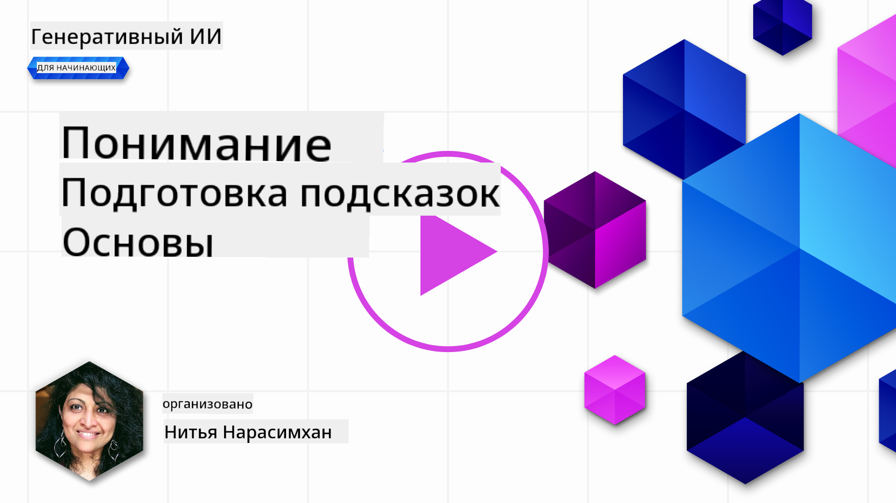
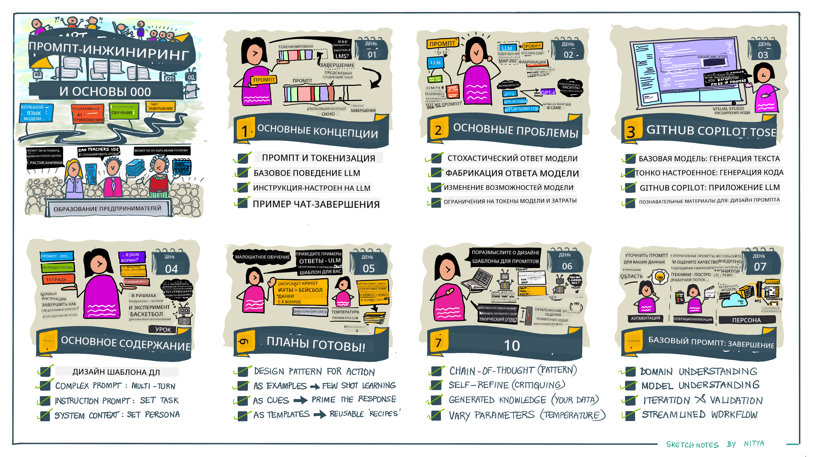
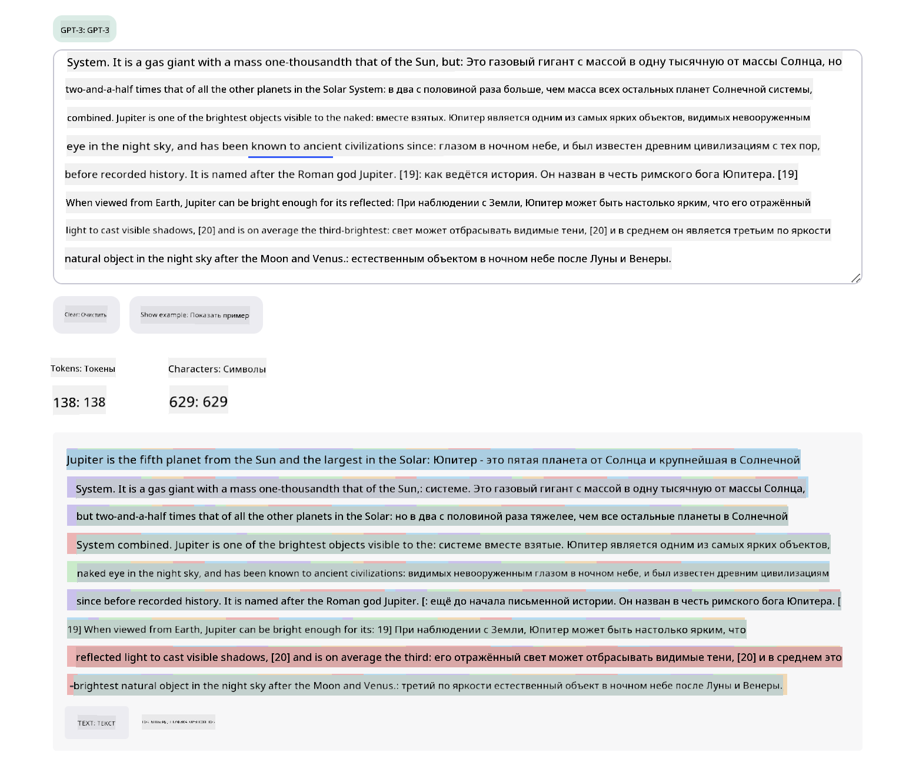
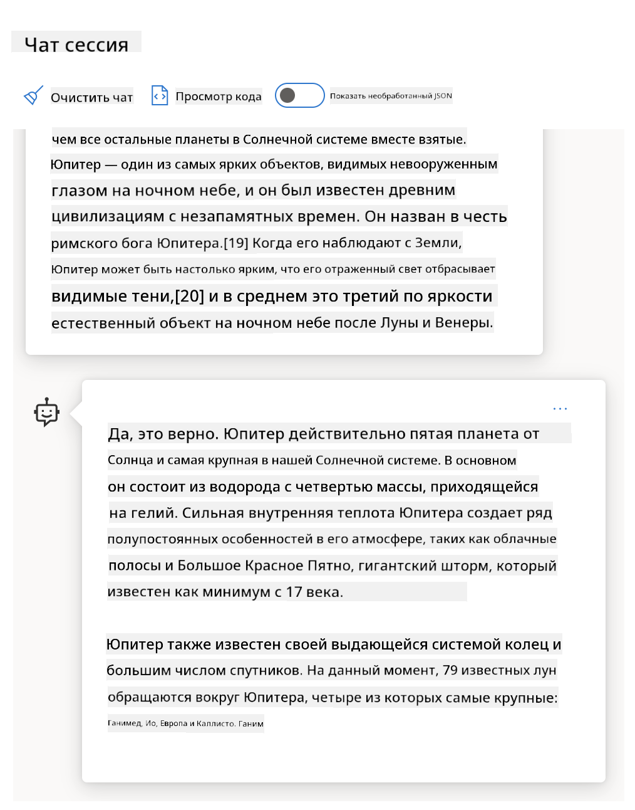
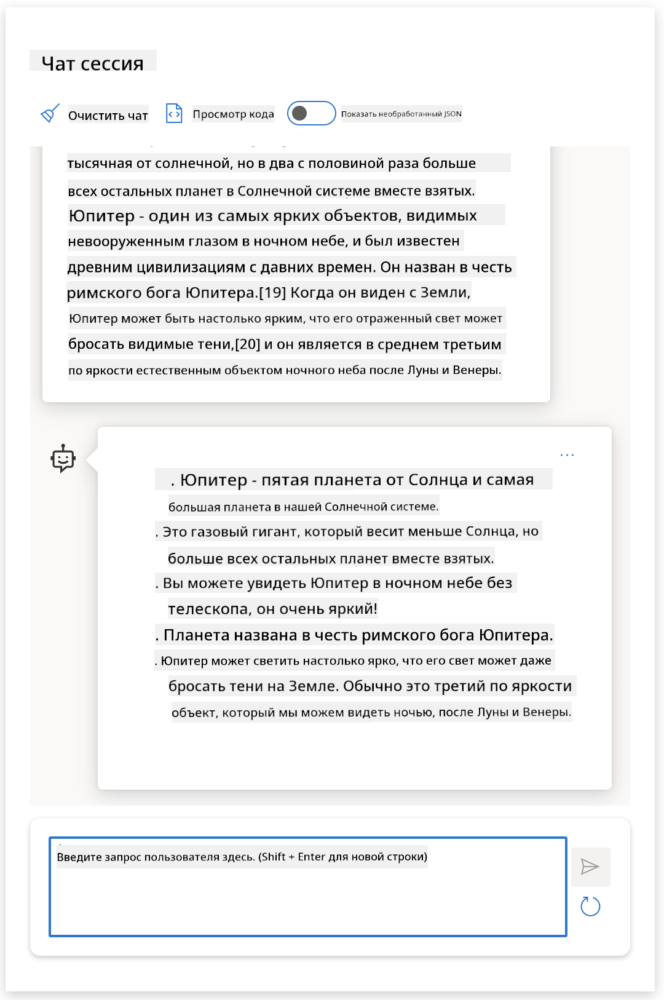
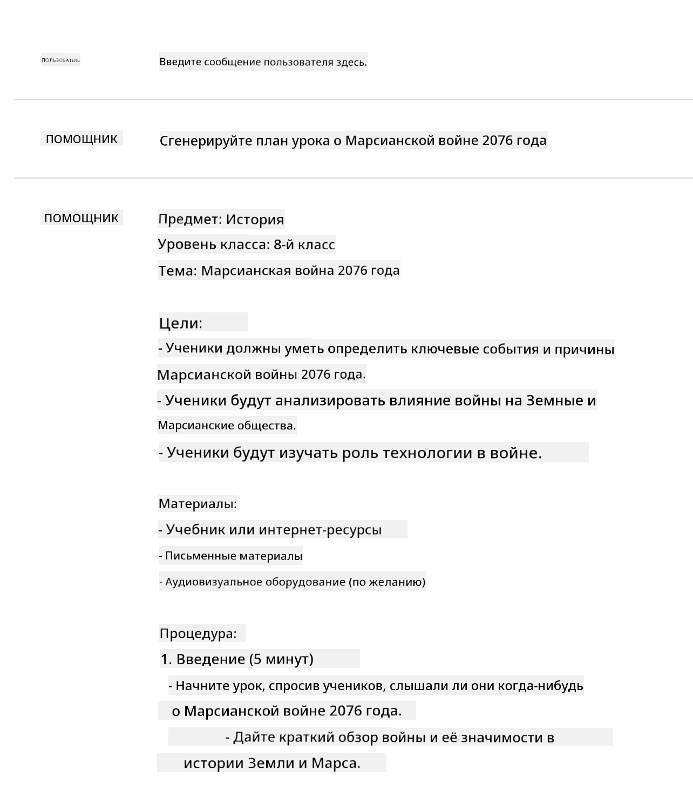
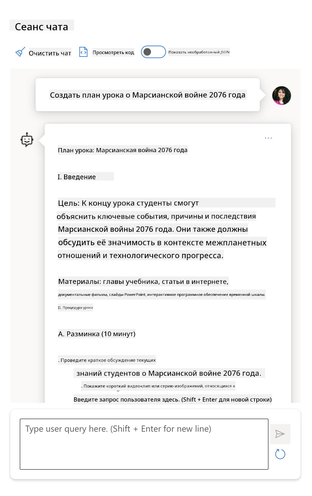
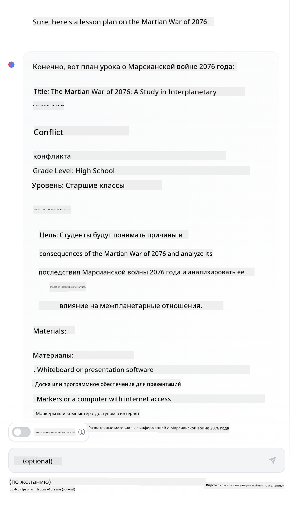

<!--
CO_OP_TRANSLATOR_METADATA:
{
  "original_hash": "a45c318dc6ebc2604f35b8b829f93af2",
  "translation_date": "2025-05-19T14:57:47+00:00",
  "source_file": "04-prompt-engineering-fundamentals/README.md",
  "language_code": "ru"
}
-->
# Основы инженерии подсказок

## Введение

Этот модуль охватывает основные концепции и техники создания эффективных подсказок для генеративных моделей ИИ. Способ написания вашей подсказки для LLM также имеет значение. Тщательно составленная подсказка может обеспечить более качественный ответ. Но что именно означают такие термины, как _подсказка_ и _инженерия подсказок_? И как улучшить ввод подсказки, который я отправляю в LLM? Это вопросы, на которые мы попытаемся ответить в этой и следующей главах.

_Генеративный ИИ_ способен создавать новый контент (например, текст, изображения, аудио, код и т. д.) в ответ на запросы пользователей. Он делает это с помощью _Больших языковых моделей_, таких как серия GPT ("Generative Pre-trained Transformer") от OpenAI, которые обучены использовать естественный язык и код.

Теперь пользователи могут взаимодействовать с этими моделями, используя знакомые парадигмы, такие как чат, без необходимости в технической экспертизе или обучении. Модели основаны на _подсказках_ — пользователи отправляют текстовый ввод (подсказку) и получают ответ ИИ (завершение). Затем они могут "общаться с ИИ" итеративно, в многократных диалогах, уточняя свою подсказку, пока ответ не будет соответствовать их ожиданиям.

"Подсказки" становятся основным _интерфейсом программирования_ для приложений генеративного ИИ, указывая моделям, что делать, и влияя на качество возвращаемых ответов. "Инженерия подсказок" — это быстроразвивающаяся область, изучающая _дизайн и оптимизацию_ подсказок для обеспечения стабильных и качественных ответов в больших масштабах.

## Цели обучения

В этом уроке мы узнаем, что такое инженерия подсказок, почему это важно и как мы можем создавать более эффективные подсказки для конкретной модели и цели приложения. Мы поймем основные концепции и лучшие практики для инженерии подсказок — и узнаем об интерактивной среде "песочницы" Jupyter Notebooks, где эти концепции применяются к реальным примерам.

К концу этого урока мы сможем:

1. Объяснить, что такое инженерия подсказок и почему она важна.
2. Описать компоненты подсказки и как они используются.
3. Изучить лучшие практики и техники для инженерии подсказок.
4. Применить изученные техники на реальных примерах, используя конечную точку OpenAI.

## Основные термины

Инженерия подсказок: Практика разработки и уточнения вводов для направления моделей ИИ к получению желаемых результатов.
Токенизация: Процесс преобразования текста в более мелкие единицы, называемые токенами, которые модель может понять и обработать.
Инструкционно-настроенные LLM: Большие языковые модели (LLM), которые были донастроены с конкретными инструкциями для улучшения точности и релевантности их ответов.

## Учебная песочница

Инженерия подсказок в настоящее время больше искусство, чем наука. Лучший способ улучшить наше интуитивное понимание — это _больше практиковаться_ и применять метод проб и ошибок, который сочетает в себе опыт в области приложений с рекомендованными техниками и оптимизациями, специфичными для модели.

Jupyter Notebook, сопровождающий этот урок, предоставляет _песочницу_, где вы можете попробовать то, что изучаете — по мере прохождения или в рамках кодового вызова в конце. Для выполнения упражнений вам понадобятся:

1. **Ключ API Azure OpenAI** — конечная точка сервиса для развернутой LLM.
2. **Среда выполнения Python** — в которой может быть выполнен Notebook.
3. **Локальные переменные окружения** — _завершите шаги [SETUP](./../00-course-setup/SETUP.md?WT.mc_id=academic-105485-koreyst) сейчас, чтобы подготовиться_.

В блокноте есть начальные упражнения, но вам рекомендуется добавлять свои собственные разделы _Markdown_ (описание) и _Code_ (запросы подсказок), чтобы попробовать больше примеров или идей — и развить интуицию для дизайна подсказок.

## Иллюстрированное руководство

Хотите получить общее представление о том, что охватывает этот урок, прежде чем погрузиться в него? Ознакомьтесь с этим иллюстрированным руководством, которое дает вам представление о главных темах и ключевых выводах, которые стоит обдумать в каждой из них. Дорожная карта урока проведет вас от понимания основных концепций и проблем до их решения с помощью соответствующих техник инженерии подсказок и лучших практик. Обратите внимание, что раздел "Продвинутые техники" в этом руководстве относится к содержанию, охватываемому в следующей главе этой учебной программы.

## Наш стартап

Теперь давайте поговорим о том, как _эта тема_ связана с нашей миссией стартапа по [внедрению инноваций ИИ в образование](https://educationblog.microsoft.com/2023/06/collaborating-to-bring-ai-innovation-to-education?WT.mc_id=academic-105485-koreyst). Мы хотим создавать приложения на базе ИИ для _персонализированного обучения_ — так что давайте подумаем, как разные пользователи нашего приложения могут "создавать" подсказки:

- **Администраторы** могут попросить ИИ _проанализировать данные учебной программы для выявления пробелов в охвате_. ИИ может обобщить результаты или визуализировать их с помощью кода.
- **Педагоги** могут попросить ИИ _создать план урока для целевой аудитории и темы_. ИИ может построить персонализированный план в указанном формате.
- **Студенты** могут попросить ИИ _помочь им в сложной теме_. ИИ теперь может направлять студентов с помощью уроков, подсказок и примеров, адаптированных к их уровню.

Это только верхушка айсберга. Ознакомьтесь с [Подсказками для образования](https://github.com/microsoft/prompts-for-edu/tree/main?WT.mc_id=academic-105485-koreyst) — библиотекой подсказок с открытым исходным кодом, курируемой экспертами в области образования, — чтобы получить более широкое представление о возможностях! _Попробуйте запустить некоторые из этих подсказок в песочнице или с помощью OpenAI Playground, чтобы увидеть, что произойдет!_

## Что такое инженерия подсказок?

Мы начали этот урок с определения **инженерии подсказок** как процесса _дизайна и оптимизации_ текстовых вводов (подсказок) для получения стабильных и качественных ответов (завершений) для конкретной цели приложения и модели. Мы можем рассматривать это как 2-этапный процесс:

- _дизайн_ начальной подсказки для данной модели и цели
- _уточнение_ подсказки итеративно для улучшения качества ответа

Это обязательно процесс проб и ошибок, требующий интуиции и усилий пользователя для достижения оптимальных результатов. Так почему это важно? Чтобы ответить на этот вопрос, сначала нужно понять три концепции:

- _Токенизация_ = как модель "видит" подсказку
- _Базовые LLM_ = как базовая модель "обрабатывает" подсказку
- _Инструкционно-настроенные LLM_ = как модель теперь видит "задачи"

### Токенизация

LLM видит подсказки как _последовательность токенов_, где разные модели (или версии модели) могут токенизировать одну и ту же подсказку по-разному. Поскольку LLM обучены на токенах (а не на исходном тексте), способ токенизации подсказок оказывает прямое влияние на качество сгенерированного ответа.

Чтобы получить интуицию о том, как работает токенизация, попробуйте такие инструменты, как [OpenAI Tokenizer](https://platform.openai.com/tokenizer?WT.mc_id=academic-105485-koreyst), показанный ниже. Скопируйте свою подсказку — и посмотрите, как она преобразуется в токены, обращая внимание на то, как обрабатываются пробелы и знаки препинания. Обратите внимание, что этот пример показывает более старую LLM (GPT-3), поэтому попытка с более новой моделью может дать другой результат.

### Концепция: Базовые модели

После токенизации подсказки основная функция ["Базовой LLM"](https://blog.gopenai.com/an-introduction-to-base-and-instruction-tuned-large-language-models-8de102c785a6?WT.mc_id=academic-105485-koreyst) (или базовой модели) заключается в прогнозировании токена в этой последовательности. Поскольку LLM обучены на огромных текстовых датасетах, они имеют хорошее представление о статистических связях между токенами и могут сделать это предсказание с некоторой уверенностью. Обратите внимание, что они не понимают _значение_ слов в подсказке или токене; они просто видят шаблон, который могут "завершить" своим следующим предсказанием. Они могут продолжать предсказывать последовательность до прерывания пользователем или достижения заранее установленного условия.

Хотите увидеть, как работает завершение на основе подсказок? Введите вышеупомянутую подсказку в [_Chat Playground_](https://oai.azure.com/playground?WT.mc_id=academic-105485-koreyst) Azure OpenAI Studio с настройками по умолчанию. Система настроена на обработку подсказок как запросов на информацию — поэтому вы должны увидеть завершение, которое удовлетворяет этому контексту.

Но что если пользователь хотел бы увидеть что-то конкретное, соответствующее некоторым критериям или цели задачи? Здесь в игру вступают _инструкционно-настроенные_ LLM.

### Концепция: Инструкционно-настроенные LLM

[Инструкционно-настроенная LLM](https://blog.gopenai.com/an-introduction-to-base-and-instruction-tuned-large-language-models-8de102c785a6?WT.mc_id=academic-105485-koreyst) начинается с базовой модели и донастраивается с помощью примеров или пар ввода/вывода (например, многократных "сообщений"), которые могут содержать четкие инструкции — и ответ ИИ пытается следовать этой инструкции.

Это использует такие техники, как обучение с подкреплением с обратной связью от человека (RLHF), которые могут обучить модель _следовать инструкциям_ и _учиться на обратной связи_, чтобы она выдавала ответы, более подходящие для практических приложений и более релевантные целям пользователя.

Давайте попробуем это — пересмотрите вышеупомянутую подсказку, но теперь измените _системное сообщение_, чтобы предоставить следующую инструкцию в качестве контекста:

> _Суммируйте предоставленный вам контент для ученика второго класса. Сохраните результат в одном абзаце с 3-5 пунктами._

Видите, как результат теперь настроен, чтобы отражать желаемую цель и формат? Педагог теперь может напрямую использовать этот ответ в своих слайдах для этого урока.

## Зачем нам нужна инженерия подсказок?

Теперь, когда мы знаем, как подсказки обрабатываются LLM, давайте поговорим о _почему_ нам нужна инженерия подсказок. Ответ кроется в том, что текущие LLM представляют ряд вызовов, которые делают _надежные и стабильные завершения_ более сложными для достижения без усилий в построении и оптимизации подсказок. Например:

1. **Ответы модели стохастичны.** _Одна и та же подсказка_ может давать разные ответы с разными моделями или версиями модели. И она может даже давать разные результаты с _той же моделью_ в разное время. _Техники инженерии подсказок могут помочь нам минимизировать эти вариации, предоставляя лучшие ограничители_.

2. **Модели могут фабриковать ответы.** Модели предварительно обучены на _больших, но конечных_ датасетах, что означает, что они не знают о концепциях за пределами этого обучения. В результате они могут давать завершения, которые являются неточными, вымышленными или прямо противоречат известным фактам. _Техники инженерии подсказок помогают пользователям выявлять и смягчать такие фабрикации, например, запрашивая у ИИ ссылки или обоснования_.

3. **Возможности моделей будут варьироваться.** Новые модели или поколения моделей будут иметь более богатые возможности, но также принесут уникальные особенности и компромиссы в стоимости и сложности. _Инженерия подсказок может помочь нам разработать лучшие практики и рабочие процессы, которые абстрагируют различия и адаптируются к требованиям конкретной модели в масштабируемых, бесшовных способах_.

Давайте посмотрим это в действии в OpenAI или Azure OpenAI Playground:

- Используйте одну и ту же подсказку с разными развертываниями LLM (например, OpenAI, Azure OpenAI, Hugging Face) — видели ли вы вариации?
- Используйте одну и ту же подсказку несколько раз с _одним и тем же_ развертыванием LLM (например, Azure OpenAI Playground) — как эти вариации отличались?

### Пример фабрикаций

В этом курсе мы используем термин **"фабрикация"** для обозначения явления, когда LLM иногда генерируют фактически некорректную информацию из-за ограничений в их обучении или других ограничений. Вы могли также слышать, как это называют _"галлюцинациями"_ в популярных статьях или научных работах. Однако мы настоятельно рекомендуем использовать термин _"фабрикация"_, чтобы случайно не очеловечить поведение, приписывая человеческую черту машинному результату. Это также подкрепляет [принципы ответственного ИИ](https://www.microsoft.com/ai/responsible-ai?WT.mc_id=academic-105485-koreyst) с точки зрения терминологии, исключая термины, которые также могут считаться оскорбительными или неинклюзивными в некоторых контекстах.

Хотите понять, как работают фабрикации? Придумайте подсказку, которая инструктирует ИИ сгенерировать контент для несуществующей темы (чтобы убедиться, что она не найдена в обучающем датасете). Например, я попробовал эту подсказку:

> **Подсказка:** создайте план урока о Марсианской войне 2076 года.

Поиск в интернете показал мне, что были вымышленные повествования (например, телесериалы или книги) о марсианских войнах — но ни одной в 2076 году. Здравый смысл также подсказывает нам, что 2076 год _в будущем_ и, следовательно, не может быть связан с реальным событием.

Так что же происходит, когда мы запускаем эту подсказку с разными провайдерами LLM?

> **Ответ 1**: OpenAI Playground (GPT-35)

> **Ответ 2**: Azure OpenAI Playground (GPT-35)

> **Ответ 3**: Hugging Face Chat Playground (LLama-2)

Как и ожидалось, каждая модель (или версия модели) выдает слегка разные ответы благодаря стохастическому поведению и вариациям в возможностях модели. Например, одна модель ориентируется на аудиторию 8-го класса, в то время как другая предполагает учащихся старших классов. Но все три модели действительно сгенерировали ответы, которые могли бы убедить неосведомленного пользователя, что событие было реальным.

Техники инженерии подсказок, такие как _метаподсказки_ и _настройка температуры_, могут уменьшить фабрикации модели до некоторой степени. Новые _архитектуры_ инженерии подсказок также включают новые инструменты и техники бесшовно в поток подсказок, чтобы смягчить или уменьшить некоторые из этих эффектов.

## Исследование случая: GitHub Copilot

Давайте завершим этот раздел, получив представление о том, как инженерия подсказок используется в реальных решениях, рассмотрев один случай: [GitHub Copilot](https://github.com/features/copilot?WT.mc_id=academic-105485-koreyst).

GitHub Copilot — это ваш "Партнер-программист на базе ИИ" — он преобразует текстовые подсказки в завершения кода и интегрируется в вашу среду разработки (например, Visual Studio Code) для бесшовного пользовательского опыта. Как задокументировано в
Наконец, настоящая ценность шаблонов заключается в возможности создавать и публиковать _библиотеки подсказок_ для вертикальных областей применения, где шаблон подсказки теперь _оптимизирован_ для отражения контекста или примеров, специфичных для приложения, что делает ответы более релевантными и точными для целевой аудитории пользователей. Репозиторий [Prompts For Edu](https://github.com/microsoft/prompts-for-edu?WT.mc_id=academic-105485-koreyst) является отличным примером такого подхода, собирая библиотеку подсказок для образовательной области с акцентом на ключевые цели, такие как планирование уроков, разработка учебных программ, обучение студентов и т.д.

## Поддерживающий контент

Если мы рассматриваем создание подсказки как инструкцию (задачу) и цель (основной контент), то _вторичный контент_ - это дополнительный контекст, который мы предоставляем, чтобы **влиять на результат каким-то образом**. Это могут быть параметры настройки, инструкции по форматированию, таксономии тем и т.д., которые помогают модели _адаптировать_ свой ответ, чтобы он соответствовал желаемым целям или ожиданиям пользователя.

Например: Дано учебное расписание с обширными метаданными (название, описание, уровень, метки, преподаватель и т.д.) по всем доступным курсам в учебной программе:

- мы можем определить инструкцию "суммировать учебное расписание на осень 2023 года"
- мы можем использовать основной контент, чтобы предоставить несколько примеров желаемого результата
- мы можем использовать вторичный контент, чтобы определить топ-5 "меток" интереса.

Теперь модель может предоставить резюме в формате, показанном в нескольких примерах, но если результат имеет несколько меток, она может приоритизировать 5 меток, определенных во вторичном контенте.

---

<!--
ШАБЛОН УРОКА:
Этот раздел должен охватывать основную концепцию #1.
Укрепите концепцию примерами и ссылками.

КОНЦЕПЦИЯ #3:
Техники инженерии подсказок.
Какие основные техники инженерии подсказок существуют?
Продемонстрируйте их с помощью упражнений.
-->

## Лучшие практики создания подсказок

Теперь, когда мы знаем, как могут быть _созданы_ подсказки, мы можем начать думать о том, как _спроектировать_ их, чтобы они отражали лучшие практики. Мы можем рассматривать это в двух частях - иметь правильный _подход_ и применять правильные _техники_.

### Подход к инженерии подсказок

Инженерия подсказок - это процесс проб и ошибок, поэтому держите в уме три широких руководящих фактора:

1. **Понимание домена имеет значение.** Точность и релевантность ответа зависят от _домена_, в котором работает это приложение или пользователь. Применяйте свою интуицию и экспертные знания в домене, чтобы **дальше настраивать техники**. Например, определите _персональности, специфичные для домена_ в системных подсказках или используйте _шаблоны, специфичные для домена_ в пользовательских подсказках. Предоставляйте вторичный контент, который отражает контексты, специфичные для домена, или используйте _подсказки и примеры, специфичные для домена_, чтобы направить модель к знакомым шаблонам использования.

2. **Понимание модели имеет значение.** Мы знаем, что модели по своей природе стохастичны. Но реализации моделей также могут различаться в зависимости от используемого набора данных для обучения (предварительно обученные знания), возможностей, которые они предоставляют (например, через API или SDK), и типа контента, для которого они оптимизированы (например, код против изображений против текста). Понимайте сильные и слабые стороны модели, которую вы используете, и используйте эти знания, чтобы _приоритизировать задачи_ или создавать _кастомизированные шаблоны_, которые оптимизированы для возможностей модели.

3. **Итерация и валидация имеют значение.** Модели быстро развиваются, и техники инженерии подсказок тоже. Как эксперт в домене, у вас могут быть другие контексты или критерии для _вашего_ конкретного приложения, которые могут не применяться к более широкой сообществу. Используйте инструменты и техники инженерии подсказок, чтобы "стартовать" создание подсказок, затем итерационно проверяйте результаты, используя свою интуицию и экспертные знания в домене. Записывайте свои инсайты и создавайте **базу знаний** (например, библиотеки подсказок), которая может использоваться другими как новая основа для более быстрых итераций в будущем.

## Лучшие практики

Теперь давайте рассмотрим общие лучшие практики, которые рекомендуют специалисты [OpenAI](https://help.openai.com/en/articles/6654000-best-practices-for-prompt-engineering-with-openai-api?WT.mc_id=academic-105485-koreyst) и [Azure OpenAI](https://learn.microsoft.com/azure/ai-services/openai/concepts/prompt-engineering#best-practices?WT.mc_id=academic-105485-koreyst).

| Что                              | Почему                                                                                                                                                                                                                                               |
| :-------------------------------- | :------------------------------------------------------------------------------------------------------------------------------------------------------------------------------------------------------------------------------------------------ |
| Оцените последние модели.       | Новые поколения моделей, вероятно, будут иметь улучшенные функции и качество, но могут также вызвать более высокие затраты. Оцените их влияние, затем принимайте решения о миграции.                                                                                |
| Разделяйте инструкции и контекст   | Проверьте, определяет ли ваша модель/поставщик _разделители_, чтобы более четко различать инструкции, основной и вторичный контент. Это может помочь моделям более точно назначать веса токенам.                                                         |
| Будьте конкретными и ясными             | Дайте больше деталей о желаемом контексте, результате, длине, формате, стиле и т.д. Это улучшит как качество, так и консистентность ответов. Захватывайте рецепты в повторно используемых шаблонах.                                                          |
| Будьте описательными, используйте примеры      | Модели могут лучше реагировать на подход "показать и рассказать". Начните с `zero-shot` approach where you give it an instruction (but no examples) then try `few-shot` as a refinement, providing a few examples of the desired output. Use analogies. |
| Use cues to jumpstart completions | Nudge it towards a desired outcome by giving it some leading words or phrases that it can use as a starting point for the response.                                                                                                               |
| Double Down                       | Sometimes you may need to repeat yourself to the model. Give instructions before and after your primary content, use an instruction and a cue, etc. Iterate & validate to see what works.                                                         |
| Order Matters                     | The order in which you present information to the model may impact the output, even in the learning examples, thanks to recency bias. Try different options to see what works best.                                                               |
| Give the model an “out”           | Give the model a _fallback_ completion response it can provide if it cannot complete the task for any reason. This can reduce chances of models generating false or fabricated responses.                                                         |
|                                   |                                                                                                                                                                                                                                                   |

As with any best practice, remember that _your mileage may vary_ based on the model, the task and the domain. Use these as a starting point, and iterate to find what works best for you. Constantly re-evaluate your prompt engineering process as new models and tools become available, with a focus on process scalability and response quality.

<!--
LESSON TEMPLATE:
This unit should provide a code challenge if applicable

CHALLENGE:
Link to a Jupyter Notebook with only the code comments in the instructions (code sections are empty).

SOLUTION:
Link to a copy of that Notebook with the prompts filled in and run, showing what one example could be.
-->

## Assignment

Congratulations! You made it to the end of the lesson! It's time to put some of those concepts and techniques to the test with real examples!

For our assignment, we'll be using a Jupyter Notebook with exercises you can complete interactively. You can also extend the Notebook with your own Markdown and Code cells to explore ideas and techniques on your own.

### To get started, fork the repo, then

- (Recommended) Launch GitHub Codespaces
- (Alternatively) Clone the repo to your local device and use it with Docker Desktop
- (Alternatively) Open the Notebook with your preferred Notebook runtime environment.

### Next, configure your environment variables

- Copy the `.env.copy` file in repo root to `.env` and fill in the `AZURE_OPENAI_API_KEY`, `AZURE_OPENAI_ENDPOINT` and `AZURE_OPENAI_DEPLOYMENT` значений. Вернитесь к [разделу Learning Sandbox](../../../04-prompt-engineering-fundamentals/04-prompt-engineering-fundamentals), чтобы узнать больше.

### Далее, откройте Jupyter Notebook

- Выберите ядро выполнения. Если используете опции 1 или 2, просто выберите стандартное ядро Python 3.10.x, предоставляемое контейнером разработки.

Вы готовы выполнить упражнения. Обратите внимание, что здесь нет _правильных и неправильных_ ответов - просто исследуйте варианты методом проб и ошибок и создавайте интуицию о том, что работает для данной модели и области приложения.

_По этой причине в этом уроке нет сегментов с решениями кода. Вместо этого в Notebook будут ячейки Markdown с названием "Мое решение:", которые показывают один пример результата для справки._

 <!--
ШАБЛОН УРОКА:
Заключите раздел резюме и ресурсами для самостоятельного обучения.
-->

## Проверка знаний

Какой из следующих вариантов является хорошей подсказкой, следуя некоторым разумным лучшим практикам?

1. Покажи мне изображение красной машины
2. Покажи мне изображение красной машины марки Volvo и модели XC90, припаркованной у обрыва на фоне заходящего солнца
3. Покажи мне изображение красной машины марки Volvo и модели XC90

Ответ: 2, это лучшая подсказка, так как она предоставляет детали о "чем" и уточняет (не просто любая машина, а конкретная марка и модель), а также описывает общую обстановку. 3 - следующий лучший вариант, так как он также содержит много описаний.

## 🚀 Задача

Посмотрите, сможете ли вы использовать технику "подсказки" с подсказкой: Закончите предложение "Покажи мне изображение красной машины марки Volvo и ". Что он ответит, и как бы вы это улучшили?

## Отличная работа! Продолжайте обучение

Хотите узнать больше о различных концепциях инженерии подсказок? Перейдите на [страницу продолженного обучения](https://aka.ms/genai-collection?WT.mc_id=academic-105485-koreyst), чтобы найти другие отличные ресурсы по этой теме.

Перейдите к Уроку 5, где мы рассмотрим [продвинутые техники подсказок](../05-advanced-prompts/README.md?WT.mc_id=academic-105485-koreyst)!

**Отказ от ответственности**:  
Этот документ был переведен с помощью сервиса автоматического перевода [Co-op Translator](https://github.com/Azure/co-op-translator). Мы стремимся к точности, однако, пожалуйста, учтите, что автоматические переводы могут содержать ошибки или неточности. Оригинальный документ на его родном языке следует считать авторитетным источником. Для критически важной информации рекомендуется профессиональный перевод человеком. Мы не несем ответственности за любые недоразумения или неправильные толкования, возникающие в результате использования этого перевода.