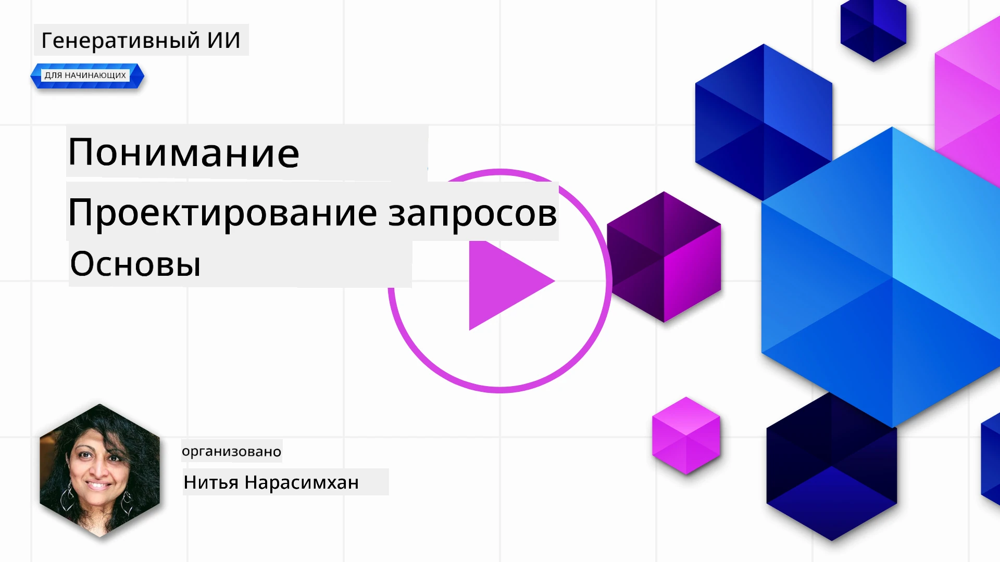
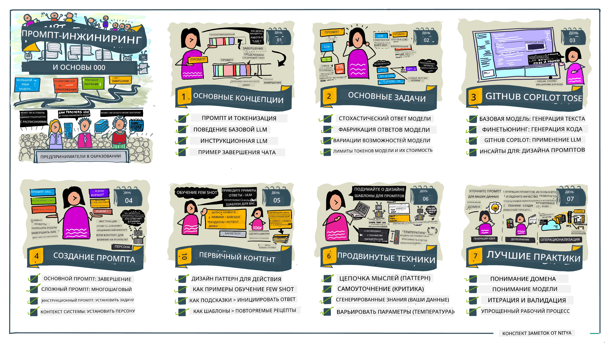
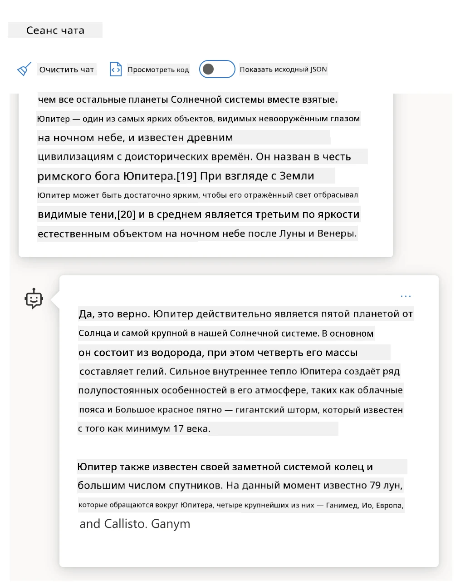
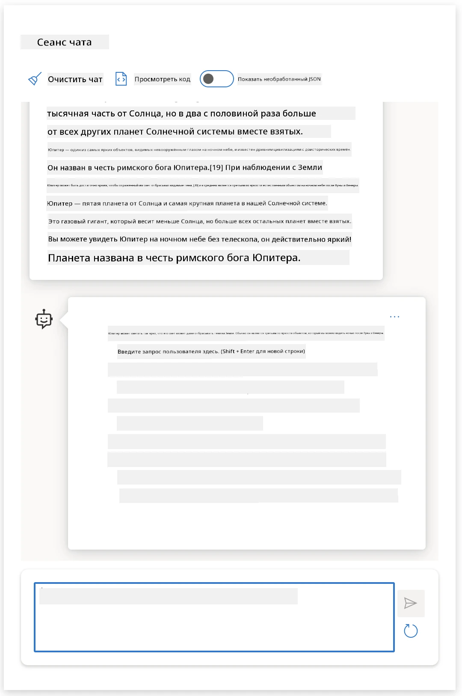
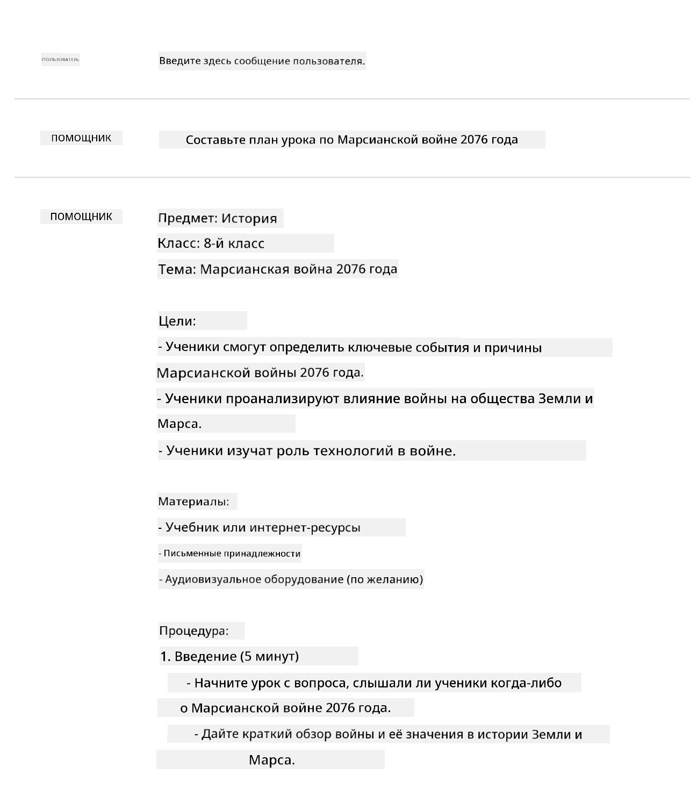
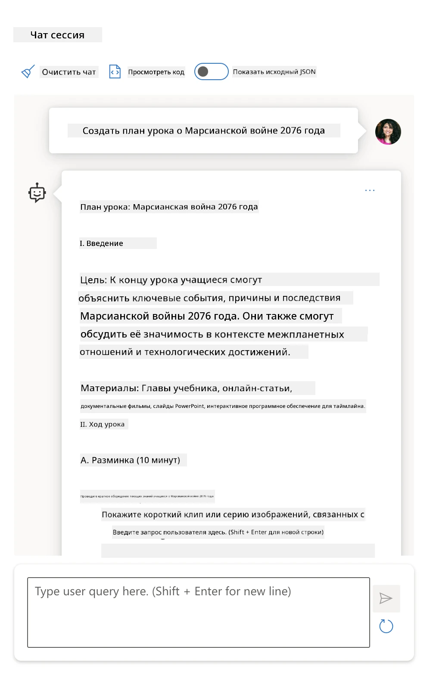
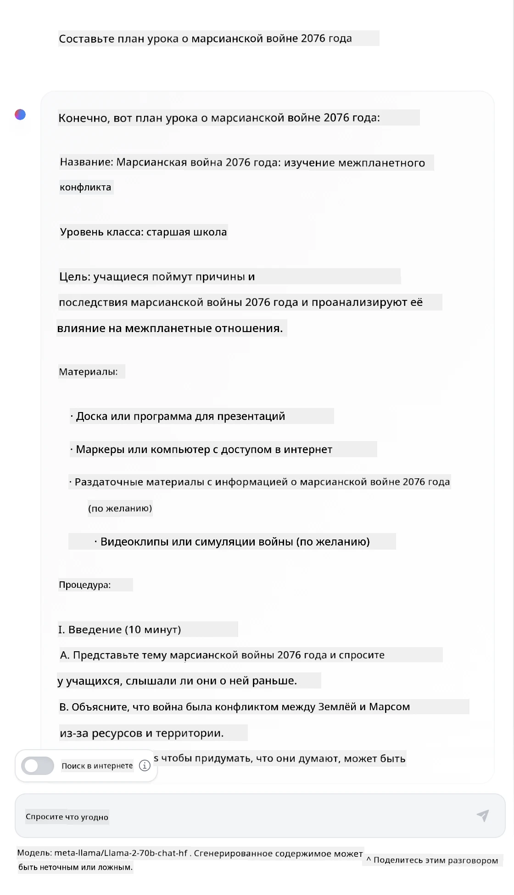

# Основы проектирования промптов

[](https://youtu.be/GElCu2kUlRs?si=qrXsBvXnCW12epb8)

## Введение
Этот модуль охватывает основные концепции и методы создания эффективных промптов для генеративных моделей ИИ. Важно, каким образом вы формулируете свой промпт для LLM. Тщательно продуманный промпт способен обеспечить лучший качество ответа. Но что именно означают такие термины, как _промпт_ и _проектирование промптов_? И как улучшить _входной_ промпт, который я отправляю в LLM? На эти вопросы мы постараемся ответить в этой и следующей главе.

_Генеративный ИИ_ способен создавать новый контент (например, текст, изображения, аудио, код и пр.) в ответ на запросы пользователя. Это достигается с помощью _Больших языковых моделей_ (LLM), таких как серия GPT от OpenAI («Generative Pre-trained Transformer»), обученных работе с естественным языком и кодом.

Теперь пользователи могут взаимодействовать с этими моделями, используя знакомые интерфейсы, например чат, без необходимости в технических знаниях или обучении. Модели работают на основе _промптов_ — пользователь отправляет текстовый ввод (промпт) и получает ответ ИИ (завершение). Затем они могут «общаться с ИИ» итеративно, в многоходовых диалогах, уточняя промпт, пока ответ не удовлетворит их ожидания.

«Промпты» теперь становятся основным _программным интерфейсом_ для приложений генеративного ИИ, задавая моделям, что делать, и влияя на качество возвращаемых ответов. «Проектирование промптов» — быстро развивающаяся область, которая фокусируется на _разработке и оптимизации_ промптов для достижения стабильных и качественных ответов в масштабе.

## Цели обучения

В этом уроке мы узнаем, что такое проектирование промптов, почему это важно, и как создавать более эффективные промпты для конкретной модели и задачи. Мы поймём основные концепции и лучшие практики проектирования промптов — а также познакомимся с интерактивной средой Jupyter Notebooks, где эти концепции применяются на реальных примерах.

К концу урока мы сможем:

1. Объяснить, что такое проектирование промптов и почему это важно.
2. Описать компоненты промпта и их использование.
3. Изучить лучшие практики и методы проектирования промптов.
4. Применять изученные техники на реальных примерах с использованием OpenAI endpoint.

## Ключевые термины

Проектирование промптов: Практика разработки и улучшения входных данных для того, чтобы направлять модели ИИ к получению желаемых результатов.
Токенизация: Процесс преобразования текста в более мелкие единицы — токены, которые модель может понимать и обрабатывать.
Инструкция-обученные LLM: Большие языковые модели, дообученные на конкретных инструкциях для повышения точности и релевантности ответов.

## Песочница для обучения

Проектирование промптов сейчас скорее искусство, чем наука. Лучший способ улучшить интуицию — _практиковаться больше_ и использовать метод проб и ошибок, сочетая опыт из области применения с рекомендованными методиками и оптимизациями для конкретных моделей.

Сопровождающий этот урок Jupyter Notebook предоставляет _песочницу_, где вы можете сразу применить изученное — по ходу урока или в рамках итогового задания. Для выполнения упражнений вам понадобится:

1. **Ключ API Azure OpenAI** — сервисная точка для развернутой LLM.
2. **Python среда выполнения** — для запуска ноутбука.
3. **Локальные переменные окружения** — _завершите шаги [SETUP](./../00-course-setup/02-setup-local.md?WT.mc_id=academic-105485-koreyst) прямо сейчас для подготовки_.

В ноутбуке есть _стартовые_ упражнения, но вы можете добавлять свои собственные разделы с _Markdown_ (описания) и _Code_ (запросы промптов), чтобы попробовать больше примеров и развить интуицию проектирования промптов.

## Иллюстрированное руководство

Хотите получить общее представление о том, что охватывает этот урок, прежде чем углубляться? Посмотрите это иллюстрированное руководство, которое даёт ощущение основных тем и ключевых выводов для размышления по каждой из них. Дорожная карта занятия ведёт вас от понимания ключевых концепций и проблем к их решению с помощью соответствующих техник проектирования промптов и лучших практик. Обратите внимание, что раздел «Продвинутые техники» относится к материалам _следующей_ главы этой учебной программы.



## Наш стартап

Теперь давайте поговорим, как _эта тема_ связана с миссией нашего стартапа, который направлен на [привнесение инноваций ИИ в образование](https://educationblog.microsoft.com/2023/06/collaborating-to-bring-ai-innovation-to-education?WT.mc_id=academic-105485-koreyst). Мы хотим создавать приложения с ИИ для _персонализированного обучения_ — поэтому давайте подумаем, как разные пользователи нашего приложения могут «проектировать» промпты:

- **Администраторы** могут попросить ИИ _проанализировать данные учебной программы, чтобы выявить пробелы в покрытии_. ИИ может сделать сводку результатов или визуализировать их с помощью кода.
- **Преподаватели** могут попросить ИИ _сгенерировать план урока для целевой аудитории и темы_. ИИ может создать персонализированный план в заданном формате.
- **Студенты** могут попросить ИИ _помочь им с трудным предметом_. Теперь ИИ может направлять студентов с уроками, подсказками и примерами, адаптированными к их уровню.

Это только начало. Ознакомьтесь с [Prompts For Education](https://github.com/microsoft/prompts-for-edu/tree/main?WT.mc_id=academic-105485-koreyst) — открытой библиотекой промптов, составленной экспертами по образованию, чтобы получить шире представление о возможностях! _Попробуйте выполнить некоторые из этих промптов в песочнице или в OpenAI Playground и посмотрите, что получится!_

<!--
LESSON TEMPLATE:
This unit should cover core concept #1.
Reinforce the concept with examples and references.

CONCEPT #1:
Prompt Engineering.
Define it and explain why it is needed.
-->

## Что такое проектирование промптов?

Мы начали урок с определения **проектирования промптов** как процесса _создания и оптимизации_ текстовых вводов (промптов) для достижения стабильных и качественных ответов (завершений) для заданной задачи и модели. Это можно представить как двухэтапный процесс:

- _создание_ первоначального промпта для данной модели и задачи
- _постепенное уточнение_ промпта для повышения качества ответа

Это, по сути, процесс проб и ошибок, требующий интуиции пользователя и усилий для достижения оптимальных результатов. И почему это важно? Чтобы ответить на этот вопрос, сначала нужно понять три понятия:

- _Токенизация_ = как модель «видит» промпт
- _Базовые LLM_ = как основная модель «обрабатывает» промпт
- _Инструкция-обученные LLM_ = как модель теперь может воспринимать «задачи»

### Токенизация

LLM воспринимает промпты как _последовательность токенов_, при этом разные модели (или версии модели) могут по-разному токенизировать один и тот же промпт. Поскольку LLM обучаются на токенах (а не на сыром тексте), способ токенизации промптов непосредственно влияет на качество сгенерированного ответа.

Чтобы получить интуицию о том, как работает токенизация, попробуйте инструменты вроде [OpenAI Tokenizer](https://platform.openai.com/tokenizer?WT.mc_id=academic-105485-koreyst), показанный ниже. Вставьте сюда свой промпт — и посмотрите, как он преобразуется в токены, обращая внимание на обработку пробелов и пунктуации. Обратите внимание: на примере показана более старая модель LLM (GPT-3), так что при использовании более новой модели результат может отличаться.


### Концепция: базовые модели

После токенизации промпта основная задача ["Базовой LLM"](https://blog.gopenai.com/an-introduction-to-base-and-instruction-tuned-large-language-models-8de102c785a6?WT.mc_id=academic-105485-koreyst) (или фундаментальной модели) — предсказать следующий токен в последовательности. Поскольку LLM обучаются на огромных текстовых датасетах, они хорошо понимают статистические связи между токенами и могут с уверенностью делать прогнозы. Учтите, что они _не понимают смысл_ слов в промпте или токене; они просто видят шаблон, который могут «дополнить» своим следующим предсказанием. Они могут продолжать предсказывать последовательность, пока процесс не будет остановлен пользователем или достижением условия завершения.

Хотите увидеть, как работает дополнение на основе промпта? Введите указанный выше промпт в Azure OpenAI Studio [_Chat Playground_](https://oai.azure.com/playground?WT.mc_id=academic-105485-koreyst) с настройками по умолчанию. Система настроена воспринимать промпты как запросы информации — вы должны получить ответ, соответствующий этому контексту.

Но что если пользователь хотел увидеть что-то конкретное, соответствующее каким-то критериям или цели задачи? Здесь на помощь приходят _инструкция-обученные_ LLM.



### Концепция: инструкция-обученные LLM

[Инструкция-обученная LLM](https://blog.gopenai.com/an-introduction-to-base-and-instruction-tuned-large-language-models-8de102c785a6?WT.mc_id=academic-105485-koreyst) начинается с фундаментальной модели, дообученной на примерах или парах вход/выход (например, многоходовые «сообщения»), которые содержат чёткие инструкции, а ответ ИИ пытается следовать этим инструкциям.

Для этого используются методы обучения с подкреплением с человеческой обратной связью (RLHF), которые учат модель _следовать инструкциям_ и _обучаться на обратной связи_, обеспечивая более пригодные для практических задач и более релевантные ответы.

Давайте попробуем — вернитесь к вышеуказанному промпту, но теперь поменяйте _системное сообщение_, добавив следующую инструкцию в качестве контекста:

> _Сделайте краткое изложение предоставленного материала для ученика второго класса. Держите результат в одном абзаце с 3-5 пунктами._

Видите, как результат теперь соответствует заданной цели и формату? Преподаватель может напрямую использовать этот ответ в своих слайдах для урока.



## Почему нам нужно проектирование промптов?

Теперь, когда мы понимаем, как модели обрабатывают промпты, поговорим о том, _почему_ нам нужно проектировать промпты. Ответ заключается в том, что современные LLM сталкиваются с рядом проблем, которые затрудняют получение _надёжных и последовательных ответов_ без усилий по построению и оптимизации промптов. Например:

1. **Ответы модели стохастичны.** _Один и тот же промпт_ вероятно приведёт к разным ответам на разных моделях или версиях. И он может даже генерировать разные ответы с _одной и той же моделью_ в разное время. _Методы проектирования промптов помогают минимизировать эти вариации, обеспечивая лучшие границы_.

1. **Модели могут выдумывать ответы.** Модели обучаются на _больших, но конечных_ датасетах, и не знают о понятиях вне зоны обучения. В результате они могут создавать неточные, вымышленные или прямо противоречащие фактам ответы. _Проектирование промптов помогает пользователям выявлять и снижать такие выдумки, например, запрашивая у ИИ ссылки или логику_.

1. **Возможности моделей различаются.** Новые модели или поколения моделей обладают более широкими возможностями, но при этом имеют уникальные особенности и разные затраты на использование. _Проектирование промптов позволяет разрабатывать лучшие практики и рабочие процессы, которые абстрагируют эти различия и адаптируются к требованиям конкретной модели в масштабируемом и бесшовном виде_.

Давайте посмотрим на это в действии в OpenAI или Azure OpenAI Playground:

- Используйте один и тот же промпт с развернутыми разными LLM (например, OpenAI, Azure OpenAI, Hugging Face) — заметили ли вы различия?
- Используйте один и тот же промпт несколько раз с _одним_ развернутым LLM (например, в Azure OpenAI playground) — чем отличались эти вариации?

### Пример выдумок

В этом курсе мы используем термин **«выдумка»** для обозначения явления, когда LLM иногда генерируют фактически неверную информацию из-за ограничений обучения или других факторов. Возможно, вы слышали это под названием _«галлюцинации»_ в популярных статьях или научных публикациях. Однако мы настоятельно рекомендуем использовать термин _«выдумка»_, чтобы избежать антропоморфизации поведения — приписывания машине человеческих черт. Это также поддерживает [Руководство по ответственному ИИ](https://www.microsoft.com/ai/responsible-ai?WT.mc_id=academic-105485-koreyst) с точки зрения терминологии, исключая слова, которые могут быть сочтены оскорбительными или неинклюзивными.

Хотите понять, как работают выдумки? Подумайте о промпте, который просит ИИ создать контент по несуществующей теме (чтобы гарантировать, что её нет в обучающем датасете). Например — я попробовал такой промпт:

> **Промпт:** создать план урока о Марсианской войне 2076 года.
Веб-поиск показал, что существовали вымышленные рассказы (например, телесериалы или книги) о марсианских войнах — но ни одной в 2076 году. Здравый смысл также подсказывает, что 2076 год — это _будущее_, и, следовательно, не может быть связан с реальным событием.

Итак, что происходит, когда мы запускаем этот запрос с разными провайдерами LLM?

> **Ответ 1**: OpenAI Playground (GPT-35)



> **Ответ 2**: Azure OpenAI Playground (GPT-35)



> **Ответ 3**: : Hugging Face Chat Playground (LLama-2)



Как и ожидалось, каждая модель (или версия модели) создает немного разные ответы благодаря стохастическому поведению и вариациям возможностей модели. Например, одна модель ориентирована на аудиторию 8-го класса, тогда как другая предполагает, что пользователь — школьник старших классов. Но все три модели генерировали ответы, которые могли убедить неискушенного пользователя в реальности события.

Методы конструирования запросов, такие как _метазапросы_ и _настройка температуры_, могут в некоторой степени снизить выдумки модели. Новые _архитектуры_ конструирования запросов также бесшовно интегрируют новые инструменты и приемы в поток запроса, чтобы смягчить или уменьшить некоторые из этих эффектов.

## Кейс: GitHub Copilot

Завершим этот раздел, посмотрев, как конструирование запросов используется в реальных решениях, рассмотрев один Кейс: [GitHub Copilot](https://github.com/features/copilot?WT.mc_id=academic-105485-koreyst).

GitHub Copilot — ваш «ИИ-партнер по программированию»: он преобразует текстовые запросы в дополнения кода и интегрирован в вашу среду разработки (например, Visual Studio Code) для бесшовного пользовательского опыта. Как задокументировано в серии блогов ниже, первая версия была основана на модели OpenAI Codex — при этом инженеры быстро поняли необходимость точной настройки модели и разработки лучших техник конструирования запросов для улучшения качества кода. В июле они [представили улучшенную ИИ-модель, которая превосходит Codex](https://github.blog/2023-07-28-smarter-more-efficient-coding-github-copilot-goes-beyond-codex-with-improved-ai-model/?WT.mc_id=academic-105485-koreyst) и предлагает еще более быстрые предложения.

Читайте посты по порядку, чтобы проследить их путь обучения.

- **Май 2023** | [GitHub Copilot становится лучше в понимании вашего кода](https://github.blog/2023-05-17-how-github-copilot-is-getting-better-at-understanding-your-code/?WT.mc_id=academic-105485-koreyst)
- **Май 2023** | [Внутри GitHub: работа с LLM за GitHub Copilot](https://github.blog/2023-05-17-inside-github-working-with-the-llms-behind-github-copilot/?WT.mc_id=academic-105485-koreyst)
- **Июн 2023** | [Как писать лучшие запросы для GitHub Copilot](https://github.blog/2023-06-20-how-to-write-better-prompts-for-github-copilot/?WT.mc_id=academic-105485-koreyst)
- **Июл 2023** | [GitHub Copilot превосходит Codex с улучшенной ИИ-моделью](https://github.blog/2023-07-28-smarter-more-efficient-coding-github-copilot-goes-beyond-codex-with-improved-ai-model/?WT.mc_id=academic-105485-koreyst)
- **Июл 2023** | [Руководство разработчика по конструированию запросов и LLM](https://github.blog/2023-07-17-prompt-engineering-guide-generative-ai-llms/?WT.mc_id=academic-105485-koreyst)
- **Сен 2023** | [Как создать корпоративное приложение на LLM: уроки GitHub Copilot](https://github.blog/2023-09-06-how-to-build-an-enterprise-llm-application-lessons-from-github-copilot/?WT.mc_id=academic-105485-koreyst)

Вы также можете просмотреть их [Инженерный блог](https://github.blog/category/engineering/?WT.mc_id=academic-105485-koreyst) для других подобных публикаций, например [этой](https://github.blog/2023-09-27-how-i-used-github-copilot-chat-to-build-a-reactjs-gallery-prototype/?WT.mc_id=academic-105485-koreyst), которая демонстрирует, как эти модели и методы _применяются_ для разработки реальных приложений.

---

<!--
ШАБЛОН УРОКА:
Этот модуль должен охватить ключевой концепт #2.
Укрепить концепт примерами и ссылками.

КОНЦЕПТ #2:
Конструирование запросов.
Иллюстрируется примерами.
-->

## Построение запроса

Мы поняли, почему важно конструирование запросов — теперь давайте разберемся, как именно _строятся_ запросы, чтобы мы могли оценивать различные техники для более эффективного проектирования запросов.

### Базовый запрос

Начнем с базового запроса: текстовый ввод, отправляемый модели без дополнительного контекста. Вот пример — когда мы отправляем первые несколько слов национального гимна США в OpenAI [Completion API](https://platform.openai.com/docs/api-reference/completions?WT.mc_id=academic-105485-koreyst), он мгновенно _дополняет_ ответ следующими несколькими строками, демонстрируя базовое поведение предсказания.

| Запрос (Ввод)       | Дополнение (Вывод)                                                                                                                        |
| :----------------- | :----------------------------------------------------------------------------------------------------------------------------------------- |
| Oh say can you see | Похоже, вы начинаете текст песни "The Star-Spangled Banner" — национального гимна США. Полный текст выглядит так ... |

### Сложный запрос

Теперь добавим контекст и инструкции к этому базовому запросу. [Chat Completion API](https://learn.microsoft.com/azure/ai-services/openai/how-to/chatgpt?WT.mc_id=academic-105485-koreyst) позволяет строить сложный запрос в виде набора _сообщений_ с:

- парами вход/выход, отражающими ввод _пользователя_ и ответ _ассистента_.
- системным сообщением, задающим контекст поведения или личности ассистента.

Запрос теперь выглядит так, где _токенизация_ эффективно захватывает релевантную информацию из контекста и диалога. Изменение системного контекста может быть столь же значительным для качества дополнений, как и предоставленные пользователем вводы.

```python
response = openai.chat.completions.create(
    model="gpt-3.5-turbo",
    messages=[
        {"role": "system", "content": "You are a helpful assistant."},
        {"role": "user", "content": "Who won the world series in 2020?"},
        {"role": "assistant", "content": "The Los Angeles Dodgers won the World Series in 2020."},
        {"role": "user", "content": "Where was it played?"}
    ]
)
```

### Инструктивный запрос

В приведенных выше примерах пользовательский запрос был простым текстовым вопросом, который можно интерпретировать как запрос информации. С _инструктивными_ запросами мы можем использовать этот текст для более детального задания задачи, обеспечивая лучшую направляющую ИИ. Вот пример:

| Запрос (Ввод)                                                                                                                                                                                                                         | Дополнение (Вывод)                                                                                                        | Тип инструкции  |
| :------------------------------------------------------------------------------------------------------------------------------------------------------------------------------------------------------------------------------------- | :------------------------------------------------------------------------------------------------------------------------- | :-------------- |
| Напишите описание Гражданской войны                                                                                                                                                                                                   | _вернулся простой абзац_                                                                                                  | Простой         |
| Напишите описание Гражданской войны. Укажите ключевые даты и события и опишите их значимость                                                                                                                                          | _вернулся абзац с последующим списком ключевых дат событий и описаний_                                                    | Сложный         |
| Напишите описание Гражданской войны в 1 абзаце. Укажите 3 пункта с ключевыми датами и их значимостью. Укажите 3 пункта с ключевыми историческими личностями и их вкладом. Верните результат в формате JSON-файла | _возвращает подробные данные в текстовом поле, отформатированном как JSON, который можно скопировать, вставить в файл и проверить_ | Сложный. Форматированный. |

## Основное содержимое

В приведенных выше примерах запрос все еще был довольно открытым, позволяя модели самостоятельно определять, какая часть предобученных данных релевантна. С паттерном _основного содержимого_ входной текст делится на две части:

- инструкция (действие)
- релевантный контент (влияющий на действие)

Вот пример, где инструкция — «сократите это до 2 предложений».

| Запрос (Ввод)                                                                                                                                                                                                                                                                                                                                                                                                                                                                                                                                                                                                                                                                                     | Дополнение (Вывод)                                                                                                                                                                                                                                                                                 |
| :------------------------------------------------------------------------------------------------------------------------------------------------------------------------------------------------------------------------------------------------------------------------------------------------------------------------------------------------------------------------------------------------------------------------------------------------------------------------------------------------------------------------------------------------------------------------------------------------------------------------------------------------------------------------------------------------- | :------------------------------------------------------------------------------------------------------------------------------------------------------------------------------------------------------------------------------------------------------------------------------------------------ |
| Юпитер — пятая планета от Солнца и самая крупная в Солнечной системе. Это газовый гигант с массой, составляющей одну тысячную часть от массы Солнца, но в два с половиной раза больше массы всех остальных планет Солнечной системы вместе взятых. Юпитер — один из самых ярких объектов, видимых невооруженным глазом на ночном небе, и известен древним цивилизациям с доисторических времен. Назван в честь римского бога Юпитера.[19] При наблюдении с Земли Юпитер может быть достаточно ярким, чтобы его отраженный свет отбрасывал видимые тени,[20] и в среднем является третьим по яркости естественным объектом на ночном небе после Луны и Венеры. <br/> **Сократите это в 2 коротких предложения** | Юпитер, пятая планета от Солнца, является самой крупной в Солнечной системе и известен как один из самых ярких объектов на ночном небе. Названный в честь римского бога Юпитера, это газовый гигант с массой в два с половиной раза больше массы всех остальных планет Солнечной системы вместе взятых. |

Сегмент основного содержимого может использоваться разными способами для более эффективных инструкций:

- **Примеры** — вместо явного указания модели, что делать, дайте ей примеры желаемого результата и позвольте вывести закономерность.
- **Подсказки** — следом за инструкцией добавьте «подсказку», которая направит дополнение, стимулируя модель к более релевантным ответам.
- **Шаблоны** — это повторяемые «рецепты» запросов с заполнителями (переменными), которые можно настраивать данными для конкретных случаев.

Давайте изучим это на практике.

### Использование примеров

Это подход, при котором основной контент служит для «кормления модели» примерами желаемого вывода по заданной инструкции, позволяя ей вывести паттерн для желаемого результата. В зависимости от количества примеров выделяют zero-shot (без примеров), one-shot (один пример), few-shot (несколько примеров) prompting.

Запрос теперь состоит из трех компонентов:

- описание задачи
- несколько примеров желаемого вывода
- начало нового примера (которое становится неявным описанием задачи)

| Тип обучения  | Запрос (Ввод)                                                                                                                                          | Дополнение (Вывод)         |
| :------------ | :---------------------------------------------------------------------------------------------------------------------------------------------------- | :-------------------------- |
| Zero-shot     | "The Sun is Shining". Переведите на испанский                                                                                                        | "El Sol está brillando".    |
| One-shot      | "The Sun is Shining" => ""El Sol está brillando". <br> "It's a Cold and Windy Day" =>                                                                 | "Es un día frío y ventoso". |
| Few-shot      | Игрок пробежал по базам => Бейсбол <br/> Игрок сделал эйс => Теннис <br/> Игрок отбил шестерку => Крикет <br/> Игрок сделал данк =>               | Баскетбол                  |
|               |                                                                                                                                                       |                             |

Обратите внимание, что в zero-shot prompting мы давали явную инструкцию («Переведите на испанский»), а в one-shot пример уже подразумевал её. А пример few-shot показывает, что добавление большего количества примеров позволяет моделям делать более точные выводы без дополнительных инструкций.

### Подсказки в запросе

Еще один способ использования основного содержимого — давать _подсказки_, а не примеры. В этом случае мы слегка направляем модель, _начав_ с фрагмента, который соответствует желаемому формату ответа. Модель «берет подсказку» и продолжает в том же духе.

| Количество подсказок | Запрос (Ввод)                                                                                                                                                                                                                                                                                                                                                                                                                                               | Дополнение (Вывод)                                                                                                                                                                                                                                                                                       |
| :------------------- | :----------------------------------------------------------------------------------------------------------------------------------------------------------------------------------------------------------------------------------------------------------------------------------------------------------------------------------------------------------------------------------------------------------------------------------------------------------- | :-------------------------------------------------------------------------------------------------------------------------------------------------------------------------------------------------------------------------------------------------------------------------------------------------------- |
| 0                    | Юпитер — пятая планета от Солнца и самая крупная в Солнечной системе. Это газовый гигант с массой, составляющей одну тысячную часть от массы Солнца, но в два с половиной раза больше массы всех остальных планет Солнечной системы вместе взятых. Юпитер — один из самых ярких объектов, видимых невооруженным глазом на ночном небе, и известен древним цивилизациям с доисторических времен. <br/>**Сократите это**                                       | Юпитер — самая крупная планета в нашей Солнечной системе и пятая от Солнца. Это газовый гигант с массой, составляющей 1/1000 массы Солнца, но он тяжелее всех остальных планет вместе взятых. Древние цивилизации давно знают о Юпитере, и его легко увидеть на ночном небе. |
| 1              | Юпитер — пятая планета от Солнца и самая крупная в Солнечной системе. Это газовый гигант с массой, составляющей одну тысячную часть массы Солнца, но в два с половиной раза больше, чем масса всех остальных планет Солнечной системы вместе взятых. Юпитер — один из самых ярких объектов, видимых невооружённым глазом на ночном небе, и известен древним цивилизациям с незапамятных времён. <br/>**Кратко** <br/> Что мы узнали: Юпитер | — пятая планета от Солнца и самая крупная в Солнечной системе. Это газовый гигант с массой, составляющей одну тысячную часть массы Солнца, но в два с половиной раза больше, чем масса всех остальных планет вместе взятых. Он легко виден невооружённым глазом и известен с древних времён.                        |
| 2              | Юпитер — пятая планета от Солнца и самая крупная в Солнечной системе. Это газовый гигант с массой, составляющей одну тысячную часть массы Солнца, но в два с половиной раза больше, чем масса всех остальных планет Солнечной системы вместе взятых. Юпитер — один из самых ярких объектов, видимых невооружённым глазом на ночном небе, и известен древним цивилизациям с незапамятных времён. <br/>**Кратко** <br/> Топ 3 факта, которые мы узнали:         | 1. Юпитер — пятая планета от Солнца и самая крупная в Солнечной системе. <br/> 2. Это газовый гигант с массой, составляющей одну тысячную часть массы Солнца...<br/> 3. Юпитер виден невооружённым глазом с древних времён ...                                                                       |
|                |                                                                                                                                                                                                                                                                                                                                                                                                                                                              |                                                                                                                                                                                                                                                                                                           |

### Prompt Templates

Шаблон подсказки — это _предварительно определённый рецепт подсказки_, который можно сохранить и при необходимости использовать повторно для обеспечения более последовательного пользовательского опыта в масштабах. В самой простой форме это просто набор примеров подсказок, таких как [этот от OpenAI](https://platform.openai.com/examples?WT.mc_id=academic-105485-koreyst), который предоставляет как интерактивные элементы подсказки (сообщения пользователя и системы), так и формат запроса API — для поддержки повторного использования.

В более сложной форме, как [в этом примере от LangChain](https://python.langchain.com/docs/concepts/prompt_templates/?WT.mc_id=academic-105485-koreyst), он содержит _заполнители_, которые можно заменить данными из различных источников (ввод пользователя, контекст системы, внешние источники данных и т. д.) для динамического создания подсказки. Это позволяет создать библиотеку повторно используемых подсказок, которые можно использовать для программного обеспечения последовательного пользовательского опыта **на масштабе**.

Наконец, настоящая ценность шаблонов заключается в возможности создавать и публиковать _библиотеки подсказок_ для вертикальных прикладных областей — где шаблон подсказки теперь _оптимизирован_ с учётом специфики контекста или примеров приложения, делающих ответы более релевантными и точными для целевой аудитории пользователей. Репозиторий [Prompts For Edu](https://github.com/microsoft/prompts-for-edu?WT.mc_id=academic-105485-koreyst) является отличным примером такого подхода, курируя библиотеку подсказок для образовательной сферы с акцентом на ключевые задачи, такие как планирование уроков, разработка учебных программ, помощь студентам и прочее.

## Supporting Content

Если рассматривать построение подсказок как наличие инструкции (задачи) и цели (основного контента), то _вторичный контент_ — это как дополнительный контекст, который мы предоставляем, чтобы **как-то повлиять на результат**. Это могут быть настройки параметров, инструкции по форматированию, таксономии тем и т. д., которые помогают модели _подстроить_ ответ под желаемые цели или ожидания пользователя.

Например: Имеется каталог курсов с обширными метаданными (название, описание, уровень, метки, преподаватель и т. д.) по всем доступным курсам в учебной программе:

- можно задать инструкцию "сделать краткое содержание каталога курсов на осень 2023"
- можно использовать основной контент для предоставления нескольких примеров желаемого результата
- можно использовать вторичный контент, чтобы выделить топ-5 интересующих "меток".

Теперь модель может предоставить резюме в формате, показанном в примерах — но если у результата несколько меток, она может приоритезировать 5 меток, указанных во вторичном контенте.

---

<!--
LESSON TEMPLATE:
This unit should cover core concept #1.
Reinforce the concept with examples and references.

CONCEPT #3:
Prompt Engineering Techniques.
What are some basic techniques for prompt engineering?
Illustrate it with some exercises.
-->

## Лучшие практики создания подсказок

Теперь, когда мы знаем, как подсказки могут быть _составлены_, мы можем задуматься о том, как их _проектировать_ с учётом лучших практик. Можно разделить это на две части — иметь правильный _настрой мышления_ и применять правильные _техники_.

### Настрой мышления в Prompt Engineering

Prompt Engineering — процесс методом проб и ошибок, поэтому держите в уме три широких руководящих принципа:

1. **Важно понимание домена.** Точность и релевантность ответов зависят от _домена_, в котором работает приложение или пользователь. Используйте интуицию и профессиональные знания, чтобы **дополнительно настраивать методы**. Например, определяйте _персоналии, специфичные для домена_ в системных подсказках или используйте _шаблоны, специфичные для домена_ в пользовательских подсказках. Предоставляйте вторичный контент, отражающий контексты домена, или используйте _подсказки и примеры, характерные для домена_, чтобы направлять модель к знакомым паттернам.

2. **Важно понимание модели.** Мы знаем, что модели по своей природе стохастичны. Но реализации моделей также могут отличаться по используемому тренировочному датасету (предварительно обученные знания), по возможностям (например, через API или SDK) и типему контента, для которого они оптимизированы (код, изображения, текст и т. д.). Поймите сильные и слабые стороны используемой модели и используйте это знание для _приоритизации задач_ или создания _настраиваемых шаблонов_, оптимизированных под возможности модели.

3. **Важно итерации и валидации.** Модели быстро развиваются, как и техники prompt engineering. Как эксперт в домене, у вас может быть дополнительный контекст или критерии для _вашего_ конкретного приложения, которые могут не применяться к более широкой аудитории. Используйте инструменты и техники prompt engineering для "быстрого старта" построения подсказок, затем итеративно улучшайте и проверяйте результаты с учётом своей интуиции и экспертизы. Записывайте свои наблюдения и создавайте **базу знаний** (например, библиотеки подсказок), которую могут использовать другие для более оперативных итераций в будущем.

## Рекомендации по лучшим практикам

Рассмотрим общие лучшие практики, рекомендованные специалистами [OpenAI](https://help.openai.com/en/articles/6654000-best-practices-for-prompt-engineering-with-openai-api?WT.mc_id=academic-105485-koreyst) и [Azure OpenAI](https://learn.microsoft.com/azure/ai-services/openai/concepts/prompt-engineering#best-practices?WT.mc_id=academic-105485-koreyst).

| Что                              | Почему                                                                                                                                                                                                                                               |
| :-------------------------------- | :------------------------------------------------------------------------------------------------------------------------------------------------------------------------------------------------------------------------------------------------ |
| Оценивайте последние модели.     | Новые поколения моделей, как правило, обладают улучшенными функциями и качеством — но могут стоить дороже. Оцените их влияние, чтобы принять решение о миграции.                                                                                   |
| Разделяйте инструкции и контекст | Проверьте, определяет ли ваша модель/провайдер _разделители_ для чёткого разграничения инструкций, основного и вторичного контента. Это помогает моделям точнее распределять веса между токенами.                                               |
| Будьте конкретны и ясны          | Предоставляйте больше подробностей о желаемом контексте, результате, длине, формате, стиле и пр. Это улучшит качество и консистентность ответов. Фиксируйте рецепты в переиспользуемых шаблонах.                                                   |
| Будьте описательны, используйте примеры | Модели могут лучше реагировать на подход "показать и рассказать". Начните со `zero-shot` — инструкции без примеров, затем попробуйте `few-shot` для уточнения, предоставляя несколько примеров желаемого результата. Используйте аналогии.         |
| Используйте подсказки для старта | Подталкивайте модель к нужному результату, давая начальные слова или фразы, которые она может использовать в качестве отправной точки для ответа.                                                                                                |
| Повторяйте при необходимости    | Иногда приходится повторять инструкции модели. Давайте инструкции до и после основного контента, используйте инструкцию и подсказку и т. д. Итерации и проверка помогут понять, что работает лучше.                                                |
| Порядок имеет значение           | Порядок представления информации модели может влиять на результат, даже в обучающих примерах, из-за эффекта новизны. Экспериментируйте с различными вариантами, чтобы понять, что лучше всего.                                                     |
| Дайте модели «выход»             | Предоставьте модели _резервный_ ответ, который она может выдать, если по каким-то причинам не сможет выполнить задачу. Это снижает вероятность выдачи ложных или сгенерированных ответов.                                                         |
|                                 |                                                                                                                                                                                                                                                   |

Как и с любой рекомендацией, помните, что _ваши результаты могут отличаться_ в зависимости от модели, задачи и домена. Используйте эти рекомендации как отправную точку и экспериментируйте, чтобы найти, что работает лучше всего именно для вас. Постоянно переоценивайте процесс prompt engineering по мере появления новых моделей и инструментов, с фокусом на масштабируемость процессов и качество ответов.

<!--
LESSON TEMPLATE:
This unit should provide a code challenge if applicable

CHALLENGE:
Link to a Jupyter Notebook with only the code comments in the instructions (code sections are empty).

SOLUTION:
Link to a copy of that Notebook with the prompts filled in and run, showing what one example could be.
-->

## Задание

Поздравляем! Вы достигли конца урока! Пора проверить часть рассмотренных концепций и техник на практике с реальными примерами!

Для задания мы будем использовать Jupyter Notebook с упражнениями, которые вы можете выполнять интерактивно. Вы также можете дополнять ноутбук собственными ячейками Markdown и кода, чтобы самостоятельно исследовать идеи и техники.

### Для начала, форкните репозиторий, затем

- (Рекомендуется) Запустите GitHub Codespaces
- (Альтернативно) Клонируйте репозиторий на своё устройство и используйте с Docker Desktop
- (Альтернативно) Откройте ноутбук в предпочитаемом среде исполнения Jupyter

### Далее, настройте переменные окружения

- Скопируйте файл `.env.copy` из корня репозитория в `.env` и заполните значения `AZURE_OPENAI_API_KEY`, `AZURE_OPENAI_ENDPOINT` и `AZURE_OPENAI_DEPLOYMENT`. Возвращайтесь к разделу [Learning Sandbox](../../../04-prompt-engineering-fundamentals), чтобы узнать как.

### После этого откройте Jupyter Notebook

- Выберите ядро выполнения. Если вы используете варианты 1 или 2, просто выберите Python 3.10.x, предоставляемое контейнером разработки.

Теперь вы готовы выполнять упражнения. Обратите внимание, что тут нет _правильных или неправильных_ ответов — просто исследование различных вариантов методом проб и ошибок и формирование интуиции о том, что лучше подходит для конкретной модели и приложения.

_Поэтому в этом уроке нет сегментов с решением кода. Вместо этого в ноутбуке будут Markdown ячейки с заголовками "Моё решение:", где показан один пример результата для справки._

 <!--
LESSON TEMPLATE:
Wrap the section with a summary and resources for self-guided learning.
-->

## Проверка знаний

Какой из следующих вариантов является хорошей подсказкой, соответствующей разумным лучшим практикам?

1. Покажи мне изображение красной машины
2. Покажи мне изображение красной машины марки Volvo модели XC90, припаркованной у утёса с заходящим солнцем
3. Покажи мне изображение красной машины марки Volvo модели XC90

Ответ: 2, это лучшая подсказка, потому что она содержит детали о "чём" идёт речь и конкретизирует (не просто любая машина, а конкретная марка и модель), а также описывает общую сцену. Вариант 3 следующий по качеству, так как тоже содержит много описания.

## 🚀 Задача

Попробуйте использовать технику «подсказки» с запросом: Дополните фразу "Покажи мне изображение красной машины марки Volvo и ". Что модель ответит? Как бы вы улучшили эту подсказку?

## Отличная работа! Продолжайте обучение

Хотите узнать больше о различных концепциях Prompt Engineering? Перейдите на [страницу продолженного обучения](https://aka.ms/genai-collection?WT.mc_id=academic-105485-koreyst), чтобы найти другие отличные ресурсы по этой теме.

Дальше переходим к уроку 5, где мы рассмотрим [продвинутые техники создания подсказок](../05-advanced-prompts/README.md?WT.mc_id=academic-105485-koreyst)!

---

<!-- CO-OP TRANSLATOR DISCLAIMER START -->
**Отказ от ответственности**:  
Этот документ был переведен с использованием автоматического переводческого сервиса [Co-op Translator](https://github.com/Azure/co-op-translator). Мы стремимся к точности, однако имейте в виду, что машинные переводы могут содержать ошибки или неточности. Оригинальный документ на его исходном языке следует считать авторитетным источником. Для получения критически важной информации рекомендуется обратиться к профессиональному человеческому переводу. Мы не несем ответственности за любые недоразумения или неправильные толкования, возникшие в результате использования данного перевода.
<!-- CO-OP TRANSLATOR DISCLAIMER END -->