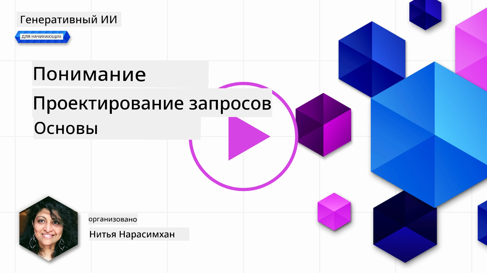
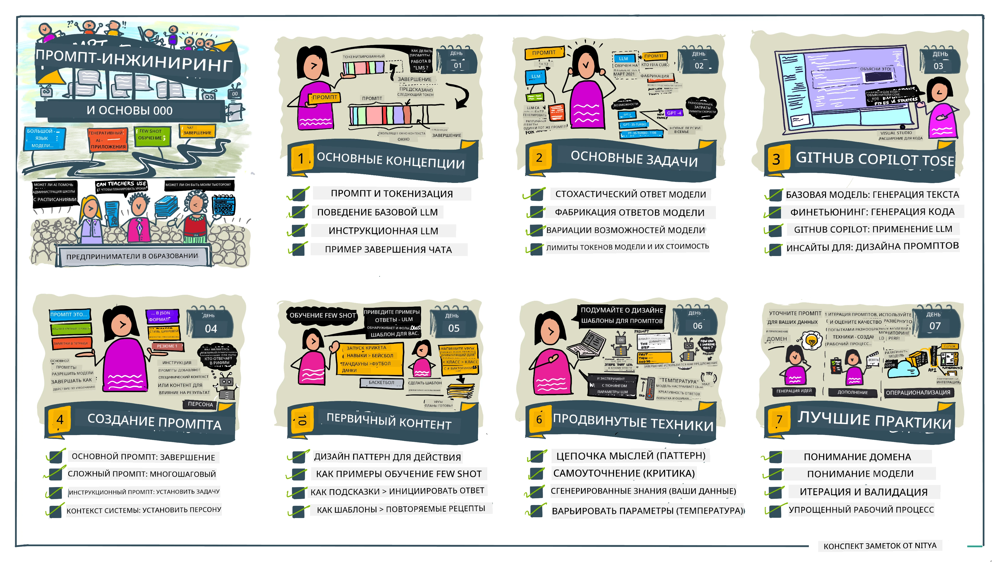
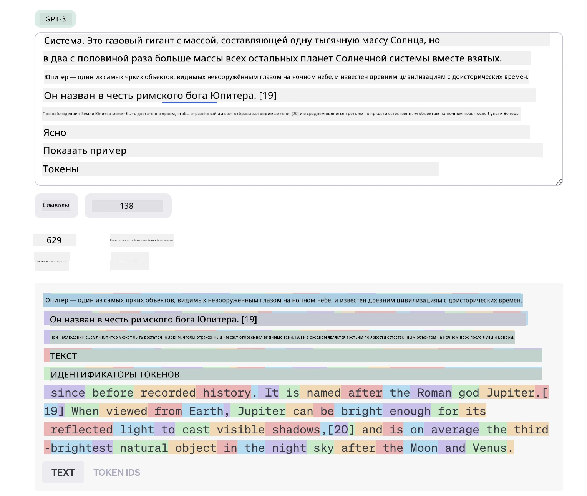
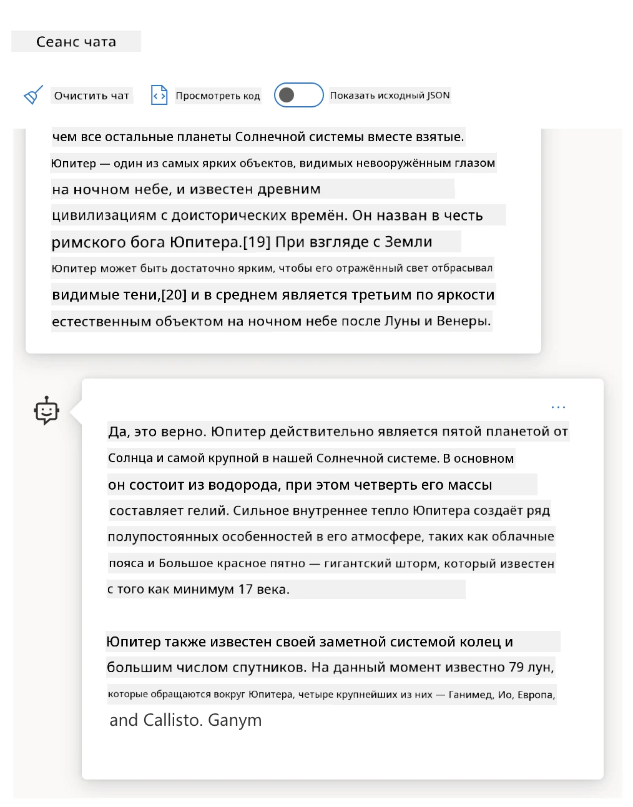
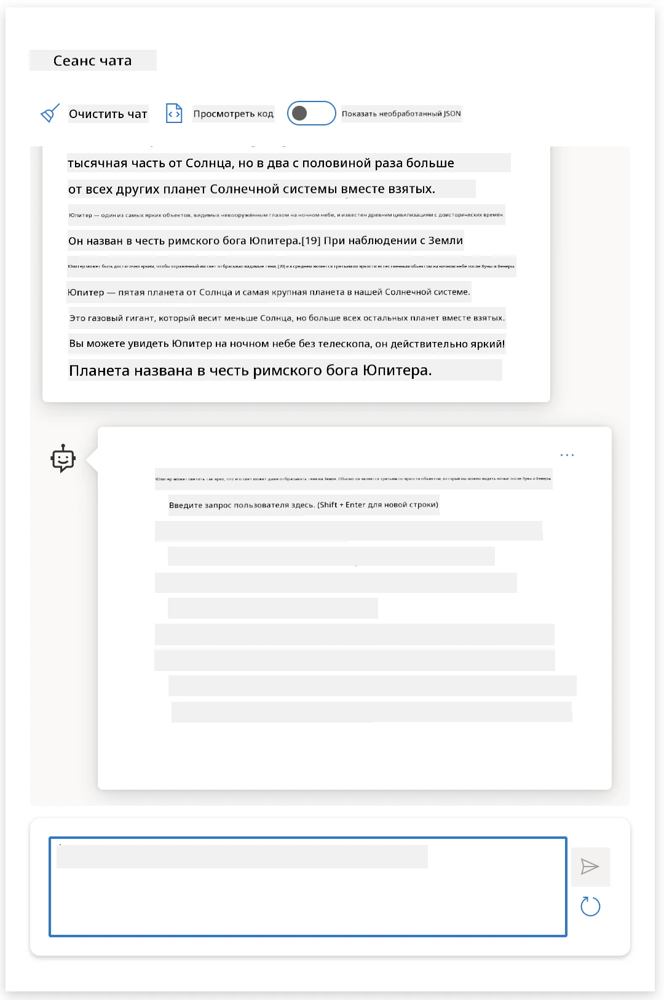
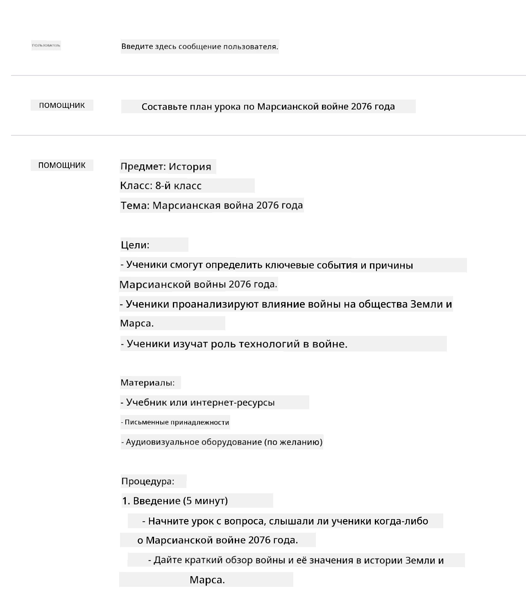
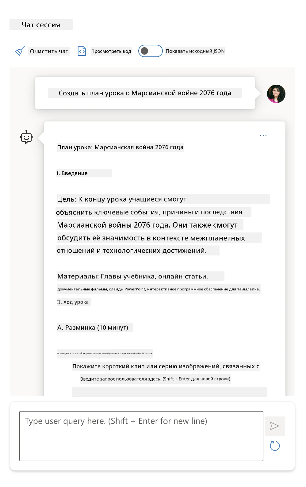
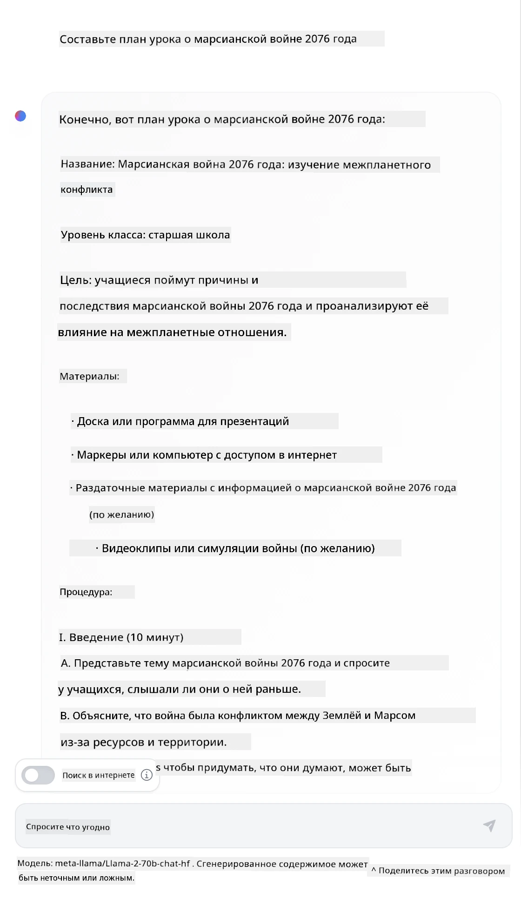

# Основы проектирования запросов

[](https://youtu.be/GElCu2kUlRs?si=qrXsBvXnCW12epb8)

## Введение
В этом модуле рассматриваются ключевые концепции и техники создания эффективных запросов для генеративных моделей ИИ. Важно, как именно вы формулируете свой запрос к большой языковой модели (LLM). Тщательно продуманный запрос может обеспечить более качественный ответ. Но что именно означают такие термины, как _запрос_ и _проектирование запросов_? И как улучшить сам _ввод_ запроса, который я отправляю LLM? Именно на эти вопросы мы постараемся ответить в этой и следующей главе.

_Генеративный ИИ_ способен создавать новый контент (например, текст, изображения, аудио, код и т.д.) в ответ на запросы пользователей. Это достигается с помощью _Больших Языковых Моделей_ (LLM), таких как серия GPT от OpenAI ("Generative Pre-trained Transformer"), обученных работать с естественным языком и кодом.

Теперь пользователи могут взаимодействовать с этими моделями с помощью привычных парадигм, таких как чат, без необходимости технической подготовки. Модели основаны на _запросах_ — пользователь отправляет текстовый ввод (запрос) и получает ответ от ИИ (завершение). Они могут вести многократный диалог, уточняя запрос, пока ответ не будет соответствовать ожиданиям.

"Запросы" теперь становятся основным _программным интерфейсом_ для приложений генеративного ИИ, указывая моделям, что делать, и влияя на качество ответов. "Проектирование запросов" — быстроразвивающаяся область, сфокусированная на _разработке и оптимизации_ запросов для обеспечения стабильных и качественных ответов в масштабах.

## Цели обучения

В этом уроке мы узнаем, что такое проектирование запросов, почему это важно, и как создавать более эффективные запросы для конкретной модели и задачи. Мы познакомимся с основными концепциями и лучшими практиками, а также рассмотрим интерактивную среду Jupyter Notebooks — "песочницу", где можно увидеть применение этих концепций на реальных примерах.

К концу урока мы сможем:

1. Объяснить, что такое проектирование запросов и почему это важно.
2. Описать компоненты запроса и их использование.
3. Изучить лучшие практики и техники проектирования запросов.
4. Применить изученные техники на практических примерах с использованием OpenAI endpoint.

## Ключевые термины

Проектирование запросов: Практика создания и доработки вводов для направления моделей ИИ на производство нужных результатов.
Токенизация: Процесс преобразования текста в меньшие единицы, называемые токенами, которые модель может распознавать и обрабатывать.
Инструкция-тюнингованные LLM: Большие языковые модели, дообученные с использованием специальных инструкций для повышения точности и релевантности ответов.

## Песочница для обучения

Проектирование запросов сейчас больше искусство, чем точная наука. Лучший способ улучшить интуицию — _практиковаться_ и применять метод проб и ошибок, сочетая экспертизу в предметной области с рекомендованными техниками и оптимизациями, специфичными для модели.

Jupyter Notebook, сопровождающий этот урок, предоставляет _песочницу_, где вы можете применять изученное — в процессе или в рамках финального задания. Для выполнения упражнений вам потребуется:

1. **Ключ API Azure OpenAI** — конечная точка сервиса для развернутой LLM.
2. **Среда выполнения Python** — в которой можно запускать ноутбук.
3. **Локальные переменные окружения** — _пройдите шаги [SETUP](./../00-course-setup/02-setup-local.md?WT.mc_id=academic-105485-koreyst), чтобы подготовить систему_.

Ноутбук содержит _начальные_ упражнения, но вас поощряют добавлять свои секции с _Markdown_ (описания) и _Code_ (запросами), чтобы пробовать больше примеров и наращивать интуицию проектирования запросов.

## Иллюстрированное руководство

Хотите получить общее представление о том, что охватывает этот урок, прежде чем углубляться? Посмотрите это иллюстрированное руководство с основными темами и ключевыми выводами. Дорожная карта урока ведет от понимания базовых концепций и проблем к их решению с помощью релевантных техник проектирования запросов и лучших практик. Обратите внимание, что раздел «Продвинутые техники» относится к материалам _следующей_ главы курса.



## Наш стартап

Теперь расскажем, как _эта тема_ связана с миссией нашего стартапа — [внедрять инновации ИИ в образование](https://educationblog.microsoft.com/2023/06/collaborating-to-bring-ai-innovation-to-education?WT.mc_id=academic-105485-koreyst). Мы хотим создавать приложения с ИИ для _персонализированного обучения_. Давайте подумаем, как разные пользователи нашего приложения могли бы "проектировать" запросы:

- **Администраторы** могут попросить ИИ _проанализировать учебные данные, чтобы выявить пробелы в охвате_. ИИ может подытожить результаты или визуализировать их с помощью кода.
- **Преподаватели** могут попросить ИИ _создать план урока для заданной аудитории и темы_. ИИ сформирует персонализированный план в указанном формате.
- **Студенты** могут попросить ИИ _помочь с трудной темой_. ИИ теперь может вести уроки, давать подсказки и примеры, адаптированные под их уровень.

Это лишь верхушка айсберга. Ознакомьтесь с [Prompts For Education](https://github.com/microsoft/prompts-for-edu/tree/main?WT.mc_id=academic-105485-koreyst) — библиотекой запросов с открытым исходным кодом, курируемой экспертами образования, чтобы представить более широкий круг возможностей! _Попробуйте выполнить некоторые из этих запросов в песочнице или в OpenAI Playground, чтобы посмотреть результат!_

<!--
ШАБЛОН УРОКА:
Этот блок должен охватывать ключевую концепцию № 1.
Укрепить концепцию примерами и ссылками.

КОНЦЕПЦИЯ №1:
Проектирование запросов.
Определите и объясните, зачем это нужно.
-->

## Что такое проектирование запросов?

Мы начали этот урок с определения **проектирования запросов** как процесса _создания и оптимизации_ текстовых вводов (запросов) для получения стабильных и качественных ответов (завершений) для конкретной задачи и модели. Можно рассматривать это как двухэтапный процесс:

- _создание_ начального запроса для конкретной модели и задачи
- _доработка_ запроса итеративно для улучшения качества ответа

Это обязательно процесс проб и ошибок, требующий интуиции и усилий пользователя для достижения оптимального результата. Почему это важно? Чтобы ответить, нужно понять три понятия:

- _Токенизация_ — как модель "видит" запрос
- _Базовые LLM_ — как базовая модель "обрабатывает" запрос
- _Инструкция-тюнингованные LLM_ — как модель теперь видит "задачи"

### Токенизация

LLM воспринимает запросы как _последовательность токенов_, и разные модели (или версии модели) могут токенизировать один и тот же запрос по-разному. Поскольку модели обучаются на токенах (а не на сыром тексте), способ токенизации напрямую влияет на качество генерируемого ответа.

Чтобы почувствовать, как работает токенизация, попробуйте такие инструменты, как [OpenAI Tokenizer](https://platform.openai.com/tokenizer?WT.mc_id=academic-105485-koreyst), показанный ниже. Вставьте свой запрос и посмотрите, как он разбивается на токены, обращая внимание, как обрабатываются пробелы и знаки препинания. Обратите внимание, что пример использует более старую модель LLM (GPT-3), поэтому с новыми моделями результат может отличаться.



### Концепция: Фондовые модели

После токенизации запросов основная функция ["Базовой LLM"](https://blog.gopenai.com/an-introduction-to-base-and-instruction-tuned-large-language-models-8de102c785a6?WT.mc_id=academic-105485-koreyst) (или фондовой модели) — предсказать следующий токен в последовательности. Так как LLM обучены на огромных текстовых массивах, они хорошо знают статистические связи между токенами и могут с уверенностью делать предсказания. Обратите внимание, что модель не понимает _значение_ слов в запросе или токенах; она лишь видит паттерн, который может "дополнить" следующим предсказанием. Она продолжает предсказывать токены, пока не будет остановлена пользователем или заданным условием.

Хотите увидеть, как работает завершение на основе запросов? Введите приведённый выше запрос в [Microsoft Foundry playground](https://ai.azure.com?WT.mc_id=academic-105485-koreyst) с настройками по умолчанию. Система настроена воспринимать запросы как запросы информации — вы получите завершение, соответствующее этому контексту.

Но что если пользователь хочет увидеть что-то конкретное, отвечающее определённым критериям или цели задачи? Здесь на сцену выходят _инструкция-тюнингованные_ LLM.



### Концепция: Инструкция-тюнингованные LLM

[Инструкция-тюнингованная LLM](https://blog.gopenai.com/an-introduction-to-base-and-instruction-tuned-large-language-models-8de102c785a6?WT.mc_id=academic-105485-koreyst) строится на базе фондовой модели, дообученной на примерах или парах ввода/вывода (например, многоходовых "сообщениях") с четкими инструкциями, а ответ от ИИ пытается следовать этим инструкциям.

Для этого используются техники, например, обучение с подкреплением с человеческой обратной связью (RLHF), позволяющие модели _следовать инструкциям_ и _обучаться на обратной связи_, чтобы выдавать более подходящие и релевантные практическим задачам ответы.

Давайте попробуем — вернитесь к вышеуказанному запросу и измените _системное сообщение_, задав следующую инструкцию в качестве контекста:

> _Суммируйте предоставленный материал для ученика второго класса. Ограничьтесь одним параграфом с 3-5 пунктами._

Видите, как результат теперь подстроен под желаемую цель и формат? Преподаватель может напрямую использовать этот ответ в своих презентациях для данного урока.



## Зачем нужно проектирование запросов?

Узнав, как LLM обрабатывают запросы, поговорим о том, _зачем_ нужно проектирование запросов. Ответ заключается в том, что современные LLM имеют ряд вызовов, которые затрудняют достижение _надежных и последовательных завершений_ без усилий по конструкции и оптимизации запросов. Например:

1. **Ответы модели стохастичны.** _Один и тот же запрос_ может дать разные ответы на разных моделях или их версиях. Даже на _одной и той же модели_ ответы могут различаться в разное время. _Техники проектирования запросов помогают минимизировать эти вариации, задавая лучшие рамки_.

1. **Модели могут фабриковать ответы.** Модели обучены на _больших, но конечных_ наборах данных, поэтому они не знают концепций за пределами этой обучающей выборки. В результате они могут давать неточные, вымышленные или противоречащие известным фактам ответы. _Проектирование запросов помогает пользователям выявлять и снижать такие искажения, например, запрашивая у ИИ ссылки или логику_.

1. **Возможности моделей различаются.** Новые модели или поколения имеют расширенные возможности, но также уникальные особенности и компромиссы в стоимости и сложности. _Проектирование запросов позволяет вырабатывать лучшие практики и рабочие процессы, которые абстрагируют различия и адаптируются к требованиям конкретной модели масштабируемо и безболезненно_.

Давайте посмотрим это на практике в OpenAI или Azure OpenAI Playground:

- Используйте один и тот же запрос с разными развернутыми LLM (например, OpenAI, Azure OpenAI, Hugging Face) — заметили разницу?
- Используйте один и тот же запрос несколько раз с _одной_ развернутой LLM (например, Azure OpenAI playground) — как различались ответы?

### Пример фабрикаций

В этом курсе термином **"фабрикация"** обозначается явление, когда LLM иногда генерируют фактически неверную информацию из-за ограничений обучения или других факторов. Вы могли слышать и термин _"галлюцинации"_ в популярных статьях или исследованиях. Однако мы настоятельно рекомендуем использовать _"фабрикация"_, чтобы не приписывать поведение машины человеческим чертам. Это также поддерживает [принципы ответственного ИИ](https://www.microsoft.com/ai/responsible-ai?WT.mc_id=academic-105485-koreyst) с точки зрения терминологии, исключая слова, которые могут быть сочтены оскорбительными или неинклюзивными в некоторых контекстах.

Хотите почувствовать, как работают фабрикации? Представьте запрос, в котором ИИ просят сгенерировать контент по несуществующей теме (чтобы убедиться, что такой материал не входит в обучающий датасет). Например, я попробовал запрос:

> **Запрос:** создать план урока о Марсианской войне 2076 года.

Поиск в интернете показал, что есть вымышленные сюжеты (например, сериалы или книги) о марсианских войнах, но не углубляющихся в 2076 год. Здравый смысл также говорит, что 2076 — _будущее_, и с реальным событием это быть не может.


Итак, что происходит, когда мы запускаем этот запрос с разными поставщиками LLM?

> **Ответ 1**: OpenAI Playground (GPT-35)



> **Ответ 2**: Azure OpenAI Playground (GPT-35)



> **Ответ 3**: : Hugging Face Chat Playground (LLama-2)



Как и ожидалось, каждая модель (или версия модели) производит немного разные ответы благодаря стохастическому поведению и отличиям в возможностях моделей. Например, одна модель ориентирована на восьмиклассников, в то время как другая предполагает ученика старшей школы. Но все три модели сгенерировали ответы, которые могли убедить неосведомленного пользователя, что событие было реальным.

Техники инжиниринга запросов, такие как _метазапросы_ и _настройка температуры_, могут в некоторой степени уменьшить искажения моделей. Новые архитектуры инжиниринга запросов также бесшовно интегрируют новые инструменты и методы в поток запросов, чтобы смягчить или уменьшить некоторые из этих эффектов.

## Исследование: GitHub Copilot

Давайте завершим этот раздел, посмотрев, как инжиниринг запросов используется в реальных решениях на примере одного кейса: [GitHub Copilot](https://github.com/features/copilot?WT.mc_id=academic-105485-koreyst).

GitHub Copilot — ваш «AI помощник-программист» — он преобразует текстовые запросы в дополнения к коду и интегрирован в вашу среду разработки (например, Visual Studio Code) для бесшовного пользовательского опыта. Как документировано в серии блогов ниже, самая ранняя версия была основана на модели OpenAI Codex — инженеры быстро поняли необходимость дообучения модели и разработки лучших техник инжиниринга запросов для улучшения качества кода. В июле они [представили улучшенную AI-модель, которая превосходит Codex](https://github.blog/2023-07-28-smarter-more-efficient-coding-github-copilot-goes-beyond-codex-with-improved-ai-model/?WT.mc_id=academic-105485-koreyst) и предлагает ещё более быстрые рекомендации.

Читайте посты по порядку, чтобы проследить их путь обучения.

- **Май 2023** | [GitHub Copilot становится лучше в понимании вашего кода](https://github.blog/2023-05-17-how-github-copilot-is-getting-better-at-understanding-your-code/?WT.mc_id=academic-105485-koreyst)
- **Май 2023** | [Inside GitHub: Работа с LLM за GitHub Copilot](https://github.blog/2023-05-17-inside-github-working-with-the-llms-behind-github-copilot/?WT.mc_id=academic-105485-koreyst)
- **Июн 2023** | [Как писать лучшие запросы для GitHub Copilot](https://github.blog/2023-06-20-how-to-write-better-prompts-for-github-copilot/?WT.mc_id=academic-105485-koreyst)
- **Июл 2023** | [.. GitHub Copilot превосходит Codex с улучшенной AI-моделью](https://github.blog/2023-07-28-smarter-more-efficient-coding-github-copilot-goes-beyond-codex-with-improved-ai-model/?WT.mc_id=academic-105485-koreyst)
- **Июл 2023** | [Руководство разработчика по инжинирингу запросов и LLM](https://github.blog/2023-07-17-prompt-engineering-guide-generative-ai-llms/?WT.mc_id=academic-105485-koreyst)
- **Сен 2023** | [Как создать корпоративное приложение LLM: уроки от GitHub Copilot](https://github.blog/2023-09-06-how-to-build-an-enterprise-llm-application-lessons-from-github-copilot/?WT.mc_id=academic-105485-koreyst)

Вы также можете просмотреть их [инженерный блог](https://github.blog/category/engineering/?WT.mc_id=academic-105485-koreyst) для других публикаций, например [этой](https://github.blog/2023-09-27-how-i-used-github-copilot-chat-to-build-a-reactjs-gallery-prototype/?WT.mc_id=academic-105485-koreyst), которая показывает, как эти модели и техники _применяются_ для создания реальных приложений.

---

<!--
ШАБЛОН УРОКА:
Этот блок должен охватывать основную концепцию #2.
Подкрепите концепцию примерами и ссылками.

КОНЦЕПТ №2:
Проектирование запросов.
Иллюстрировано примерами.
-->

## Конструкция запроса

Мы уже поняли, почему инжиниринг запросов важен — теперь давайте разберемся, как _строятся_ запросы, чтобы оценить разные техники для более эффективного проектирования запросов.

### Базовый запрос

Начнем с базового запроса: текстовый ввод, отправленный модели без дополнительного контекста. Вот пример — когда мы отправляем первые несколько слов национального гимна США в OpenAI [Completion API](https://platform.openai.com/docs/api-reference/completions?WT.mc_id=academic-105485-koreyst), он мгновенно _дополняет_ ответ следующими строками, демонстрируя базовое поведение предсказания.

| Запрос (ввод)      | Дополнение (вывод)                                                                                                                         |
| :----------------- | :----------------------------------------------------------------------------------------------------------------------------------------- |
| Oh say can you see | Похоже, вы начинаете текст гимна США "The Star-Spangled Banner." Полные слова следующие ...                                                |

### Сложный запрос

Теперь добавим контекст и инструкции к базовому запросу. [Chat Completion API](https://learn.microsoft.com/azure/ai-services/openai/how-to/chatgpt?WT.mc_id=academic-105485-koreyst) позволяет сформировать сложный запрос в виде набора _сообщений_ с:

- парами вход-выход, отражающими ввод _пользователя_ и ответ _ассистента_.
- системным сообщением, задающим контекст поведения или личности ассистента.

Теперь запрос имеет следующий вид, где _токенизация_ эффективно захватывает релевантную информацию из контекста и диалога. Изменение системного контекста может так же сильно влиять на качество дополнений, как и предоставленные пользователем вводы.

```python
response = client.responses.create(
    model="gpt-4o-mini",
    input=[
        {"role": "system", "content": "You are a helpful assistant."},
        {"role": "user", "content": "Who won the world series in 2020?"},
        {"role": "assistant", "content": "The Los Angeles Dodgers won the World Series in 2020."},
        {"role": "user", "content": "Where was it played?"}
    ]
)
```

### Инструкционный запрос

В предыдущих примерах пользовательский запрос был простым текстовым вопросом, который можно интерпретировать как просьбу о информации. С _инструкционными_ запросами мы можем использовать этот текст, чтобы более подробно указать задачу, обеспечивая лучшее руководство для ИИ. Вот пример:

| Запрос (ввод)                                                                                                                                                                                                                         | Дополнение (вывод)                                                                                                        | Тип инструкции      |
| :------------------------------------------------------------------------------------------------------------------------------------------------------------------------------------------------------------------------------------- | :------------------------------------------------------------------------------------------------------------------------- | :------------------ |
| Напишите описание Гражданской войны                                                                                                                                                                                                 | _возвращает простой абзац_                                                                                                | Простой             |
| Напишите описание Гражданской войны. Укажите ключевые даты и события и опишите их значение                                                                                                                                             | _возвращает абзац, за которым следует список ключевых дат и их описаний_                                                 | Сложный             |
| Напишите описание Гражданской войны в 1 абзаце. Укажите 3 пункта с ключевыми датами и их значением. Укажите 3 пункта с ключевыми историческими личностями и их вкладом. Верните результат в виде JSON файла                                     | _возвращает более подробные данные в текстовом блоке, отформатированные как JSON, который можно скопировать и сохранить_   | Сложный. Форматированный. |

## Основное содержимое

В приведенных выше примерах запрос был достаточно открытым, позволяя LLM самостоятельно решать, какая часть его предварительно обученного набора данных релевантна. С паттерном проектирования _основное содержимое_ входной текст делится на две части:

- инструкция (действие)
- релевантное содержимое (влияющее на действие)

Вот пример, где инструкция — «сократите это до 2 предложений».

| Запрос (ввод)                                                                                                                                                                                                                                                                                                                                                                                                                                                                                                                                                                                                                                                                                      | Дополнение (вывод)                                                                                                                                                                                                                                                                             |
| :-------------------------------------------------------------------------------------------------------------------------------------------------------------------------------------------------------------------------------------------------------------------------------------------------------------------------------------------------------------------------------------------------------------------------------------------------------------------------------------------------------------------------------------------------------------------------------------------------------------------------------------------------------------------------------------------------- | :---------------------------------------------------------------------------------------------------------------------------------------------------------------------------------------------------------------------------------------------------------------------------------------------- |
| Юпитер — пятая планета от Солнца и самая большая в Солнечной системе. Это газовый гигант с массой в одну тысячную массы Солнца, но в два с половиной раза больше массы всех других планет Солнечной системы вместе взятых. Юпитер — один из самых ярких объектов, видимых невооружённым глазом на ночном небе, и был известен древним цивилизациям ещё до начала записанной истории. Он назван в честь римского бога Юпитера.[19] При наблюдении с Земли Юпитер может быть достаточно ярким для того, чтобы отражённый свет отбрасывал видимые тени,[20] и в среднем является третьим по яркости естественным объектом на ночном небе после Луны и Венеры. <br/> **Сократите это до 2 коротких предложений** | Юпитер, пятая планета от Солнца, является самой большой в Солнечной системе и известен как один из самых ярких объектов на ночном небе. Названный в честь римского бога Юпитера, он — газовый гигант, масса которого в два с половиной раза больше массы всех остальных планет Солнечной системы вместе взятых. |

Сегмент основного содержимого можно использовать различными способами для более эффективных инструкций:

- **Примеры** — вместо того, чтобы явно говорить модели, что делать, дайте ей примеры того, что нужно сделать, и позвольте вывести шаблон.
- **Подсказки** — следует за инструкцией "подсказка", которая подготавливает дополнение, направляя модель к более релевантным ответам.
- **Шаблоны** — это повторяемые «рецепты» запросов с заполнителями (переменными), которые можно настроить данными для конкретных случаев.

Давайте рассмотрим эти подходы на практике.

### Использование примеров

Это подход, при котором вы используете основное содержимое, чтобы "кормить модель" примерами желаемого результата для данной инструкции и позволяете ей вывести шаблон желаемого вывода. В зависимости от количества приведённых примеров мы можем иметь zero-shot, one-shot, few-shot и т.д.

Запрос теперь состоит из трёх компонентов:

- Описание задачи
- Несколько примеров желаемого результата
- Начало нового примера (которое становится неявным описанием задачи)

| Тип обучения  | Запрос (ввод)                                                                                                                                        | Дополнение (вывод)         |
| :------------ | :---------------------------------------------------------------------------------------------------------------------------------------------------- | :-------------------------- |
| Zero-shot     | "The Sun is Shining". Переведите на испанский                                                                                                       | "El Sol está brillando".    |
| One-shot      | "The Sun is Shining" => ""El Sol está brillando". <br> "It's a Cold and Windy Day" =>                                                                 | "Es un día frío y ventoso". |
| Few-shot      | Игрок обежал базы => Бейсбол <br/> Игрок подал эйс => Теннис <br/> Игрок сделал шесть => Крикет <br/> Игрок сделал данк => | Баскетбол                  |
|               |                                                                                                                                                       |                             |

Обратите внимание, что в zero-shot запросе нам пришлось явно указать инструкцию ("Переведите на испанский"), но в one-shot запросе это уже выводится самим примером. Few-shot пример показывает, что добавление большего количества примеров позволяет моделям делать более точные выводы без добавления инструкций.

### Подсказки к запросу

Ещё одна техника использования основного содержимого — давать _подсказки_ вместо примеров. В этом случае мы даём модели небольшой толчок в нужном направлении, _начинаем_ её с фрагмента, который отражает желаемый формат ответа. Модель "берёт подсказку" и продолжает в том же стиле.

| Количество подсказок | Запрос (ввод)                                                                                                                                                                                                                                                                                                                                                                                                                                               | Дополнение (вывод)                                                                                                                                                                                                                                                                                       |
| :------------------- | :----------------------------------------------------------------------------------------------------------------------------------------------------------------------------------------------------------------------------------------------------------------------------------------------------------------------------------------------------------------------------------------------------------------------------------------------------------- | :-------------------------------------------------------------------------------------------------------------------------------------------------------------------------------------------------------------------------------------------------------------------------------------------------------- |
| 0                    | Юпитер — пятая планета от Солнца и самая большая в Солнечной системе. Это газовый гигант с массой в одну тысячную массы Солнца, но в два с половиной раза больше массы всех других планет Солнечной системы вместе взятых. Юпитер — один из самых ярких объектов, видимых невооружённым глазом на ночном небе, и был известен древним цивилизациям ещё до начала записанной истории. <br/>**Сократите это**                                       | Юпитер — самая большая планета в нашей Солнечной системе и пятая от Солнца. Это газовый гигант массой в 1/1000 части от массы Солнца, но тяжелее всех остальных планет вместе взятых. Древние цивилизации знали о Юпитере давно, и его легко увидеть на ночном небе. |
| 1                    | Юпитер — пятая планета от Солнца и самая большая в Солнечной системе. Это газовый гигант с массой в одну тысячную массы Солнца, но в два с половиной раза больше массы всех других планет Солнечной системы вместе взятых. Юпитер — один из самых ярких объектов, видимых невооружённым глазом на ночном небе, и был известен древним цивилизациям ещё до начала записанной истории. <br/>**Сократите это** <br/> Что мы узнали, это что Юпитер | — пятая планета от Солнца и самая большая в Солнечной системе. Это газовый гигант с массой в одну тысячную массу Солнца, но в два с половиной раза больше её массы, чем у всех остальных планет вместе взятых. Его легко видно невооружённым глазом, и он известен с древних времён.                        |

| 2              | Юпитер — пятая планета от Солнца и самая большая в Солнечной системе. Это газовый гигант с массой в одну тысячную часть массы Солнца, но в два с половиной раза больше массы всех остальных планет Солнечной системы вместе взятых. Юпитер — один из самых ярких объектов, видимых невооружённым глазом на ночном небе, и он был известен древним цивилизациям задолго до начала письменной истории. <br/>**Подытожим** <br/> Топ-3 факта, которые мы узнали:         | 1. Юпитер — пятая планета от Солнца и самая большая в Солнечной системе. <br/> 2. Это газовый гигант с массой в одну тысячную часть массы Солнца...<br/> 3. Юпитер виден невооружённым глазом с древних времён ...                                                                       |
|                |                                                                                                                                                                                                                                                                                                                                                                                                                                                              |                                                                                                                                                                                                                                                                                                           |

### Шаблоны подсказок

Шаблон подсказки — это _предварительно определённый рецепт для подсказки_, который можно сохранять и использовать повторно по мере необходимости, чтобы обеспечить более последовательный пользовательский опыт в масштабе. В своей простой форме это просто коллекция примеров подсказок, как [этот пример от OpenAI](https://cookbook.openai.com/examples/gpt4-1_prompting_guide?WT.mc_id=academic-105485-koreyst), который содержит как интерактивные компоненты подсказки (сообщения пользователя и системы), так и формат запроса через API — для поддержки повторного использования.

В более сложной форме, как [в этом примере от LangChain](https://python.langchain.com/docs/concepts/prompt_templates/?WT.mc_id=academic-105485-koreyst), он содержит _заполнители_, которые могут быть заменены данными из различных источников (ввод пользователя, контекст системы, внешние источники данных и др.) для динамической генерации подсказки. Это позволяет создать библиотеку многоразовых подсказок, которые можно программно использовать для обеспечения последовательного пользовательского опыта в масштабе.

Наконец, настоящая ценность шаблонов заключается в возможности создавать и публиковать _библиотеки подсказок_ для вертикальных доменных приложений — где шаблон подсказки _оптимизирован_ с учётом специфики приложения или примеров, делающих ответы более релевантными и точными для целевой аудитории. Репозиторий [Prompts For Edu](https://github.com/microsoft/prompts-for-edu?WT.mc_id=academic-105485-koreyst) — отличный пример такого подхода, курирующий библиотеку подсказок для образовательной сферы с акцентом на ключевые задачи, такие как планирование уроков, проектирование учебных программ, репетиторство студентов и т.д.

## Вспомогательный контент

Если рассматривать построение подсказки как наличие инструкции (задачи) и цели (основного контента), то _вторичный контент_ — это дополнительный контекст, который мы предоставляем для **влияния на результат**. Это могут быть параметры настройки, инструкции по форматированию, таксономии тем и др., которые помогают модели _адаптировать_ ответ в соответствии с желаемыми задачами и ожиданиями пользователя.

Например: Имеется каталог курсов с обширными метаданными (название, описание, уровень, теги, преподаватель и др.) по всем курсам учебной программы:

- мы можем определить инструкцию "сделать краткое изложение каталога курсов на осень 2023"
- можем использовать основной контент, чтобы привести несколько примеров желаемого результата
- можем использовать вторичный контент, чтобы определить топ-5 интересующих "тегов"

Теперь модель может предоставить краткое содержание в формате, показанном на нескольких примерах — но если в результате несколько тегов, она может расставить приоритеты на топ-5 тегах, определённых во вторичном контенте.

---

<!--
ШАБЛОН УРОКА:
Этот блок должен охватывать основной концепт #1.
Подкрепите концепт примерами и ссылками.

КОНЦЕПТ #3:
Техники проектирования подсказок.
Какие базовые техники проектирования подсказок существуют?
Проиллюстрируйте их с помощью упражнений.
-->

## Лучшие практики проектирования подсказок

Теперь, когда мы знаем, как можно _построить_ подсказки, можно начать думать о том, как их _проектировать_ с учётом лучших практик. Это можно рассматривать в двух аспектах — правильный _настрой_ и применение правильных _техник_.

### Настрой проектирования подсказок

Проектирование подсказок — это процесс методом проб и ошибок, поэтому держите в уме три общих guiding фактора:

1. **Знание домена важно.** Точность и релевантность ответа зависят от _домена_, в котором работает приложение или пользователь. Применяйте вашу интуицию и доменные знания, чтобы **дальше адаптировать техники**. Например, определяйте _персоналии, специфичные для домена_ в системных подсказках или используйте _доменно-специфические шаблоны_ в пользовательских подсказках. Предоставляйте вторичный контент, отражающий доменный контекст, или используйте _доменно-специфические сигналы и примеры_, чтобы направлять модель к знакомым шаблонам использования.

2. **Понимание модели имеет значение.** Известно, что модели по природе стохастичны. Но реализации модели также могут отличаться набором используемых тренировочных данных (предобученные знания), набором возможностей (например, через API или SDK) и типом контента, на котором они оптимизированы (например, код, изображения, текст). Понимайте сильные и слабые стороны используемой модели и используйте эти знания для _расстановки приоритетов_ или построения _кастомизированных шаблонов_, оптимизированных под возможности модели.

3. **Итерация и проверка важны.** Модели быстро развиваются, как и методы проектирования подсказок. Как эксперт в домене, у вас могут быть другие контексты или критерии для _вашего_ конкретного приложения, которые не применимы для широкой аудитории. Используйте инструменты и техники проектирования подсказок для "быстрого старта" построения подсказок, затем итеративно улучшайте и проверяйте результаты с помощью собственной интуиции и знаний в домене. Записывайте свои инсайты и создавайте **базу знаний** (например, библиотеки подсказок), которая может использоваться другими как новая отправная точка для более быстрых итераций в будущем.

## Лучшие практики

Теперь рассмотрим распространённые лучшие практики, рекомендуемые специалистами из [OpenAI](https://help.openai.com/en/articles/6654000-best-practices-for-prompt-engineering-with-openai-api?WT.mc_id=academic-105485-koreyst) и [Azure OpenAI](https://learn.microsoft.com/azure/ai-services/openai/concepts/prompt-engineering#best-practices?WT.mc_id=academic-105485-koreyst).

| Что                               | Почему                                                                                                                                                                                                                                              |
| :-------------------------------- | :------------------------------------------------------------------------------------------------------------------------------------------------------------------------------------------------------------------------------------------------ |
| Оценивайте последние модели        | Новые поколения моделей, вероятно, обладают улучшенными функциями и качеством — но могут также иметь более высокие расходы. Оценивайте их влияние, затем принимайте решения о миграции.                                                             |
| Разделяйте инструкции и контекст  | Проверьте, определяет ли ваша модель/провайдер _разделители_ для более чёткого разделения инструкций, первичного и вторичного контента. Это поможет моделям точнее назначать веса токенам.                                                        |
| Будьте конкретны и ясны            | Предоставляйте больше деталей о желаемом контексте, результате, длине, формате, стиле и т.д. Это улучшит и качество, и согласованность ответов. Фиксируйте рецепты в многоразовых шаблонах.                                                         |
| Будьте описательными, используйте примеры | Модели могут лучше откликаться на подход "показать и рассказать". Начинайте с подхода `zero-shot`, где даёте только инструкцию (без примеров), затем пробуйте `few-shot` как уточнение, приводя несколько примеров желаемого результата. Используйте аналогии. |
| Используйте подсказки для запуска завершения | Подтолкните модель к желаемому результату, давая ей несколько вводных слов или фраз, которые она может использовать как отправную точку для ответа.                                                                                              |
| Усильте эффективность             | Иногда нужно повторять инструкцию модели. Даёте указания до и после основного контента, используйте инструкцию и подсказку и т.п. Итеративно проверяйте, что работает лучше.                                                                          |
| Порядок важен                    | Порядок подачи информации модели может влиять на результат, даже в обучающих примерах, из-за эффекта новизны. Пробуйте разные варианты, чтобы найти лучший.                                                                                         |
| Дайте модели “выход”               | Дайте модели _резервный_ ответ, который она может использовать, если не сможет выполнить задачу. Это снижает вероятность генерации ложных или выдуманных ответов.                                                                                  |
|                                  |                                                                                                                                                                                                                                                   |

Как и в любой лучшей практике, помните, что _ваши результаты могут отличаться_ в зависимости от модели, задачи и домена. Используйте эти рекомендации как отправную точку и итеративно подбирайте то, что лучше всего подходит вам. Постоянно переоценивайте процесс проектирования подсказок с появлением новых моделей и инструментов, акцентируя внимание на масштабируемости процесса и качестве ответов.

<!--
ШАБЛОН УРОКА:
В этом блоке должен быть кодовый вызов, если применимо

ЗАДАЧА:
Ссылка на Jupyter Notebook с комментариями к коду в инструкциях (кодовые блоки пусты).

РЕШЕНИЕ:
Ссылка на копию этого ноутбука с заполненными и выполненными подсказками, показывающими один пример.
-->

## Задание

Поздравляем! Вы дошли до конца урока! Пора проверить некоторые из этих концепций и техник на реальных примерах!

Для нашего задания мы будем использовать Jupyter Notebook с упражнениями, которые можно выполнять интерактивно. Вы также можете расширить ноутбук своими собственными ячейками Markdown и кодом, чтобы исследовать идеи и техники самостоятельно.

### Для начала форкните репозиторий, затем

- (Рекомендуется) Запустите GitHub Codespaces
- (В качестве альтернативы) Клонируйте репозиторий на своё устройство и используйте его с Docker Desktop
- (В качестве альтернативы) Откройте ноутбук в предпочитаемой среде выполнения

### Далее настройте переменные окружения

- Скопируйте файл `.env.copy` из корня репозитория в `.env` и заполните значения `AZURE_OPENAI_API_KEY`, `AZURE_OPENAI_ENDPOINT` и `AZURE_OPENAI_DEPLOYMENT`. Вернитесь к [разделу Learning Sandbox](#песочница-для-обучения) для инструкций.

### Затем откройте Jupyter Notebook

- Выберите используемое ядро. Если используете варианты 1 или 2, просто выберите ядро Python 3.10.x по умолчанию, предоставленное dev-контейнером.

Вы готовы запускать упражнения. Обратите внимание, что здесь нет _правильных и неправильных_ ответов — просто исследование вариантов методом проб и ошибок и развитие интуиции о том, что работает для конкретной модели и домена.

_По этой причине в уроке отсутствуют сегменты с решением кода. Вместо этого в ноутбуке будут ячейки Markdown с заголовком "Моё решение:", показывающие один пример результата для справки._

 <!--
ШАБЛОН УРОКА:
Завершите раздел резюме и ресурсами для самостоятельного обучения.
-->

## Проверка знаний

Какой из следующих вариантов является хорошей подсказкой с учётом разумных лучших практик?

1. Покажи мне изображение красной машины
2. Покажи мне изображение красной машины марки Volvo модели XC90, припаркованной у обрыва на фоне заходящего солнца
3. Покажи мне изображение красной машины марки Volvo модели XC90

Ответ: 2 — это лучшая подсказка, так как она предоставляет детали о "чём" и переходит к конкретике (не просто машина, а конкретная марка и модель), а также описывает общую обстановку. Следующая по качеству — 3, так как содержит много описания.

## 🚀 Задача

Попробуйте использовать технику "подсказки" с подсказкой: Дополните предложение "Покажи мне изображение красной машины марки Volvo и ". Что модель ответит и как вы бы улучшили этот запрос?

## Отличная работа! Продолжайте обучение

Хотите узнать больше о различных концепциях проектирования подсказок? Перейдите на [страницу для продолжения обучения](https://aka.ms/genai-collection?WT.mc_id=academic-105485-koreyst), чтобы найти другие замечательные ресурсы по этой теме.

Перейдите к уроку 5, где мы рассмотрим [продвинутые техники подсказок](../05-advanced-prompts/README.md?WT.mc_id=academic-105485-koreyst)!

---

<!-- CO-OP TRANSLATOR DISCLAIMER START -->
**Отказ от ответственности**:
Этот документ был переведен с использованием сервиса машинного перевода [Co-op Translator](https://github.com/Azure/co-op-translator). Несмотря на наши усилия по обеспечению точности, имейте в виду, что автоматический перевод может содержать ошибки или неточности. Оригинальный документ на его исходном языке следует считать авторитетным источником. Для получения критически важной информации рекомендуется обратиться к профессиональному человеческому переводу. Мы не несем ответственности за любые недоразумения или неправильные толкования, возникшие в результате использования этого перевода.
<!-- CO-OP TRANSLATOR DISCLAIMER END -->