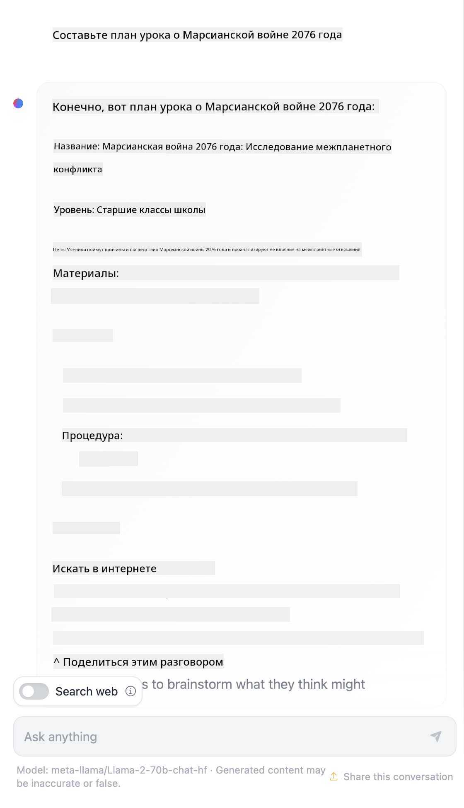

<!--
CO_OP_TRANSLATOR_METADATA:
{
  "original_hash": "a45c318dc6ebc2604f35b8b829f93af2",
  "translation_date": "2025-07-09T09:18:37+00:00",
  "source_file": "04-prompt-engineering-fundamentals/README.md",
  "language_code": "ru"
}
-->
# Основы проектирования подсказок

[](https://aka.ms/gen-ai-lesson4-gh?WT.mc_id=academic-105485-koreyst)

## Введение  
В этом модуле рассматриваются ключевые концепции и методы создания эффективных подсказок для генеративных моделей ИИ. Важно не только, что вы пишете в подсказке для LLM, но и как именно это делаете. Тщательно продуманная подсказка может значительно улучшить качество ответа. Но что же на самом деле означают термины _подсказка_ и _проектирование подсказок_? И как улучшить _входные данные_ подсказки, которые мы отправляем в LLM? На эти вопросы мы постараемся ответить в этой и следующей главе.

_Генеративный ИИ_ способен создавать новый контент (например, текст, изображения, аудио, код и т.д.) в ответ на запросы пользователя. Это достигается с помощью _Больших языковых моделей_ (LLM), таких как серия GPT от OpenAI ("Generative Pre-trained Transformer"), обученных работать с естественным языком и кодом.

Пользователи теперь могут взаимодействовать с этими моделями через привычные интерфейсы, например чат, без необходимости в технических знаниях или обучении. Модели работают на основе _подсказок_ — пользователь отправляет текстовый запрос (подсказку), а получает ответ ИИ (завершение). Затем можно вести диалог с ИИ, уточняя подсказку в несколько этапов, пока ответ не будет соответствовать ожиданиям.

«Подсказки» становятся основным _интерфейсом программирования_ для приложений с генеративным ИИ, задавая модели задачи и влияя на качество получаемых ответов. «Проектирование подсказок» — это быстро развивающаяся область, которая сосредоточена на _разработке и оптимизации_ подсказок для получения стабильных и качественных результатов в масштабах.

## Цели обучения

В этом уроке мы узнаем, что такое проектирование подсказок, почему это важно и как создавать более эффективные подсказки для конкретной модели и задачи. Мы разберём основные понятия и лучшие практики проектирования подсказок, а также познакомимся с интерактивной средой Jupyter Notebook, где эти концепции можно применить на практике.

К концу урока вы сможете:

1. Объяснить, что такое проектирование подсказок и почему это важно.  
2. Описать компоненты подсказки и их использование.  
3. Изучить лучшие практики и методы проектирования подсказок.  
4. Применить изученные методы на реальных примерах с использованием OpenAI endpoint.

## Ключевые термины

Проектирование подсказок: Практика создания и доработки входных данных для управления ИИ-моделями с целью получения нужных результатов.  
Токенизация: Процесс преобразования текста в более мелкие единицы — токены, которые модель может понимать и обрабатывать.  
Instruction-Tuned LLMs: Большие языковые модели, дообученные с использованием конкретных инструкций для повышения точности и релевантности ответов.

## Песочница для обучения

Проектирование подсказок сейчас скорее искусство, чем наука. Лучший способ улучшить интуицию — _практиковаться_ и использовать метод проб и ошибок, сочетая знания предметной области с рекомендованными методами и оптимизациями, специфичными для модели.

Jupyter Notebook, сопровождающий этот урок, предоставляет _песочницу_, где вы можете опробовать полученные знания — по ходу урока или в рамках итогового задания. Для выполнения упражнений вам понадобятся:

1. **Ключ API Azure OpenAI** — конечная точка сервиса для развернутой LLM.  
2. **Среда выполнения Python** — для запуска ноутбука.  
3. **Локальные переменные окружения** — _завершите шаги из [SETUP](./../00-course-setup/SETUP.md?WT.mc_id=academic-105485-koreyst), чтобы подготовиться_.

В ноутбуке есть _стартовые_ упражнения, но вы можете добавлять свои собственные разделы с _Markdown_ (описаниями) и _Code_ (запросами подсказок), чтобы пробовать больше примеров и развивать интуицию в проектировании подсказок.

## Иллюстрированное руководство

Хотите получить общее представление о том, что охватывает этот урок, прежде чем углубляться? Ознакомьтесь с этим иллюстрированным руководством, которое даёт обзор основных тем и ключевых выводов для размышления. Дорожная карта урока проведёт вас от понимания базовых концепций и проблем к их решению с помощью соответствующих методов проектирования подсказок и лучших практик. Обратите внимание, что раздел «Продвинутые техники» в этом руководстве относится к материалам _следующей_ главы курса.


## Наш стартап

Теперь поговорим о том, как _эта тема_ связана с миссией нашего стартапа — [внедрять инновации ИИ в образование](https://educationblog.microsoft.com/2023/06/collaborating-to-bring-ai-innovation-to-education?WT.mc_id=academic-105485-koreyst). Мы хотим создавать приложения с ИИ для _персонализированного обучения_, поэтому давайте подумаем, как разные пользователи нашего приложения могут «проектировать» подсказки:

- **Администраторы** могут попросить ИИ _проанализировать данные учебной программы, чтобы выявить пробелы в охвате_. ИИ может подытожить результаты или визуализировать их с помощью кода.  
- **Преподаватели** могут попросить ИИ _создать план урока для целевой аудитории и темы_. ИИ сформирует персонализированный план в заданном формате.  
- **Студенты** могут попросить ИИ _помочь им с трудным предметом_. ИИ будет сопровождать студентов уроками, подсказками и примерами, адаптированными под их уровень.

Это лишь верхушка айсберга. Ознакомьтесь с [Prompts For Education](https://github.com/microsoft/prompts-for-edu/tree/main?WT.mc_id=academic-105485-koreyst) — открытой библиотекой подсказок, составленной экспертами в области образования, чтобы получить более широкое представление о возможностях! _Попробуйте запустить некоторые из этих подсказок в песочнице или в OpenAI Playground и посмотрите, что получится!_

<!--  
Шаблон урока:  
Этот блок должен охватывать основную концепцию №1.  
Подкрепить концепцию примерами и ссылками.  

КОНЦЕПЦИЯ №1:  
Проектирование подсказок.  
Определить и объяснить, зачем это нужно.  
-->

## Что такое проектирование подсказок?

Мы начали урок с определения **проектирования подсказок** как процесса _создания и оптимизации_ текстовых входных данных (подсказок) для получения стабильных и качественных ответов (завершений) в рамках конкретной задачи и модели. Это можно представить как двухэтапный процесс:

- _создание_ первоначальной подсказки для заданной модели и цели  
- _пошаговое улучшение_ подсказки для повышения качества ответа

Это неизбежно процесс проб и ошибок, требующий интуиции и усилий пользователя для достижения оптимальных результатов. Почему это важно? Чтобы ответить, нужно понять три ключевых понятия:

- _Токенизация_ — как модель «видит» подсказку  
- _Базовые LLM_ — как основная модель «обрабатывает» подсказку  
- _Instruction-Tuned LLM_ — как модель теперь может воспринимать «задачи»

### Токенизация

LLM воспринимает подсказки как _последовательность токенов_, при этом разные модели (или версии одной модели) могут по-разному разбивать одну и ту же подсказку на токены. Поскольку LLM обучаются на токенах (а не на сыром тексте), способ токенизации напрямую влияет на качество сгенерированного ответа.

Чтобы понять, как работает токенизация, попробуйте такие инструменты, как [OpenAI Tokenizer](https://platform.openai.com/tokenizer?WT.mc_id=academic-105485-koreyst), показанный ниже. Вставьте вашу подсказку и посмотрите, как она разбивается на токены, обращая внимание на обработку пробелов и знаков препинания. Обратите внимание, что пример использует более старую модель (GPT-3), поэтому с новыми моделями результат может отличаться.


### Концепция: базовые модели

После токенизации основная задача ["Базовой LLM"](https://blog.gopenai.com/an-introduction-to-base-and-instruction-tuned-large-language-models-8de102c785a6?WT.mc_id=academic-105485-koreyst) (или фундаментальной модели) — предсказать следующий токен в последовательности. Поскольку LLM обучены на огромных текстовых данных, они хорошо понимают статистические связи между токенами и могут делать предсказания с определённой уверенностью. При этом они не понимают _смысла_ слов в подсказке или токене; они просто видят шаблон, который могут «дополнить» следующим предсказанием. Модель продолжает предсказывать токены, пока пользователь не прервет процесс или не сработает заданное условие.

Хотите увидеть, как работает завершение на основе подсказки? Введите приведённую выше подсказку в Azure OpenAI Studio [_Chat Playground_](https://oai.azure.com/playground?WT.mc_id=academic-105485-koreyst) с настройками по умолчанию. Система настроена воспринимать подсказки как запросы информации — вы должны получить ответ, соответствующий этому контексту.

Но что если пользователь хочет получить что-то конкретное, соответствующее определённым критериям или цели задачи? Здесь на помощь приходят _instruction-tuned_ LLM.


### Концепция: Instruction-Tuned LLM

[Instruction-Tuned LLM](https://blog.gopenai.com/an-introduction-to-base-and-instruction-tuned-large-language-models-8de102c785a6?WT.mc_id=academic-105485-koreyst) строится на базе фундаментальной модели и дообучается на примерах или парах вход/выход (например, многошаговых «сообщениях»), которые содержат чёткие инструкции — и модель пытается следовать этим инструкциям в ответах.

Для этого используются методы, такие как обучение с подкреплением с человеческой обратной связью (RLHF), которые позволяют модели _следовать инструкциям_ и _учиться на обратной связи_, чтобы выдавать ответы, лучше подходящие для практических задач и более релевантные целям пользователя.

Давайте попробуем — вернитесь к приведённой выше подсказке, но теперь измените _системное сообщение_, добавив следующую инструкцию в качестве контекста:

> _Сделайте краткое содержание предоставленного материала для ученика второго класса. Ограничьтесь одним абзацем с 3-5 пунктами._

Посмотрите, как теперь результат адаптирован под заданную цель и формат. Преподаватель может сразу использовать этот ответ в своих слайдах для урока.


## Зачем нужно проектирование подсказок?

Теперь, когда мы знаем, как LLM обрабатывают подсказки, поговорим о том, _почему_ нужно проектирование подсказок. Ответ кроется в том, что современные LLM имеют ряд особенностей, которые усложняют получение _надёжных и последовательных ответов_ без усилий по созданию и оптимизации подсказок. Например:

1. **Ответы модели стохастичны.** _Одна и та же подсказка_ может привести к разным ответам на разных моделях или версиях модели. Более того, даже на _одной и той же модели_ ответы могут отличаться при повторных запросах. _Методы проектирования подсказок помогают минимизировать эти вариации, задавая более чёткие рамки_.

2. **Модели могут выдумывать ответы.** Модели обучены на _больших, но конечных_ наборах данных, поэтому им не хватает знаний о концепциях вне области обучения. В результате они могут выдавать неточные, вымышленные или противоречащие фактам ответы. _Проектирование подсказок помогает выявлять и снижать такие выдумки, например, запрашивая у ИИ ссылки или объяснения_.

3. **Возможности моделей различаются.** Новые модели или поколения моделей обладают более широкими возможностями, но также имеют свои особенности и компромиссы по стоимости и сложности. _Проектирование подсказок помогает выработать лучшие практики и рабочие процессы, которые абстрагируют различия и адаптируются к требованиям конкретных моделей в масштабируемом и удобном формате_.

Давайте посмотрим на это на практике в OpenAI или Azure OpenAI Playground:

- Используйте одну и ту же подсказку с разными развертываниями LLM (например, OpenAI, Azure OpenAI, Hugging Face) — заметили ли вы различия?  
- Используйте одну и ту же подсказку несколько раз с _одним и тем же_ развертыванием LLM (например, Azure OpenAI playground) — как отличались ответы?

### Пример выдумок

В этом курсе мы используем термин **«выдумка»** для обозначения явления, когда LLM иногда генерируют фактически неверную информацию из-за ограничений обучения или других факторов. Вы, возможно, слышали об этом как о _«галлюцинациях»_ в популярных статьях или научных публикациях. Однако мы настоятельно рекомендуем использовать термин _«выдумка»_, чтобы не приписывать машине человеческие черты и не антропоморфизировать поведение. Это также соответствует [Руководству по ответственному ИИ](https://www.microsoft.com/ai/responsible-ai?WT.mc_id=academic-105485-koreyst) с точки зрения терминологии, исключая слова, которые могут быть восприняты как оскорбительные или неинклюзивные в некоторых контекстах.

Хотите понять, как работают выдумки? Представьте подсказку, которая просит ИИ создать контент по несуществующей теме (чтобы гарантировать, что её нет в обучающем наборе). Например, я попробовал такую подсказку:
# План урока: Война на Марсе 2076 года

## Цели урока
- Познакомить учащихся с основными событиями Войны на Марсе 2076 года.
- Проанализировать причины и последствия конфликта.
- Развить навыки критического мышления через обсуждение стратегий и решений сторон.

## Введение (10 минут)
- Краткий обзор исторического контекста: освоение Марса и напряжённость между Землёй и марсианскими колониями.
- Объяснение ключевых терминов и участников конфликта.

## Основная часть (30 минут)
### Ход войны
- Обсуждение основных этапов войны: начало, ключевые сражения, переломные моменты.
- Роль технологий и инноваций в боевых действиях.
- Влияние войны на гражданское население Марса и Земли.

### Анализ причин
- Политические и экономические факторы, приведшие к конфликту.
- Социальные и культурные различия между колонистами и земными властями.

## Практическое задание (15 минут)
- Разделить класс на группы и предложить разработать стратегию для одной из сторон конфликта.
- Обсуждение предложенных стратегий и их возможных последствий.

## Заключение (5 минут)
- Подведение итогов урока.
- Обсуждение уроков, которые можно извлечь из Войны на Марсе 2076 года.
- Ответы на вопросы учащихся.

## Рекомендуемая литература и ресурсы
- Ссылки на статьи и книги по теме.
- Документальные фильмы и интервью с экспертами.
Веб-поиск показал, что существуют вымышленные рассказы (например, телесериалы или книги) о марсианских войнах — но ни одного, относящегося к 2076 году. Здравый смысл также подсказывает, что 2076 год — это _будущее_, и, следовательно, не может быть связан с реальным событием.

Итак, что происходит, когда мы запускаем этот запрос у разных провайдеров LLM?

> **Ответ 1**: OpenAI Playground (GPT-35)


> **Ответ 2**: Azure OpenAI Playground (GPT-35)


> **Ответ 3**: : Hugging Face Chat Playground (LLama-2)



Как и ожидалось, каждая модель (или версия модели) выдает немного разные ответы благодаря стохастическому поведению и различиям в возможностях моделей. Например, одна модель ориентирована на аудиторию восьмого класса, а другая — на старшеклассников. Но все три модели сгенерировали ответы, которые могли бы убедить неподготовленного пользователя в реальности события.

Техники prompt engineering, такие как _метапромптинг_ и _настройка температуры_, могут в некоторой степени снизить количество выдумок моделей. Новые _архитектуры_ prompt engineering также бесшовно интегрируют новые инструменты и методы в поток промпта, чтобы смягчить или уменьшить некоторые из этих эффектов.

## Кейс-стади: GitHub Copilot

Завершим этот раздел, рассмотрев, как prompt engineering используется в реальных решениях, на примере одного кейс-стади: [GitHub Copilot](https://github.com/features/copilot?WT.mc_id=academic-105485-koreyst).

GitHub Copilot — это ваш «ИИ-партнёр по программированию»: он преобразует текстовые подсказки в завершения кода и интегрирован в вашу среду разработки (например, Visual Studio Code) для бесшовного пользовательского опыта. Как описано в серии блогов ниже, самая ранняя версия была основана на модели OpenAI Codex — инженеры быстро поняли необходимость дообучения модели и разработки лучших техник prompt engineering для улучшения качества кода. В июле они [представили улучшенную ИИ-модель, которая превосходит Codex](https://github.blog/2023-07-28-smarter-more-efficient-coding-github-copilot-goes-beyond-codex-with-improved-ai-model/?WT.mc_id=academic-105485-koreyst) и обеспечивает ещё более быстрые предложения.

Читайте посты по порядку, чтобы проследить их путь обучения.

- **Май 2023** | [GitHub Copilot становится лучше в понимании вашего кода](https://github.blog/2023-05-17-how-github-copilot-is-getting-better-at-understanding-your-code/?WT.mc_id=academic-105485-koreyst)
- **Май 2023** | [Внутри GitHub: работа с LLM, стоящими за GitHub Copilot](https://github.blog/2023-05-17-inside-github-working-with-the-llms-behind-github-copilot/?WT.mc_id=academic-105485-koreyst)
- **Июнь 2023** | [Как писать лучшие подсказки для GitHub Copilot](https://github.blog/2023-06-20-how-to-write-better-prompts-for-github-copilot/?WT.mc_id=academic-105485-koreyst)
- **Июль 2023** | [GitHub Copilot превосходит Codex с улучшенной ИИ-моделью](https://github.blog/2023-07-28-smarter-more-efficient-coding-github-copilot-goes-beyond-codex-with-improved-ai-model/?WT.mc_id=academic-105485-koreyst)
- **Июль 2023** | [Руководство разработчика по prompt engineering и LLM](https://github.blog/2023-07-17-prompt-engineering-guide-generative-ai-llms/?WT.mc_id=academic-105485-koreyst)
- **Сентябрь 2023** | [Как создать корпоративное LLM-приложение: уроки от GitHub Copilot](https://github.blog/2023-09-06-how-to-build-an-enterprise-llm-application-lessons-from-github-copilot/?WT.mc_id=academic-105485-koreyst)

Вы также можете просмотреть их [инженерный блог](https://github.blog/category/engineering/?WT.mc_id=academic-105485-koreyst) для других публикаций, например, [этой](https://github.blog/2023-09-27-how-i-used-github-copilot-chat-to-build-a-reactjs-gallery-prototype/?WT.mc_id=academic-105485-koreyst), которая показывает, как эти модели и техники _применяются_ для создания реальных приложений.

---

<!--
Шаблон урока:
Этот раздел должен охватывать ключевую концепцию №2.
Подкрепить концепцию примерами и ссылками.

КОНЦЕПЦИЯ №2:
Дизайн промптов.
Иллюстрируется примерами.
-->

## Конструирование промпта

Мы уже поняли, почему prompt engineering важен — теперь давайте разберёмся, как именно _строятся_ промпты, чтобы оценить разные техники для более эффективного дизайна промптов.

### Базовый промпт

Начнём с базового промпта: текстового ввода, отправляемого модели без дополнительного контекста. Вот пример — когда мы отправляем первые несколько слов национального гимна США в OpenAI [Completion API](https://platform.openai.com/docs/api-reference/completions?WT.mc_id=academic-105485-koreyst), он мгновенно _дополняет_ ответ следующими строками, демонстрируя базовое поведение предсказания.

| Промпт (ввод)       | Завершение (вывод)                                                                                                                        |
| :------------------ | :---------------------------------------------------------------------------------------------------------------------------------------- |
| Oh say can you see  | Похоже, вы начинаете текст гимна США "The Star-Spangled Banner". Полный текст звучит так...                                               |

### Сложный промпт

Теперь добавим контекст и инструкции к базовому промпту. [Chat Completion API](https://learn.microsoft.com/azure/ai-services/openai/how-to/chatgpt?WT.mc_id=academic-105485-koreyst) позволяет строить сложный промпт как набор _сообщений_ с:

- парами ввод/вывод, отражающими _ввод пользователя_ и _ответ ассистента_
- системным сообщением, задающим контекст поведения или личности ассистента

Запрос теперь выглядит так, где _токенизация_ эффективно захватывает релевантную информацию из контекста и диалога. Изменение системного контекста может оказывать такое же сильное влияние на качество ответов, как и ввод пользователя.

```python
response = openai.chat.completions.create(
    model="gpt-3.5-turbo",
    messages=[
        {"role": "system", "content": "You are a helpful assistant."},
        {"role": "user", "content": "Who won the world series in 2020?"},
        {"role": "assistant", "content": "The Los Angeles Dodgers won the World Series in 2020."},
        {"role": "user", "content": "Where was it played?"}
    ]
)
```

### Инструктивный промпт

В приведённых выше примерах пользовательский промпт был простым текстовым запросом, который можно интерпретировать как просьбу о информации. С _инструктивными_ промптами мы можем использовать этот текст для более детального задания задачи, давая ИИ более чёткие указания. Вот пример:

| Промпт (ввод)                                                                                                                                                                                                                         | Завершение (вывод)                                                                                                        | Тип инструкции      |
| :----------------------------------------------------------------------------------------------------------------------------------------------------------------------------------------------------------------------------------- | :------------------------------------------------------------------------------------------------------------------------- | :------------------ |
| Напишите описание Гражданской войны                                                                                                                                                                                                 | _вернул простой абзац_                                                                                                    | Простой             |
| Напишите описание Гражданской войны. Укажите ключевые даты и события, опишите их значение                                                                                                                                           | _вернул абзац с последующим списком ключевых дат и описаний событий_                                                      | Сложный             |
| Напишите описание Гражданской войны в 1 абзаце. Укажите 3 пункта с ключевыми датами и их значением. Добавьте 3 пункта с ключевыми историческими личностями и их вкладом. Верните результат в формате JSON-файла                     | _возвращает более подробную информацию в текстовом блоке, отформатированном как JSON, который можно скопировать и проверить_ | Сложный. Отформатирован. |

## Основное содержимое

В приведённых выше примерах промпт всё ещё был достаточно открытым, позволяя LLM самостоятельно выбирать релевантную часть предобученных данных. С паттерном _основного содержимого_ входной текст делится на две части:

- инструкция (действие)
- релевантный контент (влияющий на действие)

Вот пример, где инструкция — «сократи это до 2 предложений».

| Промпт (ввод)                                                                                                                                                                                                                                                                                                                                                                                                                                                                                                                                                                                                                                                                                      | Завершение (вывод)                                                                                                                                                                                                                                                                             |
| :-------------------------------------------------------------------------------------------------------------------------------------------------------------------------------------------------------------------------------------------------------------------------------------------------------------------------------------------------------------------------------------------------------------------------------------------------------------------------------------------------------------------------------------------------------------------------------------------------------------------------------------------------------------------------------------------------- | :---------------------------------------------------------------------------------------------------------------------------------------------------------------------------------------------------------------------------------------------------------------------------------------------- |
| Юпитер — пятая планета от Солнца и самая крупная в Солнечной системе. Это газовый гигант с массой в одну тысячную от массы Солнца, но в два с половиной раза больше массы всех остальных планет Солнечной системы вместе взятых. Юпитер — один из самых ярких объектов, видимых невооружённым глазом на ночном небе, и известен древним цивилизациям ещё до начала письменной истории. Он назван в честь римского бога Юпитера.[19] При наблюдении с Земли Юпитер может быть достаточно ярким, чтобы отражённый свет отбрасывал видимые тени,[20] и в среднем является третьим по яркости естественным объектом на ночном небе после Луны и Венеры. <br/> **Сократите это до 2 коротких предложений** | Юпитер, пятая планета от Солнца, является крупнейшей в Солнечной системе и одним из самых ярких объектов на ночном небе. Названный в честь римского бога Юпитера, он — газовый гигант с массой в два с половиной раза больше массы всех остальных планет вместе взятых. |

Сегмент основного содержимого можно использовать по-разному для более эффективных инструкций:

- **Примеры** — вместо явного указания модели, что делать, дайте ей примеры желаемого результата и позвольте вывести закономерность.
- **Подсказки** — следом за инструкцией добавьте «подсказку», которая задаёт тон завершению, направляя модель к более релевантным ответам.
- **Шаблоны** — это повторяемые «рецепты» промптов с заполнителями (переменными), которые можно настраивать данными для конкретных случаев.

Давайте рассмотрим эти подходы на практике.

### Использование примеров

Это подход, при котором вы используете основное содержимое, чтобы «покормить модель» примерами желаемого результата для данной задачи и позволить ей вывести закономерность. В зависимости от количества примеров различают zero-shot, one-shot, few-shot prompting и т.д.

Промпт теперь состоит из трёх компонентов:

- описание задачи
- несколько примеров желаемого результата
- начало нового примера (которое становится неявным описанием задачи)

| Тип обучения | Промпт (ввод)                                                                                                                                        | Завершение (вывод)         |
| :----------- | :-------------------------------------------------------------------------------------------------------------------------------------------------- | :-------------------------- |
| Zero-shot    | "The Sun is Shining". Переведите на испанский                                                                                                      | "El Sol está brillando".    |
| One-shot     | "The Sun is Shining" => "El Sol está brillando". <br> "It's a Cold and Windy Day" =>                                                               | "Es un día frío y ventoso". |
| Few-shot     | Игрок пробежал базы => Бейсбол <br/> Игрок сделал эйс => Теннис <br/> Игрок сделал шесть очков => Крикет <br/> Игрок забил слэм-данк =>              | Баскетбол                   |
|              |                                                                                                                                                     |                             |

Обратите внимание, что в zero-shot prompting нам пришлось явно указывать инструкцию («Переведите на испанский»), а в one-shot она уже выводится из примера. Few-shot показывает, как добавление большего числа примеров позволяет моделям делать более точные выводы без дополнительных инструкций.

### Подсказки в промпте

Другой техникой использования основного содержимого является предоставление _подсказок_ вместо примеров. В этом случае мы даём модели небольшой толчок, _начинаем_ с фрагмента, отражающего желаемый формат ответа. Модель «ловит подсказку» и продолжает в том же духе.

| Количество подсказок | Промпт (ввод)                                                                                                                                                                                                                                                                                                                                                                                                                                               | Завершение (вывод)                                                                                                                                                                                                                                                                                       |
| :------------------- | :----------------------------------------------------------------------------------------------------------------------------------------------------------------------------------------------------------------------------------------------------------------------------------------------------------------------------------------------------------------------------------------------------------------------------------------------------------- | :-------------------------------------------------------------------------------------------------------------------------------------------------------------------------------------------------------------------------------------------------------------------------------------------------------- |
| 0                    | Юпитер — пятая планета от Солнца и самая крупная в Солнечной системе. Это газовый гигант с массой в одну тысячную от массы Солнца, но в два с половиной раза больше массы всех остальных планет Солнечной системы вместе взятых. Юпитер — один из самых ярких объектов, видимых невооружённым глазом на ночном небе, и известен древним цивилизациям ещё до начала письменной истории.

**Summarize This**                                       | Юпитер — самая большая планета в нашей Солнечной системе и пятая по удалённости от Солнца. Это газовый гигант с массой, составляющей одну тысячную часть массы Солнца, но при этом он тяжелее всех остальных планет вместе взятых. Древние цивилизации знали о Юпитере давно, и он легко виден на ночном небе. |
| 1              | Юпитер — пятая планета от Солнца и самая крупная в Солнечной системе. Это газовый гигант с массой, равной одной тысячной части массы Солнца, но в два с половиной раза тяжелее всех остальных планет Солнечной системы вместе взятых. Юпитер — один из самых ярких объектов, видимых невооружённым глазом на ночном небе, и он известен древним цивилизациям ещё до начала письменной истории. <br/>**Summarize This** <br/> Что мы узнали: Юпитер | — пятая планета от Солнца и самая крупная в Солнечной системе. Это газовый гигант с массой, равной одной тысячной части массы Солнца, но в два с половиной раза тяжелее всех остальных планет вместе взятых. Он легко виден невооружённым глазом и известен с древних времён.                        |
| 2              | Юпитер — пятая планета от Солнца и самая крупная в Солнечной системе. Это газовый гигант с массой, равной одной тысячной части массы Солнца, но в два с половиной раза тяжелее всех остальных планет Солнечной системы вместе взятых. Юпитер — один из самых ярких объектов, видимых невооружённым глазом на ночном небе, и он известен древним цивилизациям ещё до начала письменной истории. <br/>**Summarize This** <br/> Топ-3 факта, которые мы узнали:         | 1. Юпитер — пятая планета от Солнца и самая крупная в Солнечной системе. <br/> 2. Это газовый гигант с массой, равной одной тысячной части массы Солнца...<br/> 3. Юпитер виден невооружённым глазом с древних времён ...                                                                       |
|                |                                                                                                                                                                                                                                                                                                                                                                                                                                                              |                                                                                                                                                                                                                                                                                                           |

### Шаблоны подсказок

Шаблон подсказки — это _предопределённый рецепт для подсказки_, который можно сохранить и использовать повторно по мере необходимости, чтобы обеспечить более последовательный пользовательский опыт в масштабах. В своей простой форме это просто набор примеров подсказок, как [этот от OpenAI](https://platform.openai.com/examples?WT.mc_id=academic-105485-koreyst), который включает как интерактивные компоненты подсказки (сообщения пользователя и системы), так и формат запроса через API — для поддержки повторного использования.

В более сложной форме, как [пример от LangChain](https://python.langchain.com/docs/concepts/prompt_templates/?WT.mc_id=academic-105485-koreyst), он содержит _заполнители_, которые можно заменить данными из разных источников (ввод пользователя, контекст системы, внешние источники данных и т.д.) для динамической генерации подсказки. Это позволяет создавать библиотеку повторно используемых подсказок, которые можно применять для обеспечения последовательного пользовательского опыта **программно** в масштабах.

Наконец, настоящая ценность шаблонов заключается в возможности создавать и публиковать _библиотеки подсказок_ для конкретных прикладных областей — где шаблон подсказки _оптимизирован_ с учётом специфики приложения или примеров, делающих ответы более релевантными и точными для целевой аудитории. Репозиторий [Prompts For Edu](https://github.com/microsoft/prompts-for-edu?WT.mc_id=academic-105485-koreyst) — отличный пример такого подхода, где собрана библиотека подсказок для образовательной сферы с акцентом на ключевые задачи, такие как планирование уроков, разработка учебных программ, помощь студентам и т.д.

## Вспомогательный контент

Если рассматривать построение подсказки как наличие инструкции (задачи) и цели (основного контента), то _вторичный контент_ — это дополнительный контекст, который мы предоставляем, чтобы **как-то повлиять на результат**. Это могут быть параметры настройки, инструкции по форматированию, таксономии тем и т.п., которые помогают модели _адаптировать_ ответ под нужные цели или ожидания пользователя.

Например: Имеется каталог курсов с обширными метаданными (название, описание, уровень, теги, преподаватель и т.д.) по всем доступным курсам в учебной программе:

- можно задать инструкцию «сделать краткое содержание каталога курсов на осень 2023»
- использовать основной контент, чтобы привести несколько примеров желаемого результата
- использовать вторичный контент, чтобы выделить топ-5 интересующих «тегов».

Теперь модель может предоставить сводку в формате, показанном в примерах — но если у результата несколько тегов, она сможет приоритизировать 5 тегов, указанных во вторичном контенте.

---

<!--
ШАБЛОН УРОКА:
Этот блок должен охватывать ключевую концепцию №1.
Подкрепить концепцию примерами и ссылками.

КОНЦЕПЦИЯ №3:
Техники создания подсказок.
Какие базовые техники существуют для создания подсказок?
Иллюстрировать упражнениями.
-->

## Лучшие практики создания подсказок

Теперь, когда мы знаем, как подсказки _строятся_, можно задуматься о том, как их _проектировать_, чтобы они соответствовали лучшим практикам. Можно рассмотреть это в двух аспектах — правильный _образ мышления_ и применение правильных _техник_.

### Образ мышления в Prompt Engineering

Создание подсказок — это процесс проб и ошибок, поэтому держите в голове три основных принципа:

1. **Важна экспертиза в предметной области.** Точность и релевантность ответа зависят от _домена_, в котором работает приложение или пользователь. Используйте свою интуицию и знания предметной области, чтобы **адаптировать техники**. Например, задавайте _доменно-специфичные личности_ в системных подсказках или используйте _доменно-специфичные шаблоны_ в пользовательских подсказках. Предоставляйте вторичный контент, отражающий контексты домена, или используйте _доменно-специфичные сигналы и примеры_, чтобы направить модель к знакомым паттернам.

2. **Важны особенности модели.** Мы знаем, что модели по своей природе стохастичны. Но реализации моделей могут отличаться по используемым тренировочным данным (предварительные знания), возможностям (например, через API или SDK) и типу контента, для которого они оптимизированы (код, изображения, текст и т.д.). Понимайте сильные и слабые стороны используемой модели и применяйте эти знания, чтобы _приоритизировать задачи_ или создавать _кастомизированные шаблоны_, оптимизированные под возможности модели.

3. **Важны итерации и проверка.** Модели быстро развиваются, как и техники создания подсказок. Как эксперт в домене, у вас могут быть свои критерии и контекст, которые не всегда применимы к широкой аудитории. Используйте инструменты и техники prompt engineering, чтобы «быстро запустить» создание подсказок, затем итеративно улучшайте и проверяйте результаты, опираясь на свою интуицию и знания. Записывайте свои наблюдения и создавайте **базу знаний** (например, библиотеки подсказок), которую смогут использовать другие для более быстрых итераций в будущем.

## Лучшие практики

Рассмотрим распространённые рекомендации от специалистов [OpenAI](https://help.openai.com/en/articles/6654000-best-practices-for-prompt-engineering-with-openai-api?WT.mc_id=academic-105485-koreyst) и [Azure OpenAI](https://learn.microsoft.com/azure/ai-services/openai/concepts/prompt-engineering#best-practices?WT.mc_id=academic-105485-koreyst).

| Что                              | Почему                                                                                                                                                                                                                                               |
| :-------------------------------- | :------------------------------------------------------------------------------------------------------------------------------------------------------------------------------------------------------------------------------------------------ |
| Оценивайте последние модели       | Новые поколения моделей, вероятно, обладают улучшенными функциями и качеством — но могут быть и дороже. Оценивайте их влияние, прежде чем принимать решение о миграции.                                                                             |
| Разделяйте инструкции и контекст  | Проверьте, использует ли ваша модель/провайдер _разделители_ для чёткого разграничения инструкций, основного и вторичного контента. Это помогает модели точнее распределять вес токенов.                                                           |
| Будьте конкретны и ясны           | Указывайте больше деталей о желаемом контексте, результате, длине, формате, стиле и т.п. Это улучшит качество и последовательность ответов. Фиксируйте рецепты в повторно используемых шаблонах.                                                     |
| Будьте описательны, используйте примеры | Модели лучше реагируют на подход «показать и рассказать». Начинайте с `zero-shot` — даёте инструкцию без примеров, затем пробуйте `few-shot` — с несколькими примерами желаемого результата. Используйте аналогии.                                   |
| Используйте сигналы для запуска ответов | Подталкивайте модель к нужному результату, давая ей начальные слова или фразы, которые она может использовать как отправную точку для ответа.                                                                                                   |
| Повторяйте при необходимости     | Иногда нужно повторить инструкцию модели. Давайте инструкции до и после основного контента, используйте инструкцию и сигнал, и т.д. Итеративно проверяйте, что работает лучше.                                                                     |
| Порядок важен                    | Порядок подачи информации модели может влиять на результат, даже в обучающих примерах, из-за эффекта свежести. Пробуйте разные варианты, чтобы понять, что лучше.                                                                                  |
| Дайте модели «выход»              | Предоставьте модели _резервный_ ответ, который она может использовать, если не сможет выполнить задачу. Это снижает вероятность ложных или выдуманных ответов.                                                                                     |
|                                   |                                                                                                                                                                                                                                                   |

Как и с любой лучшей практикой, помните, что _ваши результаты могут отличаться_ в зависимости от модели, задачи и домена. Используйте эти рекомендации как отправную точку и итеративно подбирайте то, что работает лучше для вас. Постоянно переоценивайте процесс создания подсказок по мере появления новых моделей и инструментов, уделяя внимание масштабируемости процесса и качеству ответов.

<!--
ШАБЛОН УРОКА:
В этом блоке должен быть кодовый вызов, если применимо

ЗАДАЧА:
Ссылка на Jupyter Notebook с комментариями к коду в инструкциях (кодовые блоки пусты).

РЕШЕНИЕ:
Ссылка на копию этого ноутбука с заполненными подсказками и выполнением, показывающую пример решения.
-->

## Задание

Поздравляем! Вы дошли до конца урока! Пора применить некоторые из изученных концепций и техник на практике с реальными примерами!

Для нашего задания мы будем использовать Jupyter Notebook с упражнениями, которые можно выполнять интерактивно. Вы также можете расширять ноутбук своими Markdown и кодовыми ячейками, чтобы самостоятельно исследовать идеи и техники.

### Для начала сделайте форк репозитория, затем

- (Рекомендуется) Запустите GitHub Codespaces
- (Или) Клонируйте репозиторий на локальное устройство и используйте с Docker Desktop
- (Или) Откройте ноутбук в предпочитаемой среде выполнения Jupyter

### Далее настройте переменные окружения

- Скопируйте файл `.env.copy` из корня репозитория в `.env` и заполните значения `AZURE_OPENAI_API_KEY`, `AZURE_OPENAI_ENDPOINT` и `AZURE_OPENAI_DEPLOYMENT`. Затем вернитесь к разделу [Learning Sandbox](../../../04-prompt-engineering-fundamentals/04-prompt-engineering-fundamentals), чтобы узнать, как это сделать.

### Затем откройте Jupyter Notebook

- Выберите ядро выполнения. Если используете варианты 1 или 2, просто выберите стандартное ядро Python 3.10.x, предоставляемое контейнером разработчика.

Теперь вы готовы выполнять упражнения. Обратите внимание, что здесь нет _правильных или неправильных_ ответов — просто исследование вариантов методом проб и ошибок и развитие интуиции, что работает для конкретной модели и области применения.

_По этой причине в уроке нет разделов с готовыми решениями кода. Вместо этого в ноутбуке будут Markdown ячейки с заголовком «Моё решение:», где приведён один пример результата для ориентира._

 <!--
ШАБЛОН УРОКА:
Завершите раздел кратким резюме и ресурсами для самостоятельного изучения.
-->

## Проверка знаний

Какой из следующих вариантов является хорошей подсказкой, соответствующей разумным лучшим практикам?

1. Покажи мне изображение красной машины  
2. Покажи мне изображение красной машины марки Volvo модели XC90, припаркованной у обрыва на фоне заходящего солнца  
3. Покажи мне изображение красной машины марки Volvo модели XC90

Ответ: 2 — это лучшая подсказка, так как она даёт подробности о «чём» и конкретизирует (не просто машина, а конкретная марка и модель), а также описывает общий контекст. 3 — следующий по качеству вариант, так как тоже содержит много описания.

## 🚀 Задание

Попробуйте применить технику «сигнала» с подсказкой: Дополните предложение «Покажи мне изображение красной машины марки Volvo и ». Что модель ответит, и как бы вы улучшили подсказку?

## Отличная работа! Продолжайте обучение

Хотите узнать больше о различных концепциях Prompt Engineering? Перейдите на [страницу продолжения обучения](https://aka.ms/genai-collection?WT.mc_id=academic-105485-koreyst), где собраны другие полезные ресурсы по этой теме.

Далее перейдите к уроку 5, где мы рассмотрим [продвинутые техники создания подсказок](../05-advanced-prompts/README.md?WT.mc_id=academic-105485-koreyst)!

**Отказ от ответственности**:  
Этот документ был переведен с помощью сервиса автоматического перевода [Co-op Translator](https://github.com/Azure/co-op-translator). Несмотря на наши усилия по обеспечению точности, просим учитывать, что автоматический перевод может содержать ошибки или неточности. Оригинальный документ на его исходном языке следует считать авторитетным источником. Для получения критически важной информации рекомендуется обращаться к профессиональному переводу, выполненному человеком. Мы не несем ответственности за любые недоразумения или неправильные толкования, возникшие в результате использования данного перевода.