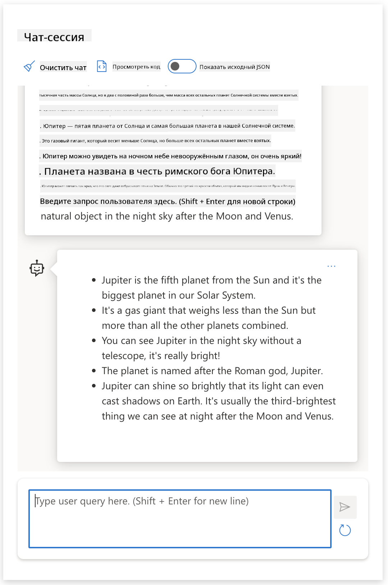

<!--
CO_OP_TRANSLATOR_METADATA:
{
  "original_hash": "dcbaaae026cb50fee071e690685b5843",
  "translation_date": "2025-08-26T13:55:08+00:00",
  "source_file": "04-prompt-engineering-fundamentals/README.md",
  "language_code": "ru"
}
-->
# Основы инженерии запросов

[](https://aka.ms/gen-ai-lesson4-gh?WT.mc_id=academic-105485-koreyst)

## Введение
В этом модуле рассматриваются ключевые понятия и техники создания эффективных запросов для генеративных моделей ИИ. То, как вы формулируете свой запрос к LLM, тоже имеет значение. Тщательно составленный запрос может привести к более качественному ответу. Но что же означают такие термины, как _запрос_ и _инженерия запросов_? И как улучшить _входной запрос_, который я отправляю LLM? На эти вопросы мы попробуем ответить в этой и следующей главе.

_Генеративный ИИ_ способен создавать новый контент (например, текст, изображения, аудио, код и т.д.) в ответ на запросы пользователя. Это достигается с помощью _Больших языковых моделей_, таких как серия GPT ("Generative Pre-trained Transformer") от OpenAI, обученных работать с естественным языком и кодом.

Теперь пользователи могут взаимодействовать с этими моделями привычным способом — через чат, без необходимости технических знаний или специальной подготовки. Модели работают на основе _запросов_ — пользователь отправляет текстовый запрос и получает ответ от ИИ (completion). Можно вести диалог с ИИ, уточняя запросы в несколько этапов, пока ответ не будет соответствовать ожиданиям.

"Запросы" становятся основным _интерфейсом программирования_ для приложений на базе генеративного ИИ, определяя задачи для моделей и влияя на качество получаемых ответов. "Инженерия запросов" — быстро развивающаяся область, посвящённая _разработке и оптимизации_ запросов для получения стабильных и качественных ответов в большом масштабе.

## Цели обучения

В этом уроке мы узнаем, что такое инженерия запросов, почему она важна и как создавать более эффективные запросы для конкретной модели и задачи. Мы разберём основные понятия и лучшие практики инженерии запросов, а также познакомимся с интерактивной средой "песочницы" на базе Jupyter Notebooks, где можно увидеть применение этих концепций на реальных примерах.

К концу урока вы сможете:

1. Объяснить, что такое инженерия запросов и почему она важна.
2. Описать компоненты запроса и их назначение.
3. Изучить лучшие практики и техники инженерии запросов.
4. Применять изученные техники на реальных примерах, используя OpenAI endpoint.

## Ключевые термины

Инженерия запросов: Практика разработки и доработки входных данных для управления работой моделей ИИ и получения желаемых результатов.
Токенизация: Процесс преобразования текста в более мелкие единицы — токены, которые модель может понимать и обрабатывать.
LLM, обученные на инструкциях: Большие языковые модели (LLM), дообученные с использованием специальных инструкций для повышения точности и релевантности ответов.

## Песочница для обучения

Инженерия запросов сейчас больше искусство, чем наука. Лучший способ развить интуицию — _практиковаться_ и использовать метод проб и ошибок, сочетая знания предметной области с рекомендованными техниками и оптимизациями для конкретных моделей.

Jupyter Notebook, сопровождающий этот урок, предоставляет _песочницу_, где вы можете сразу пробовать изученное — по ходу урока или в рамках задания в конце. Для выполнения упражнений вам потребуется:

1. **Ключ API Azure OpenAI** — endpoint сервиса с развернутой LLM.
2. **Среда выполнения Python** — для запуска Notebook.
3. **Локальные переменные среды** — _выполните шаги из [SETUP](./../00-course-setup/02-setup-local.md?WT.mc_id=academic-105485-koreyst) для подготовки_.

В ноутбуке есть _стартовые_ упражнения, но вы можете добавлять свои собственные разделы _Markdown_ (описание) и _Code_ (запросы), чтобы попробовать больше примеров или идей — и развить свою интуицию по созданию запросов.

## Иллюстрированное руководство

Хотите получить общее представление о содержании урока перед началом? Посмотрите это иллюстрированное руководство — оно поможет понять основные темы и ключевые выводы, на которые стоит обратить внимание. Дорожная карта урока ведёт от понимания базовых концепций и проблем к их решению с помощью соответствующих техник инженерии запросов и лучших практик. Обратите внимание, что раздел "Продвинутые техники" в этом руководстве относится к материалу _следующей_ главы курса.


## Наш стартап

Теперь давайте обсудим, как _эта тема_ связана с нашей миссией стартапа — [привнести инновации ИИ в образование](https://educationblog.microsoft.com/2023/06/collaborating-to-bring-ai-innovation-to-education?WT.mc_id=academic-105485-koreyst). Мы хотим создавать приложения с ИИ для _персонализированного обучения_ — давайте подумаем, как разные пользователи нашего приложения могут "конструировать" запросы:

- **Администраторы** могут попросить ИИ _проанализировать учебные программы и выявить пробелы_. ИИ может суммировать результаты или визуализировать их с помощью кода.
- **Преподаватели** могут попросить ИИ _создать план урока для определённой аудитории и темы_. ИИ может подготовить персонализированный план в заданном формате.
- **Студенты** могут попросить ИИ _помочь разобраться со сложным предметом_. ИИ может проводить уроки, давать подсказки и примеры, адаптированные к уровню студента.

Это только верхушка айсберга. Посмотрите [Prompts For Education](https://github.com/microsoft/prompts-for-edu/tree/main?WT.mc_id=academic-105485-koreyst) — открытую библиотеку запросов, собранную экспертами в образовании, чтобы получить более широкое представление о возможностях! _Попробуйте запустить некоторые из этих запросов в песочнице или через OpenAI Playground и посмотрите, что получится!_

<!--
ШАБЛОН УРОКА:
В этом разделе раскрывается базовая концепция №1.
Закрепите материал примерами и ссылками.

КОНЦЕПЦИЯ №1:
Инженерия запросов.
Дайте определение и объясните, зачем она нужна.
-->

## Что такое инженерия запросов?

В начале урока мы определили **инженерию запросов** как процесс _разработки и оптимизации_ текстовых входных данных (запросов) для получения стабильных и качественных ответов (completions) в рамках конкретной задачи и модели. Это можно представить как двухэтапный процесс:

- _разработка_ начального запроса для выбранной модели и задачи
- _доработка_ запроса в несколько этапов для повышения качества ответа

Это обязательно процесс проб и ошибок, требующий интуиции и усилий пользователя для достижения оптимального результата. Почему это важно? Чтобы ответить на этот вопрос, нужно понять три концепции:

- _Токенизация_ = как модель "видит" запрос
- _Базовые LLM_ = как основная модель "обрабатывает" запрос
- _LLM, обученные на инструкциях_ = как модель теперь может видеть "задачи"

### Токенизация

LLM воспринимает запросы как _последовательность токенов_, причём разные модели (или версии одной модели) могут токенизировать один и тот же запрос по-разному. Поскольку LLM обучаются на токенах (а не на исходном тексте), способ токенизации напрямую влияет на качество генерируемого ответа.

Чтобы понять, как работает токенизация, попробуйте такие инструменты, как [OpenAI Tokenizer](https://platform.openai.com/tokenizer?WT.mc_id=academic-105485-koreyst), показанный ниже. Вставьте свой запрос и посмотрите, как он преобразуется в токены, обратите внимание на обработку пробелов и знаков препинания. Учтите, что пример показывает работу старой LLM (GPT-3) — с более новой моделью результат может отличаться.


### Концепция: базовые модели

После токенизации основная задача ["базовой LLM"](https://blog.gopenai.com/an-introduction-to-base-and-instruction-tuned-large-language-models-8de102c785a6?WT.mc_id=academic-105485-koreyst) (или Foundation model) — предсказать следующий токен в последовательности. Поскольку LLM обучены на огромных текстовых датасетах, они хорошо понимают статистические связи между токенами и могут делать такие предсказания с определённой уверенностью. При этом они не понимают _смысла_ слов или токенов в запросе; они просто видят шаблон, который могут "дополнить" следующим предсказанием. Модель может продолжать предсказывать последовательность до вмешательства пользователя или наступления заранее заданного условия.

Хотите увидеть, как работает дополнение по запросу? Введите вышеуказанный запрос в [_Chat Playground_](https://oai.azure.com/playground?WT.mc_id=academic-105485-koreyst) Azure OpenAI Studio с настройками по умолчанию. Система воспринимает запросы как просьбы о предоставлении информации — вы должны получить дополнение, соответствующее этому контексту.

А что если пользователь хочет получить что-то конкретное, соответствующее определённым критериям или задаче? Здесь на помощь приходят LLM, обученные на инструкциях.


### Концепция: LLM, обученные на инструкциях

[LLM, обученная на инструкциях](https://blog.gopenai.com/an-introduction-to-base-and-instruction-tuned-large-language-models-8de102c785a6?WT.mc_id=academic-105485-koreyst) начинается с базовой модели и дообучается на примерах или парах "вход/выход" (например, многоэтапных "сообщениях"), которые содержат чёткие инструкции — и ответ ИИ старается этим инструкциям следовать.

Для этого используются техники, такие как обучение с подкреплением и обратной связью от человека (RLHF), которые позволяют модели _следовать инструкциям_ и _учиться на обратной связи_, чтобы ответы были более полезными для практических задач и релевантными целям пользователя.

Давайте попробуем — вернитесь к предыдущему запросу, но теперь измените _system message_, чтобы добавить такую инструкцию в контекст:

> _Сделай краткое изложение предоставленного материала для ученика второго класса. Оставь результат в виде одного абзаца с 3-5 пунктами._

Видите, как результат теперь соответствует желаемой цели и формату? Преподаватель может сразу использовать этот ответ в своих слайдах для урока.



## Зачем нужна инженерия запросов?

Теперь, когда мы знаем, как LLM обрабатывают запросы, поговорим о _причинах_ необходимости инженерии запросов. Дело в том, что современные LLM имеют ряд особенностей, из-за которых _надёжные и стабильные ответы_ сложно получить без усилий по созданию и оптимизации запросов. Например:

1. **Ответы моделей стохастичны.** _Один и тот же запрос_ скорее всего даст разные ответы на разных моделях или их версиях. И даже на _одной и той же модели_ результат может отличаться в разное время. _Техники инженерии запросов помогают минимизировать эти различия, задавая чёткие рамки._

1. **Модели могут придумывать ответы.** Модели обучены на _больших, но ограниченных_ датасетах, поэтому не знают о концепциях вне этих данных. В результате они могут выдавать ответы, которые неточны, вымышлены или противоречат известным фактам. _Техники инженерии запросов помогают выявлять и снижать такие "выдумки", например, запрашивая у ИИ ссылки или объяснения._

1. **Возможности моделей различаются.** Новые модели или поколения моделей обладают большими возможностями, но также имеют свои особенности и компромиссы по стоимости и сложности. _Инженерия запросов помогает выработать лучшие практики и рабочие процессы, которые скрывают различия и адаптируются к требованиям конкретных моделей масштабируемо и удобно._

Давайте посмотрим это на практике в OpenAI или Azure OpenAI Playground:

- Используйте один и тот же запрос с разными LLM (например, OpenAI, Azure OpenAI, Hugging Face) — заметили различия?
- Используйте один и тот же запрос несколько раз на _одной и той же_ LLM (например, Azure OpenAI playground) — чем отличаются ответы?

### Пример "выдумок"

В этом курсе мы используем термин **"выдумка"** для обозначения ситуации, когда LLM иногда генерируют фактически неверную информацию из-за ограничений обучения или других причин. Возможно, вы встречали термин _"галлюцинации"_ в популярных статьях или научных работах. Однако мы настоятельно рекомендуем использовать термин _"выдумка"_, чтобы не приписывать машине человеческие качества и не очеловечивать её поведение. Это также соответствует [принципам ответственного ИИ](https://www.microsoft.com/ai/responsible-ai?WT.mc_id=academic-105485-koreyst) с точки зрения терминологии, исключая слова, которые могут быть сочтены оскорбительными или неинклюзивными в некоторых контекстах.

Хотите понять, как работают выдумки? Придумайте запрос, который заставит ИИ сгенерировать контент по несуществующей теме (чтобы её точно не было в обучающем датасете). Например — я попробовал такой запрос:
# План урока: Марсианская война 2076 года

## Цели урока

- Познакомить учащихся с причинами, ходом и последствиями Марсианской войны 2076 года.
- Развивать навыки критического мышления через анализ исторических событий.
- Обсудить влияние войны на отношения между Землей и Марсом.

## Введение

Марсианская война 2076 года стала одним из самых значимых конфликтов в истории человечества. В этом уроке мы рассмотрим предпосылки войны, ключевые события и ее долгосрочные последствия для обеих планет.

## Краткая историческая справка

- К 2076 году на Марсе существовали независимые колонии, которые стремились к автономии от Земли.
- Экономические разногласия, борьба за ресурсы и политические противоречия привели к нарастанию напряженности.
- Война началась после серии дипломатических провалов и инцидентов на орбитальных станциях.

## Основные этапы войны

1. **Начало конфликта**
   - Описание первых столкновений между марсианскими и земными силами.
   - Роль новых технологий в ведении боевых действий.

2. **Ключевые битвы**
   - Битва за Олимп — крупнейшее сражение на поверхности Марса.
   - Использование автономных дронов и кибероружия.

3. **Переломный момент**
   - Вмешательство нейтральных колоний.
   - Переговоры о перемирии и их срыв.

4. **Завершение войны**
   - Подписание мирного договора.
   - Раздел сфер влияния и новые правила сотрудничества.

## Последствия войны

- Изменение политической карты Марса.
- Усиление контроля над ресурсами и технологиями.
- Влияние на развитие межпланетных отношений и международного права.

## Дискуссия

- Почему дипломатия не смогла предотвратить конфликт?
- Как война изменила взгляды на независимость колоний?
- Какие уроки можно извлечь для будущих поколений?

## Практическое задание

- Провести исследование: сравнить Марсианскую войну 2076 года с другими крупными межпланетными конфликтами.
- Написать эссе на тему: "Как Марсианская война повлияла на развитие человечества?"

## Рекомендации по дополнительному чтению

- "История Марса: от колонизации до войны"
- "Межпланетная дипломатия: вызовы и перспективы"
- "Технологии будущего: оружие и защита в XXI веке"

## Итоги урока

- Учащиеся познакомились с ключевыми событиями Марсианской войны 2076 года.
- Обсудили причины и последствия конфликта.
- Получили навыки анализа исторических процессов и их влияния на современность.
Веб-поиск показал, что существуют вымышленные описания (например, телесериалы или книги) о марсианских войнах — но ни одного из 2076 года. Логика также подсказывает, что 2076 год — это _будущее_, а значит, не может быть связан с реальным событием.

Что же произойдет, если мы запустим этот запрос у разных LLM-провайдеров?

> **Ответ 1**: OpenAI Playground (GPT-35)


> **Ответ 2**: Azure OpenAI Playground (GPT-35)


> **Ответ 3**: : Hugging Face Chat Playground (LLama-2)


Как и ожидалось, каждая модель (или версия модели) выдает немного разные ответы благодаря стохастическому поведению и различиям в возможностях моделей. Например, одна модель ориентируется на аудиторию восьмого класса, а другая — на старшеклассников. Но все три модели сгенерировали ответы, которые могли бы убедить неосведомленного пользователя в реальности события.

Техники инженерии запросов, такие как _метапромптинг_ и _настройка температуры_, могут частично снизить количество выдумок модели. Новые _архитектуры_ инженерии запросов также органично внедряют новые инструменты и методы в поток промпта, чтобы смягчить или уменьшить некоторые из этих эффектов.

## Кейс: GitHub Copilot

Давайте завершим этот раздел, посмотрев, как инженерия запросов применяется в реальных решениях, на примере одного кейса: [GitHub Copilot](https://github.com/features/copilot?WT.mc_id=academic-105485-koreyst).

GitHub Copilot — это ваш "AI-помощник-программист": он преобразует текстовые запросы в автодополнения кода и интегрируется в вашу среду разработки (например, Visual Studio Code) для максимально удобной работы. Как описано в серии блогов ниже, самая ранняя версия была основана на модели OpenAI Codex — и инженеры быстро поняли необходимость дообучения модели и разработки более эффективных техник инженерии запросов для повышения качества кода. В июле они [представили улучшенную AI-модель, которая превосходит Codex](https://github.blog/2023-07-28-smarter-more-efficient-coding-github-copilot-goes-beyond-codex-with-improved-ai-model/?WT.mc_id=academic-105485-koreyst) и предлагает еще более быстрые подсказки.

Читайте посты по порядку, чтобы проследить их путь обучения.

- **Май 2023** | [GitHub Copilot стал лучше понимать ваш код](https://github.blog/2023-05-17-how-github-copilot-is-getting-better-at-understanding-your-code/?WT.mc_id=academic-105485-koreyst)
- **Май 2023** | [Внутри GitHub: Работа с LLM, лежащими в основе GitHub Copilot](https://github.blog/2023-05-17-inside-github-working-with-the-llms-behind-github-copilot/?WT.mc_id=academic-105485-koreyst).
- **Июн 2023** | [Как писать лучшие запросы для GitHub Copilot](https://github.blog/2023-06-20-how-to-write-better-prompts-for-github-copilot/?WT.mc_id=academic-105485-koreyst).
- **Июл 2023** | [.. GitHub Copilot выходит за рамки Codex с улучшенной AI-моделью](https://github.blog/2023-07-28-smarter-more-efficient-coding-github-copilot-goes-beyond-codex-with-improved-ai-model/?WT.mc_id=academic-105485-koreyst)
- **Июл 2023** | [Руководство разработчика по инженерии запросов и LLM](https://github.blog/2023-07-17-prompt-engineering-guide-generative-ai-llms/?WT.mc_id=academic-105485-koreyst)
- **Сен 2023** | [Как создать корпоративное LLM-приложение: уроки от GitHub Copilot](https://github.blog/2023-09-06-how-to-build-an-enterprise-llm-application-lessons-from-github-copilot/?WT.mc_id=academic-105485-koreyst)

Вы также можете просмотреть их [инженерный блог](https://github.blog/category/engineering/?WT.mc_id=academic-105485-koreyst) для других публикаций, например, [этой](https://github.blog/2023-09-27-how-i-used-github-copilot-chat-to-build-a-reactjs-gallery-prototype/?WT.mc_id=academic-105485-koreyst), где показано, как эти модели и техники _применяются_ для создания реальных приложений.

---

## Конструирование запроса

Мы уже увидели, почему инженерия запросов важна — теперь разберемся, как запросы _конструируются_, чтобы мы могли оценить разные техники для более эффективного проектирования промптов.

### Базовый запрос

Начнем с базового запроса: текстовый ввод, отправляемый модели без дополнительного контекста. Вот пример — если мы отправим первые слова гимна США в [Completion API OpenAI](https://platform.openai.com/docs/api-reference/completions?WT.mc_id=academic-105485-koreyst), он тут же _дополнит_ ответ следующими строками, демонстрируя базовое предсказательное поведение.

| Запрос (Input)     | Дополнение (Output)                                                                                                                        |
| :----------------- | :----------------------------------------------------------------------------------------------------------------------------------------- |
| Oh say can you see | Похоже, вы начинаете текст гимна США "The Star-Spangled Banner". Полный текст выглядит так: ... |

### Сложный запрос

Теперь добавим контекст и инструкции к базовому запросу. [Chat Completion API](https://learn.microsoft.com/azure/ai-services/openai/how-to/chatgpt?WT.mc_id=academic-105485-koreyst) позволяет нам строить сложный запрос как набор _сообщений_ с:

- Парами ввода/вывода, отражающими _ввод пользователя_ и _ответ ассистента_.
- Системным сообщением, задающим контекст поведения или "личности" ассистента.

Теперь запрос выглядит так, где _токенизация_ эффективно захватывает релевантную информацию из контекста и диалога. Теперь изменение системного контекста может так же сильно влиять на качество ответов, как и сами пользовательские запросы.

```python
response = openai.chat.completions.create(
    model="gpt-3.5-turbo",
    messages=[
        {"role": "system", "content": "You are a helpful assistant."},
        {"role": "user", "content": "Who won the world series in 2020?"},
        {"role": "assistant", "content": "The Los Angeles Dodgers won the World Series in 2020."},
        {"role": "user", "content": "Where was it played?"}
    ]
)
```

### Инструкционный запрос

В приведенных выше примерах пользовательский запрос был простым текстовым вопросом, который можно трактовать как просьбу о информации. С помощью _инструкционных_ запросов мы можем использовать текст для более детального задания задачи, давая ИИ более четкие указания. Вот пример:

| Запрос (Input)                                                                                                                                                                                                                         | Дополнение (Output)                                                                                                        | Тип инструкции      |
| :------------------------------------------------------------------------------------------------------------------------------------------------------------------------------------------------------------------------------------- | :------------------------------------------------------------------------------------------------------------------------- | :------------------ |
| Напиши описание Гражданской войны                                                                                                                                                                | _вернулся простой абзац_                                                                                                  | Простой             |
| Напиши описание Гражданской войны. Укажи ключевые даты и события и опиши их значение                                                                                                            | _вернулся абзац, а затем список ключевых дат событий с описаниями_                                                        | Сложный             |
| Напиши описание Гражданской войны в 1 абзаце. Приведи 3 пункта с ключевыми датами и их значением. Приведи еще 3 пункта с ключевыми историческими личностями и их вкладом. Верни результат в формате JSON | _вернулись более подробные сведения в текстовом поле, оформленные в формате JSON, который можно скопировать и проверить_   | Сложный. Форматированный. |

## Основное содержимое

В приведенных выше примерах запрос был довольно открытым, позволяя LLM самостоятельно решать, какая часть ее обучающего датасета релевантна. В паттерне _основного содержимого_ входной текст делится на две части:

- инструкция (действие)
- релевантное содержимое (влияет на действие)

Вот пример, где инструкция — "суммируй это в 2 предложения".

| Запрос (Input)                                                                                                                                                                                                                                                                                                                                                                                                                                                                                                                                                                                                                                                                                      | Дополнение (Output)                                                                                                                                                                                                                                                                             |
| :-------------------------------------------------------------------------------------------------------------------------------------------------------------------------------------------------------------------------------------------------------------------------------------------------------------------------------------------------------------------------------------------------------------------------------------------------------------------------------------------------------------------------------------------------------------------------------------------------------------------------------------------------------------------------------------------------- | :---------------------------------------------------------------------------------------------------------------------------------------------------------------------------------------------------------------------------------------------------------------------------------------------- |
| Юпитер — пятая планета от Солнца и самая большая в Солнечной системе. Это газовый гигант с массой, составляющей одну тысячную от массы Солнца, но в два с половиной раза больше массы всех остальных планет Солнечной системы вместе взятых. Юпитер — один из самых ярких объектов, видимых невооруженным глазом на ночном небе, и был известен древним цивилизациям еще до появления письменности. Он назван в честь римского бога Юпитера.[19] С Земли Юпитер может быть настолько ярким, что его отраженный свет отбрасывает видимые тени,[20] и в среднем это третий по яркости естественный объект на ночном небе после Луны и Венеры. <br/> **Суммируй это в 2 коротких предложения** | Юпитер — пятая планета от Солнца и самая большая в Солнечной системе, известная как один из самых ярких объектов на ночном небе. Названный в честь римского бога Юпитера, это газовый гигант, масса которого в два с половиной раза больше массы всех остальных планет вместе взятых. |

Сегмент основного содержимого можно использовать по-разному для более эффективных инструкций:

- **Примеры** — вместо явной инструкции, что делать, дайте модели примеры желаемого результата и позвольте ей вывести закономерность.
- **Подсказки** — после инструкции добавьте "подсказку", которая задает направление для продолжения, направляя модель к более релевантным ответам.
- **Шаблоны** — это повторяемые "рецепты" запросов с заполнителями (переменными), которые можно подставлять для конкретных задач.

Давайте рассмотрим эти подходы на практике.

### Использование примеров

Это подход, при котором вы "кормите модель" примерами желаемого результата для определенной инструкции и позволяете ей вывести закономерность для нужного вывода. В зависимости от количества примеров различают zero-shot, one-shot, few-shot prompting и т.д.

Теперь запрос состоит из трех компонентов:

- Описание задачи
- Несколько примеров желаемого результата
- Начало нового примера (которое становится неявным описанием задачи)

| Тип обучения | Запрос (Input)                                                                                                                                        | Дополнение (Output)         |
| :----------- | :---------------------------------------------------------------------------------------------------------------------------------------------------- | :-------------------------- |
| Zero-shot    | "The Sun is Shining". Translate to Spanish                                                                                                            | "El Sol está brillando".    |
| One-shot     | "The Sun is Shining" => ""El Sol está brillando". <br> "It's a Cold and Windy Day" =>                                                                 | "Es un día frío y ventoso". |
| Few-shot     | The player ran the bases => Baseball <br/> The player hit an ace => Tennis <br/> The player hit a six => Cricket <br/> The player made a slam-dunk => | Basketball                  |
|              |                                                                                                                                                       |                             |

Обратите внимание, что в zero-shot prompting мы дали явную инструкцию ("Translate to Spanish"), но в one-shot она уже выводится из примера. Few-shot показывает, как добавление примеров позволяет моделям делать более точные выводы без дополнительных инструкций.

### Подсказки в запросе

Еще один способ использования основного содержимого — давать _подсказки_ вместо примеров. В этом случае мы слегка направляем модель, _начав_ ответ с фрагмента, отражающего желаемый формат. Модель затем "подхватывает подсказку" и продолжает в том же духе.

| Количество подсказок | Запрос (Input)                                                                                                                                                                                                                                                                                                                                                                                                                                               | Дополнение (Output)                                                                                                                                                                                                                                                                                       |
| :------------------- | :----------------------------------------------------------------------------------------------------------------------------------------------------------------------------------------------------------------------------------------------------------------------------------------------------------------------------------------------------------------------------------------------------------------------------------------------------------- | :-------------------------------------------------------------------------------------------------------------------------------------------------------------------------------------------------------------------------------------------------------------------------------------------------------- |
| 0                    | Юпитер — пятая планета от Солнца и самая большая в Солнечной системе. Это газовый гигант с массой, составляющей одну тысячную от массы Солнца, но в два с половиной раза больше массы всех остальных планет Солнечной системы вместе взятых. Юпитер — один из самых ярких объектов, видимых невооруженным глазом на ночном небе, и был известен древним цивилизациям еще до появления письменности.

**Кратко об этом**                                       | Юпитер — самая большая планета в нашей Солнечной системе и пятая по удалённости от Солнца. Это газовый гигант, масса которого составляет 1/1000 массы Солнца, но он тяжелее всех остальных планет вместе взятых. Древние цивилизации знали о Юпитере уже давно, и его легко увидеть на ночном небе. |
| 1              | Юпитер — пятая планета от Солнца и самая крупная в Солнечной системе. Это газовый гигант, масса которого составляет одну тысячную от массы Солнца, но в два с половиной раза больше массы всех остальных планет Солнечной системы вместе взятых. Юпитер — один из самых ярких объектов, видимых невооружённым глазом на ночном небе, и был известен древним цивилизациям ещё до появления письменности. <br/>**Кратко об этом** <br/> Мы узнали, что Юпитер | — пятая планета от Солнца и самая крупная в Солнечной системе. Это газовый гигант, масса которого составляет одну тысячную от массы Солнца, но в два с половиной раза больше массы всех остальных планет вместе взятых. Его легко увидеть невооружённым глазом, и он известен с древних времён.                        |
| 2              | Юпитер — пятая планета от Солнца и самая крупная в Солнечной системе. Это газовый гигант, масса которого составляет одну тысячную от массы Солнца, но в два с половиной раза больше массы всех остальных планет Солнечной системы вместе взятых. Юпитер — один из самых ярких объектов, видимых невооружённым глазом на ночном небе, и был известен древним цивилизациям ещё до появления письменности. <br/>**Кратко об этом** <br/> Топ-3 факта, которые мы узнали:         | 1. Юпитер — пятая планета от Солнца и самая крупная в Солнечной системе. <br/> 2. Это газовый гигант, масса которого составляет одну тысячную от массы Солнца...<br/> 3. Юпитер был виден невооружённым глазом с древних времён ...                                                                       |
|                |                                                                                                                                                                                                                                                                                                                                                                                                                                                              |                                                                                                                                                                                                                                                                                                           |

### Шаблоны подсказок

Шаблон подсказки — это _заранее подготовленный рецепт для подсказки_, который можно сохранить и использовать повторно, чтобы обеспечить более стабильный пользовательский опыт в большом масштабе. В самом простом виде это просто набор примеров подсказок, как [этот пример от OpenAI](https://platform.openai.com/examples?WT.mc_id=academic-105485-koreyst), который содержит как интерактивные компоненты подсказки (сообщения пользователя и системы), так и формат запроса для API — для поддержки повторного использования.

В более сложном виде, как [этот пример от LangChain](https://python.langchain.com/docs/concepts/prompt_templates/?WT.mc_id=academic-105485-koreyst), он содержит _заполнители_, которые можно заменить данными из разных источников (ввод пользователя, контекст системы, внешние источники данных и т.д.), чтобы динамически формировать подсказку. Это позволяет создавать библиотеку повторно используемых подсказок, которые можно применять для обеспечения стабильного пользовательского опыта **программно** в большом масштабе.

Главная ценность шаблонов — в возможности создавать и публиковать _библиотеки подсказок_ для конкретных областей применения, где шаблон подсказки уже _оптимизирован_ с учётом специфики приложения или примеров, что делает ответы более релевантными и точными для целевой аудитории. Репозиторий [Prompts For Edu](https://github.com/microsoft/prompts-for-edu?WT.mc_id=academic-105485-koreyst) — отличный пример такого подхода: он собирает библиотеку подсказок для сферы образования с акцентом на ключевые задачи, такие как планирование уроков, разработка учебных программ, помощь студентам и т.д.

## Вспомогательный контент

Если рассматривать построение подсказки как наличие инструкции (задачи) и основной информации (контента), то _вторичный контент_ — это дополнительный контекст, который мы предоставляем, чтобы **повлиять на результат**. Это могут быть параметры настройки, инструкции по форматированию, тематические таксономии и т.д., которые помогают модели _адаптировать_ свой ответ под нужные цели или ожидания пользователя.

Например: если у нас есть каталог курсов с подробными метаданными (название, описание, уровень, теги, преподаватель и т.д.) по всем доступным курсам в учебной программе:

- мы можем задать инструкцию "суммировать каталог курсов на осень 2023"
- мы можем использовать основной контент, чтобы привести несколько примеров желаемого результата
- мы можем использовать вторичный контент, чтобы выделить топ-5 интересующих "тегов".

Теперь модель может предоставить сводку в формате, показанном в примерах, но если у результата несколько тегов, она может отдать приоритет 5 тегам, указанным во вторичном контенте.

---

<!--
ШАБЛОН УРОКА:
В этом разделе нужно раскрыть ключевую концепцию №1.
Закрепите концепцию примерами и ссылками.

КОНЦЕПЦИЯ №3:
Техники инженерии подсказок.
Какие есть базовые техники для создания подсказок?
Поясните с помощью упражнений.
-->

## Лучшие практики создания подсказок

Теперь, когда мы знаем, как можно _составлять_ подсказки, стоит подумать о том, как их _разрабатывать_ с учётом лучших практик. Это можно рассматривать в двух аспектах — правильный _подход_ и применение нужных _техник_.

### Подход к инженерии подсказок

Инженерия подсказок — это процесс проб и ошибок, поэтому держите в уме три основных принципа:

1. **Понимание предметной области важно.** Точность и релевантность ответа зависят от _области_, в которой работает приложение или пользователь. Используйте свою интуицию и экспертизу, чтобы **дополнительно адаптировать техники**. Например, определяйте _специализированные роли_ в системных подсказках или используйте _шаблоны для конкретной области_ в пользовательских подсказках. Добавляйте вторичный контент, отражающий контекст области, или приводите _характерные примеры_, чтобы направить модель к привычным сценариям.

2. **Понимание модели важно.** Мы знаем, что модели по своей природе стохастичны. Но реализации моделей могут отличаться по используемым обучающим данным (предварительные знания), возможностям (например, через API или SDK) и типу контента, для которого они оптимизированы (код, изображения, текст и т.д.). Понимайте сильные и слабые стороны используемой модели и применяйте это знание для _приоритизации задач_ или создания _шаблонов_, оптимизированных под возможности модели.

3. **Итерации и проверка важны.** Модели быстро развиваются, как и техники создания подсказок. Как эксперт в своей области, у вас могут быть дополнительные критерии или контекст для _вашего_ приложения, которые не применимы к более широкой аудитории. Используйте инструменты и техники инженерии подсказок, чтобы "запустить" процесс, затем итеративно дорабатывайте и проверяйте результаты, опираясь на свою интуицию и экспертизу. Фиксируйте свои наблюдения и создавайте **базу знаний** (например, библиотеки подсказок), которую смогут использовать другие для ускорения итераций в будущем.

## Лучшие практики

Давайте рассмотрим распространённые лучшие практики, которые рекомендуют специалисты [OpenAI](https://help.openai.com/en/articles/6654000-best-practices-for-prompt-engineering-with-openai-api?WT.mc_id=academic-105485-koreyst) и [Azure OpenAI](https://learn.microsoft.com/azure/ai-services/openai/concepts/prompt-engineering#best-practices?WT.mc_id=academic-105485-koreyst).

| Что                              | Почему                                                                                                                                                                                                                                               |
| :-------------------------------- | :------------------------------------------------------------------------------------------------------------------------------------------------------------------------------------------------------------------------------------------------ |
| Оценивать последние модели.       | Новые поколения моделей, скорее всего, обладают улучшенными возможностями и качеством — но могут быть дороже. Оцените их влияние, а затем принимайте решение о переходе.                                                                                |
| Разделять инструкции и контекст   | Проверьте, определяет ли ваша модель/провайдер _разделители_ для более чёткого отделения инструкций, основного и вторичного контента. Это помогает моделям точнее расставлять приоритеты для токенов.                                                         |
| Быть конкретным и ясным             | Указывайте больше деталей о желаемом контексте, результате, длине, формате, стиле и т.д. Это повысит качество и стабильность ответов. Сохраняйте рецепты в повторно используемых шаблонах.                                                          |
| Быть описательным, приводить примеры      | Модели лучше реагируют на подход "покажи и расскажи". Начните с подхода `zero-shot`, когда вы даёте только инструкцию (без примеров), затем попробуйте `few-shot` — добавьте несколько примеров желаемого результата. Используйте аналогии. |
| Использовать подсказки для старта ответа | Подтолкните модель к нужному результату, дав ей начальные слова или фразы, которые она может использовать как отправную точку для ответа.                                                                                                               |
| Повторять важное                       | Иногда нужно повторить инструкцию для модели. Давайте инструкции до и после основного контента, используйте инструкцию и подсказку и т.д. Итеративно проверяйте, что работает лучше.                                                         |
| Порядок имеет значение                     | Порядок подачи информации модели может влиять на результат, даже в обучающих примерах, из-за эффекта недавности. Пробуйте разные варианты, чтобы найти оптимальный.                                                               |
| Дать модели "выход"           | Дайте модели _резервный_ вариант ответа, который она может выдать, если не может выполнить задачу по какой-либо причине. Это снижает вероятность генерации ложных или вымышленных ответов.                                                         |
|                                   |                                                                                                                                                                                                                                                   |

Как и с любыми лучшими практиками, помните, что _ваш опыт может отличаться_ в зависимости от модели, задачи и области. Используйте их как отправную точку и дорабатывайте под себя. Постоянно пересматривайте свой процесс создания подсказок по мере появления новых моделей и инструментов, уделяя внимание масштабируемости и качеству ответов.

<!--
ШАБЛОН УРОКА:
В этом разделе нужно предложить задание по коду, если это уместно

ЗАДАНИЕ:
Ссылка на Jupyter Notebook, где в инструкциях только комментарии к коду (секции кода пустые).

РЕШЕНИЕ:
Ссылка на копию этого Notebook с заполненными и выполненными подсказками, чтобы показать возможный пример.
-->

## Задание

Поздравляем! Вы дошли до конца урока! Пора применить некоторые из этих концепций и техник на практике с реальными примерами!

Для задания мы будем использовать Jupyter Notebook с упражнениями, которые вы сможете выполнять интерактивно. Вы также можете расширять Notebook своими Markdown- и Code-ячейками, чтобы самостоятельно исследовать идеи и техники.

### Чтобы начать, сделайте fork репозитория, затем

- (Рекомендуется) Запустите GitHub Codespaces
- (Либо) Клонируйте репозиторий на своё устройство и используйте с Docker Desktop
- (Либо) Откройте Notebook в предпочитаемой среде выполнения.

### Далее настройте переменные окружения

- Скопируйте файл `.env.copy` из корня репозитория в `.env` и заполните значения `AZURE_OPENAI_API_KEY`, `AZURE_OPENAI_ENDPOINT` и `AZURE_OPENAI_DEPLOYMENT`. Вернитесь к разделу [Learning Sandbox](../../../04-prompt-engineering-fundamentals/04-prompt-engineering-fundamentals), чтобы узнать, как это сделать.

### Затем откройте Jupyter Notebook

- Выберите ядро выполнения. Если используете варианты 1 или 2, просто выберите стандартное ядро Python 3.10.x, предоставляемое dev-контейнером.

Всё готово для выполнения упражнений. Обратите внимание, что здесь нет _правильных и неправильных_ ответов — вы просто исследуете варианты методом проб и ошибок и формируете интуицию для работы с конкретной моделью и областью применения.

_По этой причине в этом уроке нет разделов с готовыми решениями кода. Вместо этого в Notebook будут Markdown-ячейки с заголовком "Моё решение:", где приведён пример результата для ориентира._

 <!--
ШАБЛОН УРОКА:
Завершите раздел кратким итогом и ресурсами для самостоятельного изучения.
-->

## Проверка знаний

Какой из следующих вариантов подсказки соответствует лучшим практикам?

1. Покажи мне изображение красной машины
2. Покажи мне изображение красной машины марки Volvo и модели XC90, припаркованной у обрыва на фоне заката
3. Покажи мне изображение красной машины марки Volvo и модели XC90

Ответ: 2, это лучшая подсказка, так как она уточняет "что" нужно и даёт детали (не просто любая машина, а конкретная марка и модель), а также описывает общий антураж. 3 — следующий по качеству вариант, так как тоже содержит много описания.

## 🚀 Задание

Попробуйте применить технику "подсказки" с запросом: Дополните предложение "Покажи мне изображение красной машины марки Volvo и ". Какой будет ответ, и как бы вы его улучшили?

## Отличная работа! Продолжайте обучение

Хотите узнать больше о различных концепциях инженерии подсказок? Перейдите на [страницу для продолжения обучения](https://aka.ms/genai-collection?WT.mc_id=academic-105485-koreyst), чтобы найти другие полезные ресурсы по этой теме.

Переходите к уроку 5, где мы рассмотрим [продвинутые техники создания подсказок](../05-advanced-prompts/README.md?WT.mc_id=academic-105485-koreyst)!

---

**Отказ от ответственности**:  
Этот документ был переведен с помощью сервиса автоматического перевода [Co-op Translator](https://github.com/Azure/co-op-translator). Несмотря на стремление к точности, автоматические переводы могут содержать ошибки или неточности. Оригинальный документ на исходном языке следует считать авторитетным источником. Для получения критически важной информации рекомендуется использовать профессиональный человеческий перевод. Мы не несём ответственности за любые недоразумения или неправильные толкования, возникшие в результате использования данного перевода.