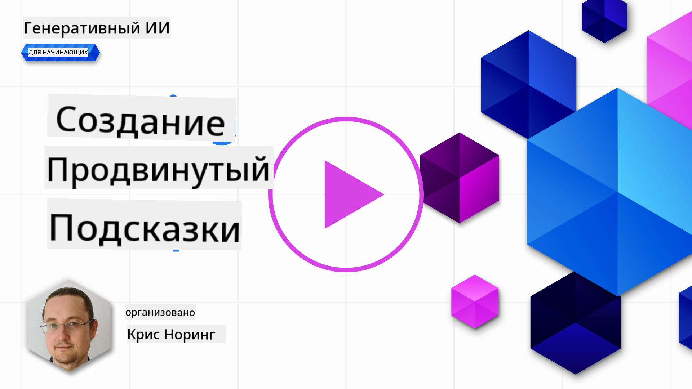

<!--
CO_OP_TRANSLATOR_METADATA:
{
  "original_hash": "ffb706de93ef518f31e0a675c66dfce1",
  "translation_date": "2025-10-17T15:01:01+00:00",
  "source_file": "05-advanced-prompts/README.md",
  "language_code": "ru"
}
-->
# Создание сложных запросов

[](https://youtu.be/BAjzkaCdRok?si=NmUIyRf7-cDgbjtt)

Давайте вспомним основные моменты из предыдущей главы:

> Инженерия запросов — это процесс, с помощью которого мы **направляем модель к более релевантным ответам**, предоставляя более полезные инструкции или контекст.

Существует два этапа написания запросов: создание запроса, предоставляя релевантный контекст, и второй этап — _оптимизация_, то есть постепенное улучшение запроса.

На данный момент у нас есть базовое понимание того, как писать запросы, но нам нужно углубиться. В этой главе вы перейдете от экспериментов с различными запросами к пониманию, почему один запрос лучше другого. Вы научитесь создавать запросы, используя основные техники, которые можно применить к любой модели LLM.

## Введение

В этой главе мы рассмотрим следующие темы:

- Расширение знаний о инженерии запросов путем применения различных техник к вашим запросам.
- Настройка запросов для изменения выходных данных.

## Цели обучения

После завершения этого урока вы сможете:

- Применять техники инженерии запросов, которые улучшают результаты ваших запросов.
- Выполнять запросы, которые могут быть либо разнообразными, либо детерминированными.

## Инженерия запросов

Инженерия запросов — это процесс создания запросов, которые приведут к желаемому результату. Это не просто написание текстового запроса. Инженерия запросов — это не инженерная дисциплина, а скорее набор техник, которые можно применить для достижения желаемого результата.

### Пример запроса

Возьмем простой запрос, например:

> Сгенерируйте 10 вопросов по географии.

В этом запросе вы фактически применяете набор различных техник запросов.

Давайте разберем его.

- **Контекст**: вы указываете, что запрос должен быть о "географии".
- **Ограничение вывода**: вы хотите не более 10 вопросов.

### Ограничения простых запросов

Вы можете получить или не получить желаемый результат. Вопросы будут сгенерированы, но география — это большая тема, и вы можете не получить то, что хотите, по следующим причинам:

- **Большая тема**: вы не знаете, будет ли это о странах, столицах, реках и так далее.
- **Формат**: что если вы хотите, чтобы вопросы были оформлены определенным образом?

Как видите, при создании запросов нужно учитывать множество факторов.

До сих пор мы видели пример простого запроса, но генеративный ИИ способен на гораздо большее, чтобы помочь людям в различных ролях и отраслях. Давайте рассмотрим некоторые основные техники.

### Техники запросов

Сначала нам нужно понять, что запросы — это _возникающее_ свойство модели LLM, то есть это не функция, встроенная в модель, а то, что мы обнаруживаем в процессе использования модели.

Существуют некоторые основные техники, которые мы можем использовать для запросов к LLM. Давайте их изучим.

- **Запрос без примеров**: это самая базовая форма запроса. Это одиночный запрос, который запрашивает ответ от LLM исключительно на основе его обучающих данных.
- **Запрос с несколькими примерами**: этот тип запроса направляет LLM, предоставляя 1 или несколько примеров, на которые он может опираться для генерации ответа.
- **Цепочка рассуждений**: этот тип запроса учит LLM разбивать проблему на шаги.
- **Сгенерированные знания**: чтобы улучшить ответ запроса, вы можете дополнительно предоставить сгенерированные факты или знания.
- **От простого к сложному**: как и цепочка рассуждений, эта техника заключается в разбивке проблемы на серию шагов и выполнении этих шагов по порядку.
- **Самоулучшение**: эта техника заключается в критике вывода LLM и последующем запросе на его улучшение.
- **Майевтический запрос**: здесь вы хотите убедиться, что ответ LLM правильный, и просите его объяснить различные части ответа. Это форма самоулучшения.

### Запрос без примеров

Этот стиль запроса очень прост, он состоит из одного запроса. Эта техника, вероятно, используется вами, когда вы только начинаете изучать LLM. Вот пример:

- Запрос: "Что такое алгебра?"
- Ответ: "Алгебра — это раздел математики, изучающий математические символы и правила их манипуляции."

### Запрос с несколькими примерами

Этот стиль запроса помогает модели, предоставляя несколько примеров вместе с запросом. Он состоит из одного запроса с дополнительными данными, специфичными для задачи. Вот пример:

- Запрос: "Напишите стихотворение в стиле Шекспира. Вот несколько примеров сонетов Шекспира:
  Сонет 18: 'Сравню ли тебя с летним днем? Ты прекраснее и умереннее...'
  Сонет 116: 'Не допущу препятствий в союзе истинных умов. Любовь не любовь, если она изменяется при изменении...'
  Сонет 132: 'Твои глаза я люблю, и они, как жалея меня, Зная твое сердце, мучают меня презрением,...'
  Теперь напишите сонет о красоте луны."
- Ответ: "На небесах луна мягко сияет, В серебристом свете, что нежно дарит свою милость,..."

Примеры предоставляют LLM контекст, формат или стиль желаемого вывода. Они помогают модели понять конкретную задачу и генерировать более точные и релевантные ответы.

### Цепочка рассуждений

Цепочка рассуждений — это очень интересная техника, так как она заключается в проведении LLM через серию шагов. Идея состоит в том, чтобы инструктировать LLM таким образом, чтобы она понимала, как что-то сделать. Рассмотрим следующий пример, с цепочкой рассуждений и без нее:

    - Запрос: "У Алисы 5 яблок, она выбрасывает 3 яблока, дает 2 Бобу, и Боб возвращает одно, сколько яблок у Алисы?"
    - Ответ: 5

LLM отвечает 5, что неверно. Правильный ответ — 1 яблоко, учитывая расчет (5 - 3 - 2 + 1 = 1).

Как мы можем научить LLM делать это правильно?

Попробуем цепочку рассуждений. Применение цепочки рассуждений означает:

1. Дать LLM похожий пример.
1. Показать расчет и как его правильно выполнить.
1. Предоставить оригинальный запрос.

Вот как это выглядит:

- Запрос: "У Лизы 7 яблок, она выбрасывает 1 яблоко, дает 4 яблока Барту, и Барт возвращает одно:
  7 - 1 = 6
  6 - 4 = 2
  2 + 1 = 3  
  У Алисы 5 яблок, она выбрасывает 3 яблока, дает 2 Бобу, и Боб возвращает одно, сколько яблок у Алисы?"
  Ответ: 1

Обратите внимание, как мы пишем значительно более длинные запросы с другим примером, расчетом и затем оригинальным запросом, и мы приходим к правильному ответу — 1.

Как видите, цепочка рассуждений — это очень мощная техника.

### Сгенерированные знания

Во многих случаях, когда вы хотите создать запрос, вы хотите сделать это, используя данные вашей компании. Вы хотите, чтобы часть запроса была от компании, а другая часть — это сам запрос, который вас интересует.

Например, вот как может выглядеть ваш запрос, если вы работаете в страховом бизнесе:

```text
{{company}}: {{company_name}}
{{products}}:
{{products_list}}
Please suggest an insurance given the following budget and requirements:
Budget: {{budget}}
Requirements: {{requirements}}
```

Выше вы видите, как запрос построен с использованием шаблона. В шаблоне есть несколько переменных, обозначенных `{{variable}}`, которые будут заменены реальными значениями из API компании.

Вот пример того, как запрос может выглядеть после замены переменных содержимым вашей компании:

```text
Insurance company: ACME Insurance
Insurance products (cost per month):
- Car, cheap, 500 USD
- Car, expensive, 1100 USD
- Home, cheap, 600 USD
- Home, expensive, 1200 USD
- Life, cheap, 100 USD

Please suggest an insurance given the following budget and requirements:
Budget: $1000
Requirements: Car, Home, and Life insurance
```

Запуск этого запроса через LLM приведет к следующему ответу:

```output
Given the budget and requirements, we suggest the following insurance package from ACME Insurance:
- Car, cheap, 500 USD
- Home, cheap, 600 USD
- Life, cheap, 100 USD
Total cost: $1,200 USD
```

Как видите, он также предлагает страхование жизни, чего не должно быть. Этот результат указывает на то, что нам нужно оптимизировать запрос, сделав его более ясным в отношении того, что можно разрешить. После некоторого _проб и ошибок_ мы приходим к следующему запросу:

```text
Insurance company: ACME Insurance
Insurance products (cost per month):
- type: Car, cheap, cost: 500 USD
- type: Car, expensive, cost: 1100 USD
- type: Home, cheap, cost: 600 USD
- type: Home, expensive, cost: 1200 USD
- type: Life, cheap, cost: 100 USD

Please suggest an insurance given the following budget and requirements:
Budget: $1000 restrict choice to types: Car, Home
```

Обратите внимание, как добавление _типа_ и _стоимости_, а также использование ключевого слова _ограничить_ помогает LLM понять, что мы хотим.

Теперь мы получаем следующий ответ:

```output
Given the budget and requirements, we suggest the Car, Cheap insurance product which costs 500 USD per month.
```

Цель этого примера была показать, что даже если мы используем базовую технику, такую как _сгенерированные знания_, нам все равно нужно оптимизировать запрос в большинстве случаев, чтобы получить желаемый результат.

### От простого к сложному

Идея техники "от простого к сложному" заключается в разбивке большой проблемы на подзадачи. Таким образом, вы помогаете направить LLM, как "покорить" большую проблему. Хорошим примером может быть задача в области анализа данных, где вы можете попросить LLM разделить проблему следующим образом:

> Запрос: Как выполнить анализ данных в 5 шагах?

Ваш AI-ассистент отвечает:

1. Сбор данных
1. Очистка данных
1. Анализ данных
1. Визуализация данных
1. Презентация данных

### Самоулучшение, критика результатов

С генеративными ИИ и LLM нельзя полностью доверять их выводам. Нужно их проверять. В конце концов, LLM просто представляет вам то, что наиболее вероятно сказать следующим, а не то, что является правильным. Поэтому хорошей идеей является запрос к LLM критиковать себя, что приводит нас к технике самоулучшения.

Как это работает:

1. Первоначальный запрос, в котором LLM решает проблему.
1. LLM отвечает.
1. Вы критикуете ответ и просите AI улучшить его.
1. LLM отвечает снова, учитывая критику и предлагая улучшенные решения.

Вы можете повторять этот процесс столько раз, сколько захотите.

Вот пример использования этой техники:

> Запрос: "Создайте Python Web API с маршрутами products и customers"

Ответ AI:

```python
import flask
app = Flask(__name__)

@app.route('/products')
def products():
    return 'Products'

@app.route('/customers')
def customers():
    return 'Customers'
```

> Запрос: предложите 3 улучшения к приведенному выше коду

Ответ AI:

```text
Sure, here are three suggestions to improve the code:

Import the correct module: The first line should import Flask instead of flask. The correct import statement should be from flask import Flask.

Add a main function: Add a if __name__ == '__main__': block to the end of the file to run the application when the file is executed.

Use f-strings: Use f-strings to format the return statements in the route functions. For example, return 'Products' can be changed to return f'This is the {request.path} page'.
```

```python
from flask import Flask, request

app = Flask(__name__)

@app.route('/products')
def products():
    return f'This is the {request.path} page'

@app.route('/customers')
def customers():
    return f'This is the {request.path} page'

if __name__ == '__main__':
    app.run()
```

Как видите, выше AI улучшает предложенный код благодаря критике первого ответа.

### Майевтический запрос

Майевтический запрос — это техника, которая похожа на самоулучшение, но больше связана с запросом LLM объяснить себя. Цель — уменьшить несоответствия в выводе LLM, чтобы убедиться, что он приходит к правильному ответу. Рабочий процесс следующий:

1. Попросите LLM ответить на вопрос.
1. Для каждой части ответа попросите LLM объяснить ее более подробно.
1. Если есть несоответствия, отбрасывайте части, которые не соответствуют.

Повторяйте шаги 2 и 3, пока не пройдете все части и не будете удовлетворены ответом.

Вот пример запроса:

> Запрос: Как я могу создать план действий для смягчения последствий пандемии в 5 шагах?
> Ответ LLM:

```text
1. Identify the risks
1. Identify the stakeholders
1. Identify the resources
1. Identify the actions
1. Identify the communication channels
```

Он определил 5 шагов, но можем ли мы определить, правильно ли это? Давайте попросим LLM объяснить каждый шаг:

> Запрос: Объясните первый шаг более подробно, какие риски подробно связаны с пандемией?

```text
The risks are the following:

- Loss of life
- Loss of business
- Loss of reputation
- Loss of customers
- Loss of employees
```

На этом этапе мы хотим убедиться, что LLM прав, поэтому просим его объяснить первый риск более подробно и надеемся, что он будет согласован с приведенным выше ответом:

> Запрос: В пандемии, какой самый большой риск и почему?

```text
The biggest risk is loss of life because it's the most important thing to protect.
```

> Какие два самых больших риска в пандемии?

```text
The two biggest risks are loss of life and loss of business.
```

На этом этапе LLM согласован и упоминает "жизнь" и "бизнес" как два самых больших риска. Теперь мы можем перейти к следующему шагу и чувствовать себя довольно уверенно. Однако мы не должны слепо доверять LLM, всегда следует проверять вывод.

## Изменение вывода

LLM по своей природе недетерминированны, что означает, что вы получите разные результаты каждый раз, когда запускаете один и тот же запрос. Попробуйте следующий запрос, например:

> "Сгенерируйте код для Python Web API"

```python
# Import necessary modules
import flask
from flask import request, jsonify

# Create a Flask app
app = flask.Flask(__name__)

# Create a route for the API
@app.route('/api', methods=['GET'])
def api():
    # Get the data from the request
    data = request.args

    # Process the data
    result = process_data(data)

    # Return the result as JSON
    return jsonify(result)

# Function to process the data
def process_data(data):
    # Do something with the data
    result = data + 1

    # Return the result
    return result

# Run the app
if __name__ == '__main__':
    app.run()

```

Запуск того же запроса снова генерирует немного другой ответ:

```python
#import necessary packages
import flask
from flask import request, jsonify

#create the Flask application
app = flask.Flask(__name__)
app.config["DEBUG"] = True

#create a list of books
books = [
    {'id': 0,
     'title': 'A Fire Upon the Deep',
     'author': 'Vernor Vinge',
     'first_sentence': 'The coldsleep itself was dreamless.',
     'year_published': '1992'},
    {'id': 1,
     'title': 'The Ones Who Walk Away From Omelas',
     'author': 'Ursula K. Le Guin',
     'first_sentence': 'With a clamor of bells that set the swallows soaring, the Festival of Summer came to the city Omelas, bright-towered by the sea.',
     'published': '1973'},
    {'id': 2,
     'title': 'Dhalgren',
     'author': 'Samuel R. Delany',
     'first_sentence': 'to wound the autumnal city.',
     'published': '1975'}
]

#create an endpoint for the API
@app.route('/', methods=['GET'])
def home():
    return '''<h1>Books API</h1>
<p>A prototype API for retrieving books.</p>'''

#create an endpoint to return all books
@app.route('/api/v1/resources/books/all', methods=['GET'])
def api_all():
    return jsonify(books)

#create an endpoint to return a single book
@app.route('/api/v1/resources/books', methods=['GET'])
def api_id():
    #check if an ID was provided as part of the URL
    #if ID is provided, assign it to a variable
    #if no ID is provided, display an error
    if 'id' in request.args:
        id = int(request.args['id'])
    else:
        return "Error: No id field provided. Please specify an id."

    #create an empty list for our results
    results = []

    #loop through the data and match results that fit the requested ID
    #IDs are unique, but other fields might return many results
    for book in books:
        if book['id'] == id:
            results.append(book)

    #use the jsonify function from Flask to convert our list of
    #Python dictionaries to the JSON format
    return jsonify(results)

app.run()
```

> Так является ли измененный вывод проблемой?

Зависит от того, что вы пытаетесь сделать. Если вы хотите получить конкретный ответ, то это проблема. Если вас устраивает измененный вывод, например, "Сгенерируйте любые 3 вопроса по географии", то это не проблема.

### Использование температуры для изменения вывода

Итак, мы решили, что хотим ограничить вывод, чтобы он был более предсказуемым, то есть более детерминированным. Как это сделать?

Температура — это значение от 0 до 1, где 0 — наиболее детерминированное, а 1 — наиболее разнообразное. Значение по умолчанию — 0.7. Давайте посмотрим, что произойдет при двух запусках одного и того же запроса с температурой, установленной на 0.1:

> "Сгенерируйте код для Python Web API"

```python
#import necessary libraries
import flask
from flask import request, jsonify

#create an instance of the Flask class
app = flask.Flask(__name__)

#create an endpoint for the API
@app.route('/api/v1/endpoint', methods=['GET'])
def api_endpoint():
    #get the request data
    data = request.get_json()

    #process the data
    result = process_data(data)

    #return the result
    return jsonify(result)

#function to process the data
def process_data(data):
    #process the data
    result = {'result': 'success'}

    #return the result
    return result

#run the Flask app
if __name__ == '__main__':
    app.run()

```

Запуск запроса снова дает нам такой результат:

```python
#import necessary libraries
import flask
from flask import request, jsonify

#create a Flask app
app = flask.Flask(__name__)

#create a route for the API
@app.route('/api', methods=['GET'])
def api_call():
    #get the data from the request
    data = request.get_json()

    #process the data
    result = process_data(data)

    #return the result
    return jsonify(result)

#define the process_data function
def process_data(data):
    #do something with the data
    result = data + 1

    #return the result
    return result

#run the app
if __name__ == '__main__':
    app.run()

```

Между этими двумя выводами есть только небольшая разница. Давайте сделаем противоположное, установим температуру на 0.9:

```python
# Import necessary libraries
import flask
from flask import request, jsonify

# Create a Flask app
app = flask.Flask(__name__)

# Create a route for the API
@app.route('/api', methods=['GET'])
def api_call():
    # Get the data from the request
    data = request.args

    # Process the data
    result = process_data(data)

    # Return the result
    return jsonify(result)

# Function to process the data
def process_data(data):
    # Do something with the data
    result = data + 1

    # Return the result
    return result

# Run the app
if __name__ == '__main__':
    app.run()

```

и второй запуск с температурой 0.9:

```python
import flask
from flask import request, jsonify

# create the Flask app
app = flask.Flask(__name__)
app.config['DEBUG'] = True

# create some test data
books = [
    {'id': 0, 'title': 'A Fire Upon The Deep', 'author': 'Vernor Vinge', 'first_sentence': 'The coldsleep itself was dreamless.', 'year_published': '1992'},
    {'id': 1, 'title': 'The Ones Who Walk Away From Omelas', 'author': 'Ursula K. Le Guin', 'first_sentence': 'With a clamor of bells that set the swallows soaring, the Festival of Summer came to the city Omelas, bright-towered by the sea.', 'published': '1973'},
    {'id': 2, 'title': 'Dhalgren', 'author': 'Samuel R. Delany', 'first_sentence': 'to wound the autumnal city.', 'published': '1975'}
]

# create an endpoint
@app.route('/', methods=['GET'])
def home():
    return '''<h1>Welcome to our book API!</h1>'''

@app.route('/api/v1/resources/books

```

Как вы видите, результаты не могли быть более разнообразными.

> Обратите внимание, что есть больше параметров, которые вы можете изменить, чтобы варьировать вывод, таких как top-k, top-p, штраф за повторение, штраф за длину и штраф за разнообразие, но они выходят за рамки данного курса.

## Хорошие практики

Существует множество подходов, которые вы можете использовать, чтобы добиться желаемого результата. Вы найдете свой собственный стиль, чем больше будете использовать подсказки.

Помимо рассмотренных нами техник, есть несколько хороших практик, которые стоит учитывать при работе с LLM.

Вот некоторые из них:

- **Уточняйте контекст**. Контекст имеет значение, чем больше вы можете уточнить, например, область, тему и т.д., тем лучше.
- Ограничивайте вывод. Если вам нужно определенное количество элементов или определенная длина, укажите это.
- **Уточняйте и что, и как**. Не забывайте упоминать и то, что вы хотите, и как вы хотите это получить, например: "Создайте Python Web API с маршрутами products и customers, разделите его на 3 файла".
- **Используйте шаблоны**. Часто вам нужно будет обогатить свои подсказки данными вашей компании. Используйте шаблоны для этого. Шаблоны могут содержать переменные, которые вы заменяете реальными данными.
- **Пишите грамотно**. LLM может предоставить вам правильный ответ, но если вы пишете грамотно, вы получите более качественный ответ.

## Задание

Вот код на Python, показывающий, как создать простой API с использованием Flask:

```python
from flask import Flask, request

app = Flask(__name__)

@app.route('/')
def hello():
    name = request.args.get('name', 'World')
    return f'Hello, {name}!'

if __name__ == '__main__':
    app.run()
```

Используйте AI-ассистента, такого как GitHub Copilot или ChatGPT, и примените технику "самоулучшения" для улучшения кода.

## Решение

Попробуйте выполнить задание, добавив подходящие подсказки к коду.

> [!TIP]
> Сформулируйте подсказку, чтобы попросить улучшить код, и ограничьте количество улучшений. Вы также можете попросить улучшить его определенным образом, например, архитектуру, производительность, безопасность и т.д.

[Решение](../../../05-advanced-prompts/python/aoai-solution.py)

## Проверка знаний

Почему я бы использовал подсказки с цепочкой рассуждений? Покажите 1 правильный ответ и 2 неправильных.

1. Чтобы научить LLM решать задачу.
1. B, Чтобы научить LLM находить ошибки в коде.
1. C, Чтобы инструктировать LLM придумывать разные решения.

A: 1, потому что подсказки с цепочкой рассуждений помогают показать LLM, как решать задачу, предоставляя серию шагов, а также похожие задачи и их решения.

## 🚀 Вызов

Вы только что использовали технику самоулучшения в задании. Возьмите любую программу, которую вы создали, и подумайте, какие улучшения вы хотели бы внести. Теперь используйте технику самоулучшения, чтобы применить предложенные изменения. Как вы оцениваете результат, лучше или хуже?

## Отличная работа! Продолжайте обучение

После завершения этого урока ознакомьтесь с нашей [коллекцией обучения генеративному ИИ](https://aka.ms/genai-collection?WT.mc_id=academic-105485-koreyst), чтобы продолжить углублять свои знания о генеративном ИИ!

Перейдите к уроку 6, где мы применим наши знания о создании подсказок, [создавая приложения для генерации текста](../06-text-generation-apps/README.md?WT.mc_id=academic-105485-koreyst).

---

**Отказ от ответственности**:  
Этот документ был переведен с использованием сервиса автоматического перевода [Co-op Translator](https://github.com/Azure/co-op-translator). Несмотря на наши усилия обеспечить точность, автоматические переводы могут содержать ошибки или неточности. Оригинальный документ на его родном языке следует считать авторитетным источником. Для получения критически важной информации рекомендуется профессиональный перевод человеком. Мы не несем ответственности за любые недоразумения или неправильные интерпретации, возникающие в результате использования данного перевода.