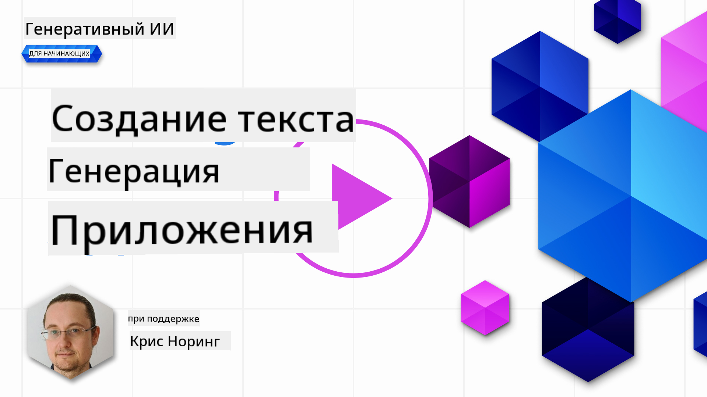

<!--
CO_OP_TRANSLATOR_METADATA:
{
  "original_hash": "5ec6c92b629564538ef397c550adb73e",
  "translation_date": "2025-05-19T16:38:00+00:00",
  "source_file": "06-text-generation-apps/README.md",
  "language_code": "ru"
}
-->
# Создание приложений для генерации текста

[](https://aka.ms/gen-ai-lesson6-gh?WT.mc_id=academic-105485-koreyst)

> _(Нажмите на изображение выше, чтобы посмотреть видео этого урока)_

Вы уже видели в этом курсе, что существуют основные концепции, такие как подсказки, и даже целая дисциплина под названием "инженерия подсказок". Многие инструменты, с которыми вы можете взаимодействовать, такие как ChatGPT, Office 365, Microsoft Power Platform и другие, поддерживают использование подсказок для достижения чего-либо.

Чтобы добавить такой опыт в приложение, вам нужно понять концепции, такие как подсказки, завершения, и выбрать библиотеку для работы. Именно этому вы научитесь в этой главе.

## Введение

В этой главе вы:

- Узнаете о библиотеке openai и её основных концепциях.
- Создадите приложение для генерации текста с использованием openai.
- Поймете, как использовать такие концепции, как подсказка, температура и токены, чтобы создать приложение для генерации текста.

## Цели обучения

По окончании этого урока вы сможете:

- Объяснить, что такое приложение для генерации текста.
- Создать приложение для генерации текста с использованием openai.
- Настроить ваше приложение на использование большего или меньшего количества токенов и изменение температуры для получения разнообразных результатов.

## Что такое приложение для генерации текста?

Обычно, когда вы создаете приложение, оно имеет какой-то интерфейс, например:

- Командный интерфейс. Консольные приложения — это типичные приложения, где вы вводите команду, и она выполняет задачу. Например, `git` — это приложение с командным интерфейсом.
- Пользовательский интерфейс (UI). Некоторые приложения имеют графические пользовательские интерфейсы (GUI), где вы нажимаете кнопки, вводите текст, выбираете опции и многое другое.

### Ограничения консольных и UI приложений

Сравните это с приложением с командным интерфейсом, где вы вводите команду:

- **Это ограничено**. Вы не можете просто ввести любую команду, только те, которые поддерживает приложение.
- **Язык специфичен**. Некоторые приложения поддерживают множество языков, но по умолчанию приложение создается для определенного языка, даже если вы можете добавить поддержку других языков.

### Преимущества приложений для генерации текста

Так чем же отличается приложение для генерации текста?

В приложении для генерации текста у вас больше гибкости, вы не ограничены набором команд или определенным языком ввода. Вместо этого вы можете использовать естественный язык для взаимодействия с приложением. Еще одно преимущество заключается в том, что вы уже взаимодействуете с источником данных, который обучен на обширном корпусе информации, в то время как традиционное приложение может быть ограничено тем, что находится в базе данных.

### Что я могу создать с помощью приложения для генерации текста?

Есть много вещей, которые вы можете создать. Например:

- **Чат-бот**. Чат-бот, отвечающий на вопросы по темам, таким как ваша компания и её продукты, может быть хорошим вариантом.
- **Помощник**. LLM отлично справляются с такими задачами, как суммирование текста, получение инсайтов из текста, создание текста, например, резюме и многое другое.
- **Помощник по коду**. В зависимости от используемой языковой модели вы можете создать помощника по коду, который поможет вам писать код. Например, вы можете использовать продукт, такой как GitHub Copilot, а также ChatGPT, чтобы помочь вам писать код.

## Как я могу начать?

Ну, вам нужно найти способ интеграции с LLM, что обычно включает два подхода:

- Использование API. Здесь вы создаете веб-запросы с вашей подсказкой и получаете сгенерированный текст в ответ.
- Использование библиотеки. Библиотеки помогают инкапсулировать вызовы API и делают их проще в использовании.

## Библиотеки/SDK

Существует несколько известных библиотек для работы с LLM, таких как:

- **openai**, эта библиотека облегчает подключение к вашей модели и отправку подсказок.

Также существуют библиотеки, работающие на более высоком уровне, такие как:

- **Langchain**. Langchain хорошо известен и поддерживает Python.
- **Semantic Kernel**. Semantic Kernel — это библиотека от Microsoft, поддерживающая языки C#, Python и Java.

## Первое приложение с использованием openai

Давайте посмотрим, как мы можем создать наше первое приложение, какие библиотеки нам нужны, сколько требуется и так далее.

### Установка openai

Существует множество библиотек для взаимодействия с OpenAI или Azure OpenAI. Возможно использовать различные языки программирования, такие как C#, Python, JavaScript, Java и другие. Мы выбрали библиотеку `openai` Python, поэтому будем использовать `pip` для её установки.

```bash
pip install openai
```

### Создание ресурса

Вам нужно выполнить следующие шаги:

- Создать аккаунт на Azure [https://azure.microsoft.com/free/](https://azure.microsoft.com/free/?WT.mc_id=academic-105485-koreyst).
- Получить доступ к Azure OpenAI. Перейдите по ссылке [https://learn.microsoft.com/azure/ai-services/openai/overview#how-do-i-get-access-to-azure-openai](https://learn.microsoft.com/azure/ai-services/openai/overview#how-do-i-get-access-to-azure-openai?WT.mc_id=academic-105485-koreyst) и запросите доступ.

  > [!NOTE]
  > На момент написания требуется подать заявку на доступ к Azure OpenAI.

- Установить Python <https://www.python.org/>
- Создать ресурс Azure OpenAI Service. См. это руководство о том, как [создать ресурс](https://learn.microsoft.com/azure/ai-services/openai/how-to/create-resource?pivots=web-portal?WT.mc_id=academic-105485-koreyst).

### Поиск ключа API и конечной точки

На этом этапе вам нужно указать вашей библиотеке `openai`, какой ключ API использовать. Чтобы найти ваш ключ API, перейдите в раздел "Ключи и конечная точка" вашего ресурса Azure OpenAI и скопируйте значение "Ключ 1".


Теперь, когда у вас есть эта информация, давайте укажем библиотекам использовать её.

> [!NOTE]
> Стоит отделить ваш ключ API от вашего кода. Вы можете сделать это, используя переменные окружения.
>
> - Установите переменную окружения `OPENAI_API_KEY` to your API key.
>   `export OPENAI_API_KEY='sk-...'`

### Настройка конфигурации Azure

Если вы используете Azure OpenAI, вот как настроить конфигурацию:

```python
openai.api_type = 'azure'
openai.api_key = os.environ["OPENAI_API_KEY"]
openai.api_version = '2023-05-15'
openai.api_base = os.getenv("API_BASE")
```

Выше мы настраиваем следующее:

- `api_type` to `azure`. This tells the library to use Azure OpenAI and not OpenAI.
- `api_key`, this is your API key found in the Azure Portal.
- `api_version`, this is the version of the API you want to use. At the time of writing, the latest version is `2023-05-15`.
- `api_base`, this is the endpoint of the API. You can find it in the Azure Portal next to your API key.

> [!NOTE] > `os.getenv` is a function that reads environment variables. You can use it to read environment variables like `OPENAI_API_KEY` and `API_BASE`. Set these environment variables in your terminal or by using a library like `dotenv`.

## Generate text

The way to generate text is to use the `Completion` класс. Вот пример:

```python
prompt = "Complete the following: Once upon a time there was a"

completion = openai.Completion.create(model="davinci-002", prompt=prompt)
print(completion.choices[0].text)
```

В приведенном выше коде мы создаем объект завершения и передаем в него модель, которую хотим использовать, и подсказку. Затем мы выводим сгенерированный текст.

### Завершения чата

До сих пор вы видели, как мы использовали `Completion` to generate text. But there's another class called `ChatCompletion`, который больше подходит для чат-ботов. Вот пример его использования:

```python
import openai

openai.api_key = "sk-..."

completion = openai.ChatCompletion.create(model="gpt-3.5-turbo", messages=[{"role": "user", "content": "Hello world"}])
print(completion.choices[0].message.content)
```

Подробнее об этой функциональности в следующей главе.

## Упражнение - ваше первое приложение для генерации текста

Теперь, когда мы узнали, как настроить и сконфигурировать openai, пришло время создать ваше первое приложение для генерации текста. Чтобы создать ваше приложение, выполните следующие шаги:

1. Создайте виртуальную среду и установите openai:

   ```bash
   python -m venv venv
   source venv/bin/activate
   pip install openai
   ```

   > [!NOTE]
   > Если вы используете Windows, введите `venv\Scripts\activate` instead of `source venv/bin/activate`.

   > [!NOTE]
   > Locate your Azure OpenAI key by going to [https://portal.azure.com/](https://portal.azure.com/?WT.mc_id=academic-105485-koreyst) and search for `Open AI` and select the `Open AI resource` and then select `Keys and Endpoint` and copy the `Key 1` значение.

1. Создайте файл _app.py_ и добавьте в него следующий код:

   ```python
   import openai

   openai.api_key = "<replace this value with your open ai key or Azure OpenAI key>"

   openai.api_type = 'azure'
   openai.api_version = '2023-05-15'
   openai.api_base = "<endpoint found in Azure Portal where your API key is>"
   deployment_name = "<deployment name>"

   # add your completion code
   prompt = "Complete the following: Once upon a time there was a"
   messages = [{"role": "user", "content": prompt}]

   # make completion
   completion = openai.chat.completions.create(model=deployment_name, messages=messages)

   # print response
   print(completion.choices[0].message.content)
   ```

   > [!NOTE]
   > Если вы используете Azure OpenAI, вам нужно установить `api_type` to `azure` and set the `api_key` на ваш ключ Azure OpenAI.

   Вы должны увидеть вывод, похожий на следующий:

   ```output
    very unhappy _____.

   Once upon a time there was a very unhappy mermaid.
   ```

## Различные типы подсказок для разных задач

Теперь вы видели, как генерировать текст с помощью подсказки. У вас даже есть программа, которую вы можете изменить и модифицировать для генерации различных типов текста.

Подсказки могут использоваться для выполнения различных задач. Например:

- **Генерация типа текста**. Например, вы можете сгенерировать стихотворение, вопросы для викторины и т.д.
- **Поиск информации**. Вы можете использовать подсказки для поиска информации, например, 'Что означает CORS в веб-разработке?'.
- **Генерация кода**. Вы можете использовать подсказки для генерации кода, например, разработки регулярного выражения для проверки электронной почты или даже генерации всей программы, такой как веб-приложение.

## Более практическое использование: генератор рецептов

Представьте, что у вас есть ингредиенты дома, и вы хотите что-то приготовить. Для этого вам нужен рецепт. Один из способов найти рецепты — использовать поисковую систему, или вы можете использовать LLM.

Вы можете написать подсказку следующим образом:

> "Покажите мне 5 рецептов блюда с использованием следующих ингредиентов: курица, картофель и морковь. Для каждого рецепта перечислите все использованные ингредиенты"

Учитывая вышеуказанную подсказку, вы можете получить ответ, подобный следующему:

```output
1. Roasted Chicken and Vegetables:
Ingredients:
- 4 chicken thighs
- 2 potatoes, cut into cubes
- 2 carrots, cut into cubes
- 2 tablespoons olive oil
- 2 cloves garlic, minced
- 1 teaspoon dried thyme
- 1 teaspoon dried oregano
- Salt and pepper, to taste

2. Chicken and Potato Stew:
Ingredients:
- 2 tablespoons olive oil
- 1 onion, diced
- 2 cloves garlic, minced
- 2 chicken breasts, cut into cubes
- 2 potatoes, cut into cubes
- 2 carrots, cut into cubes
- 1 teaspoon dried oregano
- 1 teaspoon dried thyme
- 1 cup chicken broth
- Salt and pepper, to taste

3. Chicken and Potato Bake:
Ingredients:
- 2 tablespoons olive oil
- 2 chicken breasts, cut into cubes
- 2 potatoes, cut into cubes
- 2 carrots, cut into cubes
- 1 onion, diced
- 2 cloves garlic, minced
- 1 teaspoon dried oregano
- 1 teaspoon dried thyme
- 1 cup chicken broth
- Salt and pepper, to taste

4. Chicken and Potato Soup:
Ingredients:
- 2 tablespoons olive oil
- 1 onion, diced
- 2 cloves garlic, minced
- 2 chicken breasts, cut into cubes
- 2 potatoes, cut into cubes
- 2 carrots, cut into cubes
- 1 teaspoon dried oregano
- 1 teaspoon dried thyme
- 4 cups chicken broth
- Salt and pepper, to taste

5. Chicken and Potato Hash:
Ingredients:
- 2 tablespoons olive oil
- 2 chicken breasts, cut into cubes
- 2 potatoes, cut into cubes
- 2 carrots, cut into cubes
- 1 onion, diced
- 2 cloves garlic, minced
- 1 teaspoon dried oregano
```

Этот результат замечательный, я знаю, что готовить. На этом этапе полезными улучшениями могут быть:

- Исключение ингредиентов, которые мне не нравятся или на которые у меня аллергия.
- Создание списка покупок, если у меня нет всех ингредиентов дома.

Для этих случаев давайте добавим дополнительную подсказку:

> "Пожалуйста, удалите рецепты с чесноком, так как у меня аллергия, и замените его чем-то другим. Также, пожалуйста, создайте список покупок для рецептов, учитывая, что у меня уже есть курица, картофель и морковь дома."

Теперь у вас есть новый результат, а именно:

```output
1. Roasted Chicken and Vegetables:
Ingredients:
- 4 chicken thighs
- 2 potatoes, cut into cubes
- 2 carrots, cut into cubes
- 2 tablespoons olive oil
- 1 teaspoon dried thyme
- 1 teaspoon dried oregano
- Salt and pepper, to taste

2. Chicken and Potato Stew:
Ingredients:
- 2 tablespoons olive oil
- 1 onion, diced
- 2 chicken breasts, cut into cubes
- 2 potatoes, cut into cubes
- 2 carrots, cut into cubes
- 1 teaspoon dried oregano
- 1 teaspoon dried thyme
- 1 cup chicken broth
- Salt and pepper, to taste

3. Chicken and Potato Bake:
Ingredients:
- 2 tablespoons olive oil
- 2 chicken breasts, cut into cubes
- 2 potatoes, cut into cubes
- 2 carrots, cut into cubes
- 1 onion, diced
- 1 teaspoon dried oregano
- 1 teaspoon dried thyme
- 1 cup chicken broth
- Salt and pepper, to taste

4. Chicken and Potato Soup:
Ingredients:
- 2 tablespoons olive oil
- 1 onion, diced
- 2 chicken breasts, cut into cubes
- 2 potatoes, cut into cubes
- 2 carrots, cut into cubes
- 1 teaspoon dried oregano
- 1 teaspoon dried thyme
- 4 cups chicken broth
- Salt and pepper, to taste

5. Chicken and Potato Hash:
Ingredients:
- 2 tablespoons olive oil
- 2 chicken breasts, cut into cubes
- 2 potatoes, cut into cubes
- 2 carrots, cut into cubes
- 1 onion, diced
- 1 teaspoon dried oregano

Shopping List:
- Olive oil
- Onion
- Thyme
- Oregano
- Salt
- Pepper
```

Это ваши пять рецептов, без упоминания чеснока, и у вас также есть список покупок с учетом того, что у вас уже есть дома.

## Упражнение - создание генератора рецептов

Теперь, когда мы разыграли сценарий, давайте напишем код, чтобы соответствовать продемонстрированному сценарию. Для этого выполните следующие шаги:

1. Используйте существующий файл _app.py_ в качестве отправной точки.
1. Найдите переменную `prompt` и измените её код на следующий:

   ```python
   prompt = "Show me 5 recipes for a dish with the following ingredients: chicken, potatoes, and carrots. Per recipe, list all the ingredients used"
   ```

   Если вы теперь запустите код, вы должны увидеть вывод, похожий на:

   ```output
   -Chicken Stew with Potatoes and Carrots: 3 tablespoons oil, 1 onion, chopped, 2 cloves garlic, minced, 1 carrot, peeled and chopped, 1 potato, peeled and chopped, 1 bay leaf, 1 thyme sprig, 1/2 teaspoon salt, 1/4 teaspoon black pepper, 1 1/2 cups chicken broth, 1/2 cup dry white wine, 2 tablespoons chopped fresh parsley, 2 tablespoons unsalted butter, 1 1/2 pounds boneless, skinless chicken thighs, cut into 1-inch pieces
   -Oven-Roasted Chicken with Potatoes and Carrots: 3 tablespoons extra-virgin olive oil, 1 tablespoon Dijon mustard, 1 tablespoon chopped fresh rosemary, 1 tablespoon chopped fresh thyme, 4 cloves garlic, minced, 1 1/2 pounds small red potatoes, quartered, 1 1/2 pounds carrots, quartered lengthwise, 1/2 teaspoon salt, 1/4 teaspoon black pepper, 1 (4-pound) whole chicken
   -Chicken, Potato, and Carrot Casserole: cooking spray, 1 large onion, chopped, 2 cloves garlic, minced, 1 carrot, peeled and shredded, 1 potato, peeled and shredded, 1/2 teaspoon dried thyme leaves, 1/4 teaspoon salt, 1/4 teaspoon black pepper, 2 cups fat-free, low-sodium chicken broth, 1 cup frozen peas, 1/4 cup all-purpose flour, 1 cup 2% reduced-fat milk, 1/4 cup grated Parmesan cheese

   -One Pot Chicken and Potato Dinner: 2 tablespoons olive oil, 1 pound boneless, skinless chicken thighs, cut into 1-inch pieces, 1 large onion, chopped, 3 cloves garlic, minced, 1 carrot, peeled and chopped, 1 potato, peeled and chopped, 1 bay leaf, 1 thyme sprig, 1/2 teaspoon salt, 1/4 teaspoon black pepper, 2 cups chicken broth, 1/2 cup dry white wine

   -Chicken, Potato, and Carrot Curry: 1 tablespoon vegetable oil, 1 large onion, chopped, 2 cloves garlic, minced, 1 carrot, peeled and chopped, 1 potato, peeled and chopped, 1 teaspoon ground coriander, 1 teaspoon ground cumin, 1/2 teaspoon ground turmeric, 1/2 teaspoon ground ginger, 1/4 teaspoon cayenne pepper, 2 cups chicken broth, 1/2 cup dry white wine, 1 (15-ounce) can chickpeas, drained and rinsed, 1/2 cup raisins, 1/2 cup chopped fresh cilantro
   ```

   > ЗАМЕЧАНИЕ, ваш LLM недетерминирован, поэтому вы можете получать разные результаты каждый раз, когда запускаете программу.

   Отлично, давайте посмотрим, как мы можем улучшить ситуацию. Чтобы улучшить ситуацию, мы хотим убедиться, что код гибкий, чтобы ингредиенты и количество рецептов можно было улучшать и изменять.

1. Давайте изменим код следующим образом:

   ```python
   no_recipes = input("No of recipes (for example, 5): ")

   ingredients = input("List of ingredients (for example, chicken, potatoes, and carrots): ")

   # interpolate the number of recipes into the prompt an ingredients
   prompt = f"Show me {no_recipes} recipes for a dish with the following ingredients: {ingredients}. Per recipe, list all the ingredients used"
   ```

   Тестовый запуск кода может выглядеть так:

   ```output
   No of recipes (for example, 5): 3
   List of ingredients (for example, chicken, potatoes, and carrots): milk,strawberries

   -Strawberry milk shake: milk, strawberries, sugar, vanilla extract, ice cubes
   -Strawberry shortcake: milk, flour, baking powder, sugar, salt, unsalted butter, strawberries, whipped cream
   -Strawberry milk: milk, strawberries, sugar, vanilla extract
   ```

### Улучшение путем добавления фильтра и списка покупок

Теперь у нас есть работающее приложение, способное производить рецепты, и оно гибкое, так как полагается на ввод от пользователя, как по количеству рецептов, так и по используемым ингредиентам.

Чтобы улучшить его, мы хотим добавить следующее:

- **Исключение ингредиентов**. Мы хотим иметь возможность исключать ингредиенты, которые нам не нравятся или на которые у нас аллергия. Чтобы реализовать это изменение, мы можем изменить нашу существующую подсказку и добавить условие фильтрации в её конец следующим образом:

  ```python
  filter = input("Filter (for example, vegetarian, vegan, or gluten-free): ")

  prompt = f"Show me {no_recipes} recipes for a dish with the following ingredients: {ingredients}. Per recipe, list all the ingredients used, no {filter}"
  ```

  Выше мы добавляем `{filter}` в конец подсказки и также захватываем значение фильтра от пользователя.

  Пример ввода при запуске программы теперь может выглядеть следующим образом:

  ```output
  No of recipes (for example, 5): 3
  List of ingredients (for example, chicken, potatoes, and carrots): onion,milk
  Filter (for example, vegetarian, vegan, or gluten-free): no milk

  1. French Onion Soup

  Ingredients:

  -1 large onion, sliced
  -3 cups beef broth
  -1 cup milk
  -6 slices french bread
  -1/4 cup shredded Parmesan cheese
  -1 tablespoon butter
  -1 teaspoon dried thyme
  -1/4 teaspoon salt
  -1/4 teaspoon black pepper

  Instructions:

  1. In a large pot, sauté onions in butter until golden brown.
  2. Add beef broth, milk, thyme, salt, and pepper. Bring to a boil.
  3. Reduce heat and simmer for 10 minutes.
  4. Place french bread slices on soup bowls.
  5. Ladle soup over bread.
  6. Sprinkle with Parmesan cheese.

  2. Onion and Potato Soup

  Ingredients:

  -1 large onion, chopped
  -2 cups potatoes, diced
  -3 cups vegetable broth
  -1 cup milk
  -1/4 teaspoon black pepper

  Instructions:

  1. In a large pot, sauté onions in butter until golden brown.
  2. Add potatoes, vegetable broth, milk, and pepper. Bring to a boil.
  3. Reduce heat and simmer for 10 minutes.
  4. Serve hot.

  3. Creamy Onion Soup

  Ingredients:

  -1 large onion, chopped
  -3 cups vegetable broth
  -1 cup milk
  -1/4 teaspoon black pepper
  -1/4 cup all-purpose flour
  -1/2 cup shredded Parmesan cheese

  Instructions:

  1. In a large pot, sauté onions in butter until golden brown.
  2. Add vegetable broth, milk, and pepper. Bring to a boil.
  3. Reduce heat and simmer for 10 minutes.
  4. In a small bowl, whisk together flour and Parmesan cheese until smooth.
  5. Add to soup and simmer for an additional 5 minutes, or until soup has thickened.
  ```

  Как вы видите, любые рецепты с молоком были отфильтрованы. Но если вы не переносите лактозу, вы можете захотеть отфильтровать рецепты с сыром, поэтому важно быть ясным.

- **Создание списка покупок**. Мы хотим создать список покупок с учетом того, что у нас уже есть дома.

  Для этой функциональности мы могли бы попытаться решить все в одной подсказке, или мы могли бы разбить её на две подсказки. Давайте попробуем последний подход. Здесь мы предлагаем добавить дополнительную подсказку, но для этого нам нужно добавить результат первой подсказки как контекст ко второй подсказке.

  Найдите часть кода, которая выводит результат из первой подсказки, и добавьте следующий код ниже:

  ```python
  old_prompt_result = completion.choices[0].message.content
  prompt = "Produce a shopping list for the generated recipes and please don't include ingredients that I already have."

  new_prompt = f"{old_prompt_result} {prompt}"
  messages = [{"role": "user", "content": new_prompt}]
  completion = openai.Completion.create(engine=deployment_name, messages=messages, max_tokens=1200)

  # print response
  print("Shopping list:")
  print(completion.choices[0].message.content)
  ```

  Обратите внимание на следующее:

  1. Мы создаем новую подсказку, добавляя результат из первой подсказки к новой подсказке:

     ```python
     new_prompt = f"{old_prompt_result} {prompt}"
     ```

  1. Мы делаем новый запрос, но также учитывая количество токенов, которые мы запросили в первой подсказке, поэтому в этот раз мы говорим, что `max_tokens` равно 1200.

     ```python
     completion = openai.Completion.create(engine=deployment_name, prompt=new_prompt, max_tokens=1200)
     ```

     Запустив этот код, мы теперь получаем следующий вывод:

     ```output
     No of recipes (for example, 5): 2
     List of ingredients (for example, chicken, potatoes, and carrots): apple,flour
     Filter (for example, vegetarian, vegan, or gluten-free): sugar


     -Apple and flour pancakes: 1 cup flour, 1/2 tsp baking powder, 1/2 tsp baking soda, 1/4 tsp salt, 1 tbsp sugar, 1 egg, 1 cup buttermilk or sour milk, 1/4 cup melted butter, 1 Granny Smith apple, peeled and grated
     -Apple fritters: 1-1/2 cups flour, 1 tsp baking powder, 1/4 tsp salt, 1/4 tsp baking soda, 1/4 tsp nutmeg, 1/4 tsp cinnamon, 1/4 tsp allspice, 1/4 cup sugar, 1/4 cup vegetable shortening, 1/4 cup milk, 1 egg, 2 cups shredded, peeled apples
     Shopping list:
     -Flour, baking powder, baking soda, salt, sugar, egg, buttermilk, butter, apple, nutmeg, cinnamon, allspice
     ```

## Улучшение вашей настройки

То, что у нас есть на данный момент, — это работающий код, но есть некоторые изменения, которые мы должны сделать, чтобы улучшить его. Некоторые вещи, которые мы должны сделать:

- **Отделить секреты от кода**, такие как ключ API. Секреты не должны находиться в коде и должны храниться в безопасном месте. Чтобы отделить секреты от кода, мы можем использовать переменные окружения и библиотеки, такие как `python-dotenv` to load them from a file. Here's how that would look like in code:

  1. Create a `.env` файл со следующим содержимым:

     ```bash
     OPENAI_API_KEY=sk-...
     ```

     > Обратите внимание, для Azure вам нужно установить следующие переменные окружения:

     ```bash
     OPENAI_API_TYPE=azure
     OPENAI_API_VERSION=2023-05-15
     OPENAI_API_BASE=<replace>
     ```

     В коде вы бы загружали переменные окружения следующим образом:

     ```python
     from dotenv import load_dotenv

     load_dotenv()

     openai.api_key = os.environ["OPENAI_API_KEY"]
     ```

- **Слово о длине токенов**. Мы должны учитывать, сколько токенов нам нужно для генерации текста, который мы хотим. Токены стоят денег, поэтому, где возможно, мы должны стараться быть экономными с количеством используемых токенов. Например, можем ли мы сформулировать подсказку так, чтобы использовать меньше токенов?

  Чтобы изменить используемые токены, вы можете использовать параметр `max_tokens`. Например, если вы хотите использовать 100 токенов, вы бы сделали:

  ```python
  completion = client.chat.completions.create(model=deployment, messages=messages, max_tokens=100)
  ```

- **Эксперименты с температурой**. Температура — это то, о чем мы до сих пор не упоминали, но это важный контекст для того, как работает наша программа. Чем выше значение температуры, тем более случайным будет вывод. Напротив, чем ниже значение температуры, тем более предсказуемым будет вывод. Подумайте, хотите ли вы разнообразия в вашем выводе или нет.

  Чтобы изменить температуру, вы можете использовать параметр `temperature`. Например, если вы хотите использовать температуру 0.5, вы бы сделали:

  ```python
  completion = client.chat.completions.create(model=deployment, messages=messages, temperature=0.5)
  ```

  > Обратите внимание, чем ближе к 1.0, тем более разнообразным будет вывод.

## Задание

Для этого задания вы можете выбрать, что построить.

Вот некоторые предложения:

- Измените приложение-генератор рецептов, чтобы улучшить его. Поиграйте с значениями температуры и подсказками, чтобы увидеть, что вы можете придумать.
- Создайте "учебного помощника". Это приложение должно уметь отвечать на вопросы по теме, например, Python. Вы могли бы иметь подсказки, такие как "Что такое определенная тема в Python?", или вы могли бы иметь подсказку, которая говорит: "покажите мне код для определенной темы" и т.д.
- Исторический бот, оживите историю, инструктируя бота играть определенного исторического персонажа и задавая ему вопросы о его жизни и времени.

## Решение

### Учебный помощник

Ниже приведена стартовая подсказка, посмотрите, как вы можете использовать её и настроить по своему усмотрению.

```text
- "You're an expert on the Python language

    Suggest a beginner lesson for Python in the following format:

    Format:
    - concepts:
    - brief explanation of the lesson:
    - exercise in code with solutions"
```

### Исторический бот

Вот некоторые подсказки, которые вы могли бы использовать:

```text
- "You are Abe Lincoln, tell me about yourself in 3 sentences, and respond using grammar and words like Abe would have used"
- "You are Abe Lincoln, respond using grammar and words like Abe would have used:

   Tell me about your greatest accomplishments, in 300 words"
```

## Проверка знаний

Что делает концепция температуры?

1. Она контролирует, насколько случайным будет вывод.
1. Она контролирует, насколько велик будет ответ.
1. Она контролирует, сколько токенов используется.

## 🚀 Вызов

Работая над заданием, попробуйте варьировать температуру, установите её на 0, 0.5 и 1. Помните, что 0 — это наименее разнообразный вариант, а 1 — наиболее, какое значение лучше всего подходит для вашего приложения?

## Отличная работа! Продолжайте обучение

После завершения этого урока ознакомьтесь с нашей [коллекцией обучения генеративному ИИ](https://aka.ms/genai-collection?WT.mc_id=academic-105

**Отказ от ответственности**:  
Этот документ был переведен с использованием сервиса автоматического перевода [Co-op Translator](https://github.com/Azure/co-op-translator). Мы стремимся к точности, однако, пожалуйста, учтите, что автоматические переводы могут содержать ошибки или неточности. Оригинальный документ на его родном языке следует считать авторитетным источником. Для получения критически важной информации рекомендуется профессиональный перевод человеком. Мы не несем ответственности за любые недопонимания или неправильные интерпретации, возникающие в результате использования этого перевода.