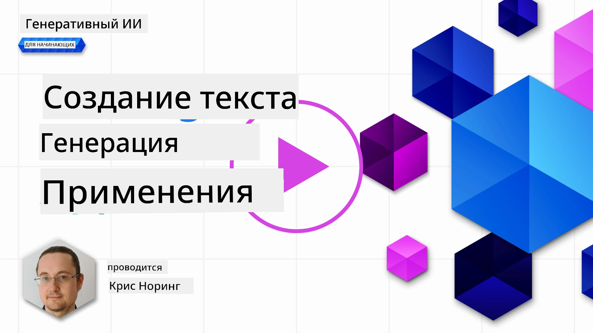

# Создание приложений для генерации текста

[](https://youtu.be/0Y5Luf5sRQA?si=t_xVg0clnAI4oUFZ)

> _(Нажмите на изображение выше, чтобы посмотреть видео этого урока)_

Вы уже видели в этом курсе, что существуют основные концепции, такие как подсказки, и даже целая дисциплина под названием "инженерия подсказок". Многие инструменты, с которыми вы можете взаимодействовать, такие как ChatGPT, Office 365, Microsoft Power Platform и другие, поддерживают использование подсказок для выполнения задач.

Чтобы добавить такой функционал в приложение, вам нужно понять такие концепции, как подсказки, дополнения, и выбрать библиотеку для работы. Именно этому вы научитесь в этой главе.

## Введение

В этой главе вы:

- Узнаете о библиотеке openai и её основных концепциях.
- Создадите приложение для генерации текста с использованием openai.
- Поймёте, как использовать такие параметры, как prompt, temperature и tokens, чтобы построить приложение для генерации текста.

## Цели обучения

По окончании этого урока вы сможете:

- Объяснить, что такое приложение для генерации текста.
- Создать приложение для генерации текста с помощью openai.
- Настроить приложение для использования большего или меньшего количества токенов, а также изменять параметр temperature для разнообразного результата.

## Что такое приложение для генерации текста?

Обычно при создании приложения у него есть какой-то интерфейс, например:

- Командное управление. Консольные приложения — это типичные приложения, где вы вводите команду, и она выполняет задачу. Например, `git` — это приложение с командным интерфейсом.
- Пользовательский интерфейс (UI). Некоторые приложения имеют графический интерфейс, где вы кликаете по кнопкам, вводите текст, выбираете опции и многое другое.

### Консольные и UI-приложения ограничены

Сравните это с приложением командного типа, где вы вводите команду:

- **Ограниченно**. Вы не можете ввести любую команду, только те, которые поддерживает приложение.
- **Языковая специфичность**. Некоторые приложения поддерживают множество языков, но по умолчанию приложение создаётся для конкретного языка, даже если можно добавить поддержку других языков.

### Преимущества приложений для генерации текста

В чём же отличие приложения для генерации текста?

В таком приложении у вас больше гибкости, вы не ограничены набором команд или конкретным языком ввода. Вместо этого вы можете использовать естественный язык для взаимодействия с приложением. Ещё одно преимущество — вы уже взаимодействуете с источником данных, который обучен на огромном корпусе информации, в то время как традиционное приложение может быть ограничено тем, что есть в базе данных.

### Что можно создать с помощью приложения для генерации текста?

Можно создать множество вещей. Например:

- **Чатбота**. Чатбот, отвечающий на вопросы по темам, такие как ваша компания и её продукты, может быть отличным выбором.
- **Помощника**. LLM (большие языковые модели) отлично подходят для таких задач, как суммирование текста, получение инсайтов из текста, создание текстов, например резюме и многое другое.
- **Ассистента для кода**. В зависимости от используемой языковой модели можно создать помощника по коду, который поможет писать программы. Например, можно использовать продукты вроде GitHub Copilot или ChatGPT для помощи в написании кода.

## Как начать?

Вам нужно найти способ интеграции с LLM, что обычно включает два подхода:

- Использовать API. Здесь вы формируете веб-запросы с вашей подсказкой и получаете сгенерированный текст в ответ.
- Использовать библиотеку. Библиотеки помогают обернуть вызовы API и упростить их использование.

## Библиотеки/SDK

Известны несколько библиотек для работы с LLM, например:

- **openai** — эта библиотека облегчает подключение к вашей модели и отправку подсказок.

Есть также библиотеки более высокого уровня, например:

- **Langchain**. Широко известна и поддерживает Python.
- **Semantic Kernel**. Библиотека Microsoft, поддерживающая языки C#, Python и Java.

## Первое приложение с использованием openai

Давайте посмотрим, как создать первое приложение, какие библиотеки нужны и что требуется.

### Установите openai

Существует множество библиотек для взаимодействия с OpenAI или Azure OpenAI. Можно использовать разные языки программирования, такие как C#, Python, JavaScript, Java и другие. Мы выбрали библиотеку `openai` для Python, поэтому будем устанавливать её через `pip`.

```bash
pip install openai
```

### Создайте ресурс

Выполните следующие шаги:

- Создайте учетную запись в Azure [https://azure.microsoft.com/free/](https://azure.microsoft.com/free/?WT.mc_id=academic-105485-koreyst).
- Получите доступ к Azure OpenAI. Перейдите на [https://learn.microsoft.com/azure/ai-foundry/openai/overview#how-do-i-get-access-to-azure-openai](https://learn.microsoft.com/azure/ai-foundry/openai/overview#how-do-i-get-access-to-azure-openai?WT.mc_id=academic-105485-koreyst) и запросите доступ.

  > [!NOTE]
  > На момент написания статьи необходимо подать заявку на доступ к Azure OpenAI.

- Установите Python <https://www.python.org/>
- Создайте ресурс Azure OpenAI Service. Руководство по созданию ресурса смотрите здесь: [создание ресурса](https://learn.microsoft.com/azure/ai-foundry/openai/how-to/create-resource?pivots=web-portal?WT.mc_id=academic-105485-koreyst).

### Найдите API-ключ и конечную точку (endpoint)

Теперь нужно указать библиотеке `openai`, какой API-ключ использовать. Чтобы найти ключ, перейдите в раздел "Keys and Endpoint" вашего ресурса Azure OpenAI и скопируйте значение "Key 1".


Теперь, когда эта информация скопирована, давайте укажем библиотекам использовать её.

> [!NOTE]
> Рекомендуется отделить API-ключ от кода. Для этого используйте переменные окружения.
>
> - Установите переменную окружения `OPENAI_API_KEY`, присвоив ей ваш API-ключ.
>   `export OPENAI_API_KEY='sk-...'`

### Настройка конфигурации Azure

Если вы используете Azure OpenAI (теперь часть Microsoft Foundry), настройка происходит следующим образом. Мы используем стандартный клиент `OpenAI`, направленный на конечную точку Azure OpenAI `/openai/v1/`, которая работает с Responses API и не требует указания `api_version`:

```python
import os
from openai import OpenAI

client = OpenAI(
    api_key=os.environ["AZURE_OPENAI_API_KEY"],
    base_url=f"{os.environ['AZURE_OPENAI_ENDPOINT'].rstrip('/')}/openai/v1/",
)
```

Выше мы задаём:

- `api_key` — это ваш API-ключ, который вы нашли в портале Azure или Microsoft Foundry.
- `base_url` — это конечная точка вашего ресурса Foundry с добавлением `/openai/v1/`. Стабильная версия v1 работает и с OpenAI, и с Azure OpenAI без управления `api_version`.

> [!NOTE] > `os.environ` читает переменные окружения. Вы можете использовать эту возможность для чтения таких переменных, как `AZURE_OPENAI_API_KEY` и `AZURE_OPENAI_ENDPOINT`. Установите эти переменные в терминале или с помощью библиотеки, например, `dotenv`.

## Генерация текста

Текст генерируется через Responses API методом `responses.create`. Пример:

```python
prompt = "Complete the following: Once upon a time there was a"

response = client.responses.create(
    model="gpt-5-mini",  # это название вашего развертывания модели
    input=prompt,
    store=False,
)
print(response.output_text)
```

В этом коде мы создаём ответ и передаём модель и подсказку. Затем выводим сгенерированный текст через `response.output_text`.

### Многоходовые беседы

Responses API подходит как для однострочной генерации текста, так и для многоходовых чат-ботов — вы передаёте список сообщений в `input`, чтобы построить разговор:

```python
from openai import OpenAI

client = OpenAI(api_key="sk-...")

response = client.responses.create(model="gpt-5-mini", input="Hello world", store=False)
print(response.output_text)
```

Подробнее об этом функционале в последующих главах.

## Упражнение — ваше первое приложение для генерации текста

Теперь, когда мы научились настраивать и конфигурировать openai, пришло время создать ваше первое приложение для генерации текста. Выполните следующие шаги:

1. Создайте виртуальное окружение и установите openai:

   ```bash
   python -m venv venv
   source venv/bin/activate
   pip install openai
   ```

   > [!NOTE]
   > Если вы используете Windows, введите `venv\Scripts\activate` вместо `source venv/bin/activate`.

   > [!NOTE]
   > Найдите ваш ключ Azure OpenAI, перейдя на [https://portal.azure.com/](https://portal.azure.com/?WT.mc_id=academic-105485-koreyst), введите в поиск `Open AI`, выберите `Open AI resource`, затем откройте `Keys and Endpoint` и скопируйте значение `Key 1`.

1. Создайте файл _app.py_ и вставьте в него следующий код:

   ```python
   import os
   from openai import OpenAI

   client = OpenAI(
       api_key="<replace this value with your Azure OpenAI key>",
       base_url="<endpoint found in Azure Portal>/openai/v1/",
   )
   deployment_name = "<deployment name>"

   # добавьте ваш код завершения
   prompt = "Complete the following: Once upon a time there was a"

   # выполните запрос с помощью API Responses
   response = client.responses.create(model=deployment_name, input=prompt, store=False)

   # вывести ответ
   print(response.output_text)
   ```

   > [!NOTE]
   > Если вы используете обычный OpenAI (не Azure), используйте `client = OpenAI(api_key="<замените вашим OpenAI ключом>")` (без `base_url`) и передавайте имя модели, например, `gpt-5-mini` вместо имени развертывания.

   Вы увидите вывод примерно такого вида:

   ```output
    very unhappy _____.

   Once upon a time there was a very unhappy mermaid.
   ```

## Разные типы подсказок для разных задач

Теперь вы видели, как генерировать текст с помощью подсказки. У вас даже есть работающее приложение, которое можно изменять для генерации разных видов текста.

Подсказки можно использовать для разных задач. Например:

- **Генерация определённого типа текста**. Например, можно создать стихотворение, вопросы для викторины и т. д.
- **Поиск информации**. С помощью подсказок можно искать информацию, например, "Что значит CORS в веб-разработке?".
- **Генерация кода**. С помощью подсказок можно создавать код, например, регулярное выражение для проверки электронной почты или целую программу, например, веб-приложение.

## Более практический кейс: генератор рецептов

Представьте, что у вас есть ингредиенты дома, и вы хотите что-то приготовить. Для этого нужна рецептура. Один из способов найти рецепт — использовать поисковик, другой — использовать LLM.

Вы можете написать подсказку так:

> "Покажи 5 рецептов блюд с такими ингредиентами: курица, картофель, морковь. Для каждого рецепта укажи все используемые ингредиенты."

По такой подсказке вы можете получить ответ примерно такого вида:

```output
1. Roasted Chicken and Vegetables:
Ingredients:
- 4 chicken thighs
- 2 potatoes, cut into cubes
- 2 carrots, cut into cubes
- 2 tablespoons olive oil
- 2 cloves garlic, minced
- 1 teaspoon dried thyme
- 1 teaspoon dried oregano
- Salt and pepper, to taste

2. Chicken and Potato Stew:
Ingredients:
- 2 tablespoons olive oil
- 1 onion, diced
- 2 cloves garlic, minced
- 2 chicken breasts, cut into cubes
- 2 potatoes, cut into cubes
- 2 carrots, cut into cubes
- 1 teaspoon dried oregano
- 1 teaspoon dried thyme
- 1 cup chicken broth
- Salt and pepper, to taste

3. Chicken and Potato Bake:
Ingredients:
- 2 tablespoons olive oil
- 2 chicken breasts, cut into cubes
- 2 potatoes, cut into cubes
- 2 carrots, cut into cubes
- 1 onion, diced
- 2 cloves garlic, minced
- 1 teaspoon dried oregano
- 1 teaspoon dried thyme
- 1 cup chicken broth
- Salt and pepper, to taste

4. Chicken and Potato Soup:
Ingredients:
- 2 tablespoons olive oil
- 1 onion, diced
- 2 cloves garlic, minced
- 2 chicken breasts, cut into cubes
- 2 potatoes, cut into cubes
- 2 carrots, cut into cubes
- 1 teaspoon dried oregano
- 1 teaspoon dried thyme
- 4 cups chicken broth
- Salt and pepper, to taste

5. Chicken and Potato Hash:
Ingredients:
- 2 tablespoons olive oil
- 2 chicken breasts, cut into cubes
- 2 potatoes, cut into cubes
- 2 carrots, cut into cubes
- 1 onion, diced
- 2 cloves garlic, minced
- 1 teaspoon dried oregano
```

Это отличный результат, я знаю, что приготовить. Теперь полезными улучшениями могут быть:

- Исключение ингредиентов, которые я не люблю или на которые у меня аллергия.
- Создание списка покупок, если у меня дома нет каких-то ингредиентов.

Для таких случаев давайте добавим дополнительную подсказку:

> "Пожалуйста, исключи рецепты с чесноком, так как у меня аллергия, и замени его на что-то другое. Также создай список покупок для рецептов, учитывая, что у меня дома есть курица, картофель и морковь."

Теперь у вас новый результат, а именно:

```output
1. Roasted Chicken and Vegetables:
Ingredients:
- 4 chicken thighs
- 2 potatoes, cut into cubes
- 2 carrots, cut into cubes
- 2 tablespoons olive oil
- 1 teaspoon dried thyme
- 1 teaspoon dried oregano
- Salt and pepper, to taste

2. Chicken and Potato Stew:
Ingredients:
- 2 tablespoons olive oil
- 1 onion, diced
- 2 chicken breasts, cut into cubes
- 2 potatoes, cut into cubes
- 2 carrots, cut into cubes
- 1 teaspoon dried oregano
- 1 teaspoon dried thyme
- 1 cup chicken broth
- Salt and pepper, to taste

3. Chicken and Potato Bake:
Ingredients:
- 2 tablespoons olive oil
- 2 chicken breasts, cut into cubes
- 2 potatoes, cut into cubes
- 2 carrots, cut into cubes
- 1 onion, diced
- 1 teaspoon dried oregano
- 1 teaspoon dried thyme
- 1 cup chicken broth
- Salt and pepper, to taste

4. Chicken and Potato Soup:
Ingredients:
- 2 tablespoons olive oil
- 1 onion, diced
- 2 chicken breasts, cut into cubes
- 2 potatoes, cut into cubes
- 2 carrots, cut into cubes
- 1 teaspoon dried oregano
- 1 teaspoon dried thyme
- 4 cups chicken broth
- Salt and pepper, to taste

5. Chicken and Potato Hash:
Ingredients:
- 2 tablespoons olive oil
- 2 chicken breasts, cut into cubes
- 2 potatoes, cut into cubes
- 2 carrots, cut into cubes
- 1 onion, diced
- 1 teaspoon dried oregano

Shopping List:
- Olive oil
- Onion
- Thyme
- Oregano
- Salt
- Pepper
```

Вот ваши пять рецептов без чеснока и список покупок с учётом имеющихся ингредиентов.

## Упражнение — создание генератора рецептов

После того, как мы рассмотрели сценарий, давайте напишем код, соответствующий ему. Выполните следующие шаги:

1. Используйте существующий файл _app.py_ как исходную точку
1. Найдите переменную `prompt` и замените её содержимое на следующее:

   ```python
   prompt = "Show me 5 recipes for a dish with the following ingredients: chicken, potatoes, and carrots. Per recipe, list all the ingredients used"
   ```

   Теперь, если вы запустите код, вы должны увидеть примерно такой вывод:

   ```output
   -Chicken Stew with Potatoes and Carrots: 3 tablespoons oil, 1 onion, chopped, 2 cloves garlic, minced, 1 carrot, peeled and chopped, 1 potato, peeled and chopped, 1 bay leaf, 1 thyme sprig, 1/2 teaspoon salt, 1/4 teaspoon black pepper, 1 1/2 cups chicken broth, 1/2 cup dry white wine, 2 tablespoons chopped fresh parsley, 2 tablespoons unsalted butter, 1 1/2 pounds boneless, skinless chicken thighs, cut into 1-inch pieces
   -Oven-Roasted Chicken with Potatoes and Carrots: 3 tablespoons extra-virgin olive oil, 1 tablespoon Dijon mustard, 1 tablespoon chopped fresh rosemary, 1 tablespoon chopped fresh thyme, 4 cloves garlic, minced, 1 1/2 pounds small red potatoes, quartered, 1 1/2 pounds carrots, quartered lengthwise, 1/2 teaspoon salt, 1/4 teaspoon black pepper, 1 (4-pound) whole chicken
   -Chicken, Potato, and Carrot Casserole: cooking spray, 1 large onion, chopped, 2 cloves garlic, minced, 1 carrot, peeled and shredded, 1 potato, peeled and shredded, 1/2 teaspoon dried thyme leaves, 1/4 teaspoon salt, 1/4 teaspoon black pepper, 2 cups fat-free, low-sodium chicken broth, 1 cup frozen peas, 1/4 cup all-purpose flour, 1 cup 2% reduced-fat milk, 1/4 cup grated Parmesan cheese

   -One Pot Chicken and Potato Dinner: 2 tablespoons olive oil, 1 pound boneless, skinless chicken thighs, cut into 1-inch pieces, 1 large onion, chopped, 3 cloves garlic, minced, 1 carrot, peeled and chopped, 1 potato, peeled and chopped, 1 bay leaf, 1 thyme sprig, 1/2 teaspoon salt, 1/4 teaspoon black pepper, 2 cups chicken broth, 1/2 cup dry white wine

   -Chicken, Potato, and Carrot Curry: 1 tablespoon vegetable oil, 1 large onion, chopped, 2 cloves garlic, minced, 1 carrot, peeled and chopped, 1 potato, peeled and chopped, 1 teaspoon ground coriander, 1 teaspoon ground cumin, 1/2 teaspoon ground turmeric, 1/2 teaspoon ground ginger, 1/4 teaspoon cayenne pepper, 2 cups chicken broth, 1/2 cup dry white wine, 1 (15-ounce) can chickpeas, drained and rinsed, 1/2 cup raisins, 1/2 cup chopped fresh cilantro
   ```

   > ВАЖНО, ваша LLM является недетерминированной, поэтому результаты могут отличаться при каждом запуске программы.

   Отлично, давайте посмотрим, как можно улучшить приложение. Чтобы улучшить его, сделаем код более гибким, чтобы количество и состав ингредиентов можно было изменять.

1. Изменим код следующим образом:

   ```python
   no_recipes = input("No of recipes (for example, 5): ")

   ingredients = input("List of ingredients (for example, chicken, potatoes, and carrots): ")

   # вставить количество рецептов в подсказку и ингредиенты
   prompt = f"Show me {no_recipes} recipes for a dish with the following ingredients: {ingredients}. Per recipe, list all the ingredients used"
   ```

   Тестовый запуск кода может выглядеть так:

   ```output
   No of recipes (for example, 5): 3
   List of ingredients (for example, chicken, potatoes, and carrots): milk,strawberries

   -Strawberry milk shake: milk, strawberries, sugar, vanilla extract, ice cubes
   -Strawberry shortcake: milk, flour, baking powder, sugar, salt, unsalted butter, strawberries, whipped cream
   -Strawberry milk: milk, strawberries, sugar, vanilla extract
   ```

### Улучшение: добавление фильтра и списка покупок

Теперь у нас есть рабочее приложение для создания рецептов, которое гибко, поскольку основывается на вводе пользователя — количестве рецептов и используемых ингредиентах.

Чтобы улучшить дальше, добавим следующее:

- **Фильтрация ингредиентов**. Мы хотим иметь возможность исключать ингредиенты, которые не нравятся или вызывают аллергию. Для этого мы можем изменить текущую подсказку, добавив условие фильтра в конце, например:

  ```python
  filter = input("Filter (for example, vegetarian, vegan, or gluten-free): ")

  prompt = f"Show me {no_recipes} recipes for a dish with the following ingredients: {ingredients}. Per recipe, list all the ingredients used, no {filter}"
  ```

  Здесь мы добавляем `{filter}` в конец подсказки и также принимаем значение фильтра от пользователя.

  Пример ввода при запуске программы теперь может выглядеть так:

  ```output
  No of recipes (for example, 5): 3
  List of ingredients (for example, chicken, potatoes, and carrots): onion,milk
  Filter (for example, vegetarian, vegan, or gluten-free): no milk

  1. French Onion Soup

  Ingredients:

  -1 large onion, sliced
  -3 cups beef broth
  -1 cup milk
  -6 slices french bread
  -1/4 cup shredded Parmesan cheese
  -1 tablespoon butter
  -1 teaspoon dried thyme
  -1/4 teaspoon salt
  -1/4 teaspoon black pepper

  Instructions:

  1. In a large pot, sauté onions in butter until golden brown.
  2. Add beef broth, milk, thyme, salt, and pepper. Bring to a boil.
  3. Reduce heat and simmer for 10 minutes.
  4. Place french bread slices on soup bowls.
  5. Ladle soup over bread.
  6. Sprinkle with Parmesan cheese.

  2. Onion and Potato Soup

  Ingredients:

  -1 large onion, chopped
  -2 cups potatoes, diced
  -3 cups vegetable broth
  -1 cup milk
  -1/4 teaspoon black pepper

  Instructions:

  1. In a large pot, sauté onions in butter until golden brown.
  2. Add potatoes, vegetable broth, milk, and pepper. Bring to a boil.
  3. Reduce heat and simmer for 10 minutes.
  4. Serve hot.

  3. Creamy Onion Soup

  Ingredients:

  -1 large onion, chopped
  -3 cups vegetable broth
  -1 cup milk
  -1/4 teaspoon black pepper
  -1/4 cup all-purpose flour
  -1/2 cup shredded Parmesan cheese

  Instructions:

  1. In a large pot, sauté onions in butter until golden brown.
  2. Add vegetable broth, milk, and pepper. Bring to a boil.
  3. Reduce heat and simmer for 10 minutes.
  4. In a small bowl, whisk together flour and Parmesan cheese until smooth.
  5. Add to soup and simmer for an additional 5 minutes, or until soup has thickened.
  ```

  Как видите, все рецепты с молоком были отфильтрованы. Однако, если у вас непереносимость лактозы, возможно, стоит также исключать рецепты с сыром, поэтому важно чётко указывать фильтр.


- **Составьте список покупок**. Мы хотим составить список покупок, учитывая то, что у нас уже есть дома.

  Для этой функции мы можем либо попробовать решить всё в одном запросе, либо разделить на два запроса. Давайте попробуем второй вариант. Здесь мы предлагаем добавить ещё один запрос, но для этого нужно добавить результат первого запроса в качестве контекста для второго.

  Найдите часть кода, которая выводит результат первого запроса, и добавьте следующий код ниже:

  ```python
  old_prompt_result = response.output_text
  prompt = "Produce a shopping list for the generated recipes and please don't include ingredients that I already have."

  new_prompt = f"{old_prompt_result} {prompt}"
  response = client.responses.create(model=deployment_name, input=new_prompt, max_output_tokens=1200, store=False)

  # вывести ответ
  print("Shopping list:")
  print(response.output_text)
  ```

  Обратите внимание на следующее:

  1. Мы создаём новый запрос, добавляя результат первого запроса к новому запросу:

     ```python
     new_prompt = f"{old_prompt_result} {prompt}"
     ```

  1. Мы делаем новый запрос, учитывая также количество токенов, которое запросили в первом запросе, поэтому на этот раз указываем `max_output_tokens` равным 1200.

     ```python
     response = client.responses.create(model=deployment_name, input=new_prompt, max_output_tokens=1200, store=False)
     ```

     Запустив этот код, мы получаем следующий вывод:

     ```output
     No of recipes (for example, 5): 2
     List of ingredients (for example, chicken, potatoes, and carrots): apple,flour
     Filter (for example, vegetarian, vegan, or gluten-free): sugar


     -Apple and flour pancakes: 1 cup flour, 1/2 tsp baking powder, 1/2 tsp baking soda, 1/4 tsp salt, 1 tbsp sugar, 1 egg, 1 cup buttermilk or sour milk, 1/4 cup melted butter, 1 Granny Smith apple, peeled and grated
     -Apple fritters: 1-1/2 cups flour, 1 tsp baking powder, 1/4 tsp salt, 1/4 tsp baking soda, 1/4 tsp nutmeg, 1/4 tsp cinnamon, 1/4 tsp allspice, 1/4 cup sugar, 1/4 cup vegetable shortening, 1/4 cup milk, 1 egg, 2 cups shredded, peeled apples
     Shopping list:
     -Flour, baking powder, baking soda, salt, sugar, egg, buttermilk, butter, apple, nutmeg, cinnamon, allspice
     ```

## Улучшите вашу настройку

Пока что у нас есть работающий код, но есть несколько изменений, которые следует сделать для дальнейшего улучшения. Вот некоторые из них:

- **Отделите секреты от кода**, например API-ключ. Секреты не должны храниться в коде, их следует хранить в безопасном месте. Чтобы отделить секреты от кода, мы можем использовать переменные окружения и библиотеки, такие как `python-dotenv`, чтобы загружать их из файла. Вот как это будет выглядеть в коде:

  1. Создайте файл `.env` со следующим содержимым:

     ```bash
     OPENAI_API_KEY=sk-...
     ```

     > Обратите внимание, для Azure OpenAI в Microsoft Foundry нужно вместо этого установить следующие переменные окружения:

     ```bash
     AZURE_OPENAI_API_KEY=<replace>
     AZURE_OPENAI_ENDPOINT=<replace>
     AZURE_OPENAI_API_VERSION=2024-10-21
     ```

     В коде переменные окружения загружаются так:

     ```python
     import os
     from dotenv import load_dotenv
     from openai import OpenAI

     load_dotenv()

     client = OpenAI(api_key=os.environ["OPENAI_API_KEY"])
     ```

- **Слово о длине токенов**. Нужно подумать, сколько токенов требуется для генерации нужного текста. Токены стоят денег, поэтому по возможности стоит экономить на их количестве. Например, можно сформулировать запрос так, чтобы использовать меньше токенов?

  Чтобы изменить количество используемых токенов, можно использовать параметр `max_output_tokens`. Например, если нужно использовать 100 токенов, сделайте так:

  ```python
  response = client.responses.create(model=deployment, input=prompt, max_output_tokens=100, store=False)
  ```

- **Эксперименты с температурой**. Температура — это параметр, который мы ещё не обсуждали, но он важен для работы программы. Чем выше температура, тем более случайным будет результат. Чем ниже температура, тем предсказуемее результат. Подумайте, хотите ли вы разнообразия в ответах.

  Чтобы изменить температуру, используйте параметр `temperature`. Например, чтобы установить температуру 0.5, сделайте так:

  ```python
  response = client.responses.create(model=deployment, input=prompt, temperature=0.5, store=False)
  ```

  > Обратите внимание, чем ближе к 1.0, тем более разнообразный результат.

- **Модели рассуждения не поддерживают `temperature`**. Это важное изменение 2026 года. Текущие модели Microsoft Foundry, не устаревшие, — это **модели рассуждения** (семейство GPT-5, o-series) — и они **не поддерживают `temperature` и `top_p`** (также не поддерживают `max_tokens`; используйте `max_output_tokens`). Если отправить параметр `temperature` на модель `gpt-5-mini`, вы получите ошибку "parameter not supported". Чтобы попробовать пример с температурой выше, используйте модель, которая ещё поддерживает управление сэмплированием — например открытую модель **Llama** `Llama-3.3-70B-Instruct` из [каталога моделей Microsoft Foundry](https://ai.azure.com/catalog/models?WT.mc_id=academic-105485-koreyst), вызываемую через Foundry Models / Azure AI Inference endpoint (так же, как образцы с `githubmodels-*`). Для моделей рассуждения, таких как GPT-5, управление результатом происходит иначе:
  - **Проектирование запросов** — чёткие инструкции, примеры и структурированный вывод (см. урок [04 - Prompt Engineering](../04-prompt-engineering-fundamentals/README.md?WT.mc_id=academic-105485-koreyst)) заменяют собой параметры сэмплирования.
  - **Управление рассуждениями** — параметры, такие как усилие/подробность рассуждений, балансируют глубину рассуждений с задержкой и стоимостью.

  Короче говоря: `temperature`/`top_p` всё ещё действуют во многих моделях (Llama, Mistral, Phi, и семейство GPT-4.x — хотя GPT-4.x устаревает), но направление движения — это проектирование запросов + управление рассуждениями для моделей рассуждения, таких как GPT-5.

## Задание

Для этого задания вы можете выбрать, что построить.

Вот несколько предложений:

- Улучшите приложение генератора рецептов. Поиграйте с параметрами температуры и запросов, чтобы посмотреть, что у вас получится.
- Создайте «учебного помощника». Это приложение должно уметь отвечать на вопросы по теме, например Python. Можно сделать запросы типа «Что такое определённая тема в Python?» или «Покажи мне код по определённой теме» и т.д.
- Исторический бот: оживите историю, дайте боту играть роль определённого исторического персонажа и задавайте ему вопросы о его жизни и времени.

## Решение

### Учебный помощник

Ниже приведён стартовый запрос, попробуйте использовать и изменить его по своему усмотрению.

```text
- "You're an expert on the Python language

    Suggest a beginner lesson for Python in the following format:

    Format:
    - concepts:
    - brief explanation of the lesson:
    - exercise in code with solutions"
```

### Исторический бот

Вот несколько запросов, которые вы можете использовать:

```text
- "You are Abe Lincoln, tell me about yourself in 3 sentences, and respond using grammar and words like Abe would have used"
- "You are Abe Lincoln, respond using grammar and words like Abe would have used:

   Tell me about your greatest accomplishments, in 300 words"
```

## Проверка знаний

Что делает параметр temperature?

1. Он контролирует, насколько случайным будет результат.
1. Он контролирует, насколько длинным будет ответ.
1. Он контролирует, сколько токенов используется.

## 🚀 Задача

Во время выполнения задания экспериментируйте с температурой, пробуйте значения 0, 0.5 и 1. Помните, что 0 — наименее вариативное, а 1 — наиболее вариативное значение. Какое значение лучше всего работает в вашем приложении?

## Отличная работа! Продолжайте обучение

После завершения этого урока ознакомьтесь с нашей [коллекцией по изучению генеративного ИИ](https://aka.ms/genai-collection?WT.mc_id=academic-105485-koreyst), чтобы продолжать развивать свои знания в генеративном ИИ!

Перейдите к уроку 7, где мы рассмотрим, как [создавать чат-приложения](../07-building-chat-applications/README.md?WT.mc_id=academic-105485-koreyst)!

---

<!-- CO-OP TRANSLATOR DISCLAIMER START -->
**Отказ от ответственности**:
Этот документ был переведен с использованием сервиса машинного перевода [Co-op Translator](https://github.com/Azure/co-op-translator). Несмотря на наши усилия по обеспечению точности, имейте в виду, что автоматический перевод может содержать ошибки или неточности. Оригинальный документ на его исходном языке следует считать авторитетным источником. Для получения критически важной информации рекомендуется обратиться к профессиональному человеческому переводу. Мы не несем ответственности за любые недоразумения или неправильные толкования, возникшие в результате использования этого перевода.
<!-- CO-OP TRANSLATOR DISCLAIMER END -->