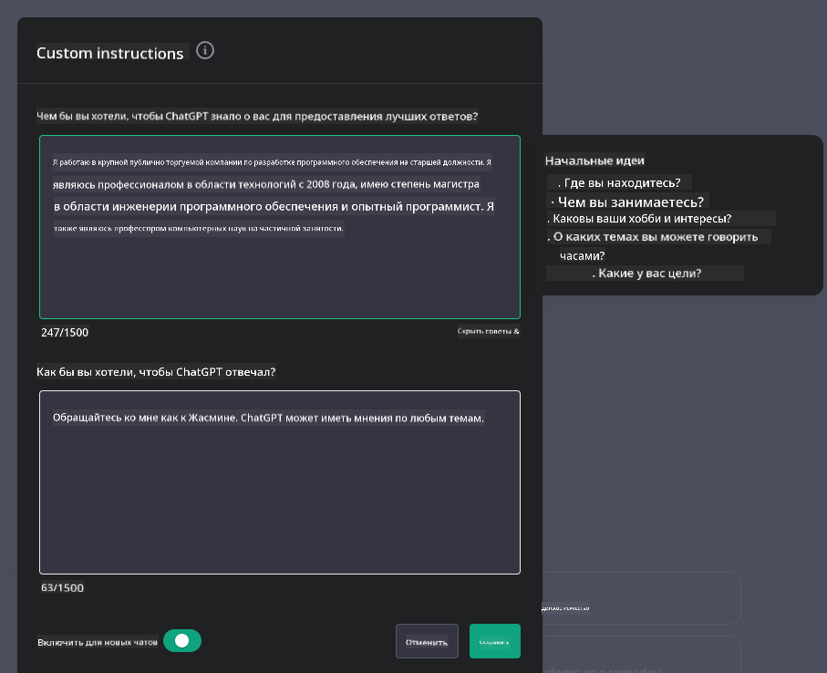

<!--
CO_OP_TRANSLATOR_METADATA:
{
  "original_hash": "ea4bbe640847aafbbba14dae4625e9af",
  "translation_date": "2025-05-19T17:28:58+00:00",
  "source_file": "07-building-chat-applications/README.md",
  "language_code": "ru"
}
-->
# Создание чат-приложений с генеративным ИИ

[](https://aka.ms/gen-ai-lessons7-gh?WT.mc_id=academic-105485-koreyst)

> _(Нажмите на изображение выше, чтобы посмотреть видео этого урока)_

Теперь, когда мы увидели, как можно создавать приложения для генерации текста, давайте рассмотрим чат-приложения.

Чат-приложения стали частью нашей повседневной жизни, предлагая больше, чем просто средство для неформального общения. Они являются неотъемлемой частью обслуживания клиентов, технической поддержки и даже сложных консультативных систем. Вероятно, вы недавно получили помощь от чат-приложения. По мере того как мы интегрируем более продвинутые технологии, такие как генеративный ИИ, в эти платформы, сложность увеличивается, и вместе с ней растут вызовы.

Некоторые вопросы, на которые нам нужно ответить:

- **Создание приложения**. Как эффективно создать и беспрепятственно интегрировать эти приложения на базе ИИ для конкретных случаев использования?
- **Мониторинг**. После развертывания, как мы можем контролировать и гарантировать, что приложения работают на высшем уровне качества, как с точки зрения функциональности, так и соблюдения [шести принципов ответственного ИИ](https://www.microsoft.com/ai/responsible-ai?WT.mc_id=academic-105485-koreyst)?

По мере того как мы движемся дальше в эпоху, определяемую автоматизацией и беспрепятственным взаимодействием человека и машины, понимание того, как генеративный ИИ трансформирует масштаб, глубину и адаптивность чат-приложений, становится необходимым. Этот урок исследует аспекты архитектуры, поддерживающие эти сложные системы, углубляется в методологии их настройки для задач, специфичных для домена, и оценивает метрики и соображения, важные для обеспечения ответственного развертывания ИИ.

## Введение

Этот урок охватывает:

- Техники для эффективного создания и интеграции чат-приложений.
- Как применить настройку и тонкую настройку к приложениям.
- Стратегии и соображения для эффективного мониторинга чат-приложений.

## Цели обучения

К концу этого урока вы сможете:

- Описать соображения по созданию и интеграции чат-приложений в существующие системы.
- Настроить чат-приложения для конкретных случаев использования.
- Определить ключевые метрики и соображения для эффективного мониторинга и поддержания качества чат-приложений на базе ИИ.
- Обеспечить ответственное использование ИИ в чат-приложениях.

## Интеграция генеративного ИИ в чат-приложения

Поднятие чат-приложений на новый уровень с помощью генеративного ИИ не только сосредоточено на их умственном развитии; это оптимизация их архитектуры, производительности и пользовательского интерфейса для обеспечения качественного пользовательского опыта. Это включает исследование архитектурных основ, интеграций API и соображений пользовательского интерфейса. Этот раздел предлагает вам всеобъемлющую дорожную карту для навигации по этим сложным ландшафтам, будь то подключение их к существующим системам или создание их как автономных платформ.

К концу этого раздела вы будете обладать необходимыми знаниями для эффективного создания и внедрения чат-приложений.

### Чат-бот или чат-приложение?

Прежде чем мы начнем создавать чат-приложения, давайте сравним «чат-ботов» и «чат-приложения на базе ИИ», которые выполняют различные роли и функции. Основная цель чат-бота — автоматизировать определенные разговорные задачи, такие как ответы на часто задаваемые вопросы или отслеживание посылки. Обычно он управляется логикой, основанной на правилах, или сложными алгоритмами ИИ. Напротив, чат-приложение на базе ИИ — это гораздо более обширная среда, предназначенная для облегчения различных форм цифровой коммуникации, таких как текстовые, голосовые и видеочаты среди пользователей. Его отличительная черта — интеграция генеративной модели ИИ, которая симулирует сложные, похожие на человеческие разговоры, генерируя ответы на основе широкого спектра входных данных и контекстных сигналов. Чат-приложение на базе генеративного ИИ может участвовать в обсуждениях на открытые темы, адаптироваться к меняющимся контекстам разговоров и даже создавать креативные или сложные диалоги.

Таблица ниже показывает ключевые различия и сходства, чтобы помочь нам понять их уникальные роли в цифровой коммуникации.

| Чат-бот                              | Чат-приложение на базе генеративного ИИ |
| ------------------------------------ | -------------------------------------- |
| Ориентировано на задачи и основано на правилах | Осведомленность о контексте             |
| Часто интегрируется в более крупные системы | Может содержать один или несколько чат-ботов |
| Ограничено запрограммированными функциями | Включает модели генеративного ИИ        |
| Специализированные и структурированные взаимодействия | Способно к обсуждениям на открытые темы  |

### Использование готовых функций с SDK и API

При создании чат-приложения хорошим первым шагом является оценка того, что уже существует. Использование SDK и API для создания чат-приложений — это выгодная стратегия по нескольким причинам. Интегрируя хорошо документированные SDK и API, вы стратегически позиционируете свое приложение для долгосрочного успеха, решая проблемы масштабируемости и обслуживания.

- **Ускоряет процесс разработки и снижает затраты**: Использование готовых функций вместо дорогостоящего процесса их самостоятельного создания позволяет сосредоточиться на других аспектах вашего приложения, которые могут быть более важными, например, на бизнес-логике.
- **Лучше производительность**: При создании функциональности с нуля вы в конечном итоге задаете себе вопрос «Как это масштабируется? Способно ли это приложение справиться с внезапным наплывом пользователей?» Хорошо поддерживаемые SDK и API часто имеют встроенные решения для этих проблем.
- **Легкость в обслуживании**: Обновления и улучшения проще управлять, так как большинство API и SDK требуют просто обновления библиотеки при выпуске новой версии.
- **Доступ к передовым технологиям**: Использование моделей, которые были тонко настроены и обучены на обширных наборах данных, обеспечивает ваше приложение возможностями обработки естественного языка.

Доступ к функциональности SDK или API обычно включает получение разрешения на использование предоставляемых услуг, что часто осуществляется через использование уникального ключа или токена аутентификации. Мы будем использовать библиотеку OpenAI Python для изучения того, как это выглядит. Вы также можете попробовать это самостоятельно в следующем [ноутбуке для OpenAI](../../../07-building-chat-applications/python/oai-assignment.ipynb) или [ноутбуке для Azure OpenAI Services](../../../07-building-chat-applications/python/aoai-assignment.ipynb) для этого урока.

```python
import os
from openai import OpenAI

API_KEY = os.getenv("OPENAI_API_KEY","")

client = OpenAI(
    api_key=API_KEY
    )

chat_completion = client.chat.completions.create(model="gpt-3.5-turbo", messages=[{"role": "user", "content": "Suggest two titles for an instructional lesson on chat applications for generative AI."}])
```

В приведенном выше примере используется модель GPT-3.5 Turbo для завершения запроса, но обратите внимание, что ключ API установлен до этого. Вы получите ошибку, если не установите ключ.

## Пользовательский опыт (UX)

Общие принципы UX применяются к чат-приложениям, но вот некоторые дополнительные соображения, которые становятся особенно важными из-за компонентов машинного обучения.

- **Механизм для устранения неоднозначности**: Модели генеративного ИИ иногда генерируют неоднозначные ответы. Функция, позволяющая пользователям запрашивать уточнение, может быть полезной, если они столкнутся с этой проблемой.
- **Сохранение контекста**: Продвинутые модели генеративного ИИ способны запоминать контекст в разговоре, что может быть необходимым активом для пользовательского опыта. Предоставление пользователям возможности контролировать и управлять контекстом улучшает пользовательский опыт, но вводит риск сохранения конфиденциальной информации пользователя. Соображения о том, как долго эта информация хранится, такие как введение политики хранения, могут сбалансировать необходимость контекста и конфиденциальности.
- **Персонализация**: С возможностью обучаться и адаптироваться модели ИИ предлагают индивидуализированный опыт для пользователя. Настройка пользовательского опыта через такие функции, как профили пользователей, не только делает пользователя понятным, но также помогает ему в поиске конкретных ответов, создавая более эффективное и удовлетворительное взаимодействие.

Одним из примеров персонализации является настройка "Пользовательские инструкции" в ChatGPT от OpenAI. Это позволяет вам предоставить информацию о себе, которая может быть важным контекстом для ваших запросов. Вот пример пользовательской инструкции.



Этот "профиль" побуждает ChatGPT создать план урока по связанным спискам. Обратите внимание, что ChatGPT учитывает, что пользователь может хотеть более глубокий план урока на основе её опыта.


### Система сообщений Microsoft для моделей больших языков

[Microsoft предоставила руководство](https://learn.microsoft.com/azure/ai-services/openai/concepts/system-message#define-the-models-output-format?WT.mc_id=academic-105485-koreyst) по написанию эффективных системных сообщений при генерации ответов от LLM, разбитое на 4 области:

1. Определение, для кого предназначена модель, а также её возможности и ограничения.
2. Определение формата вывода модели.
3. Предоставление конкретных примеров, демонстрирующих предполагаемое поведение модели.
4. Предоставление дополнительных поведенческих ограничений.

### Доступность

Независимо от того, есть ли у пользователя зрительные, слуховые, двигательные или когнитивные нарушения, хорошо спроектированное чат-приложение должно быть доступным для всех. Следующий список разбивает конкретные функции, направленные на улучшение доступности для различных нарушений пользователей.

- **Функции для зрительных нарушений**: Темы с высоким контрастом и изменяемый текст, совместимость с экранными считывателями.
- **Функции для слуховых нарушений**: Функции преобразования текста в речь и речи в текст, визуальные подсказки для аудио уведомлений.
- **Функции для двигательных нарушений**: Поддержка навигации с помощью клавиатуры, голосовые команды.
- **Функции для когнитивных нарушений**: Опции упрощенного языка.

## Настройка и тонкая настройка для моделей языков, специфичных для домена

Представьте чат-приложение, которое понимает жаргон вашей компании и предвидит конкретные запросы, которые обычно возникают у его пользователей. Существует несколько подходов, которые стоит упомянуть:

- **Использование моделей DSL**. DSL обозначает язык, специфичный для домена. Вы можете использовать так называемую модель DSL, обученную на конкретном домене, чтобы понять его концепции и сценарии.
- **Применение тонкой настройки**. Тонкая настройка — это процесс дальнейшего обучения вашей модели с использованием конкретных данных.

## Настройка: Использование DSL

Использование моделей языка, специфичных для домена (DSL Models), может повысить вовлеченность пользователей, предоставляя специализированные, контекстуально релевантные взаимодействия. Это модель, которая обучена или тонко настроена для понимания и генерации текста, связанного с определенной областью, индустрией или темой. Варианты использования модели DSL могут варьироваться от обучения одной с нуля до использования уже существующих через SDK и API. Другим вариантом является тонкая настройка, которая включает адаптацию существующей предобученной модели для конкретного домена.

## Настройка: Применение тонкой настройки

Тонкая настройка часто рассматривается, когда предобученная модель оказывается недостаточной в специализированном домене или для конкретной задачи.

Например, медицинские запросы сложны и требуют много контекста. Когда медицинский специалист ставит диагноз пациенту, это основано на различных факторах, таких как образ жизни или предшествующие заболевания, и может даже полагаться на последние медицинские журналы для подтверждения своего диагноза. В таких сложных сценариях чат-приложение общего назначения не может быть надежным источником.

### Сценарий: медицинское приложение

Рассмотрим чат-приложение, предназначенное для помощи медицинским специалистам, предоставляя быстрые ссылки на руководства по лечению, взаимодействия с лекарствами или последние исследования.

Модель общего назначения может быть достаточной для ответа на основные медицинские вопросы или предоставления общих советов, но она может испытывать трудности со следующими:

- **Очень специфические или сложные случаи**. Например, невролог может спросить приложение: "Каковы текущие лучшие практики для управления лекарственно-устойчивой эпилепсией у детей?"
- **Отсутствие недавних достижений**. Модель общего назначения может испытывать трудности с предоставлением актуального ответа, который включает в себя последние достижения в области неврологии и фармакологии.

В таких случаях тонкая настройка модели с использованием специализированного медицинского набора данных может значительно улучшить её способность более точно и надежно справляться с этими сложными медицинскими запросами. Это требует доступа к большому и релевантному набору данных, который представляет собой специфические для домена вызовы и вопросы, которые необходимо решить.

## Соображения для качественного чат-приложения на базе ИИ

Этот раздел описывает критерии для "высококачественных" чат-приложений, которые включают сбор актуальных метрик и соблюдение рамок, которые ответственно используют технологии ИИ.

### Ключевые метрики

Чтобы поддерживать высококачественную производительность приложения, необходимо отслеживать ключевые метрики и соображения. Эти измерения не только обеспечивают функциональность приложения, но и оценивают качество модели ИИ и пользовательского опыта. Ниже приведен список, который охватывает основные, AI и пользовательские метрики, которые следует учитывать.

| Метрика                        | Определение                                                                                                             | Соображения для разработчика чат-приложений                                        |
| ----------------------------- | ---------------------------------------------------------------------------------------------------------------------- | ------------------------------------------------------------------------- |
| **Время безотказной работы**  | Измеряет время, когда приложение работает и доступно пользователям.                                                     | Как вы будете минимизировать время простоя?                                           |
| **Время ответа**              | Время, которое приложение затрачивает на ответ на запрос пользователя.                                                  | Как вы можете оптимизировать обработку запросов для улучшения времени ответа?           |
| **Точность**                  | Отношение истинных положительных предсказаний к общему количеству положительных предсказаний                             | Как вы будете проверять точность вашей модели?                                        |
| **Полнота (Чувствительность)**| Отношение истинных положительных предсказаний к фактическому количеству положительных предсказаний                      | Как вы будете измерять и улучшать полноту?                                  |
| **F1 Score**                  | Гармоническое среднее точности и полноты, которое балансирует компромисс между ними.                                     | Какова ваша целевая оценка F1? Как вы будете балансировать точность и полноту?  |
| **Недоумение**                | Измеряет, насколько хорошо предсказанное распределение вероятностей модели соответствует фактическому распределению данных. | Как вы будете минимизировать недоумение?                                         |
| **Метрики удовлетворенности пользователей** | Измеряет восприятие приложения пользователями. Часто собирается через опросы.                                          | Как часто вы будете собирать отзывы пользователей? Как вы будете адаптироваться на их основе? |
| **Ошибка**                    | Частота, с которой модель совершает ошибки в понимании или выводе.                                                       | Какие стратегии у вас есть для снижения частоты ошибок?               |
| **Циклы переобучения**        | Частота, с которой модель обновляется для включения новых данных и идей.                                                | Как часто вы будете переобучать модель? Что вызывает цикл переобучения?   |
| **Обнаружение аномалий**      | Инструменты и методы для выявления необычных шаблонов, которые не соответствуют ожидаемому поведению.                    | Как вы будете реагировать на аномалии?                                        |

### Реализация ответственных практик ИИ в чат-приложениях

Подход Microsoft к ответственному ИИ выделил шесть принципов, которые должны направлять разработку и использование ИИ. Ниже приведены принципы, их определение и вещи, которые разработчик чат-приложения должен учитывать и почему они должны принимать их всерьез.

| Принципы                | Определение Microsoft                                  | Соображения для разработчика чат-приложений                                      | Почему это важно                                                                     |
| ----------------------- | ----------------------------------------------------- | ---------------------------------------------------------------------- | -------------------------------------------------------------------------------------- |
| Справедливость          | Системы ИИ должны относиться ко всем людям справедливо. | Убедитесь, что чат-приложение не дискриминирует на основе данных пользователей.  | Для построения доверия и инклюзивности среди пользователей; избегает юридических последствий.                |
| Надежность и безопасность | Системы ИИ должны работать надежно и безопасно.       | Внедрите тестирование и меры безопасности для минимизации ошибок и рисков.         | Обеспечивает удовлетворенность пользователей и предотвращает потенциальный вред.                                 |
| Конфиденциальность и безопасность | Системы ИИ должны быть безопасными и уважать конфиденциальность.  | Внедрите сильное шифрование и меры защиты данных.              | Для защиты конфиденциальных данных пользователей и соблюдения законов о конфиденциальности.                         |
| Инклюзивность           | Системы ИИ должны давать возможности всем и вовлекать

**Отказ от ответственности**:  
Этот документ был переведен с помощью сервиса автоматического перевода [Co-op Translator](https://github.com/Azure/co-op-translator). Хотя мы стремимся к точности, пожалуйста, имейте в виду, что автоматические переводы могут содержать ошибки или неточности. Оригинальный документ на его родном языке должен рассматриваться как авторитетный источник. Для критически важной информации рекомендуется профессиональный перевод человеком. Мы не несем ответственности за любые недоразумения или неверные толкования, возникшие в результате использования этого перевода.