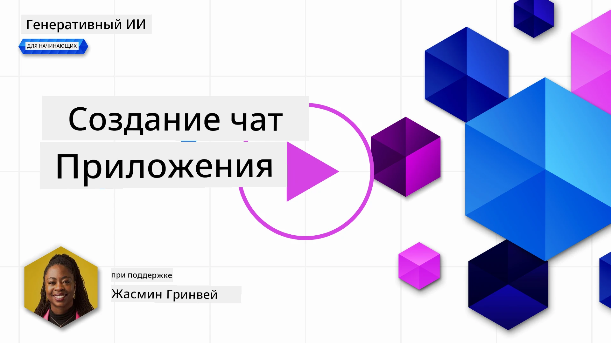
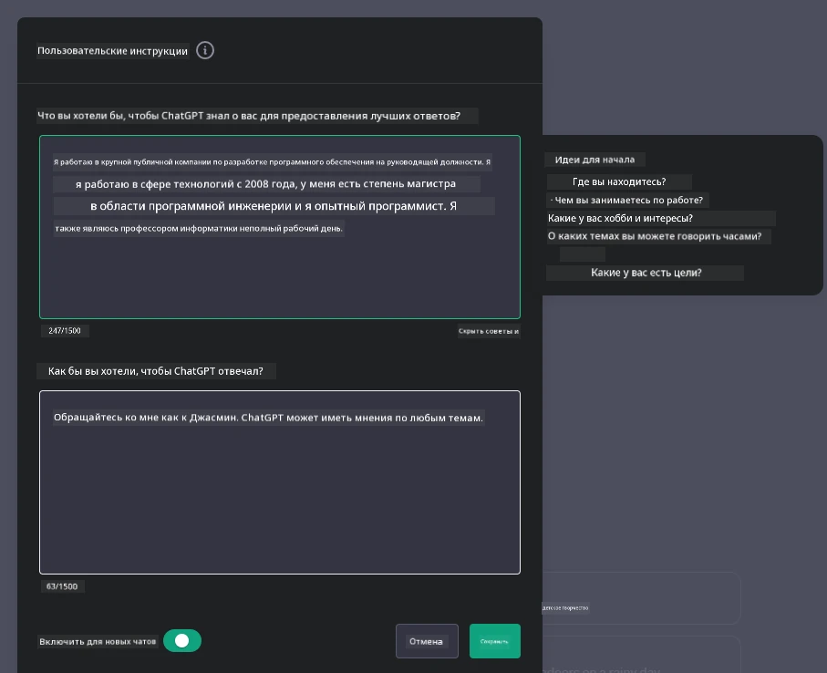
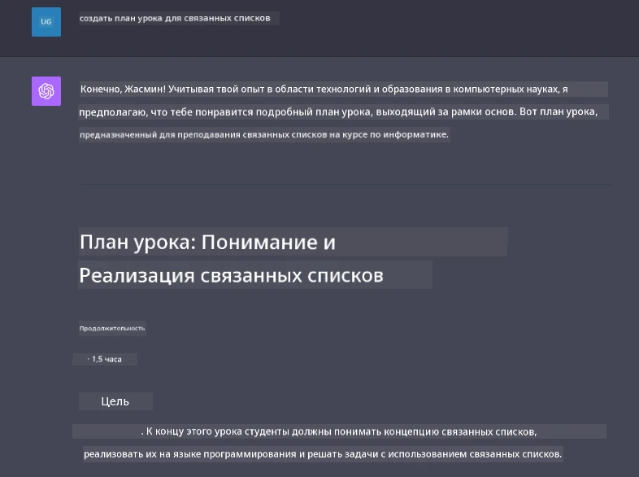

# Создание чат-приложений с генеративным ИИ

[](https://youtu.be/R9V0ZY1BEQo?si=IHuU-fS9YWT8s4sA)

> _(Нажмите на изображение выше, чтобы посмотреть видео этого урока)_

Теперь, когда мы увидели, как создавать приложения для генерации текста, давайте рассмотрим чат-приложения.

Чат-приложения стали неотъемлемой частью нашей повседневной жизни, предлагая не просто средство для непринужденного общения. Они являются важной частью обслуживания клиентов, технической поддержки и даже сложных консультативных систем. Вероятно, что вы недавно получили помощь через чат-приложение. По мере интеграции более продвинутых технологий, таких как генеративный ИИ, в эти платформы, растет и сложность, а вместе с ней и вызовы.

Некоторые вопросы, на которые нам нужно ответить:

- **Создание приложения**. Как эффективно создавать и бесшовно интегрировать эти приложения с ИИ для конкретных случаев использования?
- **Мониторинг**. После развертывания, как можно отслеживать и обеспечивать максимальное качество работы приложений, как с точки зрения функциональности, так и соблюдения [шести принципов ответственного ИИ](https://www.microsoft.com/ai/responsible-ai?WT.mc_id=academic-105485-koreyst)?

По мере того как мы движемся в эпоху, определяемую автоматизацией и беспрепятственным взаимодействием человека с машиной, понимание того, как генеративный ИИ меняет охват, глубину и адаптивность чат-приложений, становится важным. В этом уроке мы рассмотрим архитектурные аспекты, поддерживающие эти сложные системы, изучим методы их тонкой настройки под задачи конкретных областей и оценим метрики и факторы, важные для обеспечения ответственного развертывания ИИ.

## Введение

В этом уроке рассматривается:

- Техники эффективного создания и интеграции чат-приложений.
- Как применять кастомизацию и тонкую настройку приложений.
- Стратегии и рекомендации для эффективного мониторинга чат-приложений.

## Цели обучения

К концу этого урока вы сможете:

- Описывать факторы, влияющие на создание и интеграцию чат-приложений в существующие системы.
- Кастомизировать чат-приложения под конкретные случаи использования.
- Определять ключевые метрики и факторы для эффективного мониторинга и поддержания качества чат-приложений с ИИ.
- Обеспечивать ответственное использование ИИ в чат-приложениях.

## Интеграция генеративного ИИ в чат-приложения

Повышение уровня чат-приложений с помощью генеративного ИИ — это не только вопрос повышения их интеллекта; это оптимизация архитектуры, производительности и пользовательского интерфейса для обеспечения качественного пользовательского опыта. Это включает изучение архитектурных основ, интеграции API и особенностей пользовательского интерфейса. Этот раздел предназначен для того, чтобы дать вам всеобъемлющее руководство по работе с этими сложными системами, будь то интеграция в существующие системы или создание отдельных платформ.

К концу этого раздела вы овладеете знаниями, необходимыми для эффективного построения и интеграции чат-приложений.

### Чат-бот или чат-приложение?

Прежде чем перейти к созданию чат-приложений, давайте сравним «чат-боты» и «чат-приложения с ИИ», которые выполняют разные задачи и имеют отличающиеся функциональные возможности. Основная цель чат-бота — автоматизировать конкретные разговорные задачи, такие как ответы на часто задаваемые вопросы или отслеживание посылок. Обычно он работает на основе правил или сложных алгоритмов ИИ. В отличие от этого, чат-приложение с поддержкой генеративного ИИ — это гораздо более широкая среда, предназначенная для различных форм цифрового общения, таких как текстовые, голосовые и видеочаты между людьми. Его ключевая особенность — интеграция модели генеративного ИИ, которая имитирует тонкие, похожие на человеческие беседы, генерируя ответы на основе разнообразных входных данных и контекстных подсказок. Чат-приложение на базе генеративного ИИ может вести открытые дискуссии, адаптироваться к меняющемуся контексту общения и даже создавать творческие или сложные диалоги.

В таблице ниже приведены ключевые отличия и сходства, чтобы помочь понять их уникальные роли в цифровом общении.

| Чат-бот                             | Чат-приложение с генеративным ИИ           |
| ---------------------------------- | ------------------------------------------ |
| Задача и логика на основе правил    | Осведомлен о контексте                      |
| Часто интегрирован в большие системы| Может содержать один или несколько чат-ботов|
| Ограничен программными функциями     | Включает модели генеративного ИИ           |
| Специализированные и структурированные взаимодействия | Способен к обсуждениям в открытой области  |

### Использование готовых функций через SDK и API

При создании чат-приложения отличной отправной точкой станет оценка уже существующих решений. Использование SDK и API для создания чат-приложений — это выгодная стратегия по многим причинам. Интегрируя хорошо документированные SDK и API, вы стратегически позиционируете свое приложение для долгосрочного успеха, решая задачи масштабируемости и обслуживания.

- **Ускоряет процесс разработки и снижает нагрузку**: Использование готовых функций вместо дорогостоящей самостоятельной разработки позволяет сконцентрироваться на других важных аспектах приложения, таких как бизнес-логика.
- **Лучшее выполнение**: При самостоятельной разработке функций рано или поздно появляется вопрос «Как это масштабируется? Сможет ли приложение справиться с резким увеличением числа пользователей?» Хорошо поддерживаемые SDK и API часто уже содержат встроенные решения для этих задач.
- **Проще обслуживание**: Обновления и улучшения проще управлять, поскольку большинство API и SDK требуют лишь обновления библиотеки при выпуске новой версии.
- **Доступ к передовым технологиям**: Использование моделей, которые были тонко настроены и обучены на обширных наборах данных, предоставляет вашему приложению возможности обработки естественного языка.

Доступ к функциям SDK или API обычно предполагает получение разрешения на использование предоставляемых сервисов, что часто осуществляется через уникальный ключ или токен аутентификации. Мы используем библиотеку OpenAI для Python, чтобы показать, как это выглядит. Вы также можете попробовать самостоятельно в следующей [тетрадке для OpenAI](./python/oai-assignment.ipynb?WT.mc_id=academic-105485-koreyst) или [тетрадке для Azure OpenAI Services](./python/aoai-assignment.ipynb?WT.mc_id=academic-105485-koreys) для этого урока.

```python
import os
from openai import OpenAI

API_KEY = os.getenv("OPENAI_API_KEY","")

client = OpenAI(
    api_key=API_KEY
    )

response = client.responses.create(model="gpt-4o-mini", input="Suggest two titles for an instructional lesson on chat applications for generative AI.", store=False)
print(response.output_text)
```

В приведенном примере используется модель GPT-4o mini с API Responses для завершения подсказки, но обратите внимание, что ключ API устанавливается заранее. Вы получите ошибку, если не установите ключ.

## Пользовательский опыт (UX)

Общие принципы UX применимы к чат-приложениям, но есть дополнительные моменты, которые становятся особенно важными из-за компонентов машинного обучения.

- **Механизм для устранения неоднозначностей**: Модели генеративного ИИ иногда выдают неоднозначные ответы. Функция, позволяющая пользователям запрашивать разъяснения, может быть полезной при возникновении этой проблемы.
- **Сохранение контекста**: Продвинутые модели генеративного ИИ способны запоминать контекст в рамках беседы, что может существенно улучшить пользовательский опыт. Предоставление пользователям возможности контролировать и управлять контекстом улучшает взаимодействие, но повышает риск сохранения конфиденциальной информации. Рассмотрение сроков хранения таких данных, например введение политики хранения, позволяет сбалансировать потребность в контексте и защиту конфиденциальности.
- **Персонализация**: Благодаря способности к обучению и адаптации, модели ИИ могут предоставлять персонализированный опыт для пользователя. Настройка пользовательского опыта через такие функции, как пользовательские профили, не только создает ощущение понимания, но и помогает находить более точные ответы, делая взаимодействие более эффективным и удовлетворительным.

Один из примеров персонализации — настройки «Custom instructions» в ChatGPT от OpenAI. Они позволяют вам предоставить информацию о себе, которая может быть важным контекстом для ваших запросов. Вот пример такой инструкции.



Этот «профиль» заставляет ChatGPT создать план урока по связанным спискам. Обратите внимание, что ChatGPT учитывает, что пользователь может захотеть более глубокий план урока, основанный на ее опыте.



### Фреймворк системных сообщений Microsoft для больших языковых моделей

[Microsoft предоставила рекомендации](https://learn.microsoft.com/azure/ai-services/openai/concepts/system-message#define-the-models-output-format?WT.mc_id=academic-105485-koreyst) по написанию эффективных системных сообщений при генерации ответов от больших языковых моделей, разбитые на 4 области:

1. Определение, для кого предназначена модель, а также её возможностей и ограничений.
2. Определение формата вывода модели.
3. Предоставление конкретных примеров, демонстрирующих ожидаемое поведение модели.
4. Предоставление дополнительных правил поведения.

### Доступность

Независимо от того, есть ли у пользователя нарушения зрения, слуха, моторики или когнитивные нарушения, хорошо спроектированное чат-приложение должно быть доступно для всех. В списке ниже описаны конкретные функции, направленные на улучшение доступности для различных нарушений.

- **Функции для нарушений зрения**: Темы с высоким контрастом и масштабируемый текст, совместимость с программами чтения с экрана.
- **Функции для нарушений слуха**: Текст-в-речь и речь-в-текст, визуальные оповещения о звуках.
- **Функции для моторных нарушений**: Поддержка навигации с клавиатуры, голосовое управление.
- **Функции для когнитивных нарушений**: Упрощённые языковые опции.

## Кастомизация и тонкая настройка моделей языка для конкретной области

Представьте чат-приложение, которое понимает жаргон вашей компании и предугадывает типичные запросы пользователей. Есть несколько подходов, которые стоит упомянуть:

- **Использование DSL-моделей**. DSL означает доменно-специфичный язык. Вы можете использовать так называемую DSL-модель, обученную на конкретной области, чтобы она понимала её концепции и сценарии.
- **Применение тонкой настройки (fine-tuning)**. Тонкая настройка — это процесс дополнительного обучения вашей модели на специфичных данных.

## Кастомизация: использование DSL

Использование моделей, специфичных для домена (DSL Models), может увеличить вовлечённость пользователей, предоставляя специализированное, контекстуально релевантное взаимодействие. Это модель, которая обучается или тонко настраивается для понимания и генерации текста, связанного с определенной областью, отраслью или темой. Варианты использования DSL модели могут варьироваться от обучения модели с нуля до использования уже существующих через SDK и API. Другой вариант — тонкая настройка, которая подразумевает адаптацию существующей предварительно обученной модели под конкретный домен.

## Кастомизация: применение тонкой настройки

Тонкая настройка часто рассматривается, когда предварительно обученная модель недостаточно точна в специализированной области или для конкретной задачи.

Например, медицинские вопросы сложны и требуют большого контекста. Когда медицинский специалист ставит диагноз, он учитывает множество факторов, таких как образ жизни или сопутствующие заболевания, и может опираться на последние медицинские публикации для подтверждения диагноза. В таких сложных случаях универсальное ИИ чат-приложение не может быть надежным источником.

### Сценарий: медицинское приложение

Рассмотрите чат-приложение, которое помогает медицинским специалистам, предоставляя быстрые ссылки на рекомендации по лечению, взаимодействиям лекарств или последние исследования.

Универсальная модель может подойти для ответов на базовые медицинские вопросы или общие советы, но она может испытывать трудности с:

- **Очень специфическими или сложными случаями**. Например, невролог может спросить приложение: «Каковы современные лучшие практики при лечении лекарственно-устойчивой эпилепсии у детей?»
- **Отсутствием учета последних достижений**. Универсальная модель может не предоставить актуальный ответ с включением последних достижений в области неврологии и фармакологии.

В таких случаях тонкая настройка модели на специализированных медицинских данных значительно повышает ее способность более точно и надежно решать сложные медицинские запросы. Для этого нужен большой и релевантный набор данных, отражающий специфические задачи и вопросы в области.

## Факторы для высокого качества чат-приложений на базе ИИ

В этом разделе изложены критерии «высококачественных» чат-приложений, включая сбор актуальных метрик и соблюдение принципов ответственного использования технологий ИИ.

### Ключевые метрики

Чтобы поддерживать высокое качество работы приложения, необходимо отслеживать ключевые метрики и факторы. Эти показатели не только обеспечивают функциональность приложения, но и оценивают качество модели ИИ и пользовательский опыт. Ниже приведен список основных метрик для ИИ и UX, которые следует учитывать.

| Метрика                      | Определение                                                                                                        | Рекомендации для разработчика чата                             |
| ---------------------------- | ----------------------------------------------------------------------------------------------------------------- | ------------------------------------------------------------- |
| **Время работы (Uptime)**     | Измеряет время, когда приложение функционирует и доступно для пользователей.                                       | Как вы минимизируете время простоя?                           |
| **Время отклика**             | Время, которое приложение затрачивает на ответ пользователю.                                                     | Как оптимизировать обработку запросов для улучшения времени отклика? |
| **Точность (Precision)**      | Отношение истинно-положительных предсказаний к общему числу положительных предсказаний.                          | Как вы будете проверять точность вашей модели?                |
| **Полнота (Recall, Sensitivity)** | Отношение истинно-положительных предсказаний к реальному числу положительных случаев.                             | Как измерять и улучшать полноту?                               |
| **F1-мера**                  | Гармоническое среднее точности и полноты, балансирующее между ними.                                              | Какова ваша целевая F1-мера? Как вы балансируете точность и полноту? |
| **Перплексия (Perplexity)**  | Измеряет, насколько вероятность, предсказанная моделью, совпадает с фактическим распределением данных.          | Как вы будете минимизировать перплексию?                      |
| **Метрики удовлетворенности пользователей** | Измеряет восприятие приложения пользователем. Часто собирается через опросы.                                       | Как часто вы будете собирать отзывы пользователей? Как будете на них реагировать? |
| **Процент ошибок**            | Частота ошибок модели в понимании или выдаче ответов.                                                            | Какие стратегии у вас есть для снижения уровня ошибок?        |
| **Циклы дообучения**         | Частота обновления модели с целью включения новых данных и знаний.                                               | Как часто вы будете переобучать модель? Что будет триггером для циклов переобучения? |

| **Обнаружение аномалий**    | Инструменты и методы для выявления необычных образцов, не соответствующих ожидаемому поведению.                      | Как вы будете реагировать на аномалии?                                   |

### Внедрение ответственных практик ИИ в чат-приложениях

Подход Microsoft к ответственному ИИ определил шесть принципов, которым следует руководствоваться при разработке и использовании ИИ. Ниже приведены принципы, их определения, а также вещи, которые разработчик чат-приложения должен учитывать и почему им следует относиться к ним серьезно.

| Принципы              | Определение Microsoft                                 | Что должен учитывать разработчик чат-приложения                       | Почему это важно                                                                     |
| --------------------- | --------------------------------------------------- | ---------------------------------------------------------------------- | ------------------------------------------------------------------------------------ |
| Справедливость        | Системы ИИ должны справедливо относиться ко всем.   | Убедиться, что чат-приложение не дискриминирует на основе данных пользователей. | Для создания доверия и инклюзивности среди пользователей; избегает юридических последствий. |
| Надежность и безопасность | Системы ИИ должны работать надежно и безопасно.    | Внедрять тестирование и меры безопасности для минимизации ошибок и рисков. | Обеспечивает удовлетворенность пользователей и предотвращает возможный вред.         |
| Конфиденциальность и безопасность | Системы ИИ должны быть защищены и уважать конфиденциальность. | Внедрять надежное шифрование и меры защиты данных.                      | Для защиты чувствительных данных пользователей и соблюдения законов о конфиденциальности.   |
| Инклюзивность         | Системы ИИ должны расширять возможности всех и вовлекать людей. | Проектировать UI/UX, доступные и удобные для разнообразной аудитории.    | Обеспечивает возможность использования приложения более широким кругом людей.         |
| Прозрачность          | Системы ИИ должны быть понятны.                      | Обеспечить ясную документацию и объяснения по ответам ИИ.               | Пользователи с большей вероятностью будут доверять системе, если смогут понять, как принимаются решения. |
| Ответственность       | Люди должны нести ответственность за системы ИИ.   | Установить четкий процесс аудита и улучшения решений ИИ.               | Позволяет проводить постоянные улучшения и корректирующие меры в случае ошибок.      |

## Задание

Смотрите [задание](../../../07-building-chat-applications/python). Оно проведет вас через серию упражнений: от запуска первых запросов в чат, до классификации и суммирования текста и прочего. Обратите внимание, что задания доступны на разных языках программирования!

## Отличная работа! Продолжайте обучение

После завершения этого урока ознакомьтесь с нашей [коллекцией по обучению генеративному ИИ](https://aka.ms/genai-collection?WT.mc_id=academic-105485-koreyst), чтобы продолжать совершенствовать свои знания в области генеративного ИИ!

Перейдите к уроку 8, чтобы узнать, как можно начать [создавать поисковые приложения](../08-building-search-applications/README.md?WT.mc_id=academic-105485-koreyst)!

---

<!-- CO-OP TRANSLATOR DISCLAIMER START -->
**Отказ от ответственности**:
Этот документ был переведен с использованием сервиса машинного перевода [Co-op Translator](https://github.com/Azure/co-op-translator). Несмотря на наши усилия по обеспечению точности, имейте в виду, что автоматический перевод может содержать ошибки или неточности. Оригинальный документ на его исходном языке следует считать авторитетным источником. Для получения критически важной информации рекомендуется обратиться к профессиональному человеческому переводу. Мы не несем ответственности за любые недоразумения или неправильные толкования, возникшие в результате использования этого перевода.
<!-- CO-OP TRANSLATOR DISCLAIMER END -->