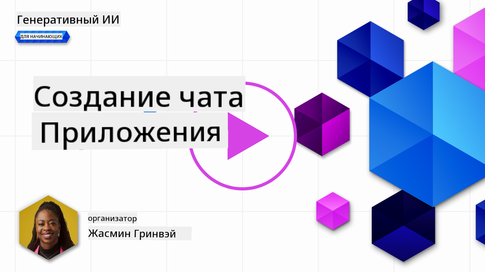
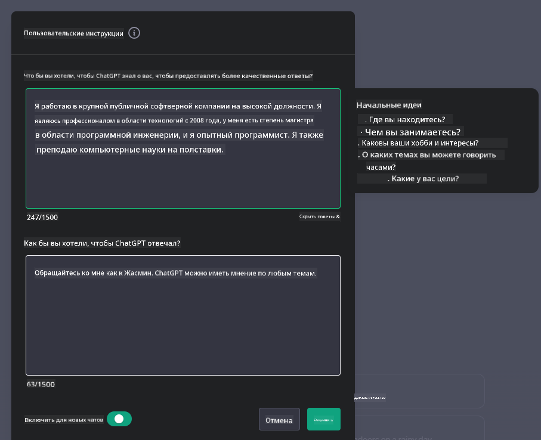

<!--
CO_OP_TRANSLATOR_METADATA:
{
  "original_hash": "ea4bbe640847aafbbba14dae4625e9af",
  "translation_date": "2025-06-25T15:06:24+00:00",
  "source_file": "07-building-chat-applications/README.md",
  "language_code": "ru"
}
-->
# Создание чат-приложений на основе генеративного ИИ

[](https://aka.ms/gen-ai-lessons7-gh?WT.mc_id=academic-105485-koreyst)

> _(Нажмите на изображение выше, чтобы посмотреть видео этого урока)_

Теперь, когда мы увидели, как можно создавать приложения для генерации текста, давайте рассмотрим чат-приложения.

Чат-приложения стали неотъемлемой частью нашей повседневной жизни, предлагая больше, чем просто средство для неформального общения. Они являются важной частью обслуживания клиентов, технической поддержки и даже сложных консультационных систем. Скорее всего, вы недавно получили помощь от чат-приложения. По мере интеграции более продвинутых технологий, таких как генеративный ИИ, в эти платформы, их сложность и вызовы увеличиваются.

Некоторые вопросы, на которые нам нужно ответить:

- **Создание приложения**. Как мы можем эффективно создать и без проблем интегрировать эти приложения на основе ИИ для конкретных сценариев использования?
- **Мониторинг**. После развертывания, как мы можем контролировать и гарантировать, что приложения работают на самом высоком уровне качества как с точки зрения функциональности, так и соблюдения [шести принципов ответственного ИИ](https://www.microsoft.com/ai/responsible-ai?WT.mc_id=academic-105485-koreyst)?

По мере того как мы углубляемся в эпоху, определяемую автоматизацией и плавным взаимодействием между человеком и машиной, понимание того, как генеративный ИИ трансформирует масштаб, глубину и адаптивность чат-приложений, становится необходимым. Этот урок исследует аспекты архитектуры, поддерживающей эти сложные системы, погружается в методологии их настройки для задач в определенной области и оценивает метрики и соображения, важные для обеспечения ответственного развертывания ИИ.

## Введение

Этот урок охватывает:

- Техники для эффективного создания и интеграции чат-приложений.
- Как применять настройку и тонкую настройку к приложениям.
- Стратегии и соображения для эффективного мониторинга чат-приложений.

## Цели обучения

К концу этого урока вы сможете:

- Описать соображения для создания и интеграции чат-приложений в существующие системы.
- Настраивать чат-приложения для конкретных сценариев использования.
- Определять ключевые метрики и соображения для эффективного мониторинга и поддержания качества чат-приложений на основе ИИ.
- Обеспечивать, чтобы чат-приложения использовали ИИ ответственно.

## Интеграция генеративного ИИ в чат-приложения

Повышение уровня чат-приложений с помощью генеративного ИИ не только сосредоточено на том, чтобы сделать их умнее; это также оптимизация их архитектуры, производительности и интерфейса пользователя для обеспечения качественного пользовательского опыта. Это включает исследование архитектурных основ, интеграции API и соображений интерфейса пользователя. Этот раздел предлагает вам всестороннюю дорожную карту для навигации по этим сложным ландшафтам, независимо от того, подключаете ли вы их к существующим системам или строите их как самостоятельные платформы.

К концу этого раздела вы будете обладать знаниями, необходимыми для эффективного создания и внедрения чат-приложений.

### Чат-бот или чат-приложение?

Прежде чем углубляться в создание чат-приложений, давайте сравним «чат-ботов» и «чат-приложения на основе ИИ», которые выполняют разные роли и функции. Основная цель чат-бота — автоматизация конкретных задач общения, таких как ответы на часто задаваемые вопросы или отслеживание посылки. Обычно он управляется логикой на основе правил или сложными алгоритмами ИИ. В отличие от этого, чат-приложение на основе ИИ — это гораздо более обширная среда, предназначенная для содействия различным формам цифрового общения, таким как текстовые, голосовые и видеочаты между пользователями. Его определяющая особенность — интеграция генеративной модели ИИ, которая симулирует тонкие, похожие на человеческие разговоры, генерируя ответы на основе широкого спектра вводных данных и контекстных подсказок. Чат-приложение на основе генеративного ИИ может участвовать в обсуждениях на открытые темы, адаптироваться к изменяющимся контекстам общения и даже создавать творческие или сложные диалоги.

Таблица ниже описывает ключевые различия и сходства, чтобы помочь нам понять их уникальные роли в цифровом общении.

| Чат-бот                               | Чат-приложение на основе генеративного ИИ |
| ------------------------------------- | ----------------------------------------- |
| Ориентирован на задачи и управляется правилами | Учитывает контекст                          |
| Часто интегрирован в большие системы  | Может содержать один или несколько чат-ботов |
| Ограничен запрограммированными функциями | Включает модели генеративного ИИ           |
| Специализированные и структурированные взаимодействия | Способен к обсуждениям на открытые темы    |

### Использование готовых функций с SDK и API

При создании чат-приложения первым шагом будет оценка того, что уже существует. Использование SDK и API для создания чат-приложений является выгодной стратегией по ряду причин. Интегрируя хорошо задокументированные SDK и API, вы стратегически позиционируете свое приложение для долгосрочного успеха, решая проблемы масштабируемости и обслуживания.

- **Ускоряет процесс разработки и снижает затраты**: полагаться на готовые функции вместо дорогостоящего процесса их создания позволяет сосредоточиться на других аспектах вашего приложения, которые могут быть для вас более важными, таких как бизнес-логика.
- **Улучшенная производительность**: при создании функциональности с нуля вы в конечном итоге зададитесь вопросом: «Как это масштабируется? Способно ли это приложение справиться с внезапным наплывом пользователей?» Хорошо поддерживаемые SDK и API часто имеют встроенные решения для этих проблем.
- **Проще обслуживать**: обновления и улучшения проще управлять, так как большинство API и SDK требуют просто обновления библиотеки при выпуске новой версии.
- **Доступ к передовым технологиям**: использование моделей, которые были настроены и обучены на обширных наборах данных, предоставляет вашему приложению возможности обработки естественного языка.

Доступ к функциональности SDK или API обычно включает получение разрешения на использование предоставляемых услуг, что часто осуществляется с помощью уникального ключа или токена аутентификации. Мы будем использовать библиотеку OpenAI Python, чтобы исследовать, как это выглядит. Вы также можете попробовать это самостоятельно в следующем [ноутбуке для OpenAI](../../../07-building-chat-applications/python/oai-assignment.ipynb) или [ноутбуке для Azure OpenAI Services](../../../07-building-chat-applications/python/aoai-assignment.ipynb) для этого урока.

```python
import os
from openai import OpenAI

API_KEY = os.getenv("OPENAI_API_KEY","")

client = OpenAI(
    api_key=API_KEY
    )

chat_completion = client.chat.completions.create(model="gpt-3.5-turbo", messages=[{"role": "user", "content": "Suggest two titles for an instructional lesson on chat applications for generative AI."}])
```

Приведенный выше пример использует модель GPT-3.5 Turbo для завершения запроса, но обратите внимание, что ключ API установлен перед этим. Вы получите ошибку, если не установите ключ.

## Пользовательский опыт (UX)

Общие принципы UX применимы к чат-приложениям, но есть некоторые дополнительные соображения, которые становятся особенно важными из-за вовлеченных компонентов машинного обучения.

- **Механизм для устранения неоднозначности**: модели генеративного ИИ иногда генерируют неоднозначные ответы. Функция, позволяющая пользователям запрашивать разъяснения, может быть полезной, если они столкнутся с этой проблемой.
- **Сохранение контекста**: продвинутые модели генеративного ИИ имеют возможность запоминать контекст в рамках разговора, что может быть необходимым активом для пользовательского опыта. Предоставление пользователям возможности контролировать и управлять контекстом улучшает пользовательский опыт, но вводит риск сохранения конфиденциальной информации пользователя. Соображения о том, как долго эта информация хранится, например, введение политики хранения, могут сбалансировать необходимость в контексте с защитой конфиденциальности.
- **Персонализация**: благодаря способности учиться и адаптироваться, модели ИИ предлагают индивидуальный опыт для пользователя. Настройка пользовательского опыта через такие функции, как профили пользователей, не только делает пользователя более понятым, но и помогает ему находить конкретные ответы, создавая более эффективное и удовлетворительное взаимодействие.

Одним из примеров персонализации является настройка «Пользовательские инструкции» в ChatGPT от OpenAI. Она позволяет вам предоставлять информацию о себе, которая может быть важным контекстом для ваших запросов. Вот пример пользовательской инструкции.



Этот «профиль» побуждает ChatGPT создать план урока по связанным спискам. Обратите внимание, что ChatGPT учитывает, что пользователь может захотеть более углубленный план урока на основе ее опыта.


### Система сообщений Microsoft для крупных языковых моделей

[Microsoft предоставила руководство](https://learn.microsoft.com/azure/ai-services/openai/concepts/system-message#define-the-models-output-format?WT.mc_id=academic-105485-koreyst) по написанию эффективных системных сообщений при генерации ответов от LLM, разбитое на 4 области:

1. Определение, для кого предназначена модель, а также ее возможности и ограничения.
2. Определение формата вывода модели.
3. Предоставление конкретных примеров, демонстрирующих предполагаемое поведение модели.
4. Предоставление дополнительных ограничений поведения.

### Доступность

Независимо от того, есть ли у пользователя нарушения зрения, слуха, двигательные или когнитивные нарушения, хорошо спроектированное чат-приложение должно быть удобным для всех. Следующий список разбивает конкретные функции, направленные на улучшение доступности для различных нарушений пользователей.

- **Функции для нарушения зрения**: темы с высоким контрастом и возможность изменения размера текста, совместимость с экранными читалками.
- **Функции для нарушения слуха**: функции преобразования текста в речь и речи в текст, визуальные подсказки для аудиоуведомлений.
- **Функции для нарушения двигательных функций**: поддержка навигации с помощью клавиатуры, голосовые команды.
- **Функции для когнитивных нарушений**: упрощенные языковые опции.

## Настройка и тонкая настройка для языковых моделей, специфичных для домена

Представьте себе чат-приложение, которое понимает жаргон вашей компании и предугадывает конкретные запросы, которые обычно возникают у его пользователей. Существует несколько подходов, которые стоит упомянуть:

- **Использование моделей DSL**. DSL означает язык, специфичный для домена. Вы можете использовать так называемую модель DSL, обученную на определенном домене, чтобы понимать его концепции и сценарии.
- **Применение тонкой настройки**. Тонкая настройка — это процесс дальнейшего обучения вашей модели с использованием конкретных данных.

## Настройка: использование DSL

Использование моделей языка, специфичных для домена (DSL-модели), может повысить вовлеченность пользователей, предоставляя специализированные, контекстно значимые взаимодействия. Это модель, которая обучена или настроена для понимания и генерации текста, связанного с определенной областью, отраслью или темой. Варианты использования модели DSL могут варьироваться от обучения с нуля до использования существующих через SDK и API. Еще один вариант — тонкая настройка, которая включает адаптацию существующей предварительно обученной модели для определенного домена.

## Настройка: применение тонкой настройки

Тонкая настройка часто рассматривается, когда предварительно обученная модель не справляется в специализированном домене или с конкретной задачей.

Например, медицинские запросы сложны и требуют большого контекста. Когда медицинский специалист ставит диагноз пациенту, он основывается на различных факторах, таких как образ жизни или существующие заболевания, и может даже полагаться на последние медицинские журналы для подтверждения своего диагноза. В таких сложных сценариях общее приложение для общения на основе ИИ не может быть надежным источником.

### Сценарий: медицинское приложение

Рассмотрим чат-приложение, предназначенное для помощи медицинским специалистам, предоставляя быстрые ссылки на руководства по лечению, взаимодействие лекарств или последние научные исследования.

Общая модель может быть достаточной для ответа на базовые медицинские вопросы или предоставления общих советов, но может испытывать трудности со следующим:

- **Очень специфические или сложные случаи**. Например, невролог может спросить у приложения: «Какие текущие лучшие практики для управления лекарственно-устойчивой эпилепсией у педиатрических пациентов?»
- **Отсутствие последних достижений**. Общая модель может испытывать трудности с предоставлением актуального ответа, который включает последние достижения в области неврологии и фармакологии.

В таких случаях тонкая настройка модели с использованием специализированного медицинского набора данных может значительно улучшить ее способность справляться с этими сложными медицинскими запросами более точно и надежно. Это требует доступа к большому и релевантному набору данных, который представляет собой специфические для домена проблемы и вопросы, которые необходимо решить.

## Соображения для качественного опыта общения на основе ИИ

Этот раздел описывает критерии «высококачественных» чат-приложений, которые включают сбор действенных метрик и соблюдение рамок, которые ответственно используют технологии ИИ.

### Ключевые метрики

Чтобы поддерживать высококачественную производительность приложения, важно отслеживать ключевые метрики и соображения. Эти измерения не только обеспечивают функциональность приложения, но и оценивают качество модели ИИ и пользовательского опыта. Ниже приведен список, который охватывает основные метрики ИИ и пользовательского опыта, которые следует учитывать.

| Метрика                        | Определение                                                                                                            | Соображения для разработчика чатов                                       |
| ------------------------------ | ---------------------------------------------------------------------------------------------------------------------- | ------------------------------------------------------------------------ |
| **Время безотказной работы**   | Измеряет время, в течение которого приложение работает и доступно для пользователей.                                   | Как вы минимизируете время простоя?                                      |
| **Время ответа**               | Время, затраченное приложением на ответ на запрос пользователя.                                                        | Как вы можете оптимизировать обработку запросов для улучшения времени ответа? |
| **Точность**                   | Соотношение истинно положительных прогнозов к общему количеству положительных прогнозов                               | Как вы будете проверять точность вашей модели?                           |
| **Полнота (чувствительность)** | Соотношение истинно положительных прогнозов к фактическому количеству положительных                                   | Как вы будете измерять и улучшать полноту?                               |
| **F1-оценка**                  | Гармоническое среднее между точностью и полнотой, которое уравновешивает компромисс между ними.                        | Какова ваша целевая F1-оценка? Как вы будете балансировать точность и полноту? |
| **Перплексия**                 | Измеряет, насколько хорошо распределение вероятностей, предсказанное моделью, согласуется с фактическим распределением данных. | Как вы будете минимизировать перплексию?                                |
| **Метрики удовлетворенности пользователей** | Измеряет восприятие пользователем приложения. Часто собирается через опросы.                                        | Как часто вы будете собирать отзывы пользователей? Как вы будете адаптироваться на их основе? |
| **Уровень ошибок**             | Частота, с которой модель совершает ошибки в понимании или выводе.                                                     | Какие стратегии у вас есть для снижения уровня ошибок?                   |
| **Циклы повторного обучения**  | Частота, с которой модель обновляется для включения новых данных и идей.                                              | Как часто вы будете повторно обучать модель? Что вызывает цикл повторного обучения? |
| **Обнаружение аномалий**       | Инструменты и методы для выявления необычных шаблонов, которые не соответствуют ожидаемому поведению.                   | Как вы будете реагировать на аномалии?                                   |

### Внедрение практик ответственного использования ИИ в чат-приложениях

Подход Microsoft к ответственному использованию ИИ определил шесть принципов, которые должны направлять разработку и использование ИИ. Ниже приведены принципы, их определение и соображения, которые должен учитывать разработчик чатов, а также почему они важны.

| Принципы                | Определение Microsoft                               | Соображения для разработчика чатов                                      | Почему это важно                                                                        |
| ----------------------- | --------------------------------------------------- | ----------------------------------------------------------------------- | --------------------------------------------------------------------------------------- |
| Справедливость          | Системы ИИ должны относиться ко всем людям справедливо. | Обеспечьте, чтобы чат-приложение не дискриминировало на основе данных пользователя. | Для создания доверия и инклюзивности среди пользователей; избегает юридических последствий. |
| Надежность и безопасность | Системы ИИ должны работать надежно и безопасно.     | Внедрите тестирование и предохранительные меры для минимизации ошибок и рисков. | Обеспечивает удовлетворенность пользователей и предотвращает потенциальный вред.         |
| Конфиденциальность и безопасность | Системы ИИ должны быть безопасными и уважать конфиденциальность. | Внедрите сильное шифрование и меры защиты данных.                       | Для защиты конфиденциальных данных пользователей и соблюдения законов о конфиденциальности. |
| Инклюзивность           | Системы ИИ должны расширять возможности всех людей и вовлекать их. | Разработайте интерфейс, который доступен и прост в использовании для разнообразной аудитории. | Об

**Отказ от ответственности**:  
Этот документ был переведен с использованием службы автоматического перевода [Co-op Translator](https://github.com/Azure/co-op-translator). Хотя мы стремимся к точности, пожалуйста, учитывайте, что автоматические переводы могут содержать ошибки или неточности. Оригинальный документ на его родном языке должен считаться авторитетным источником. Для получения критически важной информации рекомендуется профессиональный перевод человеком. Мы не несем ответственности за любые недопонимания или неверные толкования, возникающие в результате использования этого перевода.