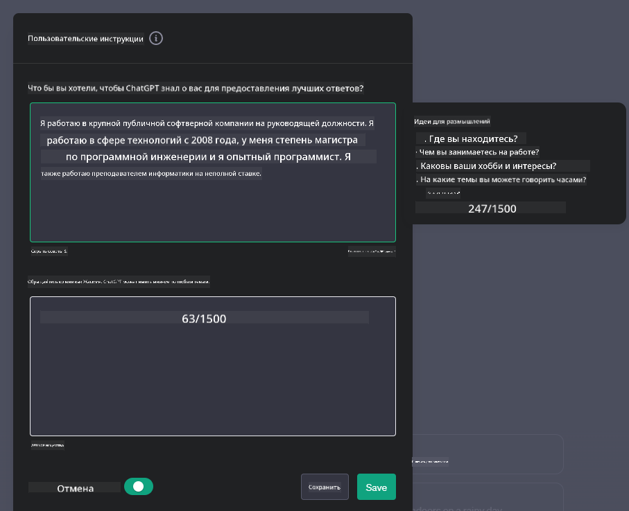

<!--
CO_OP_TRANSLATOR_METADATA:
{
  "original_hash": "ea4bbe640847aafbbba14dae4625e9af",
  "translation_date": "2025-07-09T12:15:37+00:00",
  "source_file": "07-building-chat-applications/README.md",
  "language_code": "ru"
}
-->
# Создание чат-приложений на базе генеративного ИИ

[](https://aka.ms/gen-ai-lessons7-gh?WT.mc_id=academic-105485-koreyst)

> _(Нажмите на изображение выше, чтобы посмотреть видео этого урока)_

Теперь, когда мы рассмотрели, как создавать приложения для генерации текста, давайте перейдём к чат-приложениям.

Чат-приложения прочно вошли в нашу повседневную жизнь, предлагая не просто средство для непринуждённого общения. Они стали неотъемлемой частью клиентской поддержки, технической помощи и даже сложных консультационных систем. Скорее всего, вы недавно уже получали помощь через чат-приложение. По мере интеграции более продвинутых технологий, таких как генеративный ИИ, в эти платформы, растёт и их сложность, а вместе с ней — и вызовы.

Некоторые вопросы, на которые нам нужно найти ответы:

- **Создание приложения**. Как эффективно создавать и бесшовно интегрировать эти приложения с ИИ для конкретных задач?
- **Мониторинг**. После развертывания, как мы можем отслеживать и гарантировать, что приложения работают на высшем уровне качества — как с точки зрения функциональности, так и соблюдения [шести принципов ответственного ИИ](https://www.microsoft.com/ai/responsible-ai?WT.mc_id=academic-105485-koreyst)?

В эпоху автоматизации и плавного взаимодействия человека с машиной понимание того, как генеративный ИИ меняет масштаб, глубину и адаптивность чат-приложений, становится крайне важным. В этом уроке мы рассмотрим архитектурные аспекты, поддерживающие такие сложные системы, методы их тонкой настройки под конкретные задачи, а также оценим метрики и факторы, необходимые для ответственного использования ИИ.

## Введение

В этом уроке вы узнаете:

- Техники эффективного создания и интеграции чат-приложений.
- Как применять кастомизацию и тонкую настройку приложений.
- Стратегии и рекомендации по эффективному мониторингу чат-приложений.

## Цели обучения

К концу урока вы сможете:

- Описывать особенности создания и интеграции чат-приложений в существующие системы.
- Настраивать чат-приложения под конкретные задачи.
- Определять ключевые метрики и факторы для эффективного мониторинга и поддержания качества ИИ-чатов.
- Обеспечивать ответственное использование ИИ в чат-приложениях.

## Интеграция генеративного ИИ в чат-приложения

Повышение возможностей чат-приложений с помощью генеративного ИИ — это не только про умнее, но и про оптимизацию архитектуры, производительности и интерфейса для качественного пользовательского опыта. Это включает изучение архитектурных основ, интеграций через API и особенностей пользовательского интерфейса. Этот раздел даст вам подробную дорожную карту для работы с этими сложными системами — будь то интеграция в существующие решения или создание самостоятельных платформ.

К концу раздела вы получите необходимые знания для эффективного создания и внедрения чат-приложений.

### Чатбот или чат-приложение?

Прежде чем приступить к созданию чат-приложений, давайте сравним «чатботы» и «чат-приложения с ИИ», которые выполняют разные функции. Основная задача чатбота — автоматизация конкретных разговорных задач, например, ответы на часто задаваемые вопросы или отслеживание посылки. Обычно он работает на основе правил или сложных алгоритмов ИИ. В отличие от этого, чат-приложение с ИИ — это гораздо более широкая среда, предназначенная для различных форм цифрового общения: текстовых, голосовых и видеочатов между людьми. Его ключевая особенность — интеграция генеративной модели ИИ, которая имитирует нюансированные, похожие на человеческие диалоги, генерируя ответы на основе разнообразных входных данных и контекста. Такое приложение может вести открытые обсуждения, адаптироваться к меняющемуся контексту и даже создавать творческие или сложные диалоги.

В таблице ниже приведены основные различия и сходства, чтобы лучше понять их уникальные роли в цифровом общении.

| Чатбот                               | Чат-приложение с генеративным ИИ          |
| ----------------------------------- | ----------------------------------------- |
| Ориентирован на конкретные задачи и основан на правилах | Учитывает контекст                        |
| Часто интегрирован в более крупные системы | Может содержать один или несколько чатботов |
| Ограничен запрограммированными функциями | Включает генеративные модели ИИ           |
| Специализированные и структурированные взаимодействия | Способен к открытым обсуждениям           |

### Использование готовых функций через SDK и API

При создании чат-приложения полезно сначала оценить, что уже доступно. Использование SDK и API — выгодная стратегия по нескольким причинам. Интегрируя хорошо документированные SDK и API, вы стратегически обеспечиваете долгосрочный успех приложения, учитывая масштабируемость и удобство поддержки.

- **Ускоряет разработку и снижает нагрузку**: Использование готовых функций вместо их самостоятельной разработки позволяет сосредоточиться на других важных аспектах, например, бизнес-логике.
- **Лучшее быстродействие**: При создании функций с нуля рано или поздно возникает вопрос: «Как это масштабируется? Справится ли приложение с резким ростом пользователей?» Хорошо поддерживаемые SDK и API часто уже содержат решения для таких задач.
- **Проще поддерживать**: Обновления и улучшения проще внедрять, так как большинство API и SDK требуют лишь обновления библиотеки при выходе новой версии.
- **Доступ к передовым технологиям**: Использование моделей, обученных на больших наборах данных и тонко настроенных, обеспечивает приложению возможности обработки естественного языка.

Доступ к функциям SDK или API обычно требует разрешения на использование сервисов, часто через уникальный ключ или токен аутентификации. Мы воспользуемся библиотекой OpenAI для Python, чтобы показать, как это работает. Вы также можете попробовать самостоятельно в следующих [ноутбуках для OpenAI](python/oai-assignment.ipynb) и [Azure OpenAI Services](python/aoai-assignment.ipynb) для этого урока.

```python
import os
from openai import OpenAI

API_KEY = os.getenv("OPENAI_API_KEY","")

client = OpenAI(
    api_key=API_KEY
    )

chat_completion = client.chat.completions.create(model="gpt-3.5-turbo", messages=[{"role": "user", "content": "Suggest two titles for an instructional lesson on chat applications for generative AI."}])
```

В приведённом примере используется модель GPT-3.5 Turbo для завершения запроса, но обратите внимание, что ключ API устанавливается заранее. Без него возникнет ошибка.

## Пользовательский опыт (UX)

Общие принципы UX применимы и к чат-приложениям, но здесь есть дополнительные моменты, особенно важные из-за компонентов машинного обучения.

- **Механизм для разрешения неоднозначностей**: Генеративные модели ИИ иногда дают неоднозначные ответы. Функция, позволяющая пользователям запрашивать уточнения, может быть очень полезной.
- **Сохранение контекста**: Продвинутые модели генеративного ИИ способны запоминать контекст разговора, что значительно улучшает опыт пользователя. Возможность управлять контекстом повышает удобство, но несёт риск хранения чувствительной информации. Важно продумать, как долго хранить эти данные, например, введя политику хранения, чтобы сбалансировать потребность в контексте и конфиденциальность.
- **Персонализация**: Благодаря способности учиться и адаптироваться, ИИ-модели могут создавать индивидуальный опыт для пользователя. Настройка через профили помогает пользователю чувствовать себя понятым и ускоряет поиск нужных ответов, делая взаимодействие более эффективным и приятным.

Пример персонализации — настройки «Custom instructions» в ChatGPT от OpenAI. Они позволяют указать информацию о себе, которая важна для контекста запросов. Вот пример такой настройки.



Этот «профиль» подсказывает ChatGPT создать план урока по связанным спискам. Обратите внимание, что ChatGPT учитывает, что пользователь хочет более глубокий план, исходя из её опыта.


### Системные сообщения Microsoft для больших языковых моделей

[Microsoft предоставила рекомендации](https://learn.microsoft.com/azure/ai-services/openai/concepts/system-message#define-the-models-output-format?WT.mc_id=academic-105485-koreyst) по созданию эффективных системных сообщений для генерации ответов LLM, разбитые на 4 направления:

1. Определение целевой аудитории модели, её возможностей и ограничений.
2. Определение формата вывода модели.
3. Приведение конкретных примеров, демонстрирующих желаемое поведение модели.
4. Введение дополнительных ограничений для поведения модели.

### Доступность

Независимо от того, есть ли у пользователя нарушения зрения, слуха, моторики или когнитивные особенности, хорошо спроектированное чат-приложение должно быть доступно для всех. Ниже перечислены функции, направленные на улучшение доступности для различных типов ограничений.

- **Для нарушений зрения**: темы с высоким контрастом, масштабируемый текст, совместимость с экранными читалками.
- **Для нарушений слуха**: функции преобразования текста в речь и речи в текст, визуальные уведомления о звуках.
- **Для нарушений моторики**: поддержка навигации с клавиатуры, голосовые команды.
- **Для когнитивных нарушений**: упрощённые языковые опции.

## Кастомизация и тонкая настройка моделей для конкретных областей

Представьте чат-приложение, которое понимает профессиональный жаргон вашей компании и предугадывает типичные вопросы пользователей. Существуют несколько подходов:

- **Использование DSL-моделей**. DSL — это модели, обученные на языке конкретной области, которые понимают её концепции и сценарии.
- **Применение тонкой настройки**. Тонкая настройка — это дополнительное обучение модели на специфичных данных.

## Кастомизация: использование DSL

Использование моделей с языком конкретной области (DSL) повышает вовлечённость пользователей, обеспечивая специализированные и контекстно релевантные взаимодействия. Это модель, обученная или дообученная для понимания и генерации текста, связанного с определённой сферой, отраслью или темой. Варианты использования DSL включают обучение модели с нуля, использование готовых через SDK и API, а также тонкую настройку существующих моделей под конкретную область.

## Кастомизация: применение тонкой настройки

Тонкая настройка часто применяется, когда предобученная модель недостаточно хорошо справляется с узкоспециализированной областью или конкретной задачей.

Например, медицинские запросы сложны и требуют большого контекста. Когда врач ставит диагноз, он учитывает множество факторов: образ жизни, сопутствующие заболевания, а также может опираться на последние медицинские исследования. В таких тонких случаях универсальное ИИ-чат-приложение не может быть надёжным источником.

### Сценарий: медицинское приложение

Рассмотрим чат-приложение, которое помогает медицинским специалистам, предоставляя быстрый доступ к руководствам по лечению, взаимодействиям лекарств или последним исследованиям.

Общая модель может справляться с базовыми медицинскими вопросами или общими советами, но может испытывать трудности с:

- **Очень специфичными или сложными случаями**. Например, невролог может спросить: «Какие сейчас лучшие практики для лечения лекарственно-устойчивой эпилепсии у детей?»
- **Отсутствием учёта последних достижений**. Общая модель может не учитывать самые свежие данные в области неврологии и фармакологии.

В таких случаях тонкая настройка модели на специализированном медицинском наборе данных значительно повышает её способность точно и надёжно отвечать на сложные медицинские вопросы. Для этого нужен большой и релевантный набор данных, отражающий специфические задачи и вызовы области.

## Критерии высокого качества чат-приложений с ИИ

В этом разделе описаны критерии «высококачественных» чат-приложений, включая сбор полезных метрик и соблюдение принципов ответственного использования ИИ.

### Ключевые метрики

Для поддержания высокого качества работы приложения важно отслеживать ключевые метрики и факторы. Эти показатели не только обеспечивают функциональность, но и оценивают качество модели ИИ и пользовательский опыт. Ниже приведён список основных метрик для учёта.

| Метрика                       | Определение                                                                                                           | Рекомендации для разработчика чата                              |
| ---------------------------- | -------------------------------------------------------------------------------------------------------------------- | ---------------------------------------------------------------- |
| **Время безотказной работы** | Время, в течение которого приложение доступно и работает для пользователей.                                          | Как минимизировать время простоя?                               |
| **Время отклика**            | Время, за которое приложение отвечает на запрос пользователя.                                                        | Как оптимизировать обработку запросов для улучшения времени отклика? |
| **Точность (Precision)**     | Отношение истинно положительных предсказаний к общему числу положительных предсказаний.                              | Как вы будете проверять точность модели?                        |
| **Полнота (Recall, Sensitivity)** | Отношение истинно положительных предсказаний к фактическому числу положительных случаев.                            | Как измерять и улучшать полноту?                                |
| **F1-мера**                  | Гармоническое среднее точности и полноты, балансирующее между ними.                                                  | Какова ваша целевая F1-мера? Как вы будете балансировать точность и полноту? |
| **Перплексия**               | Оценивает, насколько распределение вероятностей, предсказанное моделью, соответствует реальному распределению данных. | Как вы будете снижать перплексию?                               |
| **Метрики удовлетворённости пользователей** | Оценивают восприятие приложения пользователями, часто собираются через опросы.                                    | Как часто вы будете собирать обратную связь? Как будете её использовать? |
| **Уровень ошибок**           | Частота ошибок модели в понимании или генерации ответов.                                                             | Какие стратегии у вас есть для снижения ошибок?                 |
| **Циклы переобучения**       | Частота обновления модели с учётом новых данных и знаний.                                                            | Как часто вы будете переобучать модель? Что будет триггером для переобучения? |
| **Обнаружение аномалий**     | Инструменты и методы для выявления необычных шаблонов, которые не соответствуют ожидаемому поведению.                     | Как вы будете реагировать на аномалии?                                         |

### Внедрение принципов ответственного ИИ в чат-приложениях

Подход Microsoft к ответственному ИИ выделяет шесть принципов, которые должны направлять разработку и использование ИИ. Ниже приведены эти принципы, их определение, а также то, что разработчику чата стоит учитывать и почему это важно.

| Принципы               | Определение Microsoft                                | Рекомендации для разработчика чата                                      | Почему это важно                                                                     |
| ---------------------- | --------------------------------------------------- | ---------------------------------------------------------------------- | ------------------------------------------------------------------------------------ |
| Справедливость         | Системы ИИ должны справедливо относиться ко всем.  | Убедитесь, что чат-приложение не дискриминирует пользователей по данным. | Для создания доверия и инклюзивности среди пользователей; предотвращает юридические проблемы. |
| Надежность и безопасность | Системы ИИ должны работать надежно и безопасно.    | Внедрите тестирование и защитные механизмы для минимизации ошибок и рисков. | Обеспечивает удовлетворенность пользователей и предотвращает возможный вред.        |
| Конфиденциальность и безопасность | Системы ИИ должны быть защищены и уважать приватность. | Используйте надежное шифрование и меры защиты данных.                   | Для защиты конфиденциальных данных пользователей и соблюдения законов о приватности. |
| Инклюзивность          | Системы ИИ должны расширять возможности всех и вовлекать людей. | Разрабатывайте UI/UX, доступный и удобный для разных аудиторий.         | Обеспечивает возможность эффективного использования приложения более широким кругом людей. |
| Прозрачность           | Системы ИИ должны быть понятны.                      | Предоставляйте четкую документацию и объяснения ответов ИИ.             | Пользователи больше доверяют системе, если понимают, как принимаются решения.         |
| Ответственность        | Люди должны нести ответственность за системы ИИ.   | Установите четкий процесс аудита и улучшения решений ИИ.               | Позволяет постоянно совершенствовать систему и исправлять ошибки.                    |

## Задание

Смотрите [задание](../../../07-building-chat-applications/python) — оно проведет вас через серию упражнений: от запуска первых запросов в чате до классификации и суммирования текста и не только. Обратите внимание, что задания доступны на разных языках программирования!

## Отличная работа! Продолжайте обучение

После завершения этого урока ознакомьтесь с нашей [коллекцией по обучению генеративному ИИ](https://aka.ms/genai-collection?WT.mc_id=academic-105485-koreyst), чтобы продолжить развивать свои знания в области генеративного ИИ!

Перейдите к уроку 8, чтобы узнать, как начать [создавать поисковые приложения](../08-building-search-applications/README.md?WT.mc_id=academic-105485-koreyst)!

**Отказ от ответственности**:  
Этот документ был переведен с помощью сервиса автоматического перевода [Co-op Translator](https://github.com/Azure/co-op-translator). Несмотря на наши усилия по обеспечению точности, просим учитывать, что автоматический перевод может содержать ошибки или неточности. Оригинальный документ на его исходном языке следует считать авторитетным источником. Для получения критически важной информации рекомендуется обращаться к профессиональному переводу, выполненному человеком. Мы не несем ответственности за любые недоразумения или неправильные толкования, возникшие в результате использования данного перевода.