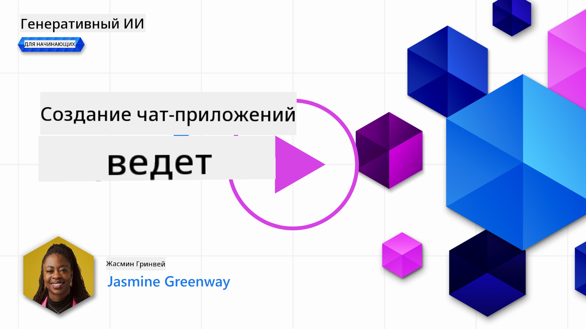

<!--
CO_OP_TRANSLATOR_METADATA:
{
  "original_hash": "a1f836db3d459bfd326b6fadca90866c",
  "translation_date": "2025-10-17T15:07:25+00:00",
  "source_file": "07-building-chat-applications/README.md",
  "language_code": "ru"
}
-->
# Создание чат-приложений с использованием генеративного ИИ

[](https://youtu.be/R9V0ZY1BEQo?si=IHuU-fS9YWT8s4sA)

> _(Нажмите на изображение выше, чтобы посмотреть видео урока)_

Теперь, когда мы рассмотрели, как создавать приложения для генерации текста, давайте перейдем к чат-приложениям.

Чат-приложения стали неотъемлемой частью нашей повседневной жизни, предлагая больше, чем просто средство для случайного общения. Они играют важную роль в обслуживании клиентов, технической поддержке и даже в сложных консультационных системах. Скорее всего, вы недавно получили помощь от чат-приложения. С внедрением более продвинутых технологий, таких как генеративный ИИ, сложность этих платформ возрастает, как и вызовы, связанные с их разработкой.

Некоторые вопросы, которые необходимо решить:

- **Создание приложения**. Как эффективно создать и интегрировать эти приложения, работающие на базе ИИ, для конкретных случаев использования?
- **Мониторинг**. После развертывания, как можно отслеживать и гарантировать, что приложения работают на высшем уровне качества, как с точки зрения функциональности, так и соблюдения [шести принципов ответственного ИИ](https://www.microsoft.com/ai/responsible-ai?WT.mc_id=academic-105485-koreyst)?

В эпоху автоматизации и бесшовного взаимодействия человека и машины понимание того, как генеративный ИИ трансформирует масштаб, глубину и адаптивность чат-приложений, становится необходимым. Этот урок исследует аспекты архитектуры, поддерживающей эти сложные системы, методы их настройки для задач конкретных доменов, а также метрики и соображения, важные для обеспечения ответственного развертывания ИИ.

## Введение

Этот урок охватывает:

- Техники эффективного создания и интеграции чат-приложений.
- Как применять настройку и доработку приложений.
- Стратегии и соображения для эффективного мониторинга чат-приложений.

## Цели обучения

К концу этого урока вы сможете:

- Описать соображения при создании и интеграции чат-приложений в существующие системы.
- Настраивать чат-приложения для конкретных случаев использования.
- Определять ключевые метрики и соображения для эффективного мониторинга и поддержания качества чат-приложений, работающих на базе ИИ.
- Гарантировать, что чат-приложения используют ИИ ответственно.

## Интеграция генеративного ИИ в чат-приложения

Повышение уровня чат-приложений с помощью генеративного ИИ заключается не только в их "умности"; это также оптимизация их архитектуры, производительности и пользовательского интерфейса для обеспечения качественного пользовательского опыта. Это включает исследование архитектурных основ, интеграцию API и соображения по пользовательскому интерфейсу. Этот раздел предлагает вам комплексный план для навигации по этим сложным аспектам, будь то интеграция в существующие системы или создание автономных платформ.

К концу этого раздела вы будете обладать знаниями, необходимыми для эффективного создания и интеграции чат-приложений.

### Чат-бот или чат-приложение?

Прежде чем мы перейдем к созданию чат-приложений, давайте сравним "чат-ботов" и "чат-приложения на базе ИИ", которые выполняют разные роли и функции. Основная цель чат-бота — автоматизация конкретных задач общения, таких как ответы на часто задаваемые вопросы или отслеживание посылки. Обычно он управляется логикой, основанной на правилах, или сложными алгоритмами ИИ. В отличие от этого, чат-приложение на базе ИИ — это гораздо более обширная среда, предназначенная для различных форм цифрового общения, таких как текстовые, голосовые и видеочаты между пользователями. Его отличительная черта — интеграция генеративной модели ИИ, которая имитирует тонкие, похожие на человеческие разговоры, генерируя ответы на основе широкого спектра ввода и контекстных подсказок. Чат-приложение на базе генеративного ИИ может вести открытые дискуссии, адаптироваться к изменяющимся контекстам общения и даже создавать творческие или сложные диалоги.

Таблица ниже описывает ключевые различия и сходства, чтобы помочь нам понять их уникальные роли в цифровом общении.

| Чат-бот                            | Чат-приложение на базе генеративного ИИ |
| ----------------------------------- | --------------------------------------- |
| Ориентирован на задачи, основан на правилах | Учитывает контекст                     |
| Часто интегрирован в более крупные системы | Может содержать один или несколько чат-ботов |
| Ограничен запрограммированными функциями | Включает модели генеративного ИИ       |
| Специализированные и структурированные взаимодействия | Способен вести открытые дискуссии      |

### Использование готовых функций с SDK и API

При создании чат-приложения хорошим первым шагом является оценка уже существующих решений. Использование SDK и API для создания чат-приложений — это выгодная стратегия по нескольким причинам. Интеграция хорошо документированных SDK и API стратегически позиционирует ваше приложение для долгосрочного успеха, решая вопросы масштабируемости и обслуживания.

- **Ускоряет процесс разработки и снижает затраты**: Использование готовых функций вместо дорогостоящего процесса их создания позволяет сосредоточиться на других аспектах вашего приложения, таких как бизнес-логика.
- **Лучшее производительность**: При создании функций с нуля вы неизбежно задаетесь вопросом: "Как это масштабируется? Сможет ли приложение справиться с внезапным наплывом пользователей?" Хорошо поддерживаемые SDK и API часто имеют встроенные решения для этих вопросов.
- **Удобство обслуживания**: Обновления и улучшения проще управлять, так как большинство API и SDK требуют лишь обновления библиотеки при выпуске новой версии.
- **Доступ к передовым технологиям**: Использование моделей, которые были доработаны и обучены на обширных наборах данных, предоставляет вашему приложению возможности обработки естественного языка.

Доступ к функциональности SDK или API обычно требует получения разрешения на использование предоставляемых услуг, что часто осуществляется через уникальный ключ или токен аутентификации. Мы будем использовать библиотеку OpenAI Python, чтобы изучить, как это выглядит. Вы также можете попробовать это самостоятельно в следующем [ноутбуке для OpenAI](./python/oai-assignment.ipynb?WT.mc_id=academic-105485-koreyst) или [ноутбуке для Azure OpenAI Services](./python/aoai-assignment.ipynb?WT.mc_id=academic-105485-koreys) для этого урока.

```python
import os
from openai import OpenAI

API_KEY = os.getenv("OPENAI_API_KEY","")

client = OpenAI(
    api_key=API_KEY
    )

chat_completion = client.chat.completions.create(model="gpt-3.5-turbo", messages=[{"role": "user", "content": "Suggest two titles for an instructional lesson on chat applications for generative AI."}])
```

В приведенном выше примере используется модель GPT-3.5 Turbo для завершения запроса, но обратите внимание, что ключ API устанавливается перед этим. Вы получите ошибку, если не установите ключ.

## Пользовательский опыт (UX)

Общие принципы UX применимы к чат-приложениям, но есть дополнительные соображения, которые становятся особенно важными из-за компонентов машинного обучения.

- **Механизм для устранения неоднозначности**: Генеративные модели ИИ иногда создают неоднозначные ответы. Функция, позволяющая пользователям запросить уточнение, может быть полезной в таких случаях.
- **Сохранение контекста**: Продвинутые генеративные модели ИИ способны запоминать контекст в рамках разговора, что может быть необходимым активом для пользовательского опыта. Предоставление пользователям возможности управлять контекстом улучшает пользовательский опыт, но вводит риск сохранения конфиденциальной информации. Соображения о том, как долго хранить эту информацию, например, введение политики хранения, могут сбалансировать необходимость контекста и конфиденциальность.
- **Персонализация**: Благодаря способности обучаться и адаптироваться, модели ИИ предлагают индивидуализированный опыт для пользователя. Настройка пользовательского опыта через такие функции, как профили пользователей, не только делает пользователя более понятным, но и помогает ему находить конкретные ответы, создавая более эффективное и удовлетворительное взаимодействие.

Одним из примеров персонализации является настройка "Custom instructions" в ChatGPT от OpenAI. Она позволяет вам предоставить информацию о себе, которая может быть важным контекстом для ваших запросов. Вот пример настройки.


Этот "профиль" побуждает ChatGPT создать план урока по связанным спискам. Обратите внимание, что ChatGPT учитывает, что пользователь может хотеть более углубленный план урока, основываясь на ее опыте.


### Система сообщений Microsoft для больших языковых моделей

[Microsoft предоставила рекомендации](https://learn.microsoft.com/azure/ai-services/openai/concepts/system-message#define-the-models-output-format?WT.mc_id=academic-105485-koreyst) по написанию эффективных системных сообщений при генерации ответов от больших языковых моделей, разделенные на 4 области:

1. Определение, для кого предназначена модель, а также ее возможностей и ограничений.
2. Определение формата вывода модели.
3. Предоставление конкретных примеров, демонстрирующих предполагаемое поведение модели.
4. Предоставление дополнительных ограничений поведения.

### Доступность

Независимо от того, есть ли у пользователя нарушения зрения, слуха, моторики или когнитивные нарушения, хорошо спроектированное чат-приложение должно быть доступным для всех. Следующий список разбивает конкретные функции, направленные на улучшение доступности для различных нарушений пользователей.

- **Функции для нарушений зрения**: Темы с высоким контрастом и изменяемый размер текста, совместимость с экранными чтецами.
- **Функции для нарушений слуха**: Функции преобразования текста в речь и речи в текст, визуальные подсказки для аудиоуведомлений.
- **Функции для нарушений моторики**: Поддержка навигации с помощью клавиатуры, голосовые команды.
- **Функции для когнитивных нарушений**: Упрощенные языковые опции.

## Настройка и доработка для языковых моделей, специфичных для домена

Представьте чат-приложение, которое понимает жаргон вашей компании и предугадывает конкретные запросы, которые часто возникают у его пользователей. Существует несколько подходов, которые стоит упомянуть:

- **Использование моделей DSL**. DSL означает язык, специфичный для домена. Вы можете использовать так называемую модель DSL, обученную на конкретном домене, чтобы понимать его концепции и сценарии.
- **Применение доработки**. Доработка — это процесс дополнительного обучения вашей модели с использованием конкретных данных.

## Настройка: использование DSL

Использование моделей языка, специфичных для домена (DSL Models), может повысить вовлеченность пользователей, предоставляя специализированные, контекстно релевантные взаимодействия. Это модель, которая обучена или доработана для понимания и генерации текста, связанного с определенной областью, отраслью или темой. Варианты использования модели DSL могут варьироваться от обучения с нуля до использования уже существующих через SDK и API. Другой вариант — доработка, которая включает адаптацию существующей предварительно обученной модели для конкретного домена.

## Настройка: применение доработки

Доработка часто рассматривается, когда предварительно обученная модель не справляется в специализированной области или с конкретной задачей.

Например, медицинские запросы сложны и требуют большого контекста. Когда медицинский специалист ставит диагноз пациенту, он основывается на различных факторах, таких как образ жизни или существующие заболевания, и может даже полагаться на последние медицинские журналы для подтверждения своего диагноза. В таких тонких сценариях универсальное чат-приложение на базе ИИ не может быть надежным источником.

### Сценарий: медицинское приложение

Рассмотрим чат-приложение, предназначенное для помощи медицинским работникам, предоставляя быстрые ссылки на руководства по лечению, взаимодействие лекарств или последние исследования.

Универсальная модель может быть достаточной для ответа на базовые медицинские вопросы или предоставления общих советов, но она может столкнуться со следующими проблемами:

- **Очень специфические или сложные случаи**. Например, невролог может спросить приложение: "Какие текущие лучшие практики для лечения лекарственно-устойчивой эпилепсии у детей?"
- **Отсутствие последних достижений**. Универсальная модель может испытывать трудности с предоставлением актуального ответа, который включает последние достижения в области неврологии и фармакологии.

В таких случаях доработка модели с использованием специализированного медицинского набора данных может значительно улучшить ее способность справляться с этими сложными медицинскими запросами более точно и надежно. Это требует доступа к большому и релевантному набору данных, который представляет собой задачи и вопросы, специфичные для домена, которые необходимо решить.

## Соображения для качественного чат-приложения на базе ИИ

В этом разделе описаны критерии "высококачественных" чат-приложений, включая сбор действенных метрик и соблюдение рамок, которые ответственно используют технологии ИИ.

### Ключевые метрики

Для поддержания высокого качества работы приложения важно отслеживать ключевые метрики и соображения. Эти измерения не только гарантируют функциональность приложения, но и оценивают качество модели ИИ и пользовательского опыта. Ниже приведен список, охватывающий основные метрики, метрики ИИ и метрики пользовательского опыта.

| Метрика                     | Определение                                                                                                             | Соображения для разработчика чата                                         |
| --------------------------- | ----------------------------------------------------------------------------------------------------------------------- | ------------------------------------------------------------------------- |
| **Время работы**            | Измеряет время, в течение которого приложение работает и доступно для пользователей.                                    | Как вы минимизируете время простоя?                                       |
| **Время ответа**            | Время, которое приложение затрачивает на ответ на запрос пользователя.                                                  | Как можно оптимизировать обработку запросов для улучшения времени ответа? |
| **Точность**                | Соотношение истинных положительных предсказаний к общему числу положительных предсказаний.                              | Как вы будете проверять точность вашей модели?                            |
| **Полнота (чувствительность)** | Соотношение истинных положительных предсказаний к фактическому числу положительных случаев.                           | Как вы будете измерять и улучшать полноту?                                |
| **F1 Score**                | Гармоническое среднее точности и полноты, которое балансирует компромисс между ними.                                    | Какова ваша целевая F1 Score? Как вы будете балансировать точность и полноту? |
| **Перплексия**              | Измеряет, насколько хорошо распределение вероятностей, предсказанное моделью, соответствует фактическому распределению данных. | Как вы будете минимизировать перплексию?                                  |
| **Метрики удовлетворенности пользователей** | Измеряет восприятие приложения пользователем. Часто собирается через опросы.                                    | Как часто вы будете собирать отзывы пользователей? Как вы будете адаптироваться на их основе? |
| **Уровень ошибок**          | Уровень, с которым модель допускает ошибки в понимании или выводе.                                                     | Какие стратегии у вас есть для снижения уровня ошибок?                    |
| **Циклы переобучения**      | Частота, с которой модель обновляется для включения новых данных и идей.                                               | Как часто вы будете переобучать модель? Что запускает цикл переобучения?  |
| **Обнаружение аномалий**      | Инструменты и методы для выявления необычных шаблонов, которые не соответствуют ожидаемому поведению.                  | Как вы будете реагировать на аномалии?                                               |

### Реализация принципов ответственного ИИ в чат-приложениях

Подход Microsoft к ответственному ИИ выделяет шесть принципов, которые должны направлять разработку и использование ИИ. Ниже приведены эти принципы, их определения, а также аспекты, которые должен учитывать разработчик чатов, и причины, почему это важно.

| Принципы              | Определение Microsoft                                 | Что учитывать разработчику чатов                                         | Почему это важно                                                                         |
| ---------------------- | ---------------------------------------------------- | ------------------------------------------------------------------------ | --------------------------------------------------------------------------------------- |
| Справедливость         | Системы ИИ должны относиться ко всем людям справедливо. | Убедитесь, что чат-приложение не дискриминирует на основе пользовательских данных. | Для создания доверия и инклюзивности среди пользователей; избегает юридических последствий. |
| Надежность и безопасность | Системы ИИ должны работать надежно и безопасно.       | Реализуйте тестирование и защитные механизмы для минимизации ошибок и рисков. | Обеспечивает удовлетворенность пользователей и предотвращает потенциальный вред.         |
| Конфиденциальность и безопасность | Системы ИИ должны быть безопасными и уважать конфиденциальность. | Реализуйте сильное шифрование и меры защиты данных.                        | Для защиты конфиденциальных данных пользователей и соблюдения законов о конфиденциальности. |
| Инклюзивность          | Системы ИИ должны помогать всем и вовлекать людей.    | Разрабатывайте интерфейс и пользовательский опыт, доступные и удобные для разных аудиторий. | Обеспечивает возможность использования приложения широким кругом людей.                  |
| Прозрачность           | Системы ИИ должны быть понятными.                     | Предоставляйте четкую документацию и объяснения для ответов ИИ.           | Пользователи с большей вероятностью будут доверять системе, если поймут, как принимаются решения. |
| Ответственность        | Люди должны нести ответственность за системы ИИ.      | Установите четкий процесс аудита и улучшения решений ИИ.                  | Обеспечивает постоянное совершенствование и возможность исправления ошибок.              |

## Задание

Смотрите [задание](../../../07-building-chat-applications/python), которое проведет вас через серию упражнений: от запуска первых запросов в чате до классификации и суммирования текста и многого другого. Обратите внимание, что задания доступны на разных языках программирования!

## Отличная работа! Продолжайте обучение

После завершения этого урока ознакомьтесь с нашей [коллекцией обучения генеративному ИИ](https://aka.ms/genai-collection?WT.mc_id=academic-105485-koreyst), чтобы продолжить углублять свои знания в области генеративного ИИ!

Перейдите к Уроку 8, чтобы узнать, как начать [создавать поисковые приложения](../08-building-search-applications/README.md?WT.mc_id=academic-105485-koreyst)!

---

**Отказ от ответственности**:  
Этот документ был переведен с использованием сервиса автоматического перевода [Co-op Translator](https://github.com/Azure/co-op-translator). Хотя мы стремимся к точности, пожалуйста, учитывайте, что автоматические переводы могут содержать ошибки или неточности. Оригинальный документ на его родном языке следует считать авторитетным источником. Для получения критически важной информации рекомендуется профессиональный перевод человеком. Мы не несем ответственности за любые недоразумения или неправильные интерпретации, возникающие в результате использования данного перевода.