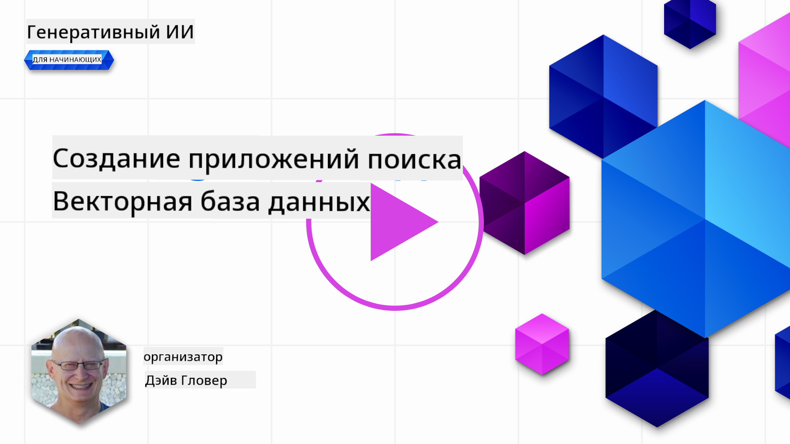
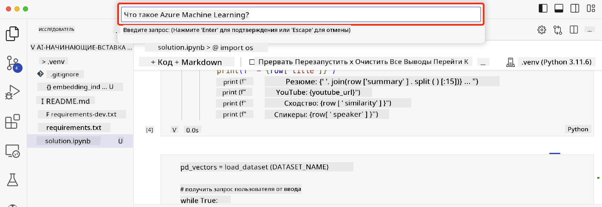

<!--
CO_OP_TRANSLATOR_METADATA:
{
  "original_hash": "d46aad0917a1a342d613e2c13d457da5",
  "translation_date": "2025-05-19T18:18:22+00:00",
  "source_file": "08-building-search-applications/README.md",
  "language_code": "ru"
}
-->
# Создание поисковых приложений

[](https://aka.ms/gen-ai-lesson8-gh?WT.mc_id=academic-105485-koreyst)

> > _Кликните по изображению выше, чтобы посмотреть видео этого урока_

LLM — это не только чат-боты и генерация текста. Также возможно создавать поисковые приложения, используя Embeddings. Embeddings — это числовые представления данных, также известные как векторы, и они могут использоваться для семантического поиска данных.

В этом уроке вы создадите поисковое приложение для нашего образовательного стартапа. Наш стартап — это некоммерческая организация, предоставляющая бесплатное образование студентам в развивающихся странах. У нас есть большое количество видео на YouTube, которые студенты могут использовать для изучения ИИ. Наш стартап хочет создать поисковое приложение, которое позволит студентам искать видео на YouTube, вводя вопрос.

Например, студент может ввести 'Что такое Jupyter Notebooks?' или 'Что такое Azure ML', и поисковое приложение вернет список видео на YouTube, которые соответствуют вопросу, и, что еще лучше, поисковое приложение вернет ссылку на место в видео, где находится ответ на вопрос.

## Введение

В этом уроке мы рассмотрим:

- Семантический vs. Ключевой поиск.
- Что такое Text Embeddings.
- Создание индекса Text Embeddings.
- Поиск в индексе Text Embeddings.

## Учебные цели

После завершения этого урока вы сможете:

- Отличать семантический поиск от ключевого.
- Объяснить, что такое Text Embeddings.
- Создать приложение, использующее Embeddings для поиска данных.

## Зачем создавать поисковое приложение?

Создание поискового приложения поможет вам понять, как использовать Embeddings для поиска данных. Вы также научитесь создавать поисковое приложение, которое могут использовать студенты для быстрого поиска информации.

Урок включает в себя индекс Embedding транскриптов YouTube канала Microsoft [AI Show](https://www.youtube.com/playlist?list=PLlrxD0HtieHi0mwteKBOfEeOYf0LJU4O1). AI Show — это канал на YouTube, который обучает ИИ и машинному обучению. Индекс Embedding содержит Embeddings для каждого из транскриптов YouTube вплоть до октября 2023 года. Вы будете использовать индекс Embedding, чтобы создать поисковое приложение для нашего стартапа. Поисковое приложение возвращает ссылку на место в видео, где находится ответ на вопрос. Это отличный способ для студентов быстро находить нужную информацию.

Ниже приведен пример семантического запроса для вопроса 'можно ли использовать rstudio с azure ml?'. Посмотрите на url YouTube, вы увидите, что url содержит временную метку, которая перенаправляет вас на место в видео, где находится ответ на вопрос.


## Что такое семантический поиск?

Теперь вы, возможно, задаетесь вопросом, что такое семантический поиск? Семантический поиск — это техника поиска, которая использует семантику, или смысл, слов в запросе для возврата релевантных результатов.

Вот пример семантического поиска. Допустим, вы хотите купить автомобиль, вы можете искать 'мой автомобиль мечты', семантический поиск понимает, что вы не `dreaming` об автомобиле, а скорее ищете свой `ideal` автомобиль. Семантический поиск понимает ваше намерение и возвращает релевантные результаты. Альтернатива — это `keyword search`, который буквально будет искать мечты об автомобилях и часто возвращает нерелевантные результаты.

## Что такое Text Embeddings?

[Text embeddings](https://en.wikipedia.org/wiki/Word_embedding?WT.mc_id=academic-105485-koreyst) — это техника представления текста, используемая в [обработке естественного языка](https://en.wikipedia.org/wiki/Natural_language_processing?WT.mc_id=academic-105485-koreyst). Text embeddings — это семантические числовые представления текста. Embeddings используются для представления данных в форме, которая понятна машине. Существует множество моделей для построения текстовых embeddings, в этом уроке мы сосредоточимся на генерации embeddings с использованием модели OpenAI Embedding.

Вот пример, представьте, что следующий текст находится в транскрипте одного из эпизодов на YouTube канале AI Show:

```text
Today we are going to learn about Azure Machine Learning.
```

Мы передадим текст в OpenAI Embedding API, и он вернет следующий embedding, состоящий из 1536 чисел, также известных как вектор. Каждое число в векторе представляет собой различный аспект текста. Для краткости, вот первые 10 чисел в векторе.

```python
[-0.006655829958617687, 0.0026128944009542465, 0.008792596869170666, -0.02446001023054123, -0.008540431968867779, 0.022071078419685364, -0.010703742504119873, 0.003311325330287218, -0.011632772162556648, -0.02187200076878071, ...]
```

## Как создается индекс Embedding?

Индекс Embedding для этого урока был создан с помощью серии скриптов на Python. Вы найдете скрипты вместе с инструкциями в [README](./scripts/README.md?WT.mc_id=academic-105485-koreyst) в папке 'scripts' для этого урока. Вам не нужно запускать эти скрипты для завершения этого урока, так как индекс Embedding предоставлен для вас.

Скрипты выполняют следующие операции:

1. Загружается транскрипт для каждого видео на YouTube в плейлисте [AI Show](https://www.youtube.com/playlist?list=PLlrxD0HtieHi0mwteKBOfEeOYf0LJU4O1).
2. С помощью [OpenAI Functions](https://learn.microsoft.com/azure/ai-services/openai/how-to/function-calling?WT.mc_id=academic-105485-koreyst) предпринимается попытка извлечь имя спикера из первых 3 минут транскрипта YouTube. Имя спикера для каждого видео сохраняется в индексе Embedding под названием `embedding_index_3m.json`.
3. Текст транскрипта затем разбивается на **3-минутные текстовые сегменты**. Сегмент включает около 20 слов, перекрывающихся с следующим сегментом, чтобы гарантировать, что Embedding для сегмента не обрывается и обеспечивается лучший контекст поиска.
4. Каждый текстовый сегмент затем передается в OpenAI Chat API для суммирования текста до 60 слов. Суммарный текст также сохраняется в индексе Embedding `embedding_index_3m.json`.
5. Наконец, текст сегмента передается в OpenAI Embedding API. API Embedding возвращает вектор из 1536 чисел, представляющих семантическое значение сегмента. Сегмент вместе с вектором OpenAI Embedding сохраняется в индексе Embedding `embedding_index_3m.json`.

### Векторные базы данных

Для упрощения урока индекс Embedding хранится в JSON-файле с именем `embedding_index_3m.json` и загружается в Pandas DataFrame. Однако в производственной среде индекс Embedding будет храниться в векторной базе данных, такой как [Azure Cognitive Search](https://learn.microsoft.com/training/modules/improve-search-results-vector-search?WT.mc_id=academic-105485-koreyst), [Redis](https://cookbook.openai.com/examples/vector_databases/redis/readme?WT.mc_id=academic-105485-koreyst), [Pinecone](https://cookbook.openai.com/examples/vector_databases/pinecone/readme?WT.mc_id=academic-105485-koreyst), [Weaviate](https://cookbook.openai.com/examples/vector_databases/weaviate/readme?WT.mc_id=academic-105485-koreyst) и других.

## Понимание косинусного сходства

Мы узнали о текстовых embeddings, следующий шаг — научиться использовать текстовые embeddings для поиска данных и, в частности, находить наиболее похожие embeddings к заданному запросу с использованием косинусного сходства.

### Что такое косинусное сходство?

Косинусное сходство — это мера сходства между двумя векторами, также называемая `nearest neighbor search`. Чтобы выполнить поиск с использованием косинусного сходства, вам нужно _векторизовать_ текст _запроса_ с помощью OpenAI Embedding API. Затем вычислить _косинусное сходство_ между вектором запроса и каждым вектором в индексе Embedding. Помните, что индекс Embedding имеет вектор для каждого текстового сегмента транскрипта YouTube. Наконец, отсортируйте результаты по косинусному сходству, и текстовые сегменты с наибольшим косинусным сходством являются наиболее похожими на запрос.

С математической точки зрения, косинусное сходство измеряет косинус угла между двумя векторами, проецированными в многомерное пространство. Это измерение полезно, потому что если два документа удалены друг от друга по евклидовой дистанции из-за размера, они все равно могут иметь меньший угол между собой и, следовательно, большее косинусное сходство. Для получения дополнительной информации о уравнениях косинусного сходства см. [Косинусное сходство](https://en.wikipedia.org/wiki/Cosine_similarity?WT.mc_id=academic-105485-koreyst).

## Создание вашего первого поискового приложения

Теперь мы научимся создавать поисковое приложение с использованием Embeddings. Поисковое приложение позволит студентам искать видео, вводя вопрос. Приложение вернет список видео, которые соответствуют вопросу. Приложение также вернет ссылку на место в видео, где находится ответ на вопрос.

Это решение было разработано и протестировано на Windows 11, macOS и Ubuntu 22.04 с использованием Python 3.10 или более поздней версии. Вы можете скачать Python с [python.org](https://www.python.org/downloads/?WT.mc_id=academic-105485-koreyst).

## Задание — создание поискового приложения для помощи студентам

Мы представили наш стартап в начале этого урока. Теперь пришло время помочь студентам создать поисковое приложение для их оценок.

В этом задании вы создадите Azure OpenAI Services, которые будут использоваться для создания поискового приложения. Вы создадите следующие Azure OpenAI Services. Вам потребуется подписка Azure для выполнения этого задания.

### Запуск Azure Cloud Shell

1. Войдите в [Azure портал](https://portal.azure.com/?WT.mc_id=academic-105485-koreyst).
2. Выберите значок Cloud Shell в верхнем правом углу портала Azure.
3. Выберите **Bash** для типа среды.

#### Создание группы ресурсов

> Для этих инструкций мы используем группу ресурсов с именем "semantic-video-search" в регионе Восток США.
> Вы можете изменить имя группы ресурсов, но при изменении местоположения для ресурсов,
> проверьте [таблицу доступности моделей](https://aka.ms/oai/models?WT.mc_id=academic-105485-koreyst).

```shell
az group create --name semantic-video-search --location eastus
```

#### Создание ресурса Azure OpenAI Service

Из Azure Cloud Shell выполните следующую команду для создания ресурса Azure OpenAI Service.

```shell
az cognitiveservices account create --name semantic-video-openai --resource-group semantic-video-search \
    --location eastus --kind OpenAI --sku s0
```

#### Получение конечной точки и ключей для использования в этом приложении

Из Azure Cloud Shell выполните следующие команды для получения конечной точки и ключей для ресурса Azure OpenAI Service.

```shell
az cognitiveservices account show --name semantic-video-openai \
   --resource-group  semantic-video-search | jq -r .properties.endpoint
az cognitiveservices account keys list --name semantic-video-openai \
   --resource-group semantic-video-search | jq -r .key1
```

#### Развертывание модели OpenAI Embedding

Из Azure Cloud Shell выполните следующую команду для развертывания модели OpenAI Embedding.

```shell
az cognitiveservices account deployment create \
    --name semantic-video-openai \
    --resource-group  semantic-video-search \
    --deployment-name text-embedding-ada-002 \
    --model-name text-embedding-ada-002 \
    --model-version "2"  \
    --model-format OpenAI \
    --sku-capacity 100 --sku-name "Standard"
```

## Решение

Откройте [решение в блокноте](../../../08-building-search-applications/python/aoai-solution.ipynb) в GitHub Codespaces и следуйте инструкциям в Jupyter Notebook.

Когда вы запустите блокнот, вам будет предложено ввести запрос. Поле ввода будет выглядеть следующим образом:



## Отличная работа! Продолжайте обучение

После завершения этого урока ознакомьтесь с нашей [коллекцией обучения генеративному ИИ](https://aka.ms/genai-collection?WT.mc_id=academic-105485-koreyst), чтобы продолжить повышать свои знания в области генеративного ИИ!

Перейдите к Уроку 9, где мы рассмотрим, как [создавать приложения для генерации изображений](../09-building-image-applications/README.md?WT.mc_id=academic-105485-koreyst)!

**Отказ от ответственности**:  
Этот документ был переведен с использованием сервиса автоматического перевода [Co-op Translator](https://github.com/Azure/co-op-translator). Мы стремимся к точности, однако, пожалуйста, учитывайте, что автоматические переводы могут содержать ошибки или неточности. Оригинальный документ на его родном языке должен рассматриваться как авторитетный источник. Для критически важной информации рекомендуется профессиональный перевод человеком. Мы не несем ответственности за любые недопонимания или неправильные интерпретации, возникающие в результате использования этого перевода.