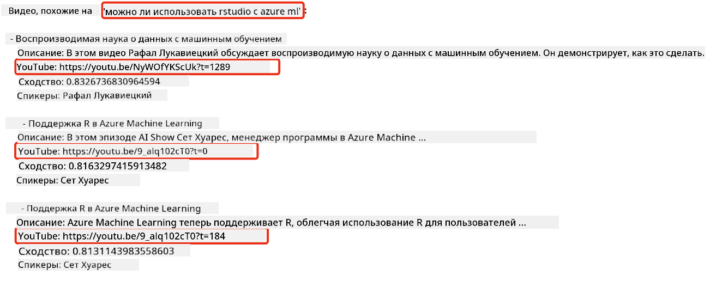

<!--
CO_OP_TRANSLATOR_METADATA:
{
  "original_hash": "58953c08b8ba7073b836d4270ea0fe86",
  "translation_date": "2025-10-17T15:02:28+00:00",
  "source_file": "08-building-search-applications/README.md",
  "language_code": "ru"
}
-->
# Создание поисковых приложений

[](https://youtu.be/W0-nzXjOjr0?si=GcsqiTTvd7RKbo7V)

> > _Нажмите на изображение выше, чтобы посмотреть видео этого урока_

Большие языковые модели (LLM) — это не только чат-боты и генерация текста. С их помощью также можно создавать поисковые приложения, используя эмбеддинги. Эмбеддинги — это числовые представления данных, также известные как векторы, которые можно использовать для семантического поиска.

В этом уроке вы создадите поисковое приложение для нашего образовательного стартапа. Наш стартап — это некоммерческая организация, предоставляющая бесплатное образование студентам в развивающихся странах. У нас есть большое количество видео на YouTube, которые студенты могут использовать для изучения ИИ. Стартап хочет создать поисковое приложение, которое позволит студентам находить видео на YouTube, вводя вопрос.

Например, студент может написать: «Что такое Jupyter Notebooks?» или «Что такое Azure ML?», и поисковое приложение выдаст список видео на YouTube, которые соответствуют вопросу. Более того, приложение предоставит ссылку на тот момент в видео, где находится ответ на вопрос.

## Введение

В этом уроке мы рассмотрим:

- Семантический поиск vs поиск по ключевым словам.
- Что такое текстовые эмбеддинги.
- Создание индекса текстовых эмбеддингов.
- Поиск в индексе текстовых эмбеддингов.

## Цели обучения

После завершения урока вы сможете:

- Отличать семантический поиск от поиска по ключевым словам.
- Объяснить, что такое текстовые эмбеддинги.
- Создать приложение, использующее эмбеддинги для поиска данных.

## Зачем создавать поисковое приложение?

Создание поискового приложения поможет вам понять, как использовать эмбеддинги для поиска данных. Вы также научитесь создавать приложение, которое студенты смогут использовать для быстрого поиска информации.

В уроке используется индекс эмбеддингов транскриптов YouTube-канала Microsoft [AI Show](https://www.youtube.com/playlist?list=PLlrxD0HtieHi0mwteKBOfEeOYf0LJU4O1). AI Show — это YouTube-канал, который обучает ИИ и машинному обучению. Индекс эмбеддингов содержит эмбеддинги для каждого транскрипта видео на YouTube до октября 2023 года. Вы будете использовать этот индекс для создания поискового приложения для нашего стартапа. Приложение возвращает ссылку на тот момент в видео, где находится ответ на вопрос. Это отличный способ для студентов быстро находить нужную информацию.

Пример семантического запроса для вопроса «Можно ли использовать rstudio с azure ml?». Обратите внимание на URL YouTube — он содержит временную метку, которая перенесет вас к тому моменту в видео, где находится ответ на вопрос.



## Что такое семантический поиск?

Вы, возможно, задаетесь вопросом, что такое семантический поиск? Семантический поиск — это техника поиска, которая использует семантику или значение слов в запросе для возврата релевантных результатов.

Вот пример семантического поиска. Допустим, вы хотите купить машину и ищете «машина моей мечты». Семантический поиск понимает, что вы не `мечтаете` о машине, а ищете `идеальную` машину для покупки. Семантический поиск понимает ваш намерение и возвращает релевантные результаты. Альтернатива — это `поиск по ключевым словам`, который буквально ищет мечты о машинах и часто возвращает нерелевантные результаты.

## Что такое текстовые эмбеддинги?

[Текстовые эмбеддинги](https://en.wikipedia.org/wiki/Word_embedding?WT.mc_id=academic-105485-koreyst) — это техника представления текста, используемая в [обработке естественного языка](https://en.wikipedia.org/wiki/Natural_language_processing?WT.mc_id=academic-105485-koreyst). Текстовые эмбеддинги — это семантические числовые представления текста. Эмбеддинги используются для представления данных в форме, понятной машине. Существует множество моделей для создания текстовых эмбеддингов, в этом уроке мы сосредоточимся на генерации эмбеддингов с использованием модели OpenAI Embedding.

Вот пример: представьте, что следующий текст — это транскрипт одного из эпизодов на YouTube-канале AI Show:

```text
Today we are going to learn about Azure Machine Learning.
```

Мы передаем текст в OpenAI Embedding API, и он возвращает следующий эмбеддинг, состоящий из 1536 чисел, также называемый вектором. Каждое число в векторе представляет собой различный аспект текста. Для краткости, вот первые 10 чисел в векторе.

```python
[-0.006655829958617687, 0.0026128944009542465, 0.008792596869170666, -0.02446001023054123, -0.008540431968867779, 0.022071078419685364, -0.010703742504119873, 0.003311325330287218, -0.011632772162556648, -0.02187200076878071, ...]
```

## Как создается индекс эмбеддингов?

Индекс эмбеддингов для этого урока был создан с помощью серии скриптов на Python. Вы найдете скрипты вместе с инструкциями в [README](./scripts/README.md?WT.mc_id=academic-105485-koreyst) в папке 'scripts' для этого урока. Вам не нужно запускать эти скрипты, чтобы завершить урок, так как индекс эмбеддингов уже предоставлен.

Скрипты выполняют следующие операции:

1. Транскрипт каждого видео на YouTube из плейлиста [AI Show](https://www.youtube.com/playlist?list=PLlrxD0HtieHi0mwteKBOfEeOYf0LJU4O1) загружается.
2. С помощью [OpenAI Functions](https://learn.microsoft.com/azure/ai-services/openai/how-to/function-calling?WT.mc_id=academic-105485-koreyst) предпринимается попытка извлечь имя спикера из первых 3 минут транскрипта. Имя спикера для каждого видео сохраняется в индексе эмбеддингов `embedding_index_3m.json`.
3. Текст транскрипта затем разбивается на **3-минутные текстовые сегменты**. Сегмент включает около 20 слов, перекрывающихся с следующим сегментом, чтобы гарантировать, что эмбеддинг сегмента не обрывается и чтобы обеспечить лучший контекст поиска.
4. Каждый текстовый сегмент затем передается в OpenAI Chat API для суммирования текста в 60 слов. Сводка также сохраняется в индексе эмбеддингов `embedding_index_3m.json`.
5. Наконец, текст сегмента передается в OpenAI Embedding API. Embedding API возвращает вектор из 1536 чисел, представляющий семантическое значение сегмента. Сегмент вместе с вектором OpenAI Embedding сохраняется в индексе эмбеддингов `embedding_index_3m.json`.

### Векторные базы данных

Для упрощения урока индекс эмбеддингов хранится в JSON-файле с именем `embedding_index_3m.json` и загружается в Pandas DataFrame. Однако в производственной среде индекс эмбеддингов будет храниться в векторной базе данных, такой как [Azure Cognitive Search](https://learn.microsoft.com/training/modules/improve-search-results-vector-search?WT.mc_id=academic-105485-koreyst), [Redis](https://cookbook.openai.com/examples/vector_databases/redis/readme?WT.mc_id=academic-105485-koreyst), [Pinecone](https://cookbook.openai.com/examples/vector_databases/pinecone/readme?WT.mc_id=academic-105485-koreyst), [Weaviate](https://cookbook.openai.com/examples/vector_databases/weaviate/readme?WT.mc_id=academic-105485-koreyst) и другие.

## Понимание косинусного сходства

Мы узнали о текстовых эмбеддингах, следующий шаг — узнать, как использовать текстовые эмбеддинги для поиска данных, а именно для нахождения наиболее похожих эмбеддингов к заданному запросу с использованием косинусного сходства.

### Что такое косинусное сходство?

Косинусное сходство — это мера сходства между двумя векторами, также известная как `поиск ближайших соседей`. Чтобы выполнить поиск с использованием косинусного сходства, необходимо _векторизовать_ текст _запроса_ с помощью OpenAI Embedding API. Затем вычислить _косинусное сходство_ между вектором запроса и каждым вектором в индексе эмбеддингов. Помните, что индекс эмбеддингов содержит вектор для каждого текстового сегмента транскрипта YouTube. Наконец, отсортируйте результаты по косинусному сходству, и текстовые сегменты с наибольшим косинусным сходством будут наиболее похожими на запрос.

С математической точки зрения, косинусное сходство измеряет косинус угла между двумя векторами, проецированными в многомерное пространство. Это измерение полезно, потому что если два документа находятся далеко друг от друга по евклидовому расстоянию из-за размера, они все равно могут иметь меньший угол между ними и, следовательно, большее косинусное сходство. Для получения дополнительной информации о формулах косинусного сходства, см. [Cosine similarity](https://en.wikipedia.org/wiki/Cosine_similarity?WT.mc_id=academic-105485-koreyst).

## Создание вашего первого поискового приложения

Далее мы научимся создавать поисковое приложение с использованием эмбеддингов. Приложение позволит студентам искать видео, вводя вопрос. Приложение вернет список видео, которые соответствуют вопросу. Оно также предоставит ссылку на тот момент в видео, где находится ответ на вопрос.

Это решение было создано и протестировано на Windows 11, macOS и Ubuntu 22.04 с использованием Python 3.10 или более поздней версии. Вы можете скачать Python с [python.org](https://www.python.org/downloads/?WT.mc_id=academic-105485-koreyst).

## Задание — создание поискового приложения для студентов

Мы представили наш стартап в начале этого урока. Теперь пришло время помочь студентам создать поисковое приложение для их задач.

В этом задании вы создадите службы Azure OpenAI, которые будут использоваться для создания поискового приложения. Вы создадите следующие службы Azure OpenAI. Вам понадобится подписка Azure для выполнения этого задания.

### Запуск Azure Cloud Shell

1. Войдите в [портал Azure](https://portal.azure.com/?WT.mc_id=academic-105485-koreyst).
2. Выберите значок Cloud Shell в правом верхнем углу портала Azure.
3. Выберите **Bash** в качестве типа среды.

#### Создание группы ресурсов

> В этих инструкциях мы используем группу ресурсов с именем "semantic-video-search" в регионе East US.
> Вы можете изменить имя группы ресурсов, но при изменении местоположения ресурсов
> проверьте [таблицу доступности моделей](https://aka.ms/oai/models?WT.mc_id=academic-105485-koreyst).

```shell
az group create --name semantic-video-search --location eastus
```

#### Создание ресурса Azure OpenAI Service

В Azure Cloud Shell выполните следующую команду для создания ресурса Azure OpenAI Service.

```shell
az cognitiveservices account create --name semantic-video-openai --resource-group semantic-video-search \
    --location eastus --kind OpenAI --sku s0
```

#### Получение конечной точки и ключей для использования в приложении

В Azure Cloud Shell выполните следующие команды для получения конечной точки и ключей для ресурса Azure OpenAI Service.

```shell
az cognitiveservices account show --name semantic-video-openai \
   --resource-group  semantic-video-search | jq -r .properties.endpoint
az cognitiveservices account keys list --name semantic-video-openai \
   --resource-group semantic-video-search | jq -r .key1
```

#### Развертывание модели OpenAI Embedding

В Azure Cloud Shell выполните следующую команду для развертывания модели OpenAI Embedding.

```shell
az cognitiveservices account deployment create \
    --name semantic-video-openai \
    --resource-group  semantic-video-search \
    --deployment-name text-embedding-ada-002 \
    --model-name text-embedding-ada-002 \
    --model-version "2"  \
    --model-format OpenAI \
    --sku-capacity 100 --sku-name "Standard"
```

## Решение

Откройте [решение в блокноте](./python/aoai-solution.ipynb?WT.mc_id=academic-105485-koreyst) в GitHub Codespaces и следуйте инструкциям в Jupyter Notebook.

Когда вы запустите блокнот, вам будет предложено ввести запрос. Поле ввода будет выглядеть следующим образом:


## Отличная работа! Продолжайте обучение

После завершения этого урока ознакомьтесь с нашей [коллекцией обучения генеративному ИИ](https://aka.ms/genai-collection?WT.mc_id=academic-105485-koreyst), чтобы продолжить углублять свои знания о генеративном ИИ!

Перейдите к уроку 9, где мы рассмотрим, как [создавать приложения для генерации изображений](../09-building-image-applications/README.md?WT.mc_id=academic-105485-koreyst)!

---

**Отказ от ответственности**:  
Этот документ был переведен с использованием сервиса автоматического перевода [Co-op Translator](https://github.com/Azure/co-op-translator). Несмотря на наши усилия обеспечить точность, автоматические переводы могут содержать ошибки или неточности. Оригинальный документ на его родном языке следует считать авторитетным источником. Для получения критически важной информации рекомендуется профессиональный перевод человеком. Мы не несем ответственности за любые недоразумения или неправильные интерпретации, возникшие в результате использования данного перевода.