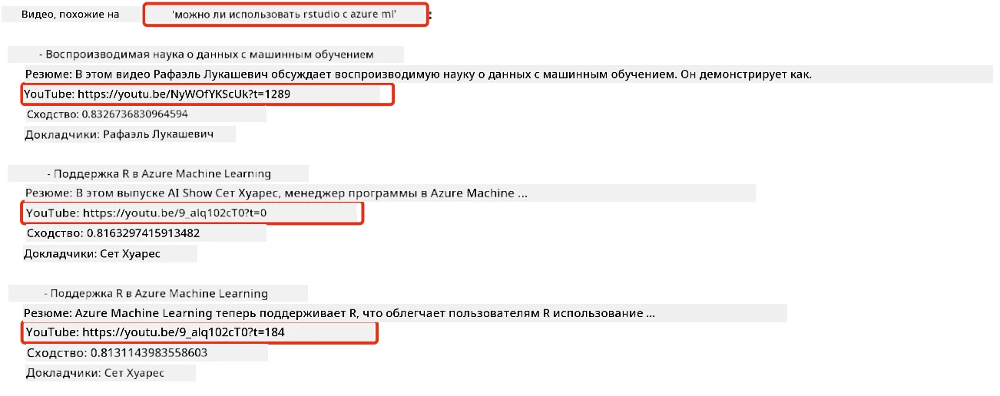
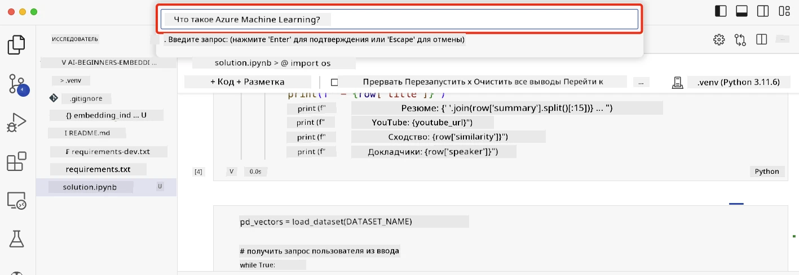

# Создание поисковых приложений

[](https://youtu.be/W0-nzXjOjr0?si=GcsqiTTvd7RKbo7V)

> > _Нажмите на изображение выше, чтобы посмотреть видео этого урока_

Большие языковые модели — это не только чат-боты и генерация текста. Также можно создавать поисковые приложения с использованием встраиваний (Embeddings). Встраивания — это числовые представления данных, также известные как векторы, и их можно использовать для семантического поиска данных.

В этом уроке вы создадите поисковое приложение для нашего образовательного стартапа. Наш стартап — это некоммерческая организация, предоставляющая бесплатное образование студентам из развивающихся стран. У нашего стартапа есть большое количество видео на YouTube, которые студенты могут использовать для изучения ИИ. Наш стартап хочет создать поисковое приложение, которое позволит студентам искать видео на YouTube, вводя вопрос.

Например, студент может ввести «Что такое Jupyter Notebooks?» или «Что такое Azure ML», и поисковое приложение вернет список видео на YouTube, которые релевантны вопросу, а ещё лучше — приложение вернет ссылку на место в видео, где находится ответ на вопрос.

## Введение

В этом уроке мы рассмотрим:

- Семантический поиск vs поиск по ключевым словам.
- Что такое текстовые встраивания.
- Создание индекса текстовых встраиваний.
- Поиск по индексу текстовых встраиваний.

## Цели обучения

После выполнения этого урока вы сможете:

- Определять различия между семантическим поиском и поиском по ключевым словам.
- Объяснять, что такое текстовые встраивания.
- Создавать приложения с использованием встраиваний для поиска данных.

## Зачем создавать поисковое приложение?

Создание поискового приложения поможет вам понять, как использовать встраивания для поиска данных. Вы также научитесь создавать поисковое приложение, которое смогут использовать студенты для быстрого поиска информации.

В урок включен индекс встраиваний транскриптов видео с YouTube канала Microsoft [AI Show](https://www.youtube.com/playlist?list=PLlrxD0HtieHi0mwteKBOfEeOYf0LJU4O1). AI Show — это канал на YouTube, который обучает вас искусственному интеллекту и машинному обучению. Индекс встраиваний содержит встраивания для каждого транскрипта видео до октября 2023 года. Вы будете использовать этот индекс для создания поискового приложения для нашего стартапа. Поисковое приложение возвращает ссылку на место в видео, где находится ответ на вопрос. Это отличный способ для студентов быстро найти нужную информацию.

Ниже приведён пример семантического запроса на вопрос «Можно ли использовать rstudio с azure ml?». Посмотрите URL YouTube — в нём есть отметка времени, которая приводит к месту в видео, где находится ответ на вопрос.



## Что такое семантический поиск?

Возможно, вы задаётесь вопросом, что такое семантический поиск? Семантический поиск — это техника поиска, использующая семантику, то есть значение слов в запросе, чтобы возвращать релевантные результаты.

Вот пример семантического поиска. Допустим, вы хотите купить машину, вы введёте запрос «моя мечта автомобиль», семантический поиск поймёт, что вы не `мечтаете` о машине, а ищете свою `идеальную` машину. Семантический поиск понимает ваше намерение и возвращает релевантные результаты. Альтернатива — это `поиск по ключевым словам`, который буквально ищет упоминания мечтаний о машинах и часто возвращает нерелевантные результаты.

## Что такое текстовые встраивания?

[Текстовые встраивания](https://en.wikipedia.org/wiki/Word_embedding?WT.mc_id=academic-105485-koreyst) — это метод представления текста, используемый в [обработке естественного языка](https://en.wikipedia.org/wiki/Natural_language_processing?WT.mc_id=academic-105485-koreyst). Текстовые встраивания — это семантические числовые представления текста. Встраивания используются для представления данных в форме, удобной для понимания машиной. Существует множество моделей для создания текстовых встраиваний, в этом уроке мы сосредоточимся на генерации встраиваний с помощью модели OpenAI Embedding.

Вот пример: представьте, что следующий текст взят из транскрипта одного из эпизодов канала AI Show на YouTube:

```text
Today we are going to learn about Azure Machine Learning.
```

Мы передадим текст в API OpenAI Embedding, и он вернёт следующее встраивание, состоящее из 1536 чисел, то есть вектор. Каждое число во векторе представляет собой разные аспекты текста. Для краткости здесь представлены первые 10 чисел в векторе.

```python
[-0.006655829958617687, 0.0026128944009542465, 0.008792596869170666, -0.02446001023054123, -0.008540431968867779, 0.022071078419685364, -0.010703742504119873, 0.003311325330287218, -0.011632772162556648, -0.02187200076878071, ...]
```

## Как создается индекс встраиваний?

Индекс встраиваний для этого урока был создан с помощью серии скриптов на Python. Вы найдёте скрипты вместе с инструкциями в [README](./scripts/README.md?WT.mc_id=academic-105485-koreyst) в папке `scripts` к этому уроку. Вам не нужно запускать эти скрипты для выполнения урока, так как индекс встраиваний уже предоставлен.

Скрипты выполняют следующие операции:

1. Загружается транскрипт каждого видео из плейлиста [AI Show](https://www.youtube.com/playlist?list=PLlrxD0HtieHi0mwteKBOfEeOYf0LJU4O1).
2. С помощью [OpenAI Functions](https://learn.microsoft.com/azure/ai-foundry/openai/how-to/function-calling?WT.mc_id=academic-105485-koreyst) пытаются извлечь имя говорящего из первых 3 минут транскрипта видео на YouTube. Имя говорящего для каждого видео сохраняется в индексе встраиваний под названием `embedding_index_3m.json`.
3. Текст транскрипта разбивается на **текстовые сегменты по 3 минуты**. Сегмент включает около 20 слов с перекрытием с следующим сегментом, чтобы обеспечить, что встраивание для сегмента не будет обрезано и чтобы предоставить лучший контекст для поиска.
4. Каждый текстовый сегмент передается в API OpenAI Chat для сокращения текста до 60 слов. Краткое содержание также сохраняется в индексе встраиваний `embedding_index_3m.json`.
5. Наконец, текст сегмента передается в OpenAI Embedding API. API возвращает вектор из 1536 чисел, представляющий семантическое значение сегмента. Сегмент вместе с вектором OpenAI Embedding сохраняется в индексе встраиваний `embedding_index_3m.json`.

### Векторные базы данных

Для упрощения урока индекс встраиваний хранится в JSON-файле с именем `embedding_index_3m.json` и загружается в DataFrame библиотеки Pandas. Однако в производственной среде индекс встраиваний хранится во векторной базе данных, такой как [Azure Cognitive Search](https://learn.microsoft.com/training/modules/improve-search-results-vector-search?WT.mc_id=academic-105485-koreyst), [Redis](https://cookbook.openai.com/examples/vector_databases/redis/readme?WT.mc_id=academic-105485-koreyst), [Pinecone](https://cookbook.openai.com/examples/vector_databases/pinecone/readme?WT.mc_id=academic-105485-koreyst), [Weaviate](https://cookbook.openai.com/examples/vector_databases/weaviate/readme?WT.mc_id=academic-105485-koreyst) и других.

## Понимание косинусной близости

Мы познакомились с текстовыми встраиваниями, следующий шаг — научиться использовать текстовые встраивания для поиска данных, а именно находить наиболее похожие встраивания для данного запроса с помощью косинусной близости.

### Что такое косинусная близость?

Косинусная близость — это мера сходства между двумя векторами, это также называют поиском ближайших соседей. Для выполнения поиска по косинусной близости нужно _векторизовать_ текст _запроса_ с помощью OpenAI Embedding API. Затем вычислить _косинусное сходство_ между вектором запроса и каждым вектором в индексе встраиваний. Помните, что в индексе встраиваний есть вектор для каждого текстового сегмента транскрипта YouTube видео. Наконец, отсортировать результаты по косинусной близости — текстовые сегменты с наибольшим значением косинусной близости наиболее похожи на запрос.

С математической точки зрения, косинусная близость измеряет косинус угла между двумя векторами, проецируемыми в многомерном пространстве. Это измерение полезно, потому что если два документа расположены далеко друг от друга по евклидовому расстоянию из-за размера, они всё равно могут иметь меньший угол между векторами и, следовательно, более высокое значение косинусной близости. Для дополнительной информации о формулах косинусной близости смотрите [Cosine similarity](https://en.wikipedia.org/wiki/Cosine_similarity?WT.mc_id=academic-105485-koreyst).

## Создание вашего первого поискового приложения

Далее мы узнаем, как создать поисковое приложение с использованием встраиваний. Приложение позволит студентам искать видео, вводя вопрос. Поисковое приложение вернет список видео, релевантных вопросу, а также ссылку на место в видео, где находится ответ.

Это решение было создано и протестировано на Windows 11, macOS и Ubuntu 22.04 с использованием Python 3.10 и выше. Вы можете скачать Python с сайта [python.org](https://www.python.org/downloads/?WT.mc_id=academic-105485-koreyst).

## Задание — создание поискового приложения для студентов

Мы представили наш стартап в начале урока. Теперь пора дать студентам возможность создать поисковое приложение для их заданий.

В этом задании вы создадите сервисы Azure OpenAI, которые будут использованы для построения поискового приложения. Вам нужно создать следующие сервисы Azure OpenAI. Для выполнения задания вам потребуется подписка Azure.

### Запуск Azure Cloud Shell

1. Войдите в [портал Azure](https://portal.azure.com/?WT.mc_id=academic-105485-koreyst).
2. Выберите иконку Cloud Shell в верхнем правом углу портала Azure.
3. Выберите **Bash** в качестве типа среды.

#### Создание группы ресурсов

> Для этих инструкций используется группа ресурсов с именем "semantic-video-search" в регионе East US.
> Вы можете изменить имя группы ресурсов, но при смене местоположения ресурсов
> проверьте [таблицу доступности моделей](https://aka.ms/oai/models?WT.mc_id=academic-105485-koreyst).

```shell
az group create --name semantic-video-search --location eastus
```

#### Создание ресурса Azure OpenAI Service

В Azure Cloud Shell выполните следующую команду, чтобы создать ресурс Azure OpenAI Service.

```shell
az cognitiveservices account create --name semantic-video-openai --resource-group semantic-video-search \
    --location eastus --kind OpenAI --sku s0
```

#### Получение конечной точки и ключей для использования в приложении

В Azure Cloud Shell выполните следующие команды, чтобы получить конечную точку и ключи ресурса Azure OpenAI Service.

```shell
az cognitiveservices account show --name semantic-video-openai \
   --resource-group  semantic-video-search | jq -r .properties.endpoint
az cognitiveservices account keys list --name semantic-video-openai \
   --resource-group semantic-video-search | jq -r .key1
```

#### Развертывание модели OpenAI Embedding

В Azure Cloud Shell выполните следующую команду для развертывания модели OpenAI Embedding.

```shell
az cognitiveservices account deployment create \
    --name semantic-video-openai \
    --resource-group  semantic-video-search \
    --deployment-name text-embedding-ada-002 \
    --model-name text-embedding-ada-002 \
    --model-version "2"  \
    --model-format OpenAI \
    --sku-capacity 100 --sku-name "Standard"
```

## Решение

Откройте [блокнот решения](./python/aoai-solution.ipynb?WT.mc_id=academic-105485-koreyst) в GitHub Codespaces и следуйте инструкциям в Jupyter Notebook.

При запуске блокнота вам будет предложено ввести запрос. Окно ввода будет выглядеть так:



## Отличная работа! Продолжайте обучение

После завершения этого урока ознакомьтесь с нашей [коллекцией по генеративному ИИ](https://aka.ms/genai-collection?WT.mc_id=academic-105485-koreyst), чтобы продолжить повышать знания в области генеративного ИИ!

Перейдите к уроку 9, где мы рассмотрим, как [создавать приложения для генерации изображений](../09-building-image-applications/README.md?WT.mc_id=academic-105485-koreyst)!

---

<!-- CO-OP TRANSLATOR DISCLAIMER START -->
**Отказ от ответственности**:
Этот документ был переведен с использованием сервиса машинного перевода [Co-op Translator](https://github.com/Azure/co-op-translator). Несмотря на наши усилия по обеспечению точности, имейте в виду, что автоматический перевод может содержать ошибки или неточности. Оригинальный документ на его исходном языке следует считать авторитетным источником. Для получения критически важной информации рекомендуется обратиться к профессиональному человеческому переводу. Мы не несем ответственности за любые недоразумения или неправильные толкования, возникшие в результате использования этого перевода.
<!-- CO-OP TRANSLATOR DISCLAIMER END -->