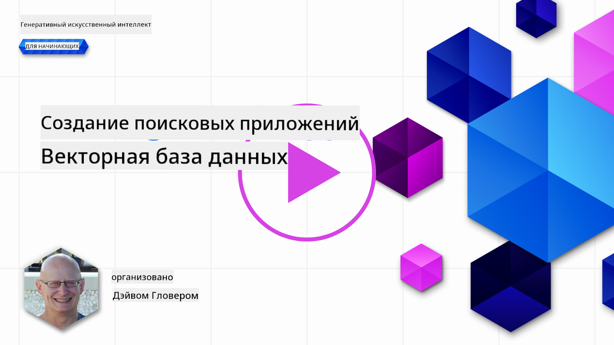
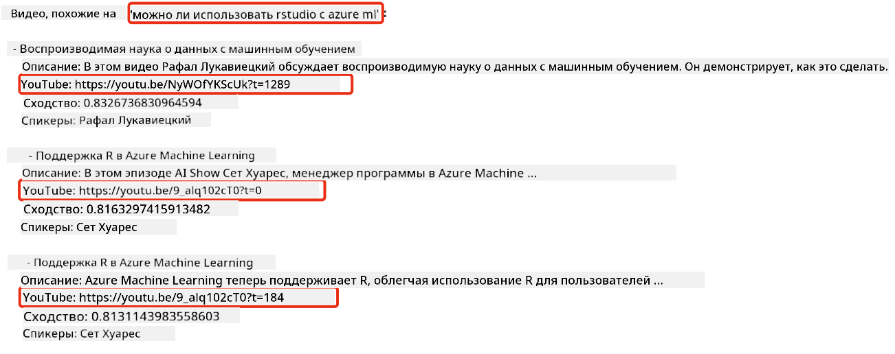
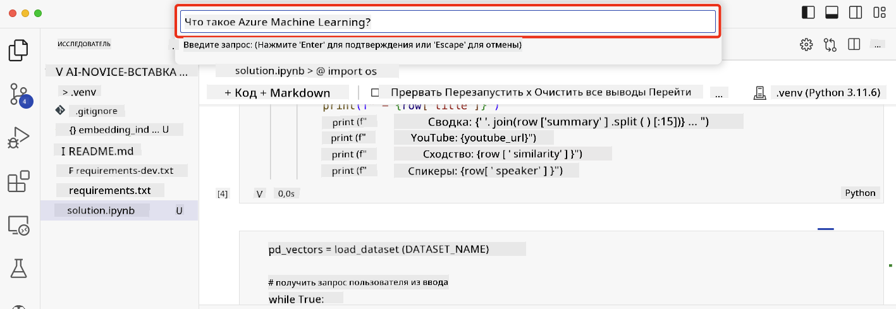

<!--
CO_OP_TRANSLATOR_METADATA:
{
  "original_hash": "d46aad0917a1a342d613e2c13d457da5",
  "translation_date": "2025-06-25T16:11:47+00:00",
  "source_file": "08-building-search-applications/README.md",
  "language_code": "ru"
}
-->
# Создание поисковых приложений

[](https://aka.ms/gen-ai-lesson8-gh?WT.mc_id=academic-105485-koreyst)

> > _Нажмите на изображение выше, чтобы посмотреть видео этого урока_

Большие языковые модели (LLM) — это не только чат-боты и генерация текста. С их помощью можно создавать поисковые приложения, используя векторы. Векторы — это числовые представления данных, которые можно использовать для семантического поиска.

В этом уроке вы создадите поисковое приложение для нашего образовательного стартапа. Наш стартап — это некоммерческая организация, предоставляющая бесплатное образование студентам в развивающихся странах. У нас есть множество видео на YouTube, которые студенты могут использовать для изучения ИИ. Наш стартап хочет создать поисковое приложение, которое позволит студентам находить видео на YouTube, вводя вопрос.

Например, студент может ввести 'Что такое Jupyter Notebooks?' или 'Что такое Azure ML', и поисковое приложение вернет список видео на YouTube, которые соответствуют вопросу. Более того, приложение предоставит ссылку на место в видео, где находится ответ на вопрос.

## Введение

В этом уроке мы рассмотрим:

- Семантический vs ключевой поиск.
- Что такое текстовые векторы.
- Создание индекса текстовых векторов.
- Поиск в индексе текстовых векторов.

## Цели обучения

После завершения этого урока вы сможете:

- Отличать семантический поиск от ключевого.
- Объяснить, что такое текстовые векторы.
- Создать приложение, использующее векторы для поиска данных.

## Зачем создавать поисковое приложение?

Создание поискового приложения поможет вам понять, как использовать векторы для поиска данных. Вы также научитесь создавать поисковое приложение, которое студенты смогут использовать для быстрого поиска информации.

В урок включен индекс векторов расшифровок видео с YouTube-канала Microsoft [AI Show](https://www.youtube.com/playlist?list=PLlrxD0HtieHi0mwteKBOfEeOYf0LJU4O1). AI Show — это YouTube-канал, который обучает ИИ и машинному обучению. Индекс векторов содержит векторы для каждой из расшифровок видео на YouTube до октября 2023 года. Вы будете использовать этот индекс, чтобы создать поисковое приложение для нашего стартапа. Приложение вернет ссылку на место в видео, где находится ответ на вопрос. Это отличный способ для студентов быстро найти нужную информацию.

Ниже приведен пример семантического запроса на вопрос 'можно ли использовать rstudio с azure ml?'. Посмотрите URL на YouTube, вы увидите, что он содержит временную метку, которая перенесет вас на место в видео, где находится ответ на вопрос.



## Что такое семантический поиск?

Теперь вы, возможно, задаетесь вопросом, что такое семантический поиск? Семантический поиск — это метод поиска, который использует семантику или значение слов в запросе для возврата релевантных результатов.

Вот пример семантического поиска. Допустим, вы хотите купить машину, и вы вводите 'моя машина мечты', семантический поиск понимает, что вы не `dreaming` о машине, а хотите купить свою `ideal` машину. Семантический поиск понимает ваш замысел и возвращает релевантные результаты. Альтернатива — `keyword search`, который буквально будет искать мечты о машинах и часто возвращает нерелевантные результаты.

## Что такое текстовые векторы?

[Текстовые векторы](https://en.wikipedia.org/wiki/Word_embedding?WT.mc_id=academic-105485-koreyst) — это техника представления текста, используемая в [обработке естественного языка](https://en.wikipedia.org/wiki/Natural_language_processing?WT.mc_id=academic-105485-koreyst). Текстовые векторы — это семантические числовые представления текста. Векторы используются для представления данных так, чтобы машине было легко их понять. Существует множество моделей для создания текстовых векторов, в этом уроке мы сосредоточимся на генерации векторов с помощью модели OpenAI Embedding.

Вот пример: представьте, что следующий текст — это расшифровка одного из эпизодов на YouTube-канале AI Show:

```text
Today we are going to learn about Azure Machine Learning.
```

Мы передадим текст в OpenAI Embedding API, и он вернет следующий вектор, состоящий из 1536 чисел, также известных как вектор. Каждое число в векторе представляет собой различный аспект текста. Для краткости, вот первые 10 чисел в векторе.

```python
[-0.006655829958617687, 0.0026128944009542465, 0.008792596869170666, -0.02446001023054123, -0.008540431968867779, 0.022071078419685364, -0.010703742504119873, 0.003311325330287218, -0.011632772162556648, -0.02187200076878071, ...]
```

## Как создается индекс векторов?

Индекс векторов для этого урока был создан с помощью серии скриптов на Python. Вы найдете скрипты вместе с инструкциями в [README](./scripts/README.md?WT.mc_id=academic-105485-koreyst) в папке 'scripts' для этого урока. Вам не нужно запускать эти скрипты для завершения урока, так как индекс векторов предоставлен вам.

Скрипты выполняют следующие операции:

1. Загружается расшифровка для каждого видео на YouTube в плейлисте [AI Show](https://www.youtube.com/playlist?list=PLlrxD0HtieHi0mwteKBOfEeOYf0LJU4O1).
2. С помощью [OpenAI Functions](https://learn.microsoft.com/azure/ai-services/openai/how-to/function-calling?WT.mc_id=academic-105485-koreyst) предпринимается попытка извлечь имя спикера из первых 3 минут расшифровки видео на YouTube. Имя спикера для каждого видео сохраняется в индексе векторов под названием `embedding_index_3m.json`.
3. Текст расшифровки затем делится на **3-минутные текстовые сегменты**. Сегмент включает около 20 слов, перекрывающихся с следующим сегментом, чтобы гарантировать, что вектор для сегмента не обрезан и чтобы обеспечить лучший контекст для поиска.
4. Каждый текстовый сегмент затем передается в OpenAI Chat API для суммирования текста в 60 слов. Суммарный текст также сохраняется в индексе векторов `embedding_index_3m.json`.
5. Наконец, текст сегмента передается в OpenAI Embedding API. API возвращает вектор из 1536 чисел, представляющий семантическое значение сегмента. Сегмент вместе с вектором OpenAI сохраняется в индексе векторов `embedding_index_3m.json`.

### Векторные базы данных

Для простоты урока индекс векторов хранится в файле JSON под названием `embedding_index_3m.json` и загружается в Pandas DataFrame. Однако в производственной среде индекс векторов будет храниться в векторной базе данных, такой как [Azure Cognitive Search](https://learn.microsoft.com/training/modules/improve-search-results-vector-search?WT.mc_id=academic-105485-koreyst), [Redis](https://cookbook.openai.com/examples/vector_databases/redis/readme?WT.mc_id=academic-105485-koreyst), [Pinecone](https://cookbook.openai.com/examples/vector_databases/pinecone/readme?WT.mc_id=academic-105485-koreyst), [Weaviate](https://cookbook.openai.com/examples/vector_databases/weaviate/readme?WT.mc_id=academic-105485-koreyst) и других.

## Понимание косинусного сходства

Мы узнали о текстовых векторах, следующий шаг — научиться использовать их для поиска данных, в частности, находить наиболее похожие векторы для заданного запроса, используя косинусное сходство.

### Что такое косинусное сходство?

Косинусное сходство — это мера сходства между двумя векторами, также известная как `nearest neighbor search`. Чтобы выполнить поиск по косинусному сходству, необходимо _векторизовать_ текст _запроса_ с помощью OpenAI Embedding API. Затем рассчитать _косинусное сходство_ между вектором запроса и каждым вектором в индексе векторов. Помните, что в индексе векторов есть вектор для каждого текстового сегмента расшифровки видео на YouTube. Наконец, отсортируйте результаты по косинусному сходству, и текстовые сегменты с наибольшим косинусным сходством будут наиболее похожи на запрос.

С математической точки зрения, косинусное сходство измеряет косинус угла между двумя векторами, проецируемыми в многомерное пространство. Это измерение полезно, потому что, если два документа находятся далеко друг от друга по евклидовой дистанции из-за размера, они все равно могут иметь меньший угол между ними и, следовательно, большее косинусное сходство. Для получения дополнительной информации о формулах косинусного сходства см. [Косинусное сходство](https://en.wikipedia.org/wiki/Cosine_similarity?WT.mc_id=academic-105485-koreyst).

## Создание вашего первого поискового приложения

Далее мы научимся создавать поисковое приложение с использованием векторов. Приложение позволит студентам находить видео, вводя вопрос. Приложение вернет список видео, которые соответствуют вопросу. Оно также предоставит ссылку на место в видео, где находится ответ на вопрос.

Это решение было создано и протестировано на Windows 11, macOS и Ubuntu 22.04 с использованием Python 3.10 или более поздней версии. Вы можете скачать Python с [python.org](https://www.python.org/downloads/?WT.mc_id=academic-105485-koreyst).

## Задание - создание поискового приложения для студентов

Мы представили наш стартап в начале этого урока. Теперь пришло время дать студентам возможность создать поисковое приложение для их оценок.

В этом задании вы создадите Azure OpenAI Services, которые будут использоваться для создания поискового приложения. Вам потребуется подписка Azure для выполнения этого задания.

### Запуск Azure Cloud Shell

1. Войдите в [портал Azure](https://portal.azure.com/?WT.mc_id=academic-105485-koreyst).
2. Выберите значок Cloud Shell в правом верхнем углу портала Azure.
3. Выберите **Bash** в качестве типа среды.

#### Создание группы ресурсов

> В этих инструкциях мы используем группу ресурсов с именем "semantic-video-search" в Восточном США.
> Вы можете изменить имя группы ресурсов, но при изменении местоположения ресурсов
> проверьте [таблицу доступности моделей](https://aka.ms/oai/models?WT.mc_id=academic-105485-koreyst).

```shell
az group create --name semantic-video-search --location eastus
```

#### Создание ресурса Azure OpenAI Service

Из Azure Cloud Shell выполните следующую команду для создания ресурса Azure OpenAI Service.

```shell
az cognitiveservices account create --name semantic-video-openai --resource-group semantic-video-search \
    --location eastus --kind OpenAI --sku s0
```

#### Получение конечной точки и ключей для использования в этом приложении

Из Azure Cloud Shell выполните следующие команды, чтобы получить конечную точку и ключи для ресурса Azure OpenAI Service.

```shell
az cognitiveservices account show --name semantic-video-openai \
   --resource-group  semantic-video-search | jq -r .properties.endpoint
az cognitiveservices account keys list --name semantic-video-openai \
   --resource-group semantic-video-search | jq -r .key1
```

#### Развертывание модели OpenAI Embedding

Из Azure Cloud Shell выполните следующую команду для развертывания модели OpenAI Embedding.

```shell
az cognitiveservices account deployment create \
    --name semantic-video-openai \
    --resource-group  semantic-video-search \
    --deployment-name text-embedding-ada-002 \
    --model-name text-embedding-ada-002 \
    --model-version "2"  \
    --model-format OpenAI \
    --sku-capacity 100 --sku-name "Standard"
```

## Решение

Откройте [ноутбук с решением](../../../08-building-search-applications/python/aoai-solution.ipynb) в GitHub Codespaces и следуйте инструкциям в Jupyter Notebook.

Когда вы запустите ноутбук, вам будет предложено ввести запрос. Поле ввода будет выглядеть следующим образом:



## Отличная работа! Продолжайте учиться

После завершения этого урока ознакомьтесь с нашей [коллекцией обучения генеративному ИИ](https://aka.ms/genai-collection?WT.mc_id=academic-105485-koreyst), чтобы продолжить повышать свои знания в области генеративного ИИ!

Переходите к уроку 9, где мы рассмотрим, как [создавать приложения для генерации изображений](../09-building-image-applications/README.md?WT.mc_id=academic-105485-koreyst)!

**Отказ от ответственности**:  
Этот документ был переведен с помощью службы автоматического перевода [Co-op Translator](https://github.com/Azure/co-op-translator). Мы стремимся к точности, однако, пожалуйста, имейте в виду, что автоматические переводы могут содержать ошибки или неточности. Оригинальный документ на его родном языке должен считаться авторитетным источником. Для получения критически важной информации рекомендуется профессиональный перевод человеком. Мы не несем ответственности за любые недоразумения или неверные толкования, возникающие в результате использования этого перевода.