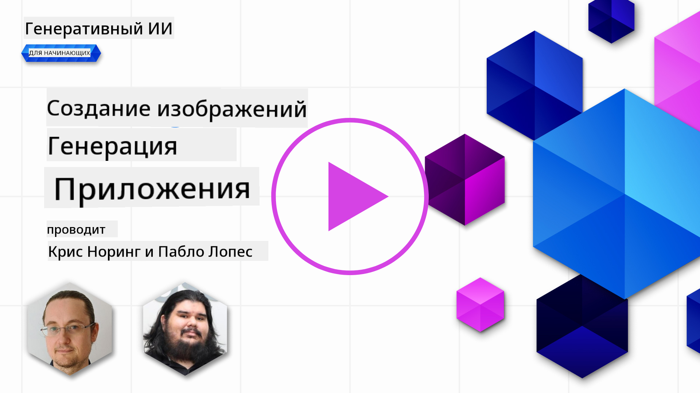

<!--
CO_OP_TRANSLATOR_METADATA:
{
  "original_hash": "7a655f30d1dcbdfe6eff2558eff249af",
  "translation_date": "2025-05-19T18:57:25+00:00",
  "source_file": "09-building-image-applications/README.md",
  "language_code": "ru"
}
-->
# Создание приложений для генерации изображений

[](https://aka.ms/gen-ai-lesson9-gh?WT.mc_id=academic-105485-koreyst)

LLM могут делать больше, чем просто генерировать текст. Также возможно создавать изображения из текстовых описаний. Наличие изображений как модальности может быть очень полезным в ряде областей, таких как MedTech, архитектура, туризм, разработка игр и многое другое. В этой главе мы рассмотрим две самые популярные модели генерации изображений: DALL-E и Midjourney.

## Введение

В этом уроке мы рассмотрим:

- Генерация изображений и почему это полезно.
- DALL-E и Midjourney, что это такое и как они работают.
- Как вы можете создать приложение для генерации изображений.

## Цели обучения

После завершения этого урока вы сможете:

- Создать приложение для генерации изображений.
- Определить границы для вашего приложения с помощью метаподсказок.
- Работать с DALL-E и Midjourney.

## Почему стоит создать приложение для генерации изображений?

Приложения для генерации изображений — это отличный способ исследовать возможности генеративного ИИ. Они могут использоваться, например, для:

- **Редактирования и синтеза изображений**. Вы можете создавать изображения для различных случаев использования, таких как редактирование и синтез изображений.

- **Применение в различных отраслях**. Они также могут использоваться для создания изображений для различных отраслей, таких как Medtech, туризм, разработка игр и многое другое.

## Сценарий: Edu4All

В рамках этого урока мы продолжим работать с нашим стартапом Edu4All. Студенты будут создавать изображения для своих оценок, какие именно изображения — зависит от студентов, но это могут быть иллюстрации для их собственной сказки или создание нового персонажа для их истории или помощь в визуализации их идей и концепций.

Вот что студенты Edu4All могли бы создать, например, если они работают в классе над памятниками:


используя такую подсказку

> "Собака рядом с Эйфелевой башней на утреннем солнце"

## Что такое DALL-E и Midjourney?

[DALL-E](https://openai.com/dall-e-2?WT.mc_id=academic-105485-koreyst) и [Midjourney](https://www.midjourney.com/?WT.mc_id=academic-105485-koreyst) — это две из самых популярных моделей генерации изображений, они позволяют использовать подсказки для создания изображений.

### DALL-E

Начнем с DALL-E, который является моделью генеративного ИИ, генерирующей изображения из текстовых описаний.

> [DALL-E — это комбинация двух моделей, CLIP и диффузного внимания](https://towardsdatascience.com/openais-dall-e-and-clip-101-a-brief-introduction-3a4367280d4e?WT.mc_id=academic-105485-koreyst).

- **CLIP**, это модель, которая создает векторы, числовые представления данных, из изображений и текста.

- **Диффузное внимание**, это модель, которая создает изображения из векторов. DALL-E обучен на наборе данных изображений и текста и может использоваться для создания изображений из текстовых описаний. Например, DALL-E можно использовать для создания изображений кота в шляпе или собаки с ирокезом.

### Midjourney

Midjourney работает аналогично DALL-E, он создает изображения из текстовых подсказок. Midjourney также можно использовать для создания изображений с помощью подсказок, таких как «кот в шляпе» или «собака с ирокезом».


_Фото: Wikipedia, изображение создано Midjourney_

## Как работают DALL-E и Midjourney

Сначала [DALL-E](https://arxiv.org/pdf/2102.12092.pdf?WT.mc_id=academic-105485-koreyst). DALL-E — это модель генеративного ИИ, основанная на архитектуре трансформера с _авторегрессионным трансформером_.

_Авторегрессионный трансформер_ определяет, как модель создает изображения из текстовых описаний, генерируя один пиксель за раз, а затем использует созданные пиксели для создания следующего пикселя. Проходя через несколько слоев в нейронной сети, пока изображение не будет завершено.

С помощью этого процесса DALL-E контролирует атрибуты, объекты, характеристики и многое другое в создаваемом изображении. Однако DALL-E 2 и 3 имеют больший контроль над созданным изображением.

## Создание вашего первого приложения для генерации изображений

Итак, что нужно для создания приложения для генерации изображений? Вам понадобятся следующие библиотеки:

- **python-dotenv**, рекомендуется использовать эту библиотеку для хранения ваших секретов в файле _.env_ вдали от кода.
- **openai**, эта библиотека используется для взаимодействия с API OpenAI.
- **pillow**, для работы с изображениями в Python.
- **requests**, для помощи в выполнении HTTP-запросов.

1. Создайте файл _.env_ со следующим содержанием:

   ```text
   AZURE_OPENAI_ENDPOINT=<your endpoint>
   AZURE_OPENAI_API_KEY=<your key>
   ```

   Найдите эту информацию в Azure Portal для вашего ресурса в разделе "Ключи и конечная точка".

1. Соберите вышеуказанные библиотеки в файле _requirements.txt_ следующим образом:

   ```text
   python-dotenv
   openai
   pillow
   requests
   ```

1. Далее создайте виртуальное окружение и установите библиотеки:

   ```bash
   python3 -m venv venv
   source venv/bin/activate
   pip install -r requirements.txt
   ```

   Для Windows используйте следующие команды для создания и активации вашего виртуального окружения:

   ```bash
   python3 -m venv venv
   venv\Scripts\activate.bat
   ```

1. Добавьте следующий код в файл, называемый _app.py_:

   ```python
   import openai
   import os
   import requests
   from PIL import Image
   import dotenv

   # import dotenv
   dotenv.load_dotenv()

   # Get endpoint and key from environment variables
   openai.api_base = os.environ['AZURE_OPENAI_ENDPOINT']
   openai.api_key = os.environ['AZURE_OPENAI_API_KEY']

   # Assign the API version (DALL-E is currently supported for the 2023-06-01-preview API version only)
   openai.api_version = '2023-06-01-preview'
   openai.api_type = 'azure'


   try:
       # Create an image by using the image generation API
       generation_response = openai.Image.create(
           prompt='Bunny on horse, holding a lollipop, on a foggy meadow where it grows daffodils',    # Enter your prompt text here
           size='1024x1024',
           n=2,
           temperature=0,
       )
       # Set the directory for the stored image
       image_dir = os.path.join(os.curdir, 'images')

       # If the directory doesn't exist, create it
       if not os.path.isdir(image_dir):
           os.mkdir(image_dir)

       # Initialize the image path (note the filetype should be png)
       image_path = os.path.join(image_dir, 'generated-image.png')

       # Retrieve the generated image
       image_url = generation_response["data"][0]["url"]  # extract image URL from response
       generated_image = requests.get(image_url).content  # download the image
       with open(image_path, "wb") as image_file:
           image_file.write(generated_image)

       # Display the image in the default image viewer
       image = Image.open(image_path)
       image.show()

   # catch exceptions
   except openai.InvalidRequestError as err:
       print(err)

   ```

Давайте объясним этот код:

- Сначала мы импортируем необходимые библиотеки, включая библиотеку OpenAI, библиотеку dotenv, библиотеку requests и библиотеку Pillow.

  ```python
  import openai
  import os
  import requests
  from PIL import Image
  import dotenv
  ```

- Далее мы загружаем переменные окружения из файла _.env_.

  ```python
  # import dotenv
  dotenv.load_dotenv()
  ```

- После этого мы устанавливаем конечную точку, ключ для API OpenAI, версию и тип.

  ```python
  # Get endpoint and key from environment variables
  openai.api_base = os.environ['AZURE_OPENAI_ENDPOINT']
  openai.api_key = os.environ['AZURE_OPENAI_API_KEY']

  # add version and type, Azure specific
  openai.api_version = '2023-06-01-preview'
  openai.api_type = 'azure'
  ```

- Затем мы генерируем изображение:

  ```python
  # Create an image by using the image generation API
  generation_response = openai.Image.create(
      prompt='Bunny on horse, holding a lollipop, on a foggy meadow where it grows daffodils',    # Enter your prompt text here
      size='1024x1024',
      n=2,
      temperature=0,
  )
  ```

  Приведенный выше код отвечает JSON-объектом, содержащим URL созданного изображения. Мы можем использовать URL для загрузки изображения и сохранения его в файл.

- Наконец, мы открываем изображение и используем стандартный просмотрщик изображений для его отображения:

  ```python
  image = Image.open(image_path)
  image.show()
  ```

### Более подробная информация о создании изображения

Давайте рассмотрим код, который генерирует изображение более подробно:

```python
generation_response = openai.Image.create(
        prompt='Bunny on horse, holding a lollipop, on a foggy meadow where it grows daffodils',    # Enter your prompt text here
        size='1024x1024',
        n=2,
        temperature=0,
    )
```

- **prompt**, это текстовая подсказка, используемая для создания изображения. В данном случае мы используем подсказку "Кролик на лошади, держащий леденец, на туманном лугу, где растут нарциссы".
- **size**, это размер создаваемого изображения. В данном случае мы создаем изображение размером 1024x1024 пикселей.
- **n**, это количество создаваемых изображений. В данном случае мы создаем два изображения.
- **temperature**, это параметр, контролирующий случайность вывода генеративной модели ИИ. Температура — это значение между 0 и 1, где 0 означает, что вывод детерминирован, а 1 означает, что вывод случайный. Значение по умолчанию — 0.7.

Есть еще вещи, которые вы можете сделать с изображениями, которые мы рассмотрим в следующем разделе.

## Дополнительные возможности генерации изображений

Вы уже видели, как мы смогли создать изображение, используя несколько строк в Python. Однако есть еще вещи, которые вы можете сделать с изображениями.

Вы также можете сделать следующее:

- **Выполнить редактирование**. Предоставив существующее изображение, маску и подсказку, вы можете изменить изображение. Например, вы можете добавить что-то в часть изображения. Представьте наше изображение с кроликом, вы можете добавить шляпу на кролика. Как это сделать: предоставив изображение, маску (определяющую часть области для изменения) и текстовую подсказку, чтобы указать, что должно быть сделано.

  ```python
  response = openai.Image.create_edit(
    image=open("base_image.png", "rb"),
    mask=open("mask.png", "rb"),
    prompt="An image of a rabbit with a hat on its head.",
    n=1,
    size="1024x1024"
  )
  image_url = response['data'][0]['url']
  ```

  Базовое изображение будет содержать только кролика, но окончательное изображение будет иметь шляпу на кролике.

- **Создать вариации**. Идея заключается в том, что вы берете существующее изображение и просите создать вариации. Чтобы создать вариацию, вы предоставляете изображение и текстовую подсказку и код, как показано ниже:

  ```python
  response = openai.Image.create_variation(
    image=open("bunny-lollipop.png", "rb"),
    n=1,
    size="1024x1024"
  )
  image_url = response['data'][0]['url']
  ```

  > Примечание: это поддерживается только в OpenAI

## Температура

Температура — это параметр, контролирующий случайность вывода генеративной модели ИИ. Температура — это значение между 0 и 1, где 0 означает, что вывод детерминирован, а 1 означает, что вывод случайный. Значение по умолчанию — 0.7.

Давайте рассмотрим пример того, как работает температура, запустив эту подсказку дважды:

> Подсказка: "Кролик на лошади, держащий леденец, на туманном лугу, где растут нарциссы"


Теперь давайте запустим ту же подсказку, чтобы убедиться, что мы не получим одно и то же изображение дважды:


Как видите, изображения похожи, но не одинаковы. Давайте попробуем изменить значение температуры на 0.1 и посмотрим, что произойдет:

```python
 generation_response = openai.Image.create(
        prompt='Bunny on horse, holding a lollipop, on a foggy meadow where it grows daffodils',    # Enter your prompt text here
        size='1024x1024',
        n=2
    )
```

### Изменение температуры

Итак, давайте попробуем сделать ответ более детерминированным. Мы могли наблюдать из двух созданных изображений, что на первом изображении есть кролик, а на втором изображении есть лошадь, поэтому изображения сильно различаются.

Давайте, следовательно, изменим наш код и установим температуру на 0, как показано ниже:

```python
generation_response = openai.Image.create(
        prompt='Bunny on horse, holding a lollipop, on a foggy meadow where it grows daffodils',    # Enter your prompt text here
        size='1024x1024',
        n=2,
        temperature=0
    )
```

Теперь, когда вы запускаете этот код, вы получаете эти два изображения:

- 
- 

Здесь вы можете ясно видеть, как изображения больше похожи друг на друга.

## Как определить границы для вашего приложения с метаподсказками

С нашим демо мы уже можем создавать изображения для наших клиентов. Однако нам нужно создать некоторые границы для нашего приложения.

Например, мы не хотим создавать изображения, которые не безопасны для работы или не подходят для детей.

Мы можем сделать это с помощью _метаподсказок_. Метаподсказки — это текстовые подсказки, используемые для контроля вывода генеративной модели ИИ. Например, мы можем использовать метаподсказки для контроля вывода и обеспечения того, чтобы создаваемые изображения были безопасны для работы или подходили для детей.

### Как это работает?

Теперь, как работают метаподсказки?

Метаподсказки — это текстовые подсказки, используемые для контроля вывода генеративной модели ИИ, они размещаются перед текстовой подсказкой и используются для контроля вывода модели и встраиваются в приложения для контроля вывода модели. Инкапсулируя ввод подсказки и ввод метаподсказки в одной текстовой подсказке.

Один пример метаподсказки будет следующим:

```text
You are an assistant designer that creates images for children.

The image needs to be safe for work and appropriate for children.

The image needs to be in color.

The image needs to be in landscape orientation.

The image needs to be in a 16:9 aspect ratio.

Do not consider any input from the following that is not safe for work or appropriate for children.

(Input)

```

Теперь давайте посмотрим, как мы можем использовать метаподсказки в нашем демо.

```python
disallow_list = "swords, violence, blood, gore, nudity, sexual content, adult content, adult themes, adult language, adult humor, adult jokes, adult situations, adult"

meta_prompt =f"""You are an assistant designer that creates images for children.

The image needs to be safe for work and appropriate for children.

The image needs to be in color.

The image needs to be in landscape orientation.

The image needs to be in a 16:9 aspect ratio.

Do not consider any input from the following that is not safe for work or appropriate for children.
{disallow_list}
"""

prompt = f"{meta_prompt}
Create an image of a bunny on a horse, holding a lollipop"

# TODO add request to generate image
```

Из приведенной выше подсказки вы можете видеть, как все создаваемые изображения учитывают метаподсказку.

## Задание - давайте дадим возможность студентам

Мы представили Edu4All в начале этого урока. Теперь пришло время дать студентам возможность создавать изображения для своих оценок.

Студенты будут создавать изображения для своих оценок, содержащие памятники, какие именно памятники — зависит от студентов. Студентам предлагается использовать свою креативность в этой задаче, чтобы разместить эти памятники в разных контекстах.

## Решение

Вот одно из возможных решений:

```python
import openai
import os
import requests
from PIL import Image
import dotenv

# import dotenv
dotenv.load_dotenv()

# Get endpoint and key from environment variables
openai.api_base = "<replace with endpoint>"
openai.api_key = "<replace with api key>"

# Assign the API version (DALL-E is currently supported for the 2023-06-01-preview API version only)
openai.api_version = '2023-06-01-preview'
openai.api_type = 'azure'

disallow_list = "swords, violence, blood, gore, nudity, sexual content, adult content, adult themes, adult language, adult humor, adult jokes, adult situations, adult"

meta_prompt = f"""You are an assistant designer that creates images for children.

The image needs to be safe for work and appropriate for children.

The image needs to be in color.

The image needs to be in landscape orientation.

The image needs to be in a 16:9 aspect ratio.

Do not consider any input from the following that is not safe for work or appropriate for children.
{disallow_list}"""

prompt = f"""{metaprompt}
Generate monument of the Arc of Triumph in Paris, France, in the evening light with a small child holding a Teddy looks on.
""""

try:
    # Create an image by using the image generation API
    generation_response = openai.Image.create(
        prompt=prompt,    # Enter your prompt text here
        size='1024x1024',
        n=2,
        temperature=0,
    )
    # Set the directory for the stored image
    image_dir = os.path.join(os.curdir, 'images')

    # If the directory doesn't exist, create it
    if not os.path.isdir(image_dir):
        os.mkdir(image_dir)

    # Initialize the image path (note the filetype should be png)
    image_path = os.path.join(image_dir, 'generated-image.png')

    # Retrieve the generated image
    image_url = generation_response["data"][0]["url"]  # extract image URL from response
    generated_image = requests.get(image_url).content  # download the image
    with open(image_path, "wb") as image_file:
        image_file.write(generated_image)

    # Display the image in the default image viewer
    image = Image.open(image_path)
    image.show()

# catch exceptions
except openai.InvalidRequestError as err:
    print(err)
```

## Отличная работа! Продолжайте обучение

После завершения этого урока ознакомьтесь с нашей [коллекцией обучения генеративному ИИ](https://aka.ms/genai-collection?WT.mc_id=academic-105485-koreyst), чтобы продолжить повышать свои знания в области генеративного ИИ!

Перейдите к уроку 10, где мы рассмотрим, как [создавать приложения ИИ с низким кодом](../10-building-low-code-ai-applications/README.md?WT.mc_id=academic-105485-koreyst).

**Отказ от ответственности**:  
Этот документ был переведен с помощью службы автоматического перевода [Co-op Translator](https://github.com/Azure/co-op-translator). Хотя мы стремимся к точности, пожалуйста, учитывайте, что автоматические переводы могут содержать ошибки или неточности. Оригинальный документ на его родном языке следует считать авторитетным источником. Для получения критической информации рекомендуется профессиональный перевод человеком. Мы не несем ответственности за любые недоразумения или неправильные интерпретации, возникающие в результате использования этого перевода.