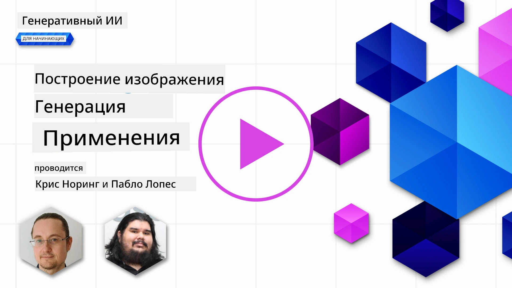

# Создание приложений для генерации изображений

[](https://youtu.be/B5VP0_J7cs8?si=5P3L5o7F_uS_QcG9)

В генеративных языковых моделях есть нечто большее, чем просто генерация текста. Также возможно создавать изображения на основе текстовых описаний. Использование изображений в качестве модальности может быть очень полезным в различных сферах — от медицинских технологий, архитектуры, туризма, разработки игр и многое другое. В этой главе мы рассмотрим две самые популярные модели генерации изображений: DALL-E и Midjourney.

## Введение

В этом уроке мы рассмотрим:

- Генерацию изображений и её полезность.
- Что такое DALL-E и Midjourney и как они работают.
- Как создать приложение для генерации изображений.

## Цели обучения

После завершения этого урока вы сможете:

- Создавать приложение для генерации изображений.
- Определять границы для вашего приложения с помощью мета-промтов.
- Работать с DALL-E и Midjourney.

## Зачем создавать приложение для генерации изображений?

Приложения для генерации изображений — отличный способ исследовать возможности генеративного ИИ. Они могут использоваться, например, для:

- **Редактирования и синтеза изображений.** Вы можете создавать изображения для различных сценариев, таких как редактирование и синтез изображений.

- **Применения в различных отраслях.** Их также можно использовать для создания изображений для различных отраслей, таких как медицинские технологии, туризм, разработка игр и другие.

## Сценарий: Edu4All

В рамках этого урока мы продолжим работать с нашим стартапом Edu4All. Студенты будут создавать изображения для своих заданий; какие именно изображения — решают сами студенты. Это могут быть иллюстрации к их сказкам, создание нового персонажа для истории или помощь в визуализации их идей и концепций.

Вот что студенты Edu4All могут создать, например, если они работают в классе над памятниками:


используя такой промпт

> "Собака рядом с Эйфелевой башней на рассветном солнце"

## Что такое DALL-E и Midjourney?

[DALL-E](https://openai.com/dall-e-2?WT.mc_id=academic-105485-koreyst) и [Midjourney](https://www.midjourney.com/?WT.mc_id=academic-105485-koreyst) — две из самых популярных моделей генерации изображений, они позволяют использовать промпты для создания изображений.

### DALL-E

Начнем с DALL-E — это модель генеративного ИИ, которая создает изображения на основе текстовых описаний.

> [DALL-E — это комбинация двух моделей, CLIP и diffused attention](https://towardsdatascience.com/openais-dall-e-and-clip-101-a-brief-introduction-3a4367280d4e?WT.mc_id=academic-105485-koreyst).

- **CLIP** — модель, которая преобразует изображения и текст в эмбеддинги, то есть числовые представления данных.

- **Diffused attention** — модель, которая генерирует изображения из эмбеддингов. DALL-E обучен на наборе данных, состоящем из изображений и текста, и может использоваться для создания изображений на основе текстовых описаний. Например, DALL-E может создавать изображения кота в шляпе или собаки с ирокезом.

### Midjourney

Midjourney работает аналогично DALL-E — он генерирует изображения на основе текстовых промптов. Midjourney также можно использовать для создания изображений по промптам вроде «кот в шляпе» или «собака с ирокезом».


_Источник изображения — Wikipedia, сгенерировано Midjourney_

## Как работают DALL-E и Midjourney

Начнем с [DALL-E](https://arxiv.org/pdf/2102.12092.pdf?WT.mc_id=academic-105485-koreyst). DALL-E — это модель генеративного ИИ на основе архитектуры трансформера с _авторегрессивным трансформером_.

_Авторегрессивный трансформер_ определяет, как модель генерирует изображения из текстовых описаний: она создает по одному пикселю за раз, используя сгенерированные пиксели для генерации следующего пикселя. Процесс проходит через несколько слоев нейронной сети до завершения изображения.

Благодаря этому процессу DALL-E контролирует атрибуты, объекты, характеристики и многое другое на изображении, которое он генерирует. Однако у DALL-E 2 и 3 больше контроля над сгенерированным изображением.

## Создание вашего первого приложения для генерации изображений

Что же нужно для создания приложения генерации изображений? Вам понадобятся следующие библиотеки:

- **python-dotenv** — настоятельно рекомендуется использовать эту библиотеку, чтобы хранить ваши секреты в файле _.env_, отдельно от кода.
- **openai** — эта библиотека используется для взаимодействия с API OpenAI.
- **pillow** — для работы с изображениями в Python.
- **requests** — чтобы помогать выполнять HTTP-запросы.

## Создание и развертывание модели Azure OpenAI

Если этого еще не сделано, следуйте инструкциям на странице [Microsoft Learn](https://learn.microsoft.com/azure/ai-foundry/openai/how-to/create-resource?pivots=web-portal&WT.mc_id=academic-105485-koreyst),
чтобы создать ресурс и модель Azure OpenAI. Выберите **gpt-image-1** как модель (текущая модель генерации изображений Azure OpenAI; DALL-E 3 является устаревшей и больше не доступна для новых развертываний).

## Создаем приложение

1. Создайте файл _.env_ со следующим содержимым:

   ```text
   AZURE_OPENAI_ENDPOINT=<your endpoint>
   AZURE_OPENAI_API_KEY=<your key>
   AZURE_OPENAI_DEPLOYMENT="gpt-image-1"
   ```

   Найдите эту информацию в портале Azure OpenAI Foundry для вашего ресурса в разделе «Deployments».

1. Соберите перечисленные выше библиотеки в файл _requirements.txt_, например так:

   ```text
   python-dotenv
   openai
   pillow
   requests
   ```

1. Далее создайте виртуальное окружение и установите библиотеки:

   ```bash
   python3 -m venv venv
   source venv/bin/activate
   pip install -r requirements.txt
   ```

   Для Windows используйте следующие команды для создания и активации виртуального окружения:

   ```bash
   python3 -m venv venv
   venv\Scripts\activate.bat
   ```

1. Добавьте следующий код в файл _app.py_:

    ```python
    import openai
    import os
    import requests
    from PIL import Image
    import dotenv
    from openai import OpenAI, AzureOpenAI
    
    # импортировать dotenv
    dotenv.load_dotenv()
    
    # настроить клиент сервиса Azure OpenAI
    client = AzureOpenAI(
      azure_endpoint = os.environ["AZURE_OPENAI_ENDPOINT"],
      api_key=os.environ['AZURE_OPENAI_API_KEY'],
      api_version = "2024-10-21"
      )
    try:
        # Создать изображение с помощью API генерации изображений
        generation_response = client.images.generate(
                                prompt='Bunny on horse, holding a lollipop, on a foggy meadow where it grows daffodils',
                                size='1024x1024', n=1,
                                model=os.environ['AZURE_OPENAI_DEPLOYMENT']
                              )

        # Установить каталог для сохраненного изображения
        image_dir = os.path.join(os.curdir, 'images')

        # Если каталога не существует, создать его
        if not os.path.isdir(image_dir):
            os.mkdir(image_dir)

        # Инициализировать путь к изображению (обратите внимание, что тип файла должен быть png)
        image_path = os.path.join(image_dir, 'generated-image.png')

        # Получить сгенерированное изображение
        image_url = generation_response.data[0].url  # извлечь URL изображения из ответа
        generated_image = requests.get(image_url).content  # скачать изображение
        with open(image_path, "wb") as image_file:
            image_file.write(generated_image)

        # Отобразить изображение в стандартном просмотрщике изображений
        image = Image.open(image_path)
        image.show()

    # обработать исключения
    except openai.BadRequestError as err:
        print(err)
   ```

Объясним этот код:

- Сначала импортируем необходимые библиотеки: OpenAI, dotenv, requests и Pillow.

  ```python
  import openai
  import os
  import requests
  from PIL import Image
  import dotenv
  ```

- Затем загружаем переменные окружения из файла _.env_.

  ```python
  # импортировать dotenv
  dotenv.load_dotenv()
  ```

- После этого настраиваем клиент сервиса Azure OpenAI.

  ```python
  # Получить конечную точку и ключ из переменных окружения
  client = AzureOpenAI(
      azure_endpoint = os.environ["AZURE_OPENAI_ENDPOINT"],
      api_key=os.environ['AZURE_OPENAI_API_KEY'],
      api_version = "2024-10-21"
      )
  ```

- Далее генерируем изображение:

  ```python
  # Создайте изображение с помощью API генерации изображений
  generation_response = client.images.generate(
                        prompt='Bunny on horse, holding a lollipop, on a foggy meadow where it grows daffodils',
                        size='1024x1024', n=1,
                        model=os.environ['AZURE_OPENAI_DEPLOYMENT']
                      )
  ```

  Этот код возвращает объект JSON с URL сгенерированного изображения. Мы можем использовать этот URL для загрузки изображения и сохранения его в файл.

- Наконец, открываем изображение и используем стандартное средство просмотра изображений для его отображения:

  ```python
  image = Image.open(image_path)
  image.show()
  ```

### Подробнее о генерации изображения

Рассмотрим код генерации изображения подробнее:

   ```python
     generation_response = client.images.generate(
                               prompt='Bunny on horse, holding a lollipop, on a foggy meadow where it grows daffodils',
                               size='1024x1024', n=1,
                               model=os.environ['AZURE_OPENAI_DEPLOYMENT']
                           )
   ```

- **prompt** — текстовый промпт, используемый для генерации изображения. В данном случае мы используем промпт "Заяц на лошади, держащий леденец, на туманном лугу, где растут нарциссы".
- **size** — размер генерируемого изображения. Здесь мы генерируем изображение размером 1024x1024 пикселей.
- **n** — количество генерируемых изображений. В данном случае генерируются два изображения.
- **temperature** — параметр, контролирующий случайность вывода генеративной модели. Значение температуры от 0 до 1, где 0 означает детерминированный вывод, а 1 — случайный. Значение по умолчанию — 0.7.

Далее в следующем разделе мы рассмотрим дополнительные возможности работы с изображениями.

## Дополнительные возможности генерации изображений

Вы уже видели, как можно сгенерировать изображение с помощью нескольких строк кода на Python. Однако с изображениями можно делать гораздо больше.

Вы также можете:

- **Вносить правки.** Предоставив исходное изображение, маску и промпт, вы можете изменить изображение. Например, можно добавить что-то в часть изображения. Представьте наше изображение с зайцем — можно добавить ему шляпу. Для этого вы предоставляете изображение, маску (область для изменения) и текстовый промпт с указанием, что нужно сделать.
> Примечание: это не поддерживается в DALL-E 3.
 
Вот пример с использованием GPT Image:

   ```python
   response = client.images.edit(
       model="gpt-image-1",
       image=open("sunlit_lounge.png", "rb"),
       mask=open("mask.png", "rb"),
       prompt="A sunlit indoor lounge area with a pool containing a flamingo"
   )
   image_url = response.data[0].url
   ```

  Базовое изображение будет содержать только лаундж с бассейном, а итоговое изображение будет с фламинго:

<div style="display: flex; justify-content: space-between; align-items: center; margin: 20px 0;">
  
  
  
</div>


- **Создавать вариации.** Идея в том, что вы берете существующее изображение и просите создать его вариации. Для создания вариации вы предоставляете изображение и текстовый промпт, а код выглядит так:

  ```python
  response = client.images.create_variation(
    image=open("bunny-lollipop.png", "rb"),
    n=1,
    size="1024x1024"
  )
  image_url = response.data[0].url
  ```

  > Примечание: это поддерживается только в модели OpenAI DALL-E 2, но не в gpt-image-1.

## Температура

Температура — параметр, контролирующий случайность вывода генеративной модели. Значение температуры находится в диапазоне от 0 до 1, где 0 означает детерминированный результат, а 1 — случайный. Значение по умолчанию — 0.7.

Рассмотрим пример работы параметра температуры, выполнив этот промпт дважды:

> Промпт: "Заяц на лошади, держащий леденец, на туманном лугу, где растут нарциссы"


Теперь выполним тот же самый промпт еще раз, чтобы увидеть, что изображения не будут совпадать:


Как видно, изображения похожи, но не одинаковы. Попробуем изменить температуру на 0.1 и посмотрим, что получится:

```python
 generation_response = client.images.generate(
        prompt='Bunny on horse, holding a lollipop, on a foggy meadow where it grows daffodils',    # Введите здесь текст вашего запроса
        size='1024x1024',
        n=2
    )
```

### Изменение температуры

Попробуем сделать вывод более детерминированным. Можно заметить по двум сгенерированным изображениям, что на первом изображении — заяц, а на втором — лошадь, то есть различия значительны.

Поэтому изменим наш код, установив температуру в 0, вот так:

```python
generation_response = client.images.generate(
        prompt='Bunny on horse, holding a lollipop, on a foggy meadow where it grows daffodils',    # Введите текст вашего запроса здесь
        size='1024x1024',
        n=2,
        temperature=0
    )
```

Теперь, при запуске этого кода, вы получите такие два изображения:

- 
- 

Здесь отлично видно, что изображения стали гораздо похожи друг на друга.

## Как определить границы для вашего приложения с помощью мета-промтов

В нашем демо мы уже можем генерировать изображения для клиентов. Однако нам нужно установить некоторые границы для нашего приложения.

Например, мы не хотим создавать изображения, которые не подходят для работы (NSFW), или которые неуместны для детей.

Мы можем сделать это с помощью _мета-промтов_. Мета-промты — это текстовые промты, которые используются для контроля вывода генеративной модели. Например, мы можем использовать мета-промты, чтобы контролировать результат и гарантировать, что генерируемые изображения безопасны для работы или подходят для детей.

### Как это работает?

Как же работают мета-промты?

Мета-промты — это текстовые промты, которые располагаются перед основным текстовым промтом и служат для контроля вывода модели, они встроены в приложения для управления результатом. По сути, они объединяют ввод основного промта и мета-промта в один текстовый промт.

Один из примеров мета-промта может выглядеть так:

```text
You are an assistant designer that creates images for children.

The image needs to be safe for work and appropriate for children.

The image needs to be in color.

The image needs to be in landscape orientation.

The image needs to be in a 16:9 aspect ratio.

Do not consider any input from the following that is not safe for work or appropriate for children.

(Input)

```

Теперь посмотрим, как мы можем использовать мета-промты в нашем демо.

```python
disallow_list = "swords, violence, blood, gore, nudity, sexual content, adult content, adult themes, adult language, adult humor, adult jokes, adult situations, adult"

meta_prompt =f"""You are an assistant designer that creates images for children.

The image needs to be safe for work and appropriate for children.

The image needs to be in color.

The image needs to be in landscape orientation.

The image needs to be in a 16:9 aspect ratio.

Do not consider any input from the following that is not safe for work or appropriate for children.
{disallow_list}
"""

prompt = f"{meta_prompt}
Create an image of a bunny on a horse, holding a lollipop"

# TODO добавить запрос для генерации изображения
```

Из приведенного выше промта видно, что все создаваемые изображения учитывают мета-промт.

## Задание — давайте дадим возможность студентам

Мы представили Edu4All в начале этого урока. Теперь пора дать студентам возможность создавать изображения для своих заданий.


Студенты создадут изображения для своих оценочных заданий, содержащие памятники, какие именно памятники — решают студенты. Их просят использовать творческий подход, чтобы разместить эти памятники в разных контекстах.

## Решение

Вот одно из возможных решений:

```python
import openai
import os
import requests
from PIL import Image
import dotenv
from openai import AzureOpenAI
# импортировать dotenv
dotenv.load_dotenv()

# Получить конечную точку и ключ из переменных окружения
client = AzureOpenAI(
  azure_endpoint = os.environ["AZURE_OPENAI_ENDPOINT"],
  api_key=os.environ['AZURE_OPENAI_API_KEY'],
  api_version = "2024-10-21"
  )


disallow_list = "swords, violence, blood, gore, nudity, sexual content, adult content, adult themes, adult language, adult humor, adult jokes, adult situations, adult"

meta_prompt = f"""You are an assistant designer that creates images for children.

The image needs to be safe for work and appropriate for children.

The image needs to be in color.

The image needs to be in landscape orientation.

The image needs to be in a 16:9 aspect ratio.

Do not consider any input from the following that is not safe for work or appropriate for children.
{disallow_list}
"""

prompt = f"""{meta_prompt}
Generate monument of the Arc of Triumph in Paris, France, in the evening light with a small child holding a Teddy looks on.
"""

try:
    # Создать изображение с помощью API генерации изображений
    generation_response = client.images.generate(
        prompt=prompt,    # Введите здесь текст вашего запроса
        size='1024x1024',
        n=1,
    )
    # Установите каталог для сохраненного изображения
    image_dir = os.path.join(os.curdir, 'images')

    # Если каталог не существует, создайте его
    if not os.path.isdir(image_dir):
        os.mkdir(image_dir)

    # Инициализировать путь к изображению (обратите внимание, что тип файла должен быть png)
    image_path = os.path.join(image_dir, 'generated-image.png')

    # Получить сгенерированное изображение
    image_url = generation_response.data[0].url  # извлечь URL изображения из ответа
    generated_image = requests.get(image_url).content  # скачать изображение
    with open(image_path, "wb") as image_file:
        image_file.write(generated_image)

    # Отобразить изображение в стандартном просмотрщике изображений
    image = Image.open(image_path)
    image.show()

# обработать исключения
except openai.BadRequestError as err:
    print(err)
```

## Отличная работа! Продолжайте обучение

После завершения этого урока ознакомьтесь с нашей [коллекцией по генеративному ИИ](https://aka.ms/genai-collection?WT.mc_id=academic-105485-koreyst), чтобы продолжить повышать свои знания в области генеративного ИИ!

Перейдите к Уроку 10, где мы рассмотрим, как [создавать AI-приложения с минимальным кодированием](../10-building-low-code-ai-applications/README.md?WT.mc_id=academic-105485-koreyst)

---

<!-- CO-OP TRANSLATOR DISCLAIMER START -->
**Отказ от ответственности**:
Этот документ был переведен с использованием сервиса машинного перевода [Co-op Translator](https://github.com/Azure/co-op-translator). Несмотря на наши усилия по обеспечению точности, имейте в виду, что автоматический перевод может содержать ошибки или неточности. Оригинальный документ на его исходном языке следует считать авторитетным источником. Для получения критически важной информации рекомендуется обратиться к профессиональному человеческому переводу. Мы не несем ответственности за любые недоразумения или неправильные толкования, возникшие в результате использования этого перевода.
<!-- CO-OP TRANSLATOR DISCLAIMER END -->