<!--
CO_OP_TRANSLATOR_METADATA:
{
  "original_hash": "f5ff3b6204a695a117d6f452403c95f7",
  "translation_date": "2025-05-19T19:33:17+00:00",
  "source_file": "10-building-low-code-ai-applications/README.md",
  "language_code": "ru"
}
-->
# Создание AI приложений с низким уровнем кода

[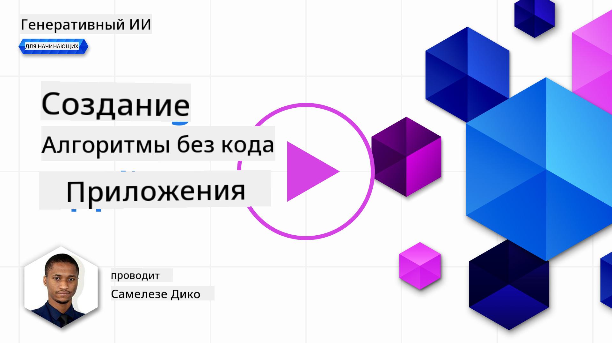](https://aka.ms/gen-ai-lesson10-gh?WT.mc_id=academic-105485-koreyst)

> _(Нажмите на изображение выше, чтобы посмотреть видео этого урока)_

## Введение

Теперь, когда мы научились создавать приложения для генерации изображений, давайте поговорим о низком уровне кода. Генеративный AI может использоваться в различных областях, включая низкий уровень кода, но что это такое и как мы можем добавить AI в него?

Создание приложений и решений стало проще для традиционных разработчиков и неразработчиков благодаря платформам разработки с низким уровнем кода. Эти платформы позволяют создавать приложения и решения с минимальным или отсутствующим кодом. Это достигается за счет предоставления визуальной среды разработки, которая позволяет перетаскивать компоненты для создания приложений и решений. Это позволяет создавать приложения и решения быстрее и с меньшими ресурсами. В этом уроке мы подробно рассмотрим, как использовать низкий уровень кода и как улучшить разработку с его помощью AI на платформе Power Platform.

Power Platform предоставляет организациям возможность дать своим командам возможность создавать собственные решения в интуитивно понятной среде с низким или нулевым уровнем кода. Эта среда помогает упростить процесс создания решений. С Power Platform решения могут быть созданы за дни или недели вместо месяцев или лет. Power Platform состоит из пяти ключевых продуктов: Power Apps, Power Automate, Power BI, Power Pages и Copilot Studio.

Этот урок охватывает:

- Введение в генеративный AI на платформе Power Platform
- Введение в Copilot и как его использовать
- Использование генеративного AI для создания приложений и потоков на платформе Power Platform
- Понимание моделей AI на платформе Power Platform с AI Builder

## Цели обучения

К концу этого урока вы сможете:

- Понять, как работает Copilot в Power Platform.

- Создать приложение для отслеживания заданий студентов для нашего образовательного стартапа.

- Создать поток обработки счетов, который использует AI для извлечения информации из счетов.

- Применять лучшие практики при использовании модели AI GPT для создания текста.

Инструменты и технологии, которые вы будете использовать в этом уроке:

- **Power Apps** для приложения по отслеживанию заданий студентов, которое предоставляет среду разработки с низким уровнем кода для создания приложений для отслеживания, управления и взаимодействия с данными.

- **Dataverse** для хранения данных приложения по отслеживанию заданий студентов, где Dataverse предоставит платформу данных с низким уровнем кода для хранения данных приложения.

- **Power Automate** для потока обработки счетов, где у вас будет среда разработки с низким уровнем кода для создания рабочих процессов для автоматизации процесса обработки счетов.

- **AI Builder** для модели AI обработки счетов, где вы будете использовать готовые модели AI для обработки счетов для нашего стартапа.

## Генеративный AI в Power Platform

Улучшение разработки и приложений с низким уровнем кода с помощью генеративного AI является ключевой областью фокуса для Power Platform. Цель состоит в том, чтобы позволить каждому создавать приложения с AI, сайты, панели управления и автоматизировать процессы с помощью AI, _не требуя никакой экспертизы в области науки о данных_. Эта цель достигается путем интеграции генеративного AI в опыт разработки с низким уровнем кода на платформе Power Platform в виде Copilot и AI Builder.

### Как это работает?

Copilot - это AI-ассистент, который позволяет вам создавать решения Power Platform, описывая ваши требования в серии шагов на естественном языке. Вы можете, например, поручить вашему AI-ассистенту указать, какие поля будет использовать ваше приложение, и он создаст как само приложение, так и основную модель данных, или вы можете указать, как настроить поток в Power Automate.

Вы можете использовать функции, управляемые Copilot, как функцию на экранах вашего приложения, чтобы позволить пользователям находить информацию через разговорные взаимодействия.

AI Builder - это возможность AI с низким уровнем кода, доступная в Power Platform, которая позволяет вам использовать модели AI, чтобы помочь вам автоматизировать процессы и предсказывать результаты. С AI Builder вы можете принести AI в свои приложения и потоки, которые подключаются к вашим данным в Dataverse или в различных облачных источниках данных, таких как SharePoint, OneDrive или Azure.

Copilot доступен во всех продуктах Power Platform: Power Apps, Power Automate, Power BI, Power Pages и Power Virtual Agents. AI Builder доступен в Power Apps и Power Automate. В этом уроке мы сосредоточимся на том, как использовать Copilot и AI Builder в Power Apps и Power Automate для создания решения для нашего образовательного стартапа.

### Copilot в Power Apps

Как часть платформы Power Platform, Power Apps предоставляет среду разработки с низким уровнем кода для создания приложений для отслеживания, управления и взаимодействия с данными. Это набор услуг для разработки приложений с масштабируемой платформой данных и возможностью подключения к облачным сервисам и локальным данным. Power Apps позволяет создавать приложения, которые работают в браузерах, на планшетах и телефонах и могут быть поделены с коллегами. Power Apps облегчает пользователям вхождение в разработку приложений с простым интерфейсом, так что каждый бизнес-пользователь или профессиональный разработчик может создавать пользовательские приложения. Опыт разработки приложений также улучшен с помощью генеративного AI через Copilot.

Функция AI-ассистента Copilot в Power Apps позволяет вам описать, какое приложение вам нужно и какую информацию вы хотите, чтобы ваше приложение отслеживало, собирало или показывало. Copilot затем генерирует отзывчивое приложение Canvas на основе вашего описания. Вы можете затем настроить приложение, чтобы оно соответствовало вашим нуждам. AI Copilot также генерирует и предлагает таблицу Dataverse с полями, которые вам нужны для хранения данных, которые вы хотите отслеживать, и некоторыми образцами данных. Позже в этом уроке мы рассмотрим, что такое Dataverse и как вы можете использовать его в Power Apps. Вы можете затем настроить таблицу, чтобы она соответствовала вашим нуждам, используя функцию AI Copilot через разговорные шаги. Эта функция доступна с домашнего экрана Power Apps.

### Copilot в Power Automate

Как часть платформы Power Platform, Power Automate позволяет пользователям создавать автоматизированные рабочие процессы между приложениями и сервисами. Это помогает автоматизировать повторяющиеся бизнес-процессы, такие как коммуникация, сбор данных и утверждение решений. Его простой интерфейс позволяет пользователям с любой технической компетенцией (от начинающих до опытных разработчиков) автоматизировать рабочие задачи. Опыт разработки рабочих процессов также улучшен с помощью генеративного AI через Copilot.

Функция AI-ассистента Copilot в Power Automate позволяет вам описать, какой поток вам нужен и какие действия вы хотите, чтобы ваш поток выполнял. Copilot затем генерирует поток на основе вашего описания. Вы можете затем настроить поток, чтобы он соответствовал вашим нуждам. AI Copilot также генерирует и предлагает действия, которые вам нужны для выполнения задачи, которую вы хотите автоматизировать. Позже в этом уроке мы рассмотрим, что такое потоки и как вы можете использовать их в Power Automate. Вы можете затем настроить действия, чтобы они соответствовали вашим нуждам, используя функцию AI Copilot через разговорные шаги. Эта функция доступна с домашнего экрана Power Automate.

## Задание: Управление заданиями студентов и счетами для нашего стартапа с использованием Copilot

Наш стартап предоставляет онлайн-курсы для студентов. Стартап быстро вырос и теперь испытывает трудности с удовлетворением спроса на свои курсы. Стартап нанял вас в качестве разработчика Power Platform, чтобы помочь им создать решение с низким уровнем кода, которое поможет им управлять заданиями студентов и счетами. Их решение должно помочь им отслеживать и управлять заданиями студентов через приложение и автоматизировать процесс обработки счетов через рабочий процесс. Вам было предложено использовать генеративный AI для разработки решения.

Когда вы начинаете использовать Copilot, вы можете использовать [Библиотеку подсказок Copilot Power Platform](https://github.com/pnp/powerplatform-prompts?WT.mc_id=academic-109639-somelezediko) для начала работы с подсказками. Эта библиотека содержит список подсказок, которые вы можете использовать для создания приложений и потоков с Copilot. Вы также можете использовать подсказки в библиотеке, чтобы получить представление о том, как описать ваши требования для Copilot.

### Создание приложения для отслеживания заданий студентов для нашего стартапа

Преподаватели нашего стартапа испытывают трудности с отслеживанием заданий студентов. Они использовали таблицу для отслеживания заданий, но это стало сложно управлять, так как количество студентов увеличилось. Они попросили вас создать приложение, которое поможет им отслеживать и управлять заданиями студентов. Приложение должно позволять им добавлять новые задания, просматривать задания, обновлять задания и удалять задания. Приложение также должно позволять преподавателям и студентам просматривать задания, которые были оценены, и те, которые еще не были оценены.

Вы создадите приложение с использованием Copilot в Power Apps, следуя шагам ниже:

1. Перейдите на домашний экран [Power Apps](https://make.powerapps.com?WT.mc_id=academic-105485-koreyst).

1. Используйте текстовую область на домашнем экране, чтобы описать приложение, которое вы хотите создать. Например, **_Я хочу создать приложение для отслеживания и управления заданиями студентов_**. Нажмите на кнопку **Отправить**, чтобы отправить подсказку AI Copilot.

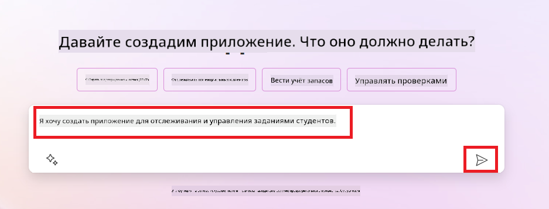

1. AI Copilot предложит таблицу Dataverse с полями, которые вам нужны для хранения данных, которые вы хотите отслеживать, и некоторыми образцами данных. Вы можете затем настроить таблицу, чтобы она соответствовала вашим нуждам, используя функцию AI Copilot через разговорные шаги.

   > **Важно**: Dataverse - это основная платформа данных для Power Platform. Это платформа данных с низким уровнем кода для хранения данных приложения. Это полностью управляемый сервис, который безопасно хранит данные в облаке Microsoft и предоставляется в вашей среде Power Platform. Он поставляется с встроенными возможностями управления данными, такими как классификация данных, происхождение данных, тонкая настройка доступа и многое другое. Вы можете узнать больше о Dataverse [здесь](https://docs.microsoft.com/powerapps/maker/data-platform/data-platform-intro?WT.mc_id=academic-109639-somelezediko).

   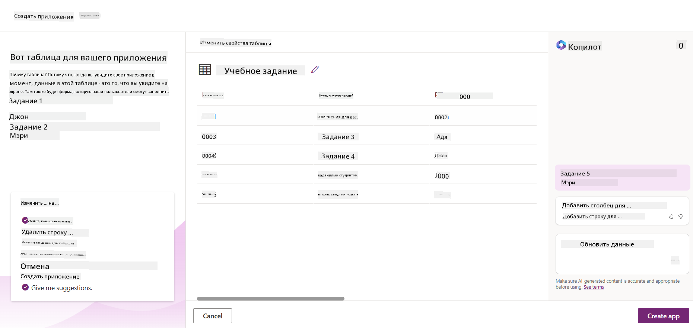

1. Преподаватели хотят отправлять электронные письма студентам, которые сдали свои задания, чтобы держать их в курсе о прогрессе их заданий. Вы можете использовать Copilot, чтобы добавить новое поле в таблицу для хранения электронной почты студента. Например, вы можете использовать следующую подсказку, чтобы добавить новое поле в таблицу: **_Я хочу добавить столбец для хранения электронной почты студента_**. Нажмите на кнопку **Отправить**, чтобы отправить подсказку AI Copilot.

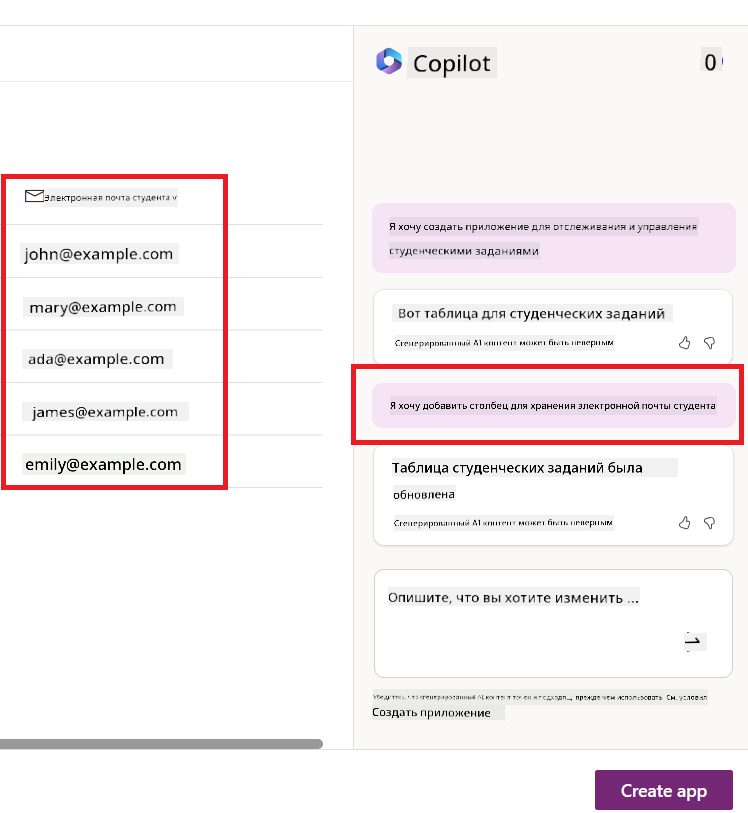

1. AI Copilot создаст новое поле, и вы можете затем настроить поле, чтобы оно соответствовало вашим нуждам.

1. Когда вы закончите с таблицей, нажмите на кнопку **Создать приложение**, чтобы создать приложение.

1. AI Copilot создаст отзывчивое приложение Canvas на основе вашего описания. Вы можете затем настроить приложение, чтобы оно соответствовало вашим нуждам.

1. Чтобы преподаватели могли отправлять электронные письма студентам, вы можете использовать Copilot, чтобы добавить новый экран в приложение. Например, вы можете использовать следующую подсказку, чтобы добавить новый экран в приложение: **_Я хочу добавить экран для отправки электронных писем студентам_**. Нажмите на кнопку **Отправить**, чтобы отправить подсказку AI Copilot.

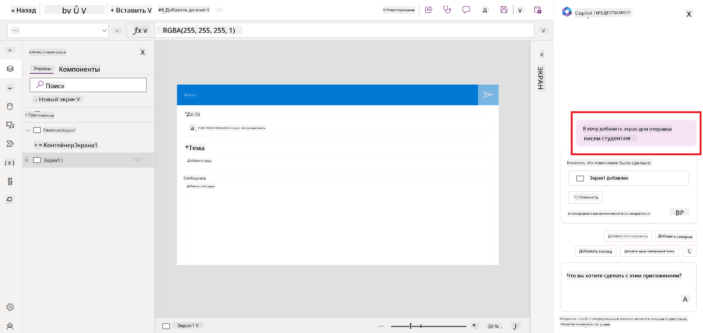

1. AI Copilot создаст новый экран, и вы можете затем настроить экран, чтобы он соответствовал вашим нуждам.

1. Когда вы закончите с приложением, нажмите на кнопку **Сохранить**, чтобы сохранить приложение.

1. Чтобы поделиться приложением с преподавателями, нажмите на кнопку **Поделиться**, а затем снова нажмите на кнопку **Поделиться**. Вы можете затем поделиться приложением с преподавателями, введя их адреса электронной почты.

> **Ваше домашнее задание**: Приложение, которое вы только что создали, является хорошим началом, но его можно улучшить. С функцией электронной почты преподаватели могут отправлять письма студентам только вручную, вводя их адреса электронной почты. Можете ли вы использовать Copilot, чтобы создать автоматизацию, которая позволит преподавателям автоматически отправлять письма студентам, когда они сдают свои задания? Ваш намек - с правильной подсказкой вы можете использовать Copilot в Power Automate, чтобы это сделать.

### Создание таблицы информации о счетах для нашего стартапа

Финансовая команда нашего стартапа испытывает трудности с отслеживанием счетов. Они использовали таблицу для отслеживания счетов, но это стало сложно управлять, так как количество счетов увеличилось. Они попросили вас создать таблицу, которая поможет им хранить, отслеживать и управлять информацией о полученных счетах. Таблица должна использоваться для создания автоматизации, которая будет извлекать всю информацию о счетах и хранить ее в таблице. Таблица также должна позволять финансовой команде просматривать оплаченные и неоплаченные счета.

Power Platform имеет основную платформу данных, называемую Dataverse, которая позволяет вам хранить данные для ваших приложений и решений. Dataverse предоставляет платформу данных с низким уровнем кода для хранения данных приложения. Это полностью управляемый сервис, который безопасно хранит данные в облаке Microsoft и предоставляется в вашей среде Power Platform. Он поставляется с встроенными возможностями управления данными, такими как классификация данных, происхождение данных, тонкая настройка доступа и многое другое. Вы можете узнать больше [о Dataverse здесь](https://docs.microsoft.com/powerapps/maker/data-platform/data-platform-intro?WT.mc_id=academic-109639-somelezediko).

Почему мы должны использовать Dataverse для нашего стартапа? Стандартные и пользовательские таблицы в Dataverse предоставляют безопасный и облачный вариант хранения для ваших данных. Таблицы позволяют хранить разные типы данных, аналогично тому, как вы могли бы использовать несколько листов в одной книге Excel. Вы можете использовать таблицы для хранения данных, которые специфичны для вашей организации или бизнес-потребностей. Некоторые из преимуществ, которые наш стартап получит от использования Dataverse, включают, но не ограничиваются:

- **Простота управления**: Метаданные и данные хранятся в облаке, поэтому вам не нужно беспокоиться о деталях их хранения или управления. Вы можете сосредоточиться на создании ваших приложений и решений.

- **Безопасность**: Dataverse предоставляет безопасный и облачный вариант хранения для ваших данных. Вы можете контролировать, кто имеет доступ к данным в ваших таблицах и как они могут к ним получить доступ, используя ролевую безопасность.

- **Богатые метаданные**: Типы данных и отношения используются непосредственно в Power Apps

- **Логика и валидация**: Вы можете использовать бизнес-правила, вычисляемые поля и правила валидации, чтобы внедрить бизнес-логику и поддерживать точность данных.

Теперь, когда вы знаете, что такое Dataverse и почему вы должны его использовать, давайте посмотрим, как вы можете использовать Copilot для создания таблицы в Dataverse, чтобы удовлетворить требования нашей финансовой команды.

> **Примечание**: Вы будете использовать эту таблицу в следующем разделе, чтобы создать автоматизацию, которая будет извлекать всю информацию о счетах и хранить ее в таблице.
Чтобы создать таблицу в Dataverse с использованием Copilot, выполните следующие шаги: 1. Перейдите на домашний экран [Power Apps](https://make.powerapps.com?WT.mc_id=academic-105485-koreyst). 2. В левой панели навигации выберите **Таблицы**, а затем нажмите на **Описать новую таблицу**. 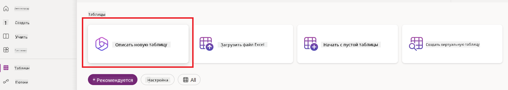 1. На экране **Описать новую таблицу** используйте текстовую область, чтобы описать таблицу, которую вы хотите создать. Например, **_Я хочу создать таблицу для хранения информации о счетах_**. Нажмите на кнопку **Отправить**, чтобы отправить подсказку AI Copilot. 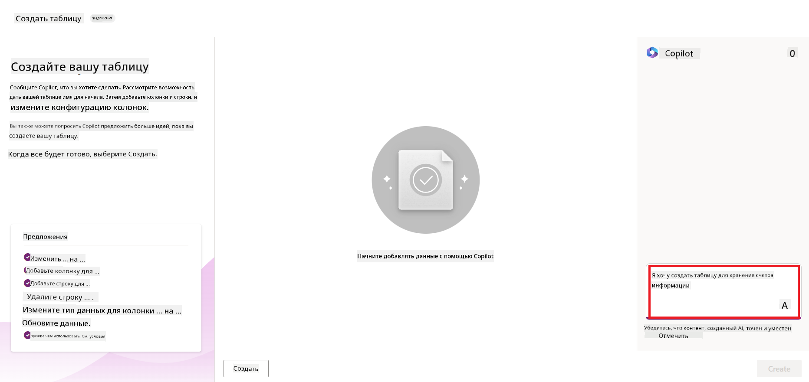 1. AI Copilot предложит таблицу Dataverse с полями, которые вам нужны для хранения данных, которые вы хотите отслеживать, и некоторыми образцами данных. Вы можете затем настроить таблицу, чтобы она соответствовала вашим нуждам, используя функцию AI Copilot через разговорные шаги. 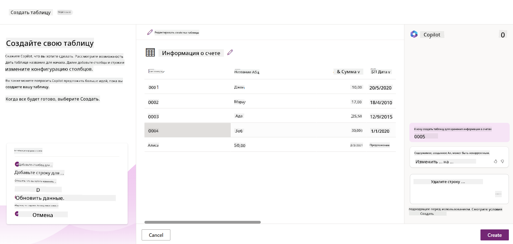 1. Финансовая команда хочет отправлять электронные письма поставщику, чтобы обновить их о текущем статусе их счета. Вы можете использовать Copilot, чтобы добавить новое поле в таблицу для хранения электронной почты поставщика. Например, вы можете использовать следующую подсказку, чтобы добавить новое поле в таблицу: **_Я хочу добавить столбец для хранения электронной почты поставщика_**. Нажмите на кнопку **Отправить**, чтобы отправить подсказку AI Copilot. 1. AI Copilot создаст новое поле, и вы можете затем настроить поле, чтобы оно
текст. - **Анализ настроений**: Эта модель определяет положительное, отрицательное, нейтральное или смешанное настроение в тексте. - **Считыватель визитных карточек**: Эта модель извлекает информацию с визитных карточек. - **Распознавание текста**: Эта модель извлекает текст из изображений. - **Обнаружение объектов**: Эта модель обнаруживает и извлекает объекты из изображений. - **Обработка документов**: Эта модель извлекает информацию из форм. - **Обработка счетов**: Эта модель извлекает информацию из счетов. С помощью собственных AI моделей вы можете загрузить свою модель в AI Builder, чтобы она функционировала как любая пользовательская модель AI Builder, позволяя вам обучать модель с использованием ваших данных. Вы можете использовать эти модели для автоматизации процессов и прогнозирования результатов как в Power Apps, так и в Power Automate. При использовании собственной модели существуют ограничения. Подробнее об этих [ограничениях](https://learn.microsoft.com/ai-builder/byo-model#limitations?WT.mc_id=academic-105485-koreyst). 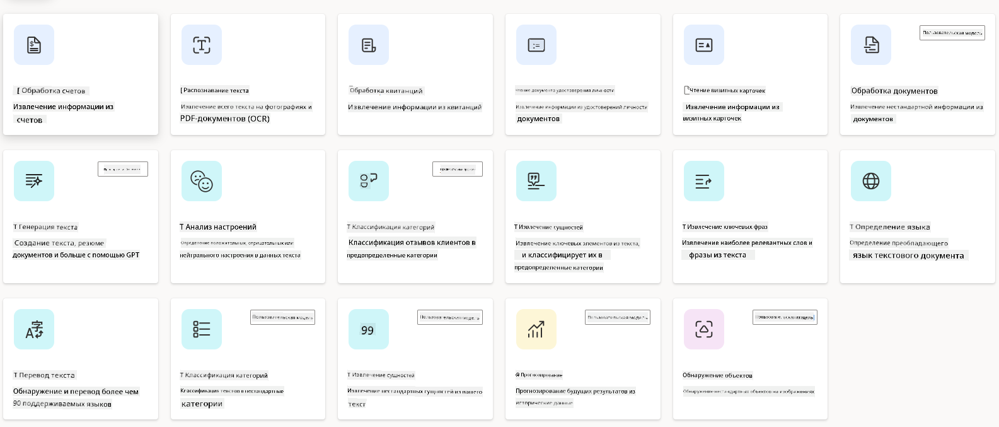

## Задание №2 - Создание потока обработки счетов для нашего стартапа

Финансовая команда испытывает трудности с обработкой счетов. Они использовали электронную таблицу для отслеживания счетов, но это стало трудно управлять, так как количество счетов увеличилось. Они попросили вас создать рабочий процесс, который поможет им обрабатывать счета с помощью AI. Рабочий процесс должен позволять им извлекать информацию из счетов и сохранять информацию в таблице Dataverse. Рабочий процесс также должен позволять им отправлять электронное письмо финансовой команде с извлеченной информацией.

Теперь, когда вы знаете, что такое AI Builder и почему его стоит использовать, давайте рассмотрим, как можно использовать AI модель обработки счетов в AI Builder, о которой мы говорили ранее, чтобы создать рабочий процесс, который поможет финансовой команде обрабатывать счета.

Чтобы создать рабочий процесс, который поможет финансовой команде обрабатывать счета с использованием AI модели обработки счетов в AI Builder, выполните следующие шаги:

1. Перейдите на главный экран [Power Automate](https://make.powerautomate.com?WT.mc_id=academic-105485-koreyst).
2. Используйте текстовую область на главном экране, чтобы описать рабочий процесс, который вы хотите создать. Например, **_Обработать счет, когда он приходит в мой почтовый ящик_**. Нажмите кнопку **Отправить**, чтобы отправить запрос AI Copilot. 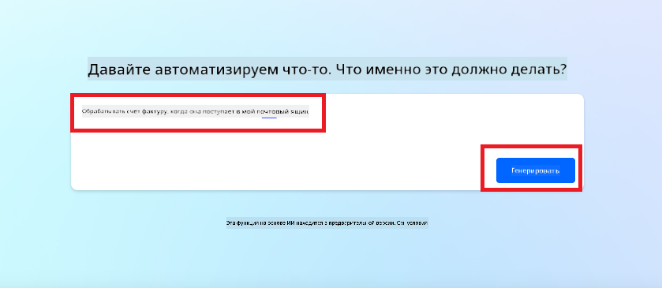
3. AI Copilot предложит действия, которые вам нужно выполнить для автоматизации задачи. Вы можете нажать кнопку **Далее**, чтобы перейти к следующим шагам.
4. На следующем шаге Power Automate предложит вам настроить необходимые подключения для потока. После завершения нажмите кнопку **Создать поток**, чтобы создать поток.
5. AI Copilot создаст поток, и вы сможете настроить его в соответствии с вашими потребностями.
6. Обновите триггер потока и установите **Папку** в папку, где будут храниться счета. Например, вы можете установить папку в **Входящие**. Нажмите **Показать дополнительные параметры** и установите **Только с вложениями** на **Да**. Это обеспечит запуск потока только при получении письма с вложением в папку.
7. Удалите следующие действия из потока: **HTML в текст**, **Составить**, **Составить 2**, **Составить 3** и **Составить 4**, так как вы не будете их использовать.
8. Удалите действие **Условие** из потока, так как вы не будете его использовать. Это должно выглядеть как на следующем скриншоте: 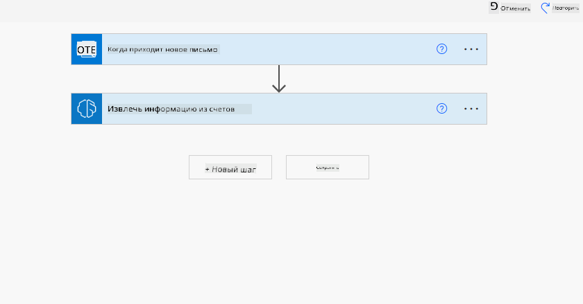
9. Нажмите на кнопку **Добавить действие** и найдите **Dataverse**. Выберите действие **Добавить новую строку**.
10. В действии **Извлечь информацию из счетов** обновите **Файл счета**, чтобы он указывал на **Содержимое вложения** из письма. Это обеспечит извлечение информации из вложения счета.
11. Выберите **Таблицу**, которую вы создали ранее. Например, вы можете выбрать таблицу **Информация о счете**. Выберите динамическое содержимое из предыдущего действия, чтобы заполнить следующие поля: - ID - Сумма - Дата - Имя - Статус - Установите **Статус** на **Ожидание**. - Электронная почта поставщика - Используйте динамическое содержимое **От** из триггера **Когда приходит новое письмо**. 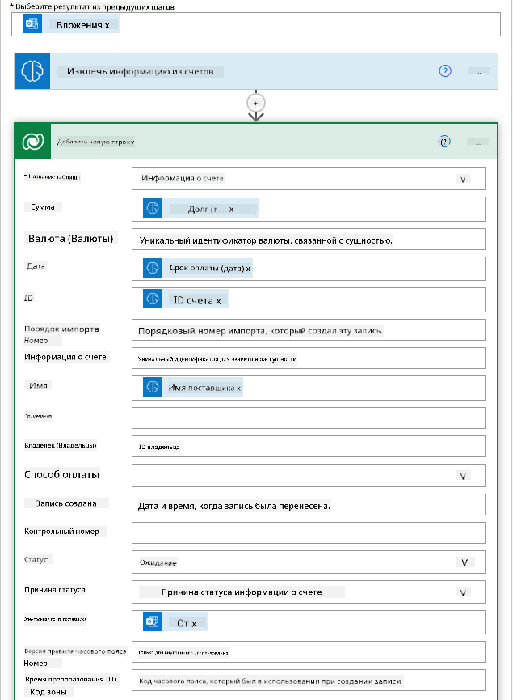
12. После завершения работы с потоком нажмите кнопку **Сохранить**, чтобы сохранить поток. Затем вы можете протестировать поток, отправив письмо со счетом в папку, указанную в триггере.

> **Ваше домашнее задание**: Поток, который вы только что создали, является хорошим началом, теперь вам нужно подумать о том, как вы можете создать автоматизацию, которая позволит нашей финансовой команде отправлять электронное письмо поставщику, чтобы обновить его о текущем статусе их счета. Ваш намек: поток должен запускаться, когда статус счета изменяется.

## Использование AI модели генерации текста в Power Automate

Модель создания текста с помощью GPT в AI Builder позволяет генерировать текст на основе запроса и работает на базе Microsoft Azure OpenAI Service. С этой возможностью вы можете интегрировать технологию GPT (Generative Pre-Trained Transformer) в свои приложения и потоки, чтобы создавать разнообразные автоматизированные потоки и полезные приложения.

Модели GPT проходят обширное обучение на огромных объемах данных, что позволяет им генерировать текст, который близко напоминает человеческий язык, когда им предоставляется запрос. При интеграции с автоматизацией рабочих процессов, AI модели, такие как GPT, могут быть использованы для оптимизации и автоматизации широкого спектра задач.

Например, вы можете создавать потоки для автоматической генерации текста для различных случаев использования, таких как: черновики писем, описания продуктов и многое другое. Вы также можете использовать модель для генерации текста для различных приложений, таких как чат-боты и приложения для обслуживания клиентов, которые позволяют агентам службы поддержки эффективно и быстро отвечать на запросы клиентов.

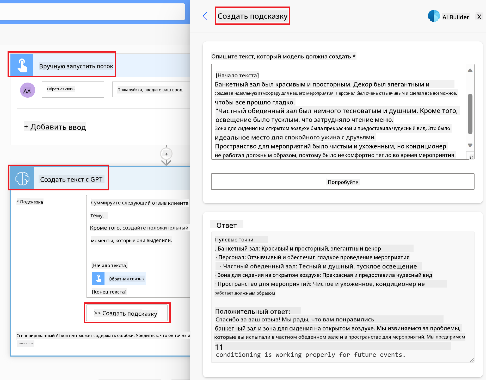

Чтобы узнать, как использовать эту AI модель в Power Automate, пройдите модуль [Добавление интеллекта с AI Builder и GPT](https://learn.microsoft.com/training/modules/ai-builder-text-generation/?WT.mc_id=academic-109639-somelezediko).

## Отличная работа! Продолжайте обучение

После завершения этого урока, ознакомьтесь с нашей [Коллекцией обучения генеративному AI](https://aka.ms/genai-collection?WT.mc_id=academic-105485-koreyst), чтобы продолжить повышать свои знания о генеративном AI!

Перейдите к уроку 11, где мы рассмотрим, как [интегрировать генеративный AI с вызовом функций](../11-integrating-with-function-calling/README.md?WT.mc_id=academic-105485-koreyst)!

**Отказ от ответственности**:  
Этот документ был переведен с помощью сервиса автоматического перевода [Co-op Translator](https://github.com/Azure/co-op-translator). Мы стремимся к точности, однако, пожалуйста, имейте в виду, что автоматические переводы могут содержать ошибки или неточности. Оригинальный документ на его родном языке следует считать авторитетным источником. Для получения критически важной информации рекомендуется профессиональный перевод человеком. Мы не несем ответственности за любые недоразумения или неправильные толкования, возникшие в результате использования данного перевода.