<!--
CO_OP_TRANSLATOR_METADATA:
{
  "original_hash": "f5ff3b6204a695a117d6f452403c95f7",
  "translation_date": "2025-06-25T17:52:11+00:00",
  "source_file": "10-building-low-code-ai-applications/README.md",
  "language_code": "ru"
}
-->
# Создание приложений ИИ с низким уровнем кода

[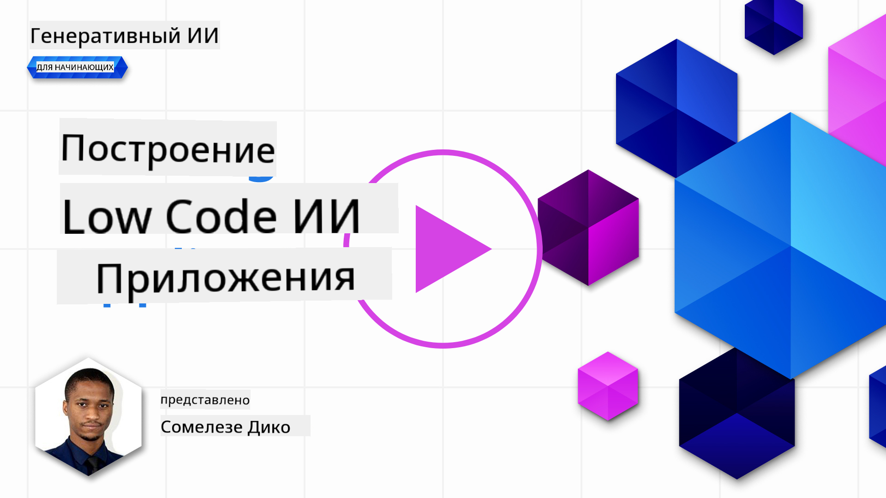](https://aka.ms/gen-ai-lesson10-gh?WT.mc_id=academic-105485-koreyst)

> _(Нажмите на изображение выше, чтобы посмотреть видео этого урока)_

## Введение

Теперь, когда мы научились создавать приложения для генерации изображений, давайте поговорим о низком уровне кода. Генеративный ИИ может быть использован в различных областях, включая низкий уровень кода, но что это такое и как мы можем добавить ИИ в него?

Создание приложений и решений стало проще для традиционных разработчиков и неразработчиков благодаря использованию платформ разработки с низким уровнем кода. Платформы разработки с низким уровнем кода позволяют создавать приложения и решения с минимальным или отсутствующим кодом. Это достигается за счет предоставления визуальной среды разработки, которая позволяет перетаскивать компоненты для создания приложений и решений. Это позволяет создавать приложения и решения быстрее и с меньшими ресурсами. В этом уроке мы подробно рассмотрим, как использовать низкий уровень кода и как улучшить его с помощью ИИ, используя Power Platform.

Power Platform предоставляет организациям возможность наделить свои команды способностью создавать собственные решения через интуитивно понятную среду с низким или отсутствующим уровнем кода. Эта среда упрощает процесс создания решений. С Power Platform решения могут быть созданы за дни или недели, а не месяцы или годы. Power Platform состоит из пяти ключевых продуктов: Power Apps, Power Automate, Power BI, Power Pages и Copilot Studio.

Этот урок охватывает:

- Введение в генеративный ИИ в Power Platform
- Введение в Copilot и как его использовать
- Использование генеративного ИИ для создания приложений и потоков в Power Platform
- Понимание моделей ИИ в Power Platform с AI Builder

## Учебные цели

К концу этого урока вы сможете:

- Понять, как работает Copilot в Power Platform.

- Создать приложение для отслеживания заданий студентов для нашего образовательного стартапа.

- Создать поток обработки счетов, который использует ИИ для извлечения информации из счетов.

- Применять лучшие практики при использовании модели ИИ GPT для создания текста.

Инструменты и технологии, которые вы будете использовать в этом уроке:

- **Power Apps** для приложения Student Assignment Tracker, которое предоставляет среду разработки с низким уровнем кода для создания приложений для отслеживания, управления и взаимодействия с данными.

- **Dataverse** для хранения данных приложения Student Assignment Tracker, где Dataverse предоставит платформу данных с низким уровнем кода для хранения данных приложения.

- **Power Automate** для потока обработки счетов, где у вас будет среда разработки с низким уровнем кода для создания рабочих процессов для автоматизации процесса обработки счетов.

- **AI Builder** для модели ИИ обработки счетов, где вы будете использовать предварительно построенные модели ИИ для обработки счетов нашего стартапа.

## Генеративный ИИ в Power Platform

Улучшение разработки и применения приложений с низким уровнем кода с помощью генеративного ИИ является ключевой областью внимания для Power Platform. Цель состоит в том, чтобы каждый мог создавать приложения, сайты, панели управления и автоматизировать процессы с помощью ИИ, _не требуя знаний в области науки о данных_. Эта цель достигается за счет интеграции генеративного ИИ в опыт разработки с низким уровнем кода в Power Platform в форме Copilot и AI Builder.

### Как это работает?

Copilot — это помощник ИИ, который позволяет вам создавать решения Power Platform, описывая ваши требования в серии шагов на естественном языке. Вы можете, например, указать вашему ИИ-помощнику, какие поля будет использовать ваше приложение, и он создаст как приложение, так и подлежащую модель данных, или вы можете указать, как настроить поток в Power Automate.

Вы можете использовать функции, управляемые Copilot, как функцию в экранах вашего приложения, чтобы позволить пользователям выявлять инсайты через разговорные взаимодействия.

AI Builder — это возможность ИИ с низким уровнем кода, доступная в Power Platform, которая позволяет вам использовать модели ИИ для автоматизации процессов и прогнозирования результатов. С AI Builder вы можете привнести ИИ в ваши приложения и потоки, которые подключаются к вашим данным в Dataverse или в различных облачных источниках данных, таких как SharePoint, OneDrive или Azure.

Copilot доступен во всех продуктах Power Platform: Power Apps, Power Automate, Power BI, Power Pages и Power Virtual Agents. AI Builder доступен в Power Apps и Power Automate. В этом уроке мы сосредоточимся на том, как использовать Copilot и AI Builder в Power Apps и Power Automate для создания решения для нашего образовательного стартапа.

### Copilot в Power Apps

Как часть Power Platform, Power Apps предоставляет среду разработки с низким уровнем кода для создания приложений для отслеживания, управления и взаимодействия с данными. Это набор сервисов разработки приложений с масштабируемой платформой данных и возможностью подключения к облачным сервисам и локальным данным. Power Apps позволяет создавать приложения, которые работают в браузерах, на планшетах и телефонах и могут быть разделены с коллегами. Power Apps упрощает пользователям разработку приложений с простым интерфейсом, так что каждый бизнес-пользователь или профессиональный разработчик может создавать пользовательские приложения. Опыт разработки приложений также улучшается с помощью генеративного ИИ через Copilot.

Функция AI-помощника Copilot в Power Apps позволяет вам описывать, какое приложение вам нужно и какую информацию вы хотите, чтобы ваше приложение отслеживало, собирало или показывало. Copilot затем генерирует адаптивное приложение Canvas на основе вашего описания. Вы можете затем настроить приложение в соответствии с вашими потребностями. AI Copilot также генерирует и предлагает таблицу Dataverse с полями, необходимыми для хранения данных, которые вы хотите отслеживать, и некоторыми примерами данных. Мы рассмотрим, что такое Dataverse и как вы можете использовать его в Power Apps в этом уроке позже. Вы можете затем настроить таблицу в соответствии с вашими потребностями, используя функцию AI Copilot через разговорные шаги. Эта функция доступна с домашнего экрана Power Apps.

### Copilot в Power Automate

Как часть Power Platform, Power Automate позволяет пользователям создавать автоматизированные рабочие процессы между приложениями и сервисами. Это помогает автоматизировать повторяющиеся бизнес-процессы, такие как коммуникация, сбор данных и утверждение решений. Его простой интерфейс позволяет пользователям с любым уровнем технической компетенции (от новичков до опытных разработчиков) автоматизировать рабочие задачи. Опыт разработки рабочих процессов также улучшается с помощью генеративного ИИ через Copilot.

Функция AI-помощника Copilot в Power Automate позволяет вам описывать, какой поток вам нужен и какие действия вы хотите, чтобы ваш поток выполнял. Copilot затем генерирует поток на основе вашего описания. Вы можете затем настроить поток в соответствии с вашими потребностями. AI Copilot также генерирует и предлагает действия, которые вам нужны для выполнения задачи, которую вы хотите автоматизировать. Мы рассмотрим, что такое потоки и как вы можете использовать их в Power Automate в этом уроке позже. Вы можете затем настроить действия в соответствии с вашими потребностями, используя функцию AI Copilot через разговорные шаги. Эта функция доступна с домашнего экрана Power Automate.

## Задание: Управление заданиями студентов и счетами для нашего стартапа с использованием Copilot

Наш стартап предоставляет онлайн-курсы студентам. Стартап быстро вырос и теперь испытывает трудности с удовлетворением спроса на свои курсы. Стартап нанял вас в качестве разработчика Power Platform, чтобы помочь им создать решение с низким уровнем кода для управления заданиями студентов и счетами. Их решение должно уметь отслеживать и управлять заданиями студентов через приложение и автоматизировать процесс обработки счетов через рабочий процесс. Вас попросили использовать генеративный ИИ для разработки решения.

Когда вы начинаете использовать Copilot, вы можете использовать [Библиотеку подсказок Copilot для Power Platform](https://github.com/pnp/powerplatform-prompts?WT.mc_id=academic-109639-somelezediko), чтобы начать с подсказок. Эта библиотека содержит список подсказок, которые вы можете использовать для создания приложений и потоков с Copilot. Вы также можете использовать подсказки в библиотеке, чтобы получить представление о том, как описывать ваши требования для Copilot.

### Создание приложения для отслеживания заданий студентов для нашего стартапа

Преподаватели в нашем стартапе испытывают трудности с отслеживанием заданий студентов. Они использовали электронную таблицу для отслеживания заданий, но это стало сложно управлять, поскольку количество студентов увеличилось. Они попросили вас создать приложение, которое поможет им отслеживать и управлять заданиями студентов. Приложение должно позволять добавлять новые задания, просматривать задания, обновлять задания и удалять задания. Приложение также должно позволять преподавателям и студентам просматривать задания, которые были оценены, и те, которые не были оценены.

Вы создадите приложение с использованием Copilot в Power Apps, следуя шагам ниже:

1. Перейдите на домашний экран [Power Apps](https://make.powerapps.com?WT.mc_id=academic-105485-koreyst).

1. Используйте текстовую область на домашнем экране, чтобы описать приложение, которое вы хотите создать. Например, **_Я хочу создать приложение для отслеживания и управления заданиями студентов_**. Нажмите на кнопку **Отправить**, чтобы отправить подсказку AI Copilot.

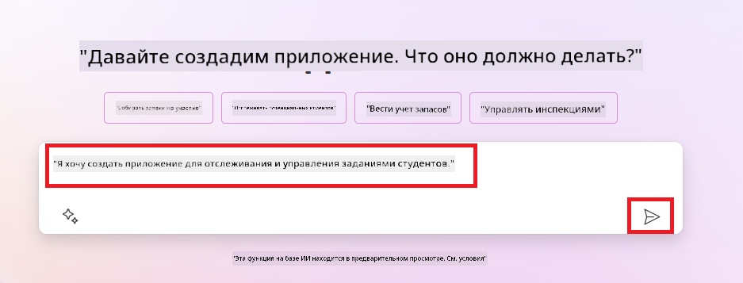

1. AI Copilot предложит таблицу Dataverse с полями, необходимыми для хранения данных, которые вы хотите отслеживать, и некоторыми примерами данных. Вы можете затем настроить таблицу в соответствии с вашими потребностями, используя функцию AI Copilot через разговорные шаги.

   > **Важно**: Dataverse — это основная платформа данных для Power Platform. Это платформа данных с низким уровнем кода для хранения данных приложения. Это полностью управляемый сервис, который безопасно хранит данные в облаке Microsoft и предоставляется в вашей среде Power Platform. Он имеет встроенные возможности управления данными, такие как классификация данных, происхождение данных, контроль доступа на уровне полей и многое другое. Вы можете узнать больше о Dataverse [здесь](https://docs.microsoft.com/powerapps/maker/data-platform/data-platform-intro?WT.mc_id=academic-109639-somelezediko).

   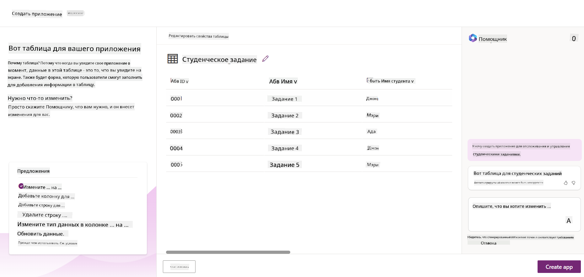

1. Преподаватели хотят отправлять электронные письма студентам, которые сдали свои задания, чтобы держать их в курсе прогресса их заданий. Вы можете использовать Copilot, чтобы добавить новое поле в таблицу для хранения электронной почты студента. Например, вы можете использовать следующую подсказку, чтобы добавить новое поле в таблицу: **_Я хочу добавить столбец для хранения электронной почты студента_**. Нажмите на кнопку **Отправить**, чтобы отправить подсказку AI Copilot.

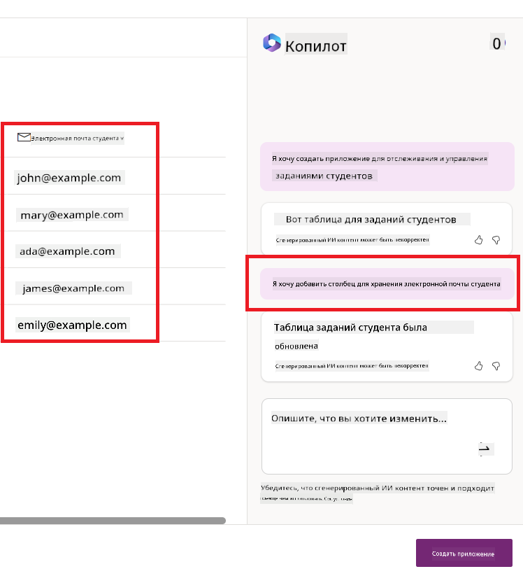

1. AI Copilot сгенерирует новое поле, и вы можете затем настроить поле в соответствии с вашими потребностями.

1. Когда вы закончите с таблицей, нажмите на кнопку **Создать приложение**, чтобы создать приложение.

1. AI Copilot сгенерирует адаптивное приложение Canvas на основе вашего описания. Вы можете затем настроить приложение в соответствии с вашими потребностями.

1. Чтобы преподаватели могли отправлять электронные письма студентам, вы можете использовать Copilot, чтобы добавить новый экран в приложение. Например, вы можете использовать следующую подсказку, чтобы добавить новый экран в приложение: **_Я хочу добавить экран для отправки электронных писем студентам_**. Нажмите на кнопку **Отправить**, чтобы отправить подсказку AI Copilot.

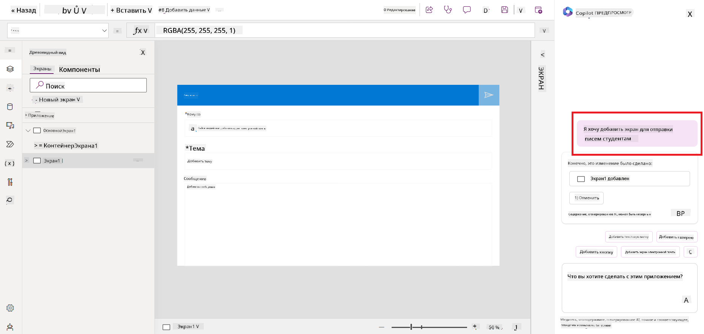

1. AI Copilot сгенерирует новый экран, и вы можете затем настроить экран в соответствии с вашими потребностями.

1. Когда вы закончите с приложением, нажмите на кнопку **Сохранить**, чтобы сохранить приложение.

1. Чтобы поделиться приложением с преподавателями, нажмите на кнопку **Поделиться**, а затем снова нажмите на кнопку **Поделиться**. Вы можете затем поделиться приложением с преподавателями, введя их адреса электронной почты.

> **Ваше домашнее задание**: Приложение, которое вы только что создали, является хорошим началом, но может быть улучшено. С функцией электронной почты преподаватели могут отправлять электронные письма студентам только вручную, вводя их адреса. Можете ли вы использовать Copilot, чтобы создать автоматизацию, которая позволит преподавателям автоматически отправлять электронные письма студентам, когда они сдают свои задания? Ваша подсказка: с правильной подсказкой вы можете использовать Copilot в Power Automate для создания этого.

### Создание таблицы информации о счетах для нашего стартапа

Финансовая команда нашего стартапа испытывает трудности с отслеживанием счетов. Они использовали электронную таблицу для отслеживания счетов, но это стало сложно управлять, поскольку количество счетов увеличилось. Они попросили вас создать таблицу, которая поможет им хранить, отслеживать и управлять информацией о полученных счетах. Таблица должна быть использована для создания автоматизации, которая будет извлекать всю информацию о счетах и хранить ее в таблице. Таблица также должна позволять финансовой команде просматривать счета, которые были оплачены, и те, которые не были оплачены.

Power Platform имеет основную платформу данных, называемую Dataverse, которая позволяет вам хранить данные для ваших приложений и решений. Dataverse предоставляет платформу данных с низким уровнем кода для хранения данных приложения. Это полностью управляемый сервис, который безопасно хранит данные в облаке Microsoft и предоставляется в вашей среде Power Platform. Он имеет встроенные возможности управления данными, такие как классификация данных, происхождение данных, контроль доступа на уровне полей и многое другое. Вы можете узнать больше [о Dataverse здесь](https://docs.microsoft.com/powerapps/maker/data-platform/data-platform-intro?WT.mc_id=academic-109639-somelezediko).

Почему мы должны использовать Dataverse для нашего стартапа? Стандартные и пользовательские таблицы в Dataverse предоставляют безопасный и облачный вариант хранения ваших данных. Таблицы позволяют вам хранить различные типы данных, аналогично тому, как вы могли бы использовать несколько листов в одной книге Excel. Вы можете использовать таблицы для хранения данных, которые специфичны для ваших организационных или бизнес-потребностей. Некоторые из преимуществ, которые получит наш стартап от использования Dataverse, включают, но не ограничиваются:

- **Легкость управления**: как метаданные, так и данные хранятся в облаке, так что вам не нужно беспокоиться о деталях того, как они хранятся или управляются. Вы можете сосредоточиться на создании ваших приложений и решений.

- **Безопасность**: Dataverse предоставляет безопасный и облачный вариант хранения ваших данных. Вы можете контролировать, кто имеет доступ к данным в ваших таблицах и как они могут к ним получить доступ, используя роль на основе безопасности.

- **Богатые метаданные**: типы данных и отношения используются непосредственно в Power Apps.

- **Логика и проверка**: вы можете использовать бизнес-правила, вычисляемые поля и правила проверки, чтобы применять бизнес-логику и поддерживать точность данных.

Теперь, когда вы знаете, что такое Dataverse и почему вы должны его использовать, давайте рассмотрим, как вы можете использовать Copilot для создания таблицы в Dataverse, чтобы удовлетворить требования нашей финансовой команды.

> **Примечание**: Вы будете использовать эту таблицу в следующем разделе для создания автоматизации, которая будет извлекать всю информацию о счетах и хранить ее в таблице. Чтобы создать таблицу в Dataverse с использованием Copilot, выполните следующие шаги: 1. Перейдите на домашний экран [Power Apps](https://make.powerapps.com?WT.mc_id=academic-105485-koreyst). 2. На левой панели навигации выберите **Таблицы**, а затем нажмите **Опишите новую таблицу**. 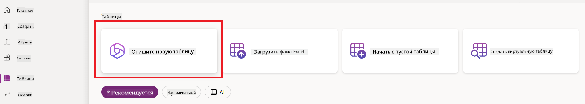 1. На экране **Опишите новую таблицу** используйте текстовую область, чтобы описать таблицу, которую вы хотите создать. Например, **_Я хочу создать таблицу для хранения информации о счетах_**. Нажмите на кнопку **Отправить**, чтобы отправить подсказку AI Copilot. 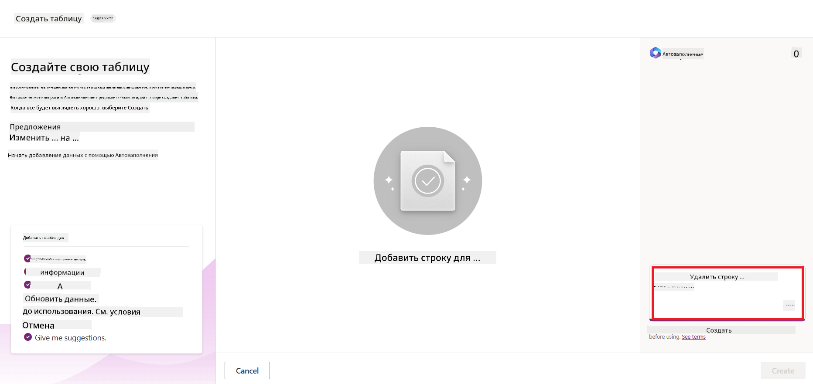 1. AI Copilot предложит таблицу Dataverse с полями, необходимыми для хранения данных, которые вы хотите отслеживать, и некоторыми примерами данных. Вы можете затем настроить таблицу в соответствии с вашими потребностями, используя функцию AI Copilot через разговорные шаги. 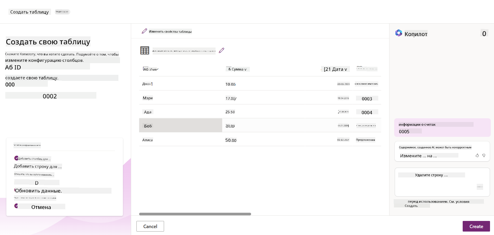 1. Финансовая команда хочет отправить электронное письмо поставщику, чтобы обновить их текущим статусом их счета. Вы можете использовать Copilot, чтобы добавить новое поле в таблицу для хранения электронной почты поставщика. Например, вы можете использовать следующую подсказку, чтобы добавить новое поле в таблицу: **_Я хочу добавить столбец для хранения электронной почты поставщика_**. Нажмите на кнопку **Отправить**, чтобы отправить подсказку AI Copilot. 1. AI Copilot сгенерирует новое поле, и вы можете затем настроить поле в соответствии с вашими потребностями. 1.
текст. - **Анализ настроений**: Эта модель определяет положительное, отрицательное, нейтральное или смешанное настроение в тексте. - **Считыватель визитных карточек**: Эта модель извлекает информацию из визитных карточек. - **Распознавание текста**: Эта модель извлекает текст из изображений. - **Обнаружение объектов**: Эта модель обнаруживает и извлекает объекты из изображений. - **Обработка документов**: Эта модель извлекает информацию из форм. - **Обработка счетов**: Эта модель извлекает информацию из счетов. С помощью пользовательских моделей ИИ вы можете интегрировать свою модель в AI Builder, чтобы она функционировала как любая пользовательская модель AI Builder, позволяя вам обучать модель с использованием ваших данных. Вы можете использовать эти модели для автоматизации процессов и прогнозирования результатов как в Power Apps, так и в Power Automate. При использовании собственной модели существуют ограничения. Подробнее об этих [ограничениях](https://learn.microsoft.com/ai-builder/byo-model#limitations?WT.mc_id=academic-105485-koreyst). 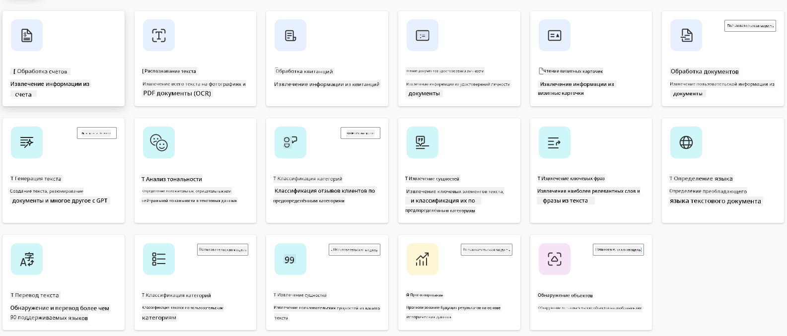

## Задание №2 - Создание потока обработки счетов для нашего стартапа

Финансовая команда сталкивается с трудностями при обработке счетов. Они использовали таблицу для отслеживания счетов, но это стало сложно управлять, так как количество счетов увеличилось. Они попросили вас создать рабочий процесс, который поможет им обрабатывать счета с помощью ИИ. Рабочий процесс должен позволять извлекать информацию из счетов и сохранять ее в таблице Dataverse. Рабочий процесс также должен позволять отправлять электронное письмо финансовой команде с извлеченной информацией.

Теперь, когда вы знаете, что такое AI Builder и почему его стоит использовать, давайте рассмотрим, как вы можете использовать модель обработки счетов AI Builder, которую мы рассмотрели ранее, чтобы создать рабочий процесс, который поможет финансовой команде обрабатывать счета.

Чтобы создать рабочий процесс, который поможет финансовой команде обрабатывать счета с использованием модели обработки счетов AI Builder, выполните следующие шаги:

1. Перейдите на главную страницу [Power Automate](https://make.powerautomate.com?WT.mc_id=academic-105485-koreyst).
2. Используйте текстовое поле на главной странице, чтобы описать рабочий процесс, который вы хотите создать. Например, **_Обработать счет, когда он поступает в мой почтовый ящик_**. Нажмите кнопку **Отправить**, чтобы отправить запрос AI Copilot.
   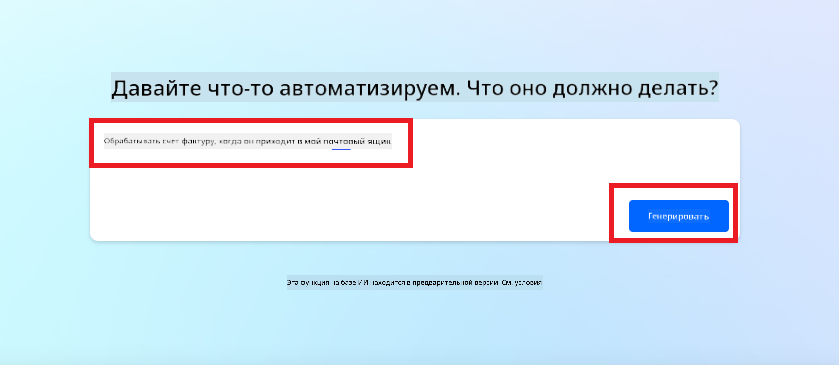
3. AI Copilot предложит действия, которые необходимо выполнить для автоматизации задачи. Вы можете нажать кнопку **Далее**, чтобы перейти к следующим шагам.
4. На следующем шаге Power Automate предложит вам настроить соединения, необходимые для потока. После завершения нажмите кнопку **Создать поток**, чтобы создать поток.
5. AI Copilot создаст поток, и вы сможете настроить его в соответствии с вашими потребностями.
6. Обновите триггер потока и установите **Папку** в папку, где будут храниться счета. Например, вы можете установить папку **Входящие**. Нажмите **Показать дополнительные параметры** и установите **Только с вложениями** в **Да**. Это гарантирует, что поток запускается только при получении электронного письма с вложением в папку.
7. Удалите следующие действия из потока: **HTML в текст**, **Составить**, **Составить 2**, **Составить 3** и **Составить 4**, так как вы не будете их использовать.
8. Удалите действие **Условие** из потока, так как вы не будете его использовать. Это должно выглядеть как на следующем скриншоте:
   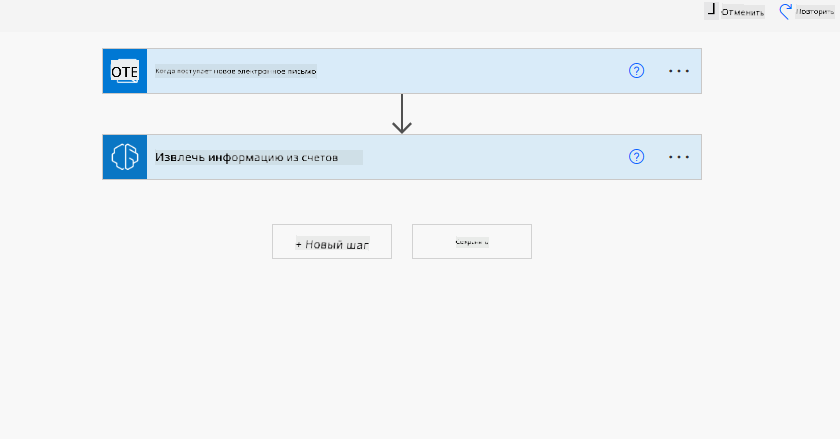
9. Нажмите кнопку **Добавить действие** и найдите **Dataverse**. Выберите действие **Добавить новую строку**.
10. В действии **Извлечь информацию из счетов** обновите **Файл счета**, чтобы указать на **Содержимое вложения** из электронной почты. Это обеспечит извлечение информации из вложения счета.
11. Выберите **Таблицу**, которую вы создали ранее. Например, вы можете выбрать таблицу **Информация о счете**. Выберите динамическое содержимое из предыдущего действия, чтобы заполнить следующие поля:
    - ID
    - Сумма
    - Дата
    - Имя
    - Статус
    - Установите **Статус** на **В ожидании**.
    - Электронная почта поставщика
    - Используйте динамическое содержимое **От** из триггера **Когда поступает новое письмо**.
    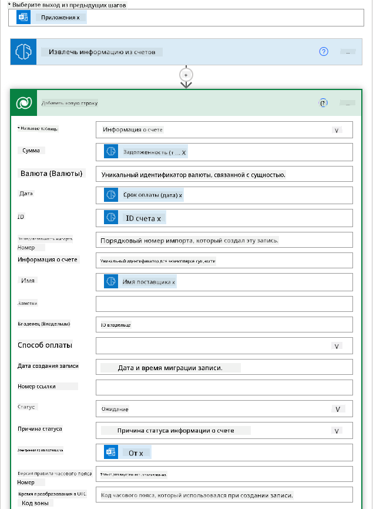
12. После завершения работы с потоком нажмите кнопку **Сохранить**, чтобы сохранить поток. Вы можете протестировать поток, отправив электронное письмо со счетом в папку, указанную в триггере.

> **Ваше домашнее задание**: Поток, который вы только что создали, — это хорошее начало, теперь вам нужно подумать, как вы можете создать автоматизацию, которая позволит нашей финансовой команде отправить электронное письмо поставщику, чтобы обновить его о текущем статусе его счета. Ваша подсказка: поток должен запускаться при изменении статуса счета.

## Использование модели генерации текста ИИ в Power Automate

Модель Create Text with GPT в AI Builder позволяет генерировать текст на основе запроса и использует Microsoft Azure OpenAI Service. Благодаря этой возможности вы можете интегрировать технологию GPT (Generative Pre-Trained Transformer) в свои приложения и потоки, чтобы создавать разнообразные автоматизированные потоки и полезные приложения.

Модели GPT проходят обширное обучение на огромных объемах данных, что позволяет им создавать текст, который близко напоминает человеческий язык при предоставлении запроса. При интеграции с автоматизацией рабочих процессов модели ИИ, такие как GPT, могут быть использованы для упрощения и автоматизации широкого спектра задач.

Например, вы можете создавать потоки для автоматической генерации текста для различных случаев использования, таких как черновики писем, описания продуктов и многое другое. Вы также можете использовать модель для генерации текста для различных приложений, таких как чат-боты и приложения для обслуживания клиентов, которые позволяют агентам службы поддержки эффективно и быстро отвечать на запросы клиентов.

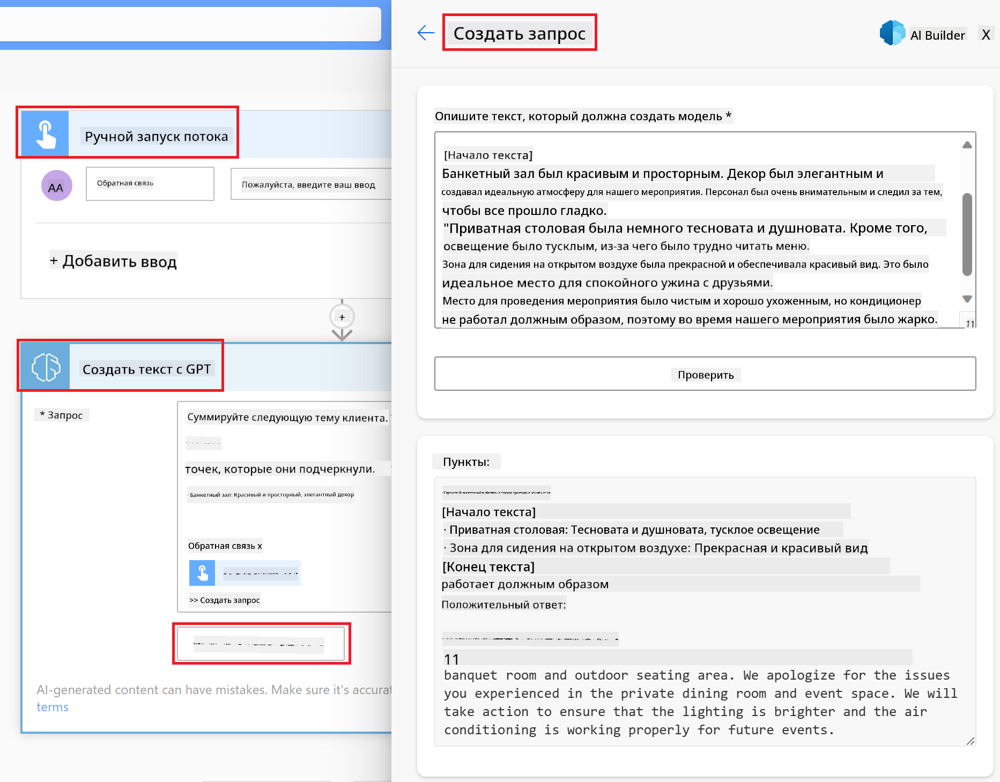

Чтобы узнать, как использовать эту модель ИИ в Power Automate, пройдите модуль [Добавление интеллекта с AI Builder и GPT](https://learn.microsoft.com/training/modules/ai-builder-text-generation/?WT.mc_id=academic-109639-somelezediko).

## Отличная работа! Продолжайте обучение

После завершения этого урока ознакомьтесь с нашей [коллекцией обучения генеративному ИИ](https://aka.ms/genai-collection?WT.mc_id=academic-105485-koreyst), чтобы продолжить повышать уровень своих знаний о генеративном ИИ!

Перейдите к уроку 11, где мы рассмотрим, как [интегрировать генеративный ИИ с вызовом функций](../11-integrating-with-function-calling/README.md?WT.mc_id=academic-105485-koreyst)!

**Отказ от ответственности**:  
Этот документ был переведен с помощью сервиса автоматического перевода [Co-op Translator](https://github.com/Azure/co-op-translator). Мы стремимся к точности, однако, пожалуйста, имейте в виду, что автоматизированные переводы могут содержать ошибки или неточности. Оригинальный документ на родном языке следует считать авторитетным источником. Для получения критически важной информации рекомендуется профессиональный перевод человеком. Мы не несем ответственности за любые недопонимания или неверные толкования, возникающие в результате использования этого перевода.