# Создание приложений искусственного интеллекта с низким кодом

> _(Нажмите на изображение выше, чтобы просмотреть видео урока)_

## Введение

Теперь, когда мы научились создавать приложения для генерации изображений, давайте поговорим о low code. Генеративный ИИ можно использовать в различных сферах, включая low code, но что такое low code и как мы можем добавить ИИ в него?

Создавать приложения и решения стало проще как для традиционных разработчиков, так и для неразработчиков благодаря платформам разработки с низким кодом (Low Code Development Platforms). Платформы Low Code позволяют создавать приложения и решения с минимальным кодированием или вовсе без него. Это достигается за счет предоставления визуальной среды разработки, позволяющей перетаскивать компоненты для создания приложений и решений. Это помогает создавать приложения и решения быстрее и с меньшими ресурсами. В этом уроке мы подробно рассмотрим, как использовать Low Code и как улучшить разработку с использованием ИИ через Power Platform.

Power Platform предоставляет организациям возможность расширить возможности своих команд и создавать собственные решения в интуитивной среде с низким или без кода. Эта среда упрощает процесс создания решений. С помощью Power Platform решения могут быть построены за дни или недели вместо месяцев или лет. Power Platform состоит из пяти ключевых продуктов: Power Apps, Power Automate, Power BI, Power Pages и Copilot Studio.

Этот урок охватывает:

- Введение в генеративный ИИ в Power Platform
- Введение в Copilot и как его использовать
- Использование генеративного ИИ для создания приложений и потоков в Power Platform
- Понимание моделей ИИ в Power Platform с AI Builder
- Создание интеллектуальных агентов с Microsoft Copilot Studio

## Учебные цели

По окончании урока вы сможете:

- Понять, как работает Copilot в Power Platform.

- Создать приложение для отслеживания студенческих заданий для нашего образовательного стартапа.

- Создать поток обработки счетов, который использует ИИ для извлечения информации из счетов.

- Применять лучшие практики при использовании модели ИИ Create Text с GPT.

- Понять, что такое Microsoft Copilot Studio и как создавать с его помощью интеллектуальных агентов.

Инструменты и технологии, которые вы будете использовать в этом уроке:

- **Power Apps** — для приложения Student Assignment Tracker, предоставляющее среду разработки с низким кодом для создания приложений по отслеживанию, управлению и взаимодействию с данными.

- **Dataverse** — для хранения данных приложения Student Assignment Tracker, предоставляющий платформу данных с низким кодом для хранения данных приложения.

- **Power Automate** — для потока обработки счетов, предлагающий среду разработки с низким кодом для создания рабочих процессов по автоматизации обработки счетов.

- **AI Builder** — для модели ИИ для обработки счетов, где вы будете использовать предсозданные модели ИИ для обработки счетов нашего стартапа.

## Генеративный ИИ в Power Platform

Расширение возможностей разработки с низким кодом и приложений с помощью генеративного ИИ является ключевой областью для Power Platform. Цель — позволить каждому создавать приложения, сайты, панели управления с поддержкой ИИ и автоматизировать процессы с помощью ИИ _без необходимости иметь опыт в области науки данных_. Эта цель достигается путем интеграции генеративного ИИ в опыт разработки с низким кодом в Power Platform в виде Copilot и AI Builder.

### Как это работает?

Copilot — это помощник на базе ИИ, который позволяет создавать решения Power Platform, описывая свои требования через серию шагов в диалоговом режиме на естественном языке. Вы можете, например, поручить вашему помощнику ИИ указать, какие поля будет использовать ваше приложение, и он создаст само приложение и базовую модель данных, либо задать, как настроить поток в Power Automate.

Вы можете использовать функциональные возможности, управляемые Copilot, как функцию на экранах приложений, чтобы позволить пользователям получать инсайты через диалоговое взаимодействие.

AI Builder — это возможность ИИ с низким кодом, доступная в Power Platform, которая позволяет использовать модели ИИ для автоматизации процессов и предсказания результатов. С AI Builder вы можете добавить ИИ в ваши приложения и потоки, которые подключаются к данным в Dataverse или в различных облачных источниках данных, таких как SharePoint, OneDrive или Azure.

Copilot доступен во всех продуктах Power Platform: Power Apps, Power Automate, Power BI, Power Pages и Copilot Studio (ранее Power Virtual Agents). AI Builder доступен в Power Apps и Power Automate. В этом уроке мы сосредоточимся на использовании Copilot и AI Builder в Power Apps и Power Automate для создания решения для нашего образовательного стартапа.

### Copilot в Power Apps

В составе Power Platform Power Apps предоставляет среду разработки с низким кодом для создания приложений для отслеживания, управления и взаимодействия с данными. Это набор сервисов для разработки приложений с масштабируемой платформой данных и возможностью подключаться к облачным сервисам и локальным данным. Power Apps позволяет создавать приложения, которые работают в браузерах, на планшетах и телефонах, и их можно делиться с коллегами. Power Apps облегчает погружение пользователей в разработку приложений благодаря простому интерфейсу, позволяя каждому бизнес-пользователю или профессиональному разработчику создавать кастомные приложения. Опыт разработки приложений также улучшается за счет генеративного ИИ через Copilot.

Возможность Copilot — помощника на базе ИИ в Power Apps — позволяет вам описывать, какое приложение вам нужно и какую информацию оно должно отслеживать, собирать или показывать. Copilot потом генерирует отзывчивое Canvas-приложение на основе вашего описания. Вы можете кастомизировать приложение под ваши нужды. AI Copilot также генерирует и предлагает таблицу Dataverse с необходимыми полями для хранения данных, которые вы хотите отслеживать, а также с некоторыми примерами данных. Позже в уроке мы рассмотрим, что такое Dataverse и как вы можете использовать его в Power Apps. Вы сможете настроить таблицу под свои нужды с помощью функции помощника AI Copilot через диалоговые шаги. Эта функция доступна прямо с домашнего экрана Power Apps.

### Copilot в Power Automate

В составе Power Platform Power Automate позволяет пользователям создавать автоматизированные рабочие процессы между приложениями и сервисами. Он помогает автоматизировать повторяющиеся бизнес-процессы, такие как коммуникация, сбор данных и утверждения решений. Его простой интерфейс позволяет пользователям с любым уровнем технической подготовки (от новичков до опытных разработчиков) автоматизировать задачи работы. Опыт создания рабочих процессов также улучшается за счет генеративного ИИ через Copilot.

Возможность Copilot — помощника на базе ИИ в Power Automate — позволяет описывать, какой поток вам нужен и какие действия должен выполнять ваш поток. Copilot затем генерирует поток на основе вашего описания. Вы можете кастомизировать поток под свои нужды. AI Copilot также генерирует и предлагает действия, необходимые для выполнения задачи, которую вы хотите автоматизировать. Позже в уроке мы рассмотрим, что такое потоки и как их использовать в Power Automate. Вы сможете настроить действия под свои потребности с помощью функции помощника AI Copilot через диалоговые шаги. Эта функция доступна прямо с домашнего экрана Power Automate.

## Создание интеллектуальных агентов с Microsoft Copilot Studio

[Microsoft Copilot Studio](https://learn.microsoft.com/microsoft-copilot-studio/fundamentals-what-is-copilot-studio?WT.mc_id=academic-105485-koreyst) (ранее Power Virtual Agents) — это член семейства Power Platform с низким кодом для создания **агентов ИИ** — разговорных коприлотов, которые могут отвечать на вопросы, выполнять действия и автоматизировать задачи от имени ваших пользователей. Как и остальная часть Power Platform, вы создаёте этих агентов в визуальной среде, ориентированной на естественный язык: описываете, что хотите, чтобы агент делал, а Copilot Studio помогает сформировать инструкции, знания и действия.

Для нашего образовательного стартапа вы можете создать агента, который отвечает на вопросы студентов о курсах, проверяет сроки сдачи заданий и даже отправляет электронные письма преподавателям — всё это без написания кода.

Вот некоторые из последних возможностей, делающих Copilot Studio мощным инструментом:

- **Генеративные ответы на основе ваших знаний**. Вместо ручного создания каждого диалога вы можете подключать **источники знаний** — публичные веб-сайты, SharePoint, OneDrive, Dataverse, загруженные файлы или корпоративные данные через коннекторы — и агент генерирует обоснованные ответы на их основе.

- **Генеративная оркестровка**. Вместо жестких командных фраз агент использует ИИ, чтобы понять запрос и динамически решать, какие знания, темы и действия нужно объединить для выполнения, включая связывание нескольких шагов.

- **Действия и коннекторы**. Агенты могут *делать* вещи, а не только вести чат. Вы можете предоставить агенту действия, поддерживаемые более чем 1500 предсозданными коннекторами Power Platform, потоками Power Automate, пользовательскими REST API, подсказками или серверами **Model Context Protocol (MCP)**.

- **Автономные агенты**. Агенты не ограничиваются отвечающими окнами чата. Вы можете создавать **автономных агентов**, которые запускаются по событиям — например, при получении нового письма, появлении новой записи в Dataverse или загрузке файла — и затем действуют в фоновом режиме для выполнения задачи.

- **Оркестрация нескольких агентов**. Агенты могут вызывать других агентов. Агент Copilot Studio может передавать задачу другим агентам или расширяться ими, включая агентов, публикуемых в Microsoft 365 Copilot, и агентов, созданных в Microsoft Foundry.

- **Выбор модели**. Помимо встроенных моделей, вы можете использовать модели из каталога Microsoft Foundry, чтобы настроить, как ваш агент размышляет и отвечает.

- **Публикация в любом месте**. После создания агент можно опубликовать в нескольких каналах — Microsoft Teams, Microsoft 365 Copilot, на сайте или в пользовательском приложении и др., с управлением безопасностью, аутентификацией и аналитикой через администрирование Power Platform.

Вы можете начать создавать своего первого агента на [copilotstudio.microsoft.com](https://copilotstudio.microsoft.com?WT.mc_id=academic-105485-koreyst) и узнать больше в [документации Microsoft Copilot Studio](https://learn.microsoft.com/microsoft-copilot-studio/?WT.mc_id=academic-105485-koreyst).

## Задание: Управление студенческими заданиями и счетами для нашего стартапа с помощью Copilot

Наш стартап предоставляет онлайн-курсы студентам. Стартап быстро растет и теперь испытывает трудности с удовлетворением спроса на свои курсы. Стартап нанял вас как разработчика Power Platform, чтобы помочь им создать решение с низким кодом, которое поможет управлять студенческими заданиями и счетами. Их решение должно позволять отслеживать и управлять заданиями студентов через приложение и автоматизировать процесс обработки счетов через рабочий процесс. Вас попросили использовать генеративный ИИ для разработки решения.

Начав работу с Copilot, вы можете использовать [Библиотеку подсказок Power Platform Copilot Prompt Library](https://github.com/pnp/powerplatform-prompts?WT.mc_id=academic-109639-somelezediko) для старта. Эта библиотека содержит список подсказок, которые можно использовать для создания приложений и потоков с помощью Copilot. Вы также можете использовать подсказки из библиотеки, чтобы понять, как описывать свои требования Copilot.

### Создайте приложение для отслеживания студенческих заданий для нашего стартапа

Педагоги в нашем стартапе испытывают трудности с отслеживанием студенческих заданий. Они использовали таблицу для отслеживания заданий, но с ростом числа студентов управление становится сложным. Они попросили вас создать приложение, которое поможет отслеживать и управлять заданиями студентов. Приложение должно позволять добавлять новые задания, просматривать, обновлять и удалять их. Оно также должно позволять педагогам и студентам просматривать задания, которые оценены, и те, что ещё не оценены.

Вы создадите приложение с помощью Copilot в Power Apps, следуя приведенным ниже шагам:

1. Перейдите на [домашний экран Power Apps](https://make.powerapps.com?WT.mc_id=academic-105485-koreyst).

1. Используйте текстовое поле на домашнем экране, чтобы описать приложение, которое хотите создать. Например, **_Я хочу создать приложение для отслеживания и управления студенческими заданиями_**. Нажмите кнопку **Отправить**, чтобы отправить запрос в AI Copilot.

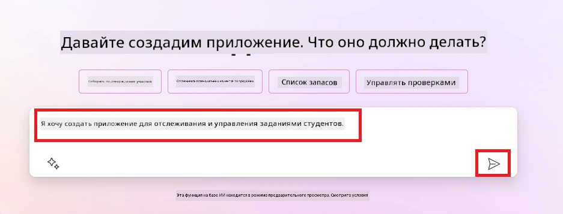

1. AI Copilot предложит таблицу Dataverse с необходимыми полями для хранения данных, которые вы хотите отслеживать, и некоторыми примерными данными. Затем вы сможете настроить таблицу под свои нужды с помощью функции помощника AI Copilot через диалоговые шаги.

   > **Важно**: Dataverse является базовой платформой данных для Power Platform. Это платформа с низким кодом для хранения данных приложения. Это полностью управляемый сервис, который безопасно хранит данные в облаке Microsoft и размещается в вашей среде Power Platform. Он обладает встроенными функциями управления данными, такими как классификация данных, прослеживаемость данных, тонкий контроль доступа и многое другое. Подробнее о Dataverse можно узнать [здесь](https://docs.microsoft.com/powerapps/maker/data-platform/data-platform-intro?WT.mc_id=academic-109639-somelezediko).

   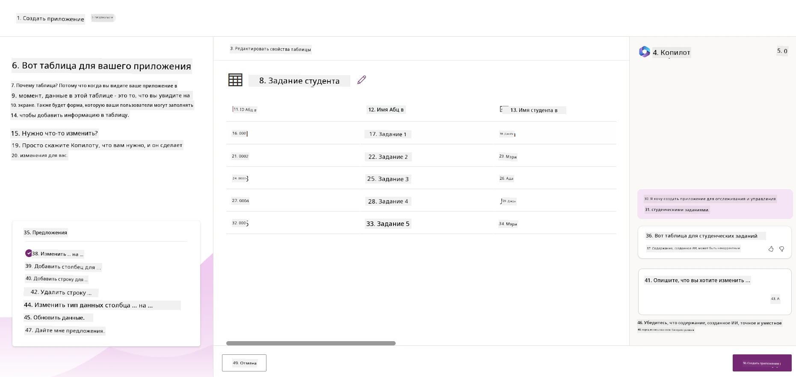

1. Педагоги хотят отправлять письма студентам, которые сдали задания, чтобы информировать их о прогрессе. Вы можете использовать Copilot, чтобы добавить новое поле в таблицу для хранения электронной почты студентов. Например, вы можете использовать следующую подсказку, чтобы добавить новое поле в таблицу: **_Я хочу добавить колонку для хранения электронной почты студентов_**. Нажмите кнопку **Отправить**, чтобы отправить запрос AI Copilot.

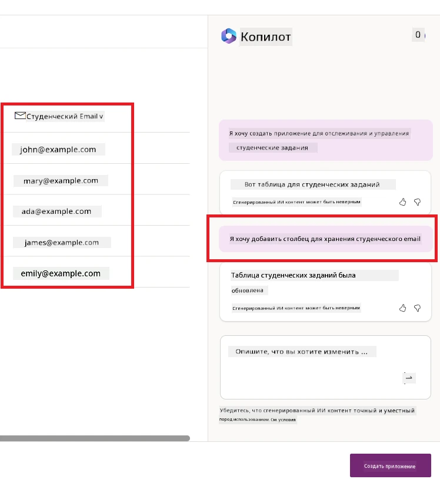

1. AI Copilot создаст новое поле, после чего вы сможете настроить его под свои нужды.

1. После того как вы закончите с таблицей, нажмите кнопку **Создать приложение**, чтобы создать приложение.

1. AI Copilot сгенерирует адаптивное Canvas-приложение на основе вашего описания. Затем вы сможете настроить приложение в соответствии с вашими потребностями.

1. Для того чтобы преподаватели могли отправлять электронные письма студентам, вы можете использовать Copilot для добавления нового экрана в приложение. Например, вы можете использовать следующий запрос для добавления нового экрана в приложение: **_Я хочу добавить экран для отправки писем студентам_**. Нажмите кнопку **Отправить**, чтобы отправить запрос AI Copilot.

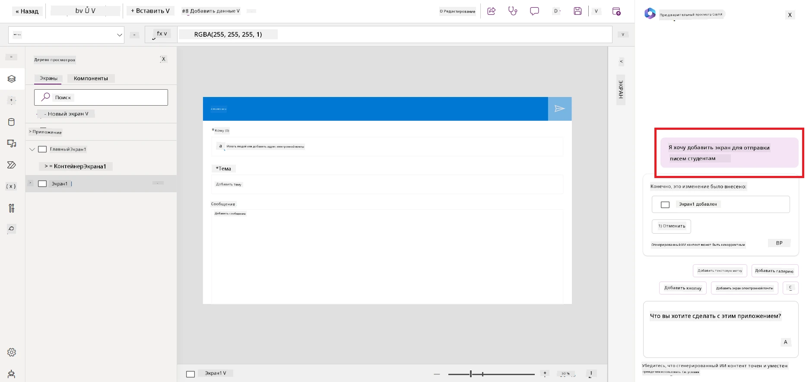

1. AI Copilot сгенерирует новый экран, и вы сможете настроить его в соответствии с вашими потребностями.

1. После того как вы закончите с приложением, нажмите кнопку **Сохранить**, чтобы сохранить приложение.

1. Чтобы поделиться приложением с преподавателями, нажмите кнопку **Поделиться**, а затем снова нажмите кнопку **Поделиться**. После этого вы можете поделиться приложением с преподавателями, введя их адреса электронной почты.

> **Ваше домашнее задание**: Только что созданное приложение — хороший старт, но его можно улучшить. С функцией электронной почты преподаватели могут отправлять письма студентам только вручную, вводя их адреса электронной почты. Можете ли вы использовать Copilot для создания автоматизации, которая позволит преподавателям автоматически отправлять письма студентам при сдаче ими заданий? Подсказка: с помощью правильного запроса вы можете использовать Copilot в Power Automate для создания этой автоматизации.

### Создание таблицы с информацией по счетам для нашего стартапа

Финансовая команда нашего стартапа испытывает трудности с отслеживанием счетов. Они использовали таблицу для учета счетов, но управление стало затруднительным из-за увеличения их количества. Они попросили вас создать таблицу, которая поможет им хранить, отслеживать и управлять информацией по полученным счетам. Эта таблица должна служить основой для автоматизации, которая будет извлекать всю информацию по счетам и сохранять её в таблице. Она также должна позволять финансовой команде просматривать оплаченные и неоплаченные счета.

Power Platform содержит базовую платформу данных под названием Dataverse, которая позволяет хранить данные для ваших приложений и решений. Dataverse предоставляет платформу данных с низким кодом для хранения данных приложений. Это полностью управляемый сервис, который надежно хранит данные в облаке Microsoft и предоставляется в вашей среде Power Platform. В Dataverse предусмотрены встроенные возможности управления данными, такие как классификация данных, прослеживаемость данных, тонкая настройка контроля доступа и многое другое. Подробнее узнать о Dataverse можно [здесь](https://docs.microsoft.com/powerapps/maker/data-platform/data-platform-intro?WT.mc_id=academic-109639-somelezediko).

Зачем использовать Dataverse для нашего стартапа? Стандартные и настраиваемые таблицы в Dataverse обеспечивают надежное облачное хранилище для ваших данных. Таблицы позволяют хранить различные типы данных, аналогично тому, как в Excel используются несколько листов в одной книге. Вы можете использовать таблицы для хранения данных, специфичных для вашей организации или бизнес-потребностей. Некоторые преимущества использования Dataverse для нашего стартапа включают, но не ограничиваются:

- **Простота управления**: и метаданные, и данные хранятся в облаке, поэтому вам не нужно беспокоиться об их хранении или управлении. Вы можете сосредоточиться на создании приложений и решений.

- **Безопасность**: Dataverse обеспечивает безопасное и облачное хранилище для ваших данных. Вы можете контролировать, кто имеет доступ к данным в ваших таблицах и как они могут получить к ним доступ с помощью основанных на ролях механизмов безопасности.

- **Богатые метаданные**: Типы данных и связи используются непосредственно в Power Apps.

- **Логика и проверка данных**: Вы можете использовать бизнес-правила, вычисляемые поля и правила проверки для реализации бизнес-логики и обеспечения точности данных.

Теперь, когда вы знаете, что такое Dataverse и зачем его использовать, давайте рассмотрим, как с помощью Copilot создать таблицу в Dataverse, которая удовлетворит требования нашей финансовой команды.

> **Примечание**: Вы будете использовать эту таблицу в следующем разделе для создания автоматизации, которая будет извлекать всю информацию по счетам и хранить её в таблице.

Чтобы создать таблицу в Dataverse с помощью Copilot, выполните следующие шаги:

1. Перейдите на домашний экран [Power Apps](https://make.powerapps.com?WT.mc_id=academic-105485-koreyst).

2. В левой навигационной панели выберите **Таблицы**, затем нажмите **Описание новой таблицы**.

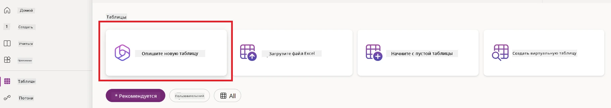

1. На экране **Описание новой таблицы** используйте текстовое поле для описания создаваемой таблицы. Например, **_Я хочу создать таблицу для хранения информации по счетам_**. Нажмите кнопку **Отправить**, чтобы отправить запрос AI Copilot.

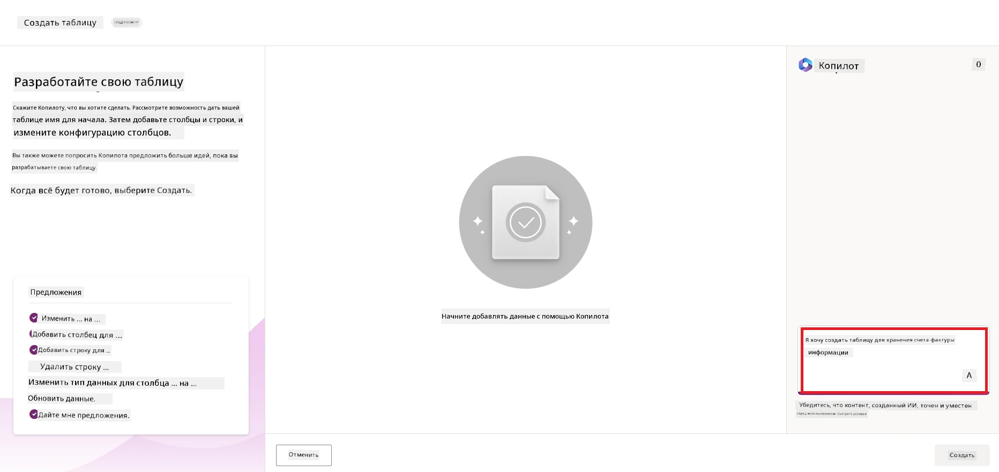

1. AI Copilot предложит таблицу Dataverse с необходимыми полями для хранения данных, которые вам нужно отслеживать, а также некоторыми образцами данных. Вы можете настроить таблицу под свои нужды, используя функцию помощника AI Copilot через пошаговое общение.

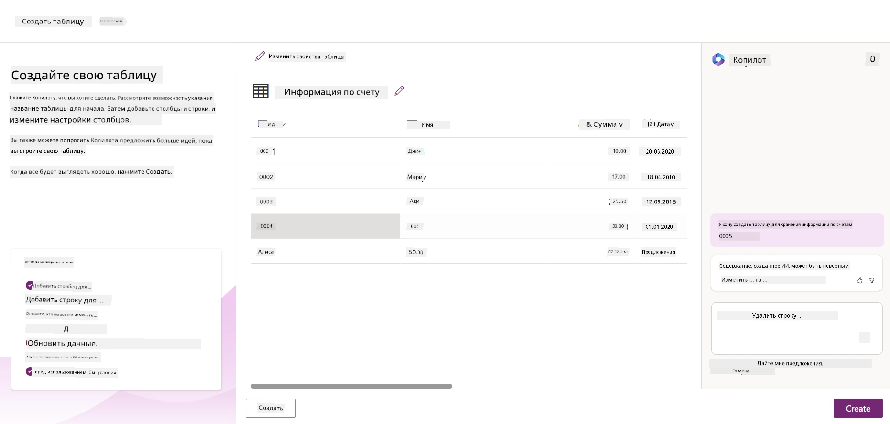

1. Финансовая команда хочет отправлять электронное письмо поставщику, чтобы информировать его о текущем статусе их счета. Вы можете использовать Copilot, чтобы добавить новое поле в таблицу для хранения электронной почты поставщика. Например, используйте следующий запрос для добавления нового поля: **_Я хочу добавить колонку для хранения электронной почты поставщика_**. Нажмите кнопку **Отправить**, чтобы отправить запрос AI Copilot.

1. AI Copilot создаст новое поле, и вы сможете настроить его под свои нужды.

1. После того как вы закончите с таблицей, нажмите кнопку **Создать**, чтобы создать таблицу.

## AI-модели в Power Platform с AI Builder

AI Builder — это возможность AI с низким кодом, доступная в Power Platform, которая позволяет использовать AI-модели для автоматизации процессов и прогнозирования результатов. С AI Builder вы можете внедрять искусственный интеллект в свои приложения и потоки, которые подключаются к данным в Dataverse или в различных облачных источниках данных, таких как SharePoint, OneDrive или Azure.

## Предварительно созданные AI-модели и пользовательские AI-модели

AI Builder предоставляет два типа AI-моделей: предварительно созданные и пользовательские. Предварительно созданные AI-модели — это готовые к использованию модели, созданные Microsoft и доступные в Power Platform. Они помогают добавить интеллект в ваши приложения и потоки без необходимости сбора данных, построения, обучения и публикации собственных моделей. С помощью таких моделей можно автоматизировать процессы и предсказывать результаты.

Некоторые из доступных предварительно созданных AI-моделей в Power Platform включают:

- **Извлечение ключевых фраз**: Эта модель извлекает ключевые фразы из текста.
- **Определение языка**: Эта модель определяет язык текста.
- **Анализ тональности**: Эта модель определяет положительную, отрицательную, нейтральную или смешанную тональность текста.
- **Распознавание визитных карточек**: Эта модель извлекает информацию из визитных карточек.
- **Распознавание текста**: Эта модель извлекает текст из изображений.
- **Обнаружение объектов**: Эта модель обнаруживает и извлекает объекты из изображений.
- **Обработка документов**: Эта модель извлекает информацию из форм.
- **Обработка счетов**: Эта модель извлекает информацию из счетов.

С пользовательскими AI-моделями вы можете загрузить свою модель в AI Builder, чтобы она работала как любая другая пользовательская модель AI Builder, позволяя обучать ее на собственных данных. Вы можете использовать эти модели для автоматизации процессов и прогнозирования результатов в Power Apps и Power Automate. При использовании собственной модели существуют ограничения. Подробнее об этих ограничениях читайте [здесь](https://learn.microsoft.com/ai-builder/byo-model#limitations?WT.mc_id=academic-105485-koreyst).

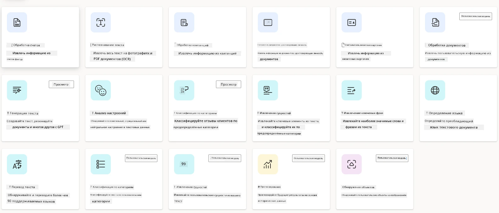

## Задание №2 — Создание потока обработки счетов для нашего стартапа

Финансовая команда испытывает трудности с обработкой счетов. Они использовали таблицу для учета счетов, но с увеличением их количества управление стало сложно. Они попросили вас создать рабочий процесс, который поможет обрабатывать счета с помощью AI. Этот поток должен позволять извлекать информацию из счетов и сохранять её в таблице Dataverse. Также поток должен позволять отправлять электронное письмо финансовой команде с извлеченной информацией.

Теперь, когда вы знаете, что такое AI Builder и зачем его использовать, давайте рассмотрим, как можно применять модель Invoice Processing AI в AI Builder, о которой мы говорили ранее, для создания рабочего процесса, который поможет финансовой команде обрабатывать счета.

Чтобы создать рабочий процесс, который поможет финансовой команде обрабатывать счета с помощью Invoice Processing AI Model в AI Builder, выполните следующие шаги:

1. Перейдите на домашний экран [Power Automate](https://make.powerautomate.com?WT.mc_id=academic-105485-koreyst).

2. Используйте текстовое поле на домашнем экране, чтобы описать рабочий процесс, который хотите создать. Например, **_Обрабатывать счет, когда он приходит на мой почтовый ящик_**. Нажмите кнопку **Отправить**, чтобы отправить запрос AI Copilot.

   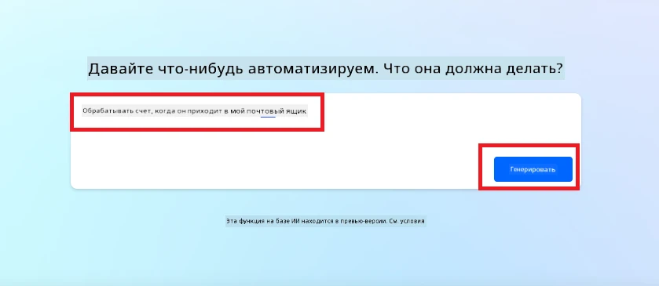

3. AI Copilot предложит действия, необходимые для выполнения задачи, которую вы хотите автоматизировать. Вы можете нажать кнопку **Далее**, чтобы перейти к следующим шагам.

4. На следующем шаге Power Automate предложит настроить соединения, необходимые для потока. После настройки нажмите кнопку **Создать поток**, чтобы создать поток.

5. AI Copilot сгенерирует поток, и вы сможете настроить его под свои потребности.

6. Обновите триггер потока, установив **Папку** в ту, где будут храниться счета. Например, можно указать папку **Входящие**. Нажмите **Показать расширенные параметры** и установите **Только с вложениями** в значение **Да**. Это гарантирует, что поток запустится только при получении письма с вложением в эту папку.

7. Удалите из потока следующие действия: **HTML в текст**, **Compose**, **Compose 2**, **Compose 3** и **Compose 4**, поскольку вы не будете их использовать.

8. Удалите действие **Условие** из потока, так как оно также не понадобится. Поток должен выглядеть примерно так, как на скриншоте:

   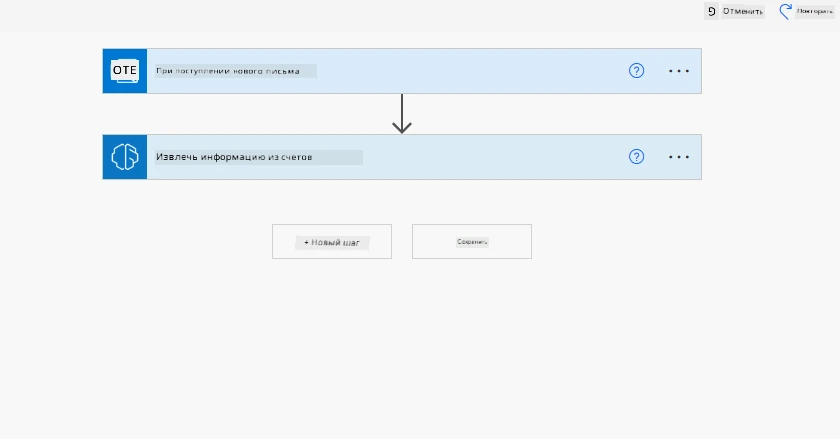

9. Нажмите кнопку **Добавить действие** и введите в поиск **Dataverse**. Выберите действие **Добавить новую строку**.

10. В действии **Извлечь информацию из счетов** обновите поле **Файл счета** так, чтобы оно ссылалось на **Содержимое вложения** из письма. Это обеспечит извлечение информации из вложения счета.

11. Выберите таблицу, созданную вами ранее. Например, вы можете выбрать таблицу **Информация по счетам**. Используйте динамический контент из предыдущего действия для заполнения следующих полей:

    - ID
    - Сумма
    - Дата
    - Наименование
    - Статус — установите **Статус** в **Ожидание**.
    - Электронная почта поставщика — используйте динамический контент **От** из триггера **Когда приходит новое письмо**.

    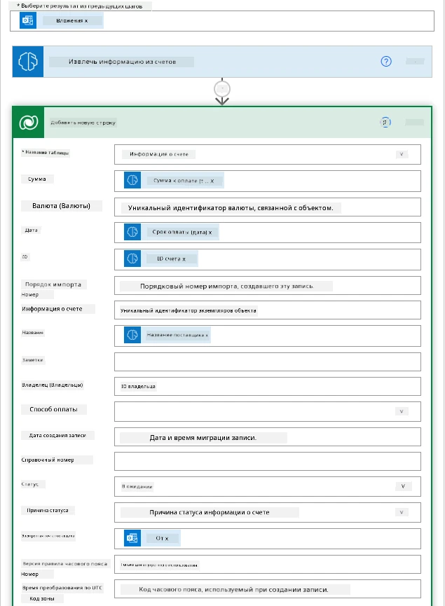

12. После завершения создания потока нажмите кнопку **Сохранить**, чтобы сохранить поток. После этого вы можете протестировать поток, отправив письмо со счетом в указанную вами папку в триггере.

> **Ваше домашнее задание**: Созданный вами поток — хороший старт, но теперь подумайте, как создать автоматизацию, позволяющую нашей финансовой команде отправлять письмо поставщику, чтобы сообщать ему текущий статус их счета. Подсказка: поток должен запускаться при изменении статуса счета.

## Использование модели генерации текста AI в Power Automate

Модель Create Text with GPT в AI Builder позволяет генерировать текст на основе запроса и работает на базе Microsoft Azure OpenAI Service. С этой возможностью вы можете внедрять технологии GPT (Generative Pre-Trained Transformer) в свои приложения и потоки для создания различных автоматизированных процессов и полезных приложений.

Модели GPT проходят оро́шенное обучение на огромных объемах данных, что позволяет им создавать текст, очень похожий на человеческий, на основе заданного запроса. При интеграции с автоматизацией рабочих процессов AI-модели, такие как GPT, можно использовать для оптимизации и автоматизации широкого спектра задач.

Например, вы можете создавать потоки для автоматической генерации текста для различных сценариев, таких как: черновики писем, описания продуктов и многое другое. Вы также можете использовать модель для создания текста для различных приложений, таких как чатботы и приложения для обслуживания клиентов, которые помогают агентам эффективно и быстро отвечать на запросы клиентов.

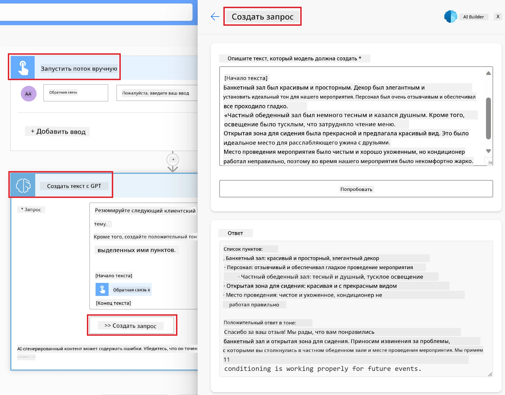

Чтобы узнать, как использовать эту модель ИИ в Power Automate, пройдите модуль [Добавьте интеллект с AI Builder и GPT](https://learn.microsoft.com/training/modules/ai-builder-text-generation/?WT.mc_id=academic-109639-somelezediko).

## Отличная работа! Продолжайте обучение

После завершения этого урока ознакомьтесь с нашей [коллекцией для обучения генеративному ИИ](https://aka.ms/genai-collection?WT.mc_id=academic-105485-koreyst), чтобы продолжить повышать свои знания в области генеративного ИИ!

Хотите настроить и получить больше от Copilot? Изучите [Awesome Copilot](https://github.com/github/awesome-copilot?WT.mc_id=academic-105485-koreyst) — коллекцию, созданную сообществом, включающую инструкции, агенты, навыки и конфигурации, которые помогут вам максимально эффективно использовать GitHub Copilot.

Перейдите к уроку 11, где мы рассмотрим, как [интегрировать генеративный ИИ с вызовом функций](../11-integrating-with-function-calling/README.md?WT.mc_id=academic-105485-koreyst)!

---

<!-- CO-OP TRANSLATOR DISCLAIMER START -->
**Отказ от ответственности**:
Этот документ был переведен с использованием сервиса машинного перевода [Co-op Translator](https://github.com/Azure/co-op-translator). Несмотря на наши усилия по обеспечению точности, имейте в виду, что автоматический перевод может содержать ошибки или неточности. Оригинальный документ на его исходном языке следует считать авторитетным источником. Для получения критически важной информации рекомендуется обратиться к профессиональному человеческому переводу. Мы не несем ответственности за любые недоразумения или неправильные толкования, возникшие в результате использования этого перевода.
<!-- CO-OP TRANSLATOR DISCLAIMER END -->