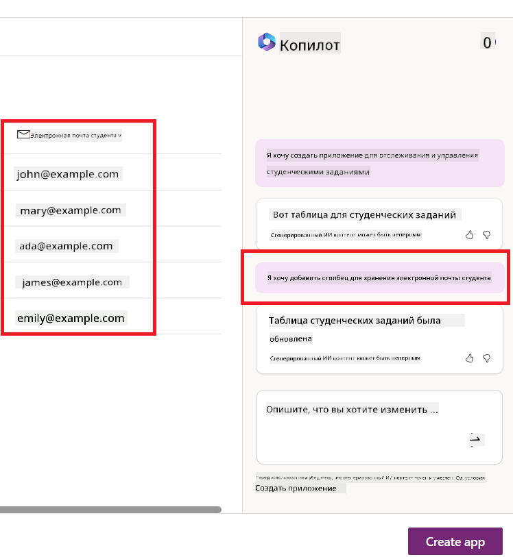

<!--
CO_OP_TRANSLATOR_METADATA:
{
  "original_hash": "f5ff3b6204a695a117d6f452403c95f7",
  "translation_date": "2025-07-09T13:40:48+00:00",
  "source_file": "10-building-low-code-ai-applications/README.md",
  "language_code": "ru"
}
-->
# Создание приложений с низким кодом и искусственным интеллектом

> _(Нажмите на изображение выше, чтобы посмотреть видео этого урока)_

## Введение

Теперь, когда мы научились создавать приложения для генерации изображений, давайте поговорим о low code. Генеративный ИИ можно использовать в самых разных областях, включая low code, но что такое low code и как добавить в него ИИ?

Создание приложений и решений стало проще как для традиционных разработчиков, так и для пользователей без опыта программирования благодаря платформам Low Code Development. Платформы Low Code позволяют создавать приложения и решения с минимальным или нулевым количеством кода. Это достигается за счёт визуальной среды разработки, где можно перетаскивать компоненты для создания приложений и решений. Это позволяет создавать приложения быстрее и с меньшими ресурсами. В этом уроке мы подробно рассмотрим, как использовать Low Code и как улучшить разработку с помощью ИИ на базе Power Platform.

Power Platform даёт организациям возможность наделить свои команды инструментами для создания собственных решений в интуитивной среде с низким или отсутствующим кодом. Эта среда упрощает процесс создания решений. С Power Platform решения можно создавать за дни или недели, а не за месяцы или годы. Power Platform включает пять ключевых продуктов: Power Apps, Power Automate, Power BI, Power Pages и Copilot Studio.

В этом уроке вы узнаете:

- Введение в генеративный ИИ в Power Platform  
- Введение в Copilot и как им пользоваться  
- Использование генеративного ИИ для создания приложений и потоков в Power Platform  
- Понимание моделей ИИ в Power Platform с помощью AI Builder  

## Цели обучения

К концу урока вы сможете:

- Понять, как работает Copilot в Power Platform.

- Создать приложение для отслеживания заданий студентов для нашего образовательного стартапа.

- Создать поток обработки счетов, который использует ИИ для извлечения информации из счетов.

- Применять лучшие практики при использовании модели Create Text с GPT.

Инструменты и технологии, которые вы будете использовать в этом уроке:

- **Power Apps** — для приложения Student Assignment Tracker, предоставляющего среду разработки с низким кодом для создания приложений по отслеживанию, управлению и взаимодействию с данными.

- **Dataverse** — для хранения данных приложения Student Assignment Tracker, предоставляющий платформу с низким кодом для хранения данных приложения.

- **Power Automate** — для потока обработки счетов, где вы будете создавать рабочие процессы для автоматизации процесса обработки счетов.

- **AI Builder** — для модели ИИ обработки счетов, где вы будете использовать готовые модели ИИ для обработки счетов нашего стартапа.

## Генеративный ИИ в Power Platform

Улучшение разработки с низким кодом и приложений с помощью генеративного ИИ — ключевое направление Power Platform. Цель — дать возможность каждому создавать приложения, сайты, панели мониторинга и автоматизировать процессы с помощью ИИ, _не требуя при этом знаний в области науки о данных_. Эта цель достигается за счёт интеграции генеративного ИИ в опыт разработки с низким кодом в Power Platform в виде Copilot и AI Builder.

### Как это работает?

Copilot — это ИИ-ассистент, который помогает создавать решения Power Platform, описывая ваши требования в серии диалоговых шагов на естественном языке. Например, вы можете указать, какие поля будет использовать ваше приложение, и Copilot создаст как само приложение, так и базовую модель данных, или вы можете описать, как настроить поток в Power Automate.

Вы можете использовать функции, управляемые Copilot, как элемент в экранах вашего приложения, чтобы пользователи могли получать инсайты через диалоговое взаимодействие.

AI Builder — это возможность с низким кодом в Power Platform, которая позволяет использовать модели ИИ для автоматизации процессов и прогнозирования результатов. С AI Builder вы можете внедрять ИИ в свои приложения и потоки, которые подключаются к данным в Dataverse или в различных облачных источниках, таких как SharePoint, OneDrive или Azure.

Copilot доступен во всех продуктах Power Platform: Power Apps, Power Automate, Power BI, Power Pages и Power Virtual Agents. AI Builder доступен в Power Apps и Power Automate. В этом уроке мы сосредоточимся на использовании Copilot и AI Builder в Power Apps и Power Automate для создания решения для нашего образовательного стартапа.

### Copilot в Power Apps

В составе Power Platform Power Apps предоставляет среду разработки с низким кодом для создания приложений по отслеживанию, управлению и взаимодействию с данными. Это набор сервисов для разработки приложений с масштабируемой платформой данных и возможностью подключения к облачным сервисам и локальным данным. Power Apps позволяет создавать приложения, которые работают в браузерах, на планшетах и телефонах, и которыми можно делиться с коллегами. Power Apps упрощает разработку приложений благодаря простому интерфейсу, чтобы любой бизнес-пользователь или профессиональный разработчик мог создавать кастомные приложения. Опыт разработки приложений также улучшается с помощью генеративного ИИ через Copilot.

Функция AI Copilot в Power Apps позволяет описать, какое приложение вам нужно и какую информацию оно должно отслеживать, собирать или отображать. Copilot затем генерирует адаптивное Canvas-приложение на основе вашего описания. Вы можете настроить приложение под свои нужды. AI Copilot также создаёт и предлагает таблицу Dataverse с необходимыми полями для хранения данных и некоторыми примерами данных. Позже в уроке мы рассмотрим, что такое Dataverse и как его использовать в Power Apps. Вы можете настроить таблицу под свои нужды с помощью AI Copilot через диалоговые шаги. Эта функция доступна прямо с главного экрана Power Apps.

### Copilot в Power Automate

В составе Power Platform Power Automate позволяет пользователям создавать автоматизированные рабочие процессы между приложениями и сервисами. Он помогает автоматизировать повторяющиеся бизнес-процессы, такие как коммуникация, сбор данных и утверждение решений. Простой интерфейс позволяет пользователям с любым уровнем технической подготовки (от новичков до опытных разработчиков) автоматизировать рабочие задачи. Опыт создания рабочих процессов также улучшается с помощью генеративного ИИ через Copilot.

Функция AI Copilot в Power Automate позволяет описать, какой поток вам нужен и какие действия он должен выполнять. Copilot затем генерирует поток на основе вашего описания. Вы можете настроить поток под свои нужды. AI Copilot также создаёт и предлагает действия, необходимые для выполнения задачи, которую вы хотите автоматизировать. Позже в уроке мы рассмотрим, что такое потоки и как их использовать в Power Automate. Вы можете настроить действия под свои нужды с помощью AI Copilot через диалоговые шаги. Эта функция доступна прямо с главного экрана Power Automate.

## Задание: Управление заданиями студентов и счетами для нашего стартапа с помощью Copilot

Наш стартап предоставляет онлайн-курсы студентам. Стартап быстро растёт и теперь испытывает трудности с удовлетворением спроса на курсы. Стартап нанял вас как разработчика Power Platform, чтобы помочь создать решение с низким кодом для управления заданиями студентов и счетами. Решение должно помочь отслеживать и управлять заданиями студентов через приложение и автоматизировать процесс обработки счетов через рабочий процесс. Вас попросили использовать генеративный ИИ для разработки решения.

При начале работы с Copilot вы можете использовать [Power Platform Copilot Prompt Library](https://github.com/pnp/powerplatform-prompts?WT.mc_id=academic-109639-somelezediko) для поиска подходящих подсказок. Эта библиотека содержит список подсказок, которые можно использовать для создания приложений и потоков с Copilot. Вы также можете использовать подсказки из библиотеки, чтобы понять, как описывать свои требования Copilot.

### Создание приложения для отслеживания заданий студентов для нашего стартапа

Преподаватели нашего стартапа испытывают трудности с отслеживанием заданий студентов. Они использовали таблицу для отслеживания заданий, но с ростом числа студентов это стало сложно. Они попросили вас создать приложение, которое поможет им отслеживать и управлять заданиями. Приложение должно позволять добавлять новые задания, просматривать, обновлять и удалять их. Также приложение должно позволять преподавателям и студентам видеть, какие задания оценены, а какие — нет.

Вы создадите приложение с помощью Copilot в Power Apps, следуя этим шагам:

1. Перейдите на [главный экран Power Apps](https://make.powerapps.com?WT.mc_id=academic-105485-koreyst).

2. Используйте текстовое поле на главном экране, чтобы описать приложение, которое хотите создать. Например, **_Я хочу создать приложение для отслеживания и управления заданиями студентов_**. Нажмите кнопку **Send**, чтобы отправить запрос AI Copilot.

3. AI Copilot предложит таблицу Dataverse с полями, необходимыми для хранения данных, которые вы хотите отслеживать, и некоторыми примерами данных. Вы сможете настроить таблицу под свои нужды с помощью AI Copilot через диалоговые шаги.

   > **Важно**: Dataverse — это базовая платформа данных для Power Platform. Это платформа с низким кодом для хранения данных приложения. Это полностью управляемый сервис, который безопасно хранит данные в облаке Microsoft и предоставляется в вашей среде Power Platform. В Dataverse встроены возможности управления данными, такие как классификация данных, отслеживание происхождения данных, тонкая настройка доступа и многое другое. Подробнее о Dataverse можно узнать [здесь](https://docs.microsoft.com/powerapps/maker/data-platform/data-platform-intro?WT.mc_id=academic-109639-somelezediko).

   

4. Преподаватели хотят отправлять письма студентам, которые сдали задания, чтобы информировать их о ходе выполнения. Вы можете использовать Copilot, чтобы добавить новое поле в таблицу для хранения электронной почты студента. Например, используйте подсказку: **_Я хочу добавить столбец для хранения электронной почты студента_**. Нажмите кнопку **Send**, чтобы отправить запрос AI Copilot.

5. AI Copilot создаст новое поле, которое вы сможете настроить под свои нужды.

6. Когда таблица будет готова, нажмите кнопку **Create app**, чтобы создать приложение.

7. AI Copilot сгенерирует адаптивное Canvas-приложение на основе вашего описания. Вы сможете настроить приложение под свои нужды.

8. Чтобы преподаватели могли отправлять письма студентам, вы можете использовать Copilot для добавления нового экрана в приложение. Например, используйте подсказку: **_Я хочу добавить экран для отправки писем студентам_**. Нажмите кнопку **Send**, чтобы отправить запрос AI Copilot.

9. AI Copilot создаст новый экран, который вы сможете настроить под свои нужды.

10. Когда приложение будет готово, нажмите кнопку **Save**, чтобы сохранить его.

11. Чтобы поделиться приложением с преподавателями, нажмите кнопку **Share**, затем снова кнопку **Share**. Вы сможете отправить приложение преподавателям, указав их адреса электронной почты.

> **Ваше домашнее задание**: Созданное вами приложение — хороший старт, но его можно улучшить. С функцией отправки писем преподаватели могут отправлять письма студентам только вручную, вводя их адреса. Можете ли вы использовать Copilot для создания автоматизации, которая позволит преподавателям автоматически отправлять письма студентам при сдаче заданий? Подсказка: с правильной подсказкой вы можете использовать Copilot в Power Automate для создания этого.

### Создание таблицы информации по счетам для нашего стартапа

Финансовая команда нашего стартапа испытывает трудности с отслеживанием счетов. Они использовали таблицу для учёта счетов, но с ростом их количества это стало сложно. Они попросили вас создать таблицу, которая поможет хранить, отслеживать и управлять информацией по полученным счетам. Таблица будет использоваться для создания автоматизации, которая извлечёт всю информацию из счетов и сохранит её в таблице. Таблица также должна позволять финансовой команде видеть, какие счета оплачены, а какие — нет.

Power Platform имеет базовую платформу данных под названием Dataverse, которая позволяет хранить данные для ваших приложений и решений. Dataverse предоставляет платформу с низким кодом для хранения данных приложения. Это полностью управляемый сервис, который безопасно хранит данные в облаке Microsoft и предоставляется в вашей среде Power Platform. В Dataverse встроены возможности управления данными, такие как классификация данных, отслеживание происхождения данных, тонкая настройка доступа и многое другое. Подробнее о Dataverse можно узнать [здесь](https://docs.microsoft.com/powerapps/maker/data-platform/data-platform-intro?WT.mc_id=academic-109639-somelezediko).

Почему стоит использовать Dataverse для нашего стартапа? Стандартные и пользовательские таблицы в Dataverse обеспечивают безопасное и облачное хранение данных. Таблицы позволяют хранить разные типы данных, подобно тому, как в Excel можно использовать несколько листов в одной книге. Вы можете использовать таблицы для хранения данных, специфичных для вашей организации или бизнеса. Некоторые преимущества, которые наш стартап получит от использования Dataverse, включают, но не ограничиваются:
- **Легко управлять**: Метаданные и данные хранятся в облаке, поэтому вам не нужно беспокоиться о том, как именно они сохраняются или управляются. Вы можете сосредоточиться на создании своих приложений и решений.

- **Безопасно**: Dataverse предоставляет безопасное облачное хранилище для ваших данных. Вы можете контролировать, кто имеет доступ к данным в ваших таблицах и каким образом, используя ролевую модель безопасности.

- **Богатые метаданные**: Типы данных и связи используются напрямую в Power Apps.

- **Логика и валидация**: Вы можете использовать бизнес-правила, вычисляемые поля и правила валидации для реализации бизнес-логики и поддержания точности данных.

Теперь, когда вы знаете, что такое Dataverse и почему его стоит использовать, давайте посмотрим, как с помощью Copilot создать таблицу в Dataverse, которая будет соответствовать требованиям нашей финансовой команды.

> **Note** : Вы будете использовать эту таблицу в следующем разделе для создания автоматизации, которая извлечет всю информацию по счетам и сохранит её в таблице.

Чтобы создать таблицу в Dataverse с помощью Copilot, выполните следующие шаги:

1. Перейдите на главный экран [Power Apps](https://make.powerapps.com?WT.mc_id=academic-105485-koreyst).

2. В левой навигационной панели выберите **Tables**, затем нажмите **Describe the new Table**.

3. На экране **Describe the new Table** в текстовом поле опишите таблицу, которую хотите создать. Например, **_Я хочу создать таблицу для хранения информации по счетам_**. Нажмите кнопку **Send**, чтобы отправить запрос AI Copilot.

4. AI Copilot предложит таблицу Dataverse с необходимыми полями для хранения нужных данных и некоторыми примерами данных. Затем вы сможете настроить таблицу под свои нужды, используя функцию помощника AI Copilot через диалоговые шаги.

5. Финансовая команда хочет отправлять поставщику электронное письмо с обновлением текущего статуса их счета. Вы можете использовать Copilot, чтобы добавить новое поле в таблицу для хранения email поставщика. Например, используйте следующий запрос: **_Я хочу добавить столбец для хранения email поставщика_**. Нажмите **Send**, чтобы отправить запрос AI Copilot.

6. AI Copilot создаст новое поле, которое вы сможете настроить под свои нужды.

7. Когда таблица будет готова, нажмите кнопку **Create**, чтобы создать таблицу.

## AI-модели в Power Platform с AI Builder

AI Builder — это low-code AI-инструмент в Power Platform, который позволяет использовать AI-модели для автоматизации процессов и прогнозирования результатов. С помощью AI Builder вы можете внедрять искусственный интеллект в свои приложения и потоки, которые работают с данными из Dataverse или различных облачных источников, таких как SharePoint, OneDrive или Azure.

## Готовые AI-модели и пользовательские AI-модели

AI Builder предлагает два типа AI-моделей: готовые (Prebuilt) и пользовательские (Custom). Готовые AI-модели — это обученные Microsoft модели, доступные в Power Platform. Они помогают добавить интеллект в ваши приложения и потоки без необходимости собирать данные, создавать, обучать и публиковать собственные модели. Эти модели можно использовать для автоматизации процессов и прогнозирования результатов.

Некоторые из готовых AI-моделей, доступных в Power Platform:

- **Key Phrase Extraction**: извлечение ключевых фраз из текста.
- **Language Detection**: определение языка текста.
- **Sentiment Analysis**: определение позитивной, негативной, нейтральной или смешанной тональности текста.
- **Business Card Reader**: извлечение информации с визитных карточек.
- **Text Recognition**: распознавание текста на изображениях.
- **Object Detection**: обнаружение и извлечение объектов на изображениях.
- **Document processing**: извлечение информации из форм.
- **Invoice Processing**: извлечение информации из счетов.

С пользовательскими AI-моделями вы можете загрузить свою модель в AI Builder, чтобы она функционировала как любая другая пользовательская модель AI Builder, позволяя обучать модель на ваших данных. Эти модели можно использовать для автоматизации процессов и прогнозирования как в Power Apps, так и в Power Automate. При использовании собственной модели существуют определённые ограничения. Подробнее о них читайте в разделе [limitations](https://learn.microsoft.com/ai-builder/byo-model#limitations?WT.mc_id=academic-105485-koreyst).

## Задание №2 — Создать поток обработки счетов для нашего стартапа

Финансовая команда испытывает трудности с обработкой счетов. Они использовали таблицу для отслеживания счетов, но с ростом их количества управление стало сложным. Они попросили вас создать рабочий процесс, который поможет им обрабатывать счета с помощью AI. Поток должен извлекать информацию из счетов и сохранять её в таблице Dataverse. Также поток должен позволять отправлять электронное письмо финансовой команде с извлечённой информацией.

Теперь, когда вы знаете, что такое AI Builder и зачем его использовать, давайте рассмотрим, как применить AI-модель Invoice Processing из AI Builder, чтобы создать поток, который поможет финансовой команде обрабатывать счета.

Чтобы создать поток, который поможет финансовой команде обрабатывать счета с помощью AI-модели Invoice Processing в AI Builder, выполните следующие шаги:

1. Перейдите на главный экран [Power Automate](https://make.powerautomate.com?WT.mc_id=academic-105485-koreyst).

2. В текстовом поле на главном экране опишите поток, который хотите создать. Например, **_Обрабатывать счет, когда он приходит на мой почтовый ящик_**. Нажмите кнопку **Send**, чтобы отправить запрос AI Copilot.

   

3. AI Copilot предложит действия, необходимые для автоматизации задачи. Нажмите кнопку **Next**, чтобы перейти к следующим шагам.

4. На следующем шаге Power Automate предложит настроить подключения, необходимые для потока. После настройки нажмите кнопку **Create flow**, чтобы создать поток.

5. AI Copilot сгенерирует поток, который вы сможете настроить под свои нужды.

6. Обновите триггер потока, установив **Folder** в папку, где будут храниться счета. Например, можно выбрать папку **Inbox**. Нажмите **Show advanced options** и установите **Only with Attachments** в значение **Yes**. Это гарантирует, что поток будет запускаться только при получении письма с вложением в указанной папке.

7. Удалите из потока следующие действия: **HTML to text**, **Compose**, **Compose 2**, **Compose 3** и **Compose 4**, так как они не понадобятся.

8. Удалите действие **Condition**, так как оно не будет использоваться. Поток должен выглядеть примерно так, как на скриншоте:

   

9. Нажмите кнопку **Add an action** и найдите **Dataverse**. Выберите действие **Add a new row**.

10. В действии **Extract Information from invoices** обновите поле **Invoice File**, указав **Attachment Content** из письма. Это обеспечит извлечение информации из вложения счета.

11. Выберите таблицу, созданную ранее. Например, таблицу **Invoice Information**. Используйте динамический контент из предыдущего действия для заполнения следующих полей:

    - ID
    - Amount
    - Date
    - Name
    - Status — установите **Status** в значение **Pending**.
    - Supplier Email — используйте динамический контент **From** из триггера **When a new email arrives**.

    

12. Когда поток будет готов, нажмите кнопку **Save** для сохранения. Затем вы можете протестировать поток, отправив письмо со счетом в указанную папку.

> **Ваше домашнее задание**: Поток, который вы только что создали, — хороший старт. Теперь подумайте, как можно построить автоматизацию, которая позволит нашей финансовой команде отправлять поставщику письмо с обновлением текущего статуса их счета. Подсказка: поток должен запускаться при изменении статуса счета.

## Использование AI-модели генерации текста в Power Automate

AI-модель Create Text with GPT в AI Builder позволяет генерировать текст на основе запроса и работает на базе Microsoft Azure OpenAI Service. С помощью этой возможности вы можете интегрировать технологию GPT (Generative Pre-Trained Transformer) в свои приложения и потоки, создавая разнообразные автоматизированные процессы и полезные приложения.

Модели GPT проходят обширное обучение на больших объемах данных, что позволяет им создавать текст, очень похожий на человеческий, при получении запроса. В сочетании с автоматизацией рабочих процессов AI-модели, такие как GPT, можно использовать для упрощения и автоматизации множества задач.

Например, вы можете создавать потоки для автоматической генерации текста для различных целей: черновики писем, описания продуктов и многое другое. Также модель можно использовать для создания текста в различных приложениях, таких как чат-боты и сервисы поддержки клиентов, которые помогают операторам эффективно и быстро отвечать на запросы пользователей.

Чтобы узнать, как использовать эту AI-модель в Power Automate, пройдите модуль [Add intelligence with AI Builder and GPT](https://learn.microsoft.com/training/modules/ai-builder-text-generation/?WT.mc_id=academic-109639-somelezediko).

## Отличная работа! Продолжайте обучение

После завершения этого урока ознакомьтесь с нашей коллекцией [Generative AI Learning collection](https://aka.ms/genai-collection?WT.mc_id=academic-105485-koreyst), чтобы продолжить развивать свои знания в области генеративного ИИ!

Перейдите к уроку 11, где мы рассмотрим, как [интегрировать генеративный ИИ с Function Calling](../11-integrating-with-function-calling/README.md?WT.mc_id=academic-105485-koreyst)!

**Отказ от ответственности**:  
Этот документ был переведен с помощью сервиса автоматического перевода [Co-op Translator](https://github.com/Azure/co-op-translator). Несмотря на наши усилия по обеспечению точности, просим учитывать, что автоматический перевод может содержать ошибки или неточности. Оригинальный документ на его исходном языке следует считать авторитетным источником. Для получения критически важной информации рекомендуется обращаться к профессиональному переводу, выполненному человеком. Мы не несем ответственности за любые недоразумения или неправильные толкования, возникшие в результате использования данного перевода.