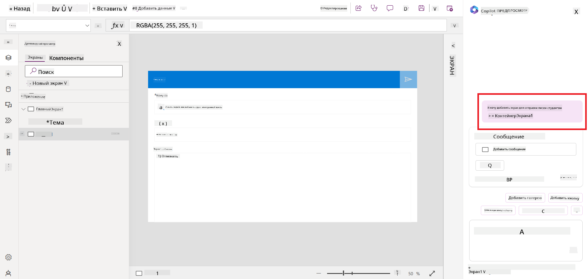
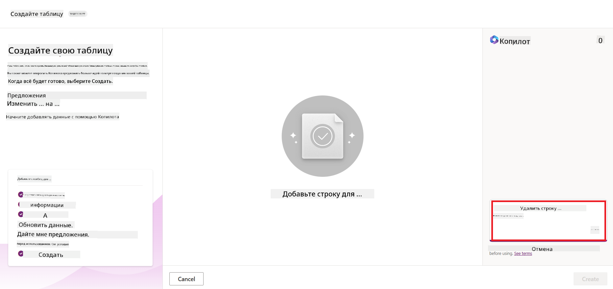
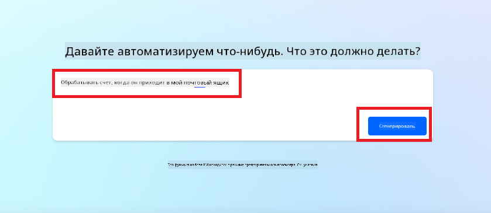
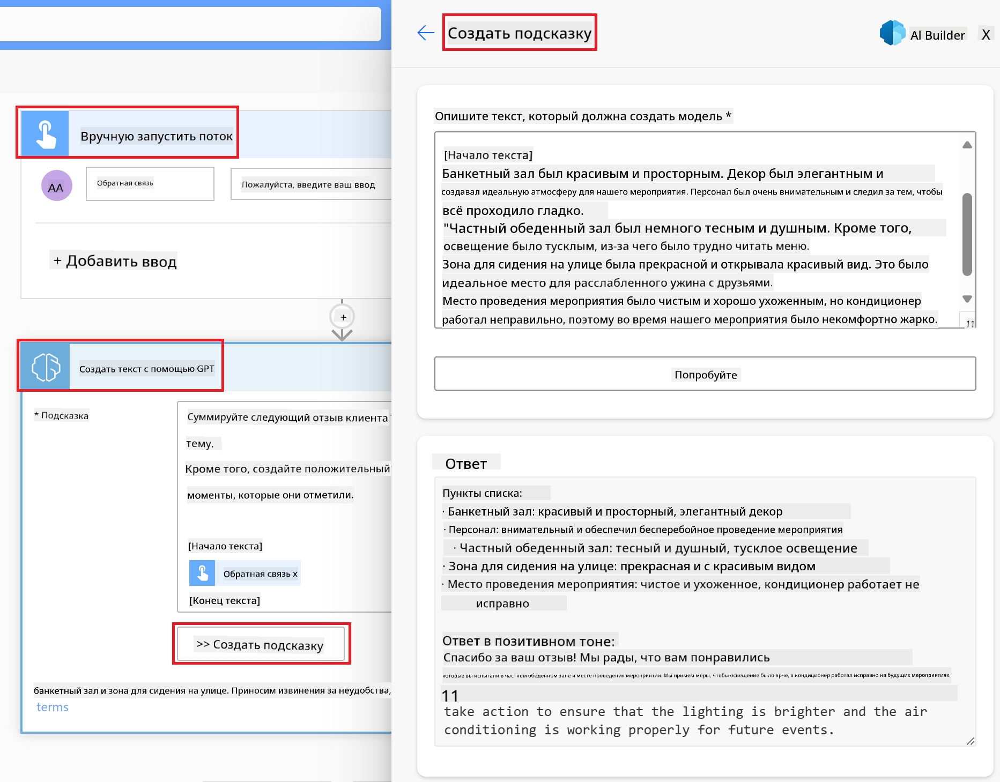

<!--
CO_OP_TRANSLATOR_METADATA:
{
  "original_hash": "846ac8e3b7dcfb697d3309fec05f0fea",
  "translation_date": "2025-10-17T15:05:36+00:00",
  "source_file": "10-building-low-code-ai-applications/README.md",
  "language_code": "ru"
}
-->
# Создание приложений с использованием низкого кода и искусственного интеллекта

> _(Нажмите на изображение выше, чтобы посмотреть видео урока)_

## Введение

Теперь, когда мы научились создавать приложения для генерации изображений, давайте поговорим о низком коде. Генеративный ИИ может использоваться в различных областях, включая низкий код, но что такое низкий код и как можно добавить ИИ в этот процесс?

Создание приложений и решений стало проще для традиционных разработчиков и людей без технического опыта благодаря платформам разработки с низким кодом. Эти платформы позволяют создавать приложения и решения с минимальным количеством кода или вовсе без него. Это достигается за счет предоставления визуальной среды разработки, где можно перетаскивать компоненты для создания приложений и решений. Это позволяет создавать приложения быстрее и с меньшими затратами. В этом уроке мы подробно рассмотрим, как использовать низкий код и как улучшить разработку с низким кодом с помощью ИИ, используя Power Platform.

Power Platform предоставляет организациям возможность дать своим командам инструменты для создания собственных решений через интуитивно понятную среду с низким или без кода. Эта среда упрощает процесс создания решений. С помощью Power Platform решения можно создавать за дни или недели, а не за месяцы или годы. Power Platform включает пять ключевых продуктов: Power Apps, Power Automate, Power BI, Power Pages и Copilot Studio.

Этот урок охватывает:

- Введение в генеративный ИИ в Power Platform
- Введение в Copilot и его использование
- Использование генеративного ИИ для создания приложений и потоков в Power Platform
- Понимание моделей ИИ в Power Platform с помощью AI Builder

## Цели обучения

К концу этого урока вы сможете:

- Понять, как работает Copilot в Power Platform.

- Создать приложение для отслеживания заданий студентов для нашего образовательного стартапа.

- Создать поток обработки счетов, который использует ИИ для извлечения информации из счетов.

- Применять лучшие практики при использовании модели Create Text с GPT AI.

Инструменты и технологии, которые вы будете использовать в этом уроке:

- **Power Apps** — для приложения Student Assignment Tracker, которое предоставляет среду разработки с низким кодом для создания приложений для отслеживания, управления и взаимодействия с данными.

- **Dataverse** — для хранения данных приложения Student Assignment Tracker, где Dataverse предоставляет платформу данных с низким кодом для хранения данных приложения.

- **Power Automate** — для потока обработки счетов, где вы будете использовать среду разработки с низким кодом для создания рабочих процессов для автоматизации процесса обработки счетов.

- **AI Builder** — для модели ИИ обработки счетов, где вы будете использовать готовые модели ИИ для обработки счетов нашего стартапа.

## Генеративный ИИ в Power Platform

Улучшение разработки и приложений с низким кодом с помощью генеративного ИИ является ключевой областью фокуса Power Platform. Цель — дать возможность каждому создавать приложения, сайты, панели управления и автоматизировать процессы с использованием ИИ, _без необходимости в знаниях в области науки о данных_. Эта цель достигается путем интеграции генеративного ИИ в процесс разработки с низким кодом в Power Platform в виде Copilot и AI Builder.

### Как это работает?

Copilot — это ИИ-ассистент, который позволяет создавать решения в Power Platform, описывая ваши требования в серии шагов на естественном языке. Например, вы можете указать вашему ИИ-ассистенту, какие поля будет использовать ваше приложение, и он создаст как само приложение, так и базовую модель данных, или вы можете указать, как настроить поток в Power Automate.

Функции, управляемые Copilot, можно использовать как функцию в экранах вашего приложения, чтобы пользователи могли получать инсайты через разговорные взаимодействия.

AI Builder — это возможность ИИ с низким кодом, доступная в Power Platform, которая позволяет использовать модели ИИ для автоматизации процессов и прогнозирования результатов. С помощью AI Builder вы можете добавить ИИ в свои приложения и потоки, которые подключаются к вашим данным в Dataverse или в различных облачных источниках данных, таких как SharePoint, OneDrive или Azure.

Copilot доступен во всех продуктах Power Platform: Power Apps, Power Automate, Power BI, Power Pages и Power Virtual Agents. AI Builder доступен в Power Apps и Power Automate. В этом уроке мы сосредоточимся на том, как использовать Copilot и AI Builder в Power Apps и Power Automate для создания решения для нашего образовательного стартапа.

### Copilot в Power Apps

В рамках Power Platform Power Apps предоставляет среду разработки с низким кодом для создания приложений для отслеживания, управления и взаимодействия с данными. Это набор сервисов для разработки приложений с масштабируемой платформой данных и возможностью подключения к облачным сервисам и локальным данным. Power Apps позволяет создавать приложения, которые работают в браузерах, на планшетах и телефонах, и могут быть поделены с коллегами. Power Apps упрощает процесс разработки приложений благодаря простому интерфейсу, чтобы каждый пользователь бизнеса или профессиональный разработчик мог создавать пользовательские приложения. Процесс разработки приложений также улучшен с помощью генеративного ИИ через Copilot.

Функция Copilot в Power Apps позволяет описать, какое приложение вам нужно и какую информацию оно должно отслеживать, собирать или показывать. Copilot затем создает адаптивное приложение Canvas на основе вашего описания. Вы можете настроить приложение под свои нужды. Copilot также предлагает таблицу Dataverse с необходимыми полями для хранения данных, которые вы хотите отслеживать, и некоторыми примерами данных. Мы рассмотрим, что такое Dataverse и как его можно использовать в Power Apps позже в этом уроке. Вы можете настроить таблицу под свои нужды, используя функцию Copilot через разговорные шаги. Эта функция доступна прямо с домашнего экрана Power Apps.

### Copilot в Power Automate

В рамках Power Platform Power Automate позволяет пользователям создавать автоматизированные рабочие процессы между приложениями и сервисами. Это помогает автоматизировать повторяющиеся бизнес-процессы, такие как коммуникация, сбор данных и утверждение решений. Его простой интерфейс позволяет пользователям с любым уровнем технической подготовки (от новичков до опытных разработчиков) автоматизировать рабочие задачи. Процесс разработки рабочих процессов также улучшен с помощью генеративного ИИ через Copilot.

Функция Copilot в Power Automate позволяет описать, какой поток вам нужен и какие действия он должен выполнять. Copilot затем создает поток на основе вашего описания. Вы можете настроить поток под свои нужды. Copilot также предлагает действия, которые необходимы для выполнения задачи, которую вы хотите автоматизировать. Мы рассмотрим, что такое потоки и как их можно использовать в Power Automate позже в этом уроке. Вы можете настроить действия под свои нужды, используя функцию Copilot через разговорные шаги. Эта функция доступна прямо с домашнего экрана Power Automate.

## Задание: Управление заданиями студентов и счетами для нашего стартапа с помощью Copilot

Наш стартап предоставляет онлайн-курсы для студентов. Стартап быстро вырос и теперь испытывает трудности с удовлетворением спроса на свои курсы. Стартап нанял вас как разработчика Power Platform, чтобы помочь им создать решение с низким кодом для управления заданиями студентов и счетами. Решение должно позволять отслеживать и управлять заданиями студентов через приложение и автоматизировать процесс обработки счетов через рабочий процесс. Вас попросили использовать генеративный ИИ для разработки решения.

Когда вы начинаете работать с Copilot, вы можете использовать [Power Platform Copilot Prompt Library](https://github.com/pnp/powerplatform-prompts?WT.mc_id=academic-109639-somelezediko), чтобы начать работу с подсказками. Эта библиотека содержит список подсказок, которые можно использовать для создания приложений и потоков с помощью Copilot. Вы также можете использовать подсказки из библиотеки, чтобы понять, как описывать свои требования для Copilot.

### Создание приложения для отслеживания заданий студентов для нашего стартапа

Преподаватели нашего стартапа испытывают трудности с отслеживанием заданий студентов. Они использовали таблицу для отслеживания заданий, но это стало сложно управлять, так как количество студентов увеличилось. Они попросили вас создать приложение, которое поможет им отслеживать и управлять заданиями студентов. Приложение должно позволять добавлять новые задания, просматривать задания, обновлять задания и удалять задания. Приложение также должно позволять преподавателям и студентам просматривать задания, которые были оценены, и те, которые еще не были оценены.

Вы создадите приложение с помощью Copilot в Power Apps, следуя шагам ниже:

1. Перейдите на [домашний экран Power Apps](https://make.powerapps.com?WT.mc_id=academic-105485-koreyst).

1. Используйте текстовое поле на домашнем экране, чтобы описать приложение, которое вы хотите создать. Например, **_Я хочу создать приложение для отслеживания и управления заданиями студентов_**. Нажмите кнопку **Отправить**, чтобы отправить запрос в Copilot.

1. Copilot предложит таблицу Dataverse с необходимыми полями для хранения данных, которые вы хотите отслеживать, и некоторыми примерами данных. Вы можете настроить таблицу под свои нужды, используя функцию Copilot через разговорные шаги.

   > **Важно**: Dataverse — это базовая платформа данных для Power Platform. Это платформа данных с низким кодом для хранения данных приложения. Это полностью управляемый сервис, который безопасно хранит данные в облаке Microsoft и предоставляется в вашей среде Power Platform. Он включает встроенные возможности управления данными, такие как классификация данных, происхождение данных, тонкая настройка доступа и многое другое. Подробнее о Dataverse можно узнать [здесь](https://docs.microsoft.com/powerapps/maker/data-platform/data-platform-intro?WT.mc_id=academic-109639-somelezediko).

   

1. Преподаватели хотят отправлять электронные письма студентам, которые сдали свои задания, чтобы держать их в курсе прогресса. Вы можете использовать Copilot, чтобы добавить новое поле в таблицу для хранения электронной почты студента. Например, вы можете использовать следующий запрос, чтобы добавить новое поле в таблицу: **_Я хочу добавить столбец для хранения электронной почты студента_**. Нажмите кнопку **Отправить**, чтобы отправить запрос в Copilot.

1. Copilot создаст новое поле, и вы сможете настроить его под свои нужды.

1. После завершения работы с таблицей нажмите кнопку **Создать приложение**, чтобы создать приложение.

1. Copilot создаст адаптивное приложение Canvas на основе вашего описания. Вы можете настроить приложение под свои нужды.

1. Чтобы преподаватели могли отправлять электронные письма студентам, вы можете использовать Copilot, чтобы добавить новый экран в приложение. Например, вы можете использовать следующий запрос, чтобы добавить новый экран в приложение: **_Я хочу добавить экран для отправки электронных писем студентам_**. Нажмите кнопку **Отправить**, чтобы отправить запрос в Copilot.

1. Copilot создаст новый экран, и вы сможете настроить его под свои нужды.

1. После завершения работы с приложением нажмите кнопку **Сохранить**, чтобы сохранить приложение.

1. Чтобы поделиться приложением с преподавателями, нажмите кнопку **Поделиться**, а затем снова нажмите кнопку **Поделиться**. Вы можете поделиться приложением с преподавателями, введя их адреса электронной почты.

> **Ваше домашнее задание**: Приложение, которое вы только что создали, — это хороший старт, но его можно улучшить. С функцией электронной почты преподаватели могут отправлять письма студентам только вручную, вводя их адреса. Можете ли вы использовать Copilot, чтобы создать автоматизацию, которая позволит преподавателям автоматически отправлять письма студентам, когда они сдают свои задания? Ваш подсказка: с правильным запросом вы можете использовать Copilot в Power Automate для создания этого.

### Создание таблицы информации о счетах для нашего стартапа

Финансовая команда нашего стартапа испытывает трудности с отслеживанием счетов. Они использовали таблицу для отслеживания счетов, но это стало сложно управлять, так как количество счетов увеличилось. Они попросили вас создать таблицу, которая поможет им хранить, отслеживать и управлять информацией о полученных счетах. Таблица должна использоваться для создания автоматизации, которая будет извлекать всю информацию о счетах и сохранять ее в таблице. Таблица также должна позволять финансовой команде просматривать счета, которые были оплачены, и те, которые еще не были оплачены.

Power Platform имеет базовую платформу данных под названием Dataverse, которая позволяет хранить данные для ваших приложений и решений. Dataverse предоставляет платформу данных с низким кодом для хранения данных приложения. Это полностью управляемый сервис, который безопасно хранит данные в облаке Microsoft и предоставляется в вашей среде Power Platform. Он включает встроенные возможности управления данными, такие как классификация данных, происхождение данных, тонкая настройка доступа и многое другое. Подробнее [о Dataverse можно узнать здесь](https://docs.microsoft.com/powerapps/maker/data-platform/data-platform-intro?WT.mc_id=academic-109639-somelezediko).
Почему стоит использовать Dataverse для нашего стартапа? Стандартные и пользовательские таблицы в Dataverse предоставляют безопасный и облачный вариант хранения данных. Таблицы позволяют хранить различные типы данных, аналогично тому, как вы могли бы использовать несколько листов в одной книге Excel. Вы можете использовать таблицы для хранения данных, которые специфичны для вашей организации или бизнес-потребностей. Некоторые преимущества, которые наш стартап получит от использования Dataverse, включают, но не ограничиваются:

- **Простота управления**: Метаданные и данные хранятся в облаке, поэтому вам не нужно беспокоиться о деталях их хранения или управления. Вы можете сосредоточиться на создании приложений и решений.

- **Безопасность**: Dataverse предоставляет безопасный и облачный вариант хранения данных. Вы можете контролировать, кто имеет доступ к данным в ваших таблицах и как они могут их использовать, используя ролевую безопасность.

- **Богатые метаданные**: Типы данных и отношения используются непосредственно в Power Apps.

- **Логика и проверка**: Вы можете использовать бизнес-правила, вычисляемые поля и правила проверки для обеспечения бизнес-логики и поддержания точности данных.

Теперь, когда вы знаете, что такое Dataverse и почему его стоит использовать, давайте рассмотрим, как можно использовать Copilot для создания таблицы в Dataverse, чтобы удовлетворить требования нашей финансовой команды.

> **Note** : Вы будете использовать эту таблицу в следующем разделе для создания автоматизации, которая будет извлекать всю информацию о счетах и сохранять ее в таблице.

Чтобы создать таблицу в Dataverse с помощью Copilot, выполните следующие шаги:

1. Перейдите на [главный экран Power Apps](https://make.powerapps.com?WT.mc_id=academic-105485-koreyst).

2. В левой панели навигации выберите **Tables**, а затем нажмите **Describe the new Table**.

3. На экране **Describe the new Table** используйте текстовое поле, чтобы описать таблицу, которую вы хотите создать. Например, **_Я хочу создать таблицу для хранения информации о счетах_**. Нажмите кнопку **Send**, чтобы отправить запрос AI Copilot.

4. AI Copilot предложит таблицу Dataverse с полями, необходимыми для хранения данных, которые вы хотите отслеживать, и некоторыми примерами данных. Затем вы можете настроить таблицу в соответствии с вашими потребностями, используя функцию помощника AI Copilot через пошаговый диалог.

5. Финансовая команда хочет отправить электронное письмо поставщику, чтобы обновить его о текущем статусе его счета. Вы можете использовать Copilot, чтобы добавить новое поле в таблицу для хранения электронной почты поставщика. Например, вы можете использовать следующий запрос, чтобы добавить новое поле в таблицу: **_Я хочу добавить столбец для хранения электронной почты поставщика_**. Нажмите кнопку **Send**, чтобы отправить запрос AI Copilot.

6. AI Copilot создаст новое поле, и вы сможете настроить его в соответствии с вашими потребностями.

7. После завершения работы с таблицей нажмите кнопку **Create**, чтобы создать таблицу.

## Модели ИИ в Power Platform с AI Builder

AI Builder — это возможность низкокодового ИИ, доступная в Power Platform, которая позволяет использовать модели ИИ для автоматизации процессов и прогнозирования результатов. С помощью AI Builder вы можете интегрировать ИИ в свои приложения и потоки, которые подключаются к данным в Dataverse или к различным облачным источникам данных, таким как SharePoint, OneDrive или Azure.

## Готовые модели ИИ против пользовательских моделей ИИ

AI Builder предоставляет два типа моделей ИИ: готовые модели ИИ и пользовательские модели ИИ. Готовые модели ИИ — это готовые к использованию модели, обученные Microsoft и доступные в Power Platform. Они помогают добавлять интеллект в ваши приложения и потоки без необходимости собирать данные, а затем создавать, обучать и публиковать собственные модели. Вы можете использовать эти модели для автоматизации процессов и прогнозирования результатов.

Некоторые из готовых моделей ИИ, доступных в Power Platform, включают:

- **Извлечение ключевых фраз**: Эта модель извлекает ключевые фразы из текста.
- **Определение языка**: Эта модель определяет язык текста.
- **Анализ настроений**: Эта модель определяет положительное, отрицательное, нейтральное или смешанное настроение текста.
- **Сканер визитных карточек**: Эта модель извлекает информацию из визитных карточек.
- **Распознавание текста**: Эта модель извлекает текст из изображений.
- **Обнаружение объектов**: Эта модель обнаруживает и извлекает объекты из изображений.
- **Обработка документов**: Эта модель извлекает информацию из форм.
- **Обработка счетов**: Эта модель извлекает информацию из счетов.

С помощью пользовательских моделей ИИ вы можете интегрировать свою собственную модель в AI Builder, чтобы она функционировала как любая пользовательская модель AI Builder, позволяя обучать модель с использованием ваших собственных данных. Вы можете использовать эти модели для автоматизации процессов и прогнозирования результатов как в Power Apps, так и в Power Automate. При использовании собственной модели существуют ограничения. Подробнее об этих [ограничениях](https://learn.microsoft.com/ai-builder/byo-model#limitations?WT.mc_id=academic-105485-koreyst).

## Задание №2 - Создание потока обработки счетов для нашего стартапа

Финансовая команда испытывает трудности с обработкой счетов. Они использовали электронные таблицы для отслеживания счетов, но это стало сложно управлять, поскольку количество счетов увеличилось. Они попросили вас создать рабочий процесс, который поможет им обрабатывать счета с использованием ИИ. Рабочий процесс должен позволять извлекать информацию из счетов и сохранять ее в таблице Dataverse. Рабочий процесс также должен позволять отправлять электронное письмо финансовой команде с извлеченной информацией.

Теперь, когда вы знаете, что такое AI Builder и почему его стоит использовать, давайте рассмотрим, как можно использовать модель обработки счетов в AI Builder, которую мы рассмотрели ранее, чтобы создать рабочий процесс, который поможет финансовой команде обрабатывать счета.

Чтобы создать рабочий процесс, который поможет финансовой команде обрабатывать счета с использованием модели обработки счетов в AI Builder, выполните следующие шаги:

1. Перейдите на [главный экран Power Automate](https://make.powerautomate.com?WT.mc_id=academic-105485-koreyst).

2. Используйте текстовое поле на главном экране, чтобы описать рабочий процесс, который вы хотите создать. Например, **_Обработать счет, когда он поступает в мой почтовый ящик_**. Нажмите кнопку **Send**, чтобы отправить запрос AI Copilot.

   

3. AI Copilot предложит действия, необходимые для выполнения задачи, которую вы хотите автоматизировать. Вы можете нажать кнопку **Next**, чтобы перейти к следующим шагам.

4. На следующем шаге Power Automate предложит настроить подключения, необходимые для потока. После завершения нажмите кнопку **Create flow**, чтобы создать поток.

5. AI Copilot создаст поток, и вы сможете настроить его в соответствии с вашими потребностями.

6. Обновите триггер потока и установите **Folder** в папку, где будут храниться счета. Например, вы можете установить папку на **Inbox**. Нажмите **Show advanced options** и установите **Only with Attachments** на **Yes**. Это гарантирует, что поток будет запускаться только при получении письма с вложением в указанной папке.

7. Удалите следующие действия из потока: **HTML to text**, **Compose**, **Compose 2**, **Compose 3** и **Compose 4**, так как вы не будете их использовать.

8. Удалите действие **Condition** из потока, так как вы не будете его использовать. Это должно выглядеть как на следующем скриншоте:

   

9. Нажмите кнопку **Add an action** и найдите **Dataverse**. Выберите действие **Add a new row**.

10. В действии **Extract Information from invoices** обновите **Invoice File**, чтобы указать на **Attachment Content** из письма. Это гарантирует, что поток извлечет информацию из вложения счета.

11. Выберите таблицу, которую вы создали ранее. Например, вы можете выбрать таблицу **Invoice Information**. Выберите динамическое содержимое из предыдущего действия, чтобы заполнить следующие поля:

    - ID
    - Amount
    - Date
    - Name
    - Status - Установите **Status** на **Pending**.
    - Supplier Email - Используйте динамическое содержимое **From** из триггера **When a new email arrives**.

    

12. После завершения работы с потоком нажмите кнопку **Save**, чтобы сохранить поток. Вы можете протестировать поток, отправив письмо со счетом в папку, которую вы указали в триггере.

> **Ваше домашнее задание**: Поток, который вы только что создали, — это хороший старт, теперь вам нужно подумать, как можно создать автоматизацию, которая позволит нашей финансовой команде отправлять электронное письмо поставщику, чтобы обновить его о текущем статусе его счета. Подсказка: поток должен запускаться, когда статус счета изменяется.

## Использование модели генерации текста ИИ в Power Automate

Модель Create Text with GPT в AI Builder позволяет генерировать текст на основе запроса и работает на базе Microsoft Azure OpenAI Service. С этой функцией вы можете интегрировать технологию GPT (Generative Pre-Trained Transformer) в свои приложения и потоки, чтобы создавать разнообразные автоматизированные потоки и полезные приложения.

Модели GPT проходят обширное обучение на огромных объемах данных, что позволяет им создавать текст, который максимально приближен к человеческому языку, при предоставлении запроса. При интеграции с автоматизацией рабочих процессов модели ИИ, такие как GPT, могут быть использованы для упрощения и автоматизации широкого спектра задач.

Например, вы можете создавать потоки для автоматической генерации текста для различных случаев использования, таких как: черновики писем, описания продуктов и многое другое. Вы также можете использовать модель для генерации текста для различных приложений, таких как чат-боты и приложения для обслуживания клиентов, которые позволяют агентам службы поддержки эффективно и оперативно отвечать на запросы клиентов.

Чтобы узнать, как использовать эту модель ИИ в Power Automate, пройдите модуль [Добавление интеллекта с AI Builder и GPT](https://learn.microsoft.com/training/modules/ai-builder-text-generation/?WT.mc_id=academic-109639-somelezediko).

## Отличная работа! Продолжайте обучение

После завершения этого урока ознакомьтесь с нашей [коллекцией обучения генеративному ИИ](https://aka.ms/genai-collection?WT.mc_id=academic-105485-koreyst), чтобы продолжить углублять свои знания о генеративном ИИ!

Перейдите к уроку 11, где мы рассмотрим, как [интегрировать генеративный ИИ с вызовом функций](../11-integrating-with-function-calling/README.md?WT.mc_id=academic-105485-koreyst)!

---

**Отказ от ответственности**:  
Этот документ был переведен с использованием сервиса автоматического перевода [Co-op Translator](https://github.com/Azure/co-op-translator). Несмотря на наши усилия обеспечить точность, автоматические переводы могут содержать ошибки или неточности. Оригинальный документ на его родном языке следует считать авторитетным источником. Для получения критически важной информации рекомендуется профессиональный перевод человеком. Мы не несем ответственности за любые недоразумения или неправильные интерпретации, возникающие в результате использования данного перевода.