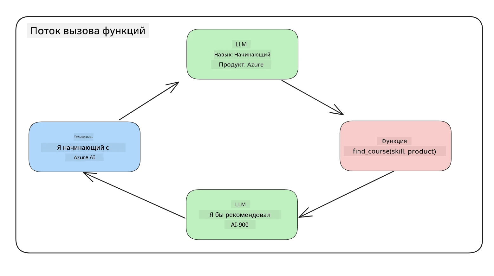
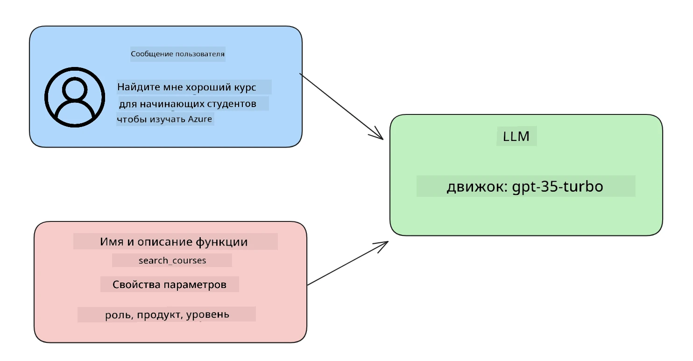

# Интеграция с вызовом функций

[](https://youtu.be/DgUdCLX8qYQ?si=f1ouQU5HQx6F8Gl2)

Вы уже многое узнали на предыдущих уроках. Однако мы можем улучшить процесс еще больше. Некоторые задачи, которые мы можем решить, — это как получить более последовательный формат ответа, чтобы облегчить работу с ответом на следующем этапе. Кроме того, мы можем захотеть добавить данные из других источников, чтобы дополнительно обогатить наше приложение.

Описанные выше проблемы — это то, что рассматривается в этой главе.

## Введение

Этот урок охватит:

- Объяснение, что такое вызов функций и его сценарии использования.
- Создание вызова функции с использованием Azure OpenAI.
- Как интегрировать вызов функции в приложение.

## Цели обучения

К концу этого урока вы сможете:

- Объяснять цель использования вызова функций.
- Настроить вызов функций с помощью службы Azure OpenAI.
- Проектировать эффективные вызовы функций для нужд вашего приложения.

## Сценарий: Улучшение нашего чатбота с помощью функций

Для этого урока мы хотим создать функцию для нашего образовательного стартапа, которая позволит пользователям использовать чатбот для поиска технических курсов. Мы будем рекомендовать курсы, соответствующие их уровню навыков, текущей роли и интересующей технологии.

Чтобы выполнить этот сценарий, мы используем комбинацию:

- `Azure OpenAI` для создания чат-интерфейса для пользователя.
- `Microsoft Learn Catalog API` для помощи пользователям в поиске курсов на основе запроса пользователя.
- `Function Calling` для обработки запроса пользователя и отправки его функции, делающей запрос к API.

Для начала давайте посмотрим, зачем нам вообще нужен вызов функций:

## Зачем нужен вызов функций

До появления вызова функций ответы от LLM были неструктурированными и непоследовательными. Разработчикам приходилось писать сложный код валидации, чтобы корректно обрабатывать каждое возможное изменение в ответе. Пользователи не могли получить ответы на вопросы вроде «Какая сейчас погода в Стокгольме?», поскольку модели были ограничены временными рамками данных, на которых их обучали.

Вызов функций — это функция службы Azure OpenAI, позволяющая преодолеть следующие ограничения:

- **Последовательный формат ответа**. Если мы можем лучше контролировать формат ответа, мы можем легче интегрировать ответ в другие системы.
- **Внешние данные**. Возможность использовать данные из других источников приложения в контексте чата.

## Иллюстрация проблемы на примере сценария

> Рекомендуем использовать [включенную тетрадь](./python/aoai-assignment.ipynb?WT.mc_id=academic-105485-koreyst), если вы хотите запустить приведенный ниже сценарий. Вы также можете просто читать дальше, так как мы пытаемся проиллюстрировать проблему, которую можно решить с помощью функций.

Рассмотрим пример, иллюстрирующий проблему формата ответа:

Допустим, мы хотим создать базу данных с информацией о студентах, чтобы предлагать им подходящие курсы. Ниже приведены два описания студентов, которые очень похожи по содержанию данных.

1. Создайте подключение к нашему ресурсу Azure OpenAI:

   ```python
   import os
   import json
   from openai import OpenAI
   from dotenv import load_dotenv
   load_dotenv()

   # API ответов обслуживается через Azure OpenAI (Microsoft Foundry) версии v1
   # конечную точку, поэтому мы указываем клиенту OpenAI <your-endpoint>/openai/v1/.
   endpoint = os.environ['AZURE_OPENAI_ENDPOINT']
   client = OpenAI(
   api_key=os.environ['AZURE_OPENAI_API_KEY'],
   base_url=f"{endpoint.rstrip('/')}/openai/v1/",
   )

   deployment=os.environ['AZURE_OPENAI_DEPLOYMENT']
   ```

   Ниже представлен Python-код для настройки подключения к Azure OpenAI. Поскольку мы используем конечную точку v1, нужно только указать `api_key` и `base_url` (параметр `api_version` не требуется).

1. Создание двух описаний студентов с помощью переменных `student_1_description` и `student_2_description`.

   ```python
   student_1_description="Emily Johnson is a sophomore majoring in computer science at Duke University. She has a 3.7 GPA. Emily is an active member of the university's Chess Club and Debate Team. She hopes to pursue a career in software engineering after graduating."

   student_2_description = "Michael Lee is a sophomore majoring in computer science at Stanford University. He has a 3.8 GPA. Michael is known for his programming skills and is an active member of the university's Robotics Club. He hopes to pursue a career in artificial intelligence after finishing his studies."
   ```

   Мы хотим отправить приведенные выше описания студентов LLM для разбора данных. Эти данные впоследствии можно использовать в приложении, отправлять в API или хранить в базе данных.

1. Создадим два одинаковых запроса, в которых укажем LLM, какая информация нас интересует:

   ```python
   prompt1 = f'''
   Please extract the following information from the given text and return it as a JSON object:

   name
   major
   school
   grades
   club

   This is the body of text to extract the information from:
   {student_1_description}
   '''

   prompt2 = f'''
   Please extract the following information from the given text and return it as a JSON object:

   name
   major
   school
   grades
   club

   This is the body of text to extract the information from:
   {student_2_description}
   '''
   ```

   Указанные выше запросы инструктируют LLM извлечь информацию и вернуть ответ в формате JSON.

1. После настройки запросов и подключения к Azure OpenAI мы отправим запросы LLM с помощью `client.responses.create`. Мы сохраняем запрос в переменной `input` и назначаем роль `user`. Это имитирует сообщение пользователя, написанное в чатбот.

   ```python
   # ответ на первый запрос
   openai_response1 = client.responses.create(
   model=deployment,
   input = [{'role': 'user', 'content': prompt1}],
   store=False,
   )
   openai_response1.output_text

   # ответ на второй запрос
   openai_response2 = client.responses.create(
   model=deployment,
   input = [{'role': 'user', 'content': prompt2}],
   store=False,
   )
   openai_response2.output_text
   ```

Теперь мы можем отправить оба запроса LLM и проверить полученный ответ, обратившись к нему так: `openai_response1.output_text`.

1. Наконец, мы можем преобразовать ответ в формат JSON, вызвав `json.loads`:

   ```python
   # Загрузка ответа в виде объекта JSON
   json_response1 = json.loads(openai_response1.output_text)
   json_response1
   ```

   Ответ 1:

   ```json
   {
     "name": "Emily Johnson",
     "major": "computer science",
     "school": "Duke University",
     "grades": "3.7",
     "club": "Chess Club"
   }
   ```

   Ответ 2:

   ```json
   {
     "name": "Michael Lee",
     "major": "computer science",
     "school": "Stanford University",
     "grades": "3.8 GPA",
     "club": "Robotics Club"
   }
   ```

   Несмотря на то, что запросы идентичны, а описания похожи, мы видим, что значения свойства `Grades` форматируются по-разному: иногда в формате `3.7`, иногда как `3.7 GPA`.

   Такой результат обусловлен тем, что LLM воспринимает неструктурированные данные в виде письменного запроса и тоже возвращает неструктурированные данные. Нам нужен структурированный формат, чтобы понимать, что ожидать при хранении или использовании этих данных.

Значит, как решить проблему с форматированием? Используя вызов функций, мы можем быть уверены, что получаем структурированные данные. При использовании вызова функции LLM не вызывает и не выполняет никаких функций. Вместо этого мы создаем структуру, которой LLM должен следовать в своих ответах. Затем мы используем эти структурированные ответы, чтобы знать, какую функцию нужно вызвать в нашем приложении.



Далее мы можем взять результат из функции и отправить его обратно в LLM. LLM ответит на запрос пользователя в естественном языке.

## Сценарии использования вызова функций

Существуют различные случаи, когда вызовы функций могут улучшить ваше приложение, например:

- **Вызов внешних инструментов**. Чатботы отлично отвечают на вопросы пользователей. С помощью вызова функций чатботы могут выполнять определенные задачи по сообщениям от пользователей. Например, студент может попросить чатбота «Отправить письмо моему преподавателю с просьбой о дополнительной помощи по этому предмету». В этом случае можно сделать вызов функции `send_email(to: string, body: string)`.

- **Создание запросов к API или базе данных**. Пользователи могут находить информацию, используя естественный язык, который преобразуется в отформатированный запрос или API-вызов. Например, учитель может запросить «Кто выполнил последнее задание», что вызовет функцию `get_completed(student_name: string, assignment: int, current_status: string)`.

- **Создание структурированных данных**. Пользователи могут взять блок текста или CSV и использовать LLM для извлечения важной информации. Например, студент может преобразовать статью из Википедии о мирных соглашениях, чтобы создать карточки для запоминания с помощью ИИ. Это можно сделать, используя функцию `get_important_facts(agreement_name: string, date_signed: string, parties_involved: list)`.

## Создание первого вызова функции

Процесс создания вызова функции включает три основных шага:

1. **Вызов** Responses API с перечнем ваших функций (инструментов) и сообщением пользователя.
2. **Чтение** ответа модели для выполнения действия, т.е. вызова функции или API.
3. **Выполнение** повторного вызова Responses API с ответом из вашей функции, чтобы использовать эту информацию для создания ответа пользователю.



### Шаг 1 - создание сообщений

Первый шаг — создать сообщение пользователя. Это может быть динамически задано путем получения значения из текстового ввода или присвоения значения здесь. Если вы впервые работаете с Responses API, нужно определить `role` и `content` сообщения.

`role` может быть `system` (создание правил), `assistant` (модель) или `user` (конечный пользователь). Для вызова функций мы назначим его `user` и приведем пример вопроса.

```python
messages= [ {"role": "user", "content": "Find me a good course for a beginner student to learn Azure."} ]
```

Назначая разные роли, мы ясно показываем LLM, говорит ли что-то система или пользователь, что помогает строить историю разговора, на которой модель может основываться.

### Шаг 2 - создание функций

Далее мы определим функцию и ее параметры. Здесь мы используем одну функцию с именем `search_courses`, но вы можете создать несколько функций.

> **Важно** : Функции включаются в системное сообщение для LLM и учитываются в количестве доступных токенов.

Ниже мы создаем функции в виде массива элементов. Каждый элемент — это инструмент в плоском формате Responses API с свойствами `type`, `name`, `description` и `parameters`:

```python
functions = [
   {
      "type":"function",
      "name":"search_courses",
      "description":"Retrieves courses from the search index based on the parameters provided",
      "parameters":{
         "type":"object",
         "properties":{
            "role":{
               "type":"string",
               "description":"The role of the learner (i.e. developer, data scientist, student, etc.)"
            },
            "product":{
               "type":"string",
               "description":"The product that the lesson is covering (i.e. Azure, Power BI, etc.)"
            },
            "level":{
               "type":"string",
               "description":"The level of experience the learner has prior to taking the course (i.e. beginner, intermediate, advanced)"
            }
         },
         "required":[
            "role"
         ]
      }
   }
]
```

Давайте подробнее рассмотрим каждое свойство функции:

- `name` — имя функции, которую мы хотим вызвать.
- `description` — описание работы функции. Здесь важно быть конкретным и ясным.
- `parameters` — список значений и форматов, которые вы хотите получить в ответе от модели. Массив параметров состоит из элементов со следующими свойствами:
  1. `type` — тип данных свойства.
  2. `properties` — список конкретных значений, которые модель использует в ответе
      1. `name` — ключ — имя свойства, которое модель будет использовать в отформатированном ответе, например, `product`.
      1. `type` — тип данных этого свойства, например, `string`.
      1. `description` — описание конкретного свойства.

Существует также необязательное свойство `required` — обязательное для вызова функции.

### Шаг 3 - выполнение вызова функции

Определив функцию, теперь нужно включить ее в вызов Responses API. Для этого добавляем `tools` в запрос. В нашем случае это `tools=functions`.

Также можно задать `tool_choice` в `auto`. Это означает, что мы позволяем LLM решить, какую функцию вызвать на основе сообщения пользователя, а не назначаем это вручную.

Ниже код, в котором мы вызываем `client.responses.create`, обратите внимание, как установлен `tools=functions` и `tool_choice="auto"`, предоставляя LLM возможность решать, когда вызывать предоставленные функции:

```python
response = client.responses.create(model=deployment,
                                        input=messages,
                                        tools=functions,
                                        tool_choice="auto",
                                        store=False)

print(response.output)
```

Ответ теперь включает элемент `function_call` в `response.output`, который выглядит так:

```json
{
  "type": "function_call",
  "name": "search_courses",
  "call_id": "call_abc123",
  "arguments": "{\n  \"role\": \"student\",\n  \"product\": \"Azure\",\n  \"level\": \"beginner\"\n}"
}
```

Здесь мы видим, что функция `search_courses` была вызвана с аргументами, указанными в свойстве `arguments` JSON-ответа.

LLM пришел к выводу, что смог найти данные, соответствующие аргументам функции, так как извлек их из значения, переданного в параметр `input` вызова Responses API. Ниже напоминание значения `messages`:

```python
messages= [ {"role": "user", "content": "Find me a good course for a beginner student to learn Azure."} ]
```

Как видите, из `messages` извлечены `student`, `Azure` и `beginner`, которые передаются в функцию в качестве входных данных. Такой подход с функциями — отличный способ извлечения информации из запроса, а также для придания структуры LLM и создания многократно используемого функционала.

Далее рассмотрим, как использовать это в приложении.

## Интеграция вызова функций в приложение

После успешного тестирования форматированного ответа LLM, теперь можно интегрировать его в приложение.

### Управление потоком

Для интеграции в приложение выполним следующие шаги:

1. Сначала сделаем вызов к сервисам OpenAI и извлечем элементы `function_call` из ответа `output`.

   ```python
   response_items = response.output
   tool_calls = [item for item in response_items if item.type == "function_call"]
   ```

1. Затем определим функцию, которая будет вызывать Microsoft Learn API для получения списка курсов:

   ```python
   import requests

   def search_courses(role, product, level):
     url = "https://learn.microsoft.com/api/catalog/"
     params = {
        "role": role,
        "product": product,
        "level": level
     }
     response = requests.get(url, params=params)
     modules = response.json()["modules"]
     results = []
     for module in modules[:5]:
        title = module["title"]
        url = module["url"]
        results.append({"title": title, "url": url})
     return str(results)
   ```

   Обратите внимание, что теперь мы создаем реальную Python-функцию, соответствующую имени из переменной `functions`. Также осуществляем реальные внешние запросы к API для получения данных. В данном случае обращаемся к Microsoft Learn API для поиска обучающих модулей.

Хорошо, мы создали переменную `functions` и соответствующую Python-функцию — как сообщить LLM, как их связать, чтобы вызвать нашу Python-функцию?

1. Чтобы понять, нужно ли вызвать Python-функцию, мы смотрим, есть ли в ответе LLM элемент `function_call`, и вызываем указанную функцию. Ниже пример, как выполнить эту проверку:

   ```python
   # Проверьте, хочет ли модель вызвать функцию
   if tool_calls:
    for tool_call in tool_calls:
     print("Recommended Function call:")
     print(tool_call.name)
     print()

     # Вызовите функцию.
     function_name = tool_call.name

     available_functions = {
             "search_courses": search_courses,
     }
     function_to_call = available_functions[function_name]

     function_args = json.loads(tool_call.arguments)
     function_response = function_to_call(**function_args)

     print("Output of function call:")
     print(function_response)
     print(type(function_response))

     # Добавьте вызов функции и его результат обратно в разговор.
     # элемент function_call модели должен быть добавлен перед её выводом.
     messages.append(tool_call)  # элемент function_call ассистента
     messages.append( # результат функции
         {
             "type": "function_call_output",
             "call_id": tool_call.call_id,
             "output": function_response,
         }
     )
   ```

   Эти три строки обеспечивают извлечение имени функции, аргументов и вызов функции:

   ```python
   function_to_call = available_functions[function_name]

   function_args = json.loads(tool_call.arguments)
   function_response = function_to_call(**function_args)
   ```

   Ниже показан вывод после запуска кода:

   **Вывод**

   ```Recommended Function call:
   {
     "name": "search_courses",
     "arguments": "{\n  \"role\": \"student\",\n  \"product\": \"Azure\",\n  \"level\": \"beginner\"\n}"
   }

   Output of function call:
   [{'title': 'Describe concepts of cryptography', 'url': 'https://learn.microsoft.com/training/modules/describe-concepts-of-cryptography/?
   WT.mc_id=api_CatalogApi'}, {'title': 'Introduction to audio classification with TensorFlow', 'url': 'https://learn.microsoft.com/en-
   us/training/modules/intro-audio-classification-tensorflow/?WT.mc_id=api_CatalogApi'}, {'title': 'Design a Performant Data Model in Azure SQL
   Database with Azure Data Studio', 'url': 'https://learn.microsoft.com/training/modules/design-a-data-model-with-ads/?
   WT.mc_id=api_CatalogApi'}, {'title': 'Getting started with the Microsoft Cloud Adoption Framework for Azure', 'url':
   'https://learn.microsoft.com/training/modules/cloud-adoption-framework-getting-started/?WT.mc_id=api_CatalogApi'}, {'title': 'Set up the
   Rust development environment', 'url': 'https://learn.microsoft.com/training/modules/rust-set-up-environment/?WT.mc_id=api_CatalogApi'}]
   <class 'str'>
   ```

1. Теперь отправим обновленное сообщение `messages` LLM, чтобы получить ответ в естественном языке, а не в формате JSON API.

   ```python
   print("Messages in next request:")
   print(messages)
   print()

   second_response = client.responses.create(
      input=messages,
      model=deployment,
      tool_choice="auto",
      tools=functions,
      temperature=0,
      store=False,
         )  # получить новый ответ от модели, где она может видеть ответ функции


   print(second_response.output_text)
   ```

   **Вывод**

   ```text
   I found some good courses for beginner students to learn Azure:

   1. [Describe concepts of cryptography](https://learn.microsoft.com/training/modules/describe-concepts-of-cryptography/?WT.mc_id=api_CatalogApi)
   2. [Introduction to audio classification with TensorFlow](https://learn.microsoft.com/training/modules/intro-audio-classification-tensorflow/?WT.mc_id=api_CatalogApi)
   3. [Design a Performant Data Model in Azure SQL Database with Azure Data Studio](https://learn.microsoft.com/training/modules/design-a-data-model-with-ads/?WT.mc_id=api_CatalogApi)
   4. [Getting started with the Microsoft Cloud Adoption Framework for Azure](https://learn.microsoft.com/training/modules/cloud-adoption-framework-getting-started/?WT.mc_id=api_CatalogApi)
   5. [Set up the Rust development environment](https://learn.microsoft.com/training/modules/rust-set-up-environment/?WT.mc_id=api_CatalogApi)

   You can click on the links to access the courses.
   ```

## Домашнее задание

Чтобы продолжить изучение вызова функций Azure OpenAI, вы можете построить:

- Больше параметров функции, которые могут помочь учащимся находить больше курсов.

- Создайте еще один вызов функции, который будет получать больше информации от учащегося, например, их родной язык
- Реализуйте обработку ошибок на случай, если вызов функции и/или API не возвращает подходящих курсов

Подсказка: Ознакомьтесь со страницей [Learn API reference documentation](https://learn.microsoft.com/training/support/catalog-api-developer-reference?WT.mc_id=academic-105485-koreyst), чтобы узнать, как и где доступны эти данные.

## Отличная работа! Продолжайте путешествие

После завершения этого урока ознакомьтесь с нашей [коллекцией по обучению Генеративному ИИ](https://aka.ms/genai-collection?WT.mc_id=academic-105485-koreyst), чтобы продолжать повышать свои знания в области Генеративного ИИ!

Перейдите к Уроку 12, где мы рассмотрим, как [разрабатывать UX для ИИ-приложений](../12-designing-ux-for-ai-applications/README.md?WT.mc_id=academic-105485-koreyst)!

---

<!-- CO-OP TRANSLATOR DISCLAIMER START -->
**Отказ от ответственности**:
Этот документ был переведен с использованием сервиса машинного перевода [Co-op Translator](https://github.com/Azure/co-op-translator). Несмотря на наши усилия по обеспечению точности, имейте в виду, что автоматический перевод может содержать ошибки или неточности. Оригинальный документ на его исходном языке следует считать авторитетным источником. Для получения критически важной информации рекомендуется обратиться к профессиональному человеческому переводу. Мы не несем ответственности за любые недоразумения или неправильные толкования, возникшие в результате использования этого перевода.
<!-- CO-OP TRANSLATOR DISCLAIMER END -->