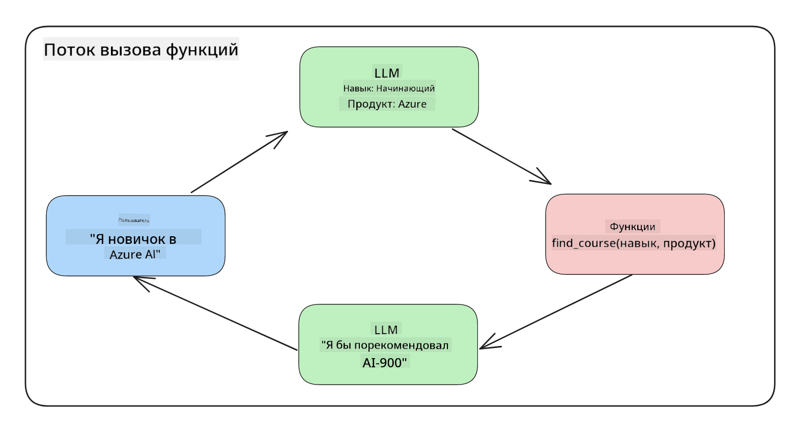

<!--
CO_OP_TRANSLATOR_METADATA:
{
  "original_hash": "77a48a201447be19aa7560706d6f93a0",
  "translation_date": "2025-07-09T14:23:02+00:00",
  "source_file": "11-integrating-with-function-calling/README.md",
  "language_code": "ru"
}
-->
# Интеграция с вызовом функций

[](https://aka.ms/gen-ai-lesson11-gh?WT.mc_id=academic-105485-koreyst)

Вы уже многое узнали в предыдущих уроках. Однако мы можем улучшить процесс. Одной из задач является получение более последовательного формата ответа, чтобы упростить работу с ним на следующих этапах. Также может понадобиться добавить данные из других источников для обогащения нашего приложения.

Именно этим проблемам посвящена эта глава.

## Введение

В этом уроке вы узнаете:

- Что такое вызов функции и где он применяется.
- Как создать вызов функции с помощью Azure OpenAI.
- Как интегрировать вызов функции в приложение.

## Цели обучения

К концу урока вы сможете:

- Объяснить назначение вызова функций.
- Настроить вызов функции с помощью Azure OpenAI Service.
- Разрабатывать эффективные вызовы функций для вашего приложения.

## Сценарий: Улучшаем чатбот с помощью функций

В этом уроке мы создадим функцию для нашего образовательного стартапа, которая позволит пользователям с помощью чатбота находить технические курсы. Мы будем рекомендовать курсы, соответствующие уровню навыков, текущей роли и интересующей технологии.

Для реализации этого сценария мы используем:

- `Azure OpenAI` для создания чат-интерфейса.
- `Microsoft Learn Catalog API` для поиска курсов по запросу пользователя.
- `Function Calling` для обработки запроса пользователя и отправки его в функцию, которая сделает API-запрос.

Для начала рассмотрим, зачем вообще нужен вызов функций:

## Зачем нужен вызов функций

До появления вызова функций ответы от LLM были неструктурированными и непоследовательными. Разработчикам приходилось писать сложный код для проверки и обработки всех вариантов ответов. Пользователи не могли получить ответы на вопросы вроде «Какая сейчас погода в Стокгольме?», так как модели ограничены данными, на которых они обучались.

Вызов функций — это возможность Azure OpenAI Service, которая помогает преодолеть следующие ограничения:

- **Последовательный формат ответа.** Если мы можем лучше контролировать формат ответа, его проще интегрировать с другими системами.
- **Внешние данные.** Возможность использовать данные из других источников приложения в контексте чата.

## Иллюстрация проблемы на примере

> Рекомендуем использовать [включённый ноутбук](../../../11-integrating-with-function-calling/python/aoai-assignment.ipynb), если хотите запустить приведённый ниже сценарий. Можно также просто читать дальше, чтобы понять проблему, которую помогают решить функции.

Рассмотрим пример, иллюстрирующий проблему с форматом ответа:

Предположим, мы хотим создать базу данных студентов, чтобы рекомендовать им подходящие курсы. Ниже приведены два описания студентов, которые очень похожи по содержанию.

1. Создаём подключение к ресурсу Azure OpenAI:

   ```python
   import os
   import json
   from openai import AzureOpenAI
   from dotenv import load_dotenv
   load_dotenv()

   client = AzureOpenAI(
   api_key=os.environ['AZURE_OPENAI_API_KEY'],  # this is also the default, it can be omitted
   api_version = "2023-07-01-preview"
   )

   deployment=os.environ['AZURE_OPENAI_DEPLOYMENT']
   ```

   Ниже пример кода на Python для настройки подключения к Azure OpenAI, где задаются `api_type`, `api_base`, `api_version` и `api_key`.

1. Создаём два описания студентов в переменных `student_1_description` и `student_2_description`.

   ```python
   student_1_description="Emily Johnson is a sophomore majoring in computer science at Duke University. She has a 3.7 GPA. Emily is an active member of the university's Chess Club and Debate Team. She hopes to pursue a career in software engineering after graduating."

   student_2_description = "Michael Lee is a sophomore majoring in computer science at Stanford University. He has a 3.8 GPA. Michael is known for his programming skills and is an active member of the university's Robotics Club. He hopes to pursue a career in artificial intelligence after finishing his studies."
   ```

   Мы хотим отправить эти описания в LLM для парсинга данных. Эти данные потом можно использовать в приложении, отправлять в API или сохранять в базе данных.

1. Создаём два одинаковых запроса, в которых указываем LLM, какую информацию нужно извлечь:

   ```python
   prompt1 = f'''
   Please extract the following information from the given text and return it as a JSON object:

   name
   major
   school
   grades
   club

   This is the body of text to extract the information from:
   {student_1_description}
   '''

   prompt2 = f'''
   Please extract the following information from the given text and return it as a JSON object:

   name
   major
   school
   grades
   club

   This is the body of text to extract the information from:
   {student_2_description}
   '''
   ```

   В этих запросах LLM просят извлечь информацию и вернуть ответ в формате JSON.

1. После настройки запросов и подключения к Azure OpenAI отправляем запросы в LLM с помощью `openai.ChatCompletion`. Запросы хранятся в переменной `messages` с ролью `user`, чтобы имитировать сообщение пользователя в чатбот.

   ```python
   # response from prompt one
   openai_response1 = client.chat.completions.create(
   model=deployment,
   messages = [{'role': 'user', 'content': prompt1}]
   )
   openai_response1.choices[0].message.content

   # response from prompt two
   openai_response2 = client.chat.completions.create(
   model=deployment,
   messages = [{'role': 'user', 'content': prompt2}]
   )
   openai_response2.choices[0].message.content
   ```

Теперь можно отправить оба запроса и посмотреть ответы, получив их так: `openai_response1['choices'][0]['message']['content']`.

1. Наконец, преобразуем ответ в формат JSON с помощью `json.loads`:

   ```python
   # Loading the response as a JSON object
   json_response1 = json.loads(openai_response1.choices[0].message.content)
   json_response1
   ```

   Ответ 1:

   ```json
   {
     "name": "Emily Johnson",
     "major": "computer science",
     "school": "Duke University",
     "grades": "3.7",
     "club": "Chess Club"
   }
   ```

   Ответ 2:

   ```json
   {
     "name": "Michael Lee",
     "major": "computer science",
     "school": "Stanford University",
     "grades": "3.8 GPA",
     "club": "Robotics Club"
   }
   ```

   Несмотря на одинаковые запросы и похожие описания, значения свойства `Grades` форматируются по-разному: иногда это просто `3.7`, а иногда `3.7 GPA`.

   Это происходит потому, что LLM принимает неструктурированные данные в виде текста и возвращает тоже неструктурированные данные. Нам нужен структурированный формат, чтобы понимать, что ожидать при хранении или использовании этих данных.

Итак, как решить проблему с форматированием? С помощью вызова функций мы можем гарантировать получение структурированных данных. При использовании вызова функций LLM не выполняет функции напрямую. Вместо этого мы создаём структуру, которой LLM должен следовать в ответах. Затем мы используем эти структурированные ответы, чтобы определить, какую функцию вызвать в приложении.



Далее мы можем взять результат функции и отправить его обратно в LLM. LLM ответит на запрос пользователя уже на естественном языке.

## Сценарии использования вызова функций

Вызов функций может улучшить приложение в разных случаях:

- **Вызов внешних инструментов.** Чатботы отлично отвечают на вопросы пользователей. С помощью вызова функций чатботы могут выполнять задачи по сообщениям пользователей. Например, студент может попросить чатбота «Отправь письмо моему преподавателю с просьбой о дополнительной помощи». Это вызовет функцию `send_email(to: string, body: string)`.

- **Создание запросов к API или базе данных.** Пользователи могут искать информацию на естественном языке, которая преобразуется в форматированный запрос или API-запрос. Например, преподаватель может спросить «Кто выполнил последнее задание?», что вызовет функцию `get_completed(student_name: string, assignment: int, current_status: string)`.

- **Создание структурированных данных.** Пользователи могут взять текст или CSV и с помощью LLM извлечь важную информацию. Например, студент может преобразовать статью из Википедии о мирных соглашениях в AI-флешкарты с помощью функции `get_important_facts(agreement_name: string, date_signed: string, parties_involved: list)`.

## Создание первого вызова функции

Процесс создания вызова функции включает 3 основных шага:

1. **Вызов** API Chat Completions с перечнем функций и сообщением пользователя.
2. **Чтение** ответа модели для выполнения действия, например, вызова функции или API.
3. **Повторный вызов** API Chat Completions с ответом функции для формирования ответа пользователю.


### Шаг 1 — создание сообщений

Первый шаг — создать сообщение пользователя. Его можно динамически задать из текстового поля или указать здесь. Если вы впервые работаете с Chat Completions API, нужно определить `role` и `content` сообщения.

`role` может быть `system` (правила), `assistant` (модель) или `user` (пользователь). Для вызова функций мы укажем `user` и пример вопроса.

```python
messages= [ {"role": "user", "content": "Find me a good course for a beginner student to learn Azure."} ]
```

Назначая разные роли, мы даём понять LLM, кто говорит — система или пользователь, что помогает строить историю диалога.

### Шаг 2 — создание функций

Далее определим функцию и её параметры. Здесь мы используем одну функцию `search_courses`, но можно создать несколько.

> **Важно**: Функции включаются в системное сообщение для LLM и учитываются в лимите токенов.

Ниже функции описаны в виде массива объектов с полями `name`, `description` и `parameters`:

```python
functions = [
   {
      "name":"search_courses",
      "description":"Retrieves courses from the search index based on the parameters provided",
      "parameters":{
         "type":"object",
         "properties":{
            "role":{
               "type":"string",
               "description":"The role of the learner (i.e. developer, data scientist, student, etc.)"
            },
            "product":{
               "type":"string",
               "description":"The product that the lesson is covering (i.e. Azure, Power BI, etc.)"
            },
            "level":{
               "type":"string",
               "description":"The level of experience the learner has prior to taking the course (i.e. beginner, intermediate, advanced)"
            }
         },
         "required":[
            "role"
         ]
      }
   }
]
```

Подробно о каждом поле:

- `name` — имя функции, которую нужно вызвать.
- `description` — описание работы функции. Важно быть точным и понятным.
- `parameters` — список значений и форматов, которые модель должна вернуть. Массив параметров содержит объекты с такими свойствами:
  1. `type` — тип данных свойства.
  2. `properties` — список конкретных значений, которые модель должна использовать в ответе:
      1. `name` — имя свойства, например, `product`.
      2. `type` — тип данных свойства, например, `string`.
      3. `description` — описание свойства.

Есть также необязательное свойство `required` — обязательные параметры для вызова функции.

### Шаг 3 — вызов функции

После определения функции нужно включить её в запрос к Chat Completion API, добавив параметр `functions`. В нашем случае это `functions=functions`.

Можно также указать `function_call` со значением `auto`. Это позволит LLM самостоятельно выбрать, какую функцию вызвать, исходя из сообщения пользователя.

Ниже пример кода с вызовом `ChatCompletion.create`, где указаны `functions=functions` и `function_call="auto"`, давая LLM возможность выбирать функцию:

```python
response = client.chat.completions.create(model=deployment,
                                        messages=messages,
                                        functions=functions,
                                        function_call="auto")

print(response.choices[0].message)
```

Ответ теперь выглядит так:

```json
{
  "role": "assistant",
  "function_call": {
    "name": "search_courses",
    "arguments": "{\n  \"role\": \"student\",\n  \"product\": \"Azure\",\n  \"level\": \"beginner\"\n}"
  }
}
```

Здесь видно, что была вызвана функция `search_courses` с аргументами, перечисленными в свойстве `arguments` JSON-ответа.

Это значит, что LLM смог извлечь данные из параметра `messages` и сопоставить их с аргументами функции. Напоминаем содержимое `messages`:

```python
messages= [ {"role": "user", "content": "Find me a good course for a beginner student to learn Azure."} ]
```

Как видите, из `messages` были извлечены `student`, `Azure` и `beginner` и переданы в функцию. Такой подход помогает не только извлекать информацию из запроса, но и структурировать работу LLM с повторно используемым функционалом.

Далее посмотрим, как использовать это в приложении.

## Интеграция вызовов функций в приложение

После тестирования форматированного ответа LLM можно интегрировать его в приложение.

### Управление потоком

Для интеграции сделаем следующие шаги:

1. Сначала вызовем OpenAI сервис и сохраним сообщение в переменную `response_message`.

   ```python
   response_message = response.choices[0].message
   ```

1. Теперь определим функцию, которая будет обращаться к Microsoft Learn API для получения списка курсов:

   ```python
   import requests

   def search_courses(role, product, level):
     url = "https://learn.microsoft.com/api/catalog/"
     params = {
        "role": role,
        "product": product,
        "level": level
     }
     response = requests.get(url, params=params)
     modules = response.json()["modules"]
     results = []
     for module in modules[:5]:
        title = module["title"]
        url = module["url"]
        results.append({"title": title, "url": url})
     return str(results)
   ```

   Обратите внимание, что мы создаём реальную Python-функцию, соответствующую имени функции из переменной `functions`. Также выполняем реальные внешние API-запросы к Microsoft Learn для поиска обучающих модулей.

Итак, мы создали переменную `functions` и соответствующую Python-функцию. Как же связать их, чтобы вызвать Python-функцию из ответа LLM?

1. Чтобы понять, нужно ли вызывать Python-функцию, проверяем в ответе LLM наличие поля `function_call` и вызываем указанную функцию. Вот как это сделать:

   ```python
   # Check if the model wants to call a function
   if response_message.function_call.name:
    print("Recommended Function call:")
    print(response_message.function_call.name)
    print()

    # Call the function.
    function_name = response_message.function_call.name

    available_functions = {
            "search_courses": search_courses,
    }
    function_to_call = available_functions[function_name]

    function_args = json.loads(response_message.function_call.arguments)
    function_response = function_to_call(**function_args)

    print("Output of function call:")
    print(function_response)
    print(type(function_response))


    # Add the assistant response and function response to the messages
    messages.append( # adding assistant response to messages
        {
            "role": response_message.role,
            "function_call": {
                "name": function_name,
                "arguments": response_message.function_call.arguments,
            },
            "content": None
        }
    )
    messages.append( # adding function response to messages
        {
            "role": "function",
            "name": function_name,
            "content":function_response,
        }
    )
   ```

   Эти три строки извлекают имя функции, аргументы и вызывают функцию:

   ```python
   function_to_call = available_functions[function_name]

   function_args = json.loads(response_message.function_call.arguments)
   function_response = function_to_call(**function_args)
   ```

   Ниже пример вывода после запуска кода:

   **Вывод**

   ```Recommended Function call:
   {
     "name": "search_courses",
     "arguments": "{\n  \"role\": \"student\",\n  \"product\": \"Azure\",\n  \"level\": \"beginner\"\n}"
   }

   Output of function call:
   [{'title': 'Describe concepts of cryptography', 'url': 'https://learn.microsoft.com/training/modules/describe-concepts-of-cryptography/?
   WT.mc_id=api_CatalogApi'}, {'title': 'Introduction to audio classification with TensorFlow', 'url': 'https://learn.microsoft.com/en-
   us/training/modules/intro-audio-classification-tensorflow/?WT.mc_id=api_CatalogApi'}, {'title': 'Design a Performant Data Model in Azure SQL
   Database with Azure Data Studio', 'url': 'https://learn.microsoft.com/training/modules/design-a-data-model-with-ads/?
   WT.mc_id=api_CatalogApi'}, {'title': 'Getting started with the Microsoft Cloud Adoption Framework for Azure', 'url':
   'https://learn.microsoft.com/training/modules/cloud-adoption-framework-getting-started/?WT.mc_id=api_CatalogApi'}, {'title': 'Set up the
   Rust development environment', 'url': 'https://learn.microsoft.com/training/modules/rust-set-up-environment/?WT.mc_id=api_CatalogApi'}]
   <class 'str'>
   ```

1. Теперь отправим обновленное сообщение `messages` в LLM, чтобы получить ответ на естественном языке вместо JSON-формата API.

   ```python
   print("Messages in next request:")
   print(messages)
   print()

   second_response = client.chat.completions.create(
      messages=messages,
      model=deployment,
      function_call="auto",
      functions=functions,
      temperature=0
         )  # get a new response from GPT where it can see the function response


   print(second_response.choices[0].message)
   ```

   **Вывод**

   ```python
   {
     "role": "assistant",
     "content": "I found some good courses for beginner students to learn Azure:\n\n1. [Describe concepts of cryptography] (https://learn.microsoft.com/training/modules/describe-concepts-of-cryptography/?WT.mc_id=api_CatalogApi)\n2. [Introduction to audio classification with TensorFlow](https://learn.microsoft.com/training/modules/intro-audio-classification-tensorflow/?WT.mc_id=api_CatalogApi)\n3. [Design a Performant Data Model in Azure SQL Database with Azure Data Studio](https://learn.microsoft.com/training/modules/design-a-data-model-with-ads/?WT.mc_id=api_CatalogApi)\n4. [Getting started with the Microsoft Cloud Adoption Framework for Azure](https://learn.microsoft.com/training/modules/cloud-adoption-framework-getting-started/?WT.mc_id=api_CatalogApi)\n5. [Set up the Rust development environment](https://learn.microsoft.com/training/modules/rust-set-up-environment/?WT.mc_id=api_CatalogApi)\n\nYou can click on the links to access the courses."
   }

   ```

## Задание

Для дальнейшего изучения Azure OpenAI Function Calling вы можете:

- Добавить больше параметров в функцию, чтобы помочь пользователям находить больше курсов.
- Создать ещё один вызов функции, который будет учитывать дополнительную информацию о пользователе, например, родной язык.
- Реализовать обработку ошибок на случай, если вызов функции или API не возвращает подходящих курсов.
## Отличная работа! Продолжайте путь

После завершения этого урока ознакомьтесь с нашей [коллекцией по обучению генеративному ИИ](https://aka.ms/genai-collection?WT.mc_id=academic-105485-koreyst), чтобы продолжить углублять свои знания в области генеративного ИИ!

Перейдите к уроку 12, где мы рассмотрим, как [разрабатывать UX для AI-приложений](../12-designing-ux-for-ai-applications/README.md?WT.mc_id=academic-105485-koreyst)!

**Отказ от ответственности**:  
Этот документ был переведен с помощью сервиса автоматического перевода [Co-op Translator](https://github.com/Azure/co-op-translator). Несмотря на наши усилия по обеспечению точности, просим учитывать, что автоматический перевод может содержать ошибки или неточности. Оригинальный документ на его исходном языке следует считать авторитетным источником. Для получения критически важной информации рекомендуется обращаться к профессиональному переводу, выполненному человеком. Мы не несем ответственности за любые недоразумения или неправильные толкования, возникшие в результате использования данного перевода.