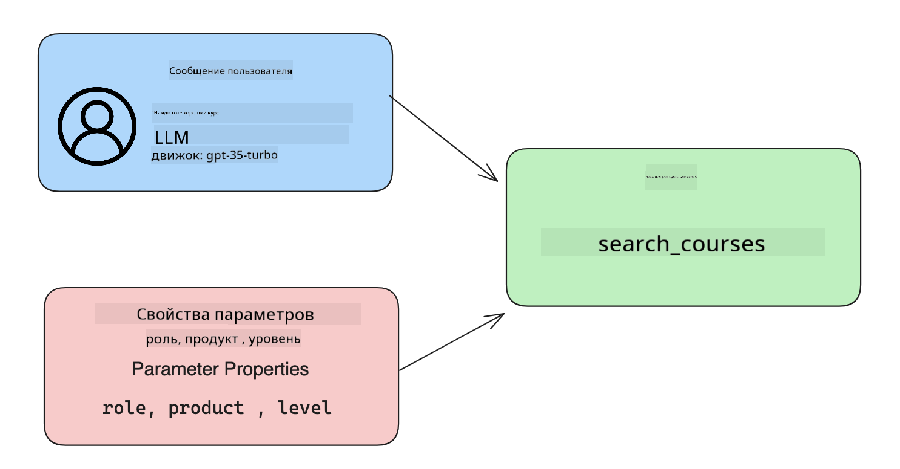

<!--
CO_OP_TRANSLATOR_METADATA:
{
  "original_hash": "f6f84f9ef2d066cd25850cab93580a50",
  "translation_date": "2025-10-17T15:02:52+00:00",
  "source_file": "11-integrating-with-function-calling/README.md",
  "language_code": "ru"
}
-->
# Интеграция с вызовом функций

[](https://youtu.be/DgUdCLX8qYQ?si=f1ouQU5HQx6F8Gl2)

Вы уже узнали немало из предыдущих уроков. Однако мы можем улучшить еще больше. Некоторые аспекты, которые стоит рассмотреть, включают получение более последовательного формата ответа, чтобы облегчить работу с ним в дальнейшем. Также мы можем добавить данные из других источников для обогащения нашего приложения.

Эти проблемы и будут рассмотрены в данной главе.

## Введение

В этом уроке мы рассмотрим:

- Что такое вызов функций и его области применения.
- Создание вызова функции с использованием Azure OpenAI.
- Как интегрировать вызов функции в приложение.

## Цели обучения

К концу урока вы сможете:

- Объяснить цель использования вызова функций.
- Настроить вызов функции с помощью Azure OpenAI Service.
- Разработать эффективные вызовы функций для вашего приложения.

## Сценарий: Улучшение нашего чат-бота с помощью функций

В этом уроке мы хотим создать функцию для нашего образовательного стартапа, которая позволит пользователям использовать чат-бота для поиска технических курсов. Мы будем рекомендовать курсы, которые соответствуют их уровню навыков, текущей роли и интересующей технологии.

Для выполнения этого сценария мы будем использовать комбинацию:

- `Azure OpenAI` для создания чат-опыта для пользователя.
- `Microsoft Learn Catalog API` для помощи пользователям в поиске курсов на основе их запросов.
- `Function Calling` для обработки пользовательского запроса и отправки его в функцию для выполнения API-запроса.

Для начала давайте разберемся, почему вообще стоит использовать вызов функций:

## Зачем нужен вызов функций

До появления вызова функций ответы от LLM были неструктурированными и непоследовательными. Разработчикам приходилось писать сложный код для проверки, чтобы справляться с различными вариациями ответов. Пользователи не могли получать ответы на вопросы вроде "Какая сейчас погода в Стокгольме?". Это происходило потому, что модели ограничивались временем, когда данные были обучены.

Вызов функций — это функция Azure OpenAI Service, которая помогает преодолеть следующие ограничения:

- **Последовательный формат ответа**. Если мы можем лучше контролировать формат ответа, то нам будет проще интегрировать его в другие системы.
- **Внешние данные**. Возможность использовать данные из других источников приложения в контексте чата.

## Иллюстрация проблемы через сценарий

> Мы рекомендуем использовать [включенный ноутбук](./python/aoai-assignment.ipynb?WT.mc_id=academic-105485-koreyst), если вы хотите выполнить приведенный ниже сценарий. Вы также можете просто прочитать, так как мы пытаемся проиллюстрировать проблему, которую функции могут помочь решить.

Давайте рассмотрим пример, который иллюстрирует проблему формата ответа:

Предположим, мы хотим создать базу данных данных о студентах, чтобы предлагать им подходящие курсы. Ниже приведены два описания студентов, которые очень похожи по содержанию данных.

1. Создайте подключение к нашему ресурсу Azure OpenAI:

   ```python
   import os
   import json
   from openai import AzureOpenAI
   from dotenv import load_dotenv
   load_dotenv()

   client = AzureOpenAI(
   api_key=os.environ['AZURE_OPENAI_API_KEY'],  # this is also the default, it can be omitted
   api_version = "2023-07-01-preview"
   )

   deployment=os.environ['AZURE_OPENAI_DEPLOYMENT']
   ```

   Ниже приведен код на Python для настройки подключения к Azure OpenAI, где мы задаем `api_type`, `api_base`, `api_version` и `api_key`.

1. Создание двух описаний студентов с использованием переменных `student_1_description` и `student_2_description`.

   ```python
   student_1_description="Emily Johnson is a sophomore majoring in computer science at Duke University. She has a 3.7 GPA. Emily is an active member of the university's Chess Club and Debate Team. She hopes to pursue a career in software engineering after graduating."

   student_2_description = "Michael Lee is a sophomore majoring in computer science at Stanford University. He has a 3.8 GPA. Michael is known for his programming skills and is an active member of the university's Robotics Club. He hopes to pursue a career in artificial intelligence after finishing his studies."
   ```

   Мы хотим отправить вышеуказанные описания студентов в LLM для анализа данных. Эти данные могут быть позже использованы в нашем приложении, отправлены в API или сохранены в базе данных.

1. Давайте создадим два идентичных запроса, в которых мы инструктируем LLM, какую информацию мы хотим получить:

   ```python
   prompt1 = f'''
   Please extract the following information from the given text and return it as a JSON object:

   name
   major
   school
   grades
   club

   This is the body of text to extract the information from:
   {student_1_description}
   '''

   prompt2 = f'''
   Please extract the following information from the given text and return it as a JSON object:

   name
   major
   school
   grades
   club

   This is the body of text to extract the information from:
   {student_2_description}
   '''
   ```

   В приведенных выше запросах мы инструктируем LLM извлечь информацию и вернуть ответ в формате JSON.

1. После настройки запросов и подключения к Azure OpenAI мы отправим запросы в LLM, используя `openai.ChatCompletion`. Мы сохраняем запрос в переменной `messages` и назначаем роль `user`. Это имитирует сообщение от пользователя, написанное чат-боту.

   ```python
   # response from prompt one
   openai_response1 = client.chat.completions.create(
   model=deployment,
   messages = [{'role': 'user', 'content': prompt1}]
   )
   openai_response1.choices[0].message.content

   # response from prompt two
   openai_response2 = client.chat.completions.create(
   model=deployment,
   messages = [{'role': 'user', 'content': prompt2}]
   )
   openai_response2.choices[0].message.content
   ```

Теперь мы можем отправить оба запроса в LLM и изучить полученный ответ, найдя его, например, так: `openai_response1['choices'][0]['message']['content']`.

1. Наконец, мы можем преобразовать ответ в формат JSON, вызвав `json.loads`:

   ```python
   # Loading the response as a JSON object
   json_response1 = json.loads(openai_response1.choices[0].message.content)
   json_response1
   ```

   Ответ 1:

   ```json
   {
     "name": "Emily Johnson",
     "major": "computer science",
     "school": "Duke University",
     "grades": "3.7",
     "club": "Chess Club"
   }
   ```

   Ответ 2:

   ```json
   {
     "name": "Michael Lee",
     "major": "computer science",
     "school": "Stanford University",
     "grades": "3.8 GPA",
     "club": "Robotics Club"
   }
   ```

   Несмотря на то, что запросы одинаковы, а описания похожи, мы видим, что значения свойства `Grades` форматируются по-разному, например, `3.7` или `3.7 GPA`.

   Этот результат возникает потому, что LLM принимает неструктурированные данные в виде написанного запроса и возвращает также неструктурированные данные. Нам нужен структурированный формат, чтобы мы знали, чего ожидать при хранении или использовании этих данных.

Так как же решить проблему форматирования? Используя вызов функций, мы можем гарантировать, что получим структурированные данные. При использовании вызова функций LLM фактически не вызывает и не выполняет функции. Вместо этого мы создаем структуру, которой LLM должен следовать для своих ответов. Затем мы используем эти структурированные ответы, чтобы знать, какую функцию запускать в наших приложениях.


Мы можем взять то, что возвращается из функции, и отправить это обратно в LLM. LLM затем ответит, используя естественный язык, чтобы ответить на запрос пользователя.

## Области применения вызова функций

Существует множество различных областей применения вызова функций, которые могут улучшить ваше приложение, например:

- **Вызов внешних инструментов**. Чат-боты отлично подходят для предоставления ответов на вопросы пользователей. Используя вызов функций, чат-боты могут использовать сообщения от пользователей для выполнения определенных задач. Например, студент может попросить чат-бота: "Отправь письмо моему преподавателю, что мне нужна дополнительная помощь по этому предмету". Это может вызвать функцию `send_email(to: string, body: string)`.

- **Создание запросов к API или базе данных**. Пользователи могут находить информацию, используя естественный язык, который преобразуется в форматированный запрос или API-запрос. Примером может быть преподаватель, который запрашивает: "Кто из студентов завершил последнее задание", что может вызвать функцию `get_completed(student_name: string, assignment: int, current_status: string)`.

- **Создание структурированных данных**. Пользователи могут взять блок текста или CSV и использовать LLM для извлечения важной информации из него. Например, студент может преобразовать статью из Википедии о мирных соглашениях, чтобы создать AI-флешкарты. Это можно сделать с помощью функции `get_important_facts(agreement_name: string, date_signed: string, parties_involved: list)`.

## Создание первого вызова функции

Процесс создания вызова функции включает 3 основных шага:

1. **Вызов** API Chat Completions с списком ваших функций и сообщением пользователя.
2. **Чтение** ответа модели для выполнения действия, например, выполнения функции или API-запроса.
3. **Создание** еще одного вызова API Chat Completions с ответом от вашей функции, чтобы использовать эту информацию для создания ответа пользователю.



### Шаг 1 - создание сообщений

Первый шаг — создать сообщение пользователя. Это можно динамически назначить, взяв значение текстового ввода, или назначить значение здесь. Если вы впервые работаете с API Chat Completions, нам нужно определить `role` и `content` сообщения.

`role` может быть либо `system` (создание правил), `assistant` (модель) или `user` (конечный пользователь). Для вызова функций мы назначим это как `user` и пример вопроса.

```python
messages= [ {"role": "user", "content": "Find me a good course for a beginner student to learn Azure."} ]
```

Назначая разные роли, становится понятно для LLM, кто говорит — система или пользователь, что помогает строить историю разговора, на основе которой LLM может работать.

### Шаг 2 - создание функций

Далее мы определим функцию и параметры этой функции. Мы будем использовать только одну функцию здесь, называемую `search_courses`, но вы можете создать несколько функций.

> **Важно**: Функции включаются в системное сообщение для LLM и будут учитываться в количестве доступных токенов.

Ниже мы создаем функции как массив элементов. Каждый элемент — это функция и имеет свойства `name`, `description` и `parameters`:

```python
functions = [
   {
      "name":"search_courses",
      "description":"Retrieves courses from the search index based on the parameters provided",
      "parameters":{
         "type":"object",
         "properties":{
            "role":{
               "type":"string",
               "description":"The role of the learner (i.e. developer, data scientist, student, etc.)"
            },
            "product":{
               "type":"string",
               "description":"The product that the lesson is covering (i.e. Azure, Power BI, etc.)"
            },
            "level":{
               "type":"string",
               "description":"The level of experience the learner has prior to taking the course (i.e. beginner, intermediate, advanced)"
            }
         },
         "required":[
            "role"
         ]
      }
   }
]
```

Давайте подробнее опишем каждую функцию:

- `name` - Имя функции, которую мы хотим вызвать.
- `description` - Описание того, как работает функция. Здесь важно быть конкретным и ясным.
- `parameters` - Список значений и формат, который модель должна использовать для своего ответа. Массив параметров состоит из элементов, где элементы имеют следующие свойства:
  1.  `type` - Тип данных, в котором будут храниться свойства.
  1.  `properties` - Список конкретных значений, которые модель будет использовать для своего ответа.
      1. `name` - Ключ — это имя свойства, которое модель будет использовать в своем форматированном ответе, например, `product`.
      1. `type` - Тип данных этого свойства, например, `string`.
      1. `description` - Описание конкретного свойства.

Также есть необязательное свойство `required` - обязательное свойство для завершения вызова функции.

### Шаг 3 - выполнение вызова функции

После определения функции нам нужно включить ее в вызов API Chat Completion. Мы делаем это, добавляя `functions` в запрос. В данном случае `functions=functions`.

Также есть возможность установить `function_call` в `auto`. Это означает, что мы позволим LLM решить, какую функцию следует вызвать на основе сообщения пользователя, вместо того чтобы назначать ее самостоятельно.

Вот пример кода ниже, где мы вызываем `ChatCompletion.create`, обратите внимание, как мы устанавливаем `functions=functions` и `function_call="auto"`, тем самым предоставляя LLM возможность выбирать, когда вызывать предоставленные функции:

```python
response = client.chat.completions.create(model=deployment,
                                        messages=messages,
                                        functions=functions,
                                        function_call="auto")

print(response.choices[0].message)
```

Ответ, который возвращается, выглядит следующим образом:

```json
{
  "role": "assistant",
  "function_call": {
    "name": "search_courses",
    "arguments": "{\n  \"role\": \"student\",\n  \"product\": \"Azure\",\n  \"level\": \"beginner\"\n}"
  }
}
```

Здесь мы видим, как была вызвана функция `search_courses` и с какими аргументами, указанными в свойстве `arguments` в JSON-ответе.

Вывод: LLM смог найти данные, соответствующие аргументам функции, извлекая их из значения, предоставленного параметру `messages` в вызове Chat Completion. Ниже приведено напоминание о значении `messages`:

```python
messages= [ {"role": "user", "content": "Find me a good course for a beginner student to learn Azure."} ]
```

Как видите, `student`, `Azure` и `beginner` были извлечены из `messages` и установлены как входные данные для функции. Использование функций таким образом — отличный способ извлечения информации из запроса, а также предоставления структуры для LLM и создания повторно используемой функциональности.

Теперь нам нужно увидеть, как мы можем использовать это в нашем приложении.

## Интеграция вызовов функций в приложение

После того как мы протестировали форматированный ответ от LLM, мы можем интегрировать это в приложение.

### Управление процессом

Чтобы интегрировать это в наше приложение, давайте выполним следующие шаги:

1. Сначала сделаем вызов к OpenAI services и сохраним сообщение в переменной `response_message`.

   ```python
   response_message = response.choices[0].message
   ```

1. Теперь мы определим функцию, которая будет вызывать Microsoft Learn API для получения списка курсов:

   ```python
   import requests

   def search_courses(role, product, level):
     url = "https://learn.microsoft.com/api/catalog/"
     params = {
        "role": role,
        "product": product,
        "level": level
     }
     response = requests.get(url, params=params)
     modules = response.json()["modules"]
     results = []
     for module in modules[:5]:
        title = module["title"]
        url = module["url"]
        results.append({"title": title, "url": url})
     return str(results)
   ```

   Обратите внимание, как мы теперь создаем реальную функцию на Python, которая соответствует именам функций, представленным в переменной `functions`. Мы также выполняем реальные внешние API-вызовы для получения необходимых данных. В данном случае мы обращаемся к Microsoft Learn API для поиска учебных модулей.

Хорошо, мы создали переменные `functions` и соответствующую функцию на Python, как мы можем указать LLM, как связать их, чтобы наша функция на Python была вызвана?

1. Чтобы проверить, нужно ли вызывать функцию на Python, мы должны изучить ответ LLM и проверить, является ли `function_call` его частью, и вызвать указанную функцию. Вот как можно выполнить упомянутую проверку ниже:

   ```python
   # Check if the model wants to call a function
   if response_message.function_call.name:
    print("Recommended Function call:")
    print(response_message.function_call.name)
    print()

    # Call the function.
    function_name = response_message.function_call.name

    available_functions = {
            "search_courses": search_courses,
    }
    function_to_call = available_functions[function_name]

    function_args = json.loads(response_message.function_call.arguments)
    function_response = function_to_call(**function_args)

    print("Output of function call:")
    print(function_response)
    print(type(function_response))


    # Add the assistant response and function response to the messages
    messages.append( # adding assistant response to messages
        {
            "role": response_message.role,
            "function_call": {
                "name": function_name,
                "arguments": response_message.function_call.arguments,
            },
            "content": None
        }
    )
    messages.append( # adding function response to messages
        {
            "role": "function",
            "name": function_name,
            "content":function_response,
        }
    )
   ```

   Эти три строки обеспечивают извлечение имени функции, аргументов и выполнение вызова:

   ```python
   function_to_call = available_functions[function_name]

   function_args = json.loads(response_message.function_call.arguments)
   function_response = function_to_call(**function_args)
   ```

   Ниже приведен вывод выполнения нашего кода:

   **Вывод**

   ```Recommended Function call:
   {
     "name": "search_courses",
     "arguments": "{\n  \"role\": \"student\",\n  \"product\": \"Azure\",\n  \"level\": \"beginner\"\n}"
   }

   Output of function call:
   [{'title': 'Describe concepts of cryptography', 'url': 'https://learn.microsoft.com/training/modules/describe-concepts-of-cryptography/?
   WT.mc_id=api_CatalogApi'}, {'title': 'Introduction to audio classification with TensorFlow', 'url': 'https://learn.microsoft.com/en-
   us/training/modules/intro-audio-classification-tensorflow/?WT.mc_id=api_CatalogApi'}, {'title': 'Design a Performant Data Model in Azure SQL
   Database with Azure Data Studio', 'url': 'https://learn.microsoft.com/training/modules/design-a-data-model-with-ads/?
   WT.mc_id=api_CatalogApi'}, {'title': 'Getting started with the Microsoft Cloud Adoption Framework for Azure', 'url':
   'https://learn.microsoft.com/training/modules/cloud-adoption-framework-getting-started/?WT.mc_id=api_CatalogApi'}, {'title': 'Set up the
   Rust development environment', 'url': 'https://learn.microsoft.com/training/modules/rust-set-up-environment/?WT.mc_id=api_CatalogApi'}]
   <class 'str'>
   ```

1. Теперь мы отправим обновленное сообщение, `messages`, в LLM, чтобы получить ответ на естественном языке вместо ответа в формате JSON API.

   ```python
   print("Messages in next request:")
   print(messages)
   print()

   second_response = client.chat.completions.create(
      messages=messages,
      model=deployment,
      function_call="auto",
      functions=functions,
      temperature=0
         )  # get a new response from GPT where it can see the function response


   print(second_response.choices[0].message)
   ```

   **Вывод**

   ```python
   {
     "role": "assistant",
     "content": "I found some good courses for beginner students to learn Azure:\n\n1. [Describe concepts of cryptography] (https://learn.microsoft.com/training/modules/describe-concepts-of-cryptography/?WT.mc_id=api_CatalogApi)\n2. [Introduction to audio classification with TensorFlow](https://learn.microsoft.com/training/modules/intro-audio-classification-tensorflow/?WT.mc_id=api_CatalogApi)\n3. [Design a Performant Data Model in Azure SQL Database with Azure Data Studio](https://learn.microsoft.com/training/modules/design-a-data-model-with-ads/?WT.mc_id=api_CatalogApi)\n4. [Getting started with the Microsoft Cloud Adoption Framework for Azure](https://learn.microsoft.com/training/modules/cloud-adoption-framework-getting-started/?WT.mc_id=api_CatalogApi)\n5. [Set up the Rust development environment](https://learn.microsoft.com/training/modules/rust-set-up-environment/?WT.mc_id=api_CatalogApi)\n\nYou can click on the links to access the courses."
   }

   ```

## Задание

Чтобы продолжить изучение Azure OpenAI Function Calling, вы можете:

- Добавить больше параметров функции, которые могут помочь учащимся найти больше курсов.
- Создать другой вызов функции, который учитывает больше информации об учащемся, например, его родной язык.
- Создайте обработку ошибок на случай, если вызов функции и/или API не возвращает подходящих курсов.

Подсказка: Ознакомьтесь с [документацией API Learn](https://learn.microsoft.com/training/support/catalog-api-developer-reference?WT.mc_id=academic-105485-koreyst), чтобы узнать, как и где доступны эти данные.

## Отличная работа! Продолжайте обучение

После завершения этого урока ознакомьтесь с нашей [коллекцией обучения генеративному ИИ](https://aka.ms/genai-collection?WT.mc_id=academic-105485-koreyst), чтобы продолжить углублять свои знания о генеративном ИИ!

Перейдите к уроку 12, где мы рассмотрим, как [разрабатывать UX для приложений с ИИ](../12-designing-ux-for-ai-applications/README.md?WT.mc_id=academic-105485-koreyst)!

---

**Отказ от ответственности**:  
Этот документ был переведен с использованием сервиса автоматического перевода [Co-op Translator](https://github.com/Azure/co-op-translator). Несмотря на наши усилия обеспечить точность, автоматические переводы могут содержать ошибки или неточности. Оригинальный документ на его родном языке следует считать авторитетным источником. Для получения критически важной информации рекомендуется профессиональный перевод человеком. Мы не несем ответственности за любые недоразумения или неправильные интерпретации, возникающие в результате использования данного перевода.