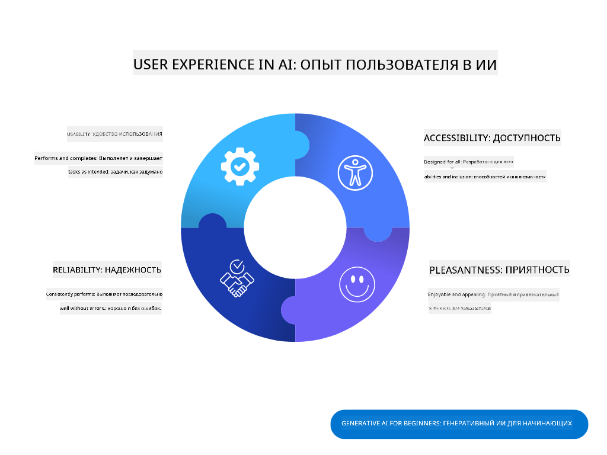
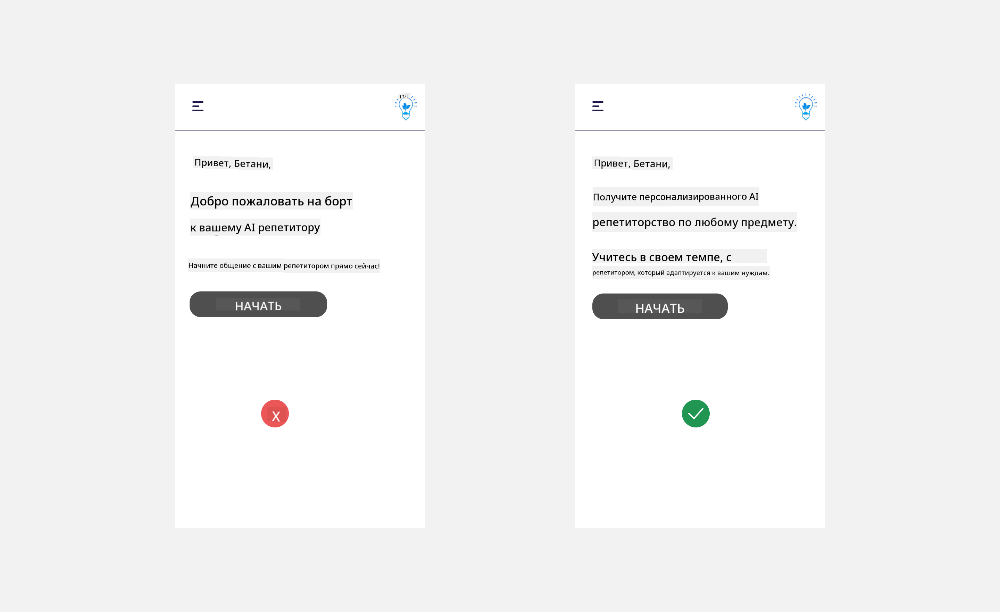
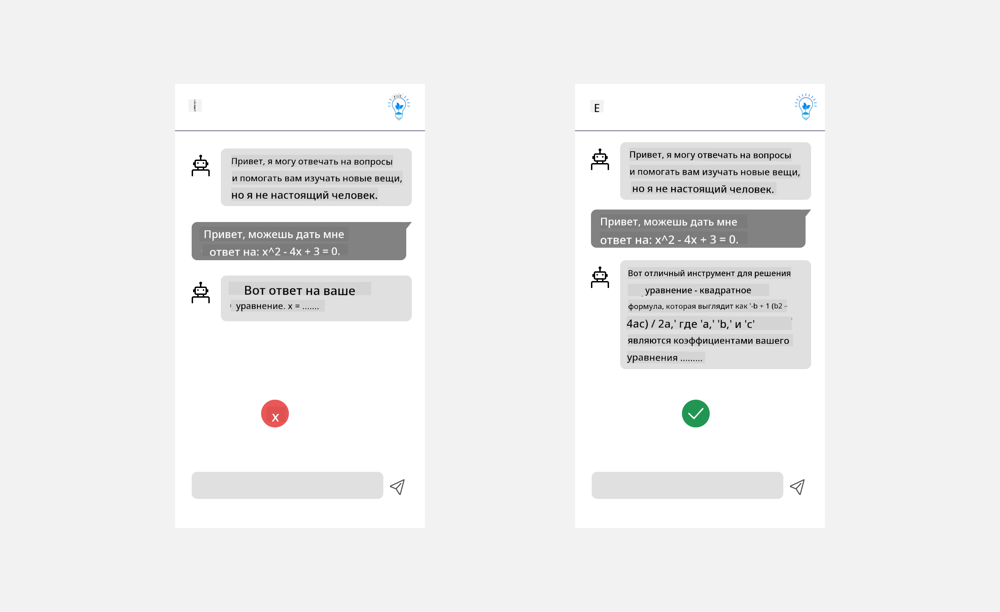
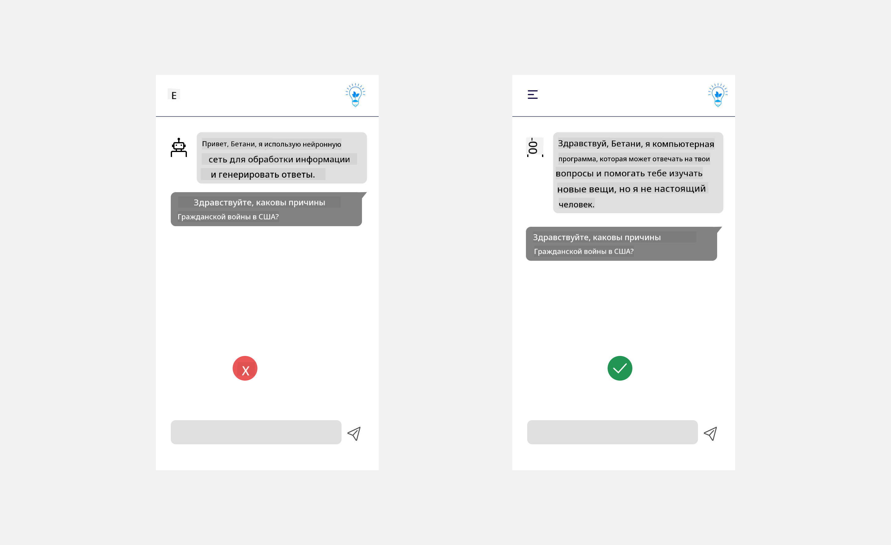
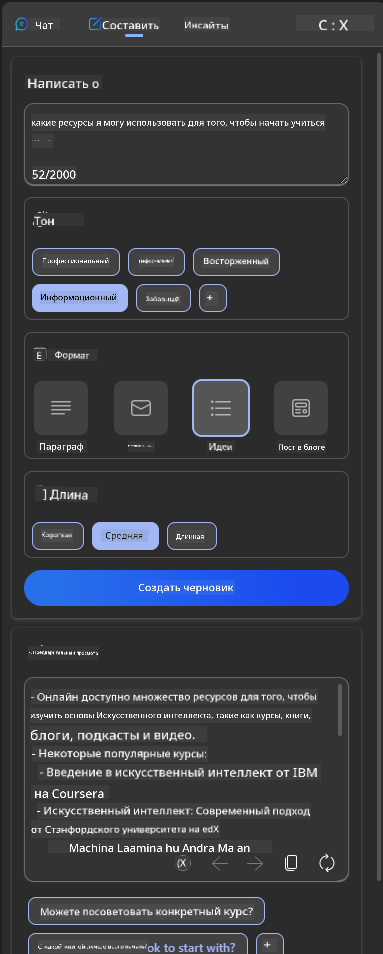
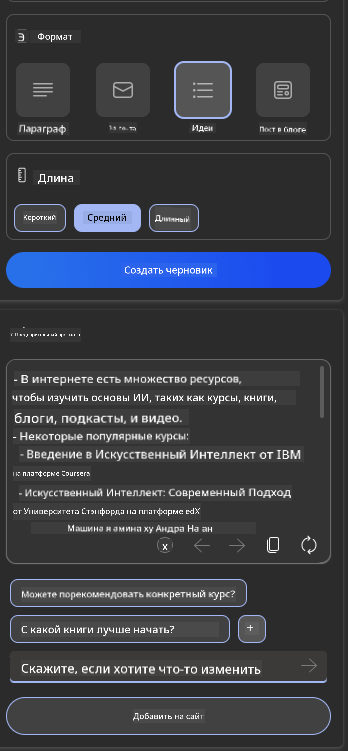
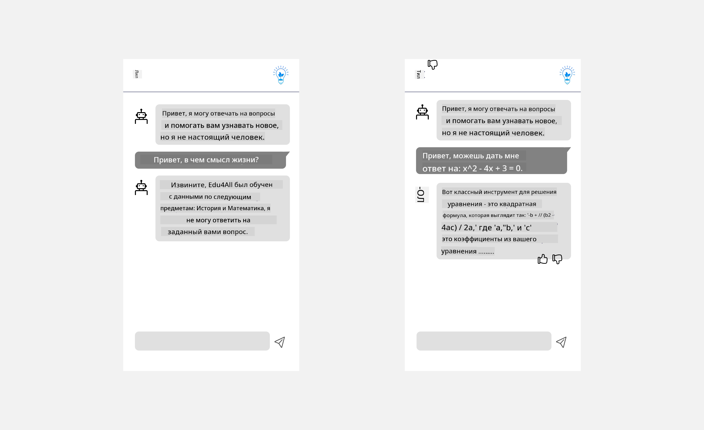

<!--
CO_OP_TRANSLATOR_METADATA:
{
  "original_hash": "ec385b41ee50579025d50cc03bfb3a25",
  "translation_date": "2025-05-19T21:42:27+00:00",
  "source_file": "12-designing-ux-for-ai-applications/README.md",
  "language_code": "ru"
}
-->
# Проектирование UX для AI приложений

> _(Кликните на изображение выше, чтобы посмотреть видео этого урока)_

Пользовательский опыт — это очень важный аспект при создании приложений. Пользователи должны иметь возможность эффективно использовать ваше приложение для выполнения задач. Эффективность — это одно, но вам также нужно разрабатывать приложения так, чтобы они были доступны всем, чтобы сделать их _доступными_. Эта глава сосредоточится на этой области, чтобы в итоге вы разработали приложение, которое люди могут и хотят использовать.

## Введение

Пользовательский опыт — это то, как пользователь взаимодействует и использует конкретный продукт или услугу, будь то система, инструмент или дизайн. При разработке AI приложений разработчики сосредотачиваются не только на обеспечении эффективности пользовательского опыта, но и на его этичности. В этом уроке мы расскажем, как создавать приложения искусственного интеллекта (AI), которые отвечают потребностям пользователей.

Урок охватит следующие области:

- Введение в пользовательский опыт и понимание потребностей пользователей
- Проектирование AI приложений для доверия и прозрачности
- Проектирование AI приложений для сотрудничества и обратной связи

## Цели обучения

После прохождения этого урока вы сможете:

- Понять, как создавать AI приложения, которые отвечают потребностям пользователей.
- Разрабатывать AI приложения, которые способствуют доверию и сотрудничеству.

### Предварительные требования

Потратьте некоторое время и узнайте больше о [пользовательском опыте и дизайн-мышлении.](https://learn.microsoft.com/training/modules/ux-design?WT.mc_id=academic-105485-koreyst)

## Введение в пользовательский опыт и понимание потребностей пользователей

В нашем вымышленном стартапе в области образования у нас есть два основных пользователя: учителя и ученики. У каждого из них есть уникальные потребности. Дизайн, ориентированный на пользователя, ставит в приоритет пользователя, обеспечивая, чтобы продукты были актуальными и полезными для тех, для кого они предназначены.

Приложение должно быть **полезным, надежным, доступным и приятным**, чтобы обеспечить хороший пользовательский опыт.

### Полезность

Быть полезным означает, что приложение имеет функциональность, соответствующую его предполагаемому назначению, например, автоматизация процесса оценки или создание карточек для повторения. Приложение, которое автоматизирует процесс оценки, должно быть в состоянии точно и эффективно назначать оценки за работу учащихся на основе заранее определенных критериев. Аналогично, приложение, которое создает карточки для повторения, должно быть в состоянии создавать актуальные и разнообразные вопросы на основе своих данных.

### Надежность

Быть надежным означает, что приложение может выполнять свою задачу последовательно и без ошибок. Однако AI, как и люди, не совершенен и может быть подвержен ошибкам. Приложения могут сталкиваться с ошибками или неожиданными ситуациями, требующими вмешательства или исправления со стороны человека. Как вы справляетесь с ошибками? В последнем разделе этого урока мы рассмотрим, как AI системы и приложения разрабатываются для сотрудничества и обратной связи.

### Доступность

Быть доступным означает расширение пользовательского опыта для пользователей с различными возможностями, включая людей с ограниченными возможностями, обеспечивая, чтобы никто не был исключен. Следуя рекомендациям и принципам доступности, AI решения становятся более инклюзивными, удобными и полезными для всех пользователей.

### Приятность

Быть приятным означает, что приложение приятно использовать. Привлекательный пользовательский опыт может оказать положительное влияние на пользователя, побуждая его возвращаться к приложению и увеличивая доходы компании.

Не каждую задачу можно решить с помощью AI. AI приходит на помощь, чтобы улучшить ваш пользовательский опыт, будь то автоматизация ручных задач или персонализация пользовательских впечатлений.

## Проектирование AI приложений для доверия и прозрачности

Создание доверия имеет решающее значение при проектировании AI приложений. Доверие обеспечивает уверенность пользователя в том, что приложение выполнит работу, будет последовательно выдавать результаты, и результаты будут такими, какими они нужны пользователю. Риск в этой области заключается в недоверии и чрезмерном доверии. Недоверие возникает, когда у пользователя мало или совсем нет доверия к AI системе, что приводит к отказу пользователя от вашего приложения. Чрезмерное доверие возникает, когда пользователь переоценивает возможности AI системы, что приводит к слишком большому доверию пользователей к AI системе. Например, автоматизированная система оценки в случае чрезмерного доверия может привести к тому, что учитель не будет проверять некоторые из работ, чтобы убедиться, что система оценки работает хорошо. Это может привести к несправедливым или неточным оценкам для учеников или упущенным возможностям для обратной связи и улучшения.

Два способа обеспечить, чтобы доверие было в центре дизайна, — это объяснимость и контроль.

### Объяснимость

Когда AI помогает принимать решения, такие как передача знаний будущим поколениям, важно, чтобы учителя и родители понимали, как принимаются решения AI. Это объяснимость — понимание того, как AI приложения принимают решения. Проектирование для объяснимости включает добавление деталей примеров того, что может сделать AI приложение. Например, вместо "Начните с AI учителя", система может использовать: "Суммируйте свои заметки для более легкого повторения с помощью AI."

Другой пример — как AI использует пользовательские и личные данные. Например, у пользователя с персоной "ученик" могут быть ограничения на основе их персоны. AI может не раскрывать ответы на вопросы, но может помочь направить пользователя на размышления о том, как они могут решить проблему.

Еще одна важная часть объяснимости — упрощение объяснений. Студенты и учителя могут не быть экспертами в области AI, поэтому объяснения того, что приложение может или не может делать, должны быть упрощены и легко понятны.

### Контроль

Генеративный AI создает сотрудничество между AI и пользователем, где, например, пользователь может изменять запросы для получения различных результатов. Кроме того, после того как результат сгенерирован, пользователи должны иметь возможность изменить результаты, давая им чувство контроля. Например, при использовании Bing вы можете настроить свой запрос в зависимости от формата, тона и длины. Кроме того, вы можете вносить изменения в свой результат и изменять его, как показано ниже:

Еще одна функция в Bing, которая позволяет пользователю контролировать приложение, — это возможность включать и отключать данные, которые AI использует. Для школьного приложения ученик может захотеть использовать свои заметки, а также ресурсы учителя в качестве материалов для повторения.

> При проектировании AI приложений намеренность является ключевым фактором для того, чтобы пользователи не слишком доверяли, создавая нереалистичные ожидания относительно его возможностей. Один из способов сделать это — создать трение между запросами и результатами. Напоминая пользователю, что это AI, а не другой человек

## Проектирование AI приложений для сотрудничества и обратной связи

Как уже упоминалось, генеративный AI создает сотрудничество между пользователем и AI. Большинство взаимодействий происходит с пользователем, вводящим запрос, и AI, генерирующим результат. Что, если результат неверен? Как приложение обрабатывает ошибки, если они возникают? Обвиняет ли AI пользователя или тратит время на объяснение ошибки?

AI приложения должны быть разработаны так, чтобы принимать и давать обратную связь. Это не только помогает AI системе улучшаться, но и укрепляет доверие пользователей. Цикл обратной связи должен быть включен в дизайн, примером может быть простая отметка "нравится" или "не нравится" на результате.

Еще один способ справиться с этим — четко сообщать о возможностях и ограничениях системы. Когда пользователь совершает ошибку, запрашивая что-то за пределами возможностей AI, должна быть возможность справиться с этим, как показано ниже.

Системные ошибки являются обычным явлением в приложениях, где пользователю может потребоваться помощь с информацией за пределами области применения AI, или у приложения может быть ограничение на количество вопросов/предметов, которые пользователь может генерировать. Например, AI приложение, обученное на данных по ограниченному числу предметов, например, истории и математике, может не справиться с вопросами по географии. Чтобы смягчить это, AI система может дать ответ, например: "Извините, наш продукт обучен на данных по следующим предметам....., я не могу ответить на ваш вопрос."

AI приложения не совершенны, поэтому они склонны к ошибкам. При проектировании ваших приложений вы должны убедиться, что создаете возможность для обратной связи от пользователей и обработки ошибок простым и легко объяснимым способом.

## Задание

Возьмите любые AI приложения, которые вы создали до сих пор, и рассмотрите возможность реализации следующих шагов в вашем приложении:

- **Приятность:** Подумайте, как вы можете сделать ваше приложение более приятным. Добавляете ли вы объяснения везде? Поощряете ли вы пользователя исследовать? Как вы формулируете свои сообщения об ошибках?

- **Полезность:** Создайте веб-приложение. Убедитесь, что ваше приложение можно использовать как с помощью мыши, так и клавиатуры.

- **Доверие и прозрачность:** Не доверяйте AI полностью и его результатам, подумайте, как вы бы добавили человека в процесс для проверки результата. Также рассмотрите и внедрите другие способы достижения доверия и прозрачности.

- **Контроль:** Дайте пользователю контроль над данными, которые они предоставляют приложению. Реализуйте способ, позволяющий пользователю включать и отключать сбор данных в AI приложении.

## Продолжайте обучение!

После завершения этого урока ознакомьтесь с нашей [коллекцией обучения генеративному AI](https://aka.ms/genai-collection?WT.mc_id=academic-105485-koreyst), чтобы продолжать повышать свои знания в области генеративного AI!

Перейдите к уроку 13, где мы рассмотрим, как [обеспечить безопасность AI приложений](../13-securing-ai-applications/README.md?WT.mc_id=academic-105485-koreyst)!

**Отказ от ответственности**:  
Этот документ был переведен с использованием службы автоматического перевода [Co-op Translator](https://github.com/Azure/co-op-translator). Хотя мы стремимся к точности, пожалуйста, учитывайте, что автоматические переводы могут содержать ошибки или неточности. Оригинальный документ на его родном языке должен рассматриваться как авторитетный источник. Для критически важной информации рекомендуется профессиональный перевод человеком. Мы не несем ответственности за любые недопонимания или неверные толкования, возникающие в результате использования этого перевода.