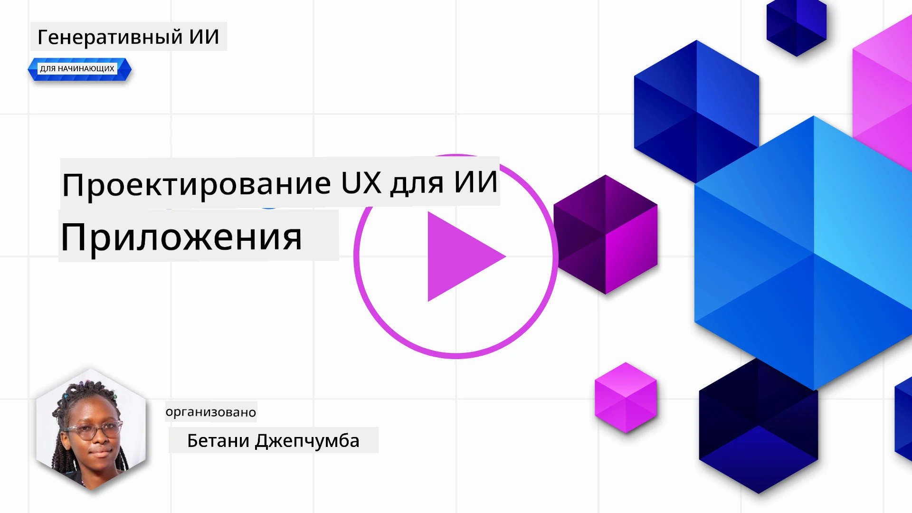
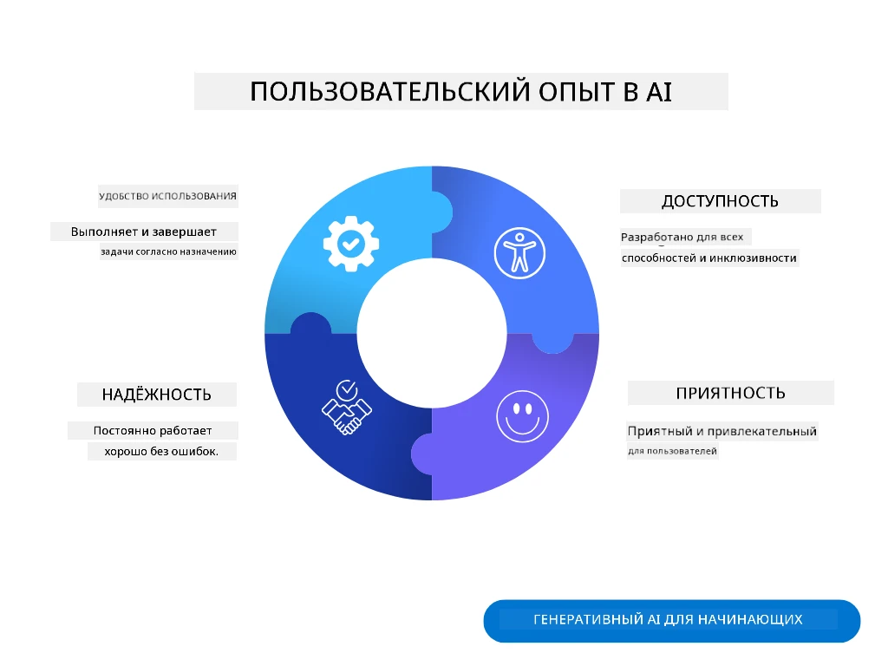
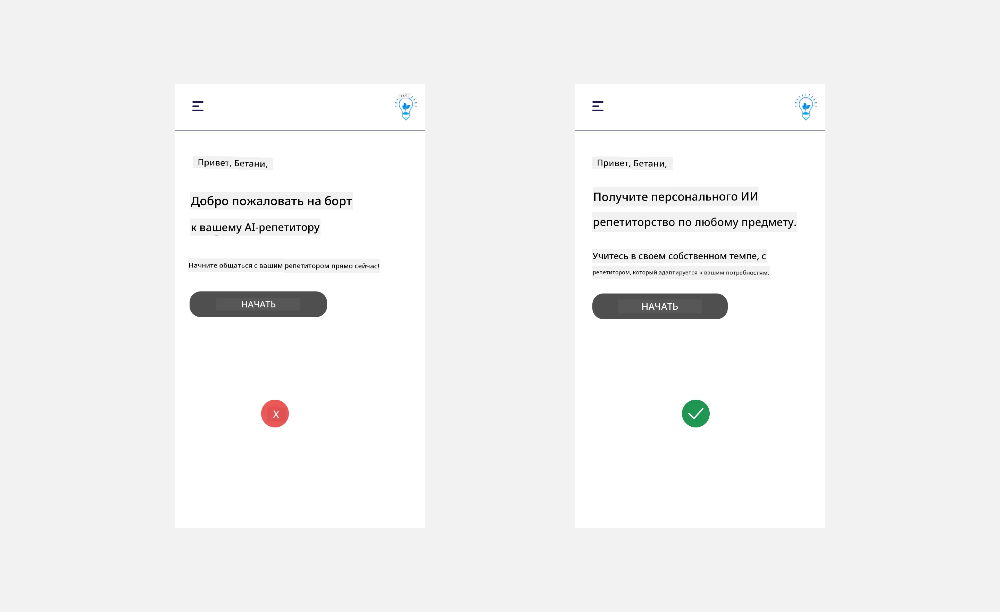
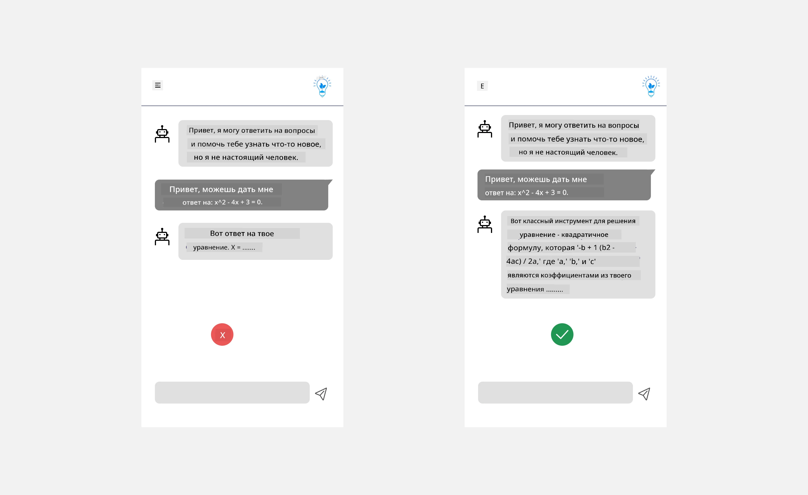
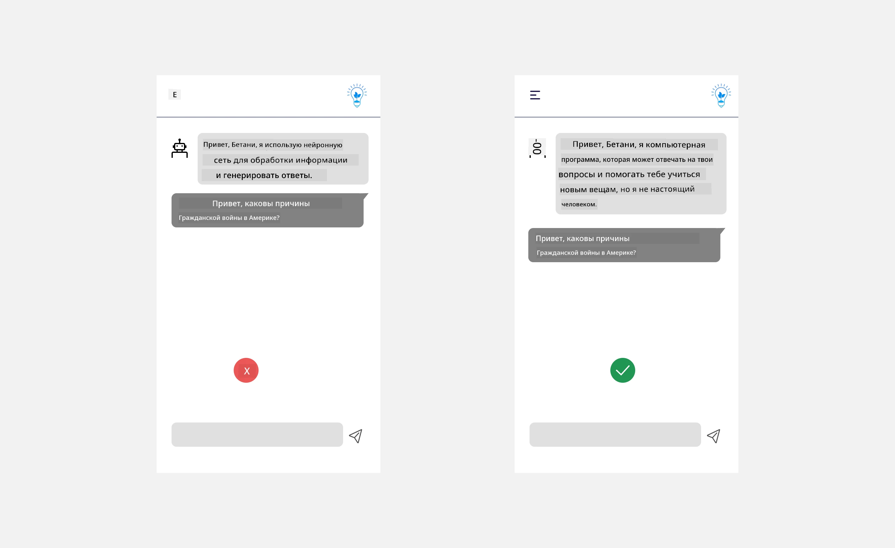
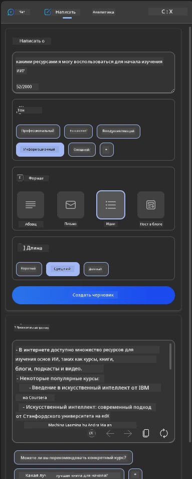
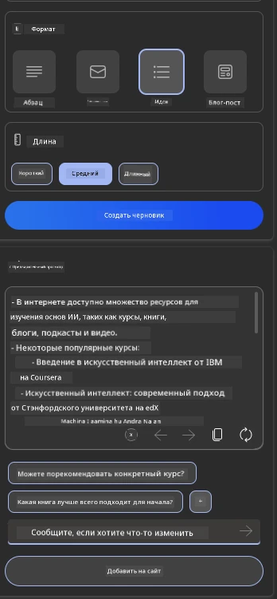
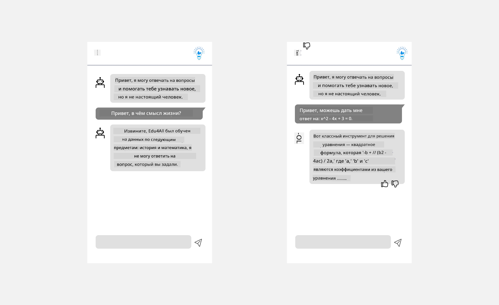

# Проектирование UX для приложений с ИИ

> _(Нажмите на изображение выше, чтобы посмотреть видео этого урока)_

Пользовательский опыт — очень важный аспект при создании приложений. Пользователи должны иметь возможность эффективно использовать ваше приложение для выполнения задач. Эффективность – это одно, но вы также должны проектировать приложения так, чтобы ими мог использоваться каждый, делая их _доступными_. Эта глава сфокусируется на этой области, чтобы вы в итоге создали приложение, которое люди смогут и захотят использовать.

## Введение

Пользовательский опыт — это то, как пользователь взаимодействует с конкретным продуктом или услугой, будь то система, инструмент или дизайн. При разработке приложений с ИИ разработчики не только стремятся обеспечить эффективный пользовательский опыт, но и этичный. В этом уроке мы рассмотрим, как создавать приложения искусственного интеллекта (ИИ), которые учитывают потребности пользователей.

В уроке будут рассмотрены следующие темы:

- Введение в пользовательский опыт и понимание потребностей пользователей
- Проектирование приложений с ИИ для доверия и прозрачности
- Проектирование приложений с ИИ для сотрудничества и обратной связи

## Цели обучения

После прохождения этого урока вы сможете:

- Понимать, как создавать приложения с ИИ, которые соответствуют потребностям пользователей.
- Проектировать приложения с ИИ, которые способствуют доверию и сотрудничеству.

### Предварительные знания

Найдите время и прочитайте больше о [пользовательском опыте и дизайн-мышлении.](https://learn.microsoft.com/training/modules/ux-design?WT.mc_id=academic-105485-koreyst)

## Введение в пользовательский опыт и понимание потребностей пользователей

В нашем вымышленном образовательном стартапе есть два основных типа пользователей — учителя и ученики. У каждого из них есть уникальные потребности. Ориентированный на пользователя дизайн ставит пользователя в приоритет, обеспечивая релевантность и пользу продукта для тех, для кого он предназначен.

Приложение должно быть **полезным, надежным, доступным и приятным**, чтобы обеспечить хороший пользовательский опыт.

### Удобство использования

Быть полезным означает, что приложение имеет функциональность, соответствующую его назначению, например автоматизация процесса оценки или создание карточек для повторения. Заявленное приложение для автоматизации оценки должно точно и эффективно выставлять оценки работам учеников в соответствии с заданными критериями. Аналогично, приложение для создания карточек для повторения должно создавать релевантные и разнообразные вопросы на основе своих данных.

### Надежность

Быть надежным означает, что приложение способно выполнять задачи стабильно и без ошибок. Однако ИИ, как и люди, не совершенен и может допускать ошибки. Приложения могут столкнуться с ошибками или непредвиденными ситуациями, требующими человеческого вмешательства или корректировки. Как вы обрабатываете ошибки? В последней части этого урока мы рассмотрим, как системы и приложения на базе ИИ проектируются для сотрудничества и получения обратной связи.

### Доступность

Быть доступным — значит расширять пользовательский опыт для пользователей с разными возможностями, включая людей с ограниченными возможностями, гарантируя, что никто не останется в стороне. Следуя рекомендациям и принципам доступности, решения на базе ИИ становятся более инклюзивными, удобными и полезными для всех пользователей.

### Приятность

Быть приятным — значит, что приложение доставляет удовольствие при использовании. Привлекательный пользовательский опыт может положительно влиять на пользователя, побуждая его возвращаться к приложению и увеличивая доходы.

Не каждую задачу можно решить с помощью ИИ. ИИ помогает дополнить пользовательский опыт, будь то автоматизация ручных задач или персонализация взаимодействия с пользователем.

## Проектирование приложений с ИИ для доверия и прозрачности

Построение доверия критично при проектировании приложений с ИИ. Доверие обеспечивает уверенность пользователя в том, что приложение выполнит свою работу, стабильно выдаст результаты и эти результаты соответствуют нуждам пользователя. Риски в этой области — недоверие и чрезмерное доверие. Недоверие возникает, когда пользователь почти не доверяет системе ИИ, что приводит к отказу от использования. Чрезмерное доверие — когда пользователь переоценивает возможности системы ИИ, что ведет к чрезмерному доверию к ней. Например, при чрезмерном доверии к системе автоматической оценки учитель может не проверять часть работ, полагаясь на систему. Это может привести к несправедливым или неточным оценкам, либо упущенным возможностям для обратной связи и улучшений.

Два способа сделать доверие центральным элементом дизайна — это объяснимость и контроль.

### Объяснимость

Когда ИИ помогает принимать решения, например, передавать знания будущим поколениям, важно, чтобы учителя и родители понимали, как принимаются решения. Это объяснимость — понимание процесса принятия решений приложениями ИИ. Проектирование с учетом объяснимости включает добавление деталей, показывающих, как ИИ пришел к результату. Аудитория должна знать, что результат сгенерирован ИИ, а не человеком. Например, вместо «Начните чат с вашим наставником сейчас» скажите «Используйте ИИ-наставника, который адаптируется к вашим потребностям и помогает учиться в вашем темпе».

Другой пример — как ИИ использует пользовательские и личные данные. Например, у пользователя с ролью «ученик» могут быть ограничения, связанные с его ролью. ИИ может не раскрывать ответы на вопросы, но помогать направлять пользователя в размышлениях, как решить проблему самостоятельно.

Еще один ключевой аспект объяснимости — упрощение объяснений. Ученики и учителя могут не быть экспертами в области ИИ, поэтому объяснения возможностей и ограничений приложения должны быть простыми и понятными.

### Контроль

Генеративный ИИ создает сотрудничество между ИИ и пользователем, где, например, пользователь может изменять запросы для получения разных результатов. Кроме того, после генерации результата пользователь должен иметь возможность изменить его, получая ощущение контроля. Например, при использовании Microsoft Copilot (ранее Bing Chat) вы можете настроить запрос по формату, тону и длине. Также можно вносить изменения в результат, как показано ниже:

Еще одна функция Microsoft Copilot, дающая пользователю контроль над приложением — возможность включения и отключения использования данных ИИ. В школьном приложении ученик может захотеть использовать свои заметки, а также ресурсы учителей для повторения материала.

> При проектировании приложений с ИИ ключевым является осознанность, чтобы пользователи не переоценивали возможности, создавая нереалистичные ожидания. Один из способов — создать трение между запросами и результатами, напоминая пользователю, что это ИИ, а не другой человек.

## Проектирование приложений с ИИ для сотрудничества и обратной связи

Как уже упоминалось, генеративный ИИ создаёт сотрудничество между пользователем и ИИ. Чаще всего пользователь вводит запрос, а ИИ генерирует ответ. Что если ответ неверный? Как приложение обрабатывает ошибки? Обвиняет ли ИИ пользователя или объясняет ошибку?

Приложения с ИИ должны быть построены так, чтобы принимать и предоставлять обратную связь. Это помогает не только улучшать ИИ-систему, но и развивать доверие пользователей. В дизайн должна быть включена петля обратной связи, например простая оценка результата «пальцем вверх» или «пальцем вниз».

Еще один способ — четко сообщать о возможностях и ограничениях системы. Если пользователь ошибается, запрашивая что-то, что выходит за возможности ИИ, должен быть способ корректно обработать эту ситуацию, как показано ниже.

Системные ошибки — обычное дело в приложениях, в которых пользователь может нуждаться в помощи с данными вне рамок ИИ, либо приложение ограничено по числу вопросов или предметов, для которых можно генерировать резюме. Например, приложение ИИ, обученное на ограниченном числе предметов, например, История и Математика, может не знать ответов на вопросы по Географии. Чтобы минимизировать это, система может выдать ответ типа: «Извините, наш продукт обучен на данных по следующим предметам..., я не могу ответить на ваш вопрос.»

Приложения с ИИ несовершенны и могут допускать ошибки. При проектировании приложений следует предусмотреть возможность обратной связи от пользователей и обработку ошибок простым и понятным способом.

## Задание

Возьмите любые приложения с ИИ, которые вы уже создали, и подумайте о внедрении следующих шагов в ваше приложение:

- **Приятность:** Подумайте, как сделать приложение приятнее. Добавляете ли вы везде объяснения? Побуждаете ли пользователя к исследованию? Как сформулированы сообщения об ошибках?

- **Удобство использования:** Разрабатываете веб-приложение. Убедитесь, что им можно навигировать как мышью, так и клавиатурой.

- **Доверие и прозрачность:** Не доверяйте ИИ полностью и его результатам, подумайте, как добавить человека для проверки результата. Также подумайте и реализуйте другие способы достижения доверия и прозрачности.

- **Контроль:** Дайте пользователю контроль над данными, которые он предоставляет приложению. Реализуйте возможность пользователя включать и отключать сбор данных в приложении с ИИ.

<!-- ## [Post-lecture quiz](../../../12-designing-ux-for-ai-applications/quiz-url) -->

## Продолжайте обучение!

После завершения этого урока ознакомьтесь с нашей [коллекцией по генеративному ИИ](https://aka.ms/genai-collection?WT.mc_id=academic-105485-koreyst), чтобы продолжить совершенствоваться в генеративном ИИ!

Переходите к уроку 13, где мы рассмотрим, как [обеспечить безопасность приложений с ИИ](../13-securing-ai-applications/README.md?WT.mc_id=academic-105485-koreyst)!

---

<!-- CO-OP TRANSLATOR DISCLAIMER START -->
**Отказ от ответственности**:
Этот документ был переведен с использованием сервиса машинного перевода [Co-op Translator](https://github.com/Azure/co-op-translator). Несмотря на наши усилия по обеспечению точности, имейте в виду, что автоматический перевод может содержать ошибки или неточности. Оригинальный документ на его исходном языке следует считать авторитетным источником. Для получения критически важной информации рекомендуется обратиться к профессиональному человеческому переводу. Мы не несем ответственности за любые недоразумения или неправильные толкования, возникшие в результате использования этого перевода.
<!-- CO-OP TRANSLATOR DISCLAIMER END -->