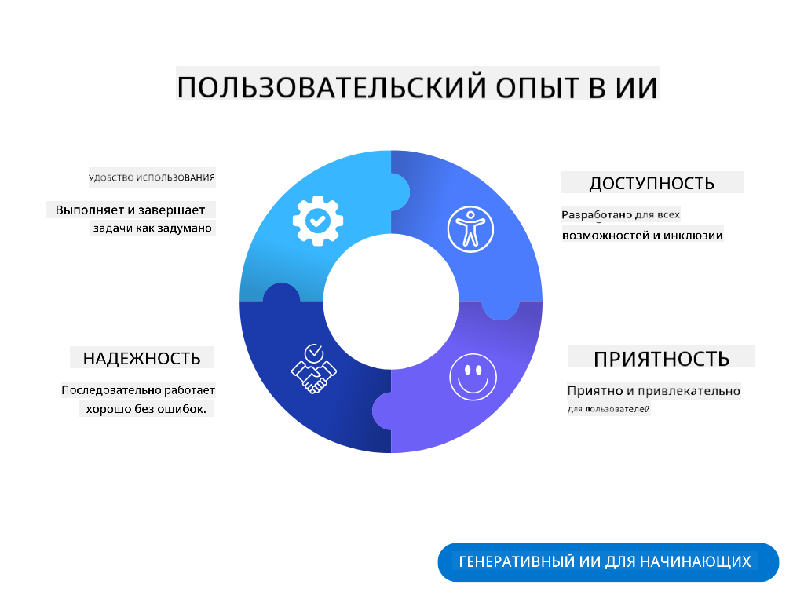

<!--
CO_OP_TRANSLATOR_METADATA:
{
  "original_hash": "ec385b41ee50579025d50cc03bfb3a25",
  "translation_date": "2025-07-09T14:49:11+00:00",
  "source_file": "12-designing-ux-for-ai-applications/README.md",
  "language_code": "ru"
}
-->
# Проектирование UX для AI-приложений

> _(Нажмите на изображение выше, чтобы посмотреть видео этого урока)_

Пользовательский опыт — очень важный аспект при создании приложений. Пользователи должны иметь возможность эффективно использовать ваше приложение для выполнения задач. Эффективность — это одно, но также нужно проектировать приложения так, чтобы ими могли пользоваться все, делая их _доступными_. В этой главе мы сосредоточимся именно на этом, чтобы в итоге вы создали приложение, которое люди смогут и захотят использовать.

## Введение

Пользовательский опыт — это то, как пользователь взаимодействует и использует конкретный продукт или услугу, будь то система, инструмент или дизайн. При разработке AI-приложений разработчики уделяют внимание не только эффективности пользовательского опыта, но и этичности. В этом уроке мы рассмотрим, как создавать приложения с искусственным интеллектом (AI), которые отвечают потребностям пользователей.

В уроке будут рассмотрены следующие темы:

- Введение в пользовательский опыт и понимание потребностей пользователей
- Проектирование AI-приложений с учетом доверия и прозрачности
- Проектирование AI-приложений для сотрудничества и обратной связи

## Цели обучения

После прохождения этого урока вы сможете:

- Понимать, как создавать AI-приложения, которые удовлетворяют потребности пользователей.
- Проектировать AI-приложения, способствующие доверию и сотрудничеству.

### Предварительные знания

Выделите время и прочитайте больше о [пользовательском опыте и дизайн-мышлении.](https://learn.microsoft.com/training/modules/ux-design?WT.mc_id=academic-105485-koreyst)

## Введение в пользовательский опыт и понимание потребностей пользователей

В нашем вымышленном образовательном стартапе есть два основных типа пользователей — учителя и студенты. У каждого из них свои уникальные потребности. Ориентированный на пользователя дизайн ставит пользователя в центр внимания, обеспечивая релевантность и пользу продуктов для тех, для кого они предназначены.

Приложение должно быть **полезным, надежным, доступным и приятным** для обеспечения хорошего пользовательского опыта.

### Удобство использования

Полезность означает, что приложение обладает функционалом, соответствующим его назначению, например, автоматизация процесса оценки или создание карточек для повторения. Приложение, автоматизирующее оценивание, должно точно и эффективно выставлять оценки работам студентов на основе заранее заданных критериев. Аналогично, приложение для создания карточек должно генерировать релевантные и разнообразные вопросы на основе имеющихся данных.

### Надежность

Надежность означает, что приложение способно выполнять свои задачи стабильно и без ошибок. Однако AI, как и люди, не совершенен и может допускать ошибки. Приложения могут столкнуться с ошибками или непредвиденными ситуациями, требующими вмешательства или корректировки человеком. Как вы справляетесь с ошибками? В последнем разделе урока мы рассмотрим, как проектировать AI-системы и приложения для сотрудничества и обратной связи.

### Доступность

Доступность означает расширение пользовательского опыта на пользователей с разными возможностями, включая людей с ограниченными возможностями, чтобы никто не остался в стороне. Следуя принципам и рекомендациям по доступности, AI-решения становятся более инклюзивными, удобными и полезными для всех пользователей.

### Приятность использования

Приятность означает, что приложение доставляет удовольствие при использовании. Привлекательный пользовательский опыт положительно влияет на пользователя, побуждая его возвращаться к приложению и увеличивая доходы бизнеса.

Не все задачи можно решить с помощью AI. AI дополняет ваш пользовательский опыт, автоматизируя рутинные задачи или персонализируя взаимодействие.

## Проектирование AI-приложений с учетом доверия и прозрачности

Построение доверия — ключевой момент при проектировании AI-приложений. Доверие гарантирует, что пользователь уверен: приложение выполнит работу, будет стабильно выдавать результаты, и эти результаты соответствуют его потребностям. Риски в этой области — недоверие и избыточное доверие. Недоверие возникает, когда пользователь почти не доверяет AI-системе, что ведет к отказу от использования приложения. Избыточное доверие — когда пользователь переоценивает возможности AI, что приводит к чрезмерному доверию. Например, при избыточном доверии к автоматизированной системе оценивания учитель может не проверять некоторые работы, что приведет к несправедливым или неточным оценкам, а также упущенным возможностям для обратной связи и улучшения.

Два способа обеспечить, чтобы доверие было в центре дизайна — это объяснимость и контроль.

### Объяснимость

Когда AI помогает принимать решения, например, передавать знания будущим поколениям, важно, чтобы учителя и родители понимали, как принимаются решения AI. Это и есть объяснимость — понимание того, как AI-приложения принимают решения. Проектирование с учетом объяснимости включает добавление примеров того, что может делать AI-приложение. Например, вместо «Начать работу с AI-учителем» система может использовать: «Сократите свои заметки для удобного повторения с помощью AI.»

Другой пример — как AI использует пользовательские и личные данные. Например, у пользователя с ролью студента могут быть ограничения, основанные на его роли. AI может не раскрывать ответы на вопросы, но поможет направить пользователя, чтобы он сам подумал, как решить задачу.

Еще один важный аспект объяснимости — упрощение объяснений. Студенты и учителя могут не быть экспертами в AI, поэтому объяснения того, что приложение может или не может делать, должны быть простыми и понятными.

### Контроль

Генеративный AI создает сотрудничество между AI и пользователем, где, например, пользователь может изменять запросы для получения разных результатов. Кроме того, после генерации результата пользователи должны иметь возможность его редактировать, что дает им ощущение контроля. Например, при использовании Bing вы можете настроить запрос по формату, тону и длине. Также можно вносить изменения в результат, как показано ниже:

Еще одна функция Bing, дающая пользователю контроль над приложением — возможность согласиться или отказаться от использования данных AI. В школьном приложении студент может захотеть использовать свои заметки, а также ресурсы учителей для повторения.

> При проектировании AI-приложений важно намеренно избегать избыточного доверия, чтобы не создавать нереалистичных ожиданий от возможностей системы. Один из способов — создавать «трение» между запросами и результатами, напоминая пользователю, что это AI, а не живой человек.

## Проектирование AI-приложений для сотрудничества и обратной связи

Как уже упоминалось, генеративный AI создает сотрудничество между пользователем и AI. Большинство взаимодействий — это ввод пользователем запроса и генерация результата AI. Что если результат неверен? Как приложение справляется с ошибками? Обвиняет ли AI пользователя или объясняет ошибку?

AI-приложения должны быть построены так, чтобы принимать и давать обратную связь. Это не только помогает системе AI улучшаться, но и укрепляет доверие пользователей. В дизайне должен быть предусмотрен цикл обратной связи, например, простая оценка результата «палец вверх» или «палец вниз».

Еще один способ — четко сообщать о возможностях и ограничениях системы. Если пользователь ошибается, запрашивая что-то, что выходит за рамки возможностей AI, должна быть предусмотрена обработка таких случаев, как показано ниже.

Системные ошибки — обычное дело в приложениях, когда пользователю может понадобиться помощь с информацией вне сферы AI, или когда есть ограничение на количество вопросов/тем для создания резюме. Например, AI-приложение, обученное на ограниченных предметах, например, истории и математике, может не справиться с вопросами по географии. Чтобы смягчить это, AI может ответить так: «Извините, наш продукт обучен на данных по следующим предметам..., я не могу ответить на ваш вопрос.»

AI-приложения не идеальны, поэтому ошибки неизбежны. При проектировании приложений важно предусмотреть возможность обратной связи от пользователей и обработку ошибок простым и понятным способом.

## Задание

Возьмите любое AI-приложение, которое вы уже создали, и подумайте о внедрении следующих шагов:

- **Приятность:** Подумайте, как сделать ваше приложение более приятным. Добавляете ли вы объяснения повсюду? Поощряете ли пользователя исследовать? Как сформулированы ваши сообщения об ошибках?

- **Удобство использования:** Создавая веб-приложение, убедитесь, что им можно управлять как мышью, так и клавиатурой.

- **Доверие и прозрачность:** Не доверяйте AI и его результатам полностью, подумайте, как можно добавить человека в процесс для проверки результатов. Также рассмотрите и реализуйте другие способы достижения доверия и прозрачности.

- **Контроль:** Дайте пользователю контроль над данными, которые он предоставляет приложению. Реализуйте возможность согласия и отказа от сбора данных в AI-приложении.

## Продолжайте обучение!

После завершения этого урока ознакомьтесь с нашей [коллекцией по генеративному AI](https://aka.ms/genai-collection?WT.mc_id=academic-105485-koreyst), чтобы продолжить развивать свои знания в области генеративного AI!

Перейдите к уроку 13, где мы рассмотрим, как [обеспечить безопасность AI-приложений](../13-securing-ai-applications/README.md?WT.mc_id=academic-105485-koreyst)!

**Отказ от ответственности**:  
Этот документ был переведен с помощью сервиса автоматического перевода [Co-op Translator](https://github.com/Azure/co-op-translator). Несмотря на наши усилия по обеспечению точности, просим учитывать, что автоматический перевод может содержать ошибки или неточности. Оригинальный документ на его исходном языке следует считать авторитетным источником. Для получения критически важной информации рекомендуется обращаться к профессиональному переводу, выполненному человеком. Мы не несем ответственности за любые недоразумения или неправильные толкования, возникшие в результате использования данного перевода.