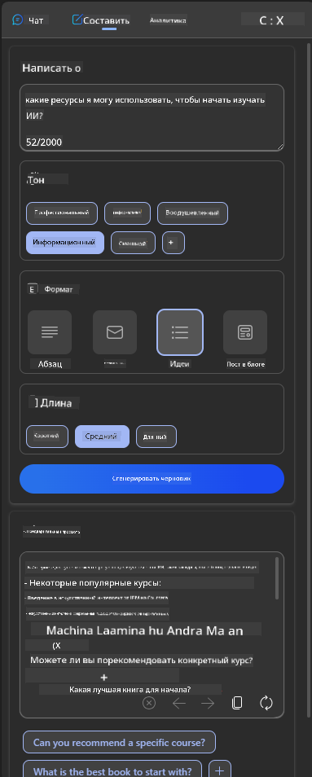
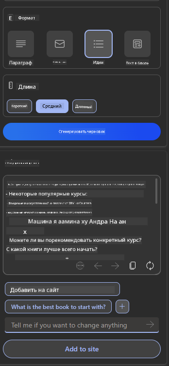

<!--
CO_OP_TRANSLATOR_METADATA:
{
  "original_hash": "78bbeed50fd4dc9fdee931f5daf98cb3",
  "translation_date": "2025-10-17T15:02:07+00:00",
  "source_file": "12-designing-ux-for-ai-applications/README.md",
  "language_code": "ru"
}
-->
# Проектирование UX для приложений с ИИ

> _(Нажмите на изображение выше, чтобы посмотреть видео этого урока)_

Пользовательский опыт — это очень важный аспект создания приложений. Пользователи должны иметь возможность эффективно использовать ваше приложение для выполнения задач. Эффективность — это одно, но также важно проектировать приложения так, чтобы они были доступны для всех, делая их _доступными_. Эта глава сосредоточится на этой области, чтобы вы смогли создать приложение, которое люди смогут и захотят использовать.

## Введение

Пользовательский опыт — это то, как пользователь взаимодействует с конкретным продуктом или услугой, будь то система, инструмент или дизайн. При разработке приложений с ИИ разработчики сосредотачиваются не только на том, чтобы пользовательский опыт был эффективным, но и на том, чтобы он был этичным. В этом уроке мы рассмотрим, как создавать приложения с искусственным интеллектом (ИИ), которые отвечают потребностям пользователей.

Урок охватывает следующие области:

- Введение в пользовательский опыт и понимание потребностей пользователей
- Проектирование приложений с ИИ для доверия и прозрачности
- Проектирование приложений с ИИ для сотрудничества и обратной связи

## Цели обучения

После прохождения этого урока вы сможете:

- Понять, как создавать приложения с ИИ, которые соответствуют потребностям пользователей.
- Проектировать приложения с ИИ, которые способствуют доверию и сотрудничеству.

### Предварительные знания

Уделите время и прочитайте больше о [пользовательском опыте и дизайн-мышлении.](https://learn.microsoft.com/training/modules/ux-design?WT.mc_id=academic-105485-koreyst)

## Введение в пользовательский опыт и понимание потребностей пользователей

В нашем вымышленном образовательном стартапе есть два основных типа пользователей: учителя и студенты. У каждого из них свои уникальные потребности. Дизайн, ориентированный на пользователя, ставит его в центр внимания, гарантируя, что продукты будут актуальными и полезными для тех, для кого они предназначены.

Приложение должно быть **полезным, надежным, доступным и приятным**, чтобы обеспечить хороший пользовательский опыт.

### Полезность

Полезность означает, что приложение обладает функциональностью, соответствующей его назначению, например, автоматизация процесса оценки или создание карточек для повторения материала. Приложение, которое автоматизирует процесс оценки, должно точно и эффективно выставлять оценки за работы студентов на основе заранее определенных критериев. Аналогично, приложение, которое создает карточки для повторения, должно генерировать релевантные и разнообразные вопросы на основе имеющихся данных.

### Надежность

Надежность означает, что приложение может выполнять свои задачи стабильно и без ошибок. Однако ИИ, как и люди, не совершенен и может быть подвержен ошибкам. Приложения могут сталкиваться с ошибками или неожиданными ситуациями, требующими вмешательства или исправления со стороны человека. Как вы справляетесь с ошибками? В последнем разделе этого урока мы рассмотрим, как системы и приложения с ИИ проектируются для сотрудничества и обратной связи.

### Доступность

Доступность означает расширение пользовательского опыта для пользователей с различными возможностями, включая людей с ограниченными возможностями, чтобы никто не остался в стороне. Следуя принципам и рекомендациям по доступности, решения с ИИ становятся более инклюзивными, удобными и полезными для всех пользователей.

### Приятность

Приятность означает, что приложение доставляет удовольствие в использовании. Привлекательный пользовательский опыт может положительно повлиять на пользователя, побуждая его возвращаться к приложению и увеличивая доход компании.

Не каждую задачу можно решить с помощью ИИ. ИИ используется для улучшения пользовательского опыта, будь то автоматизация ручных задач или персонализация пользовательского опыта.

## Проектирование приложений с ИИ для доверия и прозрачности

Создание доверия является ключевым при проектировании приложений с ИИ. Доверие гарантирует, что пользователь уверен в том, что приложение выполнит задачу, будет стабильно выдавать результаты, и эти результаты будут соответствовать потребностям пользователя. Риск в этой области заключается в недоверии и чрезмерном доверии. Недоверие возникает, когда пользователь мало или совсем не доверяет системе ИИ, что приводит к отказу от использования вашего приложения. Чрезмерное доверие возникает, когда пользователь переоценивает возможности системы ИИ, слишком сильно доверяя ей. Например, автоматизированная система оценки в случае чрезмерного доверия может привести к тому, что учитель не будет проверять некоторые работы, чтобы убедиться, что система оценки работает корректно. Это может привести к несправедливым или неточным оценкам для студентов или упущенным возможностям для обратной связи и улучшения.

Два способа гарантировать, что доверие находится в центре дизайна, — это объяснимость и контроль.

### Объяснимость

Когда ИИ помогает принимать решения, такие как передача знаний будущим поколениям, важно, чтобы учителя и родители понимали, как принимаются решения ИИ. Это и есть объяснимость — понимание того, как приложения с ИИ принимают решения. Проектирование с учетом объяснимости включает добавление деталей, которые подчеркивают, как ИИ пришел к результату. Аудитория должна знать, что результат был создан ИИ, а не человеком. Например, вместо "Начните общение с вашим репетитором прямо сейчас" лучше сказать "Используйте ИИ-репетитора, который адаптируется к вашим потребностям и помогает вам учиться в вашем темпе."

Еще один пример — как ИИ использует пользовательские и персональные данные. Например, пользователь с персоной "студент" может иметь ограничения, связанные с его ролью. ИИ может не раскрывать ответы на вопросы, но может помочь пользователю подумать, как он может решить проблему.

Последний важный аспект объяснимости — упрощение объяснений. Студенты и учителя могут не быть экспертами в области ИИ, поэтому объяснения о том, что приложение может или не может делать, должны быть простыми и понятными.

### Контроль

Генеративный ИИ создает сотрудничество между ИИ и пользователем, где, например, пользователь может изменять запросы для получения различных результатов. Кроме того, после генерации результата пользователи должны иметь возможность изменять его, что дает им чувство контроля. Например, при использовании Bing вы можете настроить свой запрос по формату, тону и длине. Также вы можете внести изменения в результат и модифицировать его, как показано ниже:

Еще одна функция Bing, которая позволяет пользователю контролировать приложение, — это возможность включать и отключать использование данных ИИ. Например, студент может захотеть использовать свои заметки, а также ресурсы учителя в качестве материала для повторения.

> При проектировании приложений с ИИ важно намеренно избегать чрезмерного доверия, создавая нереалистичные ожидания от его возможностей. Один из способов сделать это — создать трение между запросами и результатами, напоминая пользователю, что это ИИ, а не человек.

## Проектирование приложений с ИИ для сотрудничества и обратной связи

Как уже упоминалось, генеративный ИИ создает сотрудничество между пользователем и ИИ. Большинство взаимодействий происходит, когда пользователь вводит запрос, а ИИ генерирует результат. Что если результат неверен? Как приложение справляется с ошибками, если они возникают? Обвиняет ли ИИ пользователя или объясняет ошибку?

Приложения с ИИ должны быть разработаны так, чтобы принимать и предоставлять обратную связь. Это не только помогает системе ИИ улучшаться, но и укрепляет доверие пользователей. В дизайн должен быть включен цикл обратной связи, например, простая кнопка "палец вверх" или "палец вниз" на результат.

Еще один способ справляться с этим — четко сообщать о возможностях и ограничениях системы. Когда пользователь допускает ошибку, запрашивая что-то, выходящее за рамки возможностей ИИ, должна быть предусмотрена возможность справляться с этим, как показано ниже.

Ошибки системы часто встречаются в приложениях, где пользователю может понадобиться информация вне области действия ИИ, или приложение может иметь ограничение на количество вопросов/предметов, для которых пользователь может генерировать резюме. Например, приложение с ИИ, обученное на данных по ограниченному количеству предметов, например, Истории и Математике, может не справляться с вопросами по Географии. Чтобы смягчить это, система ИИ может дать ответ, например: "Извините, наш продукт был обучен на данных по следующим предметам....., я не могу ответить на ваш вопрос."

Приложения с ИИ не совершенны, поэтому они склонны к ошибкам. При проектировании ваших приложений вы должны предусмотреть возможность обратной связи от пользователей и обработку ошибок таким образом, чтобы это было просто и понятно.

## Задание

Возьмите любое приложение с ИИ, которое вы уже создали, и подумайте о внедрении следующих шагов в ваше приложение:

- **Приятность:** Подумайте, как сделать ваше приложение более приятным. Добавляете ли вы объяснения везде? Поощряете ли вы пользователя к исследованию? Как вы формулируете сообщения об ошибках?

- **Полезность:** Если вы создаете веб-приложение, убедитесь, что оно доступно как для управления мышью, так и с клавиатуры.

- **Доверие и прозрачность:** Не доверяйте ИИ полностью и его результатам, подумайте, как вы могли бы добавить человека в процесс для проверки результата. Также подумайте и внедрите другие способы достижения доверия и прозрачности.

- **Контроль:** Дайте пользователю контроль над данными, которые он предоставляет приложению. Реализуйте способ, позволяющий пользователю включать и отключать сбор данных в приложении с ИИ.

<!-- ## [Викторина после лекции](../../../12-designing-ux-for-ai-applications/quiz-url) -->

## Продолжайте обучение!

После завершения этого урока ознакомьтесь с нашей [коллекцией обучения генеративному ИИ](https://aka.ms/genai-collection?WT.mc_id=academic-105485-koreyst), чтобы продолжить углублять свои знания о генеративном ИИ!

Перейдите к уроку 13, где мы рассмотрим [защиту приложений с ИИ](../13-securing-ai-applications/README.md?WT.mc_id=academic-105485-koreyst)!

---

**Отказ от ответственности**:  
Этот документ был переведен с использованием сервиса автоматического перевода [Co-op Translator](https://github.com/Azure/co-op-translator). Несмотря на наши усилия обеспечить точность, автоматические переводы могут содержать ошибки или неточности. Оригинальный документ на его родном языке следует считать авторитетным источником. Для получения критически важной информации рекомендуется профессиональный перевод человеком. Мы не несем ответственности за любые недоразумения или неправильные интерпретации, возникающие в результате использования данного перевода.