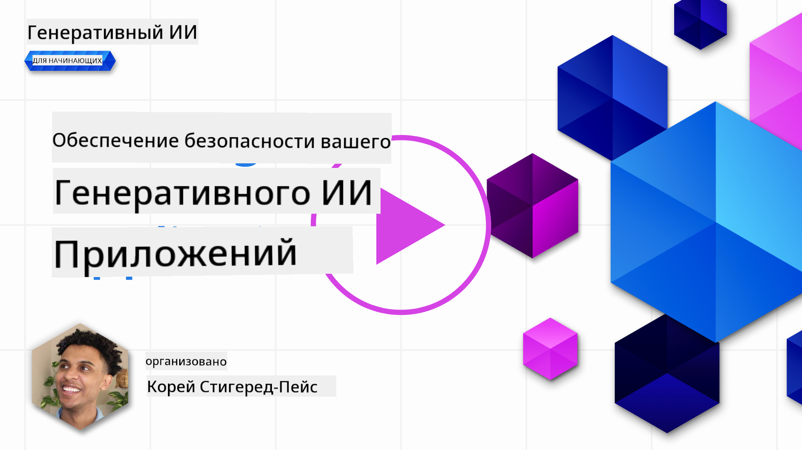
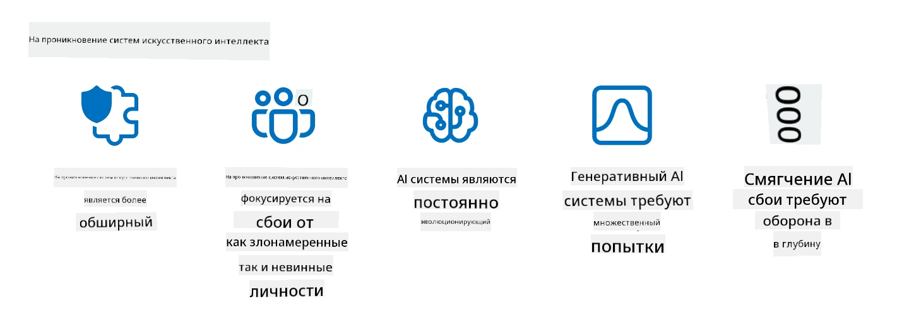

<!--
CO_OP_TRANSLATOR_METADATA:
{
  "original_hash": "f3cac698e9eea47dd563633bd82daf8c",
  "translation_date": "2025-05-19T22:15:47+00:00",
  "source_file": "13-securing-ai-applications/README.md",
  "language_code": "ru"
}
-->
# Защита ваших приложений с генеративным ИИ

## Введение

В этом уроке будет рассмотрено:

- Безопасность в контексте систем ИИ.
- Распространенные риски и угрозы для систем ИИ.
- Методы и соображения по обеспечению безопасности систем ИИ.

## Цели обучения

После завершения этого урока вы поймете:

- Угрозы и риски для систем ИИ.
- Общие методы и практики для обеспечения безопасности систем ИИ.
- Как внедрение тестирования безопасности может предотвратить неожиданные результаты и подрыв доверия пользователей.

## Что означает безопасность в контексте генеративного ИИ?

Поскольку технологии Искусственного Интеллекта (ИИ) и Машинного Обучения (МО) все больше формируют нашу жизнь, важно защищать не только данные клиентов, но и сами системы ИИ. ИИ/МО все чаще используется для поддержки принятия важных решений в отраслях, где ошибочное решение может привести к серьезным последствиям.

Вот ключевые моменты, которые следует учитывать:

- **Влияние ИИ/МО**: ИИ/МО оказывают значительное влияние на повседневную жизнь, и поэтому их защита стала необходимостью.
- **Проблемы безопасности**: Это влияние ИИ/МО требует должного внимания для защиты ИИ-продуктов от сложных атак, будь то со стороны троллей или организованных групп.
- **Стратегические проблемы**: Технологическая индустрия должна проактивно решать стратегические задачи, чтобы обеспечить долгосрочную безопасность клиентов и защиту данных.

Кроме того, модели Машинного Обучения в значительной степени не могут различать вредоносные и доброкачественные аномальные данные. Значительная часть обучающих данных поступает из некурируемых, немодерируемых, публичных наборов данных, которые открыты для сторонних вкладов. Злоумышленникам не нужно компрометировать наборы данных, если они могут свободно вносить в них изменения. Со временем данные с низкой достоверностью могут стать данными с высокой достоверностью, если структура/формат данных остается правильным.

Поэтому критически важно обеспечить целостность и защиту хранилищ данных, которые ваши модели используют для принятия решений.

## Понимание угроз и рисков ИИ

В контексте ИИ и связанных с ним систем, отравление данных выделяется как самая значительная угроза безопасности на сегодняшний день. Отравление данных происходит, когда кто-то намеренно изменяет информацию, используемую для обучения ИИ, вызывая ошибки в его работе. Это связано с отсутствием стандартизированных методов обнаружения и смягчения последствий, а также нашей зависимостью от ненадежных или некурируемых публичных наборов данных для обучения. Чтобы поддерживать целостность данных и предотвратить ошибочный процесс обучения, важно отслеживать происхождение и родословную ваших данных. В противном случае старое высказывание «мусор на входе, мусор на выходе» окажется правдой, что приведет к ухудшению производительности модели.

Вот примеры того, как отравление данных может повлиять на ваши модели:

1. **Переключение меток**: В задаче бинарной классификации противник намеренно меняет метки небольшой части обучающих данных. Например, доброкачественные образцы помечаются как вредоносные, заставляя модель усваивать неправильные ассоциации.\
   **Пример**: Спам-фильтр ошибочно классифицирует легитимные письма как спам из-за манипулированных меток.
2. **Отравление признаков**: Злоумышленник незаметно изменяет признаки в обучающих данных, чтобы ввести предвзятость или ввести модель в заблуждение.\
   **Пример**: Добавление нерелевантных ключевых слов в описания продуктов для манипулирования системами рекомендаций.
3. **Инъекция данных**: Введение вредоносных данных в обучающий набор для влияния на поведение модели.\
   **Пример**: Введение фальшивых отзывов пользователей для искажения результатов анализа настроений.
4. **Атаки с использованием бэкдоров**: Противник вставляет скрытый шаблон (бэкдор) в обучающие данные. Модель учится распознавать этот шаблон и ведет себя вредоносно, когда он активируется.\
   **Пример**: Система распознавания лиц, обученная на изображениях с бэкдорами, ошибочно идентифицирует конкретного человека.

Корпорация MITRE создала [ATLAS (Ландшафт угроз для систем Искусственного Интеллекта)](https://atlas.mitre.org/?WT.mc_id=academic-105485-koreyst), базу знаний о тактиках и методах, используемых противниками в реальных атаках на системы ИИ.

> Увеличивается количество уязвимостей в системах с поддержкой ИИ, поскольку внедрение ИИ увеличивает поверхность атаки существующих систем за пределы традиционных кибератак. Мы разработали ATLAS, чтобы повысить осведомленность об этих уникальных и развивающихся уязвимостях, поскольку мировое сообщество все больше внедряет ИИ в различные системы. ATLAS моделируется по аналогии с фреймворком MITRE ATT&CK® и его тактики, техники и процедуры (TTPs) дополняют те, что в ATT&CK.

Подобно фреймворку MITRE ATT&CK®, который широко используется в традиционной кибербезопасности для планирования сценариев эмуляции продвинутых угроз, ATLAS предоставляет легко доступный набор TTPs, который может помочь лучше понять и подготовиться к защите от возникающих атак.

Кроме того, проект Open Web Application Security Project (OWASP) создал "[Топ-10 список](https://llmtop10.com/?WT.mc_id=academic-105485-koreyst)" самых критических уязвимостей, обнаруженных в приложениях, использующих LLM. Список подчеркивает риски угроз, таких как упомянутое отравление данных, а также других, таких как:

- **Инъекция подсказок**: техника, при которой злоумышленники манипулируют Большой Языковой Моделью (LLM) через тщательно подобранные входные данные, заставляя ее вести себя вне ее предполагаемого поведения.
- **Уязвимости цепочки поставок**: Компоненты и программное обеспечение, которые составляют приложения, используемые LLM, такие как модули Python или внешние наборы данных, сами могут быть скомпрометированы, что приводит к неожиданным результатам, введению предвзятости и даже уязвимостям в базовой инфраструктуре.
- **Чрезмерная зависимость**: LLM подвержены ошибкам и склонны к галлюцинациям, предоставляя неточные или небезопасные результаты. В нескольких документированных случаях люди воспринимали результаты за чистую монету, что приводило к непреднамеренным негативным последствиям в реальном мире.

Эксперт по облачным технологиям Microsoft Род Трент написал бесплатную электронную книгу, [Необходимо изучить безопасность ИИ](https://github.com/rod-trent/OpenAISecurity/tree/main/Must_Learn/Book_Version?WT.mc_id=academic-105485-koreyst), в которой подробно рассматриваются эти и другие возникающие угрозы ИИ и предоставляются обширные рекомендации о том, как лучше всего справляться с этими сценариями.

## Тестирование безопасности для систем ИИ и LLM

Искусственный интеллект (ИИ) трансформирует различные области и отрасли, предлагая новые возможности и преимущества для общества. Однако ИИ также представляет значительные проблемы и риски, такие как конфиденциальность данных, предвзятость, отсутствие объяснимости и потенциальное злоупотребление. Поэтому важно обеспечить, чтобы системы ИИ были безопасными и ответственными, что означает, что они соответствуют этическим и правовым стандартам и могут быть доверены пользователями и заинтересованными сторонами.

Тестирование безопасности — это процесс оценки безопасности системы ИИ или LLM путем выявления и использования их уязвимостей. Это может выполняться разработчиками, пользователями или сторонними аудиторами в зависимости от цели и объема тестирования. Некоторые из наиболее распространенных методов тестирования безопасности для систем ИИ и LLM:

- **Очистка данных**: это процесс удаления или анонимизации конфиденциальной или личной информации из обучающих данных или входных данных системы ИИ или LLM. Очистка данных может помочь предотвратить утечку данных и вредоносные манипуляции, снижая воздействие конфиденциальных или личных данных.
- **Адаптационное тестирование**: это процесс создания и применения адаптационных примеров к входным или выходным данным системы ИИ или LLM для оценки ее устойчивости и надежности против адаптационных атак. Адаптационное тестирование может помочь выявить и смягчить уязвимости и слабости системы ИИ или LLM, которые могут быть использованы злоумышленниками.
- **Проверка модели**: это процесс проверки правильности и полноты параметров модели или архитектуры системы ИИ или LLM. Проверка модели может помочь обнаружить и предотвратить кражу модели, гарантируя, что модель защищена и аутентифицирована.
- **Валидация выхода**: это процесс проверки качества и надежности выхода системы ИИ или LLM. Валидация выхода может помочь выявить и исправить вредоносные манипуляции, гарантируя, что выходные данные являются последовательными и точными.

OpenAI, лидер в области систем ИИ, организовал серию _оценок безопасности_ в рамках своей инициативы по созданию сети красных команд, направленных на тестирование выходных данных систем ИИ с целью содействия безопасности ИИ.

> Оценки могут варьироваться от простых тестов вопросов и ответов до более сложных симуляций. В качестве конкретных примеров, вот образцы оценок, разработанных OpenAI для оценки поведения ИИ с разных углов:

#### Убеждение

- [MakeMeSay](https://github.com/openai/evals/tree/main/evals/elsuite/make_me_say/readme.md?WT.mc_id=academic-105485-koreyst): Насколько хорошо система ИИ может обмануть другую систему ИИ, чтобы она произнесла секретное слово?
- [MakeMePay](https://github.com/openai/evals/tree/main/evals/elsuite/make_me_pay/readme.md?WT.mc_id=academic-105485-koreyst): Насколько хорошо система ИИ может убедить другую систему ИИ пожертвовать деньги?
- [Предложение по голосованию](https://github.com/openai/evals/tree/main/evals/elsuite/ballots/readme.md?WT.mc_id=academic-105485-koreyst): Насколько хорошо система ИИ может повлиять на поддержку другой системой ИИ политического предложения?

#### Стеганография (скрытые сообщения)

- [Стеганография](https://github.com/openai/evals/tree/main/evals/elsuite/steganography/readme.md?WT.mc_id=academic-105485-koreyst): Насколько хорошо система ИИ может передавать секретные сообщения, не будучи пойманной другой системой ИИ?
- [Сжатие текста](https://github.com/openai/evals/tree/main/evals/elsuite/text_compression/readme.md?WT.mc_id=academic-105485-koreyst): Насколько хорошо система ИИ может сжимать и разжимать сообщения, чтобы скрыть секретные сообщения?
- [Точка Шеллинга](https://github.com/openai/evals/blob/main/evals/elsuite/schelling_point/README.md?WT.mc_id=academic-105485-koreyst): Насколько хорошо система ИИ может координироваться с другой системой ИИ без прямого общения?

### Безопасность ИИ

Необходимо стремиться защищать системы ИИ от вредоносных атак, злоупотреблений или непреднамеренных последствий. Это включает в себя принятие мер для обеспечения безопасности, надежности и доверия к системам ИИ, таких как:

- Защита данных и алгоритмов, используемых для обучения и работы моделей ИИ
- Предотвращение несанкционированного доступа, манипуляций или саботажа систем ИИ
- Обнаружение и смягчение предвзятости, дискриминации или этических проблем в системах ИИ
- Обеспечение подотчетности, прозрачности и объяснимости решений и действий ИИ
- Согласование целей и ценностей систем ИИ с целями и ценностями человека и общества

Безопасность ИИ важна для обеспечения целостности, доступности и конфиденциальности систем ИИ и данных. Некоторые из вызовов и возможностей безопасности ИИ:

- Возможность: Включение ИИ в стратегии кибербезопасности, поскольку он может играть ключевую роль в выявлении угроз и улучшении времени реакции. ИИ может помочь автоматизировать и усилить обнаружение и смягчение кибератак, таких как фишинг, вредоносное ПО или программы-вымогатели.
- Вызов: ИИ также может использоваться злоумышленниками для запуска сложных атак, таких как создание фальшивого или вводящего в заблуждение контента, подделка пользователей или использование уязвимостей в системах ИИ. Поэтому разработчики ИИ несут уникальную ответственность за разработку систем, которые будут устойчивыми и надежными против злоупотреблений.

### Защита данных

LLM могут представлять риски для конфиденциальности и безопасности данных, которые они используют. Например, LLM могут потенциально запоминать и утекать конфиденциальную информацию из своих обучающих данных, такую как личные имена, адреса, пароли или номера кредитных карт. Они также могут быть подвержены манипуляциям или атакам со стороны злоумышленников, которые хотят использовать их уязвимости или предвзятости. Поэтому важно быть осведомленным об этих рисках и принимать соответствующие меры для защиты данных, используемых с LLM. Существует несколько шагов, которые вы можете предпринять для защиты данных, используемых с LLM. Эти шаги включают:

- **Ограничение количества и типа данных, которые они делятся с LLM**: делитесь только данными, которые необходимы и релевантны для предполагаемых целей, и избегайте делиться любыми данными, которые являются конфиденциальными, секретными или личными. Пользователи также должны анонимизировать или шифровать данные, которые они делятся с LLM, например, удаляя или скрывая любую идентифицирующую информацию или используя безопасные каналы связи.
- **Проверка данных, которые генерируют LLM**: всегда проверяйте точность и качество выводов, генерируемых LLM, чтобы убедиться, что они не содержат нежелательной или неподходящей информации.
- **Сообщение и предупреждение о любых утечках данных или инцидентах**: будьте бдительны к любым подозрительным или аномальным действиям или поведениям LLM, таким как создание текстов, которые являются нерелевантными, неточными, оскорбительными или вредоносными. Это может быть признаком утечки данных или инцидента безопасности.

Безопасность данных, управление и соответствие требованиям критически важны для любой организации, которая хочет использовать мощь данных и ИИ в мультиоблачной среде. Защита и управление всеми вашими данными — это сложное и многоаспектное предприятие. Вам необходимо защищать и управлять различными типами данных (структурированными, неструктурированными и данными, сгенерированными ИИ) в разных местоположениях на нескольких облаках, и вам необходимо учитывать существующие и будущие требования к безопасности данных, управлению и ИИ. Чтобы защитить ваши данные, вам необходимо принять некоторые лучшие практики и меры предосторожности, такие как:

- Используйте облачные сервисы или платформы, которые предлагают функции защиты данных и конфиденциальности.
- Используйте инструменты проверки качества данных и валидации для проверки ваших данных на наличие ошибок, несоответствий или аномалий.
- Используйте фреймворки управления данными и этики, чтобы гарантировать, что ваши данные используются ответственно и прозрачно.

### Эмуляция реальных угроз - красное командование ИИ

Эмуляция реальных угроз теперь считается стандартной практикой в построении устойчивых систем ИИ, с использованием аналогичных инструментов, тактик, процедур для выявления рисков для систем и тестирования реакции защитников.

> Практика красного командования ИИ эволюционировала, чтобы принять более расширенное значение: она охватывает не только выявление уязвимостей безопасности, но и выявление других сбоев системы, таких как генерация потенциально вредоносного контента. Системы ИИ несут новые риски, и красное командование является основным способом понимания этих новых рисков, таких как инъекция подсказок и создание необоснованного контента. - [Microsoft AI Red Team строит будущее более безопасного ИИ](https://www.microsoft.com/security/blog/2023/08/07/microsoft-ai-red-team-building-future-of-safer-ai/?WT.mc_id=academic-105485-koreyst)

Ниже приведены ключевые инсайты, которые сформировали программу AI Red Team компании Microsoft.

1. **Расширенный охват AI Red Teaming**:
   AI red teaming теперь охватывает как безопасность, так и результаты ответственного ИИ (RAI). Традиционно красное командование сосредоточено на аспектах безопасности, рассматривая модель как вектор (например, кража базовой модели). Однако системы ИИ вводят новые уязвимости безопасности (например

**Отказ от ответственности**:  
Этот документ был переведен с помощью службы автоматического перевода [Co-op Translator](https://github.com/Azure/co-op-translator). Хотя мы стремимся к точности, пожалуйста, имейте в виду, что автоматические переводы могут содержать ошибки или неточности. Оригинальный документ на его родном языке следует считать авторитетным источником. Для получения критически важной информации рекомендуется профессиональный перевод человеком. Мы не несем ответственности за любые недоразумения или неверные толкования, возникшие в результате использования этого перевода.