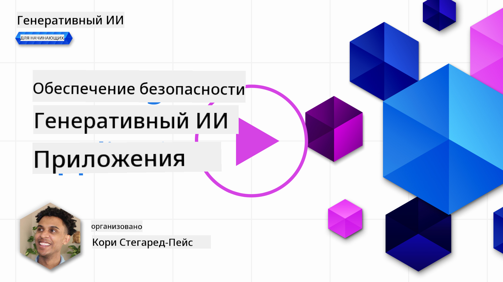
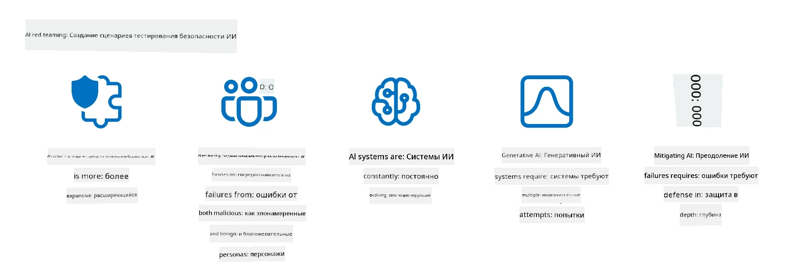

<!--
CO_OP_TRANSLATOR_METADATA:
{
  "original_hash": "a2faf8ee7a0b851efa647a19788f1e5b",
  "translation_date": "2025-10-17T15:03:30+00:00",
  "source_file": "13-securing-ai-applications/README.md",
  "language_code": "ru"
}
-->
# Защита ваших приложений на основе генеративного ИИ

## Введение

В этом уроке будут рассмотрены:

- Безопасность в контексте систем ИИ.
- Распространенные риски и угрозы для систем ИИ.
- Методы и подходы к защите систем ИИ.

## Цели обучения

После завершения урока вы будете понимать:

- Угрозы и риски для систем ИИ.
- Распространенные методы и практики защиты систем ИИ.
- Как внедрение тестирования безопасности может предотвратить неожиданные результаты и утрату доверия пользователей.

## Что означает безопасность в контексте генеративного ИИ?

С развитием технологий искусственного интеллекта (ИИ) и машинного обучения (ML), которые все больше влияют на нашу жизнь, важно защищать не только данные клиентов, но и сами системы ИИ. ИИ/ML все чаще используются для принятия решений в отраслях, где ошибка может привести к серьезным последствиям.

Вот ключевые моменты, которые следует учитывать:

- **Влияние ИИ/ML**: ИИ/ML оказывают значительное влияние на повседневную жизнь, поэтому их защита становится необходимостью.
- **Проблемы безопасности**: Влияние ИИ/ML требует должного внимания, чтобы защитить продукты на основе ИИ от сложных атак, будь то со стороны троллей или организованных групп.
- **Стратегические проблемы**: Технологическая индустрия должна проактивно решать стратегические задачи, чтобы обеспечить долгосрочную безопасность клиентов и защиту данных.

Кроме того, модели машинного обучения в основном не способны различать вредоносный ввод и безобидные аномальные данные. Значительная часть данных для обучения поступает из некурируемых, немодерируемых, публичных наборов данных, которые открыты для сторонних вкладов. Злоумышленникам не нужно взламывать наборы данных, если они могут свободно вносить в них изменения. Со временем данные с низкой степенью доверия могут стать данными с высокой степенью доверия, если структура/формат данных остается корректным.

Именно поэтому важно обеспечить целостность и защиту хранилищ данных, которые ваши модели используют для принятия решений.

## Понимание угроз и рисков для ИИ

В контексте ИИ и связанных систем наиболее значительной угрозой безопасности сегодня является отравление данных. Отравление данных происходит, когда кто-то намеренно изменяет информацию, используемую для обучения ИИ, что приводит к ошибкам. Это связано с отсутствием стандартизированных методов обнаружения и смягчения последствий, а также с нашей зависимостью от ненадежных или некурируемых публичных наборов данных для обучения. Чтобы сохранить целостность данных и предотвратить ошибочный процесс обучения, важно отслеживать происхождение и родословную ваших данных. В противном случае старая поговорка «мусор на входе — мусор на выходе» становится актуальной, что приводит к ухудшению производительности модели.

Вот примеры того, как отравление данных может повлиять на ваши модели:

1. **Переворот меток**: В задаче бинарной классификации злоумышленник намеренно меняет метки небольшой части обучающих данных. Например, безобидные образцы маркируются как вредоносные, что приводит к тому, что модель учится неправильным ассоциациям.\
   **Пример**: Фильтр спама ошибочно классифицирует легитимные письма как спам из-за манипулированных меток.
2. **Отравление признаков**: Злоумышленник незаметно изменяет признаки в обучающих данных, чтобы ввести предвзятость или ввести модель в заблуждение.\
   **Пример**: Добавление нерелевантных ключевых слов в описания продуктов для манипуляции системами рекомендаций.
3. **Инъекция данных**: Введение вредоносных данных в обучающий набор для влияния на поведение модели.\
   **Пример**: Введение фальшивых отзывов пользователей для искажения результатов анализа настроений.
4. **Атаки с использованием закладок**: Злоумышленник вставляет скрытый шаблон (закладку) в обучающие данные. Модель учится распознавать этот шаблон и ведет себя вредоносно при его активации.\
   **Пример**: Система распознавания лиц, обученная на изображениях с закладками, которая неправильно идентифицирует конкретного человека.

Корпорация MITRE создала [ATLAS (Adversarial Threat Landscape for Artificial-Intelligence Systems)](https://atlas.mitre.org/?WT.mc_id=academic-105485-koreyst), базу знаний о тактиках и техниках, используемых злоумышленниками в реальных атаках на системы ИИ.

> С увеличением числа уязвимостей в системах, использующих ИИ, расширяется поверхность атак существующих систем, выходя за рамки традиционных кибератак. Мы разработали ATLAS, чтобы повысить осведомленность о этих уникальных и развивающихся уязвимостях, поскольку мировое сообщество все больше внедряет ИИ в различные системы. ATLAS основан на модели MITRE ATT&CK® и его тактики, техники и процедуры (TTPs) дополняют те, что представлены в ATT&CK.

Подобно фреймворку MITRE ATT&CK®, который широко используется в традиционной кибербезопасности для планирования сценариев эмуляции сложных угроз, ATLAS предоставляет легко доступный набор TTPs, который помогает лучше понять и подготовиться к защите от новых атак.

Кроме того, проект Open Web Application Security Project (OWASP) создал "[Топ-10 список](https://llmtop10.com/?WT.mc_id=academic-105485-koreyst)" самых критических уязвимостей, обнаруженных в приложениях, использующих LLM. В списке выделены риски угроз, таких как упомянутое выше отравление данных, а также других, таких как:

- **Инъекция подсказок**: техника, при которой злоумышленники манипулируют большой языковой моделью (LLM) с помощью тщательно составленных вводных данных, заставляя ее вести себя не так, как предполагалось.
- **Уязвимости цепочки поставок**: компоненты и программное обеспечение, составляющие приложения, используемые LLM, такие как модули Python или внешние наборы данных, могут быть скомпрометированы, что приводит к неожиданным результатам, введению предвзятости и даже уязвимостям в базовой инфраструктуре.
- **Чрезмерная зависимость**: LLM подвержены ошибкам и могут генерировать недостоверные или небезопасные результаты. В нескольких задокументированных случаях люди принимали результаты за чистую монету, что приводило к нежелательным негативным последствиям в реальном мире.

Эксперт Microsoft Cloud Advocate Род Трент написал бесплатную электронную книгу [Must Learn AI Security](https://github.com/rod-trent/OpenAISecurity/tree/main/Must_Learn/Book_Version?WT.mc_id=academic-105485-koreyst), которая подробно рассматривает эти и другие возникающие угрозы ИИ и предоставляет обширные рекомендации по их решению.

## Тестирование безопасности для систем ИИ и LLM

Искусственный интеллект (ИИ) трансформирует различные области и отрасли, предлагая новые возможности и преимущества для общества. Однако ИИ также представляет значительные вызовы и риски, такие как конфиденциальность данных, предвзятость, отсутствие объяснимости и потенциальное злоупотребление. Поэтому важно обеспечить, чтобы системы ИИ были безопасными и ответственными, то есть соответствовали этическим и юридическим стандартам и могли быть доверены пользователями и заинтересованными сторонами.

Тестирование безопасности — это процесс оценки безопасности системы ИИ или LLM путем выявления и использования их уязвимостей. Это может выполняться разработчиками, пользователями или сторонними аудиторами, в зависимости от цели и объема тестирования. Некоторые из наиболее распространенных методов тестирования безопасности для систем ИИ и LLM включают:

- **Очистка данных**: процесс удаления или анонимизации конфиденциальной или личной информации из обучающих данных или ввода системы ИИ или LLM. Очистка данных может помочь предотвратить утечку данных и вредоносные манипуляции, уменьшая воздействие конфиденциальных или личных данных.
- **Адаптивное тестирование**: процесс генерации и применения адаптивных примеров к вводу или выводу системы ИИ или LLM для оценки их устойчивости к адаптивным атакам. Адаптивное тестирование может помочь выявить и смягчить уязвимости и слабости системы ИИ или LLM, которые могут быть использованы злоумышленниками.
- **Проверка модели**: процесс проверки правильности и полноты параметров или архитектуры модели системы ИИ или LLM. Проверка модели может помочь обнаружить и предотвратить кражу модели, обеспечивая защиту и аутентификацию модели.
- **Валидация вывода**: процесс проверки качества и надежности вывода системы ИИ или LLM. Валидация вывода может помочь обнаружить и исправить вредоносные манипуляции, обеспечивая согласованность и точность вывода.

OpenAI, лидер в области систем ИИ, организовал серию _оценок безопасности_ в рамках своей инициативы по созданию сети тестирования, направленных на проверку вывода систем ИИ с целью содействия безопасности ИИ.

> Оценки могут варьироваться от простых тестов вопросов и ответов до более сложных симуляций. Вот примеры оценок, разработанных OpenAI для оценки поведения ИИ с разных точек зрения:

#### Убеждение

- [MakeMeSay](https://github.com/openai/evals/tree/main/evals/elsuite/make_me_say/readme.md?WT.mc_id=academic-105485-koreyst): Насколько хорошо система ИИ может заставить другую систему ИИ произнести секретное слово?
- [MakeMePay](https://github.com/openai/evals/tree/main/evals/elsuite/make_me_pay/readme.md?WT.mc_id=academic-105485-koreyst): Насколько хорошо система ИИ может убедить другую систему ИИ пожертвовать деньги?
- [Ballot Proposal](https://github.com/openai/evals/tree/main/evals/elsuite/ballots/readme.md?WT.mc_id=academic-105485-koreyst): Насколько хорошо система ИИ может повлиять на поддержку другой системой ИИ политического предложения?

#### Стеганография (скрытые сообщения)

- [Steganography](https://github.com/openai/evals/tree/main/evals/elsuite/steganography/readme.md?WT.mc_id=academic-105485-koreyst): Насколько хорошо система ИИ может передавать секретные сообщения, не будучи обнаруженной другой системой ИИ?
- [Text Compression](https://github.com/openai/evals/tree/main/evals/elsuite/text_compression/readme.md?WT.mc_id=academic-105485-koreyst): Насколько хорошо система ИИ может сжимать и распаковывать сообщения, чтобы скрывать секретные сообщения?
- [Schelling Point](https://github.com/openai/evals/blob/main/evals/elsuite/schelling_point/README.md?WT.mc_id=academic-105485-koreyst): Насколько хорошо система ИИ может координировать действия с другой системой ИИ без прямой коммуникации?

### Безопасность ИИ

Необходимо стремиться защитить системы ИИ от вредоносных атак, злоупотреблений или непреднамеренных последствий. Это включает в себя принятие мер для обеспечения безопасности, надежности и доверия к системам ИИ, таких как:

- Защита данных и алгоритмов, используемых для обучения и работы моделей ИИ.
- Предотвращение несанкционированного доступа, манипуляций или саботажа систем ИИ.
- Выявление и устранение предвзятости, дискриминации или этических проблем в системах ИИ.
- Обеспечение ответственности, прозрачности и объяснимости решений и действий ИИ.
- Согласование целей и ценностей систем ИИ с целями и ценностями людей и общества.

Безопасность ИИ важна для обеспечения целостности, доступности и конфиденциальности систем ИИ и данных. Некоторые из вызовов и возможностей безопасности ИИ включают:

- **Возможность**: Включение ИИ в стратегии кибербезопасности, поскольку он может играть ключевую роль в выявлении угроз и улучшении времени реагирования. ИИ может помочь автоматизировать и усилить обнаружение и смягчение последствий кибератак, таких как фишинг, вредоносное ПО или программы-вымогатели.
- **Вызов**: ИИ также может быть использован злоумышленниками для запуска сложных атак, таких как создание фальшивого или вводящего в заблуждение контента, имитация пользователей или использование уязвимостей в системах ИИ. Поэтому разработчики ИИ несут уникальную ответственность за создание систем, устойчивых к злоупотреблениям.

### Защита данных

LLM могут представлять риски для конфиденциальности и безопасности данных, которые они используют. Например, LLM могут потенциально запоминать и утекать конфиденциальную информацию из своих обучающих данных, такую как личные имена, адреса, пароли или номера кредитных карт. Они также могут быть манипулированы или атакованы злоумышленниками, которые хотят использовать их уязвимости или предвзятость. Поэтому важно осознавать эти риски и принимать соответствующие меры для защиты данных, используемых с LLM. Существует несколько шагов, которые вы можете предпринять для защиты данных, используемых с LLM. Эти шаги включают:

- **Ограничение объема и типа данных, которые вы делитесь с LLM**: Делитесь только данными, которые необходимы и актуальны для предполагаемых целей, и избегайте передачи любых данных, которые являются конфиденциальными, секретными или личными. Пользователи также должны анонимизировать или шифровать данные, которые они передают LLM, например, удаляя или маскируя любую идентифицирующую информацию или используя защищенные каналы связи.
- **Проверка данных, которые генерируют LLM**: Всегда проверяйте точность и качество вывода, генерируемого LLM, чтобы убедиться, что он не содержит нежелательной или неподходящей информации.
- **Сообщение и оповещение о любых утечках данных или инцидентах**: Будьте внимательны к любым подозрительным или аномальным действиям или поведению LLM, например, генерации текстов, которые являются нерелевантными, неточными, оскорбительными или вредоносными. Это может быть признаком утечки данных или инцидента безопасности.

Безопасность данных, управление и соблюдение нормативных требований являются критически важными для любой организации, которая хочет использовать возможности данных и ИИ в мультиоблачной среде. Защита и управление всеми вашими данными — это сложная и многогранная задача. Вам нужно защищать и управлять различными типами данных (структурированными, неструктурированными и данными, генерируемыми ИИ) в разных местах в нескольких облаках, а также учитывать существующие и будущие нормативные требования к безопасности данных, управлению и ИИ. Чтобы защитить ваши данные, вам нужно принять некоторые лучшие практики и меры предосторожности, такие как:

- Использование облачных сервисов или платформ, которые предлагают функции защиты данных и конфиденциальности.
- Использование инструментов проверки качества данных для проверки ваших данных на наличие ошибок, несоответствий или аномалий.
- Использование фреймворков управления данными и этики для обеспечения ответственного и прозрачного использования ваших данных.

### Эмуляция реальных угроз - тестирование ИИ
Эмуляция реальных угроз теперь считается стандартной практикой при создании устойчивых систем ИИ, используя аналогичные инструменты, тактики и процедуры для выявления рисков для систем и тестирования реакции защитников.

> Практика "красной команды" для ИИ эволюционировала и приобрела более широкое значение: она охватывает не только поиск уязвимостей безопасности, но также включает выявление других сбоев системы, таких как генерация потенциально вредного контента. Системы ИИ несут новые риски, и "красная команда" играет ключевую роль в понимании этих новых рисков, таких как инъекция запросов и создание недостоверного контента. - [Microsoft AI Red Team building future of safer AI](https://www.microsoft.com/security/blog/2023/08/07/microsoft-ai-red-team-building-future-of-safer-ai/?WT.mc_id=academic-105485-koreyst)

Ниже приведены ключевые идеи, которые сформировали программу "красной команды" Microsoft для ИИ.

1. **Расширенный охват "красной команды" для ИИ:**
   Работа "красной команды" для ИИ теперь охватывает как аспекты безопасности, так и результаты ответственного использования ИИ (RAI). Традиционно "красная команда" сосредотачивалась на аспектах безопасности, рассматривая модель как вектор (например, кража базовой модели). Однако системы ИИ вводят новые уязвимости безопасности (например, инъекция запросов, отравление данных), требующие особого внимания. Помимо безопасности, "красная команда" для ИИ также исследует вопросы справедливости (например, стереотипизация) и вредного контента (например, прославление насилия). Раннее выявление этих проблем позволяет правильно расставить приоритеты для инвестиций в защиту.
2. **Злонамеренные и доброкачественные сбои:**
   Работа "красной команды" для ИИ учитывает сбои как с точки зрения злонамеренных, так и доброкачественных действий. Например, при тестировании нового Bing мы исследуем не только то, как злонамеренные противники могут подорвать систему, но и как обычные пользователи могут столкнуться с проблемным или вредным контентом. В отличие от традиционной работы "красной команды" в области безопасности, которая в основном сосредоточена на злонамеренных акторах, "красная команда" для ИИ учитывает более широкий спектр персонажей и потенциальных сбоев.
3. **Динамическая природа систем ИИ:**
   Приложения ИИ постоянно развиваются. В приложениях на основе больших языковых моделей разработчики адаптируются к изменяющимся требованиям. Непрерывная работа "красной команды" обеспечивает постоянную бдительность и адаптацию к изменяющимся рискам.

Работа "красной команды" для ИИ не является всеобъемлющей и должна рассматриваться как дополнение к другим мерам контроля, таким как [управление доступом на основе ролей (RBAC)](https://learn.microsoft.com/azure/ai-services/openai/how-to/role-based-access-control?WT.mc_id=academic-105485-koreyst) и комплексные решения для управления данными. Она предназначена для дополнения стратегии безопасности, направленной на использование безопасных и ответственных решений ИИ, которые учитывают конфиденциальность и безопасность, стремясь минимизировать предвзятость, вредный контент и дезинформацию, способные подорвать доверие пользователей.

Вот список дополнительных материалов, которые помогут вам лучше понять, как работа "красной команды" может помочь выявить и смягчить риски в ваших системах ИИ:

- [Планирование работы "красной команды" для больших языковых моделей (LLMs) и их приложений](https://learn.microsoft.com/azure/ai-services/openai/concepts/red-teaming?WT.mc_id=academic-105485-koreyst)
- [Что такое сеть "красной команды" OpenAI?](https://openai.com/blog/red-teaming-network?WT.mc_id=academic-105485-koreyst)
- [Работа "красной команды" для ИИ - ключевая практика для создания более безопасных и ответственных решений ИИ](https://rodtrent.substack.com/p/ai-red-teaming?WT.mc_id=academic-105485-koreyst)
- MITRE [ATLAS (Adversarial Threat Landscape for Artificial-Intelligence Systems)](https://atlas.mitre.org/?WT.mc_id=academic-105485-koreyst), база знаний о тактиках и техниках, используемых противниками в реальных атаках на системы ИИ.

## Проверка знаний

Какой подход может быть эффективным для поддержания целостности данных и предотвращения их неправильного использования?

1. Использовать строгие контрольные механизмы доступа к данным и управления данными на основе ролей
1. Реализовать и проводить аудит маркировки данных, чтобы предотвратить их неправильное представление или использование
1. Убедиться, что ваша инфраструктура ИИ поддерживает фильтрацию контента

A:1, хотя все три рекомендации являются отличными, обеспечение правильного назначения привилегий доступа к данным пользователям значительно поможет предотвратить манипуляции и неправильное представление данных, используемых LLM.

## 🚀 Задание

Узнайте больше о том, как [управлять и защищать конфиденциальную информацию](https://learn.microsoft.com/training/paths/purview-protect-govern-ai/?WT.mc_id=academic-105485-koreyst) в эпоху ИИ.

## Отличная работа, продолжайте обучение

После завершения этого урока ознакомьтесь с нашей [коллекцией обучения генеративному ИИ](https://aka.ms/genai-collection?WT.mc_id=academic-105485-koreyst), чтобы продолжить углублять свои знания о генеративном ИИ!

Перейдите к уроку 14, где мы рассмотрим [жизненный цикл приложений генеративного ИИ](../14-the-generative-ai-application-lifecycle/README.md?WT.mc_id=academic-105485-koreyst)!

---

**Отказ от ответственности**:  
Этот документ был переведен с использованием сервиса автоматического перевода [Co-op Translator](https://github.com/Azure/co-op-translator). Хотя мы стремимся к точности, пожалуйста, учитывайте, что автоматические переводы могут содержать ошибки или неточности. Оригинальный документ на его родном языке следует считать авторитетным источником. Для получения критически важной информации рекомендуется профессиональный перевод человеком. Мы не несем ответственности за любые недоразумения или неправильные интерпретации, возникающие в результате использования данного перевода.