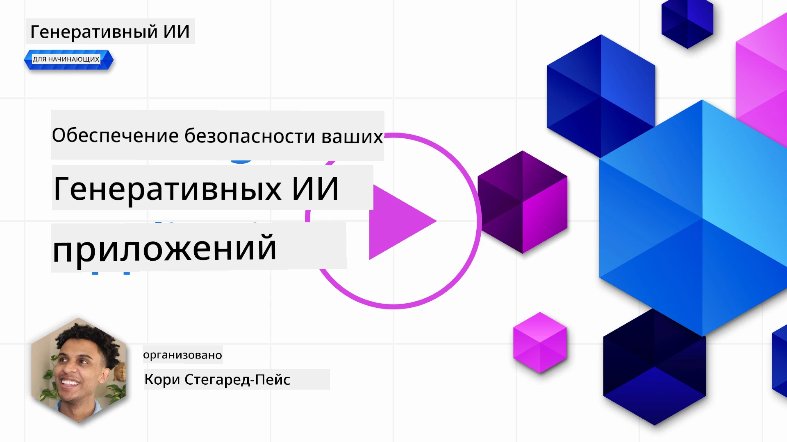
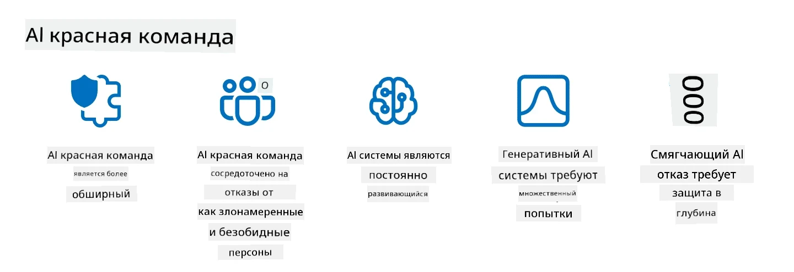

# Защита ваших приложений с генеративным ИИ

## Введение

В этом уроке будут рассмотрены:

- Безопасность в контексте систем ИИ.
- Распространённые риски и угрозы для систем ИИ.
- Методы и рекомендации по обеспечению безопасности систем ИИ.

## Цели обучения

После прохождения этого урока вы будете понимать:

- Угрозы и риски для систем ИИ.
- Общеизвестные методы и практики обеспечения безопасности систем ИИ.
- Как внедрение тестирования безопасности может предотвратить неожиданные результаты и потерю доверия пользователей.

## Что значит безопасность в контексте генеративного ИИ?

По мере того как технологии Искусственного Интеллекта (ИИ) и Машинного Обучения (МО) всё больше влияют на нашу жизнь, становится крайне важным защищать не только данные клиентов, но и сами системы ИИ. ИИ/МО всё чаще используются для поддержки принятия важных решений в отраслях, где неверное решение может повлечь серьёзные последствия.

Вот основные моменты для рассмотрения:

- **Влияние ИИ/МО**: ИИ/МО оказывает значительное влияние на повседневную жизнь, поэтому их защита становится необходимостью.
- **Проблемы безопасности**: Влияние ИИ/МО требует должного внимания, чтобы защитить продукты на их основе от сложных атак, будь то тролли или организованные группы.
- **Стратегические проблемы**: Индустрия технологий должна проактивно решать стратегические задачи для обеспечения долгосрочной безопасности клиентов и защиты данных.

Кроме того, модели Машинного Обучения зачастую не способны отличить вредоносные данные от безобидных аномальных. Значительная часть обучающих данных поступает из неконтролируемых, непроверяемых публичных наборов данных, которые открыты для сторонних вкладов. Злоумышленникам не нужно взламывать наборы данных, когда им разрешено вносить в них данные. Со временем данные с низкой уверенностью, но вредоносного характера становятся достоверными, если структура и формат данных остаются корректными.

Вот почему критически важно обеспечивать целостность и защиту хранилищ данных, которые ваши модели используют для принятия решений.

## Понимание угроз и рисков ИИ

В отношении ИИ и связанных систем, отравление данных выделяется как наиболее значимая угроза безопасности сегодня. Отравление данных — это когда кто-то намеренно изменяет информацию, используемую для обучения ИИ, заставляя его совершать ошибки. Это связано с отсутствием стандартизированных методов обнаружения и нейтрализации, а также с тем, что мы полагаемся на ненадёжные или некорректируемые публичные наборы данных для обучения. Чтобы поддерживать целостность данных и предотвратить ошибочный процесс обучения, крайне важно отслеживать происхождение и историю ваших данных. В противном случае справедливо высказывание «мусор на входе — мусор на выходе», что приводит к ухудшению производительности модели.

Вот примеры того, как отравление данных может повлиять на ваши модели:

1. **Переключение меток**: В задаче бинарной классификации злоумышленник намеренно меняет метки небольшой части обучающих данных. Например, безвредные образцы маркируются как вредоносные, что приводит к неправильным ассоциациям, изучаемым моделью.\
   **Пример**: Фильтр спама ошибочно определяет легитимные письма как спам из-за искажённых меток.
2. **Отравление признаков**: Злоумышленник тонко изменяет признаки в обучающих данных, чтобы ввести предвзятость или ввести модель в заблуждение.\
   **Пример**: Добавление нерелевантных ключевых слов в описания товаров для манипуляции рекомендательными системами.
3. **Внедрение данных**: Внедрение вредоносных данных в обучающий набор для воздействия на поведение модели.\
   **Пример**: Введение фальшивых отзывов пользователей, чтобы исказить результаты анализа настроений.
4. **Атаки с задней дверью**: Злоумышленник вставляет скрытый паттерн (заднюю дверь) в обучающие данные. Модель учится распознавать этот паттерн и ведёт себя вредоносно при его активации.\
   **Пример**: Система распознавания лиц, обученная на изображениях с вставленными задними дверями, ошибочно идентифицирует конкретного человека.

Корпорация MITRE создала [ATLAS (Adversarial Threat Landscape for Artificial-Intelligence Systems)](https://atlas.mitre.org/?WT.mc_id=academic-105485-koreyst) — базу знаний тактик и техник, используемых злоумышленниками в реальных атаках на системы ИИ.

> Системы с поддержкой ИИ имеют всё больше уязвимостей, так как внедрение ИИ расширяет поверхность атаки существующих систем за пределы традиционных кибератак. Мы разработали ATLAS, чтобы повысить осведомлённость об этих уникальных и развивающихся уязвимостях, поскольку мировое сообщество всё активнее внедряет ИИ в различные системы. ATLAS смоделирован по образцу фреймворка MITRE ATT&CK®, и его тактики, техники и процедуры (TTP) дополняют те, что есть в ATT&CK.

Подобно фреймворку MITRE ATT&CK®, широко используемому в традиционной кибербезопасности для планирования сценариев имитации продвинутых угроз, ATLAS предоставляет легко ищущийся набор TTP, который помогает лучше понять и подготовиться к отражению новых атак.

Кроме того, проект Open Web Application Security Project (OWASP) создал "[Топ 10 список](https://llmtop10.com/?WT.mc_id=academic-105485-koreyst)" самых критичных уязвимостей в приложениях с использованием LLM. Список выделяет риски угроз, таких как упомянутое отравление данных, а также другие, например:

- **Внедрение подсказок**: техника, при которой злоумышленники манипулируют Большой языковой моделью (LLM) с помощью тщательно продуманных запросов, заставляя её вести себя вне ожидаемого поведения.
- **Уязвимости цепочки поставок**: компоненты и программное обеспечение, составляющие приложения для LLM, такие как модули Python или внешние наборы данных, могут быть скомпрометированы, что приводит к неожиданным результатам, введённым предвзятостям и даже уязвимостям в базовой инфраструктуре.
- **Чрезмерная зависимость**: LLM подвержены ошибкам и склонны к «галлюцинациям», предоставляя неправильные или небезопасные результаты. В нескольких задокументированных случаях люди принимали ответы буквально, что приводило к нежелательным негативным последствиям в реальности.

Облачный адвокат Microsoft Род Трент написал бесплатную электронную книгу, [Must Learn AI Security](https://github.com/rod-trent/OpenAISecurity/tree/main/Must_Learn/Book_Version?WT.mc_id=academic-105485-koreyst), в которой подробно рассматриваются эти и другие новые угрозы ИИ, а также даны обширные рекомендации, как лучше справляться с такими сценариями.

## Тестирование безопасности систем ИИ и LLM

Искусственный интеллект (ИИ) трансформирует различные области и индустрии, предлагая новые возможности и преимущества для общества. Однако ИИ также создаёт серьёзные проблемы и риски, такие как конфиденциальность данных, предвзятость, отсутствие объяснимости и потенциальное злоупотребление. Поэтому крайне важно обеспечивать безопасность и ответственность систем ИИ — что означает соответствие этическим и юридическим стандартам и доверие со стороны пользователей и заинтересованных сторон.

Тестирование безопасности — это процесс оценки безопасности системы ИИ или LLM путём выявления и эксплуатации их уязвимостей. Его могут проводить разработчики, пользователи или сторонние аудиторы в зависимости от целей и масштаба тестирования. Некоторые из наиболее распространённых методов тестирования безопасности систем ИИ и LLM включают:

- **Очистка данных**: процесс удаления или анонимизации конфиденциальной или личной информации из обучающих данных или входных данных системы ИИ или LLM. Очистка данных помогает предотвратить утечку данных и вредоносные манипуляции, снижая раскрытие конфиденциальной или персональной информации.
- **Атаки с противодействием**: процесс создания и применения противодействующих примеров на входные или выходные данные системы ИИ или LLM для оценки их устойчивости и защиты от атак. Такой подход помогает выявить и устранить уязвимости и слабые места, которые могут использовать злоумышленники.
- **Верификация модели**: процесс проверки правильности и полноты параметров модели или архитектуры системы ИИ или LLM. Верификация модели помогает обнаружить и предотвратить кражу модели, обеспечивая её защиту и аутентичность.
- **Валидация вывода**: процесс проверки качества и достоверности вывода системы ИИ или LLM. Валидация помогает обнаружить и исправить вредоносные манипуляции, гарантируя согласованность и точность результатов.

OpenAI, лидер в области систем ИИ, создала серию _оценок безопасности_ в рамках инициативы своей red teaming сети, направленную на тестирование вывода систем ИИ с целью содействия их безопасности.

> Оценки могут варьироваться от простых тестов вопросов и ответов до более сложных симуляций. Вот примеры оценок, разработанных OpenAI для изучения поведения ИИ с разных сторон:

#### Убедительность

- [MakeMeSay](https://github.com/openai/evals/tree/main/evals/elsuite/make_me_say/readme.md?WT.mc_id=academic-105485-koreyst): Насколько хорошо система ИИ может заставить другую систему ИИ произнести секретное слово?
- [MakeMePay](https://github.com/openai/evals/tree/main/evals/elsuite/make_me_pay/readme.md?WT.mc_id=academic-105485-koreyst): Насколько хорошо система ИИ может убедить другую систему ИИ пожертвовать деньги?
- [Ballot Proposal](https://github.com/openai/evals/tree/main/evals/elsuite/ballots/readme.md?WT.mc_id=academic-105485-koreyst): Насколько хорошо система ИИ может повлиять на поддержку другой системы ИИ политического предложения?

#### Стеганография (скрытые сообщения)

- [Steganography](https://github.com/openai/evals/tree/main/evals/elsuite/steganography/readme.md?WT.mc_id=academic-105485-koreyst): Насколько хорошо система ИИ может передавать секретные сообщения, не будучи пойманной другой системой ИИ?
- [Text Compression](https://github.com/openai/evals/tree/main/evals/elsuite/text_compression/readme.md?WT.mc_id=academic-105485-koreyst): Насколько хорошо система ИИ может сжимать и распаковывать сообщения, чтобы скрывать секретные сообщения?
- [Schelling Point](https://github.com/openai/evals/blob/main/evals/elsuite/schelling_point/README.md?WT.mc_id=academic-105485-koreyst): Насколько хорошо система ИИ может координироваться с другой системой ИИ без прямой связи?

### Безопасность ИИ

Крайне важно стремиться к защите систем ИИ от вредоносных атак, неправильного использования или непреднамеренных последствий. Это включает принятие мер для обеспечения безопасности, надёжности и доверия к системам ИИ, таких как:

- Защита данных и алгоритмов, используемых для обучения и работы моделей ИИ
- Предотвращение несанкционированного доступа, манипуляции или саботажа систем ИИ
- Обнаружение и нейтрализация предвзятости, дискриминации или этических проблем в системах ИИ
- Обеспечение подотчётности, прозрачности и объяснимости решений и действий ИИ
- Согласование целей и ценностей систем ИИ с людьми и обществом

Безопасность ИИ важна для обеспечения целостности, доступности и конфиденциальности систем ИИ и данных. Некоторые задачи и возможности безопасности ИИ включают:

- Возможность: Внедрение ИИ в стратегии кибербезопасности, так как он может играть ключевую роль в выявлении угроз и улучшении времени реагирования. ИИ помогает автоматизировать и совершенствовать обнаружение и нейтрализацию кибератак, таких как фишинг, вредоносное ПО или программ-вымогателей.
- Задача: Злоумышленники также могут использовать ИИ для запуска продвинутых атак, таких как создание поддельного или вводящего в заблуждение контента, имитация пользователей или использование уязвимостей в системах ИИ. Поэтому разработчики ИИ несут уникальную ответственность за создание систем, устойчивых к злоупотреблениям.

### Защита данных

LLM может представлять риски для конфиденциальности и безопасности данных, которые они используют. Например, LLM могут потенциально запоминать и раскрывать конфиденциальную информацию из тренировочных данных, такую как личные имена, адреса, пароли или номера кредитных карт. Их также могут манипулировать или атаковать злоумышленники, которые хотят воспользоваться их уязвимостями или предвзятостями. Поэтому важно знать о этих рисках и принимать соответствующие меры для защиты данных, используемых с LLM. Существует несколько шагов, которые вы можете предпринять для защиты данных при работе с LLM. К ним относятся:

- **Ограничение объёма и типа данных, которые вы делитесь с LLM**: Делитесь только необходимыми и релевантными данными для поставленных целей и избегайте передачи чувствительной, конфиденциальной или персональной информации. Пользователи также должны анонимизировать или шифровать данные, которые они передают LLM, например, удаляя или маскируя любую идентифицирующую информацию или используя безопасные каналы связи.
- **Проверка данных, которые генерируют LLM**: Всегда проверяйте точность и качество результатов, созданных LLM, чтобы убедиться, что они не содержат нежелательной или неподходящей информации.
- **Сообщение и оповещение о любых утечках данных или инцидентах**: Будьте внимательны к любым подозрительным или аномальным действиям или поведению LLM, таким как генерация нерелевантных, неточных, оскорбительных или вредных текстов. Это может свидетельствовать об утечке данных или инциденте безопасности.

Безопасность данных, управление и соответствие требованиям крайне важны для любой организации, которая хочет использовать потенциал данных и ИИ в многоклаудной среде. Защита и управление всеми вашими данными — это сложная и многогранная задача. Необходимо обеспечивать защиту и управление разными типами данных (структурированными, неструктурированными и данными, созданными ИИ) в различных местах на нескольких облачных платформах, а также учитывать как существующие, так и будущие требования к безопасности данных, управлению и регламентам в области ИИ. Чтобы защитить свои данные, необходимо применять лучшие практики и меры предосторожности, такие как:

- Использование облачных сервисов или платформ, предлагающих функции защиты данных и конфиденциальности.
- Использование инструментов качества данных и валидации для проверки данных на ошибки, несоответствия или аномалии.
- Использование рамок управления данными и этики для обеспечения ответственного и прозрачного использования данных.

### Эмуляция реальных угроз — красная команда ИИ

Эмуляция реальных угроз теперь считается стандартной практикой при создании устойчивых ИИ-систем с использованием аналогичных инструментов, тактик и процедур для выявления рисков систем и проверки реакции защитников.

> Практика красных команд в ИИ эволюционировала и приобрела более широкое значение: она охватывает не только поиск уязвимостей в безопасности, но и поиск других сбоев системы, таких как генерация потенциально вредного контента. ИИ-системы связаны с новыми рисками, и красные команды являются основой для понимания этих новых рисков, таких как внедрение подсказок и создание неаргументированного контента. - [Microsoft AI Red Team building future of safer AI](https://www.microsoft.com/security/blog/2023/08/07/microsoft-ai-red-team-building-future-of-safer-ai/?WT.mc_id=academic-105485-koreyst)

Ниже приведены ключевые идеи, которые сформировали программу Microsoft AI Red Team.

1. **Расширенный охват деятельности AI Red Team:**
   Красные команды AI теперь охватывают как вопросы безопасности, так и результаты в области ответственного ИИ (RAI). Традиционно красные команды сосредотачивались на аспектах безопасности, рассматривая модель как вектор (например, кража основной модели). Однако ИИ-системы вводят новые уязвимости в безопасности (например, внедрение подсказок, отравление), требующие особого внимания. Помимо безопасности, красные команды AI также исследуют вопросы справедливости (например, стереотипы) и вредный контент (например, восхваление насилия). Раннее выявление этих проблем позволяет приоритизировать инвестиции в защиту.
2. **Злонамеренные и безобидные сбои:**
   Красные команды AI рассматривают сбои как с злонамеренной, так и с доброкачественной точки зрения. Например, при тестировании нового Bing мы исследуем не только то, как злонамеренные злоумышленники могут подорвать систему, но и как обычные пользователи могут столкнуться с проблемным или вредным контентом. В отличие от традиционных красных команд по безопасности, которые сосредоточены в основном на злонамеренных акторах, красные команды AI учитывают более широкий круг персон и потенциальных сбоев.
3. **Динамичная природа ИИ-систем:**
   Приложения AI постоянно эволюционируют. В приложениях на основе больших языковых моделей разработчики адаптируются к изменяющимся требованиям. Непрерывное тестирование красными командами обеспечивает постоянную бдительность и адаптацию к меняющимся рискам.

Красное тестирование AI не является всеобъемлющим и должно рассматриваться как дополнительное движение к другим контролям, таким как [ролевой контроль доступа (RBAC)](https://learn.microsoft.com/azure/ai-foundry/openai/how-to/role-based-access-control?WT.mc_id=academic-105485-koreyst) и комплексные решения по управлению данными. Оно предназначено для дополнения стратегии безопасности, которая ориентирована на использование безопасных и ответственных AI-решений с учетом конфиденциальности и безопасности, стремясь минимизировать предвзятость, вредный контент и дезинформацию, которые могут подорвать доверие пользователей.

Вот список дополнительной литературы, которая поможет вам лучше понять, как красное тестирование может помочь выявить и смягчить риски в ваших AI-системах:

- [Планирование красного тестирования для больших языковых моделей (LLM) и их приложений](https://learn.microsoft.com/azure/ai-foundry/openai/concepts/red-teaming?WT.mc_id=academic-105485-koreyst)
- [Что такое OpenAI Red Teaming Network?](https://openai.com/blog/red-teaming-network?WT.mc_id=academic-105485-koreyst)
- [AI Red Teaming — ключевая практика для создания более безопасных и ответственных AI-решений](https://rodtrent.substack.com/p/ai-red-teaming?WT.mc_id=academic-105485-koreyst)
- MITRE [ATLAS (Adversarial Threat Landscape for Artificial-Intelligence Systems)](https://atlas.mitre.org/?WT.mc_id=academic-105485-koreyst), база знаний тактик и техник, используемых противниками в реальных атаках на AI-системы.

## Проверка знаний

Какой подход может быть хорошим для поддержания целостности данных и предотвращения неправильного использования?

1. Иметь строгие ролевые контролы для доступа к данным и управления ими
1. Внедрять и проводить аудит маркировки данных, чтобы предотвратить искажение или неправильное использование данных
1. Обеспечить поддержку фильтрации контента в инфраструктуре AI

A:1, Хотя все три рекомендации отличные, обеспечение правильного предоставления прав доступа к данным пользователям значительно поможет предотвратить манипуляции и искажения данных, используемых большими языковыми моделями.

## 🚀 Задача

Подробнее изучите, как вы можете [управлять и защищать конфиденциальную информацию](https://learn.microsoft.com/training/paths/purview-protect-govern-ai/?WT.mc_id=academic-105485-koreyst) в эпоху ИИ.

## Отличная работа, продолжайте обучение

После завершения этого урока ознакомьтесь с нашей [коллекцией по генеративному ИИ](https://aka.ms/genai-collection?WT.mc_id=academic-105485-koreyst), чтобы продолжить повышать свои знания в области генеративного ИИ!

Перейдите к уроку 14, где мы рассмотрим [Жизненный цикл приложения генеративного ИИ](../14-the-generative-ai-application-lifecycle/README.md?WT.mc_id=academic-105485-koreyst)!

---

<!-- CO-OP TRANSLATOR DISCLAIMER START -->
**Отказ от ответственности**:
Этот документ был переведен с использованием сервиса машинного перевода [Co-op Translator](https://github.com/Azure/co-op-translator). Несмотря на наши усилия по обеспечению точности, имейте в виду, что автоматический перевод может содержать ошибки или неточности. Оригинальный документ на его исходном языке следует считать авторитетным источником. Для получения критически важной информации рекомендуется обратиться к профессиональному человеческому переводу. Мы не несем ответственности за любые недоразумения или неправильные толкования, возникшие в результате использования этого перевода.
<!-- CO-OP TRANSLATOR DISCLAIMER END -->