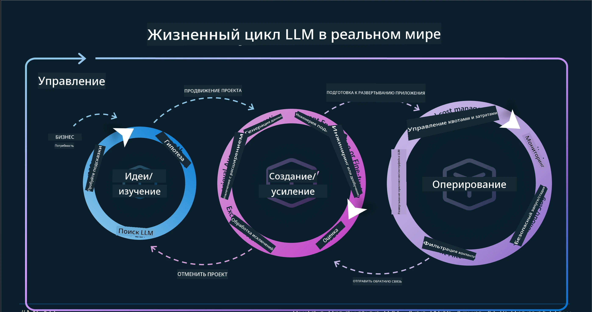
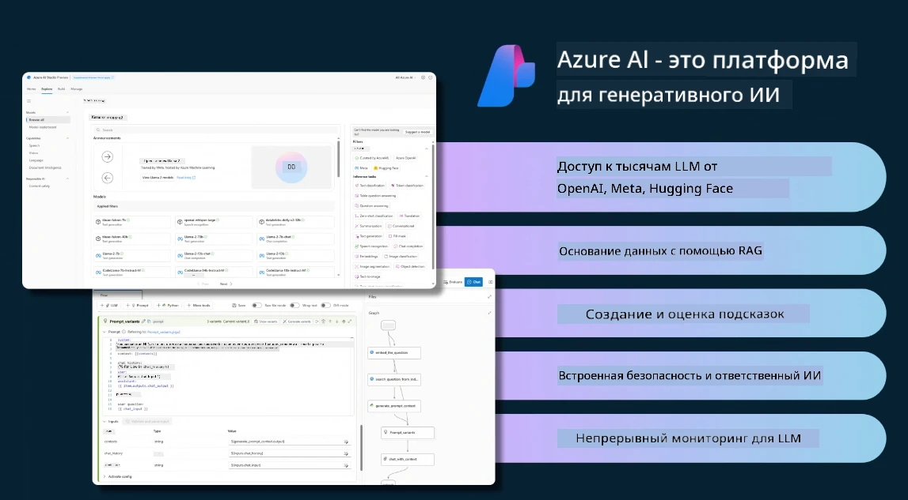
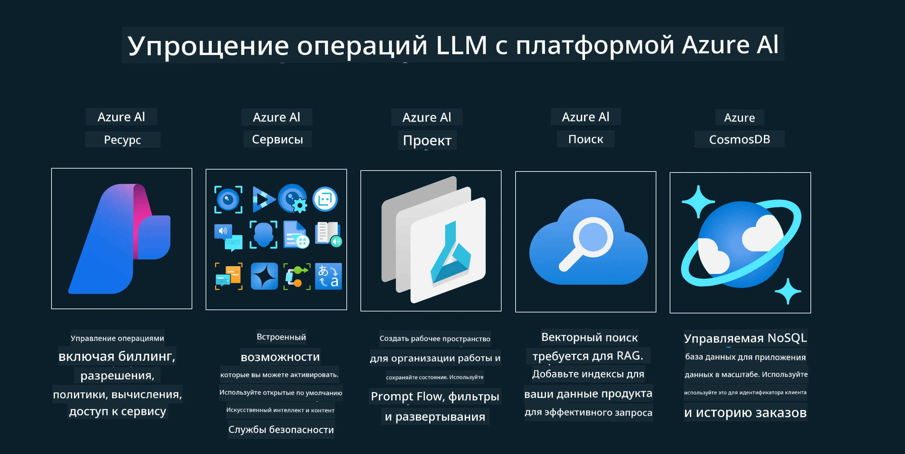
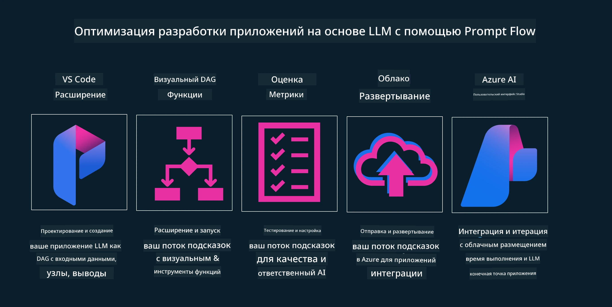

# Жизненный цикл приложения генеративного ИИ

Важный вопрос для всех приложений ИИ — актуальность функций ИИ, поскольку ИИ — это быстро развивающаяся область. Чтобы ваше приложение оставалось актуальным, надежным и устойчивым, необходимо постоянно его контролировать, оценивать и улучшать. Здесь на помощь приходит жизненный цикл генеративного ИИ.

Жизненный цикл генеративного ИИ — это рамочная структура, которая помогает пройти этапы разработки, развертывания и поддержки приложения генеративного ИИ. Она помогает определить ваши цели, измерить производительность, выявить проблемы и реализовать решения. Также она помогает согласовать ваше приложение с этическими и правовыми стандартами вашей области и заинтересованных сторон. Следуя жизненному циклу генеративного ИИ, вы можете гарантировать, что ваше приложение всегда приносит пользу и удовлетворяет пользователей.

## Введение

В этой главе вы:

- Поймёте сдвиг парадигмы от MLOps к LLMOps
- Изучите жизненный цикл LLM
- Познакомитесь с инструментами жизненного цикла
- Узнаете о метриках и оценке жизненного цикла

## Поймите сдвиг парадигмы от MLOps к LLMOps

LLM — это новый инструмент в арсенале искусственного интеллекта, они невероятно мощны в задачах анализа и генерации для приложений, однако эта мощь влечёт за собой некоторые последствия в том, как мы оптимизируем задачи ИИ и классического машинного обучения.

В связи с этим нам нужна новая парадигма для адаптации этого инструмента динамично и с правильными стимулами. Мы можем классифицировать старые приложения ИИ как «ML-приложения», а новые — как «GenAI-приложения» или просто «ИИ-приложения», отражая основные технологии и методы, используемые в то время. Это сдвигает наш нарратив во многих аспектах, посмотрите на следующее сравнение.

Обратите внимание, что в LLMOps мы больше ориентируемся на разработчиков приложений, используя интеграции как ключевой момент, применяя «Модели как сервис» и думая о следующих метриках.

- Качество: качество ответа
- Вред: ответственный ИИ
- Честность: обоснованность ответа (Имеет ли смысл? Правильный ли ответ?)
- Стоимость: бюджет решения
- Задержка: среднее время ответа на токен

## Жизненный цикл LLM

Сначала, чтобы понять жизненный цикл и изменения, обратите внимание на следующую инфографику.

Как вы можете заметить, это отличается от обычных жизненных циклов MLOps. LLM имеют много новых требований, таких как подсказки (Prompting), различные техники для улучшения качества (тонкая настройка, RAG, мета-подсказки), различные оценки и ответственность с ответственным ИИ, наконец, новые метрики оценки (качество, вред, честность, стоимость и задержка).

Например, посмотрите, как мы генерируем идеи. Используя инженеринг подсказок, чтобы экспериментировать с различными LLM и исследовать возможности, проверяя, может ли их гипотеза быть правильной.

Обратите внимание, что это не линейный процесс, а интегрированные циклы, итеративные и с общим циклом.

Как мы можем исследовать эти шаги? Давайте подробно рассмотрим, как можно построить жизненный цикл.

Это может показаться немного сложным, давайте сначала сосредоточимся на трёх основных шагах.

1. Генерация идей/исследование: Исследование, здесь мы можем исследовать в соответствии с бизнес-потребностями. Прототипирование, создание [PromptFlow](https://microsoft.github.io/promptflow/index.html?WT.mc_id=academic-105485-koreyst) и проверка его эффективности для нашей гипотезы.
1. Создание/расширение: Реализация, теперь мы начинаем оценивать на больших наборах данных, применять техники, такие как тонкая настройка и RAG, чтобы проверить устойчивость нашего решения. Если не работает, повторная реализация, добавление новых шагов в наш поток или реструктуризация данных могут помочь. После тестирования нашего потока и масштаба, если всё работает и метрики удовлетворительны, можно переходить к следующему шагу.
1. Внедрение в эксплуатацию: Интеграция, теперь добавляем системы мониторинга и оповещений, развертывание и интеграцию приложения.

Затем у нас есть общий цикл управления, сосредоточенный на безопасности, соблюдении требований и управлении.

Поздравляем, теперь ваше ИИ-приложение готово к работе и эксплуатации. Для практического опыта посмотрите [демо Contoso Chat.](https://nitya.github.io/contoso-chat/?WT.mc_id=academic-105485-koreys)

Теперь, какие инструменты мы можем использовать?

## Инструменты жизненного цикла

Для инструментов Microsoft предоставляет [Azure AI Platform](https://azure.microsoft.com/solutions/ai/?WT.mc_id=academic-105485-koreys) и [PromptFlow](https://microsoft.github.io/promptflow/index.html?WT.mc_id=academic-105485-koreyst), которые облегчают и упрощают реализацию вашего цикла.

[Azure AI Platform](https://azure.microsoft.com/solutions/ai/?WT.mc_id=academic-105485-koreys) позволяет использовать [AI Studio](https://ai.azure.com/?WT.mc_id=academic-105485-koreys). AI Studio — это веб-портал, который позволяет исследовать модели, примеры и инструменты. Управлять ресурсами, создавать UI-потоки и использовать SDK/CLI для разработки с кодом.

Azure AI позволяет использовать множество ресурсов для управления операциями, сервисами, проектами, векторным поиском и базами данных.

Создавайте от прототипов (POC) до масштабных приложений с PromptFlow:

- Проектируйте и создавайте приложения из VS Code с визуальными и функциональными инструментами
- Тестируйте и тонко настраивайте приложения для качественного ИИ с лёгкостью
- Используйте Azure AI Studio для интеграции и итераций с облаком, пуша и развертывания для быстрой интеграции

## Отлично! Продолжайте обучение!

Отлично, теперь узнайте больше о том, как мы структурируем приложение, чтобы использовать концепции на примере [Contoso Chat App](https://nitya.github.io/contoso-chat/?WT.mc_id=academic-105485-koreyst), чтобы увидеть, как Cloud Advocacy добавляет эти концепции в демонстрациях. Для дополнительного контента смотрите нашу [сессию Ignite!](https://www.youtube.com/watch?v=DdOylyrTOWg)

Теперь перейдите к уроку 15, чтобы понять, как [Retrieval Augmented Generation и векторные базы данных](../15-rag-and-vector-databases/README.md?WT.mc_id=academic-105485-koreyst) влияют на генеративный ИИ и делают приложения более увлекательными!

---

<!-- CO-OP TRANSLATOR DISCLAIMER START -->
**Отказ от ответственности**:  
Этот документ был переведен с помощью сервиса автоматического перевода [Co-op Translator](https://github.com/Azure/co-op-translator). Несмотря на наши усилия обеспечить точность, имейте в виду, что автоматический перевод может содержать ошибки или неточности. Оригинальный документ на его исходном языке следует считать авторитетным источником. Для получения критически важной информации рекомендуется использовать профессиональный перевод, выполненный человеком. Мы не несем ответственности за любые недоразумения или неправильные толкования, возникшие в результате использования данного перевода.
<!-- CO-OP TRANSLATOR DISCLAIMER END -->