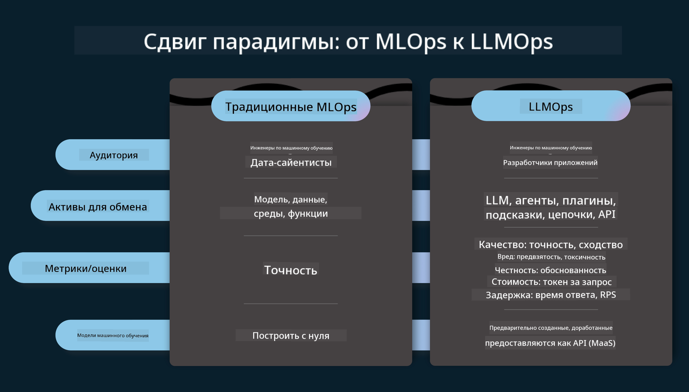
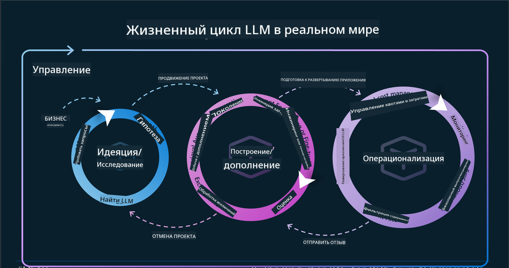
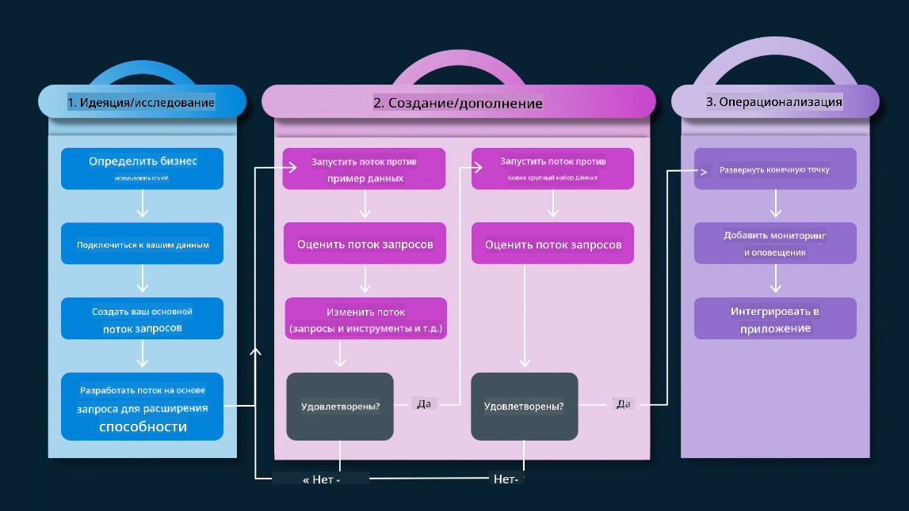
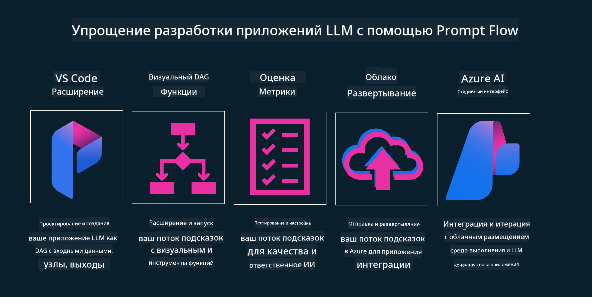

<!--
CO_OP_TRANSLATOR_METADATA:
{
  "original_hash": "27a5347a5022d5ef0a72ab029b03526a",
  "translation_date": "2025-05-19T23:19:09+00:00",
  "source_file": "14-the-generative-ai-application-lifecycle/README.md",
  "language_code": "ru"
}
-->

# Жизненный цикл приложения генеративного ИИ

Важный вопрос для всех приложений ИИ — это актуальность функций ИИ, так как ИИ — быстро развивающаяся область. Чтобы ваше приложение оставалось актуальным, надежным и устойчивым, вам нужно постоянно его мониторить, оценивать и улучшать. Здесь на помощь приходит жизненный цикл генеративного ИИ.

Жизненный цикл генеративного ИИ — это структура, которая помогает вам пройти этапы разработки, развертывания и поддержки приложения генеративного ИИ. Она помогает вам определить ваши цели, измерить производительность, выявить проблемы и внедрить решения. Также она помогает согласовать ваше приложение с этическими и правовыми стандартами вашей области и ваших заинтересованных сторон. Следуя жизненному циклу генеративного ИИ, вы можете гарантировать, что ваше приложение всегда приносит ценность и удовлетворяет пользователей.

## Введение

В этой главе вы:

- Поймете сдвиг парадигмы от MLOps к LLMOps
- Узнаете о жизненном цикле LLM
- Ознакомитесь с инструментами жизненного цикла
- Узнаете о метрификации и оценке жизненного цикла

## Поймите сдвиг парадигмы от MLOps к LLMOps

LLM — это новый инструмент в арсенале искусственного интеллекта, они невероятно мощны в задачах анализа и генерации для приложений, однако эта мощь имеет некоторые последствия для того, как мы оптимизируем задачи ИИ и классического машинного обучения.

С этим нам нужна новая парадигма, чтобы адаптировать этот инструмент в динамике, с правильными стимулами. Мы можем классифицировать старые приложения ИИ как "ML Apps", а новые приложения ИИ как "GenAI Apps" или просто "AI Apps", отражая основные технологии и методы, используемые в то время. Это изменяет наш подход во многих аспектах, взгляните на следующую сравнительную таблицу.

Обратите внимание, что в LLMOps мы больше сосредоточены на разработчиках приложений, используя интеграции как ключевой момент, применяя "Models-as-a-Service" и учитывая следующие аспекты для метрик.

- Качество: Качество ответа
- Вред: Ответственный ИИ
- Честность: Обоснованность ответа (Есть ли смысл? Это правильно?)
- Стоимость: Бюджет решения
- Задержка: Среднее время ответа на токен

## Жизненный цикл LLM

Во-первых, чтобы понять жизненный цикл и модификации, давайте рассмотрим следующую инфографику.

Как вы могли заметить, это отличается от обычных жизненных циклов MLOps. LLM имеют множество новых требований, таких как Промптинг, различные техники для улучшения качества (Fine-Tuning, RAG, Meta-Prompts), различные оценки и ответственность с ответственным ИИ, наконец, новые метрики оценки (Качество, Вред, Честность, Стоимость и Задержка).

Например, взгляните, как мы генерируем идеи. Используем инжиниринг промптов для экспериментов с различными LLM, чтобы исследовать возможности и проверить, может ли их гипотеза быть правильной.

Обратите внимание, что это не линейно, а интегрированные циклы, итеративные и с общим циклом.

Как мы можем исследовать эти шаги? Давайте подробнее рассмотрим, как можно построить жизненный цикл.

Это может выглядеть немного сложно, давайте сосредоточимся сначала на трех больших шагах.

1. Генерация идей/Исследование: Исследование, здесь мы можем исследовать в соответствии с нашими бизнес-потребностями. Прототипирование, создание [PromptFlow](https://microsoft.github.io/promptflow/index.html?WT.mc_id=academic-105485-koreyst) и тестирование, достаточно ли оно эффективно для нашей гипотезы.
2. Построение/Расширение: Реализация, теперь мы начинаем оценивать большие наборы данных, внедрять техники, такие как Fine-tuning и RAG, чтобы проверить устойчивость нашего решения. Если нет, повторная реализация, добавление новых шагов в наш поток или реструктуризация данных может помочь. После тестирования нашего потока и нашего масштаба, если это работает и проверяет наши метрики, оно готово к следующему шагу.
3. Операционализация: Интеграция, теперь добавляем системы мониторинга и оповещений в нашу систему, развертывание и интеграцию приложения в наше приложение.

Затем у нас есть общий цикл управления, сосредоточенный на безопасности, соблюдении требований и управлении.

Поздравляем, теперь ваше приложение ИИ готово к запуску и операционализации. Для практического опыта взгляните на [Демо чат Contoso.](https://nitya.github.io/contoso-chat/?WT.mc_id=academic-105485-koreys)

Теперь, какие инструменты мы могли бы использовать?

## Инструменты жизненного цикла

Для инструментов Microsoft предоставляет [Azure AI Platform](https://azure.microsoft.com/solutions/ai/?WT.mc_id=academic-105485-koreys) и [PromptFlow](https://microsoft.github.io/promptflow/index.html?WT.mc_id=academic-105485-koreyst), чтобы облегчить и сделать ваш цикл легким для реализации и готовым к запуску.

[Azure AI Platform](https://azure.microsoft.com/solutions/ai/?WT.mc_id=academic-105485-koreys) позволяет вам использовать [AI Studio](https://ai.azure.com/?WT.mc_id=academic-105485-koreys). AI Studio — это веб-портал, который позволяет вам исследовать модели, примеры и инструменты. Управление вашими ресурсами, потоками разработки UI и опциями SDK/CLI для разработки с приоритетом на код.

Azure AI позволяет вам использовать множество ресурсов для управления вашими операциями, услугами, проектами, поиском по векторам и потребностями в базах данных.

Создавайте от Proof-of-Concept(POC) до крупных приложений с PromptFlow:

- Проектируйте и создавайте приложения из VS Code, используя визуальные и функциональные инструменты
- Тестируйте и настраивайте ваши приложения для качественного ИИ с легкостью.
- Используйте Azure AI Studio для интеграции и итерации с облаком, Push и Deploy для быстрой интеграции.

## Отлично! Продолжайте обучение!

Потрясающе, теперь узнайте больше о том, как мы структурируем приложение для использования концепций с [Приложением чата Contoso](https://nitya.github.io/contoso-chat/?WT.mc_id=academic-105485-koreyst), чтобы проверить, как облачная адвокация добавляет эти концепции в демонстрации. Для получения дополнительного контента, ознакомьтесь с нашей [сессией на Ignite!
](https://www.youtube.com/watch?v=DdOylyrTOWg)

Теперь ознакомьтесь с уроком 15, чтобы понять, как [Генерация с дополнением извлечений и векторные базы данных](../15-rag-and-vector-databases/README.md?WT.mc_id=academic-105485-koreyst) влияют на генеративный ИИ и делают приложения более увлекательными!

**Отказ от ответственности**:  
Этот документ был переведен с использованием сервиса автоматического перевода [Co-op Translator](https://github.com/Azure/co-op-translator). Хотя мы стремимся к точности, пожалуйста, имейте в виду, что автоматические переводы могут содержать ошибки или неточности. Оригинальный документ на его родном языке следует считать авторитетным источником. Для получения критически важной информации рекомендуется профессиональный перевод человеком. Мы не несем ответственности за любые недоразумения или неправильные толкования, возникающие в результате использования этого перевода.