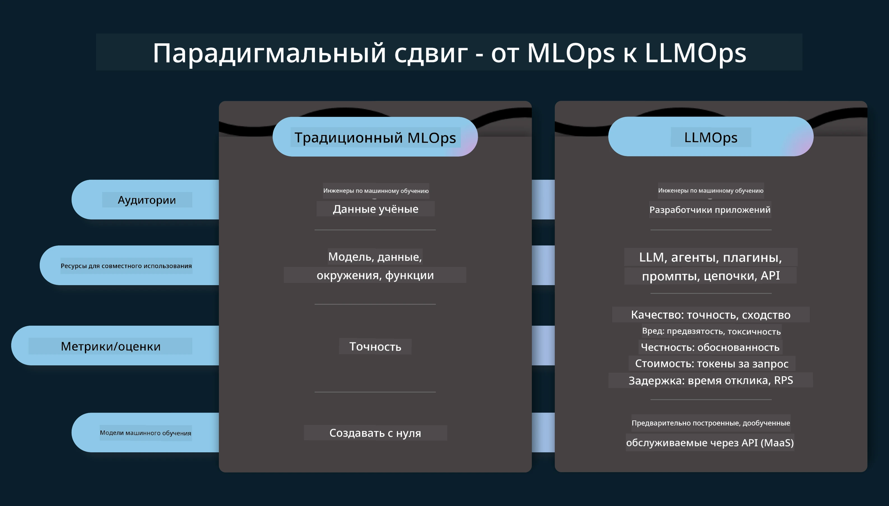
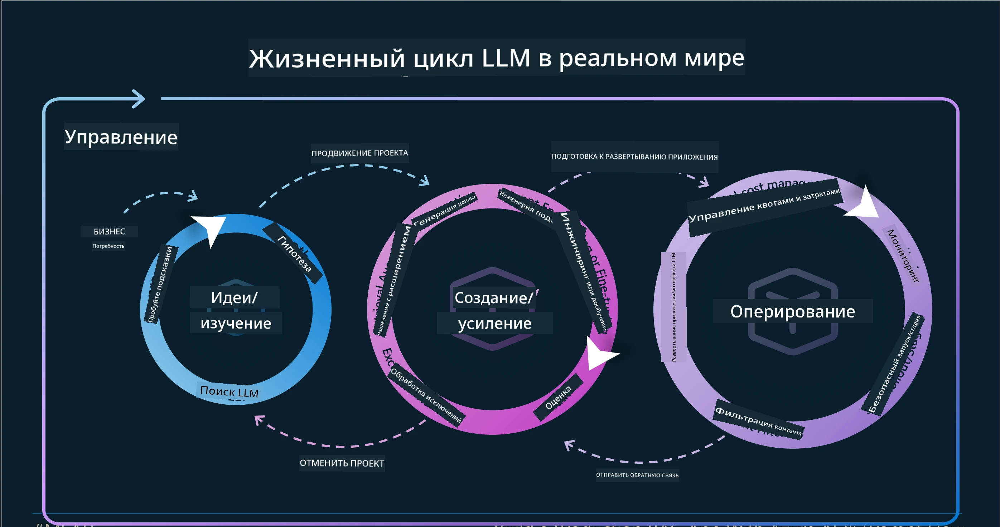
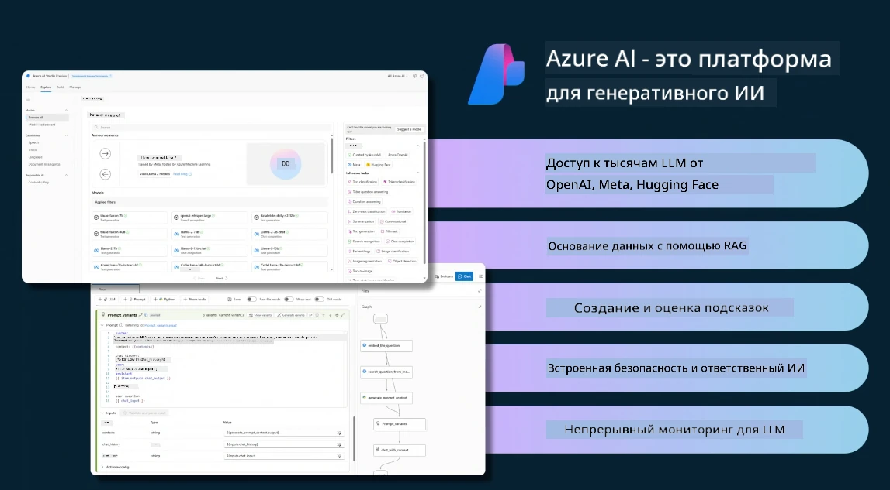
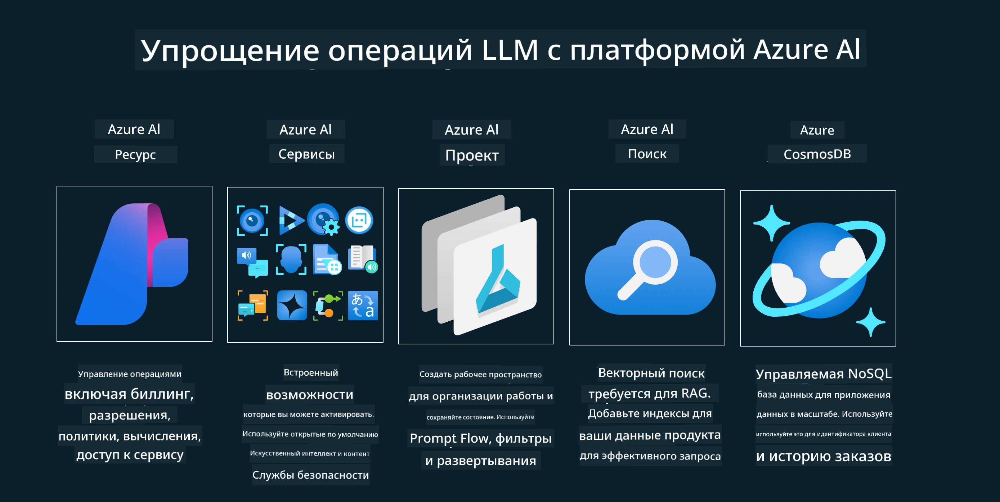
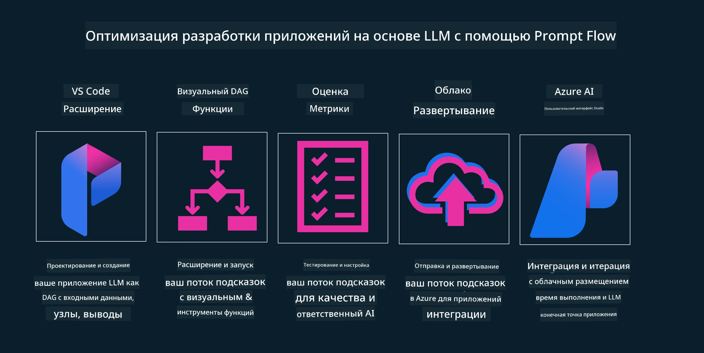

# Жизненный цикл приложения генеративного ИИ

Важный вопрос для всех ИИ-приложений — актуальность функций ИИ, так как ИИ — это быстроразвивающаяся область, чтобы ваше приложение оставалось актуальным, надежным и устойчивым, необходимо постоянно контролировать, оценивать и совершенствовать его. Здесь на помощь приходит жизненный цикл генеративного ИИ.

Жизненный цикл генеративного ИИ — это рамки, которые помогают вам пройти этапы разработки, развертывания и поддержки приложения генеративного ИИ. Он помогает определить цели, измерить показатели, выявить проблемы и реализовать решения. Он также помогает согласовать приложение с этическими и правовыми стандартами вашей области и заинтересованных сторон. Следуя жизненному циклу генеративного ИИ, вы можете гарантировать, что ваше приложение всегда приносит пользу и удовлетворяет пользователей.

## Введение

В этой главе вы:

- Поймёте парадигму сдвига от MLOps к LLMOps
- Ознакомитесь с жизненным циклом LLM
- Изучите инструменты жизненного цикла
- Узнаете о метрификации и оценке жизненного цикла

## Понимание сдвига парадигмы от MLOps к LLMOps

LLM — это новый инструмент в арсенале искусственного интеллекта, они невероятно мощны в задачах анализа и генерации для приложений, однако эта мощь имеет некоторые последствия для оптимизации задач ИИ и классического машинного обучения.

Из-за этого нам нужна новая парадигма, чтобы адаптировать этот инструмент динамично и с правильными стимулами. Мы можем разделить старые ИИ-приложения как "ML-приложения", а новые — как "GenAI приложения" или просто "ИИ-приложения", отражая основные технологии и методы, используемые в то время. Это сдвигает нашу точку зрения во многих аспектах, смотрите следующее сравнение.

Обратите внимание, что в LLMOps мы больше ориентированы на разработчиков приложений, используя интеграции как ключевой момент, применяя модель «Models-as-a-Service» и учитывая следующие показатели.

- Качество: качество ответа  
- Вред: ответственный ИИ  
- Честность: обоснованность ответа (Имеет смысл? Это правильно?)  
- Стоимость: бюджет решения  
- Задержка: среднее время ответа на токен  

## Жизненный цикл LLM

Для начала, чтобы понять жизненный цикл и изменения, обратимся к следующей инфографике.

Как видите, это отличается от обычных жизненных циклов MLOps. LLM имеют множество новых требований, таких как запросы (Prompting), различные методы улучшения качества (тонкая настройка, RAG, мета-запросы), различные оценки и ответственность в ответственном ИИ, наконец, новые метрики оценки (качество, вред, честность, стоимость и задержка).

Например, посмотрите, как мы идейно генерируем. Используя инженеринг запросов, мы экспериментируем с различными LLM, чтобы исследовать возможности и проверить, верна ли их гипотеза.

Обратите внимание, что это не линейно, а интегрированные циклы, итеративные и с общим циклом сверху.

Как мы можем исследовать эти шаги? Давайте подробнее рассмотрим, как построить жизненный цикл.

Это может показаться немного сложным, давайте сосредоточимся сначала на трёх основных шагах.

1. Идея/Исследование: Исследование, здесь мы изучаем решения в соответствии с бизнес-потребностями. Прототипирование, создание [PromptFlow](https://microsoft.github.io/promptflow/index.html?WT.mc_id=academic-105485-koreyst) и проверка его эффективности для нашей гипотезы.  
2. Разработка/Усиление: Реализация, теперь мы начинаем оценивать на больших наборах данных, используем техники, такие как тонкая настройка и RAG, чтобы проверить устойчивость решения. Если нет — повторно реализуем, добавляем шаги или реструктурируем данные. После тестирования и проверки показателей, если всё работает — переход к следующему этапу.  
3. Эксплуатация: Интеграция, добавляем системы мониторинга и оповещений, развертывание и интеграцию с приложением.

Далее идёт общий цикл управления, с акцентом на безопасность, соответствие и управление.

Поздравляем, теперь ваше ИИ-приложение готово к работе и эксплуатации. Для практического опыта посмотрите [демо Contoso Chat.](https://nitya.github.io/contoso-chat/?WT.mc_id=academic-105485-koreyst)

Какие инструменты мы можем использовать?

## Инструменты жизненного цикла

Для инструментов Microsoft предоставляет [Azure AI Platform](https://azure.microsoft.com/solutions/ai/?WT.mc_id=academic-105485-koreyst), а [PromptFlow](https://microsoft.github.io/promptflow/index.html?WT.mc_id=academic-105485-koreyst) упрощают и делают ваш цикл легким для реализации и запуска.

[Платформа Azure AI](https://azure.microsoft.com/solutions/ai/?WT.mc_id=academic-105485-koreyst) позволяет использовать [AI Studio](https://ai.azure.com/?WT.mc_id=academic-105485-koreyst). AI Studio — это веб-портал, который позволяет исследовать модели, образцы и инструменты, управлять ресурсами, UI разработкой потоков и SDK/CLI опциями для кода в первую очередь.

Azure AI позволяет использовать множество ресурсов для управления операциями, сервисами, проектами, векторными поисками и базами данных.

Строительство, от Proof-of-Concept (POC) до крупных приложений с PromptFlow:

- Проектирование и создание приложений из VS Code, с визуальными и функциональными инструментами  
- Тестирование и тонкая настройка приложений для качественного ИИ, легко  
- Используйте Azure AI Studio для интеграции и итераций с облаком, быстрый пуш и развертывание для быстрой интеграции  

## Отлично! Продолжайте обучение!

Отлично, теперь изучите подробнее, как структурировать приложение для использования концепций на примере [Contoso Chat App](https://nitya.github.io/contoso-chat/?WT.mc_id=academic-105485-koreyst), чтобы увидеть, как Cloud Advocacy внедряет эти концепции в демонстрациях. Для дополнительного контента смотрите нашу [сессию Ignite!](https://www.youtube.com/watch?v=DdOylyrTOWg)

Теперь перейдите к уроку 15, чтобы понять, как [Retrieval Augmented Generation и Векторные базы данных](../15-rag-and-vector-databases/README.md?WT.mc_id=academic-105485-koreyst) влияют на генеративный ИИ и помогают создавать более увлекательные приложения!

---

<!-- CO-OP TRANSLATOR DISCLAIMER START -->
**Отказ от ответственности**:  
Этот документ был переведен с использованием сервиса автоматического перевода [Co-op Translator](https://github.com/Azure/co-op-translator). Несмотря на то, что мы стремимся к точности, просим учитывать, что автоматические переводы могут содержать ошибки или неточности. Оригинальный документ на исходном языке следует считать авторитетным источником. Для важной информации рекомендуется прибегать к профессиональному переводу человеком. Мы не несем ответственности за любые недоразумения или неправильные толкования, возникшие в результате использования данного перевода.
<!-- CO-OP TRANSLATOR DISCLAIMER END -->